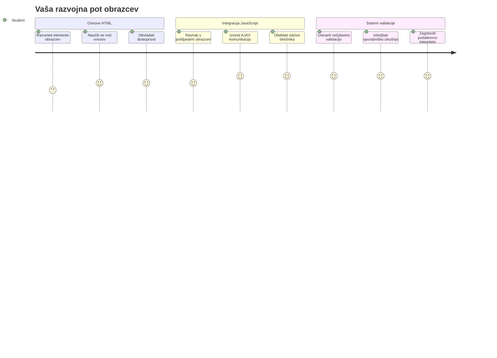
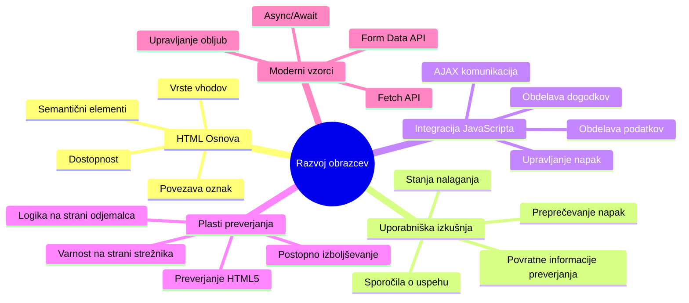
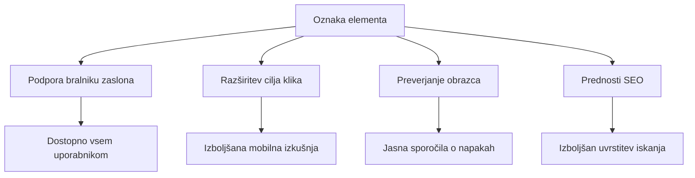
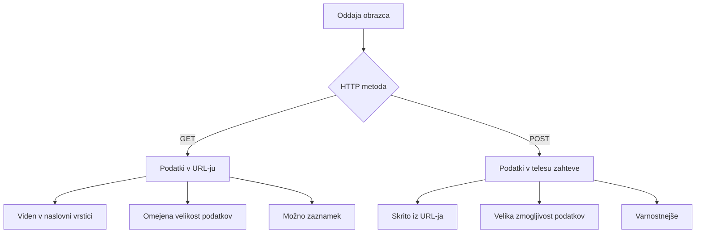
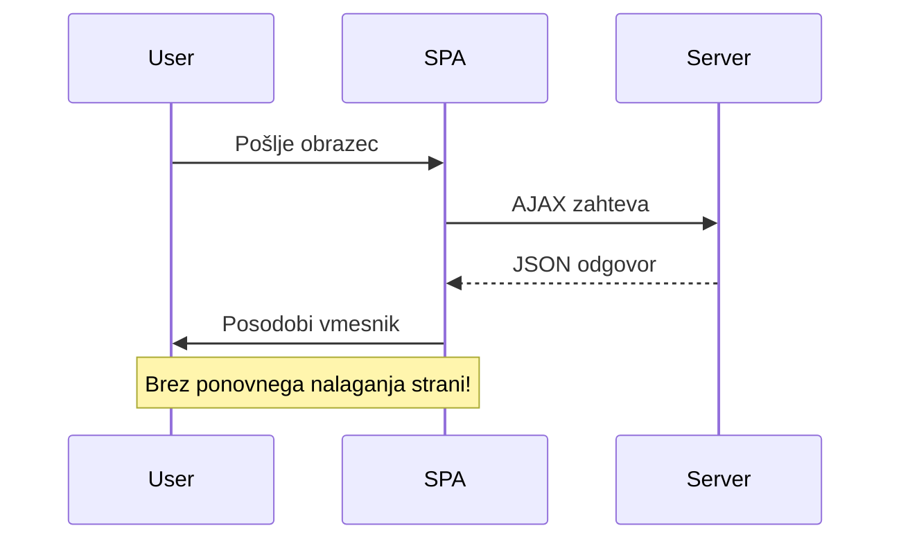
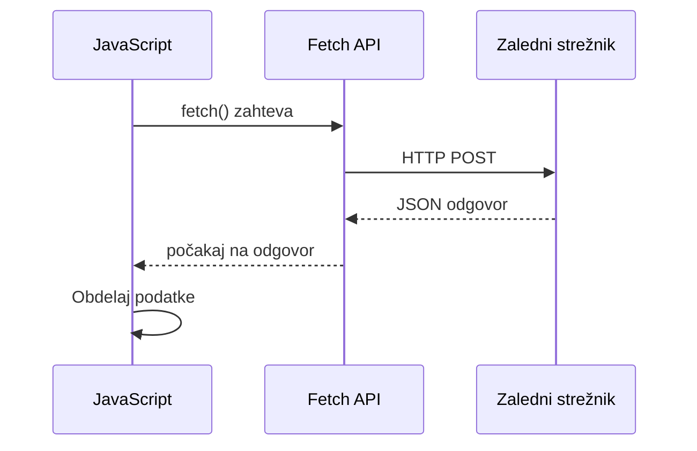
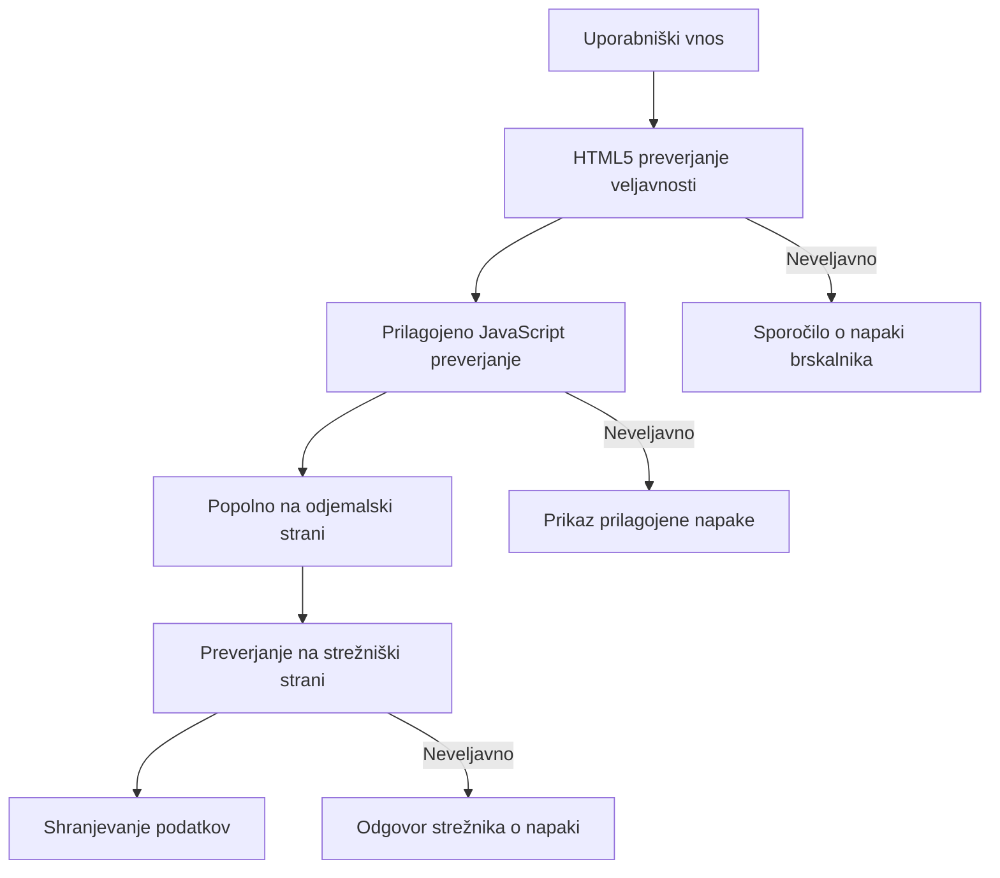
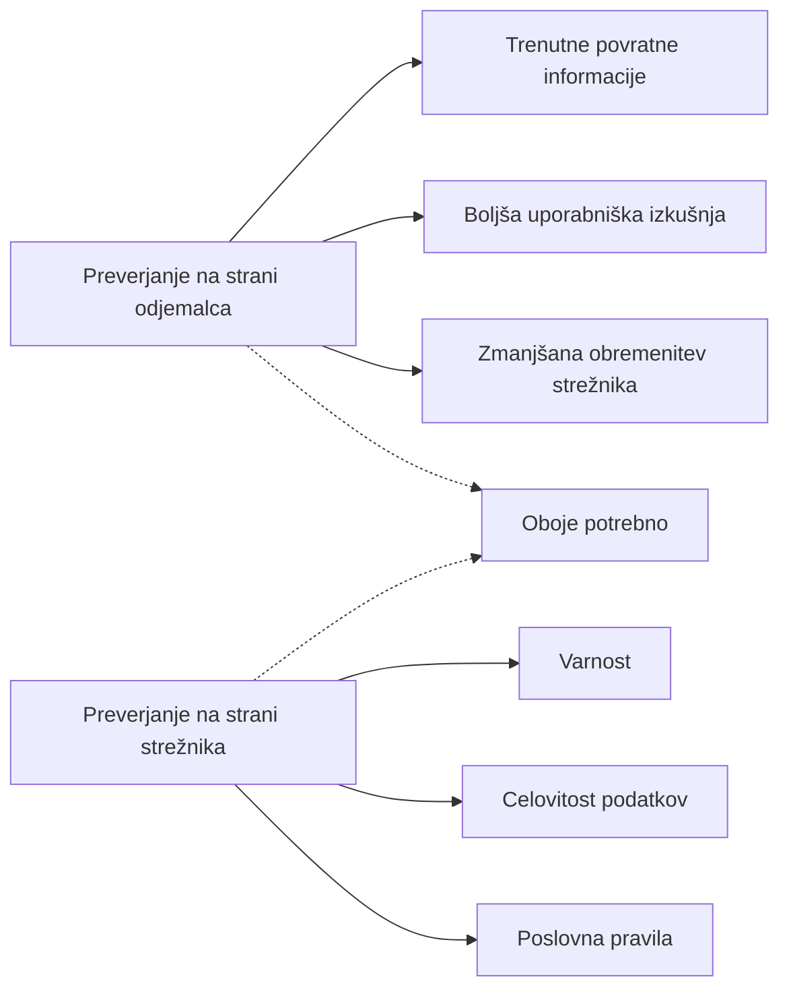
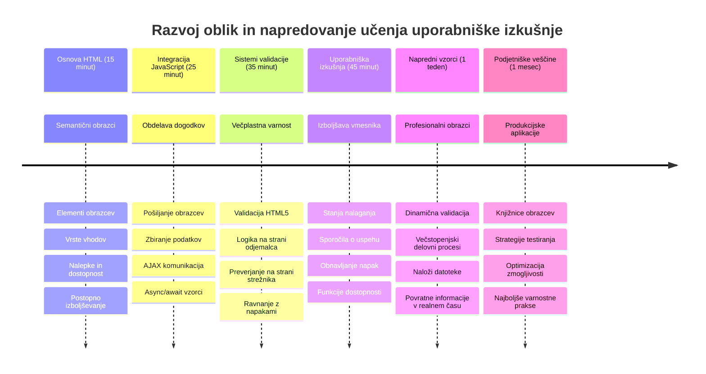

<!--
CO_OP_TRANSLATOR_METADATA:
{
  "original_hash": "7cbdbd132d39a2bb493e85bc2a9387cc",
  "translation_date": "2026-01-07T10:18:57+00:00",
  "source_file": "7-bank-project/2-forms/README.md",
  "language_code": "sl"
}
-->
# Izdelava bančne aplikacije, del 2: Izdelava prijavne in registracijske forme


## Predpredavanje kviz

[Predpredavanje kviz](https://ff-quizzes.netlify.app/web/quiz/43)

Ste že kdaj izpolnili spletni obrazec in vam je ta zavrnil format e-pošte? Ali pa ste izgubili vse informacije, ko ste kliknili Pošlji? Vsi smo že naleteli na te frustrirajoče izkušnje.

Obrazci so most med vašimi uporabniki in funkcionalnostjo vaše aplikacije. Tako kot skrbni protokoli zračnih nadzornikov varno usmerjajo letala do njihovih destinacij, dobro zasnovani obrazci zagotavljajo jasne povratne informacije in preprečujejo drage napake. Slabi obrazci pa lahko uporabnike odvrnejo hitreje kot nesporazum na prometnem letališču.

V tej lekciji bomo vaš statični bančni aplikaciji dodali interaktivnost. Naučili se boste izdelati obrazce, ki preverjajo uporabniški vnos, komunicirajo s strežniki in nudijo koristne povratne informacije. Razmislite o tem kot o izdelavi kontrolnega vmesnika, ki omogoča uporabnikom navigacijo med funkcijami vaše aplikacije.

Na koncu boste imeli popoln sistem prijave in registracije z validacijo, ki uporabnike vodi k uspehu namesto do frustracij.


## Predpogoji

Preden začnemo z izdelavo obrazcev, preverimo, da imate vse pravilno nastavljeno. Ta lekcija se nadaljuje tam, kjer smo končali v prejšnji, zato, če ste šli naprej, se boste morda želeli vrniti in najprej usposobiti osnove.

### Zahtevana nastavitev

| Komponenta | Status | Opis |
|-----------|--------|-------------|
| [HTML Predloge](../1-template-route/README.md) | ✅ Zahtevano | Osnovna struktura vaše bančne aplikacije |
| [Node.js](https://nodejs.org) | ✅ Zahtevano | JavaScript izvajanje na strežniku |
| [Bank API Strežnik](../api/README.md) | ✅ Zahtevano | Služba za shranjevanje podatkov v ozadju |

> 💡 **Nasvet za razvoj**: Hkrati boste poganjali dva ločena strežnika – enega za vašo front-end bančno aplikacijo in drugega za API v ozadju. Ta nastavitev odraža resnični razvoj, kjer front-end in back-end delujeta neodvisno.

### Konfiguracija strežnika

**Vaše razvojno okolje bo vključevalo:**
- **Front-end strežnik**: Streže vašo bančno aplikacijo (običajno port `3000`)
- **Back-end API strežnik**: Upravljanje shranjevanja in pridobivanja podatkov (port `5000`)
- **Oba strežnika** lahko tečeta istočasno brez konfliktov

**Testiranje povezave z API:**
```bash
curl http://localhost:5000/api
# Pričakovan odgovor: "Bank API v1.0.0"
```

**Če vidite odgovor z verzijo API-ja, ste pripravljeni za nadaljevanje!**

---

## Razumevanje HTML obrazcev in kontrol

HTML obrazci so način, kako uporabniki komunicirajo z vašo spletno aplikacijo. Razmislite o njih kot o telegrafskem sistemu, ki je v 19. stoletju povezoval oddaljena mesta – so komunikacijski protokol med uporabniško namero in odzivom aplikacije. Če so premišljeno zasnovani, ujamejo napake, vodijo pri oblikovanju vnosa in nudijo koristne predloge.

Sodobni obrazci so bistveno bolj sofisticirani kot osnovni tekstovni vnosi. HTML5 je uvedel specializirane tipe vnosov, ki samodejno obravnavajo preverjanje elektronske pošte, oblikovanje številk in izbiro datuma. Te izboljšave koristijo tako dostopnosti kot uporabniški izkušnji na mobilnih napravah.

### Osnovni elementi obrazca

**Gradniki, ki jih vsak obrazec potrebuje:**

```html
<!-- Basic form structure -->
<form id="userForm" method="POST">
  <label for="username">Username</label>
  <input id="username" name="username" type="text" required>
  
  <button type="submit">Submit</button>
</form>
```

**Kaj ta koda počne:**
- **Ustvari** vsebnik obrazca z edinstvenim identifikatorjem
- **Določi** HTTP metodo za pošiljanje podatkov
- **Poveže** oznake z vnosi za dostopnost
- **Določi** gumb za pošiljanje obrazca

### Sodobni tipi vhodov in atributi

| Tip vnosa | Namen | Primer uporabe |
|------------|---------|---------------|
| `text` | Splošen vnos besedila | `<input type="text" name="username">` |
| `email` | Preverjanje elektronske pošte | `<input type="email" name="email">` |
| `password` | Skrit vnos besedila | `<input type="password" name="password">` |
| `number` | Številčni vnos | `<input type="number" name="balance" min="0">` |
| `tel` | Telefonske številke | `<input type="tel" name="phone">` |

> 💡 **Prednost sodobnega HTML5**: Uporaba specifičnih tipov vnosa zagotavlja avtomatsko validacijo, primerne mobilne tipkovnice in boljšo podporo dostopnosti brez dodatnega JavaScripta!

### Tipi in vedenja gumbov

```html
<!-- Different button behaviors -->
<button type="submit">Save Data</button>     <!-- Submits the form -->
<button type="reset">Clear Form</button>    <!-- Resets all fields -->
<button type="button">Custom Action</button> <!-- No default behavior -->
```

**Kaj počne vsak tip gumba:**
- **Gumbi za pošiljanje (submit)**: Sprožijo oddajo obrazca in pošljejo podatke na določen naslov
- **Gumbi za ponastavitev (reset)**: Ponastavijo vsa polja obrazca na začetno stanje
- **Navadni gumbi (button)**: Nimajo privzetega vedenja, potrebujejo lastno JavaScript funkcionalnost

> ⚠️ **Pomembna opomba**: `<input>` element je samozapiralni in ne potrebuje zaključnega taga. Sodobna praksa je napisati `<input>` brez poševnice.

### Izdelava prijavne forme

Zdaj ustvarimo praktično prijavno formo, ki prikazuje sodobne prakse HTML obrazcev. Začeli bomo s preprosto strukturo in postopoma nadgrajevali z dostopnostjo ter validacijo.

```html
<template id="login">
  <h1>Bank App</h1>
  <section>
    <h2>Login</h2>
    <form id="loginForm" novalidate>
      <div class="form-group">
        <label for="username">Username</label>
        <input id="username" name="user" type="text" required 
               autocomplete="username" placeholder="Enter your username">
      </div>
      <button type="submit">Login</button>
    </form>
  </section>
</template>
```

**Kaj se tukaj dogaja:**
- **Strukturira** formo z semantičnimi elementi HTML5
- **Skupina** sorodnih elementov z `div` vsebniki in smiselno razrednimi oznakami
- **Poveže** oznake z vnosi prek atributov `for` in `id`
- **Vključi** sodobne atribute, kot sta `autocomplete` in `placeholder` za boljšo UX
- **Doda** `novalidate` za upravljanje validacije z JavaScriptom namesto privzetih brskalniških

### Moč pravilnih oznak (label)

**Zakaj so oznake pomembne za sodoben spletni razvoj:**


**Kaj pravilne oznake omogočajo:**
- **Omogočajo** bralnikom zaslona jasen napoved obrazčnih polj
- **Razširijo** klikljivo območje (klik na oznako fokusira vhod)
- **Izboljšajo** mobilno uporabnost z večjimi cilji za dotik
- **Podpirajo** validacijo z obrazcem z uporabnimi sporočili o napaki
- **Izboljšajo** SEO, ker dajejo semantičen pomen elementom obrazca

> 🎯 **Cilj dostopnosti**: Vsakemu polju v obrazcu mora biti priložena ustrezna oznaka. Ta preprosta praksa omogoča uporabo obrazcev vsem, tudi uporabnikom z omejitvami, in izboljša izkušnjo za vse.

### Izdelava registracijske forme

Registracijski obrazec zahteva bolj podrobne podatke za ustvarjanje popolnega uporabniškega računa. Naredimo ga z uporabo modernih funkcij HTML5 in izboljšane dostopnosti.

```html
<hr/>
<h2>Register</h2>
<form id="registerForm" novalidate>
  <div class="form-group">
    <label for="user">Username</label>
    <input id="user" name="user" type="text" required 
           autocomplete="username" placeholder="Choose a username">
  </div>
  
  <div class="form-group">
    <label for="currency">Currency</label>
    <input id="currency" name="currency" type="text" value="$" 
           required maxlength="3" placeholder="USD, EUR, etc.">
  </div>
  
  <div class="form-group">
    <label for="description">Account Description</label>
    <input id="description" name="description" type="text" 
           maxlength="100" placeholder="Personal savings, checking, etc.">
  </div>
  
  <div class="form-group">
    <label for="balance">Starting Balance</label>
    <input id="balance" name="balance" type="number" value="0" 
           min="0" step="0.01" placeholder="0.00">
  </div>
  
  <button type="submit">Create Account</button>
</form>
```

**V zgornjem smo:**
- **Organizirali** vsako polje v vsebnike `div` za boljšo obliko in postavitev
- **Dodali** primerne atribute `autocomplete` za podporo samodokončanju v brskalniku
- **Vključili** koristno pomocno tekstovno vsebino (`placeholder`), ki vodi uporabnika
- **Nastavili** razumne privzete vrednosti s pomočjo atributa `value`
- **Uporabljali** atribute za validacijo, kot so `required`, `maxlength` in `min`
- **Uporabljali** tip `number` za polje za stanje s podporo decimalnim številkam

### Raziščimo tipe vhodov in vedenja

**Sodobni tipi vhodov nudijo izboljšano funkcionalnost:**

| Funkcija | Prednost | Primer |
|---------|---------|----------|
| `type="number"` | Numerična tipkovnica na mobilnem | Lažji vnos stanja |
| `step="0.01"` | Nadzor decimalne natančnosti | Dovoljuje cente v valuti |
| `autocomplete` | Samodokončanje brskalnika | Hitrejše izpolnjevanje obrazca |
| `placeholder` | Kontekstualni namigi | Usmerjanje pričakovanj uporabnika |

> 🎯 **Izziv za dostopnost**: Poskusite krmariti po obrazcu samo z uporabo tipkovnice! Uporabite `Tab` za premikanje med polji, `Space` za izbiro potrditvenih polj in `Enter` za oddajo. To vam pomaga razumeti, kako uporabniki bralnikov zaslona komunicirajo z obrazci.

### 🔄 **Pedagoška preveritev**
**Razumevanje osnov obrazcev**: Preden začnete z JavaScriptom, se prepričajte:
- ✅ Kako semantični HTML ustvarja dostopne strukture obrazcev
- ✅ Zakaj so tipi vhodov pomembni za mobilne tipkovnice in validacijo
- ✅ Razmerje med oznakami in kontrolami obrazca
- ✅ Kako atributi obrazca vplivajo na privzeto vedenje brskalnika

**Hiter samopreizkus**: Kaj se zgodi, če oddate obrazec brez JavaScript upravljanja?
*Odgovor: Brskalnik izvede privzeto oddajo, ponavadi preusmeri na URL iz atributa action*

**Prednosti HTML5 obrazcev**: Sodobni obrazci nudijo:
- **Vgrajeno validacijo**: Samodejno preverjanje e-pošte in številk
- **Mobilno optimizacijo**: Pravilne tipkovnice za različne tipe vnosov
- **Dostopnost**: Podporo bralnikov zaslona in navigacijo s tipkovnico
- **Postopen razvoj**: Deluje tudi, če je JavaScript onemogočen

## Razumevanje metod za oddajo obrazca

Ko nekdo izpolni vaš obrazec in klikne pošlji, morajo ti podatki nekam priti – ponavadi na strežnik, ki jih lahko shrani. Obstajata dva osnovna načina, kako se to lahko zgodi, in vedeti, kateri uporabiti, vas lahko kasneje reši glavobolov.

Poglejmo, kaj se dejansko zgodi, ko nekdo klikne gumb za pošiljanje.

### Privzeto vedenje obrazca

Najprej opazimo, kaj se zgodi pri osnovni oddaji obrazca:

**Preizkusite vaše trenutne obrazce:**
1. Kliknite gumb *Registriraj* v obrazcu
2. Opazujte spremembe v naslovni vrstici brskalnika
3. Ugotovite, kako se stran osveži in podatki pokažejo v URL-ju


### Primerjava HTTP metod


**Razumevanje razlik:**

| Metoda | Uporaba | Lokacija podatkov | Stopnja varnosti | Omejitev velikosti |
|--------|----------|---------------|----------------|-------------|
| `GET` | Iskalna povpraševanja, filtri | Parametri v URL-ju | Nizka (vidno) | ~2000 znakov |
| `POST` | Uporabniški računi, občutljivi podatki | Vsebina zahteve (body) | Višja (skrito) | Brez praktične omejitve |

**Razumevanje osnovnih razlik:**
- **GET**: Dodaja podatke iz obrazca v URL kot poizvedbene parametre (primeren za iskalne operacije)
- **POST**: Vključuje podatke v telo zahteve (nujno za občutljive informacije)
- **Omejitve GET**: Omejitve velikosti, vidni podatki, trajna zgodovina brskalnika
- **Prednosti POST**: Velika kapaciteta podatkov, zaščita zasebnosti, podpora za nalaganje datotek

> 💡 **Najboljša praksa**: Za iskalne obrazce in filtre uporabite `GET` (pridobivanje podatkov), za registracijo uporabnikov, prijavo in ustvarjanje podatkov uporabite `POST`.

### Konfiguracija oddaje obrazca

Nastavimo vaš registracijski obrazec, da komunicira pravilno z backend API z uporabo metode POST:

```html
<form id="registerForm" action="//localhost:5000/api/accounts" 
      method="POST" novalidate>
```

**Kaj ta nastavitev počne:**
- **Usmeri** oddajo obrazca na vaš API naslov
- **Uporabi** metodo POST za varno prenašanje podatkov
- **Vključi** `novalidate` za upravljanje validacije z JavaScriptom

### Testiranje oddaje obrazca

**Sledite tem korakom za test obrazca:**
1. **Izpolnite** registracijski obrazec z vašimi podatki
2. **Kliknite** gumb "Ustvari račun"
3. **Opazujte** odgovor strežnika v brskalniku


**Kaj bi morali videti:**
- **Brskalnik preusmeri** na URL API končne točke
- **JSON odgovor** vsebuje podatke vašega novega računa
- **Potrditev strežnika**, da je bil račun uspešno ustvarjen

> 🧪 **Čas za poskus**: Poskusite se ponovno registrirati z istim uporabniškim imenom. Kakšen odgovor prejmete? To vam pomaga razumeti, kako strežnik ravna z dvojnimi podatki in napakami.

### Razumevanje JSON odgovorov

**Ko strežnik uspešno obdela vaš obrazec:**
```json
{
  "user": "john_doe",
  "currency": "$",
  "description": "Personal savings",
  "balance": 100,
  "id": "unique_account_id"
}
```

**Ta odgovor potrjuje:**
- **Ustvari** nov račun z vnesenimi podatki
- **Dodeli** edinstveno identifikacijo za prihodnjo uporabo
- **Vrne** vse podatke o računu za preverjanje
- **Nakazuje** uspešno shranjevanje v bazo podatkov

## Sodobno upravljanje obrazcev z JavaScriptom

Tradicionalna oddaja obrazcev povzroči popolno osvežitev strani, podobno kot so rane vesoljske misije zahtevale popolne ponastavitve sistema za korekcije tečajev. Ta način moti uporabniško izkušnjo in izgublja stanje aplikacije.

JavaScript upravljanje obrazcev deluje kot kontinuirani vodilni sistemi sodobnih vesoljskih plovil – izvaja realnočasovne prilagoditve brez izgube navigacijskega konteksta. Lahko prestrežemo oddaje obrazcev, ponudimo takojšne povratne informacije, obravnavamo napake prijazno in posodobimo vmesnik glede na odzive strežnika, hkrati pa ohranimo uporabnikovo pozicijo v aplikaciji.

### Zakaj se izogibati osvežitvam strani?


**Prednosti JavaScript upravljanja obrazcev:**
- **Ohranja** stanje aplikacije in kontekst uporabnika
- **Nudi** takojšne povratne informacije in indikatorje nalaganja
- **Omogoča** dinamično obravnavo napak in validacijo
- **Ustvarja** gladke in aplikacijske uporabniške izkušnje
- **Dovoljuje** pogojno logiko na podlagi strežniških odzivov

### Prehod od tradicionalnega k sodobnemu

**Izzivi tradicionalnega pristopa:**
- **Preusmerja** uporabnike proč iz aplikacije
- **Izgublja** trenutno stanje in kontekst aplikacije
- **Zahteva** popolno osvežitev strani za preproste operacije
- **Nudi** omejen nadzor nad povratnimi informacijami uporabnika

**Prednosti sodobnega JavaScript pristopa:**
- **Ohranja** uporabnike znotraj vaše aplikacije
- **Ohranja** vse stanje in podatke aplikacije
- **Omogoča** validacijo in povratne informacije v realnem času
- **Podpira** postopno nadgradnjo in dostopnost

### Implementacija JavaScript upravljanja obrazcev

Zamenjajmo tradicionalno oddajo obrazca z modernim upravljanjem dogodkov v JavaScriptu:

```html
<!-- Remove the action attribute and add event handling -->
<form id="registerForm" method="POST" novalidate>
```

**Dodajte registracijsko logiko v vašo datoteko `app.js`:**

```javascript
// Sodobno upravljanje obrazcev, ki temelji na dogodkih
function register() {
  const registerForm = document.getElementById('registerForm');
  const formData = new FormData(registerForm);
  const data = Object.fromEntries(formData);
  const jsonData = JSON.stringify(data);
  
  console.log('Form data prepared:', data);
}

// Pripni poslušalca dogodkov ob nalaganju strani
document.addEventListener('DOMContentLoaded', () => {
  const registerForm = document.getElementById('registerForm');
  registerForm.addEventListener('submit', (event) => {
    event.preventDefault(); // Prepreči privzeto pošiljanje obrazca
    register();
  });
});
```

**Kaj se tukaj dogaja:**
- **Prepreči** standardno oddajo obrazca z `event.preventDefault()`
- **Pridobi** element obrazca z uporabo sodobnega DOM iskanja
- **Izvleče** podatke obrazca z zmogljivim API-jem `FormData`
- **Pretvori** `FormData` v običajen objekt s `Object.fromEntries()`
- **Serijalizira** podatke v JSON format za komunikacijo s strežnikom
- **Zabeleži** obdelane podatke za odpravljanje napak in preverjanje

### Razumevanje FormData API

**FormData API nudi zmogljivo upravljanje obrazcev:**
```javascript
// Primer, kaj zajema FormData
const formData = new FormData(registerForm);

// FormData samodejno zajema:
// {
//   "user": "john_doe",
//   "currency": "$",
//   "description": "Osebni račun",
//   "balance": "100"
// }
```

**Prednosti FormData API:**
- **Celovita zbirka**: Zajema vse elemente obrazca, vključno z besedilom, datotekami in zapletenimi vnosi
- **Zavedanje tipov**: Samodejno upravlja z različnimi tipi vnosov brez lastne kode
- **Učinkovitost**: Odpravlja ročno zbiranje polj z enim klicem API
- **Prilagodljivost**: Ohranitev funkcionalnosti ob evoluciji strukture obrazca

### Ustvarjanje funkcije za komunikacijo s strežnikom

Zgradimo zdaj robustno funkcijo za komunikacijo z vašim API strežnikom z uporabo sodobnih vzorcev JavaScripta:

```javascript
async function createAccount(account) {
  try {
    const response = await fetch('//localhost:5000/api/accounts', {
      method: 'POST',
      headers: { 
        'Content-Type': 'application/json',
        'Accept': 'application/json'
      },
      body: account
    });
    
    // Preverite, ali je bil odgovor uspešen
    if (!response.ok) {
      throw new Error(`HTTP error! status: ${response.status}`);
    }
    
    return await response.json();
  } catch (error) {
    console.error('Account creation failed:', error);
    return { error: error.message || 'Network error occurred' };
  }
}
```

**Razumevanje asinhronega JavaScripta:**


**Kaj ta sodobna implementacija omogoča:**
- **Uporablja** `async/await` za berljivo asinhrono kodo
- **Vključuje** pravilno ravnanje z napakami s try/catch bloki
- **Preverja** status odziva pred obdelavo podatkov
- **Nastavi** ustrezne glave za komunikacijo z JSON
- **Nudi** podrobna sporočila o napakah za lažje odpravljanje
- **Vrača** dosledno podatkovno strukturo za uspešne in napake primere

### Moč sodobnega Fetch API

**Prednosti Fetch API pred starejšimi metodami:**

| Lastnost | Korist | Implementacija |
|---------|---------|----------------|
| Osnova na promisu | Čista asinhrona koda | `await fetch()` |
| Prilagoditev zahtev | Poln nadzor HTTP | Glave, metode, telo |
| Ravnanje z odzivom | Prilagodljivo razčlenjevanje podatkov | `.json()`, `.text()`, `.blob()` |
| Ravnanje z napakami | Celovit zajem napak | Try/catch bloki |

> 🎥 **Izvedite več**: [Async/Await Tutorial](https://youtube.com/watch?v=YwmlRkrxvkk) - Razumevanje asinhronih vzorcev JavaScripta za sodoben spletni razvoj.

**Ključni pojmi za komunikacijo s strežnikom:**
- **Asinhrone funkcije** omogočajo začasno ustavitev izvajanja, da počakajo na odziv strežnika
- **Ključna beseda await** naredi asinhrono kodo berljivo kot sinhrono
- **Fetch API** zagotavlja sodobne, na promisu osnovane HTTP zahteve
- **Ravnanje z napakami** zagotavlja, da vaša aplikacija lepo reagira na omrežne težave

### Zaključek funkcije za registracijo

Združimo vse skupaj v popolno, produkcijsko pripravljeno funkcijo za registracijo:

```javascript
async function register() {
  const registerForm = document.getElementById('registerForm');
  const submitButton = registerForm.querySelector('button[type="submit"]');
  
  try {
    // Prikaži stanje nalaganja
    submitButton.disabled = true;
    submitButton.textContent = 'Creating Account...';
    
    // Obdelaj podatke obrazca
    const formData = new FormData(registerForm);
    const jsonData = JSON.stringify(Object.fromEntries(formData));
    
    // Pošlji na strežnik
    const result = await createAccount(jsonData);
    
    if (result.error) {
      console.error('Registration failed:', result.error);
      alert(`Registration failed: ${result.error}`);
      return;
    }
    
    console.log('Account created successfully!', result);
    alert(`Welcome, ${result.user}! Your account has been created.`);
    
    // Ponastavi obrazec po uspešni registraciji
    registerForm.reset();
    
  } catch (error) {
    console.error('Unexpected error:', error);
    alert('An unexpected error occurred. Please try again.');
  } finally {
    // Obnovi stanje gumba
    submitButton.disabled = false;
    submitButton.textContent = 'Create Account';
  }
}
```

**Ta izboljšana implementacija vključuje:**
- **Nudi** vizualno povratno informacijo med pošiljanjem obrazca
- **Onemogoči** gumb za oddajo, da prepreči podvajanje pošiljanj
- **Upravljanja** tako pričakovanih kot nepričakovanih napak na eleganten način
- **Prikazuje** uporabniku prijazna sporočila o uspehu in napaki
- **Ponastavi** obrazec po uspešni registraciji
- **Obnavlja** stanje vmesnika ne glede na izid

### Testiranje vaše implementacije

**Odprite orodja za razvijalce v brskalniku in preizkusite registracijo:**

1. **Odprite** konzolo brskalnika (F12 → zavihek Console)
2. **Izpolnite** registracijski obrazec
3. **Kliknite** "Create Account"
4. **Opazujte** sporočila v konzoli in povratne informacije za uporabnika


**Kaj bi morali videti:**
- **Stanje nalaganja** se pojavi na gumbu za oddajo
- **Dnevniki konzole** prikazujejo podrobne informacije o procesu
- **Sporočilo o uspehu** se prikaže, če registracija uspe
- **Obrazec se samodejno ponastavi** po uspešnem oddaji

> 🔒 **Varnostna opomba**: Trenutno podatki potujejo prek HTTP, kar ni varno za produkcijo. V resničnih aplikacijah vedno uporabite HTTPS za šifriranje prenosa podatkov. Izvedite več o [HTTPS varnosti](https://en.wikipedia.org/wiki/HTTPS) in zakaj je ključnega pomena za zaščito uporabniških podatkov.

### 🔄 **Pedagoški pregled**
**Integracija sodobnega JavaScripta**: Preverite svoje razumevanje asinhrone obdelave obrazcev:
- ✅ Kako `event.preventDefault()` spremeni privzeto vedenje obrazca?
- ✅ Zakaj je FormData API bolj učinkovit kot ročno zbiranje polj?
- ✅ Kako vzorci async/await izboljšajo berljivost kode?
- ✅ Kakšno vlogo igra ravnanje z napakami v uporabniški izkušnji?

**Sistemska arhitektura**: Vaša obdelava obrazcev prikazuje:
- **Dogodkovno usmerjeno programiranje**: obrazci reagirajo na uporabniške akcije brez osveževanja strani
- **Asinhrona komunikacija**: zahteve strežniku ne blokirajo uporabniškega vmesnika
- **Ravnanje z napakami**: elegantno zmanjševanje funkcionalnosti ob napakah omrežja
- **Upravljanje stanja**: posodobitve vmesnika odražajo odzive strežnika
- **Postopna izboljšava**: osnovna funkcionalnost deluje, JavaScript jo izboljša

**Profesionalni vzorci**: Implementirali ste:
- **Enotna odgovornost**: funkcije imajo jasne, osredotočene namene
- **Meje za napake**: try/catch bloki preprečujejo zrušitve aplikacije
- **Povratne informacije uporabniku**: status nalaganja in sporočila o uspehu/napaki
- **Pretvorba podatkov**: FormData v JSON za strežniško komunikacijo

## Celovita validacija obrazcev

Validacija obrazcev preprečuje frustracijo ob odkrivanju napak šele po oddaji. Tako kot večsistemske redundance na Mednarodni vesoljski postaji, učinkovita validacija uporablja več plasti varnostnih preverjanj.

Optimalni pristop združuje validacijo na nivoju brskalnika za takojšnje povratne informacije, JavaScript validacijo za izboljšano uporabniško izkušnjo in strežniško validacijo za varnost in celovitost podatkov. Ta redundanca zagotavlja tako zadovoljstvo uporabnikov kot zaščito sistema.

### Razumevanje plasti validacije


**Strategija večplastne validacije:**
- **Validacija HTML5**: takojšnji pregledi na strani brskalnika
- **Validacija JavaScript**: prilagojena logika in uporabniška izkušnja
- **Validacija strežnika**: zadnja varnostna in celovitostna preverjanja
- **Postopna izboljšava**: deluje tudi, če je JavaScript onemogočen

### Atributi validacije HTML5

**Sodobna orodja za validacijo na voljo:**

| Atribut | Namen | Primer uporabe | Vedenje brskalnika |
|---------|-------|----------------|--------------------|
| `required` | Obvezna polja | `<input required>` | Prepreči prazno oddajo |
| `minlength`/`maxlength` | Omejitve dolžine besedila | `<input maxlength="20">` | Uveljavlja omejitve znakov |
| `min`/`max` | Numerični razponi | `<input min="0" max="1000">` | Validira robove številk |
| `pattern` | Prilagojena pravila regex | `<input pattern="[A-Za-z]+">` | Ujemanje določenih formatov |
| `type` | Validacija tipa podatkov | `<input type="email">` | Validacija po formatu |

### Stiliziranje validacije s CSS

**Ustvarite vizualne povratne informacije za validacijska stanja:**

```css
/* Valid input styling */
input:valid {
  border-color: #28a745;
  background-color: #f8fff9;
}

/* Invalid input styling */
input:invalid {
  border-color: #dc3545;
  background-color: #fff5f5;
}

/* Focus states for better accessibility */
input:focus:valid {
  box-shadow: 0 0 0 0.2rem rgba(40, 167, 69, 0.25);
}

input:focus:invalid {
  box-shadow: 0 0 0 0.2rem rgba(220, 53, 69, 0.25);
}
```

**Kaj ti vizualni znaki dosegajo:**
- **Zelene obrobe**: označujejo uspešno validacijo, kot zelene luči v nadzorni sobi
- **Rdeče obrobe**: signalizirajo napake validacije, ki zahtevajo pozornost
- **Poudarki fokusa**: nudijo jasen vizualni kontekst lokacije trenutnega vnosa
- **Dosledno oblikovanje**: vzpostavlja predvidljive vzorce uporabniškega vmesnika, ki se jih uporabniki lahko naučijo

> 💡 **Nasvet**: Uporabite CSS pseudo-razrede `:valid` in `:invalid` za takojšnje vizualne povratne informacije med tipkanjem uporabnikov, s čimer ustvarite odziven in uporaben vmesnik.

### Izvedba celovite validacije

Izboljšajmo vaš registracijski obrazec z robustno validacijo, ki zagotavlja odlično uporabniško izkušnjo in kakovost podatkov:

```html
<form id="registerForm" method="POST" novalidate>
  <div class="form-group">
    <label for="user">Username <span class="required">*</span></label>
    <input id="user" name="user" type="text" required 
           minlength="3" maxlength="20" 
           pattern="[a-zA-Z0-9_]+" 
           autocomplete="username"
           title="Username must be 3-20 characters, letters, numbers, and underscores only">
    <small class="form-text">Choose a unique username (3-20 characters)</small>
  </div>
  
  <div class="form-group">
    <label for="currency">Currency <span class="required">*</span></label>
    <input id="currency" name="currency" type="text" required 
           value="$" maxlength="3" 
           pattern="[A-Z$€£¥₹]+" 
           title="Enter a valid currency symbol or code">
    <small class="form-text">Currency symbol (e.g., $, €, £)</small>
  </div>
  
  <div class="form-group">
    <label for="description">Account Description</label>
    <input id="description" name="description" type="text" 
           maxlength="100" 
           placeholder="Personal savings, checking, etc.">
    <small class="form-text">Optional description (up to 100 characters)</small>
  </div>
  
  <div class="form-group">
    <label for="balance">Starting Balance</label>
    <input id="balance" name="balance" type="number" 
           value="0" min="0" step="0.01" 
           title="Enter a positive number for your starting balance">
    <small class="form-text">Initial account balance (minimum $0.00)</small>
  </div>
  
  <button type="submit">Create Account</button>
</form>
```

**Razumevanje izboljšane validacije:**
- **Združuje** indikatorje obveznih polj s koristnimi opisi
- **Vključuje** `pattern` atribute za validacijo formata
- **Nudi** `title` atribute za dostopnost in namige
- **Dodaja** pomožne besedilne nasvete za usmerjanje vnosa
- **Uporablja** semantično HTML strukturo za boljšo dostopnost

### Napredna pravila validacije

**Kaj posamezno pravilo validacije omogoča:**

| Polje | Pravila validacije | Korist za uporabnika |
|-------|--------------------|---------------------|
| Uporabniško ime | `required`, `minlength="3"`, `maxlength="20"`, `pattern="[a-zA-Z0-9_]+"` | Zagotavlja veljavne, edinstvene identifikatorje |
| Valuta | `required`, `maxlength="3"`, `pattern="[A-Z$€£¥₹]+"` | Sprejema običajne valutne simbole |
| Stanje računa | `min="0"`, `step="0.01"`, `type="number"` | Preprečuje negativna stanja |
| Opis | `maxlength="100"` | Razumno omejuje dolžino |

### Testiranje vedenja validacije

**Preizkusite te scenarije validacije:**
1. **Oddajte** obrazec z praznimi obveznimi polji
2. **Vnesite** uporabniško ime krajše od 3 znakov
3. **Poskusite** posebne znake v polju za uporabniško ime
4. **Vnesite** negativno stanje računa


**Kaj boste opazili:**
- **Brskalnik prikaže** izvorna validacijska sporočila
- **Stilizacija se spremeni** glede na stanja `:valid` in `:invalid`
- **Oddaja obrazca** je preprečena, dokler vse validacije ne uspejo
- **Fokus se samodejno premakne** na prvo neveljavno polje

### Validacija na strani odjemalca in strežnika


**Zakaj potrebujete obe plasti:**
- **Validacija na strani odjemalca**: zagotavlja takojšno povratno informacijo in forbedi uporabniško izkušnjo
- **Validacija na strani strežnika**: zagotavlja varnost in obravnava kompleksna poslovna pravila
- **Združen pristop**: ustvarja robustne, uporabniku prijazne in varne aplikacije
- **Postopna izboljšava**: deluje tudi, če je JavaScript onemogočen

> 🛡️ **Varnostna opomba**: Nikoli ne zaupajte samo validaciji na strani odjemalca! Zlonamerni uporabniki lahko zaobidejo preverjanja na odjemalcu, zato je validacija na strežniku ključna za varnost in integriteto podatkov.

### ⚡ **Kaj lahko naredite v naslednjih 5 minutah**
- [ ] Preizkusite obrazec z neveljavnimi podatki, da vidite sporočila validacije
- [ ] Poskusite oddati obrazec z onemogočenim JavaScriptom in preverite HTML5 validacijo
- [ ] Odprite razvojna orodja brskalnika in preglejte podatke obrazca, ki se pošiljajo strežniku
- [ ] Preizkusite različne tipe vnosa in opazujte spremembe tipkovnic na mobilnih napravah

### 🎯 **Kaj lahko dosežete v tem trenutku**
- [ ] Dokončajte kviz po lekciji in razumite koncepte obdelave obrazca
- [ ] Izvedite izziv celovite validacije z realnočasovno povratno informacijo
- [ ] Dodajte CSS oblikovanje za profesionalen izgled obrazcev
- [ ] Ustvarite ravnanje z napakami za podvojena uporabniška imena in strežniške napake
- [ ] Dodajte polja za potrditev gesla z veljavnostno usklajenostjo

### 📅 **Vaša tedenska pot do mojstrstva obrazcev**
- [ ] Dokončajte celotno bančno aplikacijo z naprednimi oblikami
- [ ] Izvedite možnosti nalaganja datotek za fotografije profila ali dokumente
- [ ] Dodajte večstopenjske obrazce s kazalci napredka in upravljanjem stanja
- [ ] Ustvarite dinamične obrazce, ki se prilagajajo uporabnikovim izbiram
- [ ] Izvedite samodejno shranjevanje in obnovitev obrazcev za boljšo uporabniško izkušnjo
- [ ] Dodajte napredno validacijo, kot je preverjanje e-pošte in oblikovanje telefonskih številk

### 🌟 **Vaš mesečni napredek v razvoju frontend**
- [ ] Zgradite kompleksne obrazčne aplikacije s pogojno logiko in poteki dela
- [ ] Spoznajte knjižnice in ogrodja obrazcev za hitro razvijanje
- [ ] Obvladujte smernice dostopnosti in principe vključujočega oblikovanja
- [ ] Uvedite internacionalizacijo in lokalizacijo za globalne obrazce
- [ ] Ustvarite ponovne knjižnice komponent obrazcev in dizajnerske sisteme
- [ ] Prispevajte k odprtokodnim projektom obrazcev in delite dobre prakse

## 🎯 Časovnica vašega mojstrstva razvoja obrazcev


### 🛠️ Povzetek vašega orodja za razvoj obrazcev

Po zaključku te lekcije ste osvojili:
- **HTML5 Obrazce**: Semantično strukturo, tipe vhodov in značilnosti dostopnosti
- **Obdelavo obrazcev v JavaScriptu**: Upravljanje dogodkov, zbiranje podatkov in AJAX komunikacijo
- **Arhitekturo validacije**: Večplastna validacija za varnost in uporabniško izkušnjo
- **Asinhrono programiranje**: Sodobni fetch API in vzorci async/await
- **Upravljanje napak**: Celovito ravnanje z napakami in sisteme povratnih informacij uporabniku
- **Oblikovanje uporabniške izkušnje**: Stanja nalaganja, sporočila o uspehu in okrevanje pri napakah
- **Postopno izboljševanje**: Obrazci delujejo v vseh brskalnikih in zmogljivostih

**Uporabnost v resničnem svetu**: Vaše veščine razvoja obrazcev se neposredno uporabljajo v:
- **E-trgovini**: Postopki odjave, registracije in plačilni obrazci
- **Podjetniški programski opremi**: Sistemi za vnos podatkov, vmesniki za poročanje in aplikacije delovnih tokov
- **Upravljanju vsebin**: Platforme za objavljanje, vsebine, ustvarjene z uporabniki, in upravne vmesnike
- **Finančnih aplikacijah**: Bančniški vmesniki, investicijske platforme in sistemi transakcij
- **Zdravstvenih sistemih**: Portali pacientov, načrtovanje terminov in obrazci medicinskih kartotek
- **Izobraževalnih platformah**: Registracija tečajev, orodja za ocenjevanje in sistemi upravljanja učenja

**Profesionalne pridobljene veščine**: Zdaj znate:
- **Oblikovati** dostopne obrazce, ki delujejo za vse uporabnike, tudi z invalidnostmi
- **Izvajati** varno validacijo obrazcev, ki preprečuje poškodbe podatkov in varnostne ranljivosti
- **Ustvarjati** odzivne uporabniške vmesnike z jasnimi povratnimi informacijami in usmerjanjem
- **Razhroščevati** kompleksne interakcije obrazcev z uporabo orodij za razvijalce brskalnika in omrežne analize
- **Optimizirati** zmogljivost obrazcev s učinkovitim ravnanjem s podatki in strategijami validacije

**Obvladani koncepti frontend razvoja**:
- **Arhitektura, ki temelji na dogodkih**: Upravljanje uporabniških interakcij in sistemov odziva
- **Asinhrono programiranje**: Neblokirna strežniška komunikacija in ravnanje z napakami
- **Validacija podatkov**: Varnostni in integritativni pregledi na odjemalcu in strežniku
- **Oblikovanje uporabniške izkušnje**: Intuitivni vmesniki, ki usmerjajo uporabnike k uspehu
- **Inženiring dostopnosti**: Vključujoče oblikovanje, ki deluje za raznolike potrebe uporabnikov

**Naslednja raven**: Pripravljeni ste raziskovati napredne knjižnice obrazcev, uvesti kompleksna pravila validacije ali zgraditi podatkovne zbiralne sisteme za podjetja!

🌟 **Dosežek odklenjen**: Zgradili ste popoln sistem za obdelavo obrazcev s profesionalno validacijo, ravnanjem z napakami in vzorci uporabniške izkušnje!

---


---

## Izziv agenta GitHub Copilot 🚀

Uporabite način Agent za dokončanje naslednjega izziva:

**Opis:** Izboljšajte registracijski obrazec z celovito validacijo na strani odjemalca in povratnimi informacijami uporabniku. Ta izziv vam bo pomagal vaditi validacijo obrazcev, ravnanje z napakami in izboljšanje uporabniške izkušnje z interaktivnimi povratnimi informacijami.
**Poziv:** Ustvarite popoln sistem za preverjanje obrazca za registracijo, ki vključuje: 1) Povratne informacije o preverjanju v realnem času za vsako polje, ko uporabnik tipka, 2) Uporabniška sporočila o preverjanju, ki se prikažejo pod vsakim poljem za vnos, 3) Polje za potrditev gesla s preverjanjem ujemanja, 4) Vizualne indikatorje (kot so zeleni kljukci za veljavna polja in rdeča opozorila za neveljavna), 5) Gumb za oddajo, ki je omogočen samo, če so vse preveritve uspešne. Uporabite HTML5 atribute za preverjanje, CSS za oblikovanje stanj preverjanja in JavaScript za interaktivno vedenje.

Več o [agent mode](https://code.visualstudio.com/blogs/2025/02/24/introducing-copilot-agent-mode) izveste tukaj.

## 🚀 Izziv

V HTML prikažite sporočilo o napaki, če uporabnik že obstaja.

Tukaj je primer, kako lahko končna prijavna stran izgleda po dodani nekaj oblikovalskih spremembah:


## Kvize po predavanju

[Post-lecture quiz](https://ff-quizzes.netlify.app/web/quiz/44)

## Pregled in samostojno učenje

Razvijalci so zelo ustvarjalni pri gradnji obrazcev, zlasti glede strategij preverjanja. Spoznajte različne pristope k obrazcem tako, da pregledate [CodePen](https://codepen.com); lahko najdete nekaj zanimivih in navdihujočih obrazcev?

## Naloga

[Style your bank app](assignment.md)

---

<!-- CO-OP TRANSLATOR DISCLAIMER START -->
**Izjava o omejitvi odgovornosti**:
Ta dokument je bil preveden z uporabo storitve za avtomatski prevod AI [Co-op Translator](https://github.com/Azure/co-op-translator). Čeprav si prizadevamo za natančnost, vas opozarjamo, da avtomatizirani prevodi lahko vsebujejo napake ali netočnosti. Izvirni dokument v njegovem izvorno jeziku velja za avtoritativni vir. Za ključne informacije priporočamo strokovni prevod, opravljen s strani človeka. Za kakršnekoli nesporazume ali napačne interpretacije, ki izhajajo iz uporabe tega prevoda, ne odgovarjamo.
<!-- CO-OP TRANSLATOR DISCLAIMER END -->