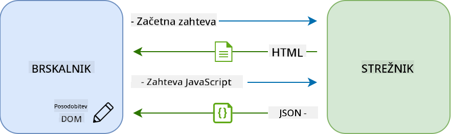
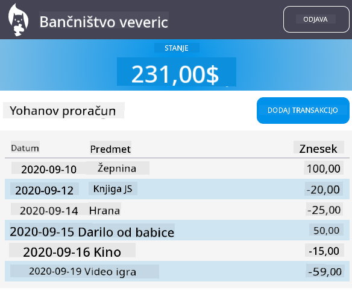

<!--
CO_OP_TRANSLATOR_METADATA:
{
  "original_hash": "89d0df9854ed020f155e94882ae88d4c",
  "translation_date": "2025-08-29T12:44:03+00:00",
  "source_file": "7-bank-project/3-data/README.md",
  "language_code": "sl"
}
-->
# Ustvarjanje bančne aplikacije, 3. del: Metode pridobivanja in uporabe podatkov

## Predhodni kviz

[Predhodni kviz](https://ff-quizzes.netlify.app/web/quiz/45)

### Uvod

V središču vsake spletne aplikacije so *podatki*. Podatki so lahko v različnih oblikah, vendar je njihov glavni namen vedno prikazovanje informacij uporabniku. Ker spletne aplikacije postajajo vse bolj interaktivne in kompleksne, je način, kako uporabnik dostopa do informacij in z njimi upravlja, ključni del razvoja spletnih aplikacij.

V tej lekciji bomo spoznali, kako asinhrono pridobiti podatke s strežnika in jih uporabiti za prikaz informacij na spletni strani brez ponovnega nalaganja HTML-ja.

### Predpogoji

Za to lekcijo morate imeti izdelan [obrazec za prijavo in registracijo](../2-forms/README.md) kot del spletne aplikacije. Prav tako morate namestiti [Node.js](https://nodejs.org) in [lokalno zagnati strežniški API](../api/README.md), da pridobite podatke o računih.

Preverite, ali strežnik deluje pravilno, tako da v terminalu zaženete naslednji ukaz:

```sh
curl http://localhost:5000/api
# -> should return "Bank API v1.0.0" as a result
```

---

## AJAX in pridobivanje podatkov

Tradicionalne spletne strani posodabljajo prikazano vsebino, ko uporabnik izbere povezavo ali pošlje podatke prek obrazca, tako da ponovno naložijo celotno HTML stran. Vsakič, ko je treba naložiti nove podatke, spletni strežnik vrne povsem novo HTML stran, ki jo mora brskalnik obdelati, kar prekine trenutno dejanje uporabnika in omeji interakcije med ponovnim nalaganjem. Ta način delovanja imenujemo *večstranska aplikacija* ali *MPA*.


Ko so spletne aplikacije postale bolj kompleksne in interaktivne, se je pojavila nova tehnika, imenovana [AJAX (Asynchronous JavaScript and XML)](https://en.wikipedia.org/wiki/Ajax_(programming)). Ta tehnika omogoča, da spletne aplikacije asinhrono pošiljajo in pridobivajo podatke s strežnika z uporabo JavaScripta, brez ponovnega nalaganja HTML strani, kar omogoča hitrejše posodobitve in bolj gladke interakcije z uporabnikom. Ko so novi podatki pridobljeni s strežnika, lahko trenutno HTML stran posodobimo z JavaScriptom z uporabo [DOM](https://developer.mozilla.org/docs/Web/API/Document_Object_Model) API-ja. Sčasoma se je ta pristop razvil v to, kar danes imenujemo [*enostranska aplikacija* ali *SPA*](https://en.wikipedia.org/wiki/Single-page_application).



Ko je bil AJAX prvič predstavljen, je bil edini API za asinhrono pridobivanje podatkov [`XMLHttpRequest`](https://developer.mozilla.org/docs/Web/API/XMLHttpRequest/Using_XMLHttpRequest). Vendar pa sodobni brskalniki zdaj podpirajo tudi bolj priročen in zmogljiv [`Fetch` API](https://developer.mozilla.org/docs/Web/API/Fetch_API), ki uporablja obljube (promises) in je bolje prilagojen za obdelavo podatkov v obliki JSON.

> Čeprav vsi sodobni brskalniki podpirajo `Fetch API`, je vedno dobro preveriti [tabelo združljivosti na caniuse.com](https://caniuse.com/fetch), če želite, da vaša spletna aplikacija deluje tudi v starejših brskalnikih.

### Naloga

V [prejšnji lekciji](../2-forms/README.md) smo implementirali obrazec za registracijo računa. Zdaj bomo dodali kodo za prijavo z obstoječim računom in pridobivanje njegovih podatkov. Odprite datoteko `app.js` in dodajte novo funkcijo `login`:

```js
async function login() {
  const loginForm = document.getElementById('loginForm')
  const user = loginForm.user.value;
}
```

Začnemo z iskanjem elementa obrazca z `getElementById()`, nato pa pridobimo uporabniško ime iz vnosa z `loginForm.user.value`. Vsak kontrolnik obrazca je dostopen prek njegovega imena (določenega v HTML-ju z atributom `name`) kot lastnost obrazca.

Podobno kot pri registraciji bomo ustvarili še eno funkcijo za pošiljanje zahteve strežniku, tokrat za pridobivanje podatkov o računu:

```js
async function getAccount(user) {
  try {
    const response = await fetch('//localhost:5000/api/accounts/' + encodeURIComponent(user));
    return await response.json();
  } catch (error) {
    return { error: error.message || 'Unknown error' };
  }
}
```

Uporabimo `fetch` API za asinhrono pošiljanje zahteve strežniku, vendar tokrat ne potrebujemo dodatnih parametrov, razen URL-ja, saj samo poizvedujemo podatke. Privzeto `fetch` ustvari HTTP zahtevo [`GET`](https://developer.mozilla.org/docs/Web/HTTP/Methods/GET), kar je točno to, kar potrebujemo.

✅ `encodeURIComponent()` je funkcija, ki pobegne posebne znake za URL. Kakšne težave bi lahko imeli, če te funkcije ne bi uporabili in bi neposredno uporabili vrednost `user` v URL-ju?

Zdaj posodobimo našo funkcijo `login`, da uporabi `getAccount`:

```js
async function login() {
  const loginForm = document.getElementById('loginForm')
  const user = loginForm.user.value;
  const data = await getAccount(user);

  if (data.error) {
    return console.log('loginError', data.error);
  }

  account = data;
  navigate('/dashboard');
}
```

Ker je `getAccount` asinhrona funkcija, moramo uporabiti ključni izraz `await`, da počakamo na rezultat strežnika. Kot pri vsaki zahtevi strežniku se moramo ukvarjati tudi z morebitnimi napakami. Za zdaj bomo dodali samo sporočilo v dnevnik, da prikažemo napako, in se k temu vrnili kasneje.

Nato moramo podatke shraniti nekam, da jih lahko kasneje uporabimo za prikaz informacij na nadzorni plošči. Ker spremenljivka `account` še ne obstaja, bomo na vrhu naše datoteke ustvarili globalno spremenljivko:

```js
let account = null;
```

Ko so uporabniški podatki shranjeni v spremenljivko, lahko s funkcijo `navigate()` preklopimo s strani za prijavo na nadzorno ploščo.

Na koncu moramo poklicati našo funkcijo `login`, ko je obrazec za prijavo oddan, tako da spremenimo HTML:

```html
<form id="loginForm" action="javascript:login()">
```

Preverite, ali vse deluje pravilno, tako da registrirate nov račun in se poskusite prijaviti z istim računom.

Preden nadaljujemo na naslednji del, lahko dokončamo funkcijo `register`, tako da na njen konec dodamo to:

```js
account = result;
navigate('/dashboard');
```

✅ Ali ste vedeli, da lahko privzeto kličete strežniške API-je samo z *iste domene in porta*, kot je spletna stran, ki jo gledate? To je varnostni mehanizem, ki ga uveljavljajo brskalniki. Ampak počakajte, naša spletna aplikacija deluje na `localhost:3000`, medtem ko strežniški API deluje na `localhost:5000`. Zakaj torej deluje? Z uporabo tehnike, imenovane [Cross-Origin Resource Sharing (CORS)](https://developer.mozilla.org/docs/Web/HTTP/CORS), je mogoče izvajati zahteve HTTP med različnimi izvoroma, če strežnik doda posebne glave v odgovor, ki dovoljujejo izjeme za določene domene.

> Več o API-jih lahko izveste v tej [lekciji](https://docs.microsoft.com/learn/modules/use-apis-discover-museum-art/?WT.mc_id=academic-77807-sagibbon).

## Posodobitev HTML-ja za prikaz podatkov

Zdaj, ko imamo uporabniške podatke, moramo posodobiti obstoječi HTML, da jih prikažemo. Že vemo, kako pridobiti element iz DOM-a, na primer z `document.getElementById()`. Ko imate osnovni element, lahko uporabite naslednje API-je za njegovo spreminjanje ali dodajanje otroških elementov:

- Z uporabo lastnosti [`textContent`](https://developer.mozilla.org/docs/Web/API/Node/textContent) lahko spremenite besedilo elementa. Upoštevajte, da spreminjanje te vrednosti odstrani vse otroke elementa (če obstajajo) in jih nadomesti z danim besedilom. To je tudi učinkovit način za odstranitev vseh otrok določenega elementa z dodelitvijo praznega niza `''`.

- Z uporabo [`document.createElement()`](https://developer.mozilla.org/docs/Web/API/Document/createElement) skupaj z metodo [`append()`](https://developer.mozilla.org/docs/Web/API/ParentNode/append) lahko ustvarite in pritrdite enega ali več novih otroških elementov.

✅ Z uporabo lastnosti [`innerHTML`](https://developer.mozilla.org/docs/Web/API/Element/innerHTML) elementa je prav tako mogoče spremeniti njegovo HTML vsebino, vendar se tej metodi izogibajte, saj je ranljiva za napade [cross-site scripting (XSS)](https://developer.mozilla.org/docs/Glossary/Cross-site_scripting).

### Naloga

Preden nadaljujemo na zaslon nadzorne plošče, moramo na strani za prijavo narediti še eno stvar. Trenutno, če poskusite prijaviti uporabniško ime, ki ne obstaja, se sporočilo prikaže v konzoli, vendar za običajnega uporabnika ni nobene spremembe in ne ve, kaj se dogaja.

Dodajmo element z rezerviranim mestom v obrazcu za prijavo, kjer lahko po potrebi prikažemo sporočilo o napaki. Dobra lokacija bi bila tik pred gumbom za prijavo `<button>`:

```html
...
<div id="loginError"></div>
<button>Login</button>
...
```

Ta element `<div>` je prazen, kar pomeni, da se na zaslonu ne bo nič prikazalo, dokler mu ne dodamo vsebine. Prav tako mu dodelimo `id`, da ga lahko enostavno pridobimo z JavaScriptom.

Vrnite se v datoteko `app.js` in ustvarite novo pomožno funkcijo `updateElement`:

```js
function updateElement(id, text) {
  const element = document.getElementById(id);
  element.textContent = text;
}
```

Ta funkcija je precej preprosta: glede na *id* elementa in *besedilo* posodobi besedilno vsebino DOM elementa z ustreznim `id`. Uporabimo to metodo namesto prejšnjega sporočila o napaki v funkciji `login`:

```js
if (data.error) {
  return updateElement('loginError', data.error);
}
```

Zdaj, če poskusite prijaviti neveljaven račun, bi morali videti nekaj takega:


Zdaj imamo besedilo o napaki, ki se prikaže vizualno, vendar če to poskusite s pomočjo bralnika zaslona, boste opazili, da se nič ne napove. Da bi besedilo, ki je dinamično dodano na stran, napovedali bralniki zaslona, mora uporabiti nekaj, kar se imenuje [Live Region](https://developer.mozilla.org/docs/Web/Accessibility/ARIA/ARIA_Live_Regions). Tukaj bomo uporabili posebno vrsto live regiona, imenovano opozorilo:

```html
<div id="loginError" role="alert"></div>
```

Enako vedenje implementirajte za napake v funkciji `register` (ne pozabite posodobiti HTML-ja).

## Prikaz informacij na nadzorni plošči

Z uporabo tehnik, ki smo jih pravkar spoznali, bomo poskrbeli tudi za prikaz informacij o računu na strani nadzorne plošče.

Tako izgleda objekt računa, ki ga prejmemo s strežnika:

```json
{
  "user": "test",
  "currency": "$",
  "description": "Test account",
  "balance": 75,
  "transactions": [
    { "id": "1", "date": "2020-10-01", "object": "Pocket money", "amount": 50 },
    { "id": "2", "date": "2020-10-03", "object": "Book", "amount": -10 },
    { "id": "3", "date": "2020-10-04", "object": "Sandwich", "amount": -5 }
  ],
}
```

> Opomba: za lažje delo lahko uporabite že obstoječi račun `test`, ki je že napolnjen s podatki.

### Naloga

Začnimo z zamenjavo razdelka "Stanje" v HTML-ju, da dodamo elemente z rezerviranim mestom:

```html
<section>
  Balance: <span id="balance"></span><span id="currency"></span>
</section>
```

Dodali bomo tudi nov razdelek tik pod tem, da prikažemo opis računa:

```html
<h2 id="description"></h2>
```

✅ Ker opis računa deluje kot naslov za vsebino pod njim, je označen semantično kot naslov. Več o tem, kako je [struktura naslovov](https://www.nomensa.com/blog/2017/how-structure-headings-web-accessibility) pomembna za dostopnost, in kritično preglejte stran, da ugotovite, kaj bi še lahko bilo naslov.

Nato bomo v `app.js` ustvarili novo funkcijo za izpolnjevanje rezerviranih mest:

```js
function updateDashboard() {
  if (!account) {
    return navigate('/login');
  }

  updateElement('description', account.description);
  updateElement('balance', account.balance.toFixed(2));
  updateElement('currency', account.currency);
}
```

Najprej preverimo, ali imamo potrebne podatke o računu, preden nadaljujemo. Nato uporabimo funkcijo `updateElement()`, ki smo jo ustvarili prej, za posodobitev HTML-ja.

> Da bi bil prikaz stanja lepši, uporabimo metodo [`toFixed(2)`](https://developer.mozilla.org/docs/Web/JavaScript/Reference/Global_Objects/Number/toFixed), da prisilimo prikaz vrednosti z dvema decimalnima mestoma.

Zdaj moramo poklicati našo funkcijo `updateDashboard()` vsakič, ko je nadzorna plošča naložena. Če ste že dokončali [nalogo iz lekcije 1](../1-template-route/assignment.md), bi to moralo biti enostavno, sicer pa lahko uporabite naslednjo implementacijo.

Dodajte to kodo na konec funkcije `updateRoute()`:

```js
if (typeof route.init === 'function') {
  route.init();
}
```

In posodobite definicije poti z:

```js
const routes = {
  '/login': { templateId: 'login' },
  '/dashboard': { templateId: 'dashboard', init: updateDashboard }
};
```

S to spremembo se funkcija `updateDashboard()` pokliče vsakič, ko je prikazana stran nadzorne plošče. Po prijavi bi morali videti stanje računa, valuto in opis.

## Dinamično ustvarjanje vrstic tabele s HTML predlogami

V [prvi lekciji](../1-template-route/README.md) smo uporabili HTML predloge skupaj z metodo [`appendChild()`](https://developer.mozilla.org/docs/Web/API/Node/appendChild) za implementacijo navigacije v naši aplikaciji. Predloge so lahko tudi manjše in se uporabljajo za dinamično izpolnjevanje ponavljajočih se delov strani.

Uporabili bomo podoben pristop za prikaz seznama transakcij v HTML tabeli.

### Naloga

Dodajte novo predlogo v `<body>` HTML-ja:

```html
<template id="transaction">
  <tr>
    <td></td>
    <td></td>
    <td></td>
  </tr>
</template>
```

Ta predloga predstavlja eno vrstico tabele s tremi stolpci, ki jih želimo izpolniti: *datum*, *objekt* in *znesek* transakcije.

Nato dodajte to lastnost `id` elementu `<tbody>` tabele znotraj predloge nadzorne plošče, da ga lažje najdete z JavaScriptom:

```html
<tbody id="transactions"></tbody>
```

Naš HTML je pripravljen, preklopimo na JavaScript kodo in ustvarimo novo funkcijo `createTransactionRow`:

```js
function createTransactionRow(transaction) {
  const template = document.getElementById('transaction');
  const transactionRow = template.content.cloneNode(true);
  const tr = transactionRow.querySelector('tr');
  tr.children[0].textContent = transaction.date;
  tr.children[1].textContent = transaction.object;
  tr.children[2].textContent = transaction.amount.toFixed(2);
  return transactionRow;
}
```

Ta funkcija naredi točno to, kar pove njeno ime: z uporabo predloge, ki smo jo ustvarili prej, ustvari novo vrstico tabele in izpolni njeno vsebino z podatki o transakciji. To bomo uporabili v naši funkciji `updateDashboard()` za izpolnjevanje tabele:

```js
const transactionsRows = document.createDocumentFragment();
for (const transaction of account.transactions) {
  const transactionRow = createTransactionRow(transaction);
  transactionsRows.appendChild(transactionRow);
}
updateElement('transactions', transactionsRows);
```

Tukaj uporabimo metodo [`document.createDocumentFragment()`](https://developer.mozilla.org/docs/Web/API/Document/createDocumentFragment), ki ustvari nov DOM fragment, na katerem lahko delamo, preden ga na koncu pritrdimo na našo HTML tabelo.

Še vedno moramo narediti eno stvar, preden ta koda lahko deluje, saj naša funkcija `updateElement()` trenutno podpira samo besedilno vsebino. Spremenimo njeno kodo:

```js
function updateElement(id, textOrNode) {
  const element = document.getElementById(id);
  element.textContent = ''; // Removes all children
  element.append(textOrNode);
}
```

Uporabimo metodo [`append()`](https://developer.mozilla.org/docs/Web/API/ParentNode/append), saj omogoča pritrditev besedila ali [DOM vozlišč](https://developer.mozilla.org/docs/Web/API/Node) na nadrejeni element, kar je popolno za vse naše primere uporabe.
Če poskusite uporabiti račun `test` za prijavo, bi morali zdaj na nadzorni plošči videti seznam transakcij 🎉.

---

## 🚀 Izziv

Sodelujte, da bo stran nadzorne plošče videti kot prava aplikacija za bančništvo. Če ste svojo aplikacijo že oblikovali, poskusite uporabiti [media queries](https://developer.mozilla.org/docs/Web/CSS/Media_Queries), da ustvarite [odziven dizajn](https://developer.mozilla.org/docs/Web/Progressive_web_apps/Responsive/responsive_design_building_blocks), ki bo dobro deloval tako na namiznih kot na mobilnih napravah.

Tukaj je primer oblikovane strani nadzorne plošče:



## Kviz po predavanju

[Kviz po predavanju](https://ff-quizzes.netlify.app/web/quiz/46)

## Naloga

[Preoblikujte in komentirajte svojo kodo](assignment.md)

---

**Omejitev odgovornosti**:  
Ta dokument je bil preveden z uporabo storitve za prevajanje z umetno inteligenco [Co-op Translator](https://github.com/Azure/co-op-translator). Čeprav si prizadevamo za natančnost, vas prosimo, da upoštevate, da lahko avtomatizirani prevodi vsebujejo napake ali netočnosti. Izvirni dokument v njegovem maternem jeziku je treba obravnavati kot avtoritativni vir. Za ključne informacije priporočamo profesionalni človeški prevod. Ne prevzemamo odgovornosti za morebitne nesporazume ali napačne razlage, ki bi nastale zaradi uporabe tega prevoda.