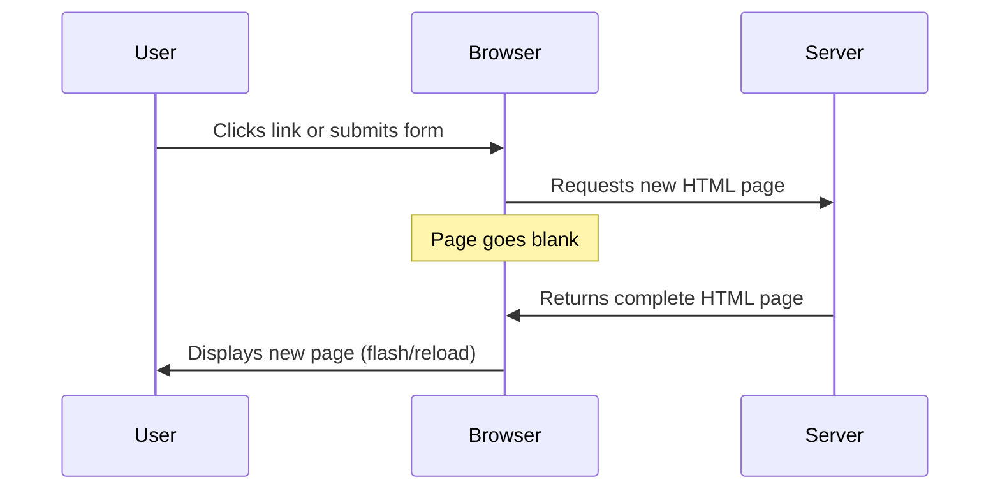
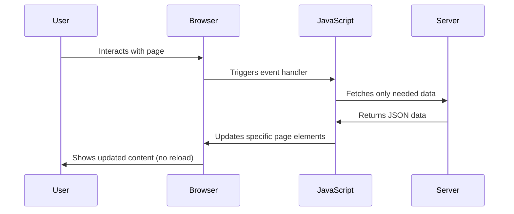
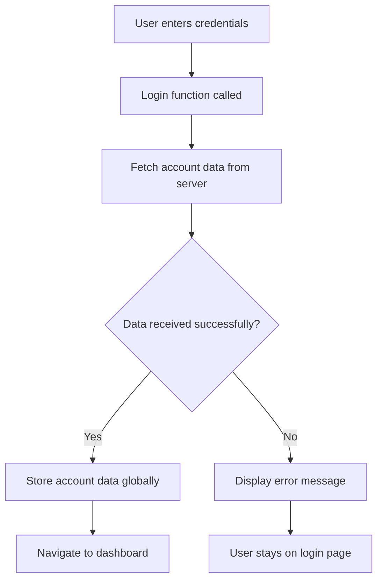
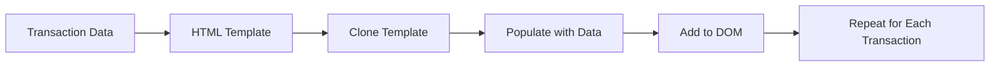

<!--
CO_OP_TRANSLATOR_METADATA:
{
  "original_hash": "2c1164912414820c8efd699b43f64954",
  "translation_date": "2025-10-25T00:36:01+00:00",
  "source_file": "7-bank-project/3-data/README.md",
  "language_code": "sl"
}
-->
# Izdelava bančne aplikacije, 3. del: Metode pridobivanja in uporabe podatkov

Pomislite na računalnik Enterprise v seriji Star Trek - ko kapitan Picard vpraša za stanje ladje, se informacije prikažejo takoj, brez da bi se celoten vmesnik ustavil in ponovno zgradil. Takšen nemoten pretok informacij je točno tisto, kar gradimo tukaj z dinamičnim pridobivanjem podatkov.

Trenutno je vaša bančna aplikacija kot natisnjen časopis - informativna, a statična. Spremenili jo bomo v nekaj podobnega kot nadzorno središče pri NASA, kjer podatki neprekinjeno tečejo in se posodabljajo v realnem času, ne da bi prekinili uporabnikovo delo.

Naučili se boste, kako asinhrono komunicirati s strežniki, obravnavati podatke, ki prispejo ob različnih časih, in surove informacije pretvoriti v nekaj smiselnega za vaše uporabnike. To je razlika med demo aplikacijo in programsko opremo, pripravljeno za produkcijo.

## Predhodni kviz

[Predhodni kviz](https://ff-quizzes.netlify.app/web/quiz/45)

### Predpogoji

Preden se lotite pridobivanja podatkov, poskrbite, da imate pripravljene naslednje komponente:

- **Prejšnja lekcija**: Dokončajte [Obrazec za prijavo in registracijo](../2-forms/README.md) - gradili bomo na tej osnovi
- **Lokalni strežnik**: Namestite [Node.js](https://nodejs.org) in [zaženite strežniški API](../api/README.md) za zagotavljanje podatkov o računih
- **Povezava z API-jem**: Preverite povezavo s strežnikom s tem ukazom:

```bash
curl http://localhost:5000/api
# Expected response: "Bank API v1.0.0"
```

Ta hitri test zagotavlja, da vsi deli pravilno komunicirajo:
- Preveri, ali Node.js pravilno deluje na vašem sistemu
- Potrdi, da je vaš API strežnik aktiven in se odziva
- Preveri, ali vaša aplikacija doseže strežnik (kot preverjanje radijske povezave pred misijo)

---

## Razumevanje pridobivanja podatkov v sodobnih spletnih aplikacijah

Način, kako spletne aplikacije obravnavajo podatke, se je v zadnjih dveh desetletjih dramatično spremenil. Razumevanje te evolucije vam bo pomagalo ceniti, zakaj so sodobne tehnike, kot sta AJAX in Fetch API, tako močne in zakaj so postale bistvena orodja za spletne razvijalce.

Raziskali bomo, kako so delovale tradicionalne spletne strani v primerjavi z dinamičnimi, odzivnimi aplikacijami, ki jih gradimo danes.

### Tradicionalne večstranske aplikacije (MPA)

V zgodnjih dneh spleta je bil vsak klik podoben menjavi kanalov na starem televizorju - zaslon bi se zatemnil, nato pa počasi prikazal novo vsebino. To je bila realnost zgodnjih spletnih aplikacij, kjer je vsaka interakcija pomenila popolno ponovno gradnjo celotne strani.




**Zakaj je bil ta pristop okoren:**
- Vsak klik je pomenil ponovno gradnjo celotne strani
- Uporabniki so bili prekinjeni s tistimi nadležnimi utripajočimi stranmi
- Vaša internetna povezava je delala nadure, saj je večkrat prenašala isti glavi in nogi
- Aplikacije so se zdele bolj kot brskanje po omari z dokumenti kot uporaba programske opreme

### Sodobne enostranske aplikacije (SPA)

AJAX (Asynchronous JavaScript and XML) je popolnoma spremenil ta paradigm. Kot modularna zasnova Mednarodne vesoljske postaje, kjer lahko astronavti zamenjajo posamezne komponente brez ponovne gradnje celotne strukture, nam AJAX omogoča posodabljanje določenih delov spletne strani brez ponovnega nalaganja vsega. Čeprav ime omenja XML, danes večinoma uporabljamo JSON, vendar osnovno načelo ostaja: posodobi samo tisto, kar je treba spremeniti.




**Zakaj se SPA zdi veliko boljša:**
- Posodobijo se samo deli, ki so se dejansko spremenili (pametno, kajne?)
- Ni več motečih prekinitev - vaši uporabniki ostanejo v toku
- Manj podatkov potuje po omrežju, kar pomeni hitrejše nalaganje
- Vse se zdi hitro in odzivno, kot aplikacije na vašem telefonu

### Evolucija do sodobnega Fetch API

Sodobni brskalniki zagotavljajo [`Fetch` API](https://developer.mozilla.org/docs/Web/API/Fetch_API), ki nadomešča starejši [`XMLHttpRequest`](https://developer.mozilla.org/docs/Web/API/XMLHttpRequest/Using_XMLHttpRequest). Kot razlika med upravljanjem telegrafa in uporabo e-pošte, Fetch API uporablja obljube za čistejšo asinhrono kodo in naravno obravnava JSON.

| Funkcija | XMLHttpRequest | Fetch API |
|----------|----------------|-----------|
| **Sintaksa** | Zapletena, temelji na povratnih klicih | Čista, temelji na obljubah |
| **Obravnava JSON** | Zahteva ročno obdelavo | Vgrajena metoda `.json()` |
| **Obravnava napak** | Omejene informacije o napakah | Celovite podrobnosti o napakah |
| **Sodobna podpora** | Združljivost z dediščino | ES6+ obljube in async/await |

> 💡 **Združljivost brskalnikov**: Dobra novica - Fetch API deluje v vseh sodobnih brskalnikih! Če vas zanimajo specifične različice, [caniuse.com](https://caniuse.com/fetch) ima celotno zgodbo o združljivosti.
> 
**Zaključek:**
- Odlično deluje v Chrome, Firefox, Safari in Edge (praktično povsod, kjer so vaši uporabniki)
- Samo Internet Explorer potrebuje dodatno pomoč (in iskreno, čas je, da se poslovimo od IE)
- Popolnoma vas pripravi na elegantne vzorce async/await, ki jih bomo uporabili kasneje

### Implementacija prijave uporabnika in pridobivanja podatkov

Zdaj bomo implementirali sistem prijave, ki bo vašo bančno aplikacijo spremenil iz statičnega prikaza v funkcionalno aplikacijo. Kot avtentikacijski protokoli, ki se uporabljajo v varnih vojaških objektih, bomo preverili uporabniške podatke in nato omogočili dostop do njihovih specifičnih podatkov.

Gradili bomo postopoma, začenši z osnovno avtentikacijo in nato dodali zmožnosti pridobivanja podatkov.

#### Korak 1: Ustvarite osnovo funkcije za prijavo

Odprite datoteko `app.js` in dodajte novo funkcijo `login`. Ta bo obravnavala proces avtentikacije uporabnika:

```javascript
async function login() {
  const loginForm = document.getElementById('loginForm');
  const user = loginForm.user.value;
}
```

**Razčlenimo to:**
- Ključna beseda `async` pove JavaScriptu "hej, ta funkcija bo morda morala počakati na nekatere stvari"
- Iz strani pridobimo naš obrazec (nič posebnega, samo najdemo ga po ID-ju)
- Nato izvlečemo, kar je uporabnik vnesel kot svoje uporabniško ime
- Tukaj je zanimiv trik: do katerega koli vnosa obrazca lahko dostopate prek atributa `name` - ni potrebe po dodatnih klicih getElementById!

> 💡 **Vzorec dostopa do obrazca**: Vsak kontrolnik obrazca je dostopen prek njegovega imena (nastavljenega v HTML-ju z atributom `name`) kot lastnost elementa obrazca. To zagotavlja čist, berljiv način za pridobivanje podatkov obrazca.

#### Korak 2: Ustvarite funkcijo za pridobivanje podatkov o računu

Nato bomo ustvarili namensko funkcijo za pridobivanje podatkov o računu s strežnika. To sledi istemu vzorcu kot vaša funkcija za registracijo, vendar se osredotoča na pridobivanje podatkov:

```javascript
async function getAccount(user) {
  try {
    const response = await fetch('//localhost:5000/api/accounts/' + encodeURIComponent(user));
    return await response.json();
  } catch (error) {
    return { error: error.message || 'Unknown error' };
  }
}
```

**Kaj ta koda doseže:**
- **Uporablja** sodobni `fetch` API za asinhrono zahtevanje podatkov
- **Sestavi** URL zahteve GET s parametrom uporabniškega imena
- **Uporabi** `encodeURIComponent()` za varno obravnavo posebnih znakov v URL-jih
- **Pretvori** odgovor v JSON format za enostavno manipulacijo podatkov
- **Obravnava** napake na eleganten način, tako da vrne objekt napake namesto da se sesuje

> ⚠️ **Opomba o varnosti**: Funkcija `encodeURIComponent()` obravnava posebne znake v URL-jih. Kot kodirni sistemi, ki se uporabljajo v pomorskih komunikacijah, zagotavlja, da vaše sporočilo prispe točno tako, kot je bilo mišljeno, in preprečuje, da bi znaki, kot sta "#" ali "&", bili napačno interpretirani.
> 
**Zakaj je to pomembno:**
- Preprečuje, da bi posebni znaki pokvarili URL-je
- Ščiti pred napadi manipulacije URL-jev
- Zagotavlja, da vaš strežnik prejme predvidene podatke
- Sledi varnim kodirnim praksam

#### Razumevanje HTTP GET zahtevkov

Morda vas bo presenetilo: ko uporabite `fetch` brez dodatnih možnosti, samodejno ustvari [`GET`](https://developer.mozilla.org/docs/Web/HTTP/Methods/GET) zahtevo. To je popolno za to, kar počnemo - prosimo strežnik: "hej, lahko vidim podatke o tem uporabnikovem računu?"

Pomislite na GET zahteve kot na vljudno prošnjo za izposojo knjige iz knjižnice - zahtevate ogled nečesa, kar že obstaja. POST zahteve (ki smo jih uporabili za registracijo) so bolj podobne oddaji nove knjige, ki jo je treba dodati v zbirko.

| GET zahteva | POST zahteva |
|-------------|-------------|
| **Namen** | Pridobivanje obstoječih podatkov | Pošiljanje novih podatkov na strežnik |
| **Parametri** | V poti URL-ja/poizvedbi | V telesu zahteve |
| **Predpomnjenje** | Brskalniki lahko predpomnijo | Običajno ni predpomnjeno |
| **Varnost** | Vidno v URL-ju/dnevnikih | Skrito v telesu zahteve |

#### Korak 3: Povezovanje vsega skupaj

Zdaj za zadovoljiv del - povežimo vašo funkcijo za pridobivanje podatkov o računu s procesom prijave. Tukaj se vse sestavi:

```javascript
async function login() {
  const loginForm = document.getElementById('loginForm');
  const user = loginForm.user.value;
  const data = await getAccount(user);

  if (data.error) {
    return console.log('loginError', data.error);
  }

  account = data;
  navigate('/dashboard');
}
```

Ta funkcija sledi jasnemu zaporedju:
- Izvleče uporabniško ime iz vnosa obrazca
- Zahteva podatke o uporabnikovem računu s strežnika
- Obravnava morebitne napake, ki se pojavijo med procesom
- Shrani podatke o računu in se ob uspehu premakne na nadzorno ploščo

> 🎯 **Vzorec Async/Await**: Ker je `getAccount` asinhrona funkcija, uporabimo ključno besedo `await`, da zaustavimo izvajanje, dokler strežnik ne odgovori. To preprečuje, da bi koda nadaljevala z nedoločenimi podatki.

#### Korak 4: Ustvarjanje prostora za vaše podatke

Vaša aplikacija potrebuje nekje, kjer si zapomni podatke o računu, ko so naloženi. Pomislite na to kot na kratkoročni spomin vaše aplikacije - prostor za shranjevanje trenutnih uporabniških podatkov. Dodajte to vrstico na vrh vaše datoteke `app.js`:

```javascript
// This holds the current user's account data
let account = null;
```

**Zakaj to potrebujemo:**
- Ohranja podatke o računu dostopne od kjerkoli v vaši aplikaciji
- Začetek z `null` pomeni "še nihče ni prijavljen"
- Posodobi se, ko se nekdo uspešno prijavi ali registrira
- Deluje kot enoten vir resnice - brez zmede glede tega, kdo je prijavljen

#### Korak 5: Povežite svoj obrazec

Zdaj povežimo vašo novo funkcijo za prijavo z vašim HTML obrazcem. Posodobite oznako obrazca tako:

```html
<form id="loginForm" action="javascript:login()">
  <!-- Your existing form inputs -->
</form>
```

**Kaj ta majhna sprememba naredi:**
- Ustavi obrazec, da ne opravi svojega privzetega "ponovno naloži celotno stran" vedenja
- Namesto tega pokliče vašo prilagojeno JavaScript funkcijo
- Ohranja vse gladko in v slogu enostranske aplikacije
- Omogoča vam popoln nadzor nad tem, kaj se zgodi, ko uporabniki pritisnejo "Prijava"

#### Korak 6: Izboljšajte svojo funkcijo za registracijo

Za doslednost posodobite svojo funkcijo `register`, da tudi shrani podatke o računu in se premakne na nadzorno ploščo:

```javascript
// Add these lines at the end of your register function
account = result;
navigate('/dashboard');
```

**Ta izboljšava zagotavlja:**
- **Nemoten** prehod od registracije do nadzorne plošče
- **Dosledno** uporabniško izkušnjo med prijavo in registracijo
- **Takojšnji** dostop do podatkov o računu po uspešni registraciji

#### Testiranje vaše implementacije



**Čas je, da jo preizkusite:**
1. Ustvarite nov račun, da se prepričate, da vse deluje
2. Poskusite se prijaviti s temi istimi podatki
3. Pokukajte v konzolo brskalnika (F12), če se kaj zdi narobe
4. Prepričajte se, da pristane na nadzorni plošči po uspešni prijavi

Če kaj ne deluje, ne paničarite! Večina težav so preproste napake, kot so tipkarske napake ali pozabljanje zagnati API strežnik.

#### Kratek beseda o čarovniji med različnimi izvoroma

Morda se sprašujete: "Kako moja spletna aplikacija komunicira s tem API strežnikom, ko tečejo na različnih vratih?" Odlično vprašanje! To se dotika nečesa, na kar naleti vsak spletni razvijalec.

> 🔒 **Varnost med različnimi izvoroma**: Brskalniki uveljavljajo "politiko istega izvora", da preprečijo nepooblaščeno komunikacijo med različnimi domenami. Kot sistem kontrolnih točk v Pentagonu preverjajo, ali je komunikacija pooblaščena, preden dovolijo prenos podatkov.
> 
**V naši nastavitvi:**
- Vaša spletna aplikacija teče na `localhost:3000` (razvojni strežnik)
- Vaš API strežnik teče na `localhost:5000` (strežnik zaledja)
- API strežnik vključuje [CORS glave](https://developer.mozilla.org/docs/Web/HTTP/CORS), ki izrecno dovoljujejo komunikacijo z vašo spletno aplikacijo

Ta konfiguracija odraža razvoj v resničnem svetu, kjer aplikacije na sprednjem in zadnjem delu običajno tečejo na ločenih strežnikih.

> 📚 **Več o tem**: Poglobite se v API-je in pridobivanje podatkov s tem obsežnim [Microsoft Learn modulom o API-jih](https://docs.microsoft.com/learn/modules/use-apis-discover-museum-art/?WT.mc_id=academic-77807-sagibbon).

## Prikaz vaših podatkov v HTML

Zdaj bomo pridobljene podatke prikazali uporabnikom prek manipulacije DOM-a. Kot proces razvijanja fotografij v temnici, bomo nevidne podatke pretvorili v nekaj, kar lahko uporabniki vidijo in z njimi interagirajo.

Manipulacija DOM-a je tehnika, ki statične spletne strani spremeni v dinamične aplikacije, ki posodabljajo svojo vsebino glede na interakcije uporabnikov in odgovore strežnika.

### Izbira pravega orodja za nalogo

Ko gre za posodabljanje vašega HTML-ja z JavaScriptom, imate na voljo več možnosti. Pomislite na te kot na različna orodja v orodjarni - vsako je popolno za specifične naloge:

| Metoda | Za kaj je odlična | Kdaj jo uporabiti | Stopnja varnosti |
|--------|-------------------|-------------------|------------------|
| `textContent` | Prikazovanje uporabniških podatkov varno | Kadarkoli prikazujete besedilo | ✅ Zelo varno |
| `createElement()` + `append()` | Gradnja kompleksnih postavitev | Ustvarjanje novih sekcij/seznamov | ✅ Zelo varno |
| `innerHTML` | Nastavljanje HTML vsebine | ⚠️ Poskusite se temu izogniti | ❌ Tvegano |

#### Varni način prikaza besedila: textContent

Lastnost [`textContent`](https://developer.mozilla.org/docs/Web/API/Node/textContent) je vaš najboljši prijatelj pri prikazovanju uporabniških podatkov. Je
Za bolj kompleksne vsebine združite [`document.createElement()`](https://developer.mozilla.org/docs/Web/API/Document/createElement) z metodo [`append()`](https://developer.mozilla.org/docs/Web/API/ParentNode/append):

```javascript
// Safe way to create new elements
const transactionItem = document.createElement('div');
transactionItem.className = 'transaction-item';
transactionItem.textContent = `${transaction.date}: ${transaction.description}`;
container.append(transactionItem);
```

**Razumevanje tega pristopa:**
- **Ustvarja** nove DOM elemente programsko
- **Omogoča** popoln nadzor nad atributi in vsebino elementov
- **Dovoljuje** kompleksne, ugnezdene strukture elementov
- **Ohranja** varnost z ločevanjem strukture od vsebine

> ⚠️ **Varnostni vidik**: Čeprav se [`innerHTML`](https://developer.mozilla.org/docs/Web/API/Element/innerHTML) pogosto pojavlja v številnih vadnicah, lahko izvaja vgrajene skripte. Tako kot varnostni protokoli v CERN-u preprečujejo nepooblaščeno izvajanje kode, uporaba `textContent` in `createElement` zagotavlja varnejše alternative.
> 
**Tveganja pri uporabi innerHTML:**
- Izvaja vse `<script>` oznake v uporabniških podatkih
- Ranljivost za napade z vnosom kode
- Ustvarja potencialne varnostne ranljivosti
- Varnejše alternative, ki jih uporabljamo, zagotavljajo enakovredno funkcionalnost

### Naredimo napake prijazne uporabniku

Trenutno se napake pri prijavi pojavijo le v konzoli brskalnika, kar je za uporabnike nevidno. Tako kot razlika med notranjo diagnostiko pilota in informacijskim sistemom za potnike, moramo pomembne informacije posredovati prek ustreznega kanala.

Implementacija vidnih sporočil o napakah uporabnikom omogoča takojšnjo povratno informacijo o tem, kaj je šlo narobe in kako nadaljevati.

#### Korak 1: Dodajte prostor za sporočila o napakah

Najprej dodajte prostor za sporočila o napakah v vašo HTML kodo. To dodajte tik pred gumb za prijavo, da bodo uporabniki to naravno opazili:

```html
<!-- This is where error messages will appear -->
<div id="loginError" role="alert"></div>
<button>Login</button>
```

**Kaj se tukaj dogaja:**
- Ustvarjamo prazen prostor, ki ostane neviden, dokler ni potreben
- Postavljen je tam, kjer uporabniki naravno pogledajo po kliku na "Prijava"
- Atribut `role="alert"` je koristen za bralnike zaslona - pove pomožnim tehnologijam "hej, to je pomembno!"
- Edinstven `id` omogoča enostavno ciljanje z JavaScriptom

#### Korak 2: Ustvarite priročno pomožno funkcijo

Naredimo majhno pripomočno funkcijo, ki lahko posodobi besedilo katerega koli elementa. To je ena tistih funkcij "napiši enkrat, uporabi povsod", ki vam bo prihranila čas:

```javascript
function updateElement(id, text) {
  const element = document.getElementById(id);
  element.textContent = text;
}
```

**Prednosti funkcije:**
- Enostaven vmesnik, ki zahteva le ID elementa in besedilno vsebino
- Varno locira in posodablja DOM elemente
- Ponovno uporaben vzorec, ki zmanjšuje podvajanje kode
- Ohranja dosledno vedenje posodabljanja po celotni aplikaciji

#### Korak 3: Prikaz napak, kjer jih uporabniki lahko vidijo

Zdaj zamenjajmo skrito sporočilo v konzoli z nečim, kar lahko uporabniki dejansko vidijo. Posodobite funkcijo za prijavo:

```javascript
// Instead of just logging to console, show the user what's wrong
if (data.error) {
  return updateElement('loginError', data.error);
}
```

**Ta majhna sprememba naredi veliko razliko:**
- Sporočila o napakah se pojavijo tam, kjer uporabniki gledajo
- Ni več skrivnostnih tihih napak
- Uporabniki dobijo takojšnjo, uporabno povratno informacijo
- Vaša aplikacija začne delovati profesionalno in premišljeno

Zdaj, ko testirate z neveljavnim računom, boste videli koristno sporočilo o napaki neposredno na strani!


#### Korak 4: Biti vključujoč z dostopnostjo

Tukaj je nekaj zanimivega o atributu `role="alert"`, ki smo ga dodali prej - ni le dekoracija! Ta majhen atribut ustvari [Live Region](https://developer.mozilla.org/docs/Web/Accessibility/ARIA/ARIA_Live_Regions), ki takoj sporoči spremembe bralnikom zaslona:

```html
<div id="loginError" role="alert"></div>
```

**Zakaj je to pomembno:**
- Uporabniki bralnikov zaslona slišijo sporočilo o napaki takoj, ko se pojavi
- Vsi dobijo enake pomembne informacije, ne glede na način navigacije
- To je preprost način, da vaša aplikacija deluje za več ljudi
- Pokaže, da vam je mar za ustvarjanje vključujočih izkušenj

Majhne podrobnosti, kot je ta, ločijo dobre razvijalce od odličnih!

#### Korak 5: Uporabite isti vzorec za registracijo

Za doslednost implementirajte enako obravnavo napak v obrazcu za registracijo:

1. **Dodajte** element za prikaz napak v vašo HTML kodo za registracijo:
```html
<div id="registerError" role="alert"></div>
```

2. **Posodobite** funkcijo za registracijo, da uporablja isti vzorec prikaza napak:
```javascript
if (data.error) {
  return updateElement('registerError', data.error);
}
```

**Prednosti dosledne obravnave napak:**
- **Omogoča** enotno uporabniško izkušnjo v vseh obrazcih
- **Zmanjšuje** kognitivno obremenitev z uporabo znanih vzorcev
- **Poenostavi** vzdrževanje s ponovno uporabno kodo
- **Zagotavlja** upoštevanje standardov dostopnosti po celotni aplikaciji

## Ustvarjanje dinamične nadzorne plošče

Zdaj bomo vašo statično nadzorno ploščo spremenili v dinamični vmesnik, ki prikazuje resnične podatke o računu. Tako kot razlika med natisnjenim voznim redom letov in živimi odhodnimi tablami na letališčih, prehajamo od statičnih informacij k prikazom v realnem času.

Z uporabo tehnik manipulacije DOM, ki ste se jih naučili, bomo ustvarili nadzorno ploščo, ki se samodejno posodablja z aktualnimi informacijami o računu.

### Spoznajte svoje podatke

Preden začnemo graditi, si oglejmo, kakšne podatke vaš strežnik pošlje nazaj. Ko se nekdo uspešno prijavi, tukaj je zakladnica informacij, s katerimi lahko delate:

```json
{
  "user": "test",
  "currency": "$",
  "description": "Test account",
  "balance": 75,
  "transactions": [
    { "id": "1", "date": "2020-10-01", "object": "Pocket money", "amount": 50 },
    { "id": "2", "date": "2020-10-03", "object": "Book", "amount": -10 },
    { "id": "3", "date": "2020-10-04", "object": "Sandwich", "amount": -5 }
  ]
}
```

**Ta podatkovna struktura zagotavlja:**
- **`user`**: Popolno za personalizacijo izkušnje ("Dobrodošli nazaj, Sara!")
- **`currency`**: Poskrbi, da pravilno prikažemo zneske denarja
- **`description`**: Prijazno ime za račun
- **`balance`**: Zelo pomembno trenutno stanje
- **`transactions`**: Celotna zgodovina transakcij z vsemi podrobnostmi

Vse, kar potrebujete za izdelavo profesionalne bančne nadzorne plošče!

> 💡 **Nasvet**: Želite takoj videti svojo nadzorno ploščo v akciji? Uporabite uporabniško ime `test` pri prijavi - že vsebuje vzorčne podatke, tako da lahko vidite, kako vse deluje, ne da bi morali najprej ustvariti transakcije.
> 
**Zakaj je testni račun uporaben:**
- Že vsebuje realistične vzorčne podatke
- Popoln za ogled prikaza transakcij
- Odličen za testiranje funkcij vaše nadzorne plošče
- Prihrani vas pred ročnim ustvarjanjem lažnih podatkov

### Ustvarjanje elementov za prikaz na nadzorni plošči

Zgradimo vašo nadzorno ploščo korak za korakom, začenši s povzetkom informacij o računu in nato preidimo na bolj kompleksne funkcije, kot so seznami transakcij.

#### Korak 1: Posodobite strukturo HTML

Najprej zamenjajte statični razdelek "Stanje" z dinamičnimi elementi za mesto, ki jih lahko napolni vaš JavaScript:

```html
<section>
  Balance: <span id="balance"></span><span id="currency"></span>
</section>
```

Nato dodajte razdelek za opis računa. Ker to deluje kot naslov za vsebino nadzorne plošče, uporabite semantični HTML:

```html
<h2 id="description"></h2>
```

**Razumevanje strukture HTML:**
- **Uporablja** ločene `<span>` elemente za stanje in valuto za individualni nadzor
- **Dodeli** edinstvene ID-je vsakemu elementu za ciljanje z JavaScriptom
- **Sledi** semantičnemu HTML-ju z uporabo `<h2>` za opis računa
- **Ustvari** logično hierarhijo za bralnike zaslona in SEO

> ✅ **Vpogled v dostopnost**: Opis računa deluje kot naslov za vsebino nadzorne plošče, zato je označen semantično kot naslov. Več o tem, kako [struktura naslovov](https://www.nomensa.com/blog/2017/how-structure-headings-web-accessibility) vpliva na dostopnost. Ali lahko prepoznate druge elemente na vaši strani, ki bi lahko koristili oznake naslovov?

#### Korak 2: Ustvarite funkcijo za posodabljanje nadzorne plošče

Zdaj ustvarite funkcijo, ki bo napolnila vašo nadzorno ploščo z resničnimi podatki o računu:

```javascript
function updateDashboard() {
  if (!account) {
    return navigate('/login');
  }

  updateElement('description', account.description);
  updateElement('balance', account.balance.toFixed(2));
  updateElement('currency', account.currency);
}
```

**Korak za korakom, kaj ta funkcija počne:**
- **Preveri**, ali podatki o računu obstajajo, preden nadaljuje
- **Preusmeri** neavtenticirane uporabnike nazaj na stran za prijavo
- **Posodobi** opis računa z uporabo ponovno uporabne funkcije `updateElement`
- **Formatira** stanje, da vedno prikazuje dve decimalni mesti
- **Prikaže** ustrezni simbol valute

> 💰 **Formatiranje denarja**: Metoda [`toFixed(2)`](https://developer.mozilla.org/docs/Web/JavaScript/Reference/Global_Objects/Number/toFixed) je rešitelj! Zagotavlja, da vaše stanje vedno izgleda kot pravi denar - "75.00" namesto samo "75". Vaši uporabniki bodo cenili prikaz znanega formatiranja valute.

#### Korak 3: Poskrbite, da se vaša nadzorna plošča posodablja

Da zagotovimo, da se vaša nadzorna plošča osveži z aktualnimi podatki vsakič, ko jo nekdo obišče, se moramo povezati z vašim navigacijskim sistemom. Če ste zaključili [nalogo iz lekcije 1](../1-template-route/assignment.md), bi se vam to moralo zdeti znano. Če ne, brez skrbi - tukaj je, kar potrebujete:

Dodajte to na konec vaše funkcije `updateRoute()`:

```javascript
if (typeof route.init === 'function') {
  route.init();
}
```

Nato posodobite svoje poti, da vključite inicializacijo nadzorne plošče:

```javascript
const routes = {
  '/login': { templateId: 'login' },
  '/dashboard': { templateId: 'dashboard', init: updateDashboard }
};
```

**Kaj ta pametna nastavitev naredi:**
- Preveri, ali ima pot posebno inicializacijsko kodo
- Samodejno zažene to kodo, ko se pot naloži
- Zagotovi, da vaša nadzorna plošča vedno prikazuje sveže, aktualne podatke
- Ohranja vašo logiko usmerjanja čisto in organizirano

#### Testiranje vaše nadzorne plošče

Po implementaciji teh sprememb testirajte svojo nadzorno ploščo:

1. **Prijavite se** z testnim računom
2. **Preverite**, ali ste preusmerjeni na nadzorno ploščo
3. **Preverite**, ali se opis računa, stanje in valuta pravilno prikazujejo
4. **Poskusite se odjaviti in ponovno prijaviti**, da preverite, ali se podatki pravilno osvežijo

Vaša nadzorna plošča bi morala zdaj prikazovati dinamične informacije o računu, ki se posodabljajo glede na podatke prijavljenega uporabnika!

## Ustvarjanje pametnih seznamov transakcij s predlogami

Namesto ročnega ustvarjanja HTML za vsako transakcijo bomo uporabili predloge za samodejno generiranje doslednega formatiranja. Tako kot standardizirane komponente, uporabljene pri izdelavi vesoljskih plovil, predloge zagotavljajo, da vsaka vrstica transakcije sledi enaki strukturi in videzu.

Ta tehnika učinkovito skalira od nekaj transakcij do tisoč, pri tem pa ohranja dosledno zmogljivost in predstavitev.



### Korak 1: Ustvarite predlogo za transakcije

Najprej dodajte ponovno uporabno predlogo za vrstice transakcij v vaš HTML `<body>`:

```html
<template id="transaction">
  <tr>
    <td></td>
    <td></td>
    <td></td>
  </tr>
</template>
```

**Razumevanje HTML predlog:**
- **Določa** strukturo za eno vrstico tabele
- **Ostane** nevidna, dokler ni klonirana in napolnjena z JavaScriptom
- **Vključuje** tri celice za datum, opis in znesek
- **Zagotavlja** ponovno uporaben vzorec za dosledno formatiranje

### Korak 2: Pripravite svojo tabelo za dinamično vsebino

Nato dodajte `id` telesu tabele, da ga JavaScript lahko enostavno cilja:

```html
<tbody id="transactions"></tbody>
```

**Kaj to doseže:**
- **Ustvari** jasen cilj za vstavljanje vrstic transakcij
- **Loči** strukturo tabele od dinamične vsebine
- **Omogoča** enostavno čiščenje in ponovno polnjenje podatkov o transakcijah

### Korak 3: Zgradite funkcijo za izdelavo vrstic transakcij

Zdaj ustvarite funkcijo, ki pretvori podatke o transakcijah v HTML elemente:

```javascript
function createTransactionRow(transaction) {
  const template = document.getElementById('transaction');
  const transactionRow = template.content.cloneNode(true);
  const tr = transactionRow.querySelector('tr');
  tr.children[0].textContent = transaction.date;
  tr.children[1].textContent = transaction.object;
  tr.children[2].textContent = transaction.amount.toFixed(2);
  return transactionRow;
}
```

**Razčlenitev te funkcije:**
- **Pridobi** element predloge po njegovem ID-ju
- **Kloni** vsebino predloge za varno manipulacijo
- **Izbere** vrstico tabele znotraj klonirane vsebine
- **Napolni** vsako celico s podatki o transakcijah
- **Formatira** znesek, da prikaže pravilna decimalna mesta
- **Vrne** dokončano vrstico, pripravljeno za vstavljanje

### Korak 4: Učinkovito generirajte več vrstic transakcij

Dodajte to kodo v svojo funkcijo `updateDashboard()`, da prikažete vse transakcije:

```javascript
const transactionsRows = document.createDocumentFragment();
for (const transaction of account.transactions) {
  const transactionRow = createTransactionRow(transaction);
  transactionsRows.appendChild(transactionRow);
}
updateElement('transactions', transactionsRows);
```

**Razumevanje tega učinkovitega pristopa:**
- **Ustvari** dokumentni fragment za skupinske operacije DOM
- **Iterira** skozi vse transakcije v podatkih o računu
- **Generira** vrstico za vsako transakcijo z uporabo funkcije za izdelavo vrstic
- **Zbira** vse vrstice v fragmentu pred dodajanjem v DOM
- **Izvede** eno posodobitev DOM namesto več posameznih vstavljanj

> ⚡ **Optimizacija zmogljivosti**: [`document.createDocumentFragment()`](https://developer.mozilla.org/docs/Web/API/Document/createDocumentFragment) deluje kot proces sestavljanja pri Boeing-u - komponente se pripravijo izven glavne linije, nato pa se namestijo kot celota. Ta pristop skupinskega dela minimizira DOM reflow z izvedbo ene vstavljanja namesto več posameznih operacij.

### Korak 5: Izboljšajte funkcijo za posodabljanje za mešano vsebino

Vaša funkcija `updateElement()` trenutno obravnava le besedilno vsebino. Posodobite jo, da deluje tako z besedilom kot z DOM vozlišči:

```javascript
function updateElement(id, textOrNode) {
  const element = document.getElementById(id);
  element.textContent = ''; // Removes all children
  element.append(textOrNode);
}
```

**Ključne izboljšave v tej posodobitvi:**
- **Počisti** obstoječo vsebino pred dodajanjem nove vsebine
- **Sprejema** bodisi besedilne nize bodisi DOM vozlišča kot parametre
- **Uporablja** metodo [`append()`](https://developer.mozilla.org/docs/Web/API/ParentNode/append) za prilagodljivost
- **Ohranja** združljivost z obstoječo uporabo na osnovi besedila

### Preizkusite svojo nadzorno ploščo

Čas za trenutek resnice! Poglejmo vašo dinamično nadzorno ploščo v akciji:

1. Prijavite se z računom `test` (vsebuje pripravljene vzorčne podatke)
2. Pomaknite se na svojo nadzorno ploščo
3. Preverite, ali se vrstice transakcij pojavijo s pravilnim formatiranjem
4. Prepričajte se, da so datumi, opisi in zneski videti pravilno

Če vse deluje, bi morali videti popolnoma funkcionalen seznam transakcij na vaši nadzorni plošči! 🎉

**Kaj ste dosegli:**
- Zgradili ste nadzorno ploščo, ki se prilagaja katerikoli količini podatkov
- Ustvarili ste ponovno uporabne predloge za dosledno formatiranje
- Implementirali ste učinkovite tehnike manipulacije DOM
- Razvili ste funkcionalnost, primerljivo s produk
**Poziv:** Ustvarite funkcionalnost iskanja za bančno aplikacijo, ki vključuje: 1) obrazec za iskanje z vnosnimi polji za časovno obdobje (od/do), minimalni/maksimalni znesek in ključne besede opisa transakcije, 2) funkcijo `filterTransactions()`, ki filtrira array account.transactions glede na kriterije iskanja, 3) posodobite funkcijo `updateDashboard()`, da prikaže filtrirane rezultate, in 4) dodajte gumb "Počisti filtre" za ponastavitev pogleda. Uporabite sodobne metode arraya JavaScript, kot je `filter()`, in obravnavajte robne primere za prazne kriterije iskanja.

Več o [načinu agenta](https://code.visualstudio.com/blogs/2025/02/24/introducing-copilot-agent-mode) si preberite tukaj.

## 🚀 Izziv

Pripravljeni, da svojo bančno aplikacijo dvignete na višjo raven? Naredimo jo takšno, da jo boste dejansko želeli uporabljati. Tukaj je nekaj idej, ki vam lahko pomagajo pri ustvarjalnosti:

**Naredite jo lepo**: Dodajte CSS oblikovanje, da spremenite funkcionalno nadzorno ploščo v nekaj vizualno privlačnega. Pomislite na čiste linije, dobro razporeditev in morda celo subtilne animacije.

**Naredite jo odzivno**: Poskusite uporabiti [media queries](https://developer.mozilla.org/docs/Web/CSS/Media_Queries) za ustvarjanje [odzivnega dizajna](https://developer.mozilla.org/docs/Web/Progressive_web_apps/Responsive/responsive_design_building_blocks), ki bo odlično deloval na telefonih, tablicah in namiznih računalnikih. Vaši uporabniki vam bodo hvaležni!

**Dodajte nekaj posebnosti**: Razmislite o barvnem označevanju transakcij (zelena za prihodke, rdeča za odhodke), dodajanju ikon ali ustvarjanju hover efektov, ki naredijo vmesnik bolj interaktiven.

Tukaj je primer, kako bi lahko izgledala dodelana nadzorna plošča:


Ni vam treba natančno slediti temu - uporabite to kot navdih in ustvarite nekaj svojega!

## Kviz po predavanju

[Kviz po predavanju](https://ff-quizzes.netlify.app/web/quiz/46)

## Naloga

[Refaktorirajte in komentirajte svojo kodo](assignment.md)

---

**Omejitev odgovornosti**:  
Ta dokument je bil preveden z uporabo storitve za prevajanje AI [Co-op Translator](https://github.com/Azure/co-op-translator). Čeprav si prizadevamo za natančnost, vas prosimo, da upoštevate, da lahko avtomatizirani prevodi vsebujejo napake ali netočnosti. Izvirni dokument v njegovem maternem jeziku naj se šteje za avtoritativni vir. Za ključne informacije priporočamo profesionalni človeški prevod. Ne prevzemamo odgovornosti za morebitna nesporazumevanja ali napačne razlage, ki izhajajo iz uporabe tega prevoda.