<!--
CO_OP_TRANSLATOR_METADATA:
{
  "original_hash": "86ee5069f27ea3151389d8687c95fac9",
  "translation_date": "2026-01-07T10:24:26+00:00",
  "source_file": "7-bank-project/3-data/README.md",
  "language_code": "sl"
}
-->
# Izdelava bančne aplikacije, del 3: Metode pridobivanja in uporabe podatkov

Pomislite na računalnik Enterprise v Star Treku – ko kapitan Picard vpraša za stanje ladje, se informacije pojavijo takoj, brez da bi se celoten vmesnik ustavil in znova zgradil. Ta nemoten pretok informacij je natanko tisto, kar tukaj ustvarjamo z dinamičnim pridobivanjem podatkov.

Trenutno je vaša bančna aplikacija kot natisnjena časopisna stran – informativna, a statična. Spremenili jo bomo v nekaj bolj podobnega nadzornemu centru NASA, kjer podatki tečejo neprekinjeno in se posodabljajo v realnem času brez prekinjanja delovnega procesa uporabnika.

Naučili se boste, kako asinkrono komunicirati s strežniki, upravljati s podatki, ki prispevajo ob različnih časih, in surove informacije preoblikovati v nekaj smiselnemu za vaše uporabnike. To je razlika med pokazno verzijo in programsko opremo, ki je pripravljena za produkcijo.

## ⚡ Kaj lahko naredite v naslednjih 5 minutah

**Hitra pot za zaposlene razvijalce**

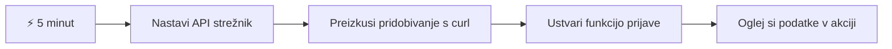
- **1.–2. minuta**: Zaženite svoj API strežnik (`cd api && npm start`) in preizkusite povezavo
- **3. minuta**: Ustvarite osnovno funkcijo `getAccount()` z uporabo fetch
- **4. minuta**: Povežite prijavni obrazec z `action="javascript:login()"`
- **5. minuta**: Preizkusite prijavo in opazujte podatke o računu v konzoli

**Hitri ukazi za testiranje**:
```bash
# Preveri, ali API deluje
curl http://localhost:5000/api

# Preizkusi pridobivanje podatkov računa
curl http://localhost:5000/api/accounts/test
```

**Zakaj je to pomembno**: V 5 minutah boste videli magijo asinkronega pridobivanja podatkov, ki poganja vsako moderno spletno aplikacijo. To je temelj, ki aplikacijam daje občutek odzivnosti in živosti.

## 🗺️ Vaša učna pot skozi spletne aplikacije, ki temeljijo na podatkih

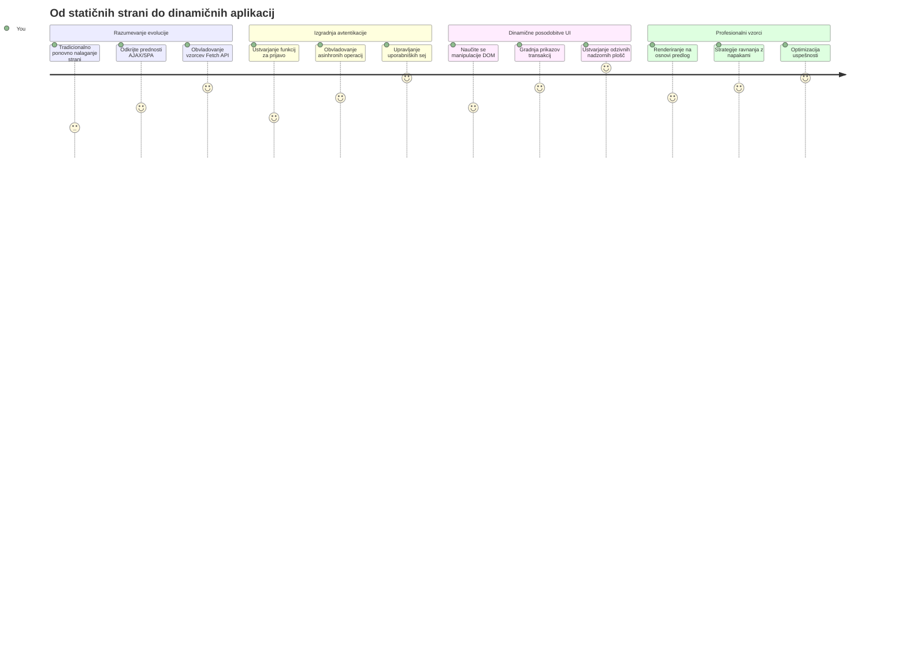
**Cilj vaše poti**: Do konca te lekcije boste razumeli, kako sodobne spletne aplikacije pridobivajo, obdelujejo in prikazujejo podatke dinamično ter ustvarjajo nemotene uporabniške izkušnje, ki jih pričakujemo od profesionalnih aplikacij.

## Predpredavanje vprašalnik

[Predpredavanje vprašalnik](https://ff-quizzes.netlify.app/web/quiz/45)

### Predpogoji

Preden se poglobite v pridobivanje podatkov, poskrbite, da imate pripravljene naslednje komponente:

- **Pretekla lekcija**: Dokončajte [prijavni in registracijski obrazec](../2-forms/README.md) – na tej podlagi bomo gradili
- **Lokalni strežnik**: Namestite [Node.js](https://nodejs.org) in [zaženite API strežnik](../api/README.md), ki zagotavlja podatke o računih
- **Povezava z API**: Preizkusite povezavo s strežnikom s tem ukazom:

```bash
curl http://localhost:5000/api
# Pričakovan odgovor: "Bank API v1.0.0"
```

Ta hiter test zagotavlja pravilno komunikacijo vseh komponent:
- Preveri, da Node.js pravilno deluje na vašem sistemu
- Potrdi, da je vaš API strežnik aktiven in odziven
- Validira, da lahko vaša aplikacija doseže strežnik (kot preverjanje radijskega stika pred misijo)

## 🧠 Pregled ekosistema upravljanja podatkov

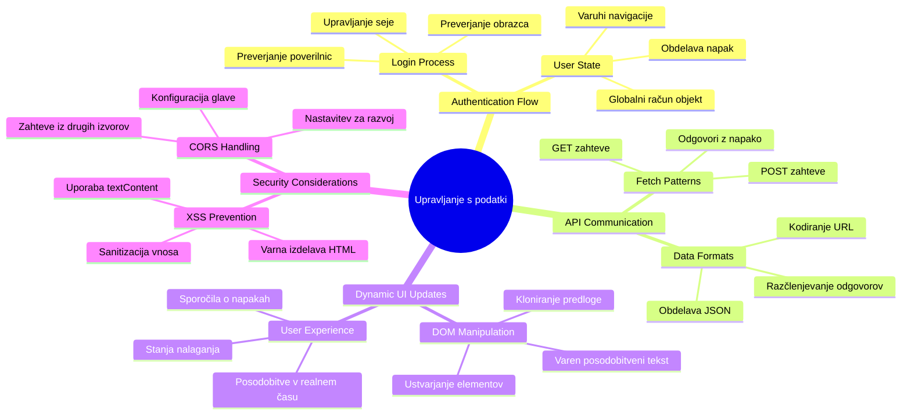
**Osnovno načelo**: Sodobne spletne aplikacije so sistemi za orkestracijo podatkov – usklajujejo uporabniške vmesnike, API strežnike in varnostne modele brskalnikov za ustvarjanje nemotene, odzivne izkušnje.

---

## Razumevanje pridobivanja podatkov v sodobnih spletnih aplikacijah

Način, kako spletne aplikacije obvladujejo podatke, se je v zadnjih dveh desetletjih dramatično spremenil. Razumevanje te evolucije vam bo pomagalo ceniti, zakaj so sodobne tehnike, kot sta AJAX in Fetch API, tako zmogljive in zakaj so postale nepogrešljiva orodja za spletne razvijalce.

Raziščimo, kako so tradicionalne spletne strani delovale v primerjavi z dinamičnimi, odzivnimi aplikacijami, ki jih danes gradimo.

### Tradicionalne večstranične aplikacije (MPA)

V zgodnjih dneh spleta je vsak klik spominjal na menjavo kanalov na stari televiziji – zaslon je potemnil in se počasi osredotočil na novo vsebino. To je bila realnost zgodnjih spletnih aplikacij, kjer je vsak vmesnik pomenil popolno obnovo celotne strani.

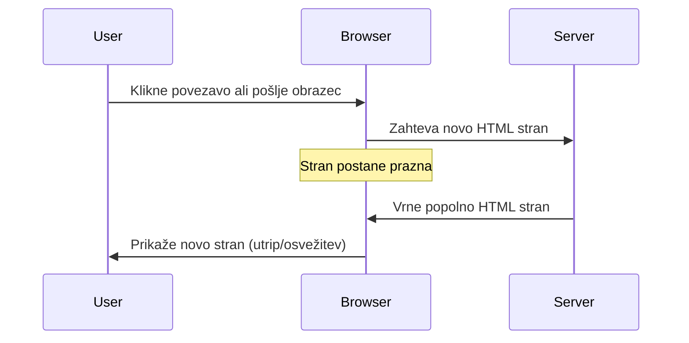
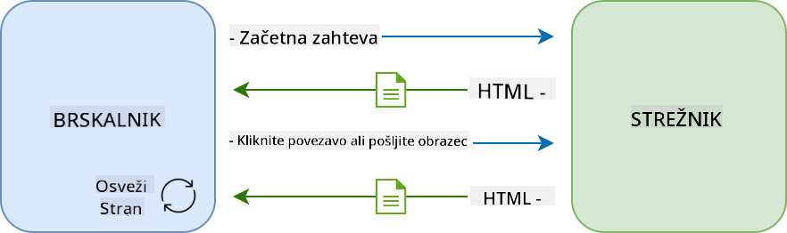

**Zakaj je ta pristop deloval nerodno:**
- Vsak klik je pomenil, da je bilo treba znova zgraditi celotno stran od začetka
- Uporabniki so bili prekinjeni s temi nadležnimi utripajočimi stranmi
- Vaša internetna povezava je delala nadure, saj je večkrat prenašala isti glavi in nogi del strani
- Aplikacije so se zdele bolj kot listanje po arhivskih predalih kot uporaba programske opreme

### Sodobne enostranične aplikacije (SPA)

AJAX (Asynchronous JavaScript and XML) je to paradigmo popolnoma spremenil. Kot modularna zasnova Mednarodne vesoljske postaje, kjer astronavti lahko zamenjajo posamezne komponente brez obnove celotne strukture, AJAX omogoča posodobitev določenih delov spletne strani brez ponovnega nalaganja vsega. Čeprav ime omenja XML, danes večinoma uporabljamo JSON, vendar osnovno načelo ostaja: posodobi le tisto, kar je treba.

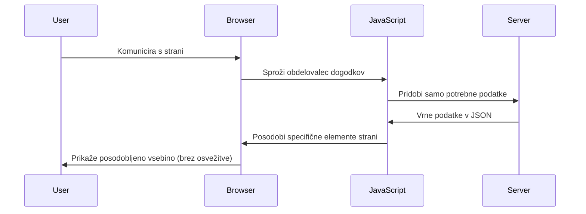


**Zakaj so SPA tako prijetne:**
- Posodobijo se samo deli, ki so se dejansko spremenili (pametno, kajne?)
- Ni več nadležnih prekinitev – uporabniki ostanejo v svojem toku
- Manj podatkov potuje po omrežju, kar pomeni hitrejše nalaganje
- Vse se zdi odzivno in živahno, kot aplikacije na vašem telefonu

### Evolucija do sodobnega Fetch API

Sodobni brskalniki nudijo [`Fetch` API](https://developer.mozilla.org/docs/Web/API/Fetch_API), ki nadomešča starejši [`XMLHttpRequest`](https://developer.mozilla.org/docs/Web/API/XMLHttpRequest/Using_XMLHttpRequest). Tako kot je razlika med upravljanjem telegrafa in uporabo elektronske pošte, Fetch API uporablja obljube (promises) za čistejšo asinhrono kodo in naravno obravnava JSON.

| Značilnost | XMLHttpRequest | Fetch API |
|------------|----------------|-----------|
| **Sintaksa** | Kompleksen, temelji na klicih nazaj | Čista z obljubami (promises) |
| **Obdelava JSON** | Ročno razčlenjevanje | Vgrajena metoda `.json()` |
| **Obdelava napak** | Omejene informacije o napakah | Celoviti podatki o napakah |
| **Sodobna podpora** | Združljivost za ostarele | ES6+ obljube in async/await |

> 💡 **Združljivost brskalnikov**: Dobra novica – Fetch API deluje v vseh sodobnih brskalnikih! Če vas zanimajo specifične verzije, ima [caniuse.com](https://caniuse.com/fetch) celotno zgodbo o združljivosti.
> 
**Povzetek:**
- Odlično deluje v Chrome, Firefox, Safari in Edge (prakticno kjerkoli, kjer so vaši uporabniki)
- Le Internet Explorer potrebuje dodatno pomoč (in iskreno, čas je, da se poslovimo od IE)
- Odlično vas pripravi na elegantne vzorce async/await, ki jih bomo uporabljali kasneje

### Implementacija prijave uporabnika in pridobivanje podatkov

Zdaj implementirajmo sistem prijave, ki bo vašo bančno aplikacijo spremenil iz statičnega prikaza v funkcionalno aplikacijo. Tako kot avtentikacijski protokoli v varnih vojaških objektih, bomo preverili uporabniške poverilnice in nato ponudili dostop do njihovih specifičnih podatkov.

Gradili bomo postopoma, začeli z osnovno avtentikacijo in nato dodali funkcionalnosti za pridobivanje podatkov.

#### 1. korak: Ustvarite osnovo funkcije za prijavo

Odprite svoje datoteko `app.js` in dodajte novo funkcijo `login`. Ta bo upravljala proces preverjanja uporabnika:

```javascript
async function login() {
  const loginForm = document.getElementById('loginForm');
  const user = loginForm.user.value;
}
```

**Razčlenimo to:**
- Ta ključna beseda `async`? Pove JavaScriptu, da bi ta funkcija lahko čakala na določene stvari
- Iz strani pridobimo naš obrazec (nič posebnega, samo ga najdemo po ID-ju)
- Nato izvlečemo uporabniško ime, ki ga je uporabnik vnesel
- Tukaj je pametni trik: do katerega koli polja v obrazcu lahko dostopate po atributu `name` – ni treba dodatnih klicev getElementById!

> 💡 **Vzorec dostopa do obrazca**: Vsak nadzor v obrazcu je dostopen po njegovem imenu (nastavljenem v HTML z atributom `name`) kot lastnost obrazca. To omogoča čist in berljiv način pridobivanja podatkov iz obrazca.

#### 2. korak: Ustvarite funkcijo za pridobivanje podatkov o računu

Nato bomo ustvarili namensko funkcijo za pridobivanje podatkov o računu s strežnika. Ta sledi istemu vzorcu kot vaša registracijska funkcija, a se osredotoča na pridobivanje podatkov:

```javascript
async function getAccount(user) {
  try {
    const response = await fetch('//localhost:5000/api/accounts/' + encodeURIComponent(user));
    return await response.json();
  } catch (error) {
    return { error: error.message || 'Unknown error' };
  }
}
```

**Kaj ta koda doseže:**
- **Uporablja** sodoben fetch API za asinhrono zahtevo podatkov
- **Sestavi** GET URL zahtevo z uporabniškim imenom kot parametrom
- **Uporabi** `encodeURIComponent()` za varno ravnanje z izjemnimi znaki v URL-ju
- **Pretvori** odgovor v JSON format za lažje upravljanje podatkov
- **Upravi** napake prijazno tako, da vrne objekt z napako namesto, da se ustavi

> ⚠️ **Varnostna opomba**: Funkcija `encodeURIComponent()` varno upravlja posebne znake v URL-jih. Tako kot kodirni sistemi v mornarici zagotavlja, da vaš sporočilo prispe natanko takšno, kot je mišljeno, in preprečuje napačno interpretacijo znakov, kot sta "#" ali "&".
> 
**Zakaj je to pomembno:**
- Preprečuje, da posebni znaki prekinejo URL-je
- Varuje pred napadi manipulacije URL-jev
- Zagotavlja, da strežnik prejme pravilne podatke
- Sledi varnim praksam kodiranja

#### Razumevanje HTTP GET zahtev

Nekaj, kar vas bo morda presenetilo: ko uporabite `fetch` brez dodatnih nastavitev, samodejno ustvari [`GET`](https://developer.mozilla.org/docs/Web/HTTP/Methods/GET) zahtevo. To je popolno za naš primer – sprašujemo strežnik "hej, lahko vidim podatke za tega uporabnika?"

Zahteve GET so kot vljudno prosjenje za izposojo knjige iz knjižnice – zahtevate ogled nečesa obstoječega. POST zahteve (ki smo jih uporabljali za registracijo) so bolj kot oddaja nove knjige za dodajanje v zbirko.

| GET zahteva | POST zahteva |
|-------------|--------------|
| **Namen** | Pridobivanje obstoječih podatkov | Pošiljanje novih podatkov strežniku |
| **Parametri** | V URL poti/nizih poizvedb | V telesu zahteve |
| **Predpomnjenje** | Lahko predpomnjene v brskalniku | Običajno ne predpomnjene |
| **Varnost** | Vidne v URL-jih/zgodovinah | Skrite v telesu zahteve |

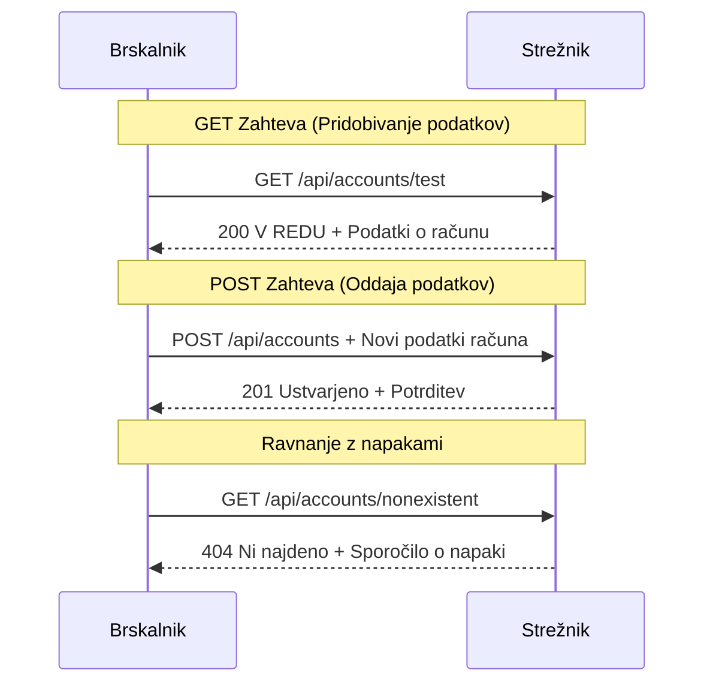
#### 3. korak: Združitev vsega skupaj

Zdaj za zadovoljiv del – povežimo vašo funkcijo za pridobivanje računa s postopkom prijave. Tu vse začne delovati:

```javascript
async function login() {
  const loginForm = document.getElementById('loginForm');
  const user = loginForm.user.value;
  const data = await getAccount(user);

  if (data.error) {
    return console.log('loginError', data.error);
  }

  account = data;
  navigate('/dashboard');
}
```

Ta funkcija sledi jasnemu zaporedju:
- Izvleče uporabniško ime iz obrazca
- Zahteva podatke o uporabnikovem računu od strežnika
- Obravnava napake, ki se pojavijo med postopkom
- Shrani podatke o računu in preusmeri na nadzorno ploščo ob uspehu

> 🎯 **Vzorec Async/Await**: Ker je `getAccount` asinhrona funkcija, uporabimo ključni besedi `await`, da zaustavimo izvajanje dokler strežnik ne odgovori. To preprečuje nadaljevanje kode z nedefiniranimi podatki.

#### 4. korak: Ustvarite shrambo za vaše podatke

Vaša aplikacija potrebuje nekje, da si zapomni informacije o računu, ko so naložene. To je kot kratkoročni spomin vaše aplikacije – prostor za hranjenje trenutnih uporabniških podatkov na dosegu roke. Dodajte to vrstico na vrh datoteke `app.js`:

```javascript
// To hrani podatke o trenutnem uporabnikovem računu
let account = null;
```

**Zakaj to potrebujemo:**
- Omogoča dostop do podatkov o računu od kjerkoli v aplikaciji
- Začetek z `null` pomeni "še nihče ni prijavljen"
- Posodobi se, ko se nekdo uspešno prijavi ali registrira
- Deluje kot enotni vir resnice – brez zmede, kdo je prijavljen

#### 5. korak: Povežite svoj obrazec

Zdaj povežimo vašo novo prijavno funkcijo z vašim HTML obrazcem. Posodobite oznako obrazca tako:

```html
<form id="loginForm" action="javascript:login()">
  <!-- Your existing form inputs -->
</form>
```

**Kaj ta majhna sprememba naredi:**
- Prepreči privzeto vedenje obrazca "osveži celotno stran"
- Pokliče vašo prilagojeno JavaScript funkcijo
- Ohranja vse gladko, kot enostranska aplikacija
- Daje vam popoln nadzor nad tem, kaj se zgodi ob pritisku na "Prijava"

#### 6. korak: Izboljšajte svojo registracijsko funkcijo

Za doslednost posodobite funkcijo `register`, da tudi shrani podatke o računu in preusmeri na nadzorno ploščo:

```javascript
// Na konec vaše funkcije register dodajte te vrstice
account = result;
navigate('/dashboard');
```

**Ta izboljšava zagotavlja:**
- **Nemoten** prehod od registracije do nadzorne plošče
- **Dosledno** uporabniško izkušnjo med prijavo in registracijo
- **Neposreden** dostop do podatkov o računu takoj po uspešni registraciji

#### Preizkus vaše implementacije

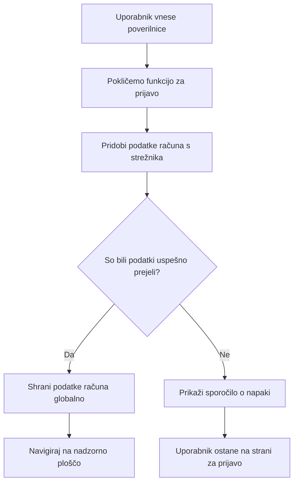
**Čas za testiranje:**
1. Ustvarite nov račun, da potrdite delovanje
2. Poskusite se prijaviti z istimi poverilnicami
3. Pokukajte v konzolo brskalnika (F12), če se kaj ne zdi prav
4. Preverite, da pristanete na nadzorni plošči po uspešni prijavi

Če nekaj ne deluje, ne paničarite! Večina težav so enostavne napake, kot so tipkarske napake ali pozaba zagona API strežnika.

#### Kratek komentar o čarovniji med domenami

Morda se sprašujete: "Kako moja spletna aplikacija komunicira s tem API strežnikom, če te tečejo na različnih vratih?" Odlično vprašanje! To se dotika teme, na katero vsak spletni razvijalec prej ali slej naleti.

> 🔒 **Varnost med različnimi izvorji (cross-origin)**: Brskalniki izvajajo "policijo enakega izvora" za preprečevanje nepooblaščenih komunikacij med različnimi domenami. Tako kot nadzorni punkt v Pentagonski zgradbi preverijo, ali je komunikacija pooblaščena, preden dovolijo prenos podatkov.
> 
**V naši postavitvi:**
- Vaša spletna aplikacija teče na `localhost:3000` (strežnik za razvoj)
- Vaš API strežnik teče na `localhost:5000` (strežnik backend)
- API strežnik vključuje [CORS glave](https://developer.mozilla.org/docs/Web/HTTP/CORS), ki izrecno dovoljujejo komunikacijo iz vaše spletne aplikacije

Ta nastavitev odraža razvijalno okolje, kjer frontend in backend običajno tečeta na ločenih strežnikih.

> 📚 **Več o tem**: Poglobite se v API-je in pridobivanje podatkov z obsežno [Microsoft Learn lekcijo o API-jih](https://docs.microsoft.com/learn/modules/use-apis-discover-museum-art/?WT.mc_id=academic-77807-sagibbon).

## Oživitev vaših podatkov v HTML-ju

Zdaj bomo pridobljene podatke naredili vidne uporabnikom prek manipulacije z DOM. Tako kot proces razvijanja fotografij v temni sobi, vzamemo nevidne podatke in jih prikažemo kot nekaj, s čimer lahko uporabniki vidno komunicirajo.
Manipulacija z DOM-om je tehnika, ki statične spletne strani spremeni v dinamične aplikacije, ki posodabljajo svojo vsebino na podlagi uporabniških interakcij in odzivov strežnika.

### Izbira pravega orodja za delo

Ko gre za posodabljanje vašega HTML-ja z JavaScriptom, imate več možnosti. Pomislite na to kot na različna orodja v orodjarni - vsak je popoln za določena opravila:

| Metoda | Za kaj je uporabna | Kdaj jo uporabiti | Raven varnosti |
|--------|---------------------|------------------|----------------|
| `textContent` | Varno prikazovanje uporabniških podatkov | Kadar koli prikazujete besedilo | ✅ Trdno kot skala |
| `createElement()` + `append()` | Gradnja zapletenih postavitev | Ustvarjanje novih odsekov/seznamov | ✅ Nezlomljivo |
| `innerHTML` | Nastavljanje HTML vsebine | ⚠️ Poskusite se ji izogniti | ❌ Tvegano |

#### Varna pot za prikaz besedila: textContent

Lastnost [`textContent`](https://developer.mozilla.org/docs/Web/API/Node/textContent) je vaš najboljši prijatelj pri prikazu uporabniških podatkov. Je kot izhodna kontrola za vašo spletno stran - nič škodljivega ne more priti skozi:

```javascript
// Varna, zanesljiva metoda za posodabljanje besedila
const balanceElement = document.getElementById('balance');
balanceElement.textContent = account.balance;
```

**Prednosti textContent:**
- Vse obravnava kot navadno besedilo (preprečuje izvajanje skript)
- Samodejno počisti obstoječo vsebino
- Učinkovito za preproste posodobitve besedila
- Zagotavlja vgrajeno zaščito pred zlonamerno vsebino

#### Ustvarjanje dinamičnih HTML elementov

Za bolj zapletene vsebine združite [`document.createElement()`](https://developer.mozilla.org/docs/Web/API/Document/createElement) z metodo [`append()`](https://developer.mozilla.org/docs/Web/API/ParentNode/append):

```javascript
// Varen način za ustvarjanje novih elementov
const transactionItem = document.createElement('div');
transactionItem.className = 'transaction-item';
transactionItem.textContent = `${transaction.date}: ${transaction.description}`;
container.append(transactionItem);
```

**Razumevanje tega pristopa:**
- **Ustvari** nove DOM elemente programsko
- **Ohrani** popoln nadzor nad atributi in vsebino elementov
- **Omogoča** zapletene, gnezdene strukture elementov
- **Ohranja** varnost z ločevanjem strukture od vsebine

> ⚠️ **Premislek o varnosti**: Čeprav se [`innerHTML`](https://developer.mozilla.org/docs/Web/API/Element/innerHTML) pogosto pojavlja v mnogih vodičih, lahko izvršuje vgrajene skripte. Tako kot varnostni protokoli v CERN-u preprečujejo nepooblaščeno izvajanje kode, uporaba `textContent` in `createElement` ponuja varnejše alternative.
> 
**Tveganja innerHTML:**
- Izvaja vse `<script>` oznake v uporabniških podatkih
- Ranljiv na napade z vbrizgavanjem kode
- Ustvarja potencialne varnostne ranljivosti
- Varnejše alternative, ki jih uporabljamo, nudijo enako funkcionalnost

### Prijaznejše napake za uporabnike

Trenutno se napake pri prijavi prikazujejo le v konzoli brskalnika, ki je uporabnikom nevidna. Tako kot je razlika med notranjo diagnostiko pilota in informativnim sistemom za potnike, moramo pomembna sporočila posredovati preko ustreznega kanala.

Prikaz vidnih sporočil o napakah uporabnikom zagotavlja takojšen odziv o tem, kaj je šlo narobe in kako naprej.

#### Korak 1: Dodajte mesto za sporočila o napakah

Najprej dodajmo sporočilom o napakah prostor v vašem HTML-ju. Vstavite to tik pred gumb za prijavo, da ga bodo uporabniki videli naravno:

```html
<!-- This is where error messages will appear -->
<div id="loginError" role="alert"></div>
<button>Login</button>
```

**Kaj se tukaj dogaja:**
- Ustvarjamo prazen vsebnik, ki ostane neviden, dokler ni potreben
- Postavljen je tam, kjer uporabniki naravno pogledajo po kliku na "Prijava"
- Ta `role="alert"` je lep dodatek za bralnike zaslona - sporoča pomožni tehnologiji "hej, to je pomembno!"
- Edinstven `id` omogoča našemu JavaScriptu enostaven cilj

#### Korak 2: Ustvarite priročno pomožno funkcijo

Naredimo majhno funkcijo pripomoček, ki lahko posodobi besedilo kateregakoli elementa. To je ena izmed tistih "napiši enkrat, uporabi povsod" funkcij, ki vam bo prihranila čas:

```javascript
function updateElement(id, text) {
  const element = document.getElementById(id);
  element.textContent = text;
}
```

**Prednosti funkcije:**
- Enostaven vmesnik, ki zahteva samo ID elementa in besedilno vsebino
- Varno najde in posodobi DOM elemente
- Zmogljiva ponovna uporaba z zmanjšanjem podvajanja kode
- Ohranja enakomerno vedenje posodobitev po celotni aplikaciji

#### Korak 3: Prikažite napake tam, kjer jih uporabniki vidijo

Zdaj zamenjajmo tisto skrito sporočilo v konzoli z nečim, kar uporabniki lahko dejansko vidijo. Posodobite svojo funkcijo za prijavo:

```javascript
// Namesto da samo beležite v konzolo, pokažite uporabniku, kaj je narobe
if (data.error) {
  return updateElement('loginError', data.error);
}
```

**Ta majhna sprememba naredi veliko razliko:**
- Sporočila o napakah se prikažejo natanko tam, kjer uporabniki gledajo
- Ni več skrivnih tihega odpovedovanja
- Uporabniki dobijo takojšen, praktičen odziv
- Vaša aplikacija začne izpadati profesionalno in premišljeno

Zdaj, ko testirate z neveljavnim računom, boste na strani videli uporabno sporočilo o napaki!


#### Korak 4: Vključevanje dostopnosti

Nekaj kul o tistem `role="alert"`, ki smo ga prej dodali - ni le dekoracija! Ta atribut ustvari [Live Region](https://developer.mozilla.org/docs/Web/Accessibility/ARIA/ARIA_Live_Regions), ki takoj sporoči spremembe bralnikom zaslona:

```html
<div id="loginError" role="alert"></div>
```

**Zakaj je to pomembno:**
- Uporabniki bralnikov zaslona slišijo sporočilo o napaki takoj ob pojavu
- Vsi dobijo enake pomembne informacije, ne glede na način navigacije
- Preprosta pot do bolj dostopne aplikacije
- Pokaže, da vam je mar za vključujoče izkušnje

Majhni detajli, kot je ta, ločijo dobre razvijalce od odličnih!

### 🎯 Pedagoški premislek: vzorci avtentikacije

**Ustavite se in premislite**: Ravnokar ste implementirali celoten tok avtentikacije. To je temeljni vzorec pri spletnem razvoju.

**Hitra samoocena**:
- Ali lahko razložite, zakaj uporabljamo async/await za klice API-ja?
- Kaj bi se zgodilo, če bi pozabili funkcijo `encodeURIComponent()`?
- Kako naša obravnava napak izboljša uporabniško izkušnjo?

**Povezava z resničnim svetom**: Vzorci, ki ste jih tukaj spoznali (asinkrono pridobivanje podatkov, obravnava napak, povratne informacije uporabnikom), se uporabljajo v vsaki večji spletni aplikaciji, od družbenih omrežij do e-trgovin. Gradite proizvodne veščine!

**Izziv**: Kako bi lahko spremenili ta sistem avtentikacije, da podpira več uporabniških vlog (stranka, administrator, blagajnik)? Razmislite o strukturi podatkov in spremembah v uporabniškem vmesniku.

#### Korak 5: Uporabite isti vzorec za registracijo

Za usklajenost implementirajte enako obravnavo napak v svoji registracijski obrazec:

1. **Dodajte** element za prikaz napak v vašo registracijsko HTML stran:
```html
<div id="registerError" role="alert"></div>
```

2. **Posodobite** svojo funkcijo registracije, da uporablja isti vzorec prikaza napak:
```javascript
if (data.error) {
  return updateElement('registerError', data.error);
}
```

**Prednosti doslednega obravnavanja napak:**
- **Nudi** enotno uporabniško izkušnjo na vseh obrazcih
- **Zmanjšuje** kognitivno obremenitev z uporabo znanih vzorcev
- **Poenostavlja** vzdrževanje z ponovno uporabno kodo
- **Zagotavlja** skladnost s standardi dostopnosti v celotni aplikaciji

## Ustvarjanje dinamične nadzorne plošče

Zdaj bomo vašo statično nadzorno ploščo spremenili v dinamični vmesnik, ki prikazuje resnične podatke o računu. Tako kot je razlika med natiskanimi vozni redi letov in živo prikazanimi odhodi na letališčih, premikamo se od statičnih informacij k realnočasovnim, odzivnim prikazom.

Z uporabo tehnik manipulacije DOM, ki ste jih spoznali, bomo ustvarili nadzorno ploščo, ki se samodejno posodablja s trenutnimi podatki o računu.

### Spoznajte svoje podatke

Preden začnemo z gradnjo, poglejmo, kakšne podatke vam strežnik pošlje nazaj. Ko se nekdo uspešno prijavi, prejmete to bogastvo informacij:

```json
{
  "user": "test",
  "currency": "$",
  "description": "Test account",
  "balance": 75,
  "transactions": [
    { "id": "1", "date": "2020-10-01", "object": "Pocket money", "amount": 50 },
    { "id": "2", "date": "2020-10-03", "object": "Book", "amount": -10 },
    { "id": "3", "date": "2020-10-04", "object": "Sandwich", "amount": -5 }
  ]
}
```

**Ta podatkovna struktura vsebuje:**
- **`user`**: Popolno za personalizacijo izkušnje ("Dobrodošli nazaj, Sarah!")
- **`currency`**: Skrbi, da pravilno prikažemo denarne zneske
- **`description`**: Prijazno ime za račun
- **`balance`**: Vse pomembno trenutno stanje
- **`transactions`**: Celotno zgodovino transakcij s podrobnimi podatki

Vse, kar potrebujete za profesionalno izgledajočo bančno nadzorno ploščo!

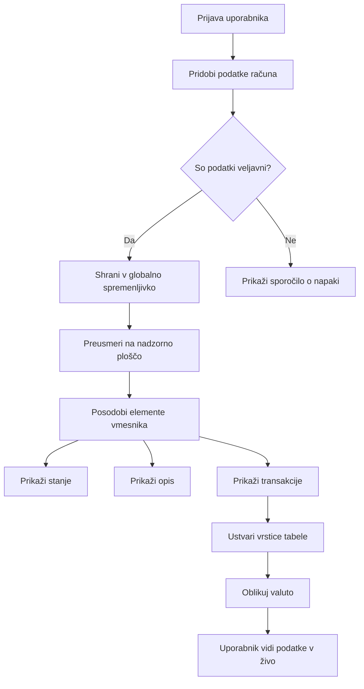
> 💡 **Koristen nasvet**: Želite videti svojo nadzorno ploščo takoj v akciji? Pri prijavi uporabite uporabniško ime `test` - ta račun vsebuje predhodno naložene vzorčne podatke, da boste lahko vse videli delujoče brez ustvarjanja transakcij.
> 
**Zakaj je testni račun uporaben:**
- Prihaja z realistično prednaloženimi vzorčnimi podatki
- Idealno za ogled, kako se prikazujejo transakcije
- Odlično za testiranje funkcij nadzorne plošče
- Prihrani vam ročno ustvarjanje testnih podatkov

### Ustvarjanje elementov za prikaz na nadzorni plošči

Začnimo postopno graditi vaš nadzorni vmesnik, najprej s povzetkom informacij o računu in nato z bolj zapletenimi funkcijami, kot so seznami transakcij.

#### Korak 1: Posodobite strukturo HTML

Najprej zamenjajte statični del "Stanje" z dinamičnimi rezerviranimi mesti, ki jih lahko napolnite z JavaScriptom:

```html
<section>
  Balance: <span id="balance"></span><span id="currency"></span>
</section>
```

Nato dodajte odsek za opis računa. Ker deluje kot naslov vsebine nadzorne plošče, uporabite semantični HTML:

```html
<h2 id="description"></h2>
```

**Razumevanje strukture HTML:**
- **Uporablja** ločene `<span>` elemente za stanje in valuto za individualni nadzor
- **Pripiše** edinstvene ID-je vsakemu elementu za ciljanje iz JavaScript-a
- **Sledi** semantičnemu HTML z uporabo `<h2>` za opis računa
- **Ustvari** logično hierarhijo za bralnike zaslona in SEO

> ✅ **Vpogled v dostopnost**: Opis računa deluje kot naslov vsebine nadzorne plošče, zato je semantično označen kot naslov. Več o vplivu [strukture naslovov](https://www.nomensa.com/blog/2017/how-structure-headings-web-accessibility) na dostopnost si lahko preberete tukaj. Ali lahko prepoznate druge elemente na vaši strani, ki bi imeli koristi od uporabe naslovnih oznak?

#### Korak 2: Ustvarite funkcijo za posodobitev nadzorne plošče

Zdaj ustvarite funkcijo, ki bo polnila vašo nadzorno ploščo z resničnimi podatki o računu:

```javascript
function updateDashboard() {
  if (!account) {
    return navigate('/login');
  }

  updateElement('description', account.description);
  updateElement('balance', account.balance.toFixed(2));
  updateElement('currency', account.currency);
}
```

**Korak za korakom, kaj ta funkcija počne:**
- **Preveri**, ali podatki o računu obstajajo, preden nadaljuje
- **Preusmeri** neprijavljene uporabnike nazaj na prijavno stran
- **Posodobi** opis računa z ponovno uporabno funkcijo `updateElement`
- **Formatira** stanje, da vedno prikaže dve decimalni mesti
- **Prikaže** ustrezni simbol valute

> 💰 **Oblikovanje denarja**: Ta metoda [`toFixed(2)`](https://developer.mozilla.org/docs/Web/JavaScript/Reference/Global_Objects/Number/toFixed) je pravi rešitelj! Zagotavlja, da vaše stanje vedno izgleda kot pravi denar - "75.00" namesto samo "75". Vaši uporabniki bodo cenili poznan format valute.

#### Korak 3: Poskrbite, da se vaša nadzorna plošča posodablja

Da bo vaša nadzorna plošča osvežila podatke vsakič, ko jo nekdo obišče, se moramo priklopiti v vaš navigacijski sistem. Če ste naredili [domačo nalogo iz lekcije 1](../1-template-route/assignment.md), vam bo to znano. Če ne, brez skrbi - tukaj je, kar potrebujete:

Dodajte to na konec vaše funkcije `updateRoute()`:

```javascript
if (typeof route.init === 'function') {
  route.init();
}
```

Nato posodobite vaše poti, da vključujejo inicializacijo nadzorne plošče:

```javascript
const routes = {
  '/login': { templateId: 'login' },
  '/dashboard': { templateId: 'dashboard', init: updateDashboard }
};
```

**Kaj ta pametna nastavitev počne:**
- Preveri, ali ima določena pot kodo za inicializacijo
- To kodo samodejno zažene ob nalaganju poti
- Zagotovi, da nadzorna plošča vedno prikazuje sveže, aktualne podatke
- Održi vašo logiko poti čisto in organizirano

#### Preizkusite vašo nadzorno ploščo

Po implementaciji teh sprememb preizkusite vašo nadzorno ploščo:

1. **Prijavite se** s testnim računom
2. **Preverite**, da ste preusmerjeni na nadzorno ploščo
3. **Preverite**, da se opis računa, stanje in valuta pravilno prikazujejo
4. **Poskusite se odjaviti in potem ponovno prijaviti**, da zagotovite pravilno osvežitev podatkov

Vaša nadzorna plošča bi morala zdaj prikazovati dinamične podatke o računu, ki se posodabljajo glede na podatke prijavljenega uporabnika!

## Gradnja pametnih seznamov transakcij z uporabniškimi predlogami (templates)

Namesto ročnega ustvarjanja HTML-ja za vsako transakcijo bomo uporabili predloge, da samodejno generiramo dosledno oblikovanje. Tako kot standardizirani sestavni deli v proizvodnji vesoljskih plovil, predloge zagotavljajo, da vsak vrstica transakcije sledi isti strukturi in videzu.

Ta tehnika učinkovito skalira od nekaj transakcij do tisočakov, ob ohranitvi enake zmogljivosti in predstavitve.

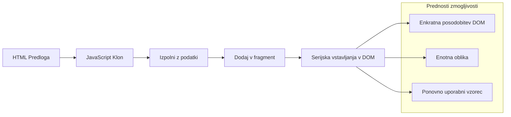
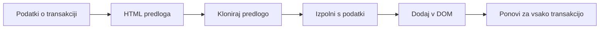
### Korak 1: Ustvarite predlogo za transakcijo

Najprej dodajte ponovno uporabno predlogo za vrstice transakcij v vašemu HTML `<body>`:

```html
<template id="transaction">
  <tr>
    <td></td>
    <td></td>
    <td></td>
  </tr>
</template>
```

**Razumevanje HTML predlog:**
- **Določa** strukturo za eno vrstico tabele
- **Ostane** nevidna, dokler je ne podvojimo in napolnimo z JavaScriptom
- **Vsebuje** tri celice za datum, opis in znesek
- **Nudi** vzorec za dosledno oblikovanje, ki ga je mogoče ponovno uporabiti

### Korak 2: Pripravite svojo tabelo za dinamično vsebino

Nato dodajte `id` telesu tabele, da ga JavaScript zlahka poišče:

```html
<tbody id="transactions"></tbody>
```

**Kaj to doseže:**
- **Ustvari** jasen cilj za vstavljanje vrstic transakcij
- **Loči** strukturo tabele od dinamične vsebine
- **Omogoča** enostavno brisanje in ponovno polnjenje podatkov o transakcijah

### Korak 3: Ustvarite "tovarniško" funkcijo vrstic transakcij

Zdaj ustvarite funkcijo, ki spremeni podatke o transakcijah v HTML elemente:

```javascript
function createTransactionRow(transaction) {
  const template = document.getElementById('transaction');
  const transactionRow = template.content.cloneNode(true);
  const tr = transactionRow.querySelector('tr');
  tr.children[0].textContent = transaction.date;
  tr.children[1].textContent = transaction.object;
  tr.children[2].textContent = transaction.amount.toFixed(2);
  return transactionRow;
}
```

**Razčlenitev te "tovarniške" funkcije:**
- **Poišče** element predloge po njegovem ID-ju
- **Podvoji** vsebino predloge za varno manipulacijo
- **Izbere** vrstico tabele znotraj podvojene vsebine
- **Napolni** vsako celico s podatki o transakciji
- **Formatira** znesek, da pokaže pravilne decimalke
- **Vrne** izdelano vrstico, pripravljeno za vstavljanje

### Korak 4: Učinkovito generirajte več vrstic transakcij

Dodajte ta koda v svojo funkcijo `updateDashboard()` za prikaz vseh transakcij:

```javascript
const transactionsRows = document.createDocumentFragment();
for (const transaction of account.transactions) {
  const transactionRow = createTransactionRow(transaction);
  transactionsRows.appendChild(transactionRow);
}
updateElement('transactions', transactionsRows);
```

**Razumevanje tega učinkovitega pristopa:**
- **Ustvari** dokumentni fragment za zbiranje DOM operacij
- **Pojavi** skozi vse transakcije v podatkih o računu
- **Ustvari** vrstico za vsako transakcijo z uporabo tovarniške funkcije
- **Zbere** vse vrstice v fragment preden jih doda v DOM
- **Izvede** enkratno posodobitev DOM-a namesto več posameznih vstavljanj
> ⚡ **Optimizacija zmogljivosti**: [`document.createDocumentFragment()`](https://developer.mozilla.org/docs/Web/API/Document/createDocumentFragment) deluje kot proces sestavljanja pri Boeing-u – komponente se pripravijo izven glavne linije, nato pa namestijo kot celota. Ta pristop serijskega obdelovanja minimizira preureditve DOM z izvedbo enkratne vstavitve namesto več posameznih operacij.

### Korak 5: Izboljšajte funkcijo posodobitve za mešano vsebino

Vaša funkcija `updateElement()` trenutno obravnava le besedilno vsebino. Posodobite jo tako, da bo delovala z besedilo in DOM vozlišči:

```javascript
function updateElement(id, textOrNode) {
  const element = document.getElementById(id);
  element.textContent = ''; // Odstrani vse otroke
  element.append(textOrNode);
}
```

**Ključne izboljšave v tej posodobitvi:**
- **Počisti** obstoječo vsebino pred dodajanjem nove vsebine
- **Sprejema** bodisi besedilne nize ali DOM vozlišča kot parametre
- **Uporablja** metodo [`append()`](https://developer.mozilla.org/docs/Web/API/ParentNode/append) za večjo prilagodljivost
- **Ohranja** združljivost z nazaj za obstoječo rabo, ki temelji na besedilu

### Preizkusite svojo nadzorno ploščo

Prišel je trenutek resnice! Oglejmo si vašo dinamično nadzorno ploščo v akciji:

1. Prijavite se z računom `test` (ima pripravljene vzorčne podatke)
2. Pojdite do svoje nadzorne plošče
3. Preverite, ali se prikažejo vrstice transakcij s pravilno obliko
4. Preverite, ali so datumi, opisi in zneski vsi pravilno prikazani

Če vse deluje, bi morali videti popolnoma funkcionalen seznam transakcij na vaši nadzorni plošči! 🎉

**Kaj ste dosegli:**
- Zgradili ste nadzorno ploščo, ki se prilagaja kateri koli količini podatkov
- Ustvarili ponovno uporabne predloge za dosledno oblikovanje
- Implementirali učinkovite tehnike manipulacije DOM
- Razvili funkcionalnost primerljivo s produkcijskimi bančnimi aplikacijami

Uspešno ste preoblikovali statično spletno stran v dinamično spletno aplikacijo.

### 🎯 Pedagoški pregled: Dinamična generacija vsebine

**Razumevanje arhitekture**: Implementirali ste sofisticirano pretok podatkov do uporabniškega vmesnika, ki odraža vzorce uporabljenih ogrodij, kot so React, Vue in Angular.

**Obvladana ključna koncepta**:
- **Uporaba predlog**: Ustvarjanje ponovno uporabnih komponent UI
- **Dokumentni fragmenti**: Optimizacija zmogljivosti DOM
- **Varna manipulacija DOM**: Preprečevanje varnostnih ranljivosti
- **Transformacija podatkov**: Pretvorba strežniških podatkov v uporabniške vmesnike

**Povezava z industrijo**: Te tehnike tvorijo osnovo sodobnih frontend ogrodij. Virtualni DOM pri Reactu, sistem predlog pri Vue, ter arhitektura komponent pri Angularju temeljijo na teh ključnih konceptih.

**Vprašanje za razmislek**: Kako bi razširili ta sistem za obdelavo posodobitev v realnem času (kot je samodejna prikaz novih transakcij)? Razmislite o uporabi WebSocketov ali dogodkov serverja (Server-Sent Events).

---

## 📈 Vaš časovni načrt obvladovanja upravljanja podatkov

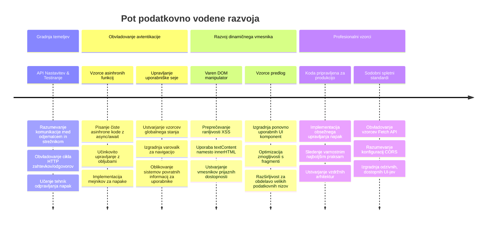
**🎓 Mejniki diplome**: Uspešno ste zgradili celovito podatkovno usmerjeno spletno aplikacijo z uporabo sodobnih vzorcev JavaScripta. Te spretnosti se neposredno prenesejo na delo z ogrodji, kot so React, Vue ali Angular.

**🔄 Zmožnosti za naslednjo stopnjo**:
- Pripravljeni za raziskovanje frontend ogrodij, ki gradijo na teh konceptih
- Pripravljeni implementirati funkcije v realnem času z WebSocketi
- Opremljeni za izdelavo Progresivnih spletnih aplikacij z možnostjo brez povezave
- Postavljene temelje za učenje naprednih vzorcev upravljanja stanja

## Izziv GitHub Copilot Agent 🚀

Uporabite način agent za dokončanje naslednjega izziva:

**Opis:** Izboljšajte bančno aplikacijo z implementacijo funkcije iskanja in filtriranja transakcij, ki uporabnikom omogoča iskanje specifičnih transakcij glede na časovni razpon, znesek ali opis.

**Navodilo:** Ustvarite funkcionalnost iskanja za bančno aplikacijo, ki vključuje: 1) obrazec za iskanje z vnosnimi polji za časovni razpon (od/do), minimalni/maksimalni znesek in ključne besede opisa transakcije, 2) funkcijo `filterTransactions()`, ki filtrira polje account.transactions glede na kriterije iskanja, 3) posodobite funkcijo `updateDashboard()` za prikaz filtriranih rezultatov, in 4) dodajte gumb "Počisti filtre" za ponastavitev pogleda. Uporabite sodobne metode polj JavaScripta, kot je `filter()`, in obravnavajte robne primere za prazne kriterije iskanja.

Več o [načinu agent](https://code.visualstudio.com/blogs/2025/02/24/introducing-copilot-agent-mode) si preberite tukaj.

## 🚀 Izziv

Pripravljeni, da svojo bančno aplikacijo popeljete na naslednjo raven? Poskrbimo, da bo videti in delovati kot nekaj, kar boste dejansko želeli uporabljati. Tukaj so ideje za spodbujanje vaše ustvarjalnosti:

**Naredite jo lepo**: Dodajte CSS slogovne nastavitve, da svojo funkcionalno nadzorno ploščo preoblikujete v nekaj vizualno privlačnega. Razmislite o čistih linijah, dobri razmiku in morda celo rahlih animacijah.

**Naj bo odzivna**: Poskusite uporabiti [media queries](https://developer.mozilla.org/docs/Web/CSS/Media_Queries) za izdelavo [odzivne zasnove](https://developer.mozilla.org/docs/Web/Progressive_web_apps/Responsive/responsive_design_building_blocks), ki odlično deluje na telefonih, tablicah in namizjih. Vaši uporabniki vam bodo hvaležni!

**Dodajte nekaj stila**: Razmislite o barvnem kodiranju transakcij (zeleno za prihodke, rdeče za odhodke), dodajanju ikon ali ustvarjanju učinkov ob premiku miške, ki naredijo vmesnik interaktiven.

Tako bi lahko izgledala dodelana nadzorna plošča:


Ne čutite obveznosti, da morate natančno ujemati ta izgled – uporabite ga kot navdih in naredite svojo različico!

## Kviz po predavanju

[Kviz po predavanju](https://ff-quizzes.netlify.app/web/quiz/46)

## Naloga

[Prestrukturirajte in komentirajte svojo kodo](assignment.md)

---

<!-- CO-OP TRANSLATOR DISCLAIMER START -->
**Omejitev odgovornosti**:
Ta dokument je bil preveden z uporabo AI prevajalske storitve [Co-op Translator](https://github.com/Azure/co-op-translator). Čeprav si prizadevamo za natančnost, prosimo, upoštevajte, da lahko avtomatizirani prevodi vsebujejo napake ali netočnosti. Izvirni dokument v njegovem izvirnem jeziku naj velja za avtoritativni vir. Za ključne informacije priporočamo strokovni prevod s strani človeškega prevajalca. Nismo odgovorni za morebitne nesporazume ali napačne interpretacije, ki izhajajo iz uporabe tega prevoda.
<!-- CO-OP TRANSLATOR DISCLAIMER END -->