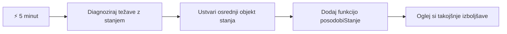
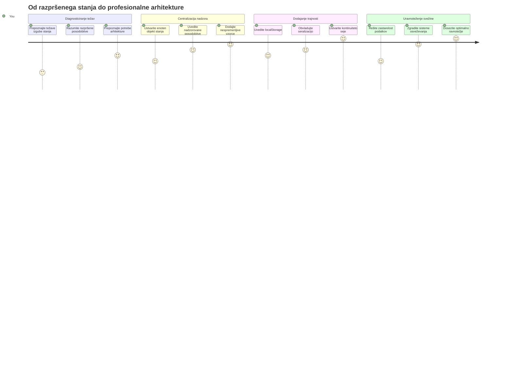
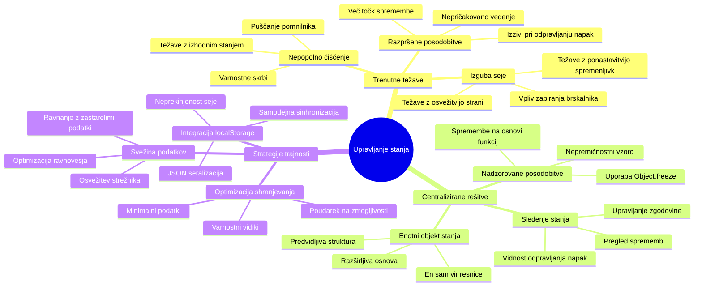
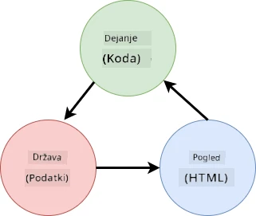
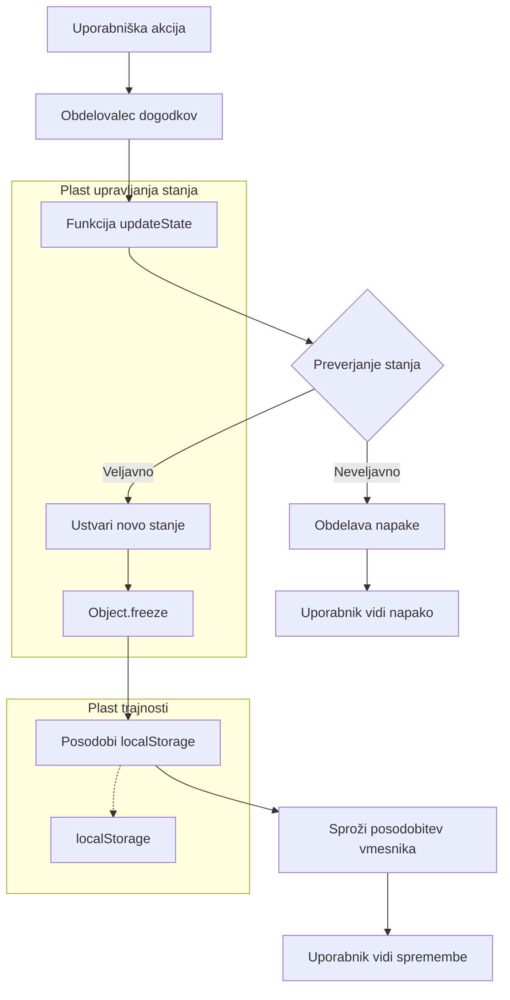
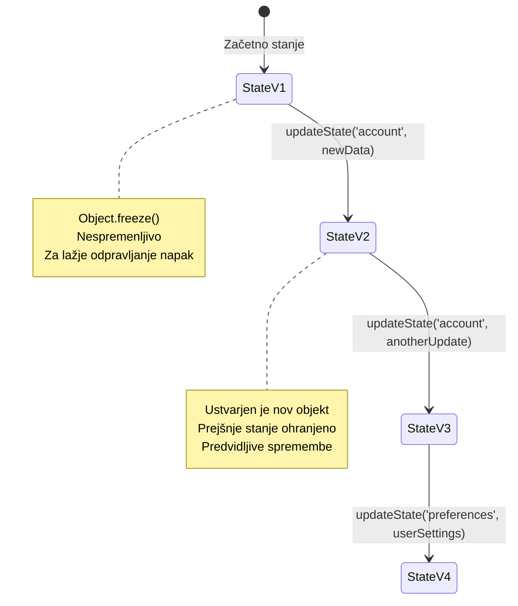
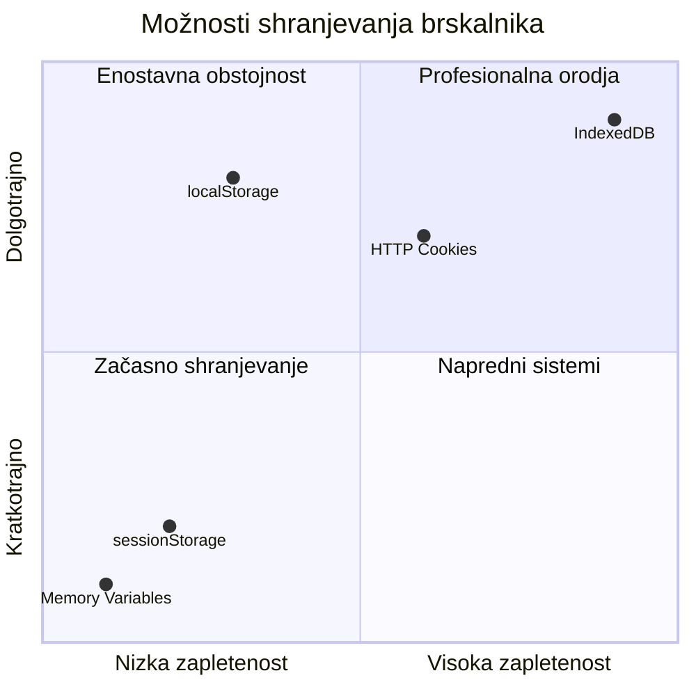
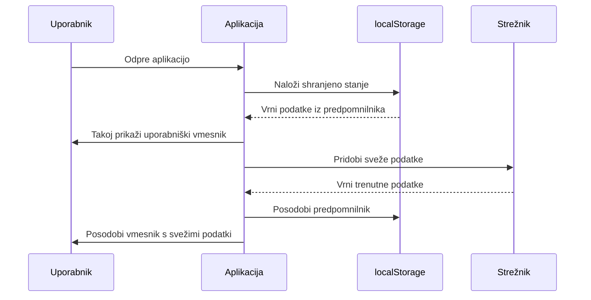
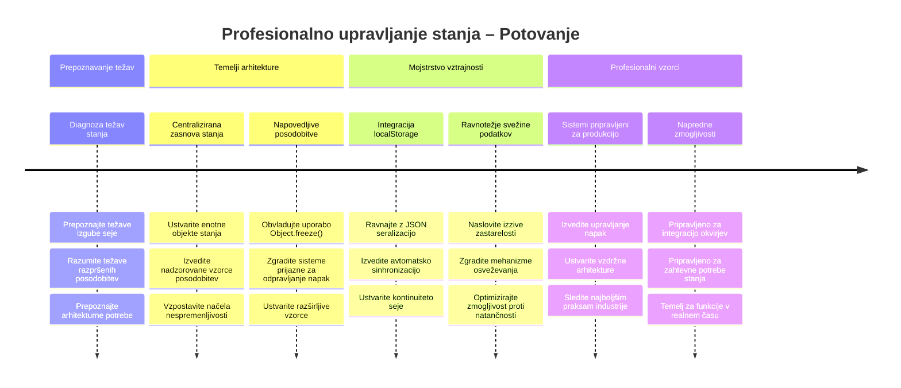
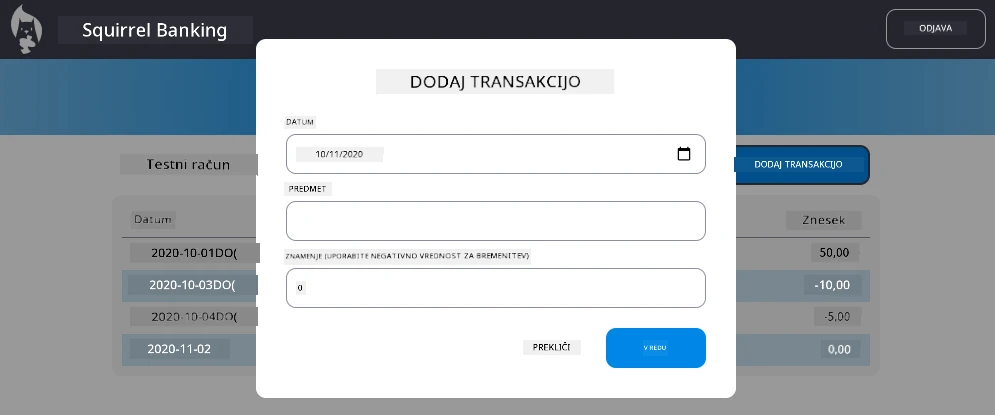

<!--
CO_OP_TRANSLATOR_METADATA:
{
  "original_hash": "b807b09df716dc48a2b750835bf8e933",
  "translation_date": "2026-01-07T10:27:27+00:00",
  "source_file": "7-bank-project/4-state-management/README.md",
  "language_code": "sl"
}
-->
# Zgradite bančno aplikacijo, 4. del: Koncepti upravljanja stanja

## ⚡ Kaj lahko naredite v naslednjih 5 minutah

**Hitra pot za zaposlene razvijalce**


- **1. minuta**: Preizkusite trenutni problem stanja - prijavite se, osvežite stran, opazujte odjavo
- **2. minuta**: Zamenjajte `let account = null` z `let state = { account: null }`
- **3. minuta**: Ustvarite preprosto funkcijo `updateState()` za kontrolirane posodobitve
- **4. minuta**: Posodobite eno funkcijo, da uporablja nov vzorec
- **5. minuta**: Preizkusite izboljšano predvidljivost in možnost odpravljanja napak

**Hiter diagnostični test**:
```javascript
// Pred: Razpršeno stanje
let account = null; // Izgubljeno ob osvežitvi!

// Po: Centralizirano stanje
let state = Object.freeze({ account: null }); // Nadzorovano in sledljivo!
```

**Zakaj je to pomembno**: V 5 minutah boste doživeli preobrazbo od kaotičnega upravljanja stanja do predvidljivih in enostavno odpravljivih vzorcev. To je temelj, ki omogoča vzdrževanje kompleksnih aplikacij.

## 🗺️ Vaša učna pot do obvladovanja upravljanja stanja


**Vaš cilj poti**: Do konca tega učnega sklopa boste zgradili profesionalen sistem upravljanja stanja, ki obvladuje trajnost, svežino podatkov in predvidljive posodobitve - iste vzorce, ki se uporabljajo v produkcijskih aplikacijah.

## Predpredavanje kviz

[Predpredavanje kviz](https://ff-quizzes.netlify.app/web/quiz/47)

## Uvod

Upravljanje stanja je kot navigacijski sistem vesoljskega plovila Voyager – ko vse deluje gladko, komaj opazite, da je tam. A ko gre kaj narobe, je to razlika med dosego medzvezdnega prostora ali izgubljanjem v kozmični praznini. V spletnem razvoju stanje predstavlja vse, kar mora vaša aplikacija zapomniti: stanje prijave uporabnika, podatke obrazcev, zgodovino navigacije in začasna stanja uporabniškega vmesnika.

Ker se je vaša bančna aplikacija razvila iz preprostega obrazca za prijavo v bolj sofisticirano aplikacijo, ste verjetno naleteli na nekaj pogostih izzivov. Osvežite stran in uporabniki nepričakovano odjavljeni. Zaprete brskalnik in ves napredek izgine. Odpravljate napako in iščete po več funkcijah, ki vse spreminjajo iste podatke na različne načine.

To niso znaki slabega kodiranja – so naravne otroške bolezni, ki se pojavijo, ko aplikacije dosežejo določeno raven kompleksnosti. Vsak razvijalec se s temi izzivi sooči, ko njegove aplikacije preidejo iz "dokaza koncepta" v "pripravljene za produkcijo".

V tem učnem sklopu bomo implementirali centraliziran sistem za upravljanje stanja, ki vašo bančno aplikacijo spremeni v zanesljivo, profesionalno aplikacijo. Naučili se boste upravljati podatkovne tokove predvidljivo, trajno shranjevati seje uporabnikov in ustvarjati gladko uporabniško izkušnjo, ki jo zahtevajo sodobne spletne aplikacije.

## Predpogoji

Preden se poglobite v koncepte upravljanja stanja, morate imeti pravilno nastavljeno razvojno okolje in osnovo vaše bančne aplikacije. Ta učni sklop temelji neposredno na konceptih in kodi iz prejšnjih delov serije.

Prepričajte se, da imate pred nadaljevanjem pripravljene naslednje komponente:

**Zahtevana namestitev:**
- Dokončajte [lekcijo o pridobivanju podatkov](../3-data/README.md) – vaša aplikacija naj uspešno naloži in prikaže podatke o računu
- Namestite [Node.js](https://nodejs.org) na svoj sistem za zagon zalednega API-ja
- Zaženite [API strežnik](../api/README.md) lokalno za upravljanje podatkov o računih

**Preizkus vašega okolja:**

Preverite, ali vaš API strežnik pravilno teče tako, da zaženete ukaz v terminalu:

```sh
curl http://localhost:5000/api
# -> bi moralo kot rezultat vrniti "Bank API v1.0.0"
```

**Kaj ta ukaz naredi:**
- **Pošlje** GET zahtevo vašemu lokalnemu API strežniku
- **Preizkusi** povezavo in preveri odziv strežnika
- **Vrne** informacije o različici API-ja, če vse deluje pravilno

## 🧠 Pregled arhitekture upravljanja stanja


**Osnovno načelo**: Profesionalno upravljanje stanja uravnoveša predvidljivost, trajnost in zmogljivost za ustvarjanje zanesljivih uporabniških izkušenj, ki se prilagajajo od preprostih interakcij do kompleksnih delovnih tokov aplikacij.

---

## Diagnostika trenutnih težav s stanjem

Kot Sherlock Holmes, ki preiskuje kraj zločina, moramo natančno razumeti, kaj se dogaja v naši trenutni implementaciji, preden rešimo skrivnost izginjajočih sej uporabnikov.

Izvedimo preprost eksperiment, ki razkrije temeljne izzive upravljanja stanja:

**🧪 Poskusi ta diagnostični test:**
1. Prijavite se v vašo bančno aplikacijo in pojdite na nadzorno ploščo
2. Osvežite stran v brskalniku
3. Opazujte, kaj se zgodi z vašim stanjem prijave

Če vas preusmeri nazaj na zaslon za prijavo, ste odkrili klasični problem trajnosti stanja. To vedenje nastane, ker naša trenutna implementacija shrani uporabniške podatke v JavaScript spremenljivke, ki se ob vsakem nalaganju strani ponastavijo.

**Težave trenutne implementacije:**

Preprosta spremenljivka `account` iz naše [prejšnje lekcije](../3-data/README.md) povzroča tri pomembne težave, ki vplivajo tako na uporabniško izkušnjo kot vzdrževanje kode:

| Težava | Tehnični vzrok | Vpliv na uporabnika |
|---------|----------------|--------------------|
| **Izguba seje** | Osvežitev strani počisti JavaScript spremenljivke | Uporabniki se morajo pogosto ponovno prijavljati |
| **Razpršene posodobitve** | Več funkcij neposredno spreminja stanje | Odpravljanje napak postaja vedno težje |
| **Nepopolno čiščenje** | Odjava ne počisti vseh referenc na stanje | Potencialni varnostni in zasebnostni problemi |

**Arhitekturni izziv:**

Kot potop Titanica, ki je bil zasnovan z več ločenimi predelki, ki so naenkrat zaliti, popravki posameznih težav ne bodo odpravili temeljnega arhitekturnega problema. Potrebujemo celovito rešitev upravljanja stanja.

> 💡 **Kaj pravzaprav želimo doseči tukaj?**

[Upravljanje stanja](https://en.wikipedia.org/wiki/State_management) dejansko pomeni rešiti dva temeljna uganka:

1. **Kje so moji podatki?**: Spremljati, katere informacije imamo in od kod prihajajo
2. **Ali vsi vidijo isto?**: Poskrbeti, da se uporabniku prikaže dejansko stanje

**Načrt igre:**

Namesto da bi se lovili v začaranem krogu, bomo ustvarili **centraliziran sistem upravljanja stanja**. Predstavljajte si, da imate eno zelo organizirano osebo, ki je odgovorna za vse pomembne stvari:




**Razumevanje tega podatkovnega toka:**
- **Centralizira** vse stanje aplikacije na enem mestu
- **Usmerja** vse spremembe stanja skozi kontrolirane funkcije
- **Zagotavlja**, da je UI sinhroniziran z aktualnim stanjem
- **Nudi** jasen in predvidljiv vzorec za upravljanje podatkov

> 💡 **Profesionalna izkušnja**: Ta lekcija se osredotoča na osnovne koncepte. Za kompleksne aplikacije knjižnice, kot je [Redux](https://redux.js.org), nudijo bolj napredne funkcije upravljanja stanja. Razumevanje teh osnovnih načel vam bo pomagalo obvladati katerokoli knjižnico za upravljanje stanja.

> ⚠️ **Napredna tema**: Ne bomo pokrivali samodejnih posodobitev UI, ki jih sprožijo spremembe stanja, saj to vključuje koncepte [reaktivnega programiranja](https://en.wikipedia.org/wiki/Reactive_programming). To velja za odličen naslednji korak v vaši učni poti!

### Naloga: Centralizirajte strukturo stanja

Začnimo s preoblikovanjem razpršenega upravljanja stanja v centraliziran sistem. Ta prvi korak vzpostavi temelje za vse nadaljnje izboljšave.

**Korak 1: Ustvarite centralni objekt stanja**

Zamenjajte preprosto deklaracijo `account`:

```js
let account = null;
```

z lepo strukturiranim objektom stanja:

```js
let state = {
  account: null
};
```

**Zakaj je ta sprememba pomembna:**
- **Centralizira** vse podatke aplikacije na enem mestu
- **Pripravlja** strukturo za kasnejše dodajanje lastnosti stanja
- **Ustvarja** jasno ločnico med stanjem in drugimi spremenljivkami
- **Vzpostavlja** vzorec, ki raste skupaj z vašo aplikacijo

**Korak 2: Posodobite vzorce dostopa do stanja**

Posodobite svoje funkcije, da uporabljajo novo strukturo stanja:

**V funkcijah `register()` in `login()`**, zamenjajte:
```js
account = ...
```

z:
```js
state.account = ...
```

**V funkciji `updateDashboard()`** dodajte na vrh vrstico:
```js
const account = state.account;
```

**Kaj te posodobitve dosegajo:**
- **Ohranjajo** obstoječo funkcionalnost, hkrati pa izboljšujejo strukturo
- **Pripravljajo** kodo za bolj sofisticirano upravljanje stanja
- **Ustvarjajo** skladne vzorce za dostop do podatkov stanja
- **Vzpostavljajo** temelj za centralizirane posodobitve stanja

> 💡 **Opomba**: Ta refaktoriranje še ne reši takoj naših težav, ampak ustvarja bistven temelj za zmogljive izboljšave, ki sledijo!

### 🎯 Pedagoški premislek: Načela centralizacije

**Ustavite se in razmislite**: Pravkar ste izvedli temelj centraliziranega upravljanja stanja. Gre za ključno arhitekturno odločitev.

**Hitra samoocena**:
- Ali lahko pojasnite, zakaj je centraliziranje stanja v enem objektu boljše od razpršenih spremenljivk?
- Kaj bi se zgodilo, če bi pozabili posodobiti funkcijo, da uporablja `state.account`?
- Kako ta vzorec pripravi vašo kodo za bolj napredne funkcije?

**Povezava z realnim svetom**: Vzorec centralizacije, ki ste ga spoznali, je temelj sodobnih ogrodij, kot so Redux, Vuex in React Context. Gradite isto arhitekturno razmišljanje, ki ga uporabljajo velike aplikacije.

**Izziv vprašanju**: Če bi morali v svojo aplikacijo dodati uporabniške nastavitve (tema, jezik), kje bi jih dodali v strukturo stanja? Kako bi se to razširilo?

## Implementacija kontroliranih posodobitev stanja

Ko smo središče stanja vzpostavili, je naslednji korak vzpostaviti kontrolirane mehanizme za spremembe podatkov. Ta pristop zagotavlja predvidljive spremembe stanja in lažje odpravljanje napak.

Osnovno načelo spominja na nadzor zračnega prometa: namesto da več funkcij samostojno spreminja stanje, bomo vse spremembe usmerjali skozi eno kontrolirano funkcijo. Ta vzorec omogoča jasno preglednost, kdaj in kako pride do sprememb podatkov.

**Upravljanje nespremenljivega stanja:**

Obravnavali bomo naš objekt `state` kot [*nespremenljiv*](https://en.wikipedia.org/wiki/Immutable_object), kar pomeni, da ga nikoli ne spreminjamo neposredno. Vsaka sprememba ustvari nov objekt stanja z osveženimi podatki.

Čeprav se ta pristop sprva zdi neučinkovit v primerjavi z neposrednimi spremembami, prinaša velike prednosti pri odpravljanju napak, testiranju in ohranjanju predvidljivosti aplikacije.

**Prednosti upravljanja nespremenljivega stanja:**

| Prednost | Opis | Vpliv |
|---------|-------------|--------|
| **Predvidljivost** | Spremembe se zgodijo samo preko kontroliranih funkcij | Lažje odpravljanje napak in testiranje |
| **Sledenje zgodovini** | Vsaka sprememba ustvari nov objekt | Omogoča funkcionalnosti razveljavitve / ponovitve |
| **Preprečevanje stranskih učinkov** | Brez nenamernih sprememb | Preprečuje skrivnostne napake |
| **Optimizacija zmogljivosti** | Enostavno zaznavanje dejanskih sprememb stanja | Omogoča učinkovite posodobitve UI |

**JavaScript nespremenljivost z `Object.freeze()`:**

JavaScript ponuja [`Object.freeze()`](https://developer.mozilla.org/docs/Web/JavaScript/Reference/Global_Objects/Object/freeze), ki preprečuje spreminjanje objektov:

```js
const immutableState = Object.freeze({ account: userData });
// Vsak poskus spreminjanja immutableState bo vrgel napako
```

**Razčlenitev, kaj se tukaj zgodi:**
- **Preprečuje** neposredne dodelitve ali brisanja lastnosti
- **Vrže** izjeme, če so poskusi sprememb
- **Zagotavlja**, da morajo spremembe stanja iti skozi kontrolirane funkcije
- **Ustvarja** jasen dogovor o tem, kako se lahko stanje posodablja

> 💡 **Poglobitev**: Spoznajte razliko med *plitvimi* in *globokimi* nespremenljivimi objekti v [MDN dokumentaciji](https://developer.mozilla.org/docs/Web/JavaScript/Reference/Global_Objects/Object/freeze#What_is_shallow_freeze). Razumevanje te razlike je ključno za kompleksne strukture stanja.


### Naloga

Ustvarimo novo funkcijo `updateState()`:

```js
function updateState(property, newData) {
  state = Object.freeze({
    ...state,
    [property]: newData
  });
}
```

V tej funkciji ustvarjamo nov objekt stanja in kopiramo podatke iz prejšnjega stanja s pomočjo [*spread (`...`) operatorja*](https://developer.mozilla.org/docs/Web/JavaScript/Reference/Operators/Spread_syntax#Spread_in_object_literals). Nato prepišemo določeno lastnost objekta stanja z novimi podatki z uporabo [notacije s oglatimi oklepaji](https://developer.mozilla.org/docs/Web/JavaScript/Guide/Working_with_Objects#Objects_and_properties) `[property]` za dodelitev. Na koncu objekt zaklenemo, da preprečimo spremembe, s `Object.freeze()`. Za zdaj imamo v stanju le lastnost `account`, a s tem pristopom lahko v stanje dodate toliko lastnosti, kot potrebujete.

Tudi inicializacijo `state` posodobimo, da zagotovimo, da je začetno stanje prav tako zaklenjeno:

```js
let state = Object.freeze({
  account: null
});
```

Nato v funkciji `register` zamenjajte dodelitev `state.account = result;` z:

```js
updateState('account', result);
```

Enako naredite v funkciji `login`, zamenjajte `state.account = data;` z:

```js
updateState('account', data);
```

Sedaj bomo izkoristili priložnost, da odpravimo težavo, da podatki o računu niso očiščeni, ko uporabnik klikne na *Odjava*.

Ustvarite novo funkcijo `logout()`:

```js
function logout() {
  updateState('account', null);
  navigate('/login');
}
```

V `updateDashboard()` zamenjajte preusmeritev `return navigate('/login');` z `return logout()`;

Preizkusite registracijo novega računa, odjavo in ponovno prijavo, da preverite, da vse še vedno deluje pravilno.

> Namig: vse spremembe stanja lahko spremljate tako, da na dno `updateState()` dodate `console.log(state)` in v brskalnikovih orodjih za razvijalce odprete konzolo.

## Implementacija trajnosti podatkov

Težava izgube seje, ki smo jo prej opazili, zahteva rešitev trajnosti, ki ohranja stanje uporabnika med sejami brskalnika. To spreminja našo aplikacijo iz začasne izkušnje v zanesljivo, profesionalno orodje.

Pomislite, kako atomske ure ohranjajo natančen čas tudi skozi izpade električne energije s shranjevanjem kritičnega stanja v nehlapno pomnilniško napravo. Podobno spletne aplikacije potrebujejo mehanizme trajne shrambe, da ohranijo ključne podatke uporabnikov med sejami brskalnika in osvežitvami strani.

**Strateška vprašanja za trajnost podatkov:**

Pred implementacijo trajnosti razmislite o teh ključnih dejavnikih:

| Vprašanje | Kontekst bančne aplikacije | Vpliv na odločitev |
|----------|---------------------------|-------------------|
| **So podatki občutljivi?** | Stanje računa, zgodovina transakcij | Izberite varne metode shranjevanja |
| **Kako dolgo naj traja?** | Stanje prijave proti začasnim uporabniškim nastavitvam | Izberite ustrezno trajanje shranjevanja |
| **Ali ga strežnik potrebuje?** | Avtentikacijski žetoni proti uporabniškim nastavitvam | Določite zahteve glede deljenja |

**Možnosti shranjevanja v brskalniku:**

Sodobni brskalniki ponujajo več mehanizmov shranjevanja, vsak zasnovan za različne primere uporabe:

**Primarni API-ji za shranjevanje:**

1. **[`localStorage`](https://developer.mozilla.org/docs/Web/API/Window/localStorage)**: Trvalno [ključ/vrednost shranjevanje](https://en.wikipedia.org/wiki/Key%E2%80%93value_database)
   - **Ohranja** podatke čez seje brskalnika za nedoločen čas  
   - **Preživi** ponovni zagon brskalnika in računalnika
   - **Je omejen** na določen spletni domeni
   - **Popoln** za uporabniške nastavitve in stanje prijave

2. **[`sessionStorage`](https://developer.mozilla.org/docs/Web/API/Window/sessionStorage)**: Začasno shranjevanje seje
   - **Deluje** enako kot localStorage med aktivno sejo
   - **Samodejno izprazni** ob zaprtju zavihka brskalnika
   - **Idealno** za začasne podatke, ki ne smejo trajati

3. **[HTTP piškotki](https://developer.mozilla.org/docs/Web/HTTP/Cookies)**: Shranjevanje, ki ga deli strežnik
   - **Samodejno pošiljani** z vsakim zahtevkom strežniku
   - **Popolni** za [avtentikacijske](https://en.wikipedia.org/wiki/Authentication) žetone
   - **Omejeni** po velikosti in lahko vplivajo na zmogljivost

**Zahteva po serilizaciji podatkov:**

Tako `localStorage` kot `sessionStorage` hranita samo [nize](https://developer.mozilla.org/docs/Web/JavaScript/Reference/Global_Objects/String):

```js
// Pretvori objekte v JSON nize za shranjevanje
const accountData = { user: 'john', balance: 150 };
localStorage.setItem('account', JSON.stringify(accountData));

// Razveljavi JSON nize nazaj v objekte pri pridobivanju
const savedAccount = JSON.parse(localStorage.getItem('account'));
```

**Razumevanje serializacije:**
- **Pretvori** JavaScript objekte v JSON nize z uporabo [`JSON.stringify()`](https://developer.mozilla.org/docs/Web/JavaScript/Reference/Global_Objects/JSON/stringify)
- **Obnovi** objekte iz JSON z [`JSON.parse()`](https://developer.mozilla.org/docs/Web/JavaScript/Reference/Global_Objects/JSON/parse)
- **Samodejno obvlada** kompleksne gnezdene objekte in tabele
- **Ne deluje** za funkcije, nedoločene vrednosti in krožne reference

> 💡 **Napredna možnost**: Za kompleksne offline aplikacije z velikimi podatkovnimi nizi razmislite o [`IndexedDB` API](https://developer.mozilla.org/docs/Web/API/IndexedDB_API). Ponuja celotno bazo podatkov na odjemalski strani, vendar zahteva bolj zapleteno implementacijo.


### Naloga: Implementacija vztrajne shrambe z localStorage

Izvedimo vztrajno shranjevanje, da uporabniki ostanejo prijavljeni, dokler se izrecno ne odjavijo. Uporabili bomo `localStorage` za shranjevanje podatkov računa čez sejami brskalnika.

**Korak 1: Določitev konfiguracije shrambe**

```js
const storageKey = 'savedAccount';
```

**Kaj zagotavlja ta konstanta:**
- **Ustvari** dosleden identifikator za naše shranjene podatke
- **Preprečuje** tipkarske napake pri referenciranju ključa za shranjevanje
- **Omogoča** enostavno spreminjanje ključa za shranjevanje po potrebi
- **Sledi** najboljšim praksam za vzdrževanje kode

**Korak 2: Dodajanje samodejne vztrajnosti**

Na konec funkcije `updateState()` dodajte ta vrstico:

```js
localStorage.setItem(storageKey, JSON.stringify(state.account));
```

**Kaj se tukaj dogaja:**
- **Pretvori** objekt računa v JSON niz za shranjevanje
- **Shrani** podatke z doslednim ključem shrambe
- **Izvede** se samodejno ob vsakem spreminjanju stanja
- **Zagotovi**, da so shranjeni podatki vedno sinhronizirani s trenutnim stanjem

> 💡 **Arhitekturna prednost**: Ker smo vse posodobitve stanja centralizirali skozi `updateState()`, je dodajanje vztrajnosti zahtevalo le eno vrstico kode. To dokazuje moč dobrih arhitekturnih odločitev!

**Korak 3: Obnovitev stanja ob zagonu aplikacije**

Ustvarite inicializacijsko funkcijo za obnovitev shranjenih podatkov:

```js
function init() {
  const savedAccount = localStorage.getItem(storageKey);
  if (savedAccount) {
    updateState('account', JSON.parse(savedAccount));
  }

  // Naša prejšnja inicializacijska koda
  window.onpopstate = () => updateRoute();
  updateRoute();
}

init();
```

**Razumevanje procesa inicializacije:**
- **Pridobi** prej shranjene podatke računa iz localStorage
- **Razčleni** JSON niz nazaj v JavaScript objekt
- **Posodobi** stanje z našo kontrolirano funkcijo za posodobitev
- **Samodejno obnovi** uporabniško sejo ob nalaganju strani
- **Izvede** se pred posodobitvami poti, da je stanje na voljo

**Korak 4: Optimizacija privzete poti**

Posodobite privzeto pot, da izkoristite vztrajnost:

V `updateRoute()` nadomestite:
```js
// Zamenjaj: return navigate('/login');
return navigate('/dashboard');
```

**Zakaj je ta sprememba smiselna:**
- **Učinkovito izkorišča** naš nov vztrajni sistem
- **Dovoljuje** nadzorno ploščo za preverjanje prijave
- **Samodejno preusmeri** na prijavo, če ni shranjene seje
- **Ustvari** bolj nemoten uporabniški vtis

**Preizkus vaše implementacije:**

1. Prijavite se v vašo bančno aplikacijo
2. Osvežite stran brskalnika
3. Preverite, da ostanete prijavljeni in na nadzorni plošči
4. Zaprite in ponovno odprite brskalnik
5. Ponovno odprite aplikacijo in potrdite, da ste še vedno prijavljeni

🎉 **Dosežek odblokiran**: Uspešno ste implementirali upravljanje vztrajnega stanja! Vaša aplikacija se zdaj obnaša kot profesionalna spletna aplikacija.

### 🎯 Pedagoški pregled: Arhitektura vztrajnosti

**Razumevanje arhitekture**: Implementirali ste sofisticirano plast vztrajnosti, ki uravnoteži uporabniško izkušnjo s kompleksnostjo upravljanja podatkov.

**Osnovni premisleki:**
- **JSON serializacija**: Pretvarjanje kompleksnih objektov v shranljive nize
- **Samodejna sinhronizacija**: Spremembe stanja sprožijo vztrajno shranjevanje
- **Obnova seje**: Aplikacije lahko obnovijo uporabnikov kontekst po prekinitev
- **Centralizirana vztrajnost**: Ena funkcija za posodobitev upravlja vse shranjevanje

**Povezava z industrijo**: Ta vzorec vztrajnosti je temelj za progresivne spletne aplikacije (PWA), offline-first aplikacije in sodobne mobilne spletne izkušnje. Gradite zmogljivosti na ravni produkcije.

**Razmislek**: Kako bi to sistem prilagodili za upravljanje več uporabniških računov na isti napravi? Razmislite o zasebnosti in varnostnih vidikih.

## Uravnoteženje vztrajnosti in svežine podatkov

Naš sistem vztrajnosti uspešno ohranja uporabniške seje, vendar prinaša novo težavo: zastarelost podatkov. Ko več uporabnikov ali aplikacij spreminja iste strežniške podatke, lokalno predpomnjeni podatki zastarajo.

Ta situacija spominja na vikinške navigatorje, ki so zanašali na tako shranjene zvezdne karte kot trenutne nebesne opazovanja. Karte so zagotavljale konsistentnost, navigatorji pa so potrebovali sveže opazovanja za upoštevanje spreminjajočih se razmer. Podobno naša aplikacija potrebuje tako vztrajno stanje uporabnika kot tudi ažurne podatke strežnika.

**🧪 Odkritje problema zastarelosti podatkov:**

1. Prijavite se na nadzorno ploščo z računom `test`
2. Izvedite ta ukaz v terminalu za simulacijo transakcije iz drugega vira:

```sh
curl --request POST \
     --header "Content-Type: application/json" \
     --data "{ \"date\": \"2020-07-24\", \"object\": \"Bought book\", \"amount\": -20 }" \
     http://localhost:5000/api/accounts/test/transactions
```

3. Osvežite stran z nadzorno ploščo v brskalniku
4. Opazujte, ali se nova transakcija prikaže

**Kaj ta test prikazuje:**
- **Prikazuje**, kako lahko lokalno shranjevanje postane "zastarelo"
- **Simulira** realne scenarije, kjer se podatki spreminjajo zunaj vaše aplikacije
- **Razkriva** napetost med vztrajnostjo in svežino podatkov

**Izziv zastarelosti podatkov:**

| Problem | Vzrok | Vpliv na uporabnika |
|---------|-------|---------------------|
| **Zastareli podatki** | localStorage nikoli ne poteče samodejno | Uporabniki vidijo zastarele informacije |
| **Spremembe strežnika** | Druge aplikacije/uporabniki spreminjajo iste podatke | Neskladni prikazi med platformami |
| **Predpomnilnik proti resničnosti** | Lokalni predpomnilnik se ne ujema s stanjem strežnika | Slaba uporabniška izkušnja in zmeda |

**Strategija rešitve:**

Implementirali bomo vzorec "osveževanje ob nalaganju", ki uravnoteži koristi vztrajnosti in potrebo po svežih podatkih. Ta pristop ohranja gladko uporabniško izkušnjo in hkrati zagotavlja natančne podatke.


### Naloga: Implementacija sistema osvežitve podatkov

Ustvarili bomo sistem, ki samodejno pridobiva sveže podatke s strežnika in hkrati ohranja prednosti našega upravljanja vztrajnega stanja.

**Korak 1: Ustvarite posodabljalnik podatkov računa**

```js
async function updateAccountData() {
  const account = state.account;
  if (!account) {
    return logout();
  }

  const data = await getAccount(account.user);
  if (data.error) {
    return logout();
  }

  updateState('account', data);
}
```

**Razumevanje logike te funkcije:**
- **Preveri**, če je uporabnik trenutno prijavljen (stanje.account obstaja)
- **Preusmeri** na odjavo, če ni veljavne seje
- **Pridobi** sveže podatke računa s strežnika z uporabo obstoječe funkcije `getAccount()`
- **Obravnava** strežniške napake z elegantno odjavo neveljavnih sej
- **Posodobi** stanje s svežimi podatki preko našega sistema nadzorovane posodobitve
- **Sproži** samodejno vztrajanje lokalnega shranjevanja skozi `updateState()`

**Korak 2: Ustvarite upravljalnik osvežitve nadzorne plošče**

```js
async function refresh() {
  await updateAccountData();
  updateDashboard();
}
```

**Kaj ta funkcija osvežitve doseže:**
- **Usmerja** proces osvežitve podatkov in posodobitev UI
- **Čaka**, da so sveži podatki naloženi pred posodobitvijo prikaza
- **Zagotavlja**, da nadzorna plošča kaže najsodobnejše informacije
- **Ohranja** jasno ločitev med upravljanjem podatkov in posodobitvami UI

**Korak 3: Integracija s sistemom poti**

Posodobite konfiguracijo poti, da sproži osvežitev samodejno:

```js
const routes = {
  '/login': { templateId: 'login' },
  '/dashboard': { templateId: 'dashboard', init: refresh }
};
```

**Kako ta integracija deluje:**
- **Izvede** funkcijo osvežitve ob vsakem nalaganju poti nadzorne plošče
- **Zagotavlja**, da se ob prikazu nadzorne plošče vedno prikažejo sveži podatki
- **Ohranja** obstoječo strukturo poti in dodaja svežino podatkov
- **Nudi** konsistenten vzorec za inicializacijo poti

**Testiranje vašega sistema osvežitve podatkov:**

1. Prijavite se v vašo bančno aplikacijo
2. Zaženite prej omenjeni ukaz curl za ustvarjanje nove transakcije
3. Osvežite stran nadzorne plošče ali se premaknite stran in nazaj
4. Preverite, da se nova transakcija prikaže takoj

🎉 **Doseženo popolno ravnovesje**: Vaša aplikacija zdaj združuje gladko izkušnjo vztrajnega stanja in natančnost svežih strežniških podatkov!

## 📈 Časovnica mojstrstva upravljanja stanja


**🎓 Mejniki diplomiranja**: Uspešno ste zgradili celovit sistem upravljanja stanja, ki uporablja enake principe kot Redux, Vuex in druge profesionalne knjižnice stanja. Ti vzorci se raztezajo od enostavnih aplikacij do podjetniških rešitev.

**🔄 Napredne zmogljivosti**:
- Pripravljeni za učenje ogrodij za upravljanje stanja (Redux, Zustand, Pinia)
- Pripravljeni za implementacijo realno-časovnih funkcij z WebSockets
- Opremljeni za gradnjo offline-first progresivnih spletnih aplikacij
- Postavljajo temelje za napredne vzorce, kot so stroji stanj in opazovalci

## Izziv GitHub Copilot Agent 🚀

Uporabite Agent način za dokončanje naslednjega izziva:

**Opis:** Implementirajte celovit sistem upravljanja stanja z funkcionalnostjo razveljavitve/ponovitve za bančno aplikacijo. Izziv vam bo omogočil vadbo naprednih konceptov upravljanja stanja, vključno s sledenjem zgodovine stanja, nespremenljivimi posodobitvami in sinhronizacijo uporabniškega vmesnika.

**Navodilo:** Ustvarite izboljšan sistem upravljanja stanja, ki vključuje: 1) polje zgodovine stanj, ki hrani vsa prejšnja stanja, 2) funkciji razveljavitve in ponovitve za vračanje v prejšnja stanja, 3) UI gumbe za razveljavitev/ponovitev na nadzorni plošči, 4) največjo zgornjo mejo zgodovine 10 stanj za preprečevanje težav z zmogljivostjo, 5) pravilno čiščenje zgodovine ob odjavi uporabnika. Zagotovite, da funkcionalnost razveljavitve/ponovitve deluje z spremembami stanja računa in obstaja tudi po osvežitvah brskalnika.

Več o [agent načinu](https://code.visualstudio.com/blogs/2025/02/24/introducing-copilot-agent-mode) preberite tukaj.

## 🚀 Izziv: Optimizacija shrambe

Vaša implementacija zdaj učinkovito upravlja uporabniške seje, osvežitev podatkov in upravljanje stanja. Vendar premislite, ali naš trenutni pristop optimalno uravnoteži učinkovitost shranjevanja s funkcionalnostjo.

Kot šahovski mojstri, ki ločijo bistvene figure od odvečnih pionov, učinkovito upravljanje stanja zahteva prepoznavanje, kateri podatki morajo obstajati, in kateri morajo biti vedno sveži s strežnika.

**Analiza optimizacije:**

Ocenite svojo trenutno implementacijo localStorage in razmislite o teh strateških vprašanjih:
- Kakšne so minimalne informacije, potrebne za vzdrževanje avtentikacije uporabnika?
- Kateri podatki se spreminjajo dovolj pogosto, da lokalno predpomnjenje prinaša malo koristi?
- Kako lahko optimizacija shranjevanja izboljša zmogljivost brez poslabšanja uporabniške izkušnje?

Takšna arhitekturna analiza loči izkušene razvijalce, ki upoštevajo tako funkcionalnost kot učinkovitost svojih rešitev.

**Strategija implementacije:**
- **Identificirajte** bistvene podatke, ki morajo obstajati (verjetno le identifikacija uporabnika)
- **Spremenite** vašo implementacijo localStorage, da shrani samo ključne podatke o seji
- **Zagotovite**, da se sveži podatki vedno naložijo s strežnika ob obisku nadzorne plošče
- **Preizkusite**, da optimiziran pristop ohrani enako uporabniško izkušnjo

**Napredna razmisleka:**
- **Primerjajte** kompromise med shranjevanjem celotnih podatkov računa in samo avtentikacijskih žetonov
- **Dokumentirajte** svoje odločitve in njihove razloge za bodoče člane ekipe

Ta izziv vam bo pomagal razmišljati kot profesionalni razvijalec, ki upošteva tako uporabniško izkušnjo kot učinkovitost aplikacije. Vzemite si čas za eksperimentiranje z različnimi pristopi!

## Kvizek po predavanju

[Kvizek po predavanju](https://ff-quizzes.netlify.app/web/quiz/48)

## Domača naloga

[Implementirajte dialog "Dodaj transakcijo"](assignment.md)

Tukaj je primer rezultata po dokončani domači nalogi:



---

<!-- CO-OP TRANSLATOR DISCLAIMER START -->
**Omejitev odgovornosti**:
Ta dokument je bil preveden z uporabo AI prevajalske storitve [Co-op Translator](https://github.com/Azure/co-op-translator). Čeprav si prizadevamo za natančnost, upoštevajte, da lahko avtomatizirani prevodi vsebujejo napake ali netočnosti. Izvirni dokument v njegovem izvirnem jeziku naj se šteje za verodostojen vir. Za pomembne informacije priporočamo strokovni človeški prevod. Za morebitne nesporazume ali napačne razlage, ki izhajajo iz uporabe tega prevoda, ne odgovarjamo.
<!-- CO-OP TRANSLATOR DISCLAIMER END -->