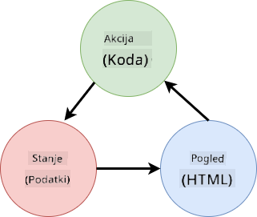

<!--
CO_OP_TRANSLATOR_METADATA:
{
  "original_hash": "4fa20c513e367e9cdd401bf49ae16e33",
  "translation_date": "2025-08-27T22:08:37+00:00",
  "source_file": "7-bank-project/4-state-management/README.md",
  "language_code": "sl"
}
-->
# Ustvarjanje bančne aplikacije, 4. del: Koncepti upravljanja stanja

## Predhodni kviz

[Predhodni kviz](https://ashy-river-0debb7803.1.azurestaticapps.net/quiz/47)

### Uvod

Ko spletna aplikacija raste, postane težko slediti vsem podatkovnim tokovom. Katera koda pridobi podatke, katera stran jih uporablja, kje in kdaj jih je treba posodobiti... hitro lahko nastane zmedena koda, ki jo je težko vzdrževati. To še posebej velja, ko morate deliti podatke med različnimi stranmi aplikacije, na primer uporabniške podatke. Koncept *upravljanja stanja* je vedno obstajal v vseh vrstah programov, vendar je zaradi naraščajoče kompleksnosti spletnih aplikacij postal ključen vidik razvoja.

V tem zadnjem delu bomo pregledali aplikacijo, ki smo jo zgradili, da ponovno premislimo, kako je stanje upravljano, kar bo omogočilo podporo osvežitvi brskalnika kadarkoli in ohranjanje podatkov med uporabniškimi sejami.

### Predpogoji

Za to lekcijo morate dokončati del aplikacije, ki se ukvarja z [pridobivanjem podatkov](../3-data/README.md). Prav tako morate namestiti [Node.js](https://nodejs.org) in [zagnati strežniški API](../api/README.md) lokalno, da lahko upravljate podatke o računih.

Preverite, ali strežnik deluje pravilno, tako da v terminalu izvedete naslednji ukaz:

```sh
curl http://localhost:5000/api
# -> should return "Bank API v1.0.0" as a result
```

---

## Ponovno premislimo upravljanje stanja

V [prejšnji lekciji](../3-data/README.md) smo v aplikaciji uvedli osnovni koncept stanja z globalno spremenljivko `account`, ki vsebuje bančne podatke trenutno prijavljenega uporabnika. Vendar ima naša trenutna implementacija nekaj pomanjkljivosti. Poskusite osvežiti stran, ko ste na nadzorni plošči. Kaj se zgodi?

Trenutna koda ima 3 težave:

- Stanje ni ohranjeno, saj vas osvežitev brskalnika vrne na stran za prijavo.
- Obstaja več funkcij, ki spreminjajo stanje. Ko aplikacija raste, to oteži sledenje spremembam in zlahka pozabimo posodobiti eno od njih.
- Stanje ni očiščeno, zato so podatki o računu še vedno prisotni, ko kliknete *Odjava*, čeprav ste na strani za prijavo.

Kodo bi lahko posodobili, da bi te težave rešili eno za drugo, vendar bi to povzročilo podvajanje kode in naredilo aplikacijo bolj zapleteno ter težje vzdrževano. Ali pa si lahko vzamemo nekaj minut in premislimo našo strategijo.

> Katere težave pravzaprav poskušamo rešiti?

[Upravljanje stanja](https://en.wikipedia.org/wiki/State_management) se osredotoča na iskanje dobrega pristopa za reševanje teh dveh specifičnih težav:

- Kako ohraniti podatkovne tokove v aplikaciji razumljive?
- Kako zagotoviti, da so podatki o stanju vedno usklajeni z uporabniškim vmesnikom (in obratno)?

Ko te težave rešite, so lahko vse druge težave, s katerimi se soočate, že odpravljene ali pa jih je lažje rešiti. Obstaja veliko možnih pristopov za reševanje teh težav, vendar bomo uporabili pogosto rešitev, ki vključuje **centralizacijo podatkov in načinov za njihovo spreminjanje**. Podatkovni tokovi bodo potekali takole:



> Tukaj ne bomo obravnavali dela, kjer podatki samodejno sprožijo posodobitev pogleda, saj je to povezano z naprednejšimi koncepti [reaktivnega programiranja](https://en.wikipedia.org/wiki/Reactive_programming). To je dobra tema za nadaljnje raziskovanje, če želite poglobljen vpogled.

✅ Obstaja veliko knjižnic z različnimi pristopi k upravljanju stanja, [Redux](https://redux.js.org) pa je priljubljena izbira. Oglejte si koncepte in vzorce, ki jih uporablja, saj je to pogosto dober način za razumevanje morebitnih težav, s katerimi se lahko soočate v velikih spletnih aplikacijah, in kako jih je mogoče rešiti.

### Naloga

Začeli bomo z nekaj preureditvami. Zamenjajte deklaracijo `account`:

```js
let account = null;
```

Z:

```js
let state = {
  account: null
};
```

Ideja je, da *centraliziramo* vse podatke naše aplikacije v enem samem objektu stanja. Trenutno imamo v stanju samo `account`, zato se veliko ne spremeni, vendar to odpira pot za prihodnje izboljšave.

Prav tako moramo posodobiti funkcije, ki ga uporabljajo. V funkcijah `register()` in `login()` zamenjajte `account = ...` z `state.account = ...`;

Na vrh funkcije `updateDashboard()` dodajte to vrstico:

```js
const account = state.account;
```

Ta preureditev sama po sebi ne prinaša veliko izboljšav, vendar je ideja, da postavimo temelje za naslednje spremembe.

## Sledenje spremembam podatkov

Zdaj, ko smo vzpostavili objekt `state` za shranjevanje naših podatkov, je naslednji korak centralizacija posodobitev. Cilj je olajšati sledenje vsem spremembam in kdaj se zgodijo.

Da bi se izognili neželenim spremembam objekta `state`, je dobra praksa, da ga obravnavamo kot [*nespremenljivega*](https://en.wikipedia.org/wiki/Immutable_object), kar pomeni, da ga ni mogoče spreminjati. To pomeni, da morate ustvariti nov objekt stanja, če želite karkoli spremeniti. S tem se zaščitite pred morebitnimi neželenimi [stranskimi učinki](https://en.wikipedia.org/wiki/Side_effect_(computer_science)) in odprete možnosti za nove funkcije v aplikaciji, kot je implementacija razveljavitve/ponovitve, hkrati pa olajšate odpravljanje napak. Na primer, lahko beležite vsako spremembo stanja in hranite zgodovino sprememb, da razumete izvor napake.

V JavaScriptu lahko uporabite [`Object.freeze()`](https://developer.mozilla.org/docs/Web/JavaScript/Reference/Global_Objects/Object/freeze) za ustvarjanje nespremenljive različice objekta. Če poskusite spremeniti nespremenljiv objekt, bo sprožena izjema.

✅ Ali poznate razliko med *plitkim* in *globokim* nespremenljivim objektom? Več o tem lahko preberete [tukaj](https://developer.mozilla.org/docs/Web/JavaScript/Reference/Global_Objects/Object/freeze#What_is_shallow_freeze).

### Naloga

Ustvarimo novo funkcijo `updateState()`:

```js
function updateState(property, newData) {
  state = Object.freeze({
    ...state,
    [property]: newData
  });
}
```

V tej funkciji ustvarimo nov objekt stanja in kopiramo podatke iz prejšnjega stanja z uporabo [*operatorja razširitve (`...`)*](https://developer.mozilla.org/docs/Web/JavaScript/Reference/Operators/Spread_syntax#Spread_in_object_literals). Nato z uporabo [notacije z oglatimi oklepaji](https://developer.mozilla.org/docs/Web/JavaScript/Guide/Working_with_Objects#Objects_and_properties) `[property]` prepišemo določeno lastnost objekta stanja z novimi podatki. Na koncu zaklenemo objekt, da preprečimo spremembe, z `Object.freeze()`. Trenutno imamo v stanju shranjeno samo lastnost `account`, vendar lahko s tem pristopom dodate toliko lastnosti, kot jih potrebujete.

Prav tako bomo posodobili inicializacijo `state`, da zagotovimo, da je začetno stanje prav tako zamrznjeno:

```js
let state = Object.freeze({
  account: null
});
```

Nato posodobite funkcijo `register` tako, da zamenjate `state.account = result;` z:

```js
updateState('account', result);
```

Enako storite s funkcijo `login`, tako da zamenjate `state.account = data;` z:

```js
updateState('account', data);
```

Zdaj bomo izkoristili priložnost za odpravo težave, da podatki o računu niso očiščeni, ko uporabnik klikne *Odjava*.

Ustvarite novo funkcijo `logout()`:

```js
function logout() {
  updateState('account', null);
  navigate('/login');
}
```

V `updateDashboard()` zamenjajte preusmeritev `return navigate('/login');` z `return logout();`;

Poskusite registrirati nov račun, se odjaviti in ponovno prijaviti, da preverite, ali vse še vedno deluje pravilno.

> Nasvet: vse spremembe stanja si lahko ogledate tako, da na dno funkcije `updateState()` dodate `console.log(state)` in odprete konzolo v orodjih za razvijalce vašega brskalnika.

## Ohranjanje stanja

Večina spletnih aplikacij mora ohranjati podatke, da lahko pravilno delujejo. Vsi ključni podatki so običajno shranjeni v bazi podatkov in dostopni prek strežniškega API-ja, kot so podatki o uporabniškem računu v našem primeru. Vendar je včasih zanimivo ohraniti nekatere podatke v odjemalski aplikaciji, ki se izvaja v vašem brskalniku, za boljšo uporabniško izkušnjo ali za izboljšanje zmogljivosti nalaganja.

Ko želite ohraniti podatke v brskalniku, si morate zastaviti nekaj pomembnih vprašanj:

- *Ali so podatki občutljivi?* Izogibajte se shranjevanju občutljivih podatkov na odjemalcu, kot so gesla uporabnikov.
- *Kako dolgo potrebujete te podatke?* Ali nameravate dostopati do teh podatkov samo med trenutno sejo ali jih želite shraniti za vedno?

Obstaja več načinov za shranjevanje informacij v spletni aplikaciji, odvisno od tega, kaj želite doseči. Na primer, lahko uporabite URL-je za shranjevanje iskalnih poizvedb in jih naredite deljive med uporabniki. Uporabite lahko tudi [HTTP piškotke](https://developer.mozilla.org/docs/Web/HTTP/Cookies), če je treba podatke deliti s strežnikom, na primer informacije o [avtentikaciji](https://en.wikipedia.org/wiki/Authentication).

Druga možnost je uporaba ene od številnih API-jev brskalnika za shranjevanje podatkov. Dva sta še posebej zanimiva:

- [`localStorage`](https://developer.mozilla.org/docs/Web/API/Window/localStorage): [Shramba ključ/vrednost](https://en.wikipedia.org/wiki/Key%E2%80%93value_database), ki omogoča ohranjanje podatkov, specifičnih za trenutno spletno mesto, med različnimi sejami. Podatki, shranjeni v njej, nikoli ne potečejo.
- [`sessionStorage`](https://developer.mozilla.org/docs/Web/API/Window/sessionStorage): deluje enako kot `localStorage`, razen da se podatki, shranjeni v njej, izbrišejo, ko se seja konča (ko zaprete brskalnik).

Upoštevajte, da oba API-ja omogočata shranjevanje samo [nizov](https://developer.mozilla.org/docs/Web/JavaScript/Reference/Global_Objects/String). Če želite shraniti kompleksne objekte, jih boste morali serializirati v format [JSON](https://developer.mozilla.org/docs/Web/JavaScript/Reference/Global_Objects/JSON) z uporabo [`JSON.stringify()`](https://developer.mozilla.org/docs/Web/JavaScript/Reference/Global_Objects/JSON/stringify).

✅ Če želite ustvariti spletno aplikacijo, ki ne deluje s strežnikom, je mogoče ustvariti bazo podatkov na odjemalcu z uporabo API-ja [`IndexedDB`](https://developer.mozilla.org/docs/Web/API/IndexedDB_API). Ta je rezerviran za napredne primere uporabe ali če morate shraniti večjo količino podatkov, saj je bolj zapleten za uporabo.

### Naloga

Želimo, da uporabniki ostanejo prijavljeni, dokler izrecno ne kliknejo gumba *Odjava*, zato bomo uporabili `localStorage` za shranjevanje podatkov o računu. Najprej definirajmo ključ, ki ga bomo uporabili za shranjevanje naših podatkov.

```js
const storageKey = 'savedAccount';
```

Nato dodajte to vrstico na konec funkcije `updateState()`:

```js
localStorage.setItem(storageKey, JSON.stringify(state.account));
```

S tem bodo podatki o uporabniškem računu ohranjeni in vedno posodobljeni, saj smo prej centralizirali vse posodobitve stanja. Tukaj začnemo izkoriščati vse prejšnje preureditve 🙂.

Ker so podatki shranjeni, moramo poskrbeti tudi za njihovo obnovitev, ko se aplikacija naloži. Ker bomo začeli imeti več inicializacijske kode, je morda dobra ideja, da ustvarimo novo funkcijo `init`, ki vključuje tudi našo prejšnjo kodo na dnu `app.js`:

```js
function init() {
  const savedAccount = localStorage.getItem(storageKey);
  if (savedAccount) {
    updateState('account', JSON.parse(savedAccount));
  }

  // Our previous initialization code
  window.onpopstate = () => updateRoute();
  updateRoute();
}

init();
```

Tukaj pridobimo shranjene podatke in, če obstajajo, ustrezno posodobimo stanje. Pomembno je, da to storimo *pred* posodobitvijo poti, saj lahko obstaja koda, ki se zanaša na stanje med posodobitvijo strani.

Privzeto stran naše aplikacije lahko naredimo tudi *Nadzorno ploščo*, saj zdaj ohranjamo podatke o računu. Če podatki niso najdeni, nadzorna plošča vseeno poskrbi za preusmeritev na stran *Prijava*. V `updateRoute()` zamenjajte privzeto `return navigate('/login');` z `return navigate('/dashboard');`.

Zdaj se prijavite v aplikacijo in poskusite osvežiti stran. Ostati bi morali na nadzorni plošči. S to posodobitvijo smo rešili vse začetne težave...

## Osvežitev podatkov

...Vendar smo morda ustvarili novo težavo. Ups!

Pojdite na nadzorno ploščo z računom `test`, nato v terminalu izvedite ta ukaz za ustvarjanje nove transakcije:

```sh
curl --request POST \
     --header "Content-Type: application/json" \
     --data "{ \"date\": \"2020-07-24\", \"object\": \"Bought book\", \"amount\": -20 }" \
     http://localhost:5000/api/accounts/test/transactions
```

Zdaj poskusite osvežiti stran nadzorne plošče v brskalniku. Kaj se zgodi? Ali vidite novo transakcijo?

Stanje je ohranjeno za nedoločen čas zahvaljujoč `localStorage`, vendar to tudi pomeni, da se nikoli ne posodobi, dokler se ne odjavite iz aplikacije in ponovno prijavite!

Ena od možnih strategij za rešitev tega problema je, da vsakič, ko se naloži nadzorna plošča, ponovno naložimo podatke o računu, da se izognemo zastarelim podatkom.

### Naloga

Ustvarite novo funkcijo `updateAccountData`:

```js
async function updateAccountData() {
  const account = state.account;
  if (!account) {
    return logout();
  }

  const data = await getAccount(account.user);
  if (data.error) {
    return logout();
  }

  updateState('account', data);
}
```

Ta metoda preveri, ali smo trenutno prijavljeni, nato pa ponovno naloži podatke o računu s strežnika.

Ustvarite še eno funkcijo z imenom `refresh`:

```js
async function refresh() {
  await updateAccountData();
  updateDashboard();
}
```

Ta funkcija posodobi podatke o računu, nato pa poskrbi za posodobitev HTML-ja na strani nadzorne plošče. To je funkcija, ki jo moramo poklicati, ko se naloži pot nadzorne plošče. Posodobite definicijo poti z:

```js
const routes = {
  '/login': { templateId: 'login' },
  '/dashboard': { templateId: 'dashboard', init: refresh }
};
```

Zdaj poskusite osvežiti nadzorno ploščo, prikazati bi se morali posodobljeni podatki o računu.

---

## 🚀 Izziv

Zdaj, ko vsakič, ko se naloži nadzorna plošča, ponovno naložimo podatke o računu, menite, da je še vedno potrebno ohranjati *vse podatke o računu*?

Poskusite skupaj spremeniti, kaj se shrani in naloži iz `localStorage`, tako da vključuje samo tisto, kar je absolutno potrebno za delovanje aplikacije.

## Kviz po predavanju
[Post-predavanje kviz](https://ashy-river-0debb7803.1.azurestaticapps.net/quiz/48)

## Naloga

[Izvedite dialog "Dodaj transakcijo"](assignment.md)

Tukaj je primer rezultata po zaključeni nalogi:


---

**Omejitev odgovornosti**:  
Ta dokument je bil preveden z uporabo storitve za prevajanje z umetno inteligenco [Co-op Translator](https://github.com/Azure/co-op-translator). Čeprav si prizadevamo za natančnost, vas prosimo, da upoštevate, da lahko avtomatizirani prevodi vsebujejo napake ali netočnosti. Izvirni dokument v njegovem izvirnem jeziku je treba obravnavati kot avtoritativni vir. Za ključne informacije priporočamo profesionalni človeški prevod. Ne prevzemamo odgovornosti za morebitna nesporazumevanja ali napačne razlage, ki bi nastale zaradi uporabe tega prevoda.