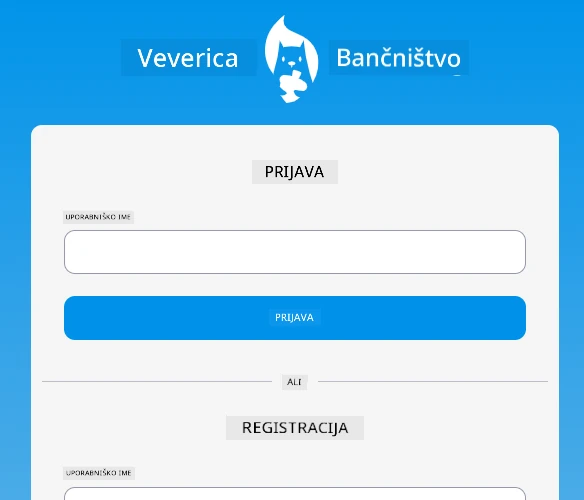
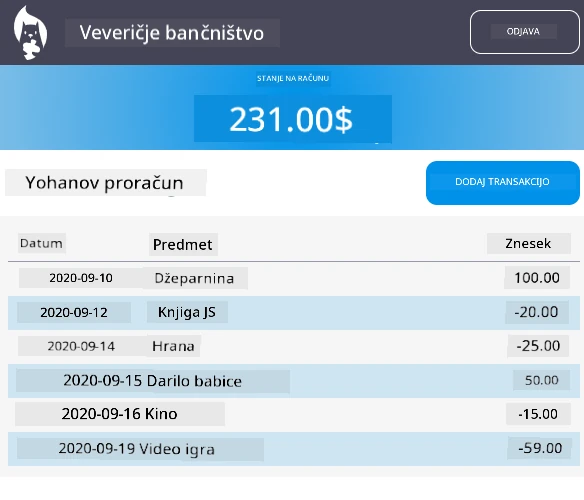

# :dollar: Zgradi banko

V tem projektu se boste naučili, kako zgraditi izmišljeno banko. Te lekcije vključujejo navodila za postavitev spletne aplikacije in zagotavljanje poti, izdelavo obrazcev, upravljanje stanja ter pridobivanje podatkov iz API-ja, iz katerega lahko pridobite podatke banke.

|  |  |
|--------------------------------|--------------------------------|

## Lekcije

1. [HTML predloge in poti v spletni aplikaciji](1-template-route/README.md)
2. [Izdelava obrazca za prijavo in registracijo](2-forms/README.md)
3. [Metode pridobivanja in uporabe podatkov](3-data/README.md)
4. [Koncepti upravljanja stanja](4-state-management/README.md)

### Zasluge

Te lekcije so bile napisane z :hearts: avtorja [Yohan Lasorsa](https://twitter.com/sinedied).

Če vas zanima, kako zgraditi [strežniški API](/7-bank-project/api/README.md), ki se uporablja v teh lekcijah, lahko sledite [temu nizu videoposnetkov](https://aka.ms/NodeBeginner) (zlasti videoposnetki od 17 do 21).

Prav tako si lahko ogledate [ta interaktivni učni vodič](https://aka.ms/learn/express-api).

---

**Omejitev odgovornosti**:  
Ta dokument je bil preveden z uporabo storitve za prevajanje z umetno inteligenco [Co-op Translator](https://github.com/Azure/co-op-translator). Čeprav si prizadevamo za natančnost, vas prosimo, da upoštevate, da lahko avtomatizirani prevodi vsebujejo napake ali netočnosti. Izvirni dokument v njegovem maternem jeziku je treba obravnavati kot avtoritativni vir. Za ključne informacije priporočamo profesionalni prevod s strani človeka. Ne prevzemamo odgovornosti za morebitne nesporazume ali napačne razlage, ki bi nastale zaradi uporabe tega prevoda.