<!--
CO_OP_TRANSLATOR_METADATA:
{
  "original_hash": "a9a3bcc037a447e2d8994d99e871cd9f",
  "translation_date": "2026-01-07T10:00:00+00:00",
  "source_file": "8-code-editor/1-using-a-code-editor/README.md",
  "language_code": "sl"
}
-->
# Uporaba urejevalnika kode: obvladovanje VSCode.dev

Se spomnite v *Matriki*, ko se je Neo moral vklopiti v ogromno računalniško terminalno napravo, da je dostopal do digitalnega sveta? Današnja orodja za spletni razvoj so popolna nasprotje – izjemno zmogljive možnosti, dostopne od kjerkoli. VSCode.dev je brskalniški urejevalnik kode, ki prinaša profesionalna razvojna orodja na katerokoli napravo z internetno povezavo.

Tako kot je tiskarski stroj omogočil dostop do knjig vsem, ne le menihom v samostanih, VSCode.dev demokratizira programiranje. Lahko delate na projektih z računalnika v knjižnici, šolske učilnice ali kjerkoli, kjer imate dostop do brskalnika. Brez nameščanja, brez omejitev »potrebujem svojo specifično nastavitev«.

Na koncu te lekcije boste razumeli, kako se orientirati po VSCode.dev, odpreti GitHub skladišča neposredno v brskalniku in uporabljati Git za upravljanje različic – vse veščine, na katere se profesionalni razvijalci zanesejo vsak dan.

## ⚡ Kaj lahko naredite v naslednjih 5 minutah

**Hiter začetek za zaposlene razvijalce**


- **1. minuta**: Obiščite [vscode.dev](https://vscode.dev) – brez potrebe po namestitvi
- **2. minuta**: Prijavite se z GitHubom in povežite svoje skladišče
- **3. minuta**: Poskusite trik z URL: spremenite `github.com` v `vscode.dev/github` v kateremkoli URL skladišča
- **4. minuta**: Ustvarite novo datoteko in opazujte samodejno barvno označevanje sintakse
- **5. minuta**: Naredite spremembo in jo potrdite prek nadzorne plošče Source Control

**Hiter testni URL**:  
```
# Transform this:
github.com/microsoft/Web-Dev-For-Beginners

# Into this:
vscode.dev/github/microsoft/Web-Dev-For-Beginners
```
  
**Zakaj je to pomembno**: V 5 minutah boste izkusili svobodo kodiranja kjerkoli z profesionalnimi orodji. To predstavlja prihodnost razvoja – dostopno, zmogljivo in takojšnje.

## 🗺️ Vaša učna pot skozi razvoj v oblaku

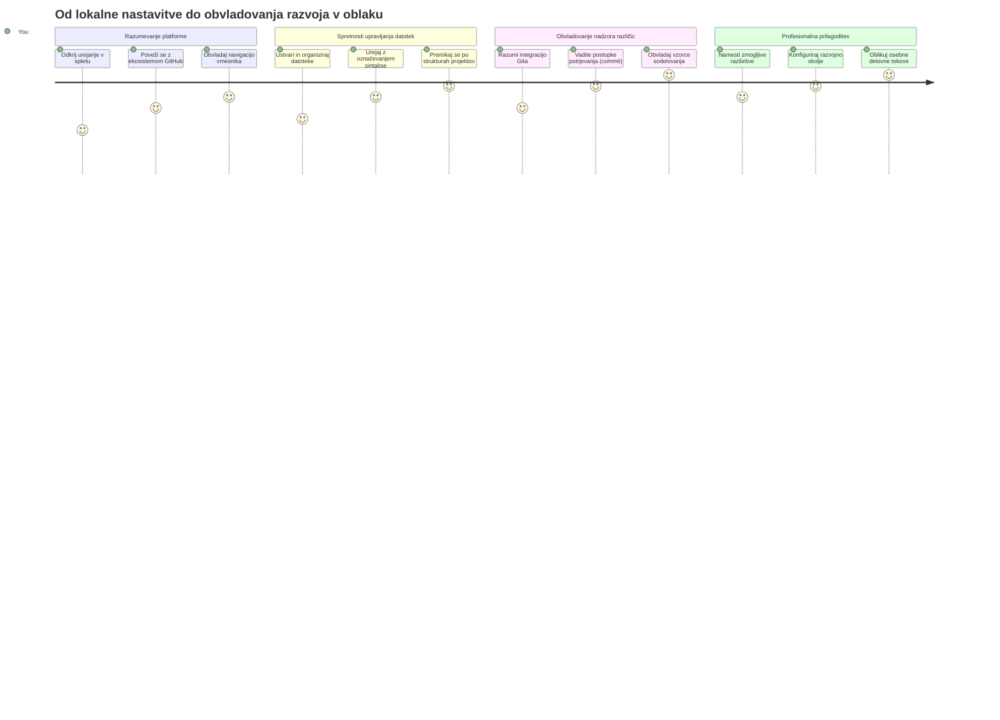
**Vaš cilj**: Do konca te lekcije boste obvladali profesionalno razvojno okolje v oblaku, ki deluje iz katere koli naprave in vam omogoča programiranje z istimi orodji, kot jih uporabljajo razvijalci v velikih tehnoloških podjetjih.

## Kaj se boste naučili

Po skupnem prehodu boste znali:

- Navigirati po VSCode.dev kot po svojem drugem domu – najti vse, kar potrebujete, brez izgubljanja
- Odpreti katerokoli GitHub skladišče v brskalniku in začeti urejati takoj (to je skoraj magično!)
- Uporabljati Git za sledenje spremembam in shranjevanje napredka kot profesionalec
- Pohitriti delo urejevalnika z razširitvami, ki naredijo programiranje hitrejše in zabavnejše
- Ustvarjati in organizirati projektne datoteke samozavestno

## Kaj boste potrebovali

Pogoji so preprosti:

- Brezplačen [GitHub račun](https://github.com) (če ga še nimate, vas bomo vodili skozi nastavljanje)
- Osnovno znanje uporabe spletnih brskalnikov
- Lekcija GitHub Basics nudi koristno ozadje, čeprav ni obvezna

> 💡 **Nov na GitHubu?** Ustvarjanje računa je brezplačno in traja nekaj minut. Tako kot knjižnični izkaz daje dostop do knjig po vsem svetu, vam GitHub račun odpre vrata do skladišč kode po spletu.

## 🧠 Pregled ekosistema razvoja v oblaku

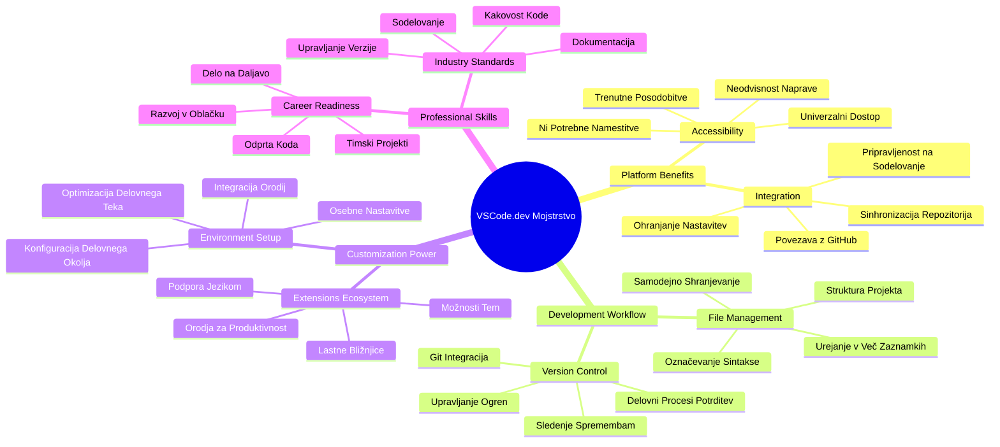
**Temeljno načelo**: Razvojna okolja na oblaku predstavljajo prihodnost kodiranja – nudijo profesionalna orodja, ki so dostopna, sodelovalna in neodvisna od platforme.

## Zakaj so spletni urejevalniki kode pomembni

Pred internetom niso znanstveniki na različnih univerzah lahko enostavno delili raziskave. Potem je prišel ARPANET v šestdesetih, ki je povezal računalnike na razdalje. Spletni urejevalniki kode sledijo istemu načelu – omogočajo dostop do zmogljivih orodij ne glede na vašo lokacijo ali napravo.

Urejevalnik kode je vaše razvojno delovno okolje, kjer pišete, urejate in organizirate datoteke kode. Za razliko od preprostih urejevalnikov besedil, profesionalni urejevalniki nudijo barvno označevanje sintakse, zaznavanje napak in upravljanje projektov.

VSCode.dev prinaša te možnosti v vaš brskalnik:

**Prednosti urejanja v spletu:**

| Značilnost | Opis | Praktična korist |
|------------|------|-----------------|
| **Neodvisnost platforme** | Deluje na vsaki napravi z brskalnikom | Nemoteno delo na različnih računalnikih |
| **Brez potrebe po namestitvi** | Dostop prek spletnega URL | Brez omejitev pri nameščanju programske opreme |
| **Samodejne posodobitve** | Vedno teče najnovejša različica | Dostop do novih funkcij brez ročnih posodobitev |
| **Integracija s skladišči** | Neposredna povezava do GitHub | Urejanje kode brez lokalnega upravljanja datotek |

**Praktične posledice:**  
- Nadaljevanje dela med različnimi okolji  
- Dosleden vmesnik ne glede na operacijski sistem  
- Neposredna možnost sodelovanja  
- Manjša potreba po lokalnem pomnilniku

## Raziščimo VSCode.dev

Tako kot je laboratorij Marie Curie vseboval sofisticirano opremo v sorazumno enostavnem prostoru, VSCode.dev združuje profesionalna razvojna orodja v brskalniški vmesnik. Ta spletna aplikacija ponuja enako osnovno funkcionalnost kot namizni urejevalniki kode.

Začnite tako, da v brskalniku obiščete [vscode.dev](https://vscode.dev). Vmesnik se naloži brez prenosov ali namestitev sistema – neposredna uporaba načel računalništva v oblaku.

### Povezava vašega GitHub računa

Tako kot je telefon Alexandra Grahama Bella povezoval oddaljene lokacije, se s povezavo vašega GitHub računa vzpostavi most med VSCode.dev in vašimi skladišči kode. Ko boste pozvani, da se prijavite z GitHubom, je priporočljivo sprejeti to povezavo.

**Integracija z GitHub nudi:**  
- Neposreden dostop do vaših skladišč znotraj urejevalnika  
- Sinhronizirane nastavitve in razširitve med napravami  
- Poenostavljeno shranjevanje na GitHub  
- Personalizirano razvojno okolje

### Spoznajte svoje novo delovno okolje

Ko se vse naloži, boste videli lepo urejeno delovno okolje, zasnovano tako, da vas osredotoči na tisto, kar šteje – vašo kodo!

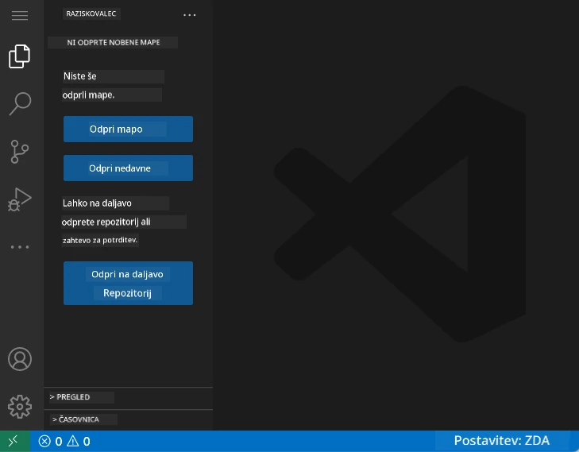

**Tukaj je vaš ogled po bližnji okolici:**  
- **Vrstica aktivnosti** (ta trak na levi): vaša glavna navigacija z Explorerjem 📁, Iskanjem 🔍, Source Control 🌿, Razširitvami 🧩 in Nastavitvami ⚙️  
- **Stranski pas** (panel zraven): se spreminja in prikazuje relevantne informacije glede na vaš izbor  
- **Urejevalnik** (veliki prostor na sredini): tu se dogaja čarovnija – vaše glavno območje za kodiranje

**Vzemite si trenutek za raziskovanje:**  
- Kliknite na ikone v vrstici aktivnosti in si oglejte, kaj katera počne  
- Opazite, kako se stranski pas prilagaja in prikazuje različno vsebino – luštno, kajne?  
- Pogled Explorer (📁) je verjetno mesto, kjer boste preživeli največ časa, zato se z njim udobno spoznajte

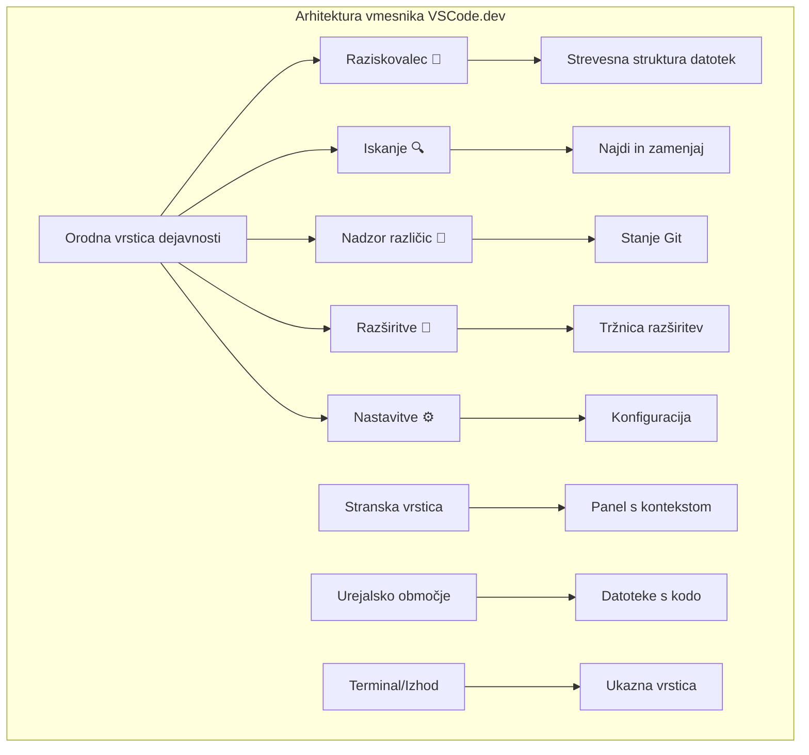
## Odpiranje GitHub skladišč

Pred internetom so raziskovalci morali fizično potovati v knjižnice, da so dostopali do dokumentov. GitHub skladišča delujejo podobno – zbirke kode, shranjene na daljavo. VSCode.dev odpravi tradicionalni korak prenosa skladišč na lokalni računalnik, preden jih uredite.

Ta možnost omogoča takojšen dostop do kateregakoli javnega skladišča za ogled, urejanje ali prispevanje. Tukaj sta dva načina za odpiranje skladišč:

### Metoda 1: Način s klikom

Popolno, kadar začnete v VSCode.dev in želite odpreti določeno skladišče. Je preprosta in prijazna do začetnikov:

**Kako to storite:**

1. Obiščite [vscode.dev](https://vscode.dev), če še niste tam  
2. Poiščite gumb »Open Remote Repository« na uvodnem zaslonu in kliknite nanj

   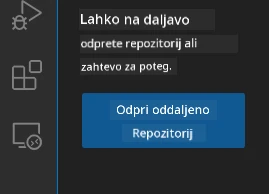

3. Prilepite katerikoli URL GitHub skladišča (poskusite tega: `https://github.com/microsoft/Web-Dev-For-Beginners`)  
4. Pritisnite Enter in opazujte čarovnijo!

**Nasvet - bližnjica do ukazne palete:**

Želite se počutiti kot čarovnik kodiranja? Poskusite to bližnjico na tipkovnici: Ctrl+Shift+P (ali Cmd+Shift+P na Macu), da odprete Ukazno paleto:

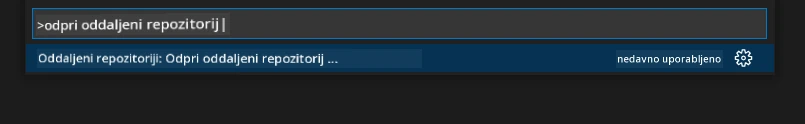

**Ukazna paleta je kot iskalnik za vse, kar zmorete:**  
- Vtipkajte »open remote« in našel vam bo odpiranje skladišč  
- Zapomni si skladišča, ki ste jih pred kratkim odprli (zelo priročno!)  
- Ko se navadite nanjo, se boste počutili, kot da programirate s hitrostjo strele  
- Je kot »Hej Siri«, ampak za kodiranje v VSCode.dev

### Metoda 2: Tehnika spreminjanja URL-ja

Tako kot HTTP in HTTPS uporabljata različne protokole, a enako strukturo domene, VSCode.dev uporablja vzorec URL-jev, ki odraža sistem naslovljanja GitHuba. Vsak URL skladišča GitHub lahko spremenite, da se odpre neposredno v VSCode.dev.

**Vzorec preoblikovanja URL-ja:**

| Vrsta skladišča | GitHub URL | VSCode.dev URL |
|-----------------|------------|----------------|
| **Javno skladišče** | `github.com/microsoft/Web-Dev-For-Beginners` | `vscode.dev/github/microsoft/Web-Dev-For-Beginners` |
| **Osebni projekt** | `github.com/your-username/my-project` | `vscode.dev/github/your-username/my-project` |
| **Katero koli dostopno skladišče** | `github.com/their-username/awesome-repo` | `vscode.dev/github/their-username/awesome-repo` |

**Izvedba:**  
- Zamenjajte `github.com` z `vscode.dev/github`  
- Vse druge dele URL-ja pustite nespremenjene  
- Deluje za katerokoli javno dostopno skladišče  
- Omogoča takojšen dostop do urejanja

> 💡 **Nasvet, ki vam bo spremenil življenje**: Shrani si priljubljena skladišča v zavihke s spletnega naslova VSCode.dev. Jaz imam zaznamke, kot so »Uredi moj portfelj« in »Popravi dokumentacijo«, ki me pripeljejo neposredno v način urejanja!

**Katero metodo izbrati?**  
- **Preko vmesnika**: Super, če raziskujete ali se ne spomnite točnih imen skladišč  
- **Trik z URL-jem**: Odličen za ultra hitri dostop, ko točno veste, kam želite

### 🎯 Pedagoški trenutek: Dostop do razvoja v oblaku

**Ustavi se in premisli**: Pravkar ste se naučili dva načina dostopa do skladišč kode prek spletnega brskalnika. To predstavlja temeljno spremembo načina dela pri razvoju.

**Hitri samopregled:**  
- Ali znate pojasniti, zakaj spletno urejanje odpravlja tradicionalno »namestitev razvojnega okolja«?  
- Katere prednosti ima tehnika spreminjanja URL-jev v primerjavi z lokalnim kloniranjem preko Gita?  
- Kako ta pristop spreminja način, kako lahko prispevate v odprtokodne projekte?

**Povezava z resničnim svetom**: Velika podjetja, kot so GitHub, GitLab in Replit, so zgradila svoje razvojne platforme okoli teh načel, ki dajejo prednost oblaku. Naučite se iste poteke dela kot profesionalne razvojne ekipe po vsem svetu.

**Izzivajoče vprašanje**: Kako bi razvoj v oblaku lahko spremenil način poučevanja kodiranja v šolah? Razmislite o zahtevah za naprave, upravljanju programske opreme in možnostih sodelovanja.

## Delo z datotekami in projekti

Zdaj, ko imate odprto skladišče, začnimo z gradnjo! VSCode.dev vam ponuja vse, kar potrebujete za ustvarjanje, urejanje in organizacijo datotek kode. Pomislite na to kot na svojo digitalno delavnico – vsak pripomoček je tam, kjer ga potrebujete.

Pojdimo skozi vsakodnevne naloge, ki bodo sestavljale večino vašega kodnega poteka.

### Ustvarjanje novih datotek

Tako kot arhitekt ureja načrte v pisarni, ustvarjanje datotek v VSCode.dev sledi strukturiranemu postopku. Sistem podpira vse standardne vrste datotek za spletni razvoj.

**Postopek ustvarjanja datoteke:**

1. Pojdite v ciljno mapo v Explorerju na stranskem pasu  
2. Postavite kazalec nad ime mape, da se prikaže ikona »Nova datoteka« (📄+)  
3. Vnesite ime datoteke skupaj z ustrezno pripono (`style.css`, `script.js`, `index.html`)  
4. Pritisnite Enter za ustvarjanje datoteke

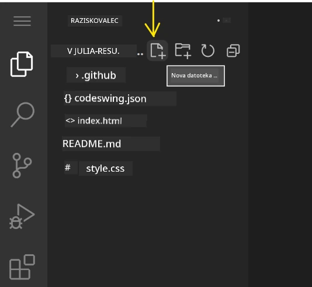

**Pravila poimenovanja:**  
- Uporabljajte opisna imena, ki povedo namen datoteke  
- Vključite pripone za pravilno označevanje sintakse  
- Upoštevajte dosledna pravila poimenovanja skozi projekt  
- Uporabljajte male črke in vezaje namesto presledkov

### Urejanje in shranjevanje datotek

Tu se začne prava zabava! Urejevalnik VSCode.dev je poln koristnih funkcij, ki programiranje naredijo tekoče in intuitivno. Kot da imate pametnega pomočnika za pisanje, a za kodo.

**Vaš postopek urejanja:**  

1. Kliknite katerokoli datoteko v Explorerju, da se odpre v glavnem območju  
2. Začnite tipkati in opazujte, kako vam VSCode.dev pomaga z barvami, predlogi in zaznavanjem napak  
3. Shranite delo s Ctrl+S (Windows/Linux) ali Cmd+S (Mac) – pa vendar se tudi samodejno shranjuje!

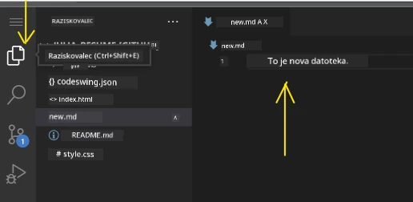

**Kul stvari, ki se dogajajo med kodiranjem:**  
- Vaša koda je lepo barvno označena, kar olajša branje  
- VSCode.dev predlaga dokončanje besedila med tipkanjem (kot samokorekcija, a bolj pametna)  
- Ujame tipkarske napake in napake pred shranjevanjem  
- Lahko imate več datotek odprtih v zavihkih, kot v brskalniku  
- Vse se shranjuje samodejno v ozadju

> ⚠️ **Hiter namig:** Čeprav je samodejno shranjevanje super, je dober običaj, da pritisnete Ctrl+S ali Cmd+S. Tako takoj shranite vse in sprožite dodatne uporabne funkcije, kot je preverjanje napak.

### Upravljanje različic z Gitom

Tako kot arheologi ustvarjajo podrobne zapise plasti izkopavanj, Git spremlja spremembe v vaši kodi skozi čas. Ta sistem ohranja zgodovino projekta in omogoča vračanje na prejšnje verzije, kadar je to potrebno. VSCode.dev vključuje integrirano podporo za Git.

**Vmesnik Source Control:**  

1. Dostopajte do panela Source Control prek ikone 🌿 v vrstici aktivnosti  
2. Spremenjene datoteke so prikazane v razdelku »Changes«  
3. Barvno označevanje kaže vrste sprememb: zeleno za dodatke, rdeče za odstranitve

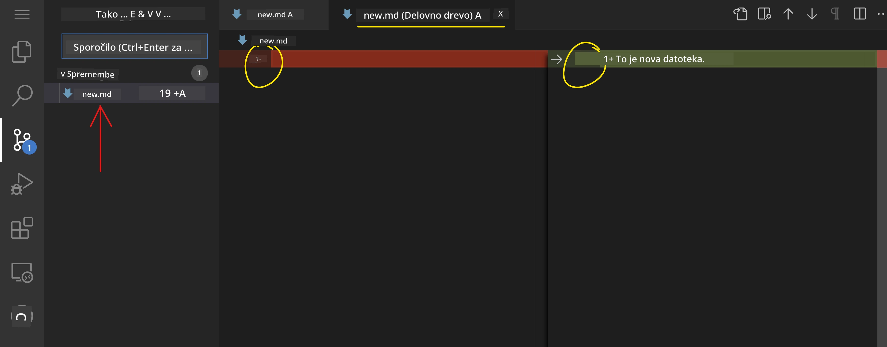

**Shranjevanje dela (postopek commitiranja):**

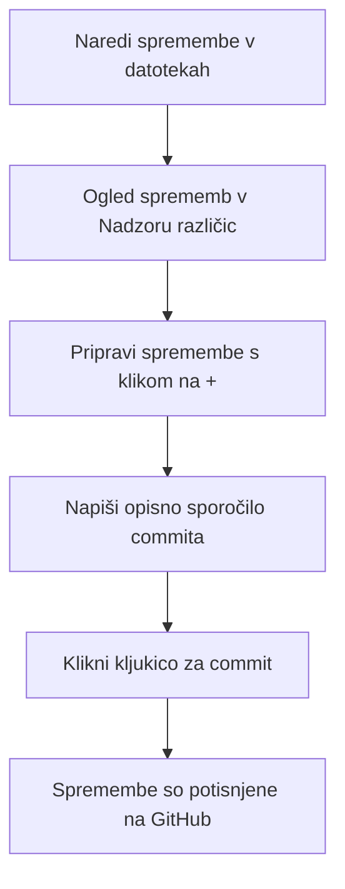
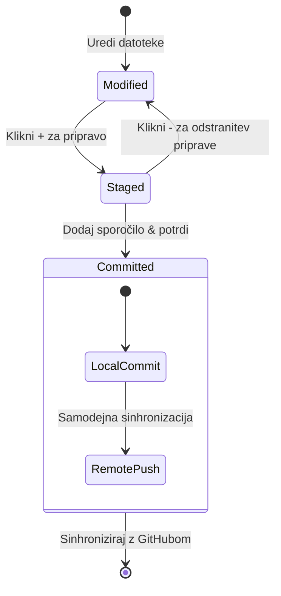
**Tukaj je vaš korak-po-korak postopek:**  
- Kliknite ikono »+« zraven datotek, ki jih želite shraniti (to jih vključuje v »staging«)
- Dvoklik preverite, ali ste zadovoljni z vsemi pripravljenimi spremembami
- Napišite kratek zapis, ki pojasnjuje, kaj ste naredili (to je vaše "sporočilo commita")
- Kliknite gumb s kljukico, da vse shranite na GitHub
- Če spremenite mnenje glede nečesa, vam ikona za razveljavitev omogoča zavrnitev sprememb

**Pisanje dobrih sporočil commitov (to je lažje, kot si mislite!):**
- Preprosto opišite, kaj ste naredili, na primer "Dodaj obrazec za kontakt" ali "Popravi pokvarjeno navigacijo"
- Naj bo kratko in jedrnato – mislite na dolžino tvita, ne eseja
- Začnite z dejanji, kot so "Dodaj", "Popravi", "Posodobi" ali "Odstrani"
- **Dobri primeri**: "Dodaj odzivni navigacijski meni", "Popravi težave z mobilno postavitvijo", "Posodobi barve za boljšo dostopnost"

> 💡 **Hiter nasvet za navigacijo**: Uporabite hamburger meni (☰) zgoraj levo, da se vrnete v svoj GitHub repozitorij in si ogledate commitane spremembe na spletu. To je kot portal med vašim urejevalnim okoljem in domom vašega projekta na GitHubu!

## Izboljšanje funkcionalnosti z razširitvami

Tako kot delavnica obrtnika vsebuje specializirana orodja za različna opravila, lahko VSCode.dev prilagodite z razširitvami, ki dodajo specifične zmogljivosti. Ti vtičniki, ki jih je razvila skupnost, rešujejo običajne razvojne potrebe, kot so oblikovanje kode, ogled v živo in izboljšana Git integracija.

Trgovina z razširitvami gosti na tisoče brezplačnih orodij, ki so jih ustvarili razvijalci po vsem svetu. Vsaka razširitev rešuje določene izzive delovnega toka, zato lahko ustvarite osebno razvojno okolje, ki ustreza vašim specifičnim potrebam in željam.

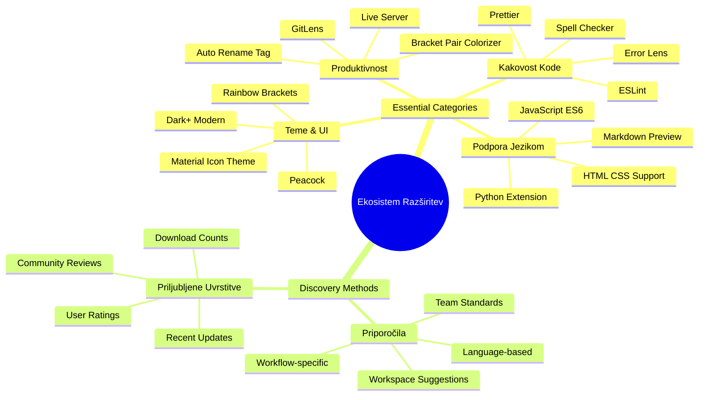
### Iskanje popolnih razširitev

Trgovina z razširitvami je zelo dobro organizirana, zato se ne boste izgubili, ko boste iskali, kar potrebujete. Namenjena je, da vam pomaga odkriti tako specifična orodja kot tudi kul stvari, za katere sploh niste vedeli!

**Dostop do trgovine:**

1. Kliknite ikono za razširitve (🧩) v vrstici aktivnosti
2. Brskajte ali poiščite kaj konkretnega
3. Kliknite karkoli, kar vam je zanimivo, da izveste več


**Kaj boste tam videli:**

| Odsek | Kaj vsebuje | Zakaj je koristno |
|----------|---------|----------|
| **Nameščeno** | Razširitve, ki ste jih že dodali | Vaše osebno orodje za programiranje |
| **Priljubljene** | Najbolj priljubljene v skupnosti | Kar večina razvijalcev zelo uporablja |
| **Priporočene** | Pametni predlogi za vaš projekt | Prijazna priporočila VSCode.dev |

**Kaj omogoča enostavno brskanje:**
- Vsaka razširitev prikazuje ocene, število prenosov in ocene resničnih uporabnikov
- Dobite posnetke zaslona in jasne opise, kaj posamezna razširitev počne
- Vse je jasno označeno z informacijami o združljivosti
- Predlagane so podobne razširitve, da lahko primerjate možnosti

### Namestitev razširitev (je zelo enostavno!)

Dodajanje novih zmogljivosti vašemu urejevalniku je preprosto kot klik na gumb. Razširitve se namestijo v nekaj sekundah in začnejo delovati takoj – brez ponovnih zagonov ali čakanja.

**Tukaj je vse, kar morate storiti:**

1. Iščite, kar želite (poskusite iskati "live server" ali "prettier")
2. Kliknite na razširitev, ki izgleda zanimivo, da vidite več podrobnosti
3. Preberite, kaj počne in si oglejte ocene
4. Pritisnite modri gumb "Install" in to je to!


**Kaj se dogaja v ozadju:**
- Razširitev se samodejno prenese in nastavi
- Nove funkcije se takoj prikažejo v vmesniku
- Vse začne delovati takoj (res, tako hitro je!)
- Če ste prijavljeni, se razširitev sinhronizira na vseh napravah

**Nekaj razširitev, ki jih priporočam za začetek:**
- **Live Server**: Oglejte si posodobitve vaše spletne strani v realnem času med pisanjem kode (to je čarobno!)
- **Prettier**: Vašo kodo samodejno naredi čisto in profesionalno
- **Auto Rename Tag**: Spremenite en HTML tag in njegov partner se samodejno posodobi
- **Bracket Pair Colorizer**: Barvno označi oklepaje, da se nikoli ne izgubite
- **GitLens**: Okrepča vaše Git funkcije z obilico uporabnih informacij

### Prilagajanje razširitev

Večina razširitev ima nastavitve, ki jih lahko prilagodite, da delujejo točno tako, kot želite. Pomislite na to, kot bi nastavili sedež in ogledala v avtomobilu – vsak ima svoje preference!

**Prilagajanje nastavitev razširitev:**

1. Poiščite nameščeno razširitev v panelu Razširitve
2. Poiščite majhno ikono zobnika (⚙️) zraven imena in kliknite nanjo
3. Izberite "Extension Settings" iz spustnega menija
4. Nastavite stvari, dokler ne bo vse točno tako, kot želite za svoj potek dela

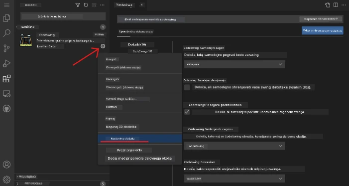

**Pogoste stvari, ki jih boste morda želeli prilagoditi:**
- Kako se vaša koda oblikuje (tabulatorji proti presledkom, dolžina vrstic itd.)
- Katere bližnjice na tipkovnici sprožijo različna dejanja
- Kakšne vrste datotek naj podpira razširitev
- Vključevanje ali izključevanje določenih funkcij za čistost

### Ohranite organizacijo razširitev

Ko odkrijete več kul razširitev, boste hoteli svoj nabor ohraniti urejen in tekoč. VSCode.dev vam to zelo olajša.

**Možnosti upravljanja razširitev:**

| Kaj lahko storite | Kdaj je koristno | Nasvet |
|--------|---------|----------|
| **Onemogoči** | Preverjanje, ali razširitev povzroča težave | Bolje kot odinstalacija, če jo morda želite nazaj |
| **Odstrani** | Popolnoma odstranite razširitve, ki jih ne potrebujete | Ohranja okolje čisto in hitro |
| **Posodobi** | Pridobite najnovejše funkcije in popravke | Ponavadi se zgodi samodejno, a je dobro preveriti |

**Kako jaz upravljam razširitve:**
- Vsakih nekaj mesecev pregledam nameščene razširitve in odstraním tiste, ki jih ne uporabljam
- Razširitve vzdržujem posodobljene za najnovejše izboljšave in varnostne popravke
- Če se kaj upočasni, začasno onemogočim razširitve, da vidim ali katera povzroča težave
- Preberem opombe o posodobitvah pri večjih nadgradnjah – včasih pridejo tudi nove kul funkcije!

> ⚠️ **Nasvet o zmogljivosti**: Razširitve so super, a preveč jih lahko upočasni delo. Osredotočite se na tiste, ki vam res olajšajo življenje, in ne bojte se odstraniti tistih, ki jih nikoli ne uporabljate.

### 🎯 Pedagoška kontrola: Prilagajanje razvojnega okolja

**Razumevanje arhitekture**: Naučili ste se prilagoditi profesionalno razvojno okolje z razširitvami, ki jih je ustvarila skupnost. To odraža, kako podjetniške razvojne ekipe gradijo standardizirane verige orodij.

**Ključni osvojeni koncepti**:
- **Iskanje razširitev**: Iskanje orodij za specifične razvojne izzive
- **Konfiguracija okolja**: Prilagajanje orodij glede na osebne ali skupinske preference
- **Optimizacija zmogljivosti**: Uravnoteženje funkcionalnosti in učinkovitosti sistema
- **Sodelovanje skupnosti**: Izkoriščanje orodij, ustvarjenih s strani globalne skupnosti razvijalcev

**Povezava z industrijo**: Ekosistemi razširitev poganjajo glavne razvojne platforme, kot so VS Code, Chrome DevTools in sodobna integrirana razvojna okolja (IDE). Razumevanje, kako ocenjevati, nameščati in konfigurirati razširitve, je ključnega pomena za profesionalne razvojne tokove.

**Vprašanje za razmislek**: Kako bi pristopili k vzpostavitvi standardiziranega razvojnega okolja za ekipo 10 razvijalcev? Premislite o skladnosti, zmogljivosti in individualnih preferencah.

## 📈 Vaš časovni načrt za obvladovanje razvoja v oblaku

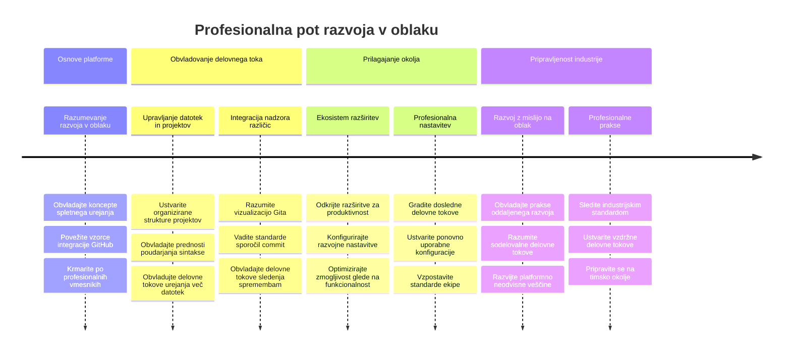
**🎓 Mejniki zaključka**: Uspešno ste obvladali razvoj v oblaku z uporabo istih orodij in delovnih tokov, kot jih uporabljajo profesionalni razvijalci v velikih tehnoloških podjetjih. Te veščine predstavljajo prihodnost razvoja programske opreme.

**🔄 Naslednje zmogljivosti**:
- Pripravljeni na raziskovanje naprednih platform za razvoj v oblaku (Codespaces, GitPod)
- Pripravljeni za delo v razpršenih razvojnih ekipah
- Opremljeni za prispevanje k odprtokodnim projektom po celem svetu
- Postavljena podlaga za sodobne DevOps prakse in neprekinjeno integracijo

## Izziv GitHub Copilot Agenta 🚀

Tako kot NASA uporablja strukturiran pristop za vesoljske misije, ta izziv vključuje sistematično uporabo veščin VSCode.dev v celovitem scenariju delovnega toka.

**Cilj:** Pokažite svojo spretnost z VSCode.dev z vzpostavitvijo celovitega spletnega razvojnega delovnega toka.

**Zahteve projekta:** Z uporabo pomoči v načinu agenta dokončajte naslednje naloge:
1. Razvežite obstoječi repozitorij ali ustvarite novega
2. Ustvarite funkcionalno strukturo projekta z datotekami HTML, CSS in JavaScript
3. Namestite in konfigurirajte tri razširitve za izboljšanje razvoja
4. Vadite nadzor različic z opisnimi sporočili commitov
5. Preizkusite ustvarjanje in spreminjanje funkcijskih vej
6. Dokumentirajte proces in ugotovitve v datoteki README.md

Ta vaja združuje vse koncepte VSCode.dev v praktičen delovni tok, ki ga lahko uporabite pri prihodnjih razvojnih projektih.

Več o [načinu agent](https://code.visualstudio.com/blogs/2025/02/24/introducing-copilot-agent-mode) preberite tukaj.

## Naloga

Čas je, da te veščine preizkusite v praksi! Imam praktičen projekt, ki vam bo omogočil vadbo vsega, kar smo obravnavali: [Ustvari spletno stran življenjepisa z uporabo VSCode.dev](./assignment.md)

Ta naloga vas vodi skozi izgradnjo profesionalne spletne strani življenjepisa povsem v vašem brskalniku. Uporabili boste vse funkcionalnosti VSCode.dev, ki smo jih raziskali, in na koncu boste imeli tako odlično spletno stran kot tudi trdno samozavest v vaš novi delovni tok.

## Nadaljujte z raziskovanjem in razvijanjem veščin

Zdaj imate trdno osnovo, vendar je še ogromno kul stvari za odkriti! Tukaj je nekaj virov in idej za nadaljnjo izpopolnitev vaših veščin z VSCode.dev:

**Uradni dokumenti, ki jih je vredno označiti:**
- [Dokumentacija VSCode Web](https://code.visualstudio.com/docs/editor/vscode-web?WT.mc_id=academic-0000-alfredodeza) – Popolni vodič za urejanje v brskalniku
- [GitHub Codespaces](https://docs.github.com/en/codespaces) – Za ko želite še več moči v oblaku

**Kul funkcije za prihodnjo prakso:**
- **Bližnjice na tipkovnici**: Naučite se tipk, ki vas bodo naredile za programerskega ninjo
- **Nastavitve delovnega prostora**: Nastavite različna okolja za različne vrste projektov
- **Prostori z več koreninami**: Delo na več repozitorijih hkrati (super priročno!)
- **Integracija terminala**: Dostopajte do ukazne vrstice kar v brskalniku

**Ideje za vadbo:**
- Pridružite se odprtokodnim projektom in prispevajte prek VSCode.dev – odličen način vračanja skupnosti!
- Preizkusite različne razširitve, da najdete svojo popolno nastavitev
- Ustvarite predloge projektov za vrste spletnih strani, ki jih gradite najpogosteje
- Vadite Git delovne tokove, kot so vejitev in združevanje – te veščine so zlata vredne v timskih projektih

---

**Obvladali ste razvoj v brskalniku!** 🎉 Tako kot je izum prenosnih instrumentov omogočil znanstvenikom raziskovanje na oddaljenih področjih, vam VSCode.dev omogoča profesionalno programiranje z vsake naprave s spletno povezavo.

Te veščine odražajo trenutne industrijske prakse – številni profesionalni razvijalci uporabljajo razvojna okolja v oblaku zaradi njihove prilagodljivosti in dostopnosti. Naučili ste se delovnega toka, ki se razteza od posameznih projektov do velikih ekipnih sodelovanj.

Uporabite te tehnike pri svojem naslednjem razvojnih projektu! 🚀

---

<!-- CO-OP TRANSLATOR DISCLAIMER START -->
**Opozorilo**:
Ta dokument je bil preveden z uporabo storitve za prevajanje z umetno inteligenco [Co-op Translator](https://github.com/Azure/co-op-translator). Čeprav si prizadevamo za natančnost, vas opozarjamo, da lahko avtomatizirani prevodi vsebujejo napake ali netočnosti. Izvirni dokument v njegovem izvirnem jeziku je treba obravnavati kot verodostojen vir. Za ključne informacije priporočamo strokovni človeški prevod. Nismo odgovorni za morebitna nesporazuma ali napačne razlage, ki izhajajo iz uporabe tega prevoda.
<!-- CO-OP TRANSLATOR DISCLAIMER END -->