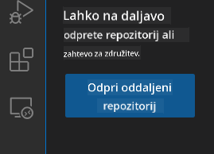
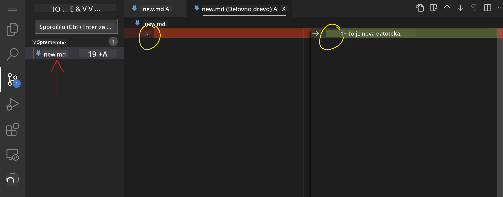
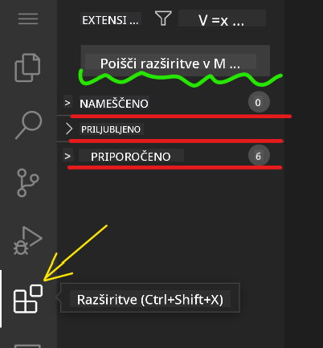

<!--
CO_OP_TRANSLATOR_METADATA:
{
  "original_hash": "1ba61d96a11309a2a6ea507496dcf7e5",
  "translation_date": "2025-08-29T12:55:46+00:00",
  "source_file": "8-code-editor/1-using-a-code-editor/README.md",
  "language_code": "sl"
}
-->
# Uporaba urejevalnika kode

Ta lekcija zajema osnove uporabe [VSCode.dev](https://vscode.dev), spletnega urejevalnika kode, ki vam omogoča spreminjanje kode in prispevanje k projektu brez potrebe po nameščanju programske opreme na vaš računalnik.

## Učni cilji

V tej lekciji boste spoznali, kako:

- Uporabljati urejevalnik kode v projektu
- Spremljati spremembe z uporabo sistema za nadzor različic
- Prilagoditi urejevalnik za razvoj

### Predpogoji

Preden začnete, morate ustvariti račun na [GitHub](https://github.com). Obiščite [GitHub](https://github.com/) in ustvarite račun, če ga še nimate.

### Uvod

Urejevalnik kode je ključno orodje za pisanje programov in sodelovanje pri obstoječih projektih. Ko boste razumeli osnove urejevalnika in kako izkoristiti njegove funkcije, jih boste lahko uporabili pri pisanju kode.

## Začetek z VSCode.dev

[VSCode.dev](https://vscode.dev) je spletni urejevalnik kode. Za njegovo uporabo vam ni treba ničesar namestiti, saj deluje podobno kot odpiranje katere koli druge spletne strani. Za začetek odprite naslednjo povezavo: [https://vscode.dev](https://vscode.dev). Če niste prijavljeni v [GitHub](https://github.com/), sledite navodilom za prijavo ali ustvarite nov račun in se nato prijavite.

Ko se urejevalnik naloži, bi moral izgledati podobno kot na tej sliki:


Obstajajo trije glavni deli, od leve proti desni:

1. _Vrstica dejavnosti_ (_activity bar_), ki vključuje ikone, kot so povečevalno steklo 🔎, zobnik ⚙️ in nekaj drugih.
2. Razširjena vrstica dejavnosti, ki privzeto prikazuje _Raziskovalec_ (_Explorer_), imenovana _stranska vrstica_ (_side bar_).
3. In nazadnje, območje kode na desni strani.

Kliknite na vsako od ikon, da prikažete različne menije. Ko končate, kliknite na _Raziskovalec_, da se vrnete na začetno točko.

Ko začnete ustvarjati ali spreminjati kodo, se to dogaja v največjem območju na desni strani. To območje boste uporabili tudi za pregled obstoječe kode, kar boste storili v nadaljevanju.

## Odprite GitHub repozitorij

Prva stvar, ki jo potrebujete, je odpreti GitHub repozitorij. Obstaja več načinov za odpiranje repozitorija. V tem razdelku boste spoznali dva različna načina, kako lahko odprete repozitorij in začnete delati na spremembah.

### 1. Z uporabo urejevalnika

Uporabite urejevalnik za odpiranje oddaljenega repozitorija. Če obiščete [VSCode.dev](https://vscode.dev), boste videli gumb _"Open Remote Repository"_:



Lahko uporabite tudi ukazno paleto. Ukazna paleta je vnosno polje, kjer lahko vnesete katero koli besedo, ki je del ukaza ali dejanja, da najdete pravi ukaz za izvedbo. Uporabite meni v zgornjem levem kotu, nato izberite _View_ in nato _Command Palette_, ali uporabite naslednjo bližnjico na tipkovnici: Ctrl-Shift-P (na MacOS Command-Shift-P).


Ko se meni odpre, vnesite _open remote repository_ in nato izberite prvo možnost. Prikazali se bodo repozitoriji, katerih del ste, ali tisti, ki ste jih nedavno odprli. Uporabite tudi celoten GitHub URL za izbiro repozitorija. Vnesite naslednji URL v polje:

```
https://github.com/microsoft/Web-Dev-For-Beginners
```

✅ Če je bilo uspešno, boste videli vse datoteke tega repozitorija naložene v urejevalniku.

### 2. Z uporabo URL-ja

Repozitorij lahko naložite tudi neposredno z uporabo URL-ja. Na primer, celoten URL za trenutni repozitorij je [https://github.com/microsoft/Web-Dev-For-Beginners](https://github.com/microsoft/Web-Dev-For-Beginners), vendar lahko domeno GitHub zamenjate z `VSCode.dev/github` in repozitorij naložite neposredno. Rezultirajoči URL bi bil [https://vscode.dev/github/microsoft/Web-Dev-For-Beginners](https://vscode.dev/github/microsoft/Web-Dev-For-Beginners).

## Urejanje datotek

Ko odprete repozitorij v brskalniku/vscode.dev, je naslednji korak posodobitev ali sprememba projekta.

### 1. Ustvarite novo datoteko

Datoteko lahko ustvarite znotraj obstoječe mape ali v korenskem imeniku/mapi. Za ustvarjanje nove datoteke odprite lokacijo/mapo, kamor želite shraniti datoteko, in izberite ikono _'New file ...'_ na vrstici dejavnosti _(levo)_, poimenujte datoteko in pritisnite Enter.


### 2. Uredite in shranite datoteko v repozitoriju

Uporaba vscode.dev je koristna, kadar želite hitro posodobiti svoj projekt brez nalaganja programske opreme lokalno.  
Za posodobitev kode kliknite ikono 'Raziskovalec', ki se nahaja tudi na vrstici dejavnosti, da si ogledate datoteke in mape v repozitoriju.  
Izberite datoteko, da jo odprete v območju kode, naredite spremembe in shranite.


Ko končate s posodabljanjem projekta, izberite ikono _`source control`_, ki vsebuje vse nove spremembe, ki ste jih naredili v repozitoriju.

Za ogled sprememb, ki ste jih naredili v projektu, izberite datoteko(-e) v mapi `Changes` v razširjeni vrstici dejavnosti. To bo odprlo 'Delovno drevo' (_Working Tree_), kjer lahko vizualno vidite spremembe, ki ste jih naredili v datoteki. Rdeča barva označuje izbris, zelena pa dodatek.



Če ste zadovoljni s spremembami, ki ste jih naredili, se pomaknite na mapo `Changes` in kliknite gumb `+`, da pripravite spremembe za oddajo. Priprava pomeni, da spremembe pripravite za oddajo na GitHub.

Če pa niste zadovoljni z nekaterimi spremembami in jih želite zavreči, se pomaknite na mapo `Changes` in izberite ikono `undo`.

Nato vnesite `commit message` _(opis spremembe, ki ste jo naredili v projektu)_, kliknite ikono za potrditev (check icon) in oddajte spremembe.

Ko končate z delom na projektu, izberite ikono menija (hamburger menu) v zgornjem levem kotu, da se vrnete na repozitorij na github.com.


## Uporaba razširitev

Nameščanje razširitev v VSCode omogoča dodajanje novih funkcij in prilagoditev okolja za razvoj v urejevalniku, kar izboljša vaš delovni tok. Te razširitve omogočajo tudi podporo za več programskih jezikov in so pogosto splošne ali specifične za določen jezik.

Za pregled seznama vseh razpoložljivih razširitev kliknite ikono _`Extensions`_ na vrstici dejavnosti in začnite vnašati ime razširitve v iskalno polje z oznako _'Search Extensions in Marketplace'_.  
Prikazal se bo seznam razširitev, vsaka z **imenom razširitve, imenom založnika, enovrstičnim opisom, številom prenosov** in **oceno z zvezdicami**.


Prav tako si lahko ogledate vse prej nameščene razširitve v razširjeni mapi _`Installed`_, priljubljene razširitve, ki jih uporablja večina razvijalcev, v mapi _`Popular`_ in priporočene razširitve za vas bodisi na podlagi uporabnikov v istem delovnem prostoru ali na podlagi vaših nedavno odprtih datotek v mapi _`Recommended`_.



### 1. Namestitev razširitev

Za namestitev razširitve vnesite ime razširitve v iskalno polje in kliknite nanjo, da si ogledate dodatne informacije o razširitvi v območju kode, ko se prikaže v razširjeni vrstici dejavnosti.

Lahko kliknete _modri gumb za namestitev_ v razširjeni vrstici dejavnosti za namestitev ali uporabite gumb za namestitev, ki se prikaže v območju kode, ko izberete razširitev za nalaganje dodatnih informacij.


### 2. Prilagoditev razširitev

Po namestitvi razširitve boste morda morali prilagoditi njeno vedenje in jo nastaviti glede na svoje želje. To storite tako, da izberete ikono Razširitve, nato pa se bo vaša razširitev prikazala v mapi _Installed_. Kliknite na _**ikono zobnika**_ in pojdite na _Extensions Setting_.


### 3. Upravljanje razširitev

Po namestitvi in uporabi razširitve vam vscode.dev ponuja možnosti za upravljanje razširitev glede na različne potrebe. Na primer, lahko:

- **Onemogočite:** _(Začasno onemogočite razširitev, ko je ne potrebujete, vendar je ne želite popolnoma odstraniti.)_

    Izberite nameščeno razširitev v razširjeni vrstici dejavnosti > kliknite ikono zobnika > izberite 'Disable' ali 'Disable (Workspace)' **ALI** odprite razširitev v območju kode in kliknite modri gumb Disable.

- **Odstranite:** Izberite nameščeno razširitev v razširjeni vrstici dejavnosti > kliknite ikono zobnika > izberite 'Uninstall' **ALI** odprite razširitev v območju kode in kliknite modri gumb Uninstall.

---

## Naloga

[Ustvarite spletno stran življenjepisa z uporabo vscode.dev](https://github.com/microsoft/Web-Dev-For-Beginners/blob/main/8-code-editor/1-using-a-code-editor/assignment.md)

## Pregled in samostojno učenje

Preberite več o [VSCode.dev](https://code.visualstudio.com/docs/editor/vscode-web?WT.mc_id=academic-0000-alfredodeza) in nekaterih njegovih drugih funkcijah.

---

**Omejitev odgovornosti**:  
Ta dokument je bil preveden z uporabo storitve za prevajanje z umetno inteligenco [Co-op Translator](https://github.com/Azure/co-op-translator). Čeprav si prizadevamo za natančnost, vas prosimo, da upoštevate, da lahko avtomatizirani prevodi vsebujejo napake ali netočnosti. Izvirni dokument v njegovem maternem jeziku je treba obravnavati kot avtoritativni vir. Za ključne informacije priporočamo profesionalni človeški prevod. Ne prevzemamo odgovornosti za morebitna nesporazumevanja ali napačne razlage, ki bi nastale zaradi uporabe tega prevoda.