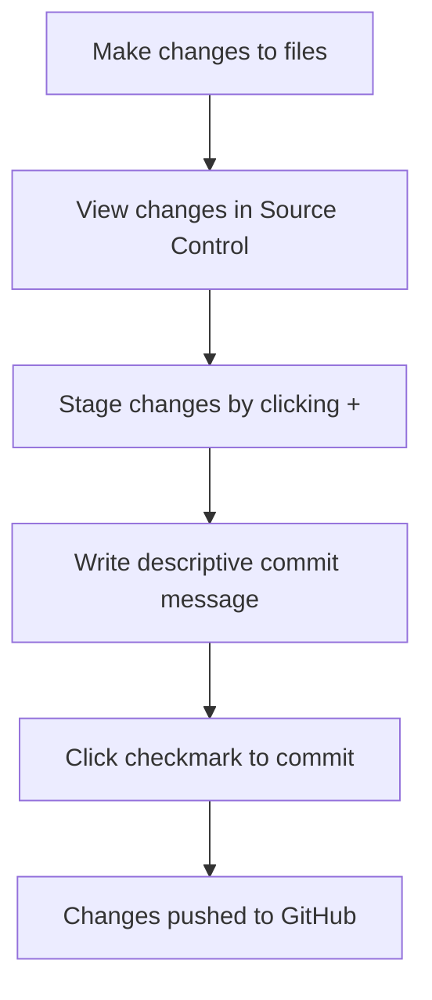

<!--
CO_OP_TRANSLATOR_METADATA:
{
  "original_hash": "cfd4a15974168ca426d50c67682ab9d4",
  "translation_date": "2025-10-25T00:20:19+00:00",
  "source_file": "8-code-editor/1-using-a-code-editor/README.md",
  "language_code": "sl"
}
-->
# Uporaba urejevalnika kode: Obvladovanje VSCode.dev

Se spomnite v *Matrixu*, ko se je moral Neo priklopiti na ogromno računalniško terminal, da je dostopal do digitalnega sveta? Današnja orodja za spletni razvoj so popolno nasprotje – neverjetno zmogljive funkcije, dostopne od kjerkoli. VSCode.dev je urejevalnik kode, ki temelji na brskalniku in prinaša profesionalna razvojna orodja na katerokoli napravo z internetno povezavo.

Tako kot je tiskarski stroj omogočil dostop do knjig vsem, ne le pisarjem v samostanih, VSCode.dev demokratizira programiranje. Na projektih lahko delate iz knjižnice, šolskega laboratorija ali kjerkoli imate dostop do brskalnika. Brez namestitev, brez omejitev "potrebujem svojo specifično nastavitev".

Do konca te lekcije boste razumeli, kako se orientirati v VSCode.dev, odpreti GitHub repozitorije neposredno v brskalniku in uporabljati Git za nadzor različic – vse veščine, na katere se profesionalni razvijalci zanašajo vsak dan.

## Kaj se boste naučili

Ko bomo skupaj prehodili to lekcijo, boste znali:

- Se orientirati v VSCode.dev, kot da je vaš drugi dom – najti vse, kar potrebujete, brez zmede
- Neposredno v brskalniku odpreti kateri koli GitHub repozitorij in takoj začeti z urejanjem (to je res čarobno!)
- Uporabljati Git za sledenje spremembam in shranjevanje napredka kot profesionalec
- Nadgraditi svoj urejevalnik z razširitvami, ki pospešijo in poenostavijo programiranje
- Z zaupanjem ustvarjati in organizirati projektne datoteke

## Kaj potrebujete

Zahteve so preproste:

- Brezplačen [GitHub račun](https://github.com) (po potrebi vas bomo vodili skozi postopek ustvarjanja)
- Osnovno poznavanje spletnih brskalnikov
- Lekcija o osnovah GitHuba ponuja koristno ozadje, čeprav ni nujna

> 💡 **Nov/a na GitHubu?** Ustvarjanje računa je brezplačno in traja le nekaj minut. Tako kot knjižnična izkaznica omogoča dostop do knjig po vsem svetu, GitHub račun odpira vrata do kodnih repozitorijev po internetu.

## Zakaj so spletni urejevalniki kode pomembni

Pred internetom znanstveniki na različnih univerzah niso mogli zlahka deliti raziskav. Nato je v 60-ih letih prišel ARPANET, ki je povezal računalnike na daljavo. Spletni urejevalniki kode sledijo istemu principu – omogočajo dostop do zmogljivih orodij ne glede na vašo fizično lokacijo ali napravo.

Urejevalnik kode je vaš delovni prostor za razvoj, kjer pišete, urejate in organizirate kodne datoteke. Za razliko od preprostih urejevalnikov besedila profesionalni urejevalniki kode omogočajo označevanje sintakse, zaznavanje napak in funkcije za upravljanje projektov.

VSCode.dev prinaša te zmogljivosti v vaš brskalnik:

**Prednosti spletnega urejanja:**

| Funkcija | Opis | Praktična korist |
|----------|-------|------------------|
| **Neodvisnost od platforme** | Deluje na katerikoli napravi z brskalnikom | Brez težav delajte na različnih računalnikih |
| **Brez potrebne namestitve** | Dostop prek spletnega URL-ja | Izognite se omejitvam pri namestitvi programske opreme |
| **Samodejne posodobitve** | Vedno deluje na najnovejši različici | Dostop do novih funkcij brez ročnih posodobitev |
| **Integracija z repozitoriji** | Neposredna povezava z GitHubom | Urejanje kode brez lokalnega upravljanja datotek |

**Praktične posledice:**
- Kontinuiteta dela v različnih okoljih
- Dosleden vmesnik ne glede na operacijski sistem
- Takojšnje možnosti sodelovanja
- Zmanjšane zahteve po lokalnem shranjevanju

## Raziskovanje VSCode.dev

Tako kot je laboratorij Marie Curie vseboval sofisticirano opremo v relativno preprostem prostoru, VSCode.dev združuje profesionalna razvojna orodja v vmesnik brskalnika. Ta spletna aplikacija ponuja enako osnovno funkcionalnost kot namizni urejevalniki kode.

Začnite tako, da v brskalniku odprete [vscode.dev](https://vscode.dev). Vmesnik se naloži brez prenosa ali namestitve sistema – neposredna uporaba načel računalništva v oblaku.

### Povezovanje vašega GitHub računa

Tako kot je telefon Alexandra Grahama Bella povezal oddaljene lokacije, povezava vašega GitHub računa povezuje VSCode.dev z vašimi kodnimi repozitoriji. Ko vas pozove, da se prijavite v GitHub, je priporočljivo sprejeti to povezavo.

**Integracija z GitHubom omogoča:**
- Neposreden dostop do vaših repozitorijev znotraj urejevalnika
- Sinhronizirane nastavitve in razširitve na različnih napravah
- Poenostavljen potek shranjevanja na GitHub
- Osebno prilagojeno razvojno okolje

### Spoznajte svoj novi delovni prostor

Ko se vse naloži, boste videli čudovito čist delovni prostor, zasnovan tako, da se osredotočite na tisto, kar je pomembno – vašo kodo!

**Tukaj je vaš ogled soseske:**
- **Aktivnostna vrstica** (tisti trak na levi): Vaša glavna navigacija z Raziskovalcem 📁, Iskanjem 🔍, Nadzorom različic 🌿, Razširitvami 🧩 in Nastavitvami ⚙️
- **Stranska vrstica** (panel poleg nje): Spreminja se, da vam pokaže ustrezne informacije glede na to, kaj ste izbrali
- **Urejanje** (velik prostor na sredini): Tukaj se zgodi čarovnija – vaš glavni prostor za kodiranje

**Vzemite si trenutek za raziskovanje:**
- Klikajte po ikonah v Aktivnostni vrstici in preverite, kaj vsaka počne
- Opazite, kako se stranska vrstica posodablja, da pokaže različne informacije – kar priročno, kajne?
- Raziskovalni pogled (📁) je verjetno tisti, kjer boste preživeli največ časa, zato se z njim dobro spoznajte

## Odpiranje GitHub repozitorijev

Pred internetom so morali raziskovalci fizično potovati v knjižnice, da so dostopali do dokumentov. GitHub repozitoriji delujejo podobno – so zbirke kode, shranjene na daljavo. VSCode.dev odpravlja tradicionalni korak prenosa repozitorijev na lokalni računalnik pred urejanjem.

Ta funkcionalnost omogoča takojšen dostop do katerega koli javnega repozitorija za ogled, urejanje ali prispevanje. Tukaj sta dva načina za odpiranje repozitorijev:

### Metoda 1: Klikni in odpri

To je popolno, ko začenjate z VSCode.dev in želite odpreti določen repozitorij. Je preprosto in prijazno za začetnike:

**Kako to storiti:**

1. Pojdite na [vscode.dev](https://vscode.dev), če tam še niste
2. Na začetnem zaslonu poiščite gumb "Odpri oddaljeni repozitorij" in kliknite nanj

   

3. Prilepite URL katerega koli GitHub repozitorija (poskusite tega: `https://github.com/microsoft/Web-Dev-For-Beginners`)
4. Pritisnite Enter in opazujte čarovnijo!

**Nasvet za profesionalce - Bližnjica do ukazne palete:**

Se želite počutiti kot čarovnik za kodiranje? Poskusite to bližnjico na tipkovnici: Ctrl+Shift+P (ali Cmd+Shift+P na Macu) za odpiranje ukazne palete:

**Ukazna paleta je kot iskalnik za vse, kar lahko storite:**
- Vnesite "odpri oddaljeni" in našla bo odpiralnik repozitorijev za vas
- Zapomni si repozitorije, ki ste jih nedavno odprli (zelo priročno!)
- Ko se navadite nanjo, se boste počutili, kot da kodirate s svetlobno hitrostjo
- To je v bistvu VSCode.dev-ova različica "Hej Siri, ampak za kodiranje"

### Metoda 2: Tehnika spreminjanja URL-ja

Tako kot HTTP in HTTPS uporabljata različne protokole, medtem ko ohranjata isto strukturo domene, VSCode.dev uporablja vzorec URL-ja, ki odraža GitHubov sistem naslavljanja. Vsak URL GitHub repozitorija je mogoče spremeniti, da se neposredno odpre v VSCode.dev.

**Vzorec transformacije URL-ja:**

| Vrsta repozitorija | GitHub URL | VSCode.dev URL |
|--------------------|------------|----------------|
| **Javni repozitorij** | `github.com/microsoft/Web-Dev-For-Beginners` | `vscode.dev/github/microsoft/Web-Dev-For-Beginners` |
| **Osebni projekt** | `github.com/your-username/my-project` | `vscode.dev/github/your-username/my-project` |
| **Katerikoli dostopen repozitorij** | `github.com/their-username/awesome-repo` | `vscode.dev/github/their-username/awesome-repo` |

**Izvedba:**
- Zamenjajte `github.com` z `vscode.dev/github`
- Ohranite vse ostale komponente URL-ja nespremenjene
- Deluje s katerim koli javno dostopnim repozitorijem
- Omogoča takojšen dostop za urejanje

> 💡 **Nasvet, ki spreminja življenje**: Shranite različice VSCode.dev svojih najljubših repozitorijev med zaznamke. Imam zaznamke, kot so "Uredi moj portfelj" in "Popravi dokumentacijo", ki me takoj pripeljejo v način urejanja!

**Katero metodo uporabiti?**
- **Način prek vmesnika**: Odličen, ko raziskujete ali se ne spomnite natančnih imen repozitorijev
- **URL trik**: Popoln za bliskovit dostop, ko točno veste, kam greste

## Delo z datotekami in projekti

Zdaj, ko imate odprt repozitorij, začnimo z ustvarjanjem! VSCode.dev vam ponuja vse, kar potrebujete za ustvarjanje, urejanje in organiziranje vaših kodnih datotek. Pomislite nanj kot na svojo digitalno delavnico – vsak pripomoček je tam, kjer ga potrebujete.

Poglobimo se v vsakodnevne naloge, ki bodo sestavljale večino vašega delovnega procesa kodiranja.

### Ustvarjanje novih datotek

Tako kot organiziranje načrtov v arhitekturnem biroju, ustvarjanje datotek v VSCode.dev sledi strukturiranemu pristopu. Sistem podpira vse standardne vrste datotek za spletni razvoj.

**Postopek ustvarjanja datotek:**

1. Pomaknite se do ciljne mape v stranski vrstici Raziskovalca
2. Premaknite miško nad ime mape, da se prikaže ikona "Nova datoteka" (📄+)
3. Vnesite ime datoteke, vključno z ustrezno končnico (`style.css`, `script.js`, `index.html`)
4. Pritisnite Enter za ustvarjanje datoteke

**Konvencije poimenovanja:**
- Uporabljajte opisna imena, ki nakazujejo namen datoteke
- Vključite končnice datotek za pravilno označevanje sintakse
- Upoštevajte dosledne vzorce poimenovanja skozi projekte
- Uporabljajte male črke in vezaje namesto presledkov

### Urejanje in shranjevanje datotek

Tu se začne prava zabava! Urejevalnik VSCode.dev je poln uporabnih funkcij, ki naredijo kodiranje gladko in intuitivno. To je kot imeti res pametnega pisnega asistenta, vendar za kodo.

**Vaš potek urejanja:**

1. Kliknite katero koli datoteko v Raziskovalcu, da jo odprete v glavnem prostoru
2. Začnite tipkati in opazujte, kako vam VSCode.dev pomaga z barvami, predlogi in zaznavanjem napak
3. Shranite svoje delo s Ctrl+S (Windows/Linux) ali Cmd+S (Mac) – čeprav se samodejno shranjuje!

**Kul stvari, ki se zgodijo med kodiranjem:**
- Vaša koda je lepo barvno označena, da jo je lažje brati
- VSCode.dev predlaga dopolnitve med tipkanjem (kot samopopravki, vendar veliko pametnejši)
- Zazna tipkarske napake in napake, še preden shranite
- Več datotek lahko odprete v zavihkih, tako kot v brskalniku
- Vse se samodejno shranjuje v ozadju

> ⚠️ **Hitri nasvet**: Čeprav vas samodejno shranjevanje varuje, je pritisk na Ctrl+S ali Cmd+S še vedno dobra navada. Takoj shranite vse in sprožite nekaj dodatnih uporabnih funkcij, kot je preverjanje napak.

### Nadzor različic z Gitom

Tako kot arheologi ustvarjajo podrobne zapise plasti izkopavanj, Git sledi spremembam v vaši kodi skozi čas. Ta sistem ohranja zgodovino projekta in vam omogoča, da se po potrebi vrnete na prejšnje različice. VSCode.dev vključuje integrirano funkcionalnost Gita.

**Vmesnik za nadzor različic:**

1. Dostopajte do plošče za nadzor različic prek ikone 🌿 v Aktivnostni vrstici
2. Spremenjene datoteke se pojavijo v razdelku "Spremembe"
3. Barvno kodiranje označuje vrste sprememb: zelena za dodatke, rdeča za izbrise

**Shranjevanje vašega dela (potek dela za commit):**

**Tukaj je vaš korak za korakom postopek:**
- Kliknite ikono "+" poleg datotek, ki jih želite shraniti (s tem jih "pripravite")
- Dvakrat preverite, ali ste zadovoljni z vsemi pripravljenimi spremembami
- Napišite kratko opombo, ki pojasnjuje, kaj ste naredili (to je vaše "sporočilo o commitu")
- Kliknite gumb za kljukico, da vse shranite na GitHub
- Če si premislite glede nečesa, vam ikona za razveljavitev omogoča, da zavržete spremembe

**Pisanje dobrih sporočil o commitih (to je lažje, kot si mislite!):**
- Preprosto opišite, kaj ste naredili, na primer "Dodaj kontaktni obrazec" ali "Popravi pokvarjeno navigacijo"
- Naj bo kratko in jedrnato – razmišljajte o dolžini tvita, ne eseja
- Začnite z akcijskimi besedami, kot so "Dodaj", "Popravi", "Posodobi" ali "Odstrani"
- **Dobri primeri**: "Dodaj odzivni navigacijski meni", "Popravi težave z mobilno postavitvijo", "Posodobi barve za boljšo dostopnost"

> 💡 **Hitri navigacijski nasvet**: Uporabite meni hamburger (☰) zgoraj levo, da se vrnete na svoj GitHub repozitorij in si ogledate svoje shranjene spremembe na spletu. To je kot portal med vašim urejevalnim okoljem in domačo stranjo vašega projekta na GitHubu!

## Izboljšanje funkcionalnosti z razširitvami

Tako kot delavnica obrtnika vsebuje specializirana orodja za različne naloge, je mogoče VSCode.dev prilagoditi z razširitvami, ki dodajo specifične funkcionalnosti. Te razširitve, ki jih razvija skupnost, rešujejo pogoste izzive pri razvoju, kot so oblikovanje kode, predogled v živo in izboljšana integracija z Gitom.

Tržnica razširitev gosti na tisoče brezplačnih orodij, ki jih ustvarjajo razvijalci po vsem svetu. Vsaka razširitev rešuje določene izzive pri delovnem procesu, kar vam omogoča, da z
- Vsaka razširitev prikazuje ocene, število prenosov in resnične ocene uporabnikov.
- Na voljo so posnetki zaslona in jasni opisi, kaj vsaka razširitev počne.
- Vse je jasno označeno z informacijami o združljivosti.
- Predlagane so podobne razširitve, da lahko primerjate možnosti.

### Namestitev razširitev (Zelo enostavno!)

Dodajanje novih funkcij vašemu urejevalniku je tako preprosto kot klik na gumb. Razširitve se namestijo v nekaj sekundah in začnejo delovati takoj – brez ponovnih zagonov, brez čakanja.

**Tukaj je vse, kar morate storiti:**

1. Poiščite, kar potrebujete (poskusite iskati "live server" ali "prettier").
2. Kliknite na tisto, ki se vam zdi dobra, da si ogledate več podrobnosti.
3. Preberite, kaj počne, in preverite ocene.
4. Kliknite modri gumb "Install" in končali ste!

**Kaj se dogaja v ozadju:**
- Razširitev se samodejno prenese in nastavi.
- Nove funkcije se takoj pojavijo v vašem vmesniku.
- Vse začne delovati takoj (resno, tako hitro je!).
- Če ste prijavljeni, se razširitev sinhronizira na vseh vaših napravah.

**Nekatere razširitve, ki jih priporočam za začetek:**
- **Live Server**: Oglejte si, kako se vaša spletna stran posodablja v realnem času med kodiranjem (to je čarobno!).
- **Prettier**: Samodejno poskrbi, da vaša koda izgleda čisto in profesionalno.
- **Auto Rename Tag**: Spremenite en HTML element in njegov par se samodejno posodobi.
- **Bracket Pair Colorizer**: Barvno označi vaše oklepaje, da se ne izgubite.
- **GitLens**: Izboljša vaše funkcije Git z veliko koristnimi informacijami.

### Prilagajanje razširitev

Večina razširitev ima nastavitve, ki jih lahko prilagodite, da delujejo točno tako, kot želite. Pomislite na to kot na prilagajanje sedeža in ogledal v avtu – vsak ima svoje preference!

**Prilagajanje nastavitev razširitev:**

1. Poiščite nameščeno razširitev v panelu Razširitve.
2. Poiščite majhno ikono zobnika (⚙️) poleg njenega imena in kliknite nanjo.
3. Izberite "Extension Settings" iz spustnega menija.
4. Prilagodite nastavitve, dokler ne ustrezajo vašemu načinu dela.

**Pogoste nastavitve, ki jih morda želite prilagoditi:**
- Kako se vaša koda oblikuje (zavihki proti presledkom, dolžina vrstic itd.).
- Kateri bližnjice na tipkovnici sprožijo različna dejanja.
- Katere vrste datotek naj razširitev podpira.
- Vklop ali izklop določenih funkcij za bolj čist vmesnik.

### Organiziranje vaših razširitev

Ko odkrijete več zanimivih razširitev, boste želeli ohraniti svojo zbirko urejeno in učinkovito. VSCode.dev vam to zelo olajša.

**Možnosti upravljanja razširitev:**

| Kaj lahko storite | Kdaj je to koristno | Nasvet |
|--------|---------|----------|
| **Onemogoči** | Če želite preveriti, ali razširitev povzroča težave | Bolje kot odstranitev, če jo morda želite nazaj |
| **Odstrani** | Popolna odstranitev razširitev, ki jih ne potrebujete | Ohranja vaše okolje čisto in hitro |
| **Posodobi** | Pridobivanje najnovejših funkcij in popravkov napak | Običajno se zgodi samodejno, vendar je vredno preveriti |

**Kako jaz upravljam razširitve:**
- Vsakih nekaj mesecev pregledam, kaj sem namestil, in odstranim vse, kar ne uporabljam.
- Razširitve redno posodabljam, da dobim najnovejše izboljšave in varnostne popravke.
- Če se zdi, da je nekaj počasno, začasno onemogočim razširitve, da vidim, ali je katera od njih vzrok.
- Preberem opombe o posodobitvah, ko razširitve dobijo večje posodobitve – včasih so tam super nove funkcije!

> ⚠️ **Nasvet za zmogljivost**: Razširitve so odlične, vendar preveč njih lahko upočasni delovanje. Osredotočite se na tiste, ki vam resnično olajšajo delo, in ne bojte se odstraniti tistih, ki jih ne uporabljate.

## Izziv z GitHub Copilot Agent 🚀

Kot strukturiran pristop, ki ga NASA uporablja za vesoljske misije, ta izziv vključuje sistematično uporabo veščin VSCode.dev v celotnem delovnem procesu.

**Cilj:** Pokažite svoje znanje o VSCode.dev z vzpostavitvijo celovitega delovnega procesa za spletni razvoj.

**Zahteve projekta:** Z uporabo pomoči v načinu Agent dokončajte te naloge:
1. Forkajte obstoječe repozitorij ali ustvarite novega.
2. Vzpostavite funkcionalno strukturo projekta z datotekami HTML, CSS in JavaScript.
3. Namestite in konfigurirajte tri razširitve za izboljšanje razvoja.
4. Vadite nadzor različic z opisnimi sporočili o potrditvi.
5. Eksperimentirajte z ustvarjanjem in spreminjanjem funkcijskih vej.
6. Dokumentirajte proces in pridobljena znanja v datoteki README.md.

Ta vaja združuje vse koncepte VSCode.dev v praktičen delovni proces, ki ga lahko uporabite pri prihodnjih razvojnih projektih.

Več o [načinu Agent](https://code.visualstudio.com/blogs/2025/02/24/introducing-copilot-agent-mode) si preberite tukaj.

## Naloga

Čas je, da te veščine preizkusite v praksi! Imam praktičen projekt, ki vam bo omogočil, da vadite vse, kar smo obravnavali: [Ustvarite spletno stran za življenjepis z uporabo VSCode.dev](./assignment.md)

Ta naloga vas bo vodila skozi izdelavo profesionalne spletne strani za življenjepis, popolnoma v vašem brskalniku. Uporabili boste vse funkcije VSCode.dev, ki smo jih raziskali, in na koncu boste imeli tako odlično spletno stran kot tudi trdno samozavest v vašem novem delovnem procesu.

## Nadaljujte z raziskovanjem in razvijanjem svojih veščin

Zdaj imate trdne temelje, vendar je še veliko zanimivih stvari za odkriti! Tukaj je nekaj virov in idej za nadgradnjo vaših veščin z VSCode.dev:

**Uradna dokumentacija, ki jo je vredno shraniti:**
- [Dokumentacija za VSCode Web](https://code.visualstudio.com/docs/editor/vscode-web?WT.mc_id=academic-0000-alfredodeza) – Celoten vodič za urejanje v brskalniku.
- [GitHub Codespaces](https://docs.github.com/en/codespaces) – Ko želite še več moči v oblaku.

**Zanimive funkcije, ki jih lahko preizkusite:**
- **Bližnjice na tipkovnici**: Naučite se kombinacij tipk, ki vas bodo naredile pravega mojstra kodiranja.
- **Nastavitve delovnega prostora**: Nastavite različna okolja za različne vrste projektov.
- **Delovni prostori z več koreninami**: Delajte na več repozitorijih hkrati (zelo priročno!).
- **Integracija terminala**: Dostopajte do orodij ukazne vrstice neposredno v vašem brskalniku.

**Ideje za vadbo:**
- Pridružite se nekaterim projektom odprte kode in prispevajte z uporabo VSCode.dev – odličen način za vračanje skupnosti!
- Preizkusite različne razširitve, da najdete svojo idealno nastavitev.
- Ustvarite predloge projektov za vrste spletnih strani, ki jih najpogosteje izdelujete.
- Vadite Git delovne procese, kot so veje in združevanje – te veščine so zlata vredne pri skupinskih projektih.

---

**Obvladali ste razvoj v brskalniku!** 🎉 Tako kot je izum prenosnih instrumentov omogočil znanstvenikom raziskovanje na oddaljenih lokacijah, vam VSCode.dev omogoča profesionalno kodiranje z vsake naprave, povezane z internetom.

Te veščine odražajo trenutne industrijske prakse – mnogi profesionalni razvijalci uporabljajo razvojna okolja v oblaku zaradi njihove prilagodljivosti in dostopnosti. Naučili ste se delovnega procesa, ki se prilagaja tako posameznim projektom kot velikim skupinskim sodelovanjem.

Uporabite te tehnike pri vašem naslednjem razvojnem projektu! 🚀

---

**Omejitev odgovornosti**:  
Ta dokument je bil preveden z uporabo storitve za prevajanje AI [Co-op Translator](https://github.com/Azure/co-op-translator). Čeprav si prizadevamo za natančnost, vas prosimo, da upoštevate, da lahko avtomatizirani prevodi vsebujejo napake ali netočnosti. Izvirni dokument v njegovem maternem jeziku je treba obravnavati kot avtoritativni vir. Za ključne informacije priporočamo profesionalni človeški prevod. Ne odgovarjamo za morebitne nesporazume ali napačne razlage, ki izhajajo iz uporabe tega prevoda.