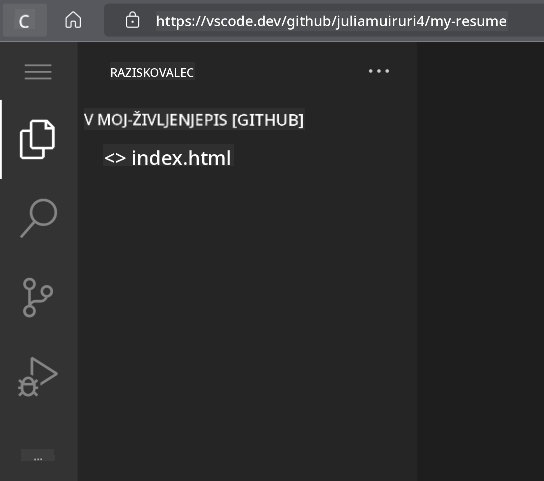

<!--
CO_OP_TRANSLATOR_METADATA:
{
  "original_hash": "2fcb983b8dbadadb1bc2e97f8c12dac5",
  "translation_date": "2025-08-27T22:54:48+00:00",
  "source_file": "8-code-editor/1-using-a-code-editor/assignment.md",
  "language_code": "sl"
}
-->
# Ustvarite spletno stran za življenjepis z uporabo vscode.dev

_Kako kul bi bilo, če bi vas zaposlovalec prosil za vaš življenjepis, vi pa bi mu poslali kar URL?_ 😎

## Cilji

Po tej nalogi boste znali:

- Ustvariti spletno stran za predstavitev svojega življenjepisa

### Predpogoji

1. GitHub račun. Obiščite [GitHub](https://github.com/) in ustvarite račun, če ga še nimate.

## Koraki

**Korak 1:** Ustvarite novo GitHub repozitorij in mu dajte ime `my-resume`.

**Korak 2:** V svojem repozitoriju ustvarite datoteko `index.html`. Na github.com bomo dodali vsaj eno datoteko, saj praznega repozitorija ni mogoče odpreti v vscode.dev.

Kliknite povezavo `creating a new file`, vnesite ime `index.html` in izberite gumb `Commit new file`.


**Korak 3:** Odprite [VSCode.dev](https://vscode.dev) in izberite gumb `Open Remote Repository`.

Kopirajte URL repozitorija, ki ste ga pravkar ustvarili za svojo spletno stran življenjepisa, in ga prilepite v vnosno polje:

_Zamenjajte `your-username` z vašim GitHub uporabniškim imenom._

```
https://github.com/your-username/my-resume
```

✅ Če je bilo uspešno, boste videli svoj projekt in datoteko index.html odprto v urejevalniku besedila v brskalniku.



**Korak 4:** Odprite datoteko `index.html`, prilepite spodnjo kodo v območje kode in shranite.

<details>
    <summary><b>HTML koda, ki je odgovorna za vsebino vaše spletne strani življenjepisa.</b></summary>
    
        <html>

            <head>
                <link href="style.css" rel="stylesheet">
                <link rel="stylesheet" href="https://cdnjs.cloudflare.com/ajax/libs/font-awesome/5.15.4/css/all.min.css">
                <title>Vaše ime gre sem!</title>
            </head>
            <body>
                <header id="header">
                    <!-- glava življenjepisa z vašim imenom in nazivom -->
                    <h1>Vaše ime gre sem!</h1>
                    <hr>
                    Vaša vloga!
                    <hr>
                </header>
                <main>
                    <article id="mainLeft">
                        <section>
                            <h2>KONTAKT</h2>
                            <!-- kontaktni podatki, vključno s socialnimi omrežji -->
                            <p>
                                <i class="fa fa-envelope" aria-hidden="true"></i>
                                <a href="mailto:username@domain.top-level domain">Vnesite svoj e-poštni naslov tukaj</a>
                            </p>
                            <p>
                                <i class="fab fa-github" aria-hidden="true"></i>
                                <a href="github.com/yourGitHubUsername">Vnesite svoje uporabniško ime tukaj!</a>
                            </p>
                            <p>
                                <i class="fab fa-linkedin" aria-hidden="true"></i>
                                <a href="linkedin.com/yourLinkedInUsername">Vnesite svoje uporabniško ime tukaj!</a>
                            </p>
                        </section>
                        <section>
                            <h2>SPRETNOSTI</h2>
                            <!-- vaše spretnosti -->
                            <ul>
                                <li>Spretnost 1!</li>
                                <li>Spretnost 2!</li>
                                <li>Spretnost 3!</li>
                                <li>Spretnost 4!</li>
                            </ul>
                        </section>
                        <section>
                            <h2>IZOBRAZBA</h2>
                            <!-- vaša izobrazba -->
                            <h3>Vnesite svoj študij tukaj!</h3>
                            <p>
                                Vnesite svojo izobraževalno ustanovo tukaj!
                            </p>
                            <p>
                                Začetek - Konec
                            </p>
                        </section>            
                    </article>
                    <article id="mainRight">
                        <section>
                            <h2>O MENI</h2>
                            <!-- o vas -->
                            <p>Vnesite nekaj o sebi!</p>
                        </section>
                        <section>
                            <h2>DELOVNE IZKUŠNJE</h2>
                            <!-- vaše delovne izkušnje -->
                            <h3>Delovno mesto</h3>
                            <p>
                                Ime organizacije gre sem | Začetni mesec – Končni mesec
                            </p>
                            <ul>
                                    <li>Naloga 1 - Napišite, kaj ste počeli!</li>
                                    <li>Naloga 2 - Napišite, kaj ste počeli!</li>
                                    <li>Napišite rezultate/vpliv vašega prispevka</li>
                                    
                            </ul>
                            <h3>Delovno mesto 2</h3>
                            <p>
                                Ime organizacije gre sem | Začetni mesec – Končni mesec
                            </p>
                            <ul>
                                    <li>Naloga 1 - Napišite, kaj ste počeli!</li>
                                    <li>Naloga 2 - Napišite, kaj ste počeli!</li>
                                    <li>Napišite rezultate/vpliv vašega prispevka</li>
                                    
                            </ul>
                        </section>
                    </article>
                </main>
            </body>
        </html>
</details>

Dodajte podrobnosti svojega življenjepisa, da zamenjate _nadomestno besedilo_ v HTML kodi.

**Korak 5:** Premaknite kazalec na mapo My-Resume, kliknite ikono `New File ...` in ustvarite 2 novi datoteki v svojem projektu: `style.css` in `codeswing.json`.

**Korak 6:** Odprite datoteko `style.css`, prilepite spodnjo kodo in shranite.

<details>
        <summary><b>CSS koda za oblikovanje postavitve strani.</b></summary>
            
            body {
                font-family: 'Segoe UI', Tahoma, Geneva, Verdana, sans-serif;
                font-size: 16px;
                max-width: 960px;
                margin: auto;
            }
            h1 {
                font-size: 3em;
                letter-spacing: .6em;
                padding-top: 1em;
                padding-bottom: 1em;
            }

            h2 {
                font-size: 1.5em;
                padding-bottom: 1em;
            }

            h3 {
                font-size: 1em;
                padding-bottom: 1em;
            }
            main { 
                display: grid;
                grid-template-columns: 40% 60%;
                margin-top: 3em;
            }
            header {
                text-align: center;
                margin: auto 2em;
            }

            section {
                margin: auto 1em 4em 2em;
            }

            i {
                margin-right: .5em;
            }

            p {
                margin: .2em auto
            }

            hr {
                border: none;
                background-color: lightgray;
                height: 1px;
            }

            h1, h2, h3 {
                font-weight: 100;
                margin-bottom: 0;
            }
            #mainLeft {
                border-right: 1px solid lightgray;
            }
            
</details>

**Korak 6:** Odprite datoteko `codeswing.json`, prilepite spodnjo kodo in shranite.

    {
    "scripts": [],
    "styles": []
    }

**Korak 7:** Namestite razširitev `Codeswing`, da si ogledate spletno stran življenjepisa na območju kode.

Kliknite ikono _`Extensions`_ na orodni vrstici in vnesite Codeswing. Kliknite _modri gumb za namestitev_ na razširjeni orodni vrstici ali uporabite gumb za namestitev, ki se prikaže na območju kode, ko izberete razširitev za nalaganje dodatnih informacij. Takoj po namestitvi razširitve opazujte spremembe v svojem projektu 😃.


To je tisto, kar boste videli na zaslonu po namestitvi razširitve.


Če ste zadovoljni s spremembami, ki ste jih naredili, premaknite kazalec na mapo `Changes` in kliknite gumb `+`, da pripravite spremembe.

Vnesite sporočilo za commit _(Opis spremembe, ki ste jo naredili v projektu)_ in potrdite svoje spremembe s klikom na `check`. Ko končate z delom na projektu, izberite ikono hamburger menija v zgornjem levem kotu, da se vrnete v repozitorij na GitHubu.

Čestitke 🎉 Pravkar ste ustvarili svojo spletno stran življenjepisa z uporabo vscode.dev v nekaj korakih.

## 🚀 Izziv

Odprite oddaljeni repozitorij, za katerega imate dovoljenja za urejanje, in posodobite nekaj datotek. Nato poskusite ustvariti novo vejo s svojimi spremembami in ustvariti Pull Request.

## Pregled in samostojno učenje

Preberite več o [VSCode.dev](https://code.visualstudio.com/docs/editor/vscode-web?WT.mc_id=academic-0000-alfredodeza) in nekaterih njegovih drugih funkcijah.

---

**Omejitev odgovornosti**:  
Ta dokument je bil preveden z uporabo storitve za prevajanje z umetno inteligenco [Co-op Translator](https://github.com/Azure/co-op-translator). Čeprav si prizadevamo za natančnost, vas prosimo, da upoštevate, da lahko avtomatizirani prevodi vsebujejo napake ali netočnosti. Izvirni dokument v njegovem izvirnem jeziku je treba obravnavati kot avtoritativni vir. Za ključne informacije priporočamo profesionalni človeški prevod. Ne prevzemamo odgovornosti za morebitna napačna razumevanja ali napačne interpretacije, ki bi nastale zaradi uporabe tega prevoda.