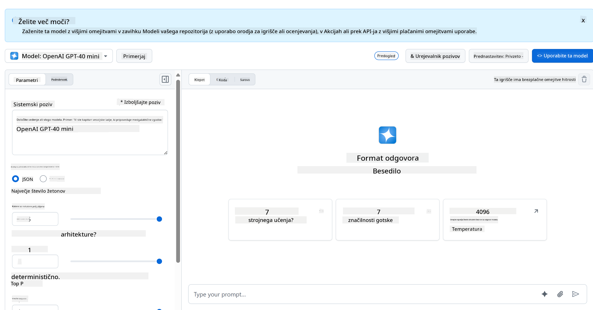

<!--
CO_OP_TRANSLATOR_METADATA:
{
  "original_hash": "11cf36165c243947b6cd85b88cf6faa6",
  "translation_date": "2025-09-01T17:03:27+00:00",
  "source_file": "9-chat-project/README.md",
  "language_code": "sl"
}
-->
# Projekt klepet

Ta projekt klepeta prikazuje, kako zgraditi klepetalnega asistenta z uporabo GitHub Modelov.

Tako izgleda končni projekt:


Nekaj konteksta: gradnja klepetalnih asistentov z generativno umetno inteligenco je odličen način za začetek učenja o umetni inteligenci. V tej lekciji se boste naučili, kako integrirati generativno umetno inteligenco v spletno aplikacijo. Začnimo.

## Povezovanje z generativno umetno inteligenco

Za zaledje uporabljamo GitHub Modele. To je odlična storitev, ki omogoča uporabo umetne inteligence brezplačno. Obiščite njihov "playground" in pridobite kodo, ki ustreza vašemu izbranemu jeziku za zaledje. Tako izgleda na [GitHub Models Playground](https://github.com/marketplace/models/azure-openai/gpt-4o-mini/playground).



Kot smo rekli, izberite zavihek "Code" in vaš izbrani runtime.


### Uporaba Pythona

V tem primeru izberemo Python, kar pomeni, da uporabimo to kodo:

```python
"""Run this model in Python

> pip install openai
"""
import os
from openai import OpenAI

# To authenticate with the model you will need to generate a personal access token (PAT) in your GitHub settings. 
# Create your PAT token by following instructions here: https://docs.github.com/en/authentication/keeping-your-account-and-data-secure/managing-your-personal-access-tokens
client = OpenAI(
    base_url="https://models.github.ai/inference",
    api_key=os.environ["GITHUB_TOKEN"],
)

response = client.chat.completions.create(
    messages=[
        {
            "role": "system",
            "content": "",
        },
        {
            "role": "user",
            "content": "What is the capital of France?",
        }
    ],
    model="openai/gpt-4o-mini",
    temperature=1,
    max_tokens=4096,
    top_p=1
)

print(response.choices[0].message.content)
```

To kodo nekoliko očistimo, da bo bolj uporabna:

```python
def call_llm(prompt: str, system_message: str):
    response = client.chat.completions.create(
        messages=[
            {
                "role": "system",
                "content": system_message,
            },
            {
                "role": "user",
                "content": prompt,
            }
        ],
        model="openai/gpt-4o-mini",
        temperature=1,
        max_tokens=4096,
        top_p=1
    )

    return response.choices[0].message.content
```

S funkcijo `call_llm` lahko zdaj podamo poziv in sistemski poziv, funkcija pa vrne rezultat.

### Prilagoditev AI asistenta

Če želite prilagoditi AI asistenta, lahko določite, kako naj se obnaša, tako da izpolnite sistemski poziv, kot je prikazano:

```python
call_llm("Tell me about you", "You're Albert Einstein, you only know of things in the time you were alive")
```

## Izpostavite ga prek spletnega API-ja

Odlično, AI del je končan, poglejmo, kako ga lahko integriramo v spletni API. Za spletni API smo izbrali Flask, vendar je primeren kateri koli spletni okvir. Tukaj je koda:

### Uporaba Pythona

```python
# api.py
from flask import Flask, request, jsonify
from llm import call_llm
from flask_cors import CORS

app = Flask(__name__)
CORS(app)   # *   example.com

@app.route("/", methods=["GET"])
def index():
    return "Welcome to this API. Call POST /hello with 'message': 'my message' as JSON payload"


@app.route("/hello", methods=["POST"])
def hello():
    # get message from request body  { "message": "do this taks for me" }
    data = request.get_json()
    message = data.get("message", "")

    response = call_llm(message, "You are a helpful assistant.")
    return jsonify({
        "response": response
    })

if __name__ == "__main__":
    app.run(host="0.0.0.0", port=5000)
```

Tukaj ustvarimo Flask API in definiramo privzeto pot "/" ter "/chat". Slednja je namenjena naši sprednji strani, da ji posreduje vprašanja.

Za integracijo *llm.py* potrebujemo naslednje:

- Uvoz funkcije `call_llm`:

   ```python
   from llm import call_llm
   from flask import Flask, request
   ```

- Klic funkcije iz poti "/chat":

   ```python
   @app.route("/hello", methods=["POST"])
   def hello():
      # get message from request body  { "message": "do this taks for me" }
      data = request.get_json()
      message = data.get("message", "")

      response = call_llm(message, "You are a helpful assistant.")
      return jsonify({
         "response": response
      })
   ```

   Tukaj razčlenimo dohodno zahtevo, da pridobimo lastnost `message` iz JSON telesa. Nato pokličemo LLM s tem klicem:

   ```python
   response = call_llm(message, "You are a helpful assistant")

   # return the response as JSON
   return jsonify({
      "response": response 
   })
   ```

Odlično, zdaj smo naredili, kar je potrebno.

## Konfigurirajte Cors

Omeniti moramo, da smo nastavili nekaj, kot je CORS (deljenje virov med različnimi izvorami). To pomeni, da ker bosta naše zaledje in sprednje strani delovali na različnih vratih, moramo omogočiti sprednji strani, da kliče zaledje.

### Uporaba Pythona

V datoteki *api.py* je kos kode, ki to nastavi:

```python
from flask_cors import CORS

app = Flask(__name__)
CORS(app)   # *   example.com
```

Trenutno je nastavljeno, da dovoljuje "*", kar pomeni vse izvore, kar je nekoliko nevarno. To bi morali omejiti, ko gremo v produkcijo.

## Zaženite svoj projekt

Za zagon projekta morate najprej zagnati zaledje in nato sprednjo stran.

### Uporaba Pythona

Imamo *llm.py* in *api.py*, kako lahko to deluje z zaledjem? Tukaj sta dve stvari, ki ju moramo narediti:

- Namestite odvisnosti:

   ```sh
   cd backend
   python -m venv venv
   source ./venv/bin/activate

   pip install openai flask flask-cors openai
   ```

- Zaženite API

   ```sh
   python api.py
   ```

   Če ste v Codespaces, morate iti na "Ports" v spodnjem delu urejevalnika, klikniti z desno tipko miške in izbrati "Port Visibility" ter nato "Public".

### Delo na sprednji strani

Zdaj, ko imamo API, ki deluje, ustvarimo sprednjo stran za to. Minimalno sprednjo stran bomo postopoma izboljšali. V mapi *frontend* ustvarite naslednje:

```text
backend/
frontend/
index.html
app.js
styles.css
```

Začnimo z **index.html**:

```html
<html>
    <head>
        <link rel="stylesheet" href="styles.css">
    </head>
    <body>
      <form>
        <textarea id="messages"></textarea>
        <input id="input" type="text" />
        <button type="submit" id="sendBtn">Send</button>  
      </form>  
      <script src="app.js" />
    </body>
</html>    
```

Zgornje je absolutni minimum, ki ga potrebujete za podporo oknu za klepet, saj vsebuje besedilno polje, kjer bodo prikazana sporočila, vnosno polje za vnos sporočila in gumb za pošiljanje sporočila zaledju. Poglejmo JavaScript v datoteki *app.js*.

**app.js**

```js
// app.js

(function(){
  // 1. set up elements  
  const messages = document.getElementById("messages");
  const form = document.getElementById("form");
  const input = document.getElementById("input");

  const BASE_URL = "change this";
  const API_ENDPOINT = `${BASE_URL}/hello`;

  // 2. create a function that talks to our backend
  async function callApi(text) {
    const response = await fetch(API_ENDPOINT, {
      method: "POST",
      headers: { "Content-Type": "application/json" },
      body: JSON.stringify({ message: text })
    });
    let json = await response.json();
    return json.response;
  }

  // 3. add response to our textarea
  function appendMessage(text, role) {
    const el = document.createElement("div");
    el.className = `message ${role}`;
    el.innerHTML = text;
    messages.appendChild(el);
  }

  // 4. listen to submit events
  form.addEventListener("submit", async(e) => {
    e.preventDefault();
   // someone clicked the button in the form
   
   // get input
   const text = input.value.trim();

   appendMessage(text, "user")

   // reset it
   input.value = '';

   const reply = await callApi(text);

   // add to messages
   appendMessage(reply, "assistant");

  })
})();
```

Pojdimo skozi kodo po odsekih:

- 1) Tukaj pridobimo referenco na vse elemente, na katere se bomo kasneje sklicevali v kodi.
- 2) V tem odseku ustvarimo funkcijo, ki uporablja vgrajeno metodo `fetch` za klic našega zaledja.
- 3) `appendMessage` pomaga dodajati odgovore, kot tudi sporočila, ki jih vnesete kot uporabnik.
- 4) Tukaj poslušamo dogodek "submit", preberemo vnosno polje, postavimo uporabnikovo sporočilo v besedilno polje, pokličemo API in prikažemo odgovor v besedilnem polju.

Poglejmo še oblikovanje, tukaj lahko resnično ustvarite videz po svoji želji, vendar tukaj so nekateri predlogi:

**styles.css**

```
.message {
    background: #222;
    box-shadow: 0 0 0 10px orange;
    padding: 10px:
    margin: 5px;
}

.message.user {
    background: blue;
}

.message.assistant {
    background: grey;
} 
```

S temi tremi razredi boste oblikovali sporočila različno, odvisno od tega, ali prihajajo od asistenta ali od vas kot uporabnika. Če želite navdih, si oglejte mapo `solution/frontend/styles.css`.

### Sprememba osnovnega URL-ja

Tukaj je ena stvar, ki je nismo nastavili, in to je `BASE_URL`. Ta ni znan, dokler vaše zaledje ni zagnano. Za nastavitev:

- Če API zaženete lokalno, bi moral biti nastavljen na nekaj, kot je `http://localhost:5000`.
- Če ga zaženete v Codespaces, bi moral izgledati nekaj, kot je "[name]app.github.dev".

## Naloga

Ustvarite svojo mapo *project* z vsebino, kot je prikazano:

```text
project/
  frontend/
    index.html
    app.js
    styles.css
  backend/
    ...
```

Kopirajte vsebino iz zgoraj navedenih navodil, vendar jo po želji prilagodite.

## Rešitev

[Rešitev](./solution/README.md)

## Bonus

Poskusite spremeniti osebnost AI asistenta.

### Za Python

Ko kličete `call_llm` v *api.py*, lahko spremenite drugi argument v kar želite, na primer:

```python
call_llm(message, "You are Captain Picard")
```

### Sprednja stran

Spremenite tudi CSS in besedilo po svoji želji, torej naredite spremembe v *index.html* in *styles.css*.

## Povzetek

Odlično, naučili ste se, kako od začetka ustvariti osebnega asistenta z uporabo umetne inteligence. To smo storili z uporabo GitHub Modelov, zaledja v Pythonu in sprednje strani v HTML, CSS in JavaScript.

## Nastavitev s Codespaces

- Pojdite na: [Repozitorij Web Dev For Beginners](https://github.com/microsoft/Web-Dev-For-Beginners)
- Ustvarite iz predloge (prepričajte se, da ste prijavljeni v GitHub) v zgornjem desnem kotu:

    

- Ko ste v svojem repozitoriju, ustvarite Codespace:

    

    To bi moralo zagnati okolje, s katerim lahko zdaj delate.

---

**Omejitev odgovornosti**:  
Ta dokument je bil preveden z uporabo storitve za prevajanje z umetno inteligenco [Co-op Translator](https://github.com/Azure/co-op-translator). Čeprav si prizadevamo za natančnost, vas prosimo, da upoštevate, da lahko avtomatizirani prevodi vsebujejo napake ali netočnosti. Izvirni dokument v njegovem maternem jeziku je treba obravnavati kot avtoritativni vir. Za ključne informacije priporočamo profesionalni človeški prevod. Ne prevzemamo odgovornosti za morebitna nesporazume ali napačne razlage, ki bi nastale zaradi uporabe tega prevoda.