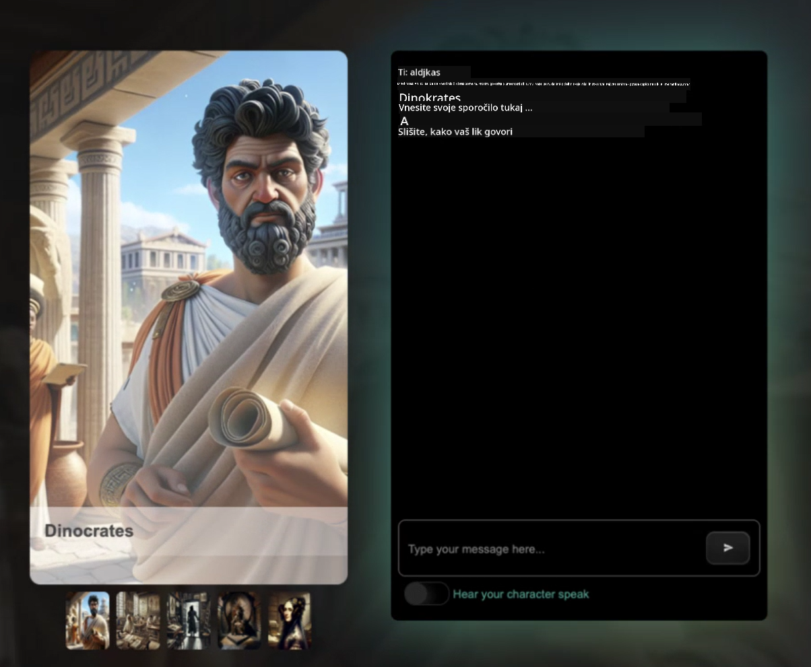

<!--
CO_OP_TRANSLATOR_METADATA:
{
  "original_hash": "8b9d0562ea649b6012d1a67acc630681",
  "translation_date": "2025-10-25T00:16:57+00:00",
  "source_file": "README.md",
  "language_code": "sl"
}
-->
[](https://github.com/microsoft/Web-Dev-For-Beginners/blob/master/LICENSE)
[](https://GitHub.com/microsoft/Web-Dev-For-Beginners/graphs/contributors/)
[](https://GitHub.com/microsoft/Web-Dev-For-Beginners/issues/)
[](https://GitHub.com/microsoft/Web-Dev-For-Beginners/pulls/)
[](http://makeapullrequest.com)

[](https://GitHub.com/microsoft/Web-Dev-For-Beginners/watchers/)
[](https://GitHub.com/microsoft/Web-Dev-For-Beginners/network/)
[](https://GitHub.com/microsoft/Web-Dev-For-Beginners/stargazers/)

[](https://discord.gg/zxKYvhSnVp?WT.mc_id=academic-000002-leestott)

# Spletni razvoj za začetnike - učni načrt

Naučite se osnov spletnega razvoja z našim 12-tedenskim celovitim tečajem, ki ga ponujajo Microsoftovi Cloud Advocates. Vsaka od 24 lekcij se poglobi v JavaScript, CSS in HTML skozi praktične projekte, kot so terariji, razširitve brskalnika in vesoljske igre. Sodelujte v kvizih, razpravah in praktičnih nalogah. Izboljšajte svoje veščine in optimizirajte zadrževanje znanja z našo učinkovito projektno usmerjeno pedagogiko. Začnite svojo pot kodiranja že danes!

Pridružite se skupnosti Azure AI Foundry Discord

[](https://discord.com/invite/ByRwuEEgH4)

Sledite tem korakom, da začnete uporabljati te vire:
1. **Forkajte repozitorij**: Kliknite [](https://GitHub.com/microsoft/Web-Dev-For-Beginners/fork)
2. **Klonirajte repozitorij**:   `git clone https://github.com/microsoft/Web-Dev-For-Beginners.git`
3. [**Pridružite se Azure AI Foundry Discord in spoznajte strokovnjake ter druge razvijalce**](https://discord.com/invite/ByRwuEEgH4)

### 🌐 Podpora za več jezikov

#### Podprto prek GitHub Action (samodejno in vedno posodobljeno)

[Arabščina](../ar/README.md) | [Bengalščina](../bn/README.md) | [Bolgarščina](../bg/README.md) | [Burmanščina (Mjanmar)](../my/README.md) | [Kitajščina (poenostavljena)](../zh/README.md) | [Kitajščina (tradicionalna, Hong Kong)](../hk/README.md) | [Kitajščina (tradicionalna, Macau)](../mo/README.md) | [Kitajščina (tradicionalna, Tajvan)](../tw/README.md) | [Hrvaščina](../hr/README.md) | [Češčina](../cs/README.md) | [Danščina](../da/README.md) | [Nizozemščina](../nl/README.md) | [Estonščina](../et/README.md) | [Finščina](../fi/README.md) | [Francoščina](../fr/README.md) | [Nemščina](../de/README.md) | [Grščina](../el/README.md) | [Hebrejščina](../he/README.md) | [Hindijščina](../hi/README.md) | [Madžarščina](../hu/README.md) | [Indonezijščina](../id/README.md) | [Italijanščina](../it/README.md) | [Japonščina](../ja/README.md) | [Korejščina](../ko/README.md) | [Litovščina](../lt/README.md) | [Malajščina](../ms/README.md) | [Maratščina](../mr/README.md) | [Nepalščina](../ne/README.md) | [Norveščina](../no/README.md) | [Perzijščina (Farsi)](../fa/README.md) | [Poljščina](../pl/README.md) | [Portugalščina (Brazilija)](../br/README.md) | [Portugalščina (Portugalska)](../pt/README.md) | [Pandžabščina (Gurmukhi)](../pa/README.md) | [Romunščina](../ro/README.md) | [Ruščina](../ru/README.md) | [Srbščina (cirilica)](../sr/README.md) | [Slovaščina](../sk/README.md) | [Slovenščina](./README.md) | [Španščina](../es/README.md) | [Svahili](../sw/README.md) | [Švedščina](../sv/README.md) | [Tagalog (Filipino)](../tl/README.md) | [Tamilščina](../ta/README.md) | [Tajščina](../th/README.md) | [Turščina](../tr/README.md) | [Ukrajinščina](../uk/README.md) | [Urdu](../ur/README.md) | [Vietnamščina](../vi/README.md)

**Če želite dodati dodatne prevode, so podprti jeziki navedeni [tukaj](https://github.com/Azure/co-op-translator/blob/main/getting_started/supported-languages.md)**

[](https://open.vscode.dev/microsoft/Web-Dev-For-Beginners)

#### 🧑‍🎓 _Ste študent?_

Obiščite [**stran Student Hub**](https://docs.microsoft.com/learn/student-hub/?WT.mc_id=academic-77807-sagibbon), kjer boste našli vire za začetnike, študentske pakete in celo načine za pridobitev brezplačnega certifikata. To je stran, ki jo želite shraniti med zaznamke in jo občasno preveriti, saj vsebino mesečno posodabljamo.

### 📣 Obvestilo - Novi izzivi z načinom GitHub Copilot Agent za dokončanje!

Dodali smo nov izziv, poiščite "GitHub Copilot Agent Challenge 🚀" v večini poglavij. To je nov izziv, ki ga lahko dokončate z uporabo GitHub Copilot in načina Agent. Če še niste uporabljali načina Agent, ta omogoča ne le generiranje besedila, ampak tudi ustvarjanje in urejanje datotek, izvajanje ukazov in še več.

### 📣 Obvestilo - _Nov projekt za izdelavo z generativno umetno inteligenco_

Pravkar dodan nov projekt AI Assistant, preverite [projekt](./09-chat-project/README.md)

### 📣 Obvestilo - _Nov učni načrt_ o generativni umetni inteligenci za JavaScript je bil pravkar objavljen

Ne zamudite našega novega učnega načrta o generativni umetni inteligenci!

Obiščite [https://aka.ms/genai-js-course](https://aka.ms/genai-js-course) za začetek!


- Lekcije, ki pokrivajo vse od osnov do RAG.
- Interakcija z zgodovinskimi osebnostmi z uporabo GenAI in naše spremljevalne aplikacije.
- Zabavna in privlačna zgodba, potovali boste skozi čas!



Vsaka lekcija vključuje nalogo za dokončanje, preverjanje znanja in izziv, ki vas vodi pri učenju tem, kot so:
- Oblikovanje pozivov in inženiring pozivov
- Generiranje aplikacij za besedilo in slike
- Iskalne aplikacije

Obiščite [https://aka.ms/genai-js-course](../../[https:/aka.ms/genai-js-course) za začetek!


## 🌱 Začetek

> **Učitelji**, [vključili smo nekaj predlogov](for-teachers.md) o tem, kako uporabiti ta učni načrt. Veseli bomo vaših povratnih informacij [v našem forumu za razprave](https://github.com/microsoft/Web-Dev-For-Beginners/discussions/categories/teacher-corner)!

**[Učenci](https://aka.ms/student-page/?WT.mc_id=academic-77807-sagibbon)**, za vsako lekcijo začnite s kvizom pred predavanjem, nadaljujte z branjem gradiva za predavanje, dokončajte različne aktivnosti in preverite svoje razumevanje s kvizom po predavanju.

Za izboljšanje učne izkušnje se povežite s svojimi vrstniki in skupaj delajte na projektih! Razprave so dobrodošle v našem [forumu za razprave](https://github.com/microsoft/Web-Dev-For-Beginners/discussions), kjer bo naša ekipa moderatorjev na voljo za odgovore na vaša vprašanja.

Za nadaljnje izobraževanje toplo priporočamo raziskovanje [Microsoft Learn](https://learn.microsoft.com/users/wirelesslife/collections/p1ddcy5jwy0jkm?WT.mc_id=academic-77807-sagibbon) za dodatno študijsko gradivo.

### 📋 Nastavitev vašega okolja

Ta učni načrt ima razvojno okolje, ki je pripravljeno za uporabo! Ko začnete, se lahko odločite za izvajanje učnega načrta v [Codespace](https://github.com/features/codespaces/) (_okolje, ki temelji na brskalniku, brez potrebnih namestitev_), ali lokalno na vašem računalniku z uporabo urejevalnika besedila, kot je [Visual Studio Code](https://code.visualstudio.com/?WT.mc_id=academic-77807-sagibbon).

#### Ustvarite svoj repozitorij
Da boste lahko enostavno shranili svoje delo, priporočamo, da ustvarite svojo kopijo tega repozitorija. To lahko storite s klikom na gumb **Use this template** na vrhu strani. To bo ustvarilo nov repozitorij v vašem GitHub računu s kopijo učnega načrta.

Sledite tem korakom:
1. **Forkajte repozitorij**: Kliknite na gumb "Fork" v zgornjem desnem kotu te strani.
2. **Klonirajte repozitorij**:   `git clone https://github.com/microsoft/Web-Dev-For-Beginners.git`

#### Izvajanje učnega načrta v Codespace

V svoji kopiji tega repozitorija, ki ste jo ustvarili, kliknite gumb **Code** in izberite **Open with Codespaces**. To bo ustvarilo nov Codespace, v katerem lahko delate.


#### Izvajanje učnega načrta lokalno na vašem računalniku

Za lokalno izvajanje tega učnega načrta na vašem računalniku boste potrebovali urejevalnik besedila, brskalnik in orodje za ukazno vrstico. Naša prva lekcija, [Uvod v programske jezike in orodja](../../1-getting-started-lessons/1-intro-to-programming-languages), vas bo vodila skozi različne možnosti za vsako od teh orodij, da izberete tisto, kar vam najbolj ustreza.

Naše priporočilo je, da uporabite [Visual Studio Code](https://code.visualstudio.com/?WT.mc_id=academic-77807-sagibbon) kot svoj urejevalnik, ki ima tudi vgrajen [Terminal](https://code.visualstudio.com/docs/terminal/basics/?WT.mc_id=academic-77807-sagibbon). Visual Studio Code lahko prenesete [tukaj](https://code.visualstudio.com/?WT.mc_id=academic-77807-sagibbon).

1. Klonirajte svoj repozitorij na svoj računalnik. To lahko storite s klikom na gumb **Code** in kopiranjem URL-ja:

    [CodeSpace](./images/createcodespace.png)

    Nato odprite [Terminal](https://code.visualstudio.com/docs/terminal/basics/?WT.mc_id=academic-77807-sagibbon) znotraj [Visual Studio Code](https://code.visualstudio.com/?WT.mc_id=academic-77807-sagibbon) in zaženite naslednji ukaz, pri čemer zamenjajte `<your-repository-url>` z URL-jem, ki ste ga pravkar kopirali:

    ```bash 
    git clone <your-repository-url>
    ```

2. Odprite mapo v Visual Studio Code. To lahko storite s klikom na **File** > **Open Folder** in izbiro mape, ki ste jo pravkar klonirali.

> Priporočene razširitve za Visual Studio Code:
>
> * [Live Server](https://marketplace.visualstudio.com/items?itemName=ritwickdey.LiveServer&WT.mc_id=academic-77807-sagibbon) - za predogled HTML strani znotraj Visual Studio Code
> * [Copilot](https://marketplace.visualstudio.com/items?itemName=GitHub.copilot&WT.mc_id=academic-77807-sagibbon) - za hitrejše pisanje kode

## 📂 Vsaka lekcija vključuje:

- neobvezno skico
- neobvezen dopolnilni video
- kviz za ogrevanje pred lekcijo
- pisno lekcijo
- za lekcije, ki temeljijo na projektih, vodnik po korakih za izdelavo projekta
- preverjanje znanja
- izziv
- dopolnilno branje
- nalogo
- [kviz po lekciji](https://ff-quizzes.netlify.app/web/)

> **Opomba o kvizih**: Vsi kvizi so v mapi Quiz-app, skupaj 48 kvizov, vsak s tremi vprašanji. Na voljo so [tukaj](https://ff-quizzes.netlify.app/web/), aplikacijo za kvize pa lahko zaženete lokalno ali jo namestite na Azure; sledite navodilom v mapi `quiz-app`.

## 🗃️ Lekcije

|     |                       Ime projekta                       |                            Naučene koncepti                             | Cilji učenja                                                                                                                 |                                                         Povezana lekcija                                                          |         Avtor          |
| :-: | :------------------------------------------------------: | :--------------------------------------------------------------------: | ----------------------------------------------------------------------------------------------------------------------------------- | :----------------------------------------------------------------------------------------------------------------------------: | :---------------------: |
| 01  |                     Začetek                      |           Uvod v programiranje in orodja za delo           | Naučite se osnov, ki so skupne večini programskih jezikov, ter o programski opremi, ki pomaga profesionalnim razvijalcem pri delu | [Uvod v programske jezike in orodja za delo](./1-getting-started-lessons/1-intro-to-programming-languages/README.md) |         Jasmine         |
| 02  |                     Začetek                      |             Osnove GitHuba, vključno z delom v ekipi             | Kako uporabljati GitHub v vašem projektu, kako sodelovati z drugimi na kodni bazi                                                    |                            [Uvod v GitHub](./1-getting-started-lessons/2-github-basics/README.md)                             |          Floor          |
| 03  |                     Začetek                      |                             Dostopnost                              | Naučite se osnov spletne dostopnosti                                                                                               |                       [Osnove dostopnosti](./1-getting-started-lessons/3-accessibility/README.md)                       |       Christopher       |
| 04  |                        Osnove JS                         |                         Podatkovni tipi v JavaScriptu                          | Osnove podatkovnih tipov v JavaScriptu                                                                                                 |                                       [Podatkovni tipi](./2-js-basics/1-data-types/README.md)                                        |         Jasmine         |
| 05  |                        Osnove JS                         |                         Funkcije in metode                          | Naučite se o funkcijah in metodah za upravljanje logičnega toka aplikacije                                                             |                              [Funkcije in metode](./2-js-basics/2-functions-methods/README.md)                               | Jasmine in Christopher |
| 06  |                        Osnove JS                         |                        Sprejemanje odločitev z JS                        | Naučite se ustvariti pogoje v vaši kodi z metodami za sprejemanje odločitev                                                           |                                 [Sprejemanje odločitev](./2-js-basics/3-making-decisions/README.md)                                  |         Jasmine         |
| 07  |                        Osnove JS                         |                            Tabele in zanke                            | Delo s podatki z uporabo tabel in zank v JavaScriptu                                                                                 |                                   [Tabele in zanke](./2-js-basics/4-arrays-loops/README.md)                                    |         Jasmine         |
| 08  |       [Terarij](./3-terrarium/solution/README.md)       |                            HTML v praksi                            | Ustvarite HTML za izdelavo spletnega terarija, osredotočite se na postavitev                                                         |                                 [Uvod v HTML](./3-terrarium/1-intro-to-html/README.md)                                 |           Jen           |
| 09  |       [Terarij](./3-terrarium/solution/README.md)       |                            CSS v praksi                             | Ustvarite CSS za oblikovanje spletnega terarija, osredotočite se na osnove CSS, vključno z odzivnim oblikovanjem                     |                                  [Uvod v CSS](./3-terrarium/2-intro-to-css/README.md)                                  |           Jen           |
| 10  |            [Terarij](./3-terrarium/solution/README.md)            |                 JavaScript zapiranja, manipulacija DOM                  | Ustvarite JavaScript za delovanje terarija kot vmesnika za povleci/spusti, osredotočite se na zapiranja in manipulacijo DOM             |                  [JavaScript zapiranja, manipulacija DOM](./3-terrarium/3-intro-to-DOM-and-closures/README.md)                   |           Jen           |
| 11  |          [Igra tipkanja](./4-typing-game/solution/README.md)          |                          Izdelava igre tipkanja                           | Naučite se uporabljati dogodke tipkovnice za upravljanje logike vaše JavaScript aplikacije                                                          |                                [Programiranje na podlagi dogodkov](./4-typing-game/typing-game/README.md)                                |       Christopher       |
| 12  | [Zeleni brskalniški dodatek](./5-browser-extension/solution/README.md) |                         Delo z brskalniki                          | Naučite se, kako delujejo brskalniki, njihovo zgodovino in kako pripraviti prve elemente brskalniškega dodatka                               |                               [O brskalnikih](./5-browser-extension/1-about-browsers/README.md)                                |           Jen           |
| 13  | [Zeleni brskalniški dodatek](./5-browser-extension/solution/README.md) | Izdelava obrazca, klicanje API-ja in shranjevanje spremenljivk v lokalni pomnilnik | Ustvarite JavaScript elemente vašega brskalniškega dodatka za klicanje API-ja z uporabo spremenljivk, shranjenih v lokalnem pomnilniku                      |                [API-ji, obrazci in lokalni pomnilnik](./5-browser-extension/2-forms-browsers-local-storage/README.md)                 |           Jen           |
| 14  | [Zeleni brskalniški dodatek](./5-browser-extension/solution/README.md) |          Procesi v ozadju brskalnika, spletna zmogljivost          | Uporabite procese v ozadju brskalnika za upravljanje ikone dodatka; naučite se o spletni zmogljivosti in nekaterih optimizacijah   |             [Naloge v ozadju in zmogljivost](./5-browser-extension/3-background-tasks-and-performance/README.md)              |           Jen           |
| 15  |           [Vesoljska igra](./6-space-game/solution/README.md)           |             Naprednejši razvoj iger z JavaScriptom             | Naučite se o dedovanju z uporabo razredov in kompozicije ter o vzorcu Pub/Sub, kot pripravo na izdelavo igre              |                      [Uvod v napredni razvoj iger](./6-space-game/1-introduction/README.md)                       |          Chris          |
| 16  |           [Vesoljska igra](./6-space-game/solution/README.md)           |                           Risanje na platno                            | Naučite se o API-ju Canvas, ki se uporablja za risanje elementov na zaslon                                                                       |                                [Risanje na platno](./6-space-game/2-drawing-to-canvas/README.md)                                |          Chris          |
| 17  |           [Vesoljska igra](./6-space-game/solution/README.md)           |                   Premikanje elementov po zaslonu                    | Odkrijte, kako lahko elementi pridobijo gibanje z uporabo kartezičnih koordinat in API-ja Canvas                                            |                           [Premikanje elementov](./6-space-game/3-moving-elements-around/README.md)                           |          Chris          |
| 18  |           [Vesoljska igra](./6-space-game/solution/README.md)           |                          Zaznavanje trkov                           | Naredite, da se elementi zaletijo in medsebojno reagirajo z uporabo tipk ter zagotovite funkcijo ohlajanja za boljšo zmogljivost igre    |                              [Zaznavanje trkov](./6-space-game/4-collision-detection/README.md)                              |          Chris          |
| 19  |           [Vesoljska igra](./6-space-game/solution/README.md)           |                             Beleženje točk                              | Izvajajte matematične izračune na podlagi stanja igre in zmogljivosti                                                                |                                    [Beleženje točk](./6-space-game/5-keeping-score/README.md)                                    |          Chris          |
| 20  |           [Vesoljska igra](./6-space-game/solution/README.md)           |                     Končanje in ponovni zagon igre                     | Naučite se o končanju in ponovnem zagonu igre, vključno s čiščenjem sredstev in ponastavitvijo vrednosti spremenljivk                              |                                [Pogoji za končanje](./6-space-game/6-end-condition/README.md)                                 |          Chris          |
| 21  |         [Bančna aplikacija](./7-bank-project/solution/README.md)          |                 HTML predloge in poti v spletni aplikaciji                 | Naučite se ustvariti strukturo večstranske arhitekture spletne strani z uporabo poti in HTML predlog                             |                            [HTML predloge in poti](./7-bank-project/1-template-route/README.md)                             |          Yohan          |
| 22  |         [Bančna aplikacija](./7-bank-project/solution/README.md)          |                  Izdelava obrazca za prijavo in registracijo                   | Naučite se izdelave obrazcev in obdelave rutine za preverjanje veljavnosti                                                                          |                                           [Obrazci](./7-bank-project/2-forms/README.md)                                           |          Yohan          |
| 23  |         [Bančna aplikacija](./7-bank-project/solution/README.md)          |                   Metode pridobivanja in uporabe podatkov                   | Kako podatki tečejo v vašo aplikacijo in iz nje, kako jih pridobiti, shraniti in odstraniti                                                 |                                            [Podatki](./7-bank-project/3-data/README.md)                                            |          Yohan          |
| 24  |         [Bančna aplikacija](./7-bank-project/solution/README.md)          |                      Koncepti upravljanja stanja                      | Naučite se, kako vaša aplikacija ohranja stanje in kako ga programersko upravljati                                                              |                                [Upravljanje stanja](./7-bank-project/4-state-management/README.md)                                |          Yohan          |
| 25 | [Brskalnik/VScode koda](../../8-code-editor) | Delo z VScode | Naučite se uporabljati urejevalnik kode| [Uporaba urejevalnika kode VScode](./8-code-editor/1-using-a-code-editor/README.md) | Chris |
| 26 | [AI asistenti](./9-chat-project/README.md) | Delo z AI | Naučite se izdelati svojega AI asistenta | [Projekt AI asistent](./9-chat-project/README.md) | Chris |

## 🏫 Pedagogika

Naš učni načrt je zasnovan na dveh ključnih pedagoških načelih:
* učenje na podlagi projektov
* pogosti kvizi

Program uči osnove JavaScripta, HTML-ja in CSS-ja ter najnovejša orodja in tehnike, ki jih uporabljajo sodobni spletni razvijalci. Študenti bodo imeli priložnost pridobiti praktične izkušnje z izdelavo igre tipkanja, virtualnega terarija, okolju prijaznega brskalniškega dodatka, igre v slogu vesoljskih napadalcev in bančne aplikacije za podjetja. Do konca serije bodo študenti pridobili trdno razumevanje spletnega razvoja.

> 🎓 Prve lekcije v tem učnem načrtu lahko opravite kot [učni program](https://docs.microsoft.com/learn/paths/web-development-101/?WT.mc_id=academic-77807-sagibbon) na Microsoft Learn!

Z zagotavljanjem, da vsebina ustreza projektom, je proces za študente bolj privlačen, hkrati pa se poveča tudi zadrževanje konceptov. Poleg tega smo pripravili več uvodnih lekcij o osnovah JavaScripta za predstavitev konceptov, ki so povezane z videoposnetki iz zbirke "[Beginners Series to: JavaScript](https://channel9.msdn.com/Series/Beginners-Series-to-JavaScript/?WT.mc_id=academic-77807-sagibbon)", katere avtorji so prispevali k temu učnemu načrtu.

Poleg tega nizkocenovni kviz pred predavanjem usmeri pozornost študenta na učenje teme, medtem ko drugi kviz po predavanju zagotavlja nadaljnje zadrževanje znanja. Ta učni načrt je bil zasnovan tako, da je prilagodljiv in zabaven ter ga je mogoče opraviti v celoti ali delno. Projekti se začnejo majhni in postajajo vse bolj zapleteni do konca 12-tedenskega cikla.

Čeprav smo namerno izpustili uvajanje JavaScript ogrodij, da bi se osredotočili na osnovne veščine, potrebne za spletne razvijalce pred sprejetjem ogrodja, bi bil dober naslednji korak po zaključku tega učnega načrta učenje o Node.js prek druge zbirke videoposnetkov: "[Beginner Series to: Node.js](https://channel9.msdn.com/Series/Beginners-Series-to-Nodejs/?WT.mc_id=academic-77807-sagibbon)".

> Obiščite naše smernice [Kodeks ravnanja](CODE_OF_CONDUCT.md) in [Prispevanje](CONTRIBUTING.md). Veseli bomo vaših konstruktivnih povratnih informacij!


## 🧭 Dostop brez povezave

To dokumentacijo lahko zaženete brez povezave z uporabo [Docsify](https://docsify.js.org/#/). Forkajte to repozitorij, [namestite Docsify](https://docsify.js.org/#/quickstart) na vaš lokalni računalnik, nato pa v korenski mapi te repozitorije vnesite `docsify serve`. Spletna stran bo na voljo na portu 3000 na vašem lokalnem strežniku: `localhost:3000`.

## 📘 PDF

PDF vseh lekcij najdete [tukaj](https://microsoft.github.io/Web-Dev-For-Beginners/pdf/readme.pdf).


## 🎒 Drugi tečaji

Naša ekipa pripravlja tudi druge tečaje! Oglejte si:

### Azure / Edge / MCP / Agents
[](https://github.com/microsoft/AZD-for-beginners?WT.mc_id=academic-105485-koreyst)
[](https://github.com/microsoft/edgeai-for-beginners?WT.mc_id=academic-105485-koreyst)  
[](https://github.com/microsoft/mcp-for-beginners?WT.mc_id=academic-105485-koreyst)  
[](https://github.com/microsoft/ai-agents-for-beginners?WT.mc_id=academic-105485-koreyst)  

---

### Serija Generativna umetna inteligenca  
[](https://github.com/microsoft/generative-ai-for-beginners?WT.mc_id=academic-105485-koreyst)  
[-9333EA?style=for-the-badge&labelColor=E5E7EB&color=9333EA)](https://github.com/microsoft/Generative-AI-for-beginners-dotnet?WT.mc_id=academic-105485-koreyst)  
[-C084FC?style=for-the-badge&labelColor=E5E7EB&color=C084FC)](https://github.com/microsoft/generative-ai-for-beginners-java?WT.mc_id=academic-105485-koreyst)  
[-E879F9?style=for-the-badge&labelColor=E5E7EB&color=E879F9)](https://github.com/microsoft/generative-ai-with-javascript?WT.mc_id=academic-105485-koreyst)  

---

### Osnovno učenje  
[](https://aka.ms/ml-beginners?WT.mc_id=academic-105485-koreyst)  
[](https://aka.ms/datascience-beginners?WT.mc_id=academic-105485-koreyst)  
[](https://aka.ms/ai-beginners?WT.mc_id=academic-105485-koreyst)  
[](https://github.com/microsoft/Security-101?WT.mc_id=academic-96948-sayoung)  
[](https://aka.ms/webdev-beginners?WT.mc_id=academic-105485-koreyst)  
[](https://aka.ms/iot-beginners?WT.mc_id=academic-105485-koreyst)  
[](https://github.com/microsoft/xr-development-for-beginners?WT.mc_id=academic-105485-koreyst)  

---

### Serija Copilot  
[](https://aka.ms/GitHubCopilotAI?WT.mc_id=academic-105485-koreyst)  
[](https://github.com/microsoft/mastering-github-copilot-for-dotnet-csharp-developers?WT.mc_id=academic-105485-koreyst)  
[](https://github.com/microsoft/CopilotAdventures?WT.mc_id=academic-105485-koreyst)  
<!-- CO-OP TRANSLATOR OTHER COURSES END -->

## Pomoč  

Če se zataknete ali imate kakršna koli vprašanja o gradnji AI aplikacij, se pridružite:  

[](https://aka.ms/foundry/discord)  

Če imate povratne informacije o izdelku ali naletite na napake med gradnjo, obiščite:  

[](https://aka.ms/foundry/forum)  

## Licenca  

To skladišče je licencirano pod licenco MIT. Za več informacij si oglejte datoteko [LICENSE](../../LICENSE).

---

**Omejitev odgovornosti**:  
Ta dokument je bil preveden z uporabo storitve za prevajanje AI [Co-op Translator](https://github.com/Azure/co-op-translator). Čeprav si prizadevamo za natančnost, vas prosimo, da upoštevate, da lahko avtomatizirani prevodi vsebujejo napake ali netočnosti. Izvirni dokument v njegovem maternem jeziku naj se šteje za avtoritativni vir. Za ključne informacije priporočamo profesionalni človeški prevod. Ne odgovarjamo za morebitna nesporazumevanja ali napačne razlage, ki izhajajo iz uporabe tega prevoda.