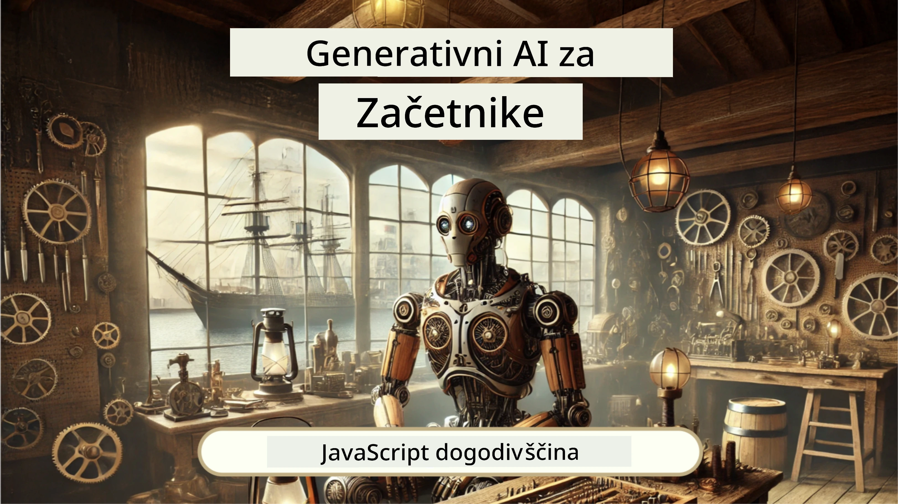
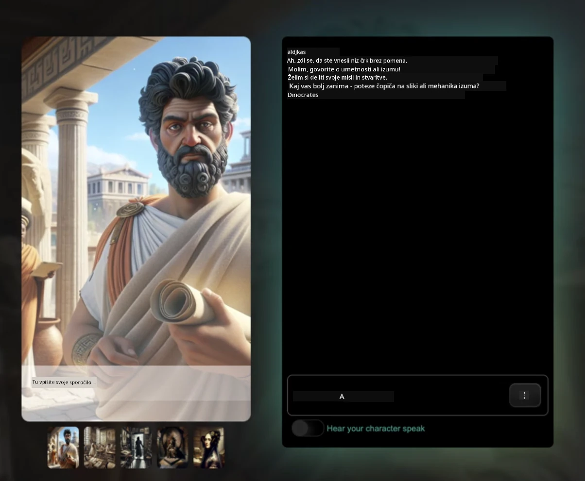
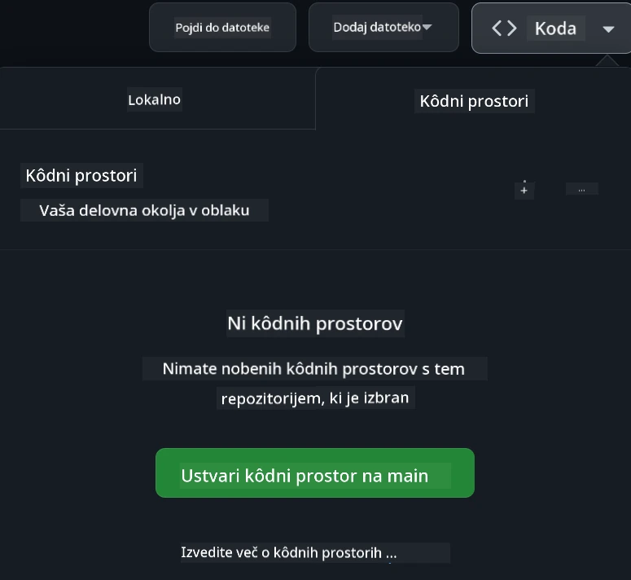

[](https://github.com/microsoft/Web-Dev-For-Beginners/blob/master/LICENSE)
[](https://GitHub.com/microsoft/Web-Dev-For-Beginners/graphs/contributors/)
[](https://GitHub.com/microsoft/Web-Dev-For-Beginners/issues/)
[](https://GitHub.com/microsoft/Web-Dev-For-Beginners/pulls/)
[](http://makeapullrequest.com) 

[](https://GitHub.com/microsoft/Web-Dev-For-Beginners/watchers/)
[](https://GitHub.com/microsoft/Web-Dev-For-Beginners/network/)
[](https://GitHub.com/microsoft/Web-Dev-For-Beginners/stargazers/)

[](https://discord.gg/nTYy5BXMWG)

# Spletni razvoj za začetnike - Učni načrt

Naučite se osnov spletnega razvoja z našim 12-tedenskim obsežnim tečajem, ki ga vodijo Microsoft Cloud Advocates. Vsaka od 24 lekcij poglobljeno obravnava JavaScript, CSS in HTML skozi praktične projekte, kot so terariji, razširitve brskalnika in vesoljske igre. Vključite se v kvize, razprave in praktične naloge. Izboljšajte svoje veščine in optimizirajte zadrževanje znanja z našo učinkovito pedagoško metodo, ki temelji na projektih. Začnite svojo kodirno pot že danes!

Pridružite se Discord skupnosti Azure AI Foundry

[](https://discord.gg/nTYy5BXMWG)

Sledite tem korakom, da začnete uporabljati te vire:
1. **Forkajte repozitorij**: Kliknite [](https://GitHub.com/microsoft/Web-Dev-For-Beginners/fork)
2. **Klonirajte repozitorij**:   `git clone https://github.com/microsoft/Web-Dev-For-Beginners.git`
3. [**Pridružite se Discordu Azure AI Foundry in spoznajte strokovnjake ter druge razvijalce**](https://discord.com/invite/ByRwuEEgH4)

### 🌐 Podpora za več jezikov

#### Podprto preko GitHub Action (avtomatsko in vedno posodobljeno)

<!-- CO-OP TRANSLATOR LANGUAGES TABLE START -->
[Arabic](../ar/README.md) | [Bengali](../bn/README.md) | [Bulgarian](../bg/README.md) | [Burmese (Myanmar)](../my/README.md) | [Chinese (Simplified)](../zh-CN/README.md) | [Chinese (Traditional, Hong Kong)](../zh-HK/README.md) | [Chinese (Traditional, Macau)](../zh-MO/README.md) | [Chinese (Traditional, Taiwan)](../zh-TW/README.md) | [Croatian](../hr/README.md) | [Czech](../cs/README.md) | [Danish](../da/README.md) | [Dutch](../nl/README.md) | [Estonian](../et/README.md) | [Finnish](../fi/README.md) | [French](../fr/README.md) | [German](../de/README.md) | [Greek](../el/README.md) | [Hebrew](../he/README.md) | [Hindi](../hi/README.md) | [Hungarian](../hu/README.md) | [Indonesian](../id/README.md) | [Italian](../it/README.md) | [Japanese](../ja/README.md) | [Kannada](../kn/README.md) | [Korean](../ko/README.md) | [Lithuanian](../lt/README.md) | [Malay](../ms/README.md) | [Malayalam](../ml/README.md) | [Marathi](../mr/README.md) | [Nepali](../ne/README.md) | [Nigerian Pidgin](../pcm/README.md) | [Norwegian](../no/README.md) | [Persian (Farsi)](../fa/README.md) | [Polish](../pl/README.md) | [Portuguese (Brazil)](../pt-BR/README.md) | [Portuguese (Portugal)](../pt-PT/README.md) | [Punjabi (Gurmukhi)](../pa/README.md) | [Romanian](../ro/README.md) | [Russian](../ru/README.md) | [Serbian (Cyrillic)](../sr/README.md) | [Slovak](../sk/README.md) | [Slovenian](./README.md) | [Spanish](../es/README.md) | [Swahili](../sw/README.md) | [Swedish](../sv/README.md) | [Tagalog (Filipino)](../tl/README.md) | [Tamil](../ta/README.md) | [Telugu](../te/README.md) | [Thai](../th/README.md) | [Turkish](../tr/README.md) | [Ukrainian](../uk/README.md) | [Urdu](../ur/README.md) | [Vietnamese](../vi/README.md)

> **Raje klonirati lokalno?**

> Ta repozitorij vsebuje prevode v več kot 50 jezikov, kar znatno poveča velikost prenosa. Če želite klonirati brez prevodov, uporabite sparse checkout:
> ```bash
> git clone --filter=blob:none --sparse https://github.com/microsoft/Web-Dev-For-Beginners.git
> cd Web-Dev-For-Beginners
> git sparse-checkout set --no-cone '/*' '!translations' '!translated_images'
> ```
> Tako prejmete vse, kar potrebujete za dokončanje tečaja, s precej hitrejšim prenosom.
<!-- CO-OP TRANSLATOR LANGUAGES TABLE END -->

**Če želite podpreti dodatne prevodne jezike, so na voljo na [tej strani](https://github.com/Azure/co-op-translator/blob/main/getting_started/supported-languages.md)**

[](https://open.vscode.dev/microsoft/Web-Dev-For-Beginners)

#### 🧑‍🎓 _Ste študent?_

Obiščite [**stran Student Hub**](https://docs.microsoft.com/learn/student-hub/?WT.mc_id=academic-77807-sagibbon), kjer boste našli začetne vire, pakete za študente in celo načine za pridobitev brezplačnega bona za certifikat. To je stran, ki si jo želite zaznamovati in občasno preverjati, saj vsebine mesečno osvežujemo.

### 📣 Obvestilo - Novi izzivi GitHub Copilot Agent mode za dokončanje!

Dodan je nov izziv, poiščite "GitHub Copilot Agent Challenge 🚀" v večini poglavij. To je nov izziv, ki ga lahko zaključite z uporabo GitHub Copilota in Agent mode. Če Agent mode še niste uporabljali, je sposoben ne samo ustvarjati besedilo, ampak tudi ustvarjati in urejati datoteke, izvajati ukaze in še več.

### 📣 Obvestilo - _Novi projekt za izdelavo z Generativno AI_

Pravkar dodan nov projekt AI asistenta, preverite [projekt](./9-chat-project/README.md)

### 📣 Obvestilo - _Nov učni načrt_ o Generativni AI za JavaScript pravkar izdan

Ne zamudite našega novega učnega načrta o Generativni AI!

Obiščite [https://aka.ms/genai-js-course](https://aka.ms/genai-js-course) in začnite!



- Lekcije pokrivajo vse od osnov do RAG.
- Interakcija z zgodovinskimi liki z GenAI in našo spremljevalno aplikacijo.
- Zabavno in privlačno pripovedovanje, potovanje skozi čas!



Vsaka lekcija vključuje nalogo za dokončanje, preverjanje znanja in izziv, ki vas vodi pri učenju tem, kot so:
- Postavljanje vprašanj in oblikovanje vprašanj
- Ustvarjanje aplikacij za besedilo in slike
- Iskalne aplikacije

Obiščite [https://aka.ms/genai-js-course](https://aka.ms/genai-js-course) in začnite!


## 🌱 Začetek

> **Učitelji**, pripravili smo [nekaj predlogov](for-teachers.md), kako uporabiti ta učni načrt. Veseli bomo vaših povratnih informacij [v našem diskusijskem forumu](https://github.com/microsoft/Web-Dev-For-Beginners/discussions/categories/teacher-corner)!

**[Učenci](https://aka.ms/student-page/?WT.mc_id=academic-77807-sagibbon)**, za vsako lekcijo začnite s kvizom pred predavanjem in nadaljujte z branjem učnega gradiva, dokončanjem različnih aktivnosti ter preverjanjem razumevanja s kvizom po predavanju.

Da izboljšate svojo učne izkušnje, se povežite s sovrstniki in skupaj delajte na projektih! Razprave so dobrodošle v našem [diskusijskem forumu](https://github.com/microsoft/Web-Dev-For-Beginners/discussions), kjer vam bo na voljo naša ekipa moderatorjev za odgovore na vprašanja.

Za nadaljnje izobraževanje priporočamo raziskovanje [Microsoft Learn](https://learn.microsoft.com/users/wirelesslife/collections/p1ddcy5jwy0jkm?WT.mc_id=academic-77807-sagibbon) za dodatno študijsko gradivo.

### 📋 Nastavitev vašega okolja

Ta učni načrt ima že pripravljeno razvojno okolje! Ko začnete, lahko izbirate med poganjanjem učnega načrta v [Codespace](https://github.com/features/codespaces/) (_brskalniško okolje brez potrebe po namestitvah_) ali lokalno na vašem računalniku z urejevalnikom besedila, kot je [Visual Studio Code](https://code.visualstudio.com/?WT.mc_id=academic-77807-sagibbon).

#### Ustvarite svoj repozitorij
Da boste enostavno shranjevali svoje delo, priporočamo, da ustvarite svojo kopijo tega repozitorija. To lahko storite tako, da kliknete gumb **Use this template** na vrhu strani. To bo ustvarilo nov repozitorij v vašem GitHub računu s kopijo učnega načrta.

Sledite tem korakom:
1. **Forkajte repozitorij**: Kliknite na gumb "Fork" v zgornjem desnem kotu te strani.
2. **Klonirajte repozitorij**:   `git clone https://github.com/microsoft/Web-Dev-For-Beginners.git`

#### Zagon učnega načrta v Codespace

V svoji kopiji repozitorija, ki ste jo ustvarili, kliknite gumb **Code** in izberite **Open with Codespaces**. To bo ustvarilo nov Codespace za vaše delo.



#### Zagon učnega načrta lokalno na vašem računalniku

Za zagon učnega načrta lokalno na vašem računalniku potrebujete urejevalnik besedila, brskalnik in orodje za ukazno vrstico. Naša prva lekcija, [Uvod v programske jezike in orodja](../../1-getting-started-lessons/1-intro-to-programming-languages), vas bo vodila skozi različne možnosti za vsako od teh orodij, da izberete, kar vam najbolj ustreza.

Priporočamo uporabo [Visual Studio Code](https://code.visualstudio.com/?WT.mc_id=academic-77807-sagibbon) kot urejevalnik, ki ima tudi vgrajen [Terminal](https://code.visualstudio.com/docs/terminal/basics/?WT.mc_id=academic-77807-sagibbon). Visual Studio Code lahko prenesete [tukaj](https://code.visualstudio.com/?WT.mc_id=academic-77807-sagibbon).


1. Klonirajte svoj repozitorij na svoj računalnik. To lahko storite tako, da kliknete gumb **Code** in kopirate URL:

    [CodeSpace](./images/createcodespace.png)
Nato odprite [Terminal](https://code.visualstudio.com/docs/terminal/basics/?WT.mc_id=academic-77807-sagibbon) v [Visual Studio Code](https://code.visualstudio.com/?WT.mc_id=academic-77807-sagibbon) in zaženite naslednji ukaz, pri čemer zamenjajte `<your-repository-url>` z URL-jem, ki ste ga pravkar kopirali:

    ```bash 
    git clone <your-repository-url>
    ```

2. Odprite mapo v Visual Studio Code. To lahko storite tako, da kliknete **Datoteka** > **Odpri mapo** in izberete mapo, ki ste jo pravkar klonirali.


>  Priporočene razširitve Visual Studio Code:
>
> * [Live Server](https://marketplace.visualstudio.com/items?itemName=ritwickdey.LiveServer&WT.mc_id=academic-77807-sagibbon) - za predogled HTML strani znotraj Visual Studio Code
> * [Copilot](https://marketplace.visualstudio.com/items?itemName=GitHub.copilot&WT.mc_id=academic-77807-sagibbon) - za pomoč pri hitrejšem pisanju kode

## 📂 Vsaka lekcija vključuje:

- neobvezno skicirno beležko
- neobvezni dodatni video
- predhodni kviz za ogrevanje pred lekcijo
- pisni del lekcije
- za lekcije, ki temeljijo na projektih, vodnike po korakih, kako zgraditi projekt
- preverjanje znanja
- izziv
- dodatno branje
- nalogo
- [kviz po lekciji](https://ff-quizzes.netlify.app/web/)

> **Opomba o kvizih**: Vsi kvizi so shranjeni v mapi Quiz-app, skupaj 48 kvizov, vsak s tremi vprašanji. Na voljo so [tukaj](https://ff-quizzes.netlify.app/web/), kviz aplikacijo lahko zaženete lokalno ali jo namestite na Azure; sledite navodilom v mapi `quiz-app`.

## 🗃️ Lekcije

|     |                       Ime projekta                       |                            Poučene koncepte                             | Cilji učenja                                                                                                                     |                                                         Povezana lekcija                                                         |         Avtor          |
| :-: | :------------------------------------------------------: | :---------------------------------------------------------------------: | -------------------------------------------------------------------------------------------------------------------------------- | :----------------------------------------------------------------------------------------------------------------------------: | :---------------------: |
| 01  |                     Začetek                              |           Uvod v programiranje in orodja stroke                        | Spoznajte osnovna načela večine programskih jezikov in programske opreme, ki pomaga profesionalnim razvijalcem pri delu           | [Uvod v programske jezike in orodja stroke](./1-getting-started-lessons/1-intro-to-programming-languages/README.md)          |         Jasmine         |
| 02  |                     Začetek                              |             Osnove GitHuba, vključuje delo v skupini                   | Kako uporabljati GitHub v vašem projektu, kako sodelovati z drugimi na kodi                                                      |                            [Uvod v GitHub](./1-getting-started-lessons/2-github-basics/README.md)                              |          Floor          |
| 03  |                     Začetek                              |                             Dostopnost                                | Spoznajte osnove spletne dostopnosti                                                                                             |                       [Osnove dostopnosti](./1-getting-started-lessons/3-accessibility/README.md)                              |       Christopher       |
| 04  |                        Osnove JS                         |                         Podatkovni tipi v JavaScriptu                  | Osnove podatkovnih tipov v JavaScriptu                                                                                            |                                       [Podatkovni tipi](./2-js-basics/1-data-types/README.md)                                   |         Jasmine         |
| 05  |                        Osnove JS                         |                         Funkcije in metode                            | Spoznajte funkcije in metode za upravljanje logike aplikacije                                                                    |                              [Funkcije in metode](./2-js-basics/2-functions-methods/README.md)                               | Jasmine in Christopher |
| 06  |                        Osnove JS                         |                        Sprejemanje odločitev z JS                      | Naučite se ustvarjati pogoje v kodi z uporabo metod odločanja                                                                     |                                 [Sprejemanje odločitev](./2-js-basics/3-making-decisions/README.md)                            |         Jasmine         |
| 07  |                        Osnove JS                         |                            Tabele in zanke                            | Delo s podatki z uporabo tabel in zank v JavaScriptu                                                                             |                                   [Tabele in zanke](./2-js-basics/4-arrays-loops/README.md)                                  |         Jasmine         |
| 08  |       [Terrarium](./3-terrarium/solution/README.md)       |                            HTML v praksi                              | Zgradite HTML za ustvarjanje spletnega terarija, s poudarkom na postavitvi                                                       |                                 [Uvod v HTML](./3-terrarium/1-intro-to-html/README.md)                                      |           Jen           |
| 09  |       [Terrarium](./3-terrarium/solution/README.md)       |                            CSS v praksi                               | Zgradite CSS za oblikovanje spletnega terarija, s poudarkom na osnovah CSS in prilagajanju strani                                  |                                  [Uvod v CSS](./3-terrarium/2-intro-to-css/README.md)                                        |           Jen           |
| 10  |            [Terrarium](./3-terrarium/solution/README.md)            |             JavaScript zaprte funkcije, manipulacija DOM              | Zgradite JavaScript, da terarij deluje kot vmesnik za povleci-in-spusti, s poudarkom na zaprtih funkcijah in manipulaciji DOM     |                  [JavaScript zaprte funkcije, manipulacija DOM](./3-terrarium/3-intro-to-DOM-and-closures/README.md)         |           Jen           |
| 11  |          [Igra tipkanja](./4-typing-game/solution/README.md)          |                          Zgradite igro tipkanja                        | Naučite se uporabljati dogodke tipkovnice za poganjanje logike vaše JavaScript aplikacije                                          |                                [Dogodkovno programiranje](./4-typing-game/typing-game/README.md)                               |       Christopher       |
| 12  | [Razširitev zelenega brskalnika](./5-browser-extension/solution/README.md) |                         Delo z brskalniki                           | Spoznajte, kako delujejo brskalniki, njihovo zgodovino in kako pripraviti prve elemente razširitve brskalnika                      |                               [O brskalnikih](./5-browser-extension/1-about-browsers/README.md)                              |           Jen           |
| 13  | [Razširitev zelenega brskalnika](./5-browser-extension/solution/README.md) | Gradnja obrazca, klic API in shranjevanje spremenljivk v lokalno shrambo | Zgradite JavaScript elemente razširitve brskalnika za klic API z uporabo spremenljivk shranjenih v lokalni shrambi               |                [API-ji, obrazci in lokalna shramba](./5-browser-extension/2-forms-browsers-local-storage/README.md)          |           Jen           |
| 14  | [Razširitev zelenega brskalnika](./5-browser-extension/solution/README.md) |          Ozadinski procesi v brskalniku, spletna zmogljivost          | Uporabite ozadinske procese brskalnika za upravljanje ikone razširitve; naučite se o spletni zmogljivosti in nekaterih optimizacijah |             [Ozadna opravila in zmogljivost](./5-browser-extension/3-background-tasks-and-performance/README.md)             |           Jen           |
| 15  |           [Igra vesolja](./6-space-game/solution/README.md)           |        Naprednejši razvoj iger z JavaScriptom                         | Spoznajte dediščino z uporabo tako razredov kot kompozicije in vzorec Pub/Sub, kot pripravo na izdelavo igre                     |                      [Uvod v napredni razvoj iger](./6-space-game/1-introduction/README.md)                                   |          Chris          |
| 16  |           [Igra vesolja](./6-space-game/solution/README.md)           |                           Risanje na canvas                            | Spoznajte Canvas API, ki se uporablja za risanje elementov na zaslon                                                            |                                [Risanje na canvas](./6-space-game/2-drawing-to-canvas/README.md)                              |          Chris          |
| 17  |           [Igra vesolja](./6-space-game/solution/README.md)           |                Premikanje elementov po zaslonu                       | Odkrijte, kako elementi pridobijo gibanje z uporabo kartezičnih koordinat in Canvas API                                          |                           [Premikanje elementov](./6-space-game/3-moving-elements-around/README.md)                           |          Chris          |
| 18  |           [Igra vesolja](./6-space-game/solution/README.md)           |                          Zaznavanje trkov                             | Naredite, da elementi trčijo in medsebojno reagirajo z uporabo pritiskov tipk ter zagotovite funkcijo počitka za zmogljivost igre |                              [Zaznavanje trkov](./6-space-game/4-collision-detection/README.md)                               |          Chris          |
| 19  |           [Igra vesolja](./6-space-game/solution/README.md)           |                             Beleženje točk                           | Izvedite matematične izračune na podlagi stanja in zmogljivosti igre                                                            |                                    [Beleženje točk](./6-space-game/5-keeping-score/README.md)                                   |          Chris          |
| 20  |           [Igra vesolja](./6-space-game/solution/README.md)           |                     Zaključek in ponovni začetek igre                 | Spoznajte, kako zaključiti in ponovno zagnati igro, vključno s čiščenjem virov in ponastavitvijo vrednosti spremenljivk          |                                [Pogoji zaključka](./6-space-game/6-end-condition/README.md)                                  |          Chris          |
| 21  |         [Bančniška aplikacija](./7-bank-project/solution/README.md)   |               HTML predloge in poti v spletni aplikaciji             | Spoznajte, kako ustvariti ogrodje večstranske spletne strani z uporabo usmerjanja in HTML predlog                               |                            [HTML predloge in poti](./7-bank-project/1-template-route/README.md)                                |          Yohan          |
| 22  |         [Bančniška aplikacija](./7-bank-project/solution/README.md)   |                Zgradite obrazec za prijavo in registracijo           | Spoznajte izdelavo obrazcev in obdelavo validacijskih rutin                                                                     |                                           [Obrazci](./7-bank-project/2-forms/README.md)                                      |          Yohan          |
| 23  |         [Bančniška aplikacija](./7-bank-project/solution/README.md)   |                   Metode pridobivanja in uporabe podatkov            | Kako podatki vstopajo in izstopajo iz aplikacije, kako jih pridobiti, shraniti in odstraniti                                      |                                            [Podatki](./7-bank-project/3-data/README.md)                                      |          Yohan          |
| 24  |         [Bančniška aplikacija](./7-bank-project/solution/README.md)   |                      Koncepti upravljanja stanja                      | Spoznajte, kako aplikacija ohranja stanje in kako ga programatsko upravljati                                                     |                                [Upravljanje stanja](./7-bank-project/4-state-management/README.md)                              |          Yohan          |
| 25 | [Brskalnik/urejevalnik kode VScode](../../8-code-editor) | Delo z VScode | Naučite se uporabljati urejevalnik kode | [Uporaba urejevalnika VScode](./8-code-editor/1-using-a-code-editor/README.md) | Chris |
| 26 | [AI asistenti](./9-chat-project/README.md) | Delo z AI | Naučite se zgraditi svojega AI asistenta | [Projekt AI asistenta](./9-chat-project/README.md) | Chris |

## 🏫 Pedagogika

Naš učni program je zasnovan z dvema ključnima pedagoškima principoma v mislih:
* učenje preko projektov
* pogosti kvizi

Program uči osnove JavaScript, HTML in CSS, pa tudi najnovejša orodja in tehnike, ki jih uporabljajo današnji spletni razvijalci. Študenti bodo imeli priložnost pridobiti praktične izkušnje z gradnjo igre tipkanja, virtualnega terarija, okolju prijazne razširitve brskalnika, igre v stilu Space Invader in bančne aplikacije za podjetja. Ob koncu serije bodo imeli trdno razumevanje spletnega razvoja.

> 🎓 Prve lekcije tega učnega programa lahko opravite kot [Učni poti](https://docs.microsoft.com/learn/paths/web-development-101/?WT.mc_id=academic-77807-sagibbon) na Microsoft Learn!

Z zagotavljanjem, da se vsebina ujema s projekti, postane proces bolj zanimiv za študente in se poveča zadrževanje konceptov. Prav tako smo napisali nekaj začetnih lekcij o osnovah JavaScript, da predstavimo koncepte, skupaj z videom iz zbirke "[Serija za začetnike: JavaScript](https://channel9.msdn.com/Series/Beginners-Series-to-JavaScript/?WT.mc_id=academic-77807-sagibbon)", katere avtorji so prispevali k temu učnemu programu.

Poleg tega nizkorizični kviz pred poukom usmerja študenta k učenju teme, medtem ko drugi kviz po pouku zagotavlja nadaljnje zadrževanje znanja. Ta učni program je zasnovan tako, da je prilagodljiv in zabaven ter ga je mogoče opraviti v celoti ali delno. Projekti se začnejo majhni in do konca 12-tedenskega cikla postanejo vse bolj kompleksni.

Čeprav smo namenoma se izognili uvajanju JavaScript ogrodij, da bi se osredotočili na osnovne veščine, potrebne kot spletni razvijalec pred uporabo ogrodja, je dober naslednji korak za dokončanje tega učnega programa učenje o Node.js prek druge zbirke videoposnetkov: "[Serija za začetnike: Node.js](https://channel9.msdn.com/Series/Beginners-Series-to-Nodejs/?WT.mc_id=academic-77807-sagibbon)".

> Ogledate si lahko naša [Pravila obnašanja](CODE_OF_CONDUCT.md) in [Prispevanje](CONTRIBUTING.md). Veselimo se vaših konstruktivnih povratnih informacij!


## 🧭 Dostop brez povezave

To dokumentacijo lahko uporabljate brez povezave z uporabo [Docsify](https://docsify.js.org/#/). Razvejite to repozitorij, [namestite Docsify](https://docsify.js.org/#/quickstart) na vaš lokalni računalnik in nato v korenski mapi te repozitorija vnesite `docsify serve`. Spletna stran bo dostopna na vratih 3000 na vašem lokalnem strežniku: `localhost:3000`.

## 📘 PDF

PDF vseh lekcij lahko najdete [tukaj](https://microsoft.github.io/Web-Dev-For-Beginners/pdf/readme.pdf).


## 🎒 Drugi tečaji
Naša ekipa izdeluje tudi druge tečaje! Oglejte si:

<!-- CO-OP TRANSLATOR OTHER COURSES START -->
### LangChain
[](https://aka.ms/langchain4j-for-beginners)
[](https://aka.ms/langchainjs-for-beginners?WT.mc_id=m365-94501-dwahlin)
[](https://github.com/microsoft/langchain-for-beginners?WT.mc_id=m365-94501-dwahlin)
---

### Azure / Edge / MCP / Agents
[](https://github.com/microsoft/AZD-for-beginners?WT.mc_id=academic-105485-koreyst)
[](https://github.com/microsoft/edgeai-for-beginners?WT.mc_id=academic-105485-koreyst)
[](https://github.com/microsoft/mcp-for-beginners?WT.mc_id=academic-105485-koreyst)
[](https://github.com/microsoft/ai-agents-for-beginners?WT.mc_id=academic-105485-koreyst)

---
 
### Serija generativne umetne inteligence
[](https://github.com/microsoft/generative-ai-for-beginners?WT.mc_id=academic-105485-koreyst)
[-9333EA?style=for-the-badge&labelColor=E5E7EB&color=9333EA)](https://github.com/microsoft/Generative-AI-for-beginners-dotnet?WT.mc_id=academic-105485-koreyst)
[-C084FC?style=for-the-badge&labelColor=E5E7EB&color=C084FC)](https://github.com/microsoft/generative-ai-for-beginners-java?WT.mc_id=academic-105485-koreyst)
[-E879F9?style=for-the-badge&labelColor=E5E7EB&color=E879F9)](https://github.com/microsoft/generative-ai-with-javascript?WT.mc_id=academic-105485-koreyst)

---
 
### Osnove učenja
[](https://aka.ms/ml-beginners?WT.mc_id=academic-105485-koreyst)
[](https://aka.ms/datascience-beginners?WT.mc_id=academic-105485-koreyst)
[](https://aka.ms/ai-beginners?WT.mc_id=academic-105485-koreyst)
[](https://github.com/microsoft/Security-101?WT.mc_id=academic-96948-sayoung)
[](https://aka.ms/webdev-beginners?WT.mc_id=academic-105485-koreyst)
[](https://aka.ms/iot-beginners?WT.mc_id=academic-105485-koreyst)
[](https://github.com/microsoft/xr-development-for-beginners?WT.mc_id=academic-105485-koreyst)

---
 
### Serija Copilot
[](https://aka.ms/GitHubCopilotAI?WT.mc_id=academic-105485-koreyst)
[](https://github.com/microsoft/mastering-github-copilot-for-dotnet-csharp-developers?WT.mc_id=academic-105485-koreyst)
[](https://github.com/microsoft/CopilotAdventures?WT.mc_id=academic-105485-koreyst)
<!-- CO-OP TRANSLATOR OTHER COURSES END -->

## Pomoč

Če se zataknete ali imate kakršna koli vprašanja o izdelavi AI aplikacij, se pridružite drugim učencem in izkušenim razvijalcem v razpravah o MCP. To je prijazna skupnost, kjer so vprašanja dobrodošla in se znanje medsebojno prostovoljno deli.

[](https://discord.gg/nTYy5BXMWG)

Če imate povratne informacije o izdelku ali napake med razvojem, obiščite:

[](https://aka.ms/foundry/forum)

## Licenca

To skladišče je licencirano pod licenco MIT. Za več informacij glejte datoteko [LICENSE](../../LICENSE).

---

<!-- CO-OP TRANSLATOR DISCLAIMER START -->
**Opozorilo**:
Ta dokument je bil preveden z uporabo storitve za strojno prevajanje [Co-op Translator](https://github.com/Azure/co-op-translator). Čeprav si prizadevamo za natančnost, upoštevajte, da lahko avtomatizirani prevodi vsebujejo napake ali netočnosti. Izvirni dokument v izvorni jezik velja za avtoritativni vir. Za pomembne informacije priporočamo profesionalni človeški prevod. Za morebitne nesporazume ali napačne razlage, ki izhajajo iz uporabe tega prevoda, ne prevzemamo odgovornosti.
<!-- CO-OP TRANSLATOR DISCLAIMER END -->