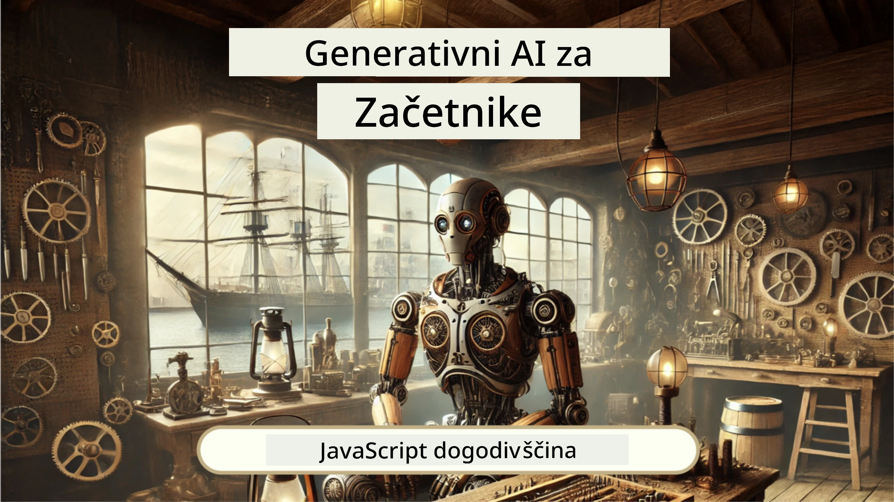
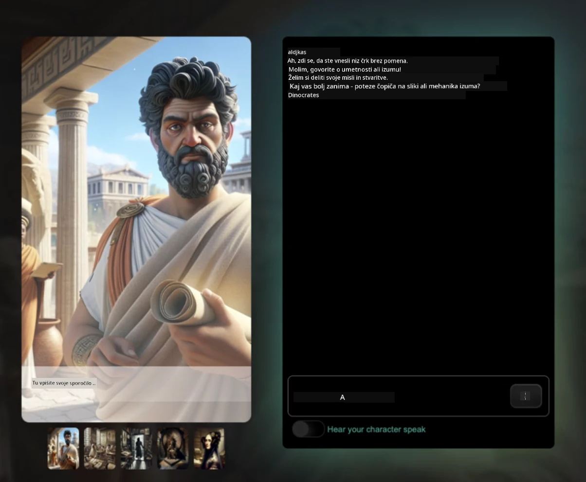
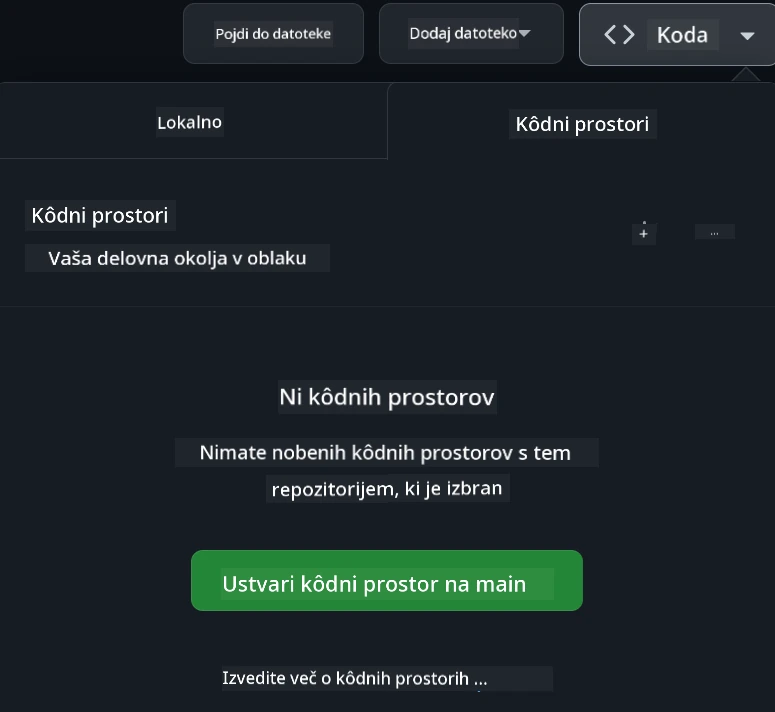

[](https://github.com/microsoft/Web-Dev-For-Beginners/blob/master/LICENSE)
[](https://GitHub.com/microsoft/Web-Dev-For-Beginners/graphs/contributors/)
[](https://GitHub.com/microsoft/Web-Dev-For-Beginners/issues/)
[](https://GitHub.com/microsoft/Web-Dev-For-Beginners/pulls/)
[](http://makeapullrequest.com) 

[](https://GitHub.com/microsoft/Web-Dev-For-Beginners/watchers/)
[](https://GitHub.com/microsoft/Web-Dev-For-Beginners/network/)
[](https://GitHub.com/microsoft/Web-Dev-For-Beginners/stargazers/)

[](https://discord.gg/nTYy5BXMWG)

# Spletni razvoj za začetnike - učni načrt

Naučite se osnov spletnega razvoja z našim 12-tedenskim celovitim tečajem, ki ga vodijo Microsoft Cloud Advocates. Vsaka od 24 lekcij se poglobi v JavaScript, CSS in HTML prek praktičnih projektov, kot so terariji, razširitve za brskalnike in vesoljske igre. Vključujte se v kvize, razprave in praktične naloge. Izboljšajte svoje veščine in optimizirajte pomnjenje znanja z našo učinkovito pedagoško metodo, ki temelji na projektih. Začnite svojo kodirno pot že danes!

Pridružite se skupnosti Azure AI Foundry Discord

[](https://discord.gg/nTYy5BXMWG)

Sledite tem korakom za začetek z uporabo teh virov:
1. **Razvezi repozitorij**: Kliknite [](https://GitHub.com/microsoft/Web-Dev-For-Beginners/fork)
2. **Kloniraj repozitorij**:   `git clone https://github.com/microsoft/Web-Dev-For-Beginners.git`
3. [**Pridruži se Azure AI Foundry Discord in spoznaj strokovnjake ter druge razvijalce**](https://discord.com/invite/ByRwuEEgH4)

### 🌐 Podpora za več jezikov

#### Podprto preko GitHub Action (avtomatizirano in vedno posodobljeno)

<!-- CO-OP TRANSLATOR LANGUAGES TABLE START -->
[Arabic](../ar/README.md) | [Bengali](../bn/README.md) | [Bulgarian](../bg/README.md) | [Burmese (Myanmar)](../my/README.md) | [Chinese (Simplified)](../zh-CN/README.md) | [Chinese (Traditional, Hong Kong)](../zh-HK/README.md) | [Chinese (Traditional, Macau)](../zh-MO/README.md) | [Chinese (Traditional, Taiwan)](../zh-TW/README.md) | [Croatian](../hr/README.md) | [Czech](../cs/README.md) | [Danish](../da/README.md) | [Dutch](../nl/README.md) | [Estonian](../et/README.md) | [Finnish](../fi/README.md) | [French](../fr/README.md) | [German](../de/README.md) | [Greek](../el/README.md) | [Hebrew](../he/README.md) | [Hindi](../hi/README.md) | [Hungarian](../hu/README.md) | [Indonesian](../id/README.md) | [Italian](../it/README.md) | [Japanese](../ja/README.md) | [Kannada](../kn/README.md) | [Korean](../ko/README.md) | [Lithuanian](../lt/README.md) | [Malay](../ms/README.md) | [Malayalam](../ml/README.md) | [Marathi](../mr/README.md) | [Nepali](../ne/README.md) | [Nigerian Pidgin](../pcm/README.md) | [Norwegian](../no/README.md) | [Persian (Farsi)](../fa/README.md) | [Polish](../pl/README.md) | [Portuguese (Brazil)](../pt-BR/README.md) | [Portuguese (Portugal)](../pt-PT/README.md) | [Punjabi (Gurmukhi)](../pa/README.md) | [Romanian](../ro/README.md) | [Russian](../ru/README.md) | [Serbian (Cyrillic)](../sr/README.md) | [Slovak](../sk/README.md) | [Slovenian](./README.md) | [Spanish](../es/README.md) | [Swahili](../sw/README.md) | [Swedish](../sv/README.md) | [Tagalog (Filipino)](../tl/README.md) | [Tamil](../ta/README.md) | [Telugu](../te/README.md) | [Thai](../th/README.md) | [Turkish](../tr/README.md) | [Ukrainian](../uk/README.md) | [Urdu](../ur/README.md) | [Vietnamese](../vi/README.md)

> **Raje lokalno klonirati?**
>
> Ta repozitorij vključuje več kot 50 jezikovnih prevodov, kar znatno poveča velikost prenosa. Za kloniranje brez prevodov uporabite sparse checkout:
>
> **Bash / macOS / Linux:**
> ```bash
> git clone --filter=blob:none --sparse https://github.com/microsoft/Web-Dev-For-Beginners.git
> cd Web-Dev-For-Beginners
> git sparse-checkout set --no-cone '/*' '!translations' '!translated_images'
> ```
>
> **CMD (Windows):**
> ```cmd
> git clone --filter=blob:none --sparse https://github.com/microsoft/Web-Dev-For-Beginners.git
> cd Web-Dev-For-Beginners
> git sparse-checkout set --no-cone "/*" "!translations" "!translated_images"
> ```
>
> Tako boste prejeli vse, kar potrebujete za dokončanje tečaja z veliko hitrejšim prenosom.
<!-- CO-OP TRANSLATOR LANGUAGES TABLE END -->

**Če želite, da so podprti dodatni jeziki prevodov, so navedeni [tukaj](https://github.com/Azure/co-op-translator/blob/main/getting_started/supported-languages.md)**

[](https://open.vscode.dev/microsoft/Web-Dev-For-Beginners)

#### 🧑‍🎓 _Si študent?_

Obišči [**Student Hub stran**](https://docs.microsoft.com/learn/student-hub/?WT.mc_id=academic-77807-sagibbon), kjer boš našel začetne vire, študentske pakete in celo načine, kako pridobiti brezplačen bon za certifikat. To je stran, ki si jo želiš zaznamovati in občasno preverjati, saj vsak mesec osvežujemo vsebino.

### 📣 Obvestilo - Novi izzivi z uporabo načina GitHub Copilot Agent, ki jih je treba dokončati!

Dodali smo nov izziv, poišči "GitHub Copilot Agent Challenge 🚀" v večini poglavij. To je nov izziv za vas, da ga dokončate z uporabo GitHub Copilot in načina Agent. Če še nisi uporabljal načina Agent, je ta zmožen ne samo generirati besedilo, ampak tudi ustvarjati in urejati datoteke, izvajati ukaze in še več.

### 📣 Obvestilo - _Novi projekt za izdelavo z uporabo generativne AI_

Dodali smo nov AI Asistent projekt, oglej si [projekt](./9-chat-project/README.md)

### 📣 Obvestilo - _Nov učni načrt_ o generativni AI za JavaScript je pravkar izšel

Ne zamudite našega novega učnega načrta za generativno AI!

Obišči [https://aka.ms/genai-js-course](https://aka.ms/genai-js-course) za začetek!



- Lekcije pokrivajo vse od osnov do RAG.
- Interaktivno sodelovanje z zgodovinskimi liki z GenAI in našo spremljevalno aplikacijo.
- Zabavna in vključujoča pripoved, potovali boste skozi čas!



Vsaka lekcija vključuje domačo nalogo za dokončanje, preverjanje znanja in izziv, ki te vodi pri učenju tem, kot so:
- Pozivi in načrtovanje pozivov
- Generiranje aplikacij z besedilom in slikami
- Iskalne aplikacije

Obišči [https://aka.ms/genai-js-course](https://aka.ms/genai-js-course) za začetek!


## 🌱 Začetek

> **Učitelji**, vključili smo [nekaj predlogov](for-teachers.md), kako uporabljati ta učni načrt. Veseli bomo vaših povratnih informacij [v naši diskusijski skupini](https://github.com/microsoft/Web-Dev-For-Beginners/discussions/categories/teacher-corner)!

**[Učni udeleženci](https://aka.ms/student-page/?WT.mc_id=academic-77807-sagibbon)**, za vsako lekcijo začnite s predpredavanjem kviza in sledite z branjem gradiva predavanja ter izpolnjevanjem različnih dejavnosti in preverjajte svoje razumevanje s kvizom po predavanju.

Za izboljšanje učne izkušnje se povežite s svojimi vrstniki in sodelujte pri projektih! Razprave so vabljene v naši [diskusijski skupini](https://github.com/microsoft/Web-Dev-For-Beginners/discussions), kjer bo naša skupina moderatorjev na voljo za odgovore na vaša vprašanja.

Za dodatno izobraževanje močno priporočamo raziskovanje [Microsoft Learn](https://learn.microsoft.com/users/wirelesslife/collections/p1ddcy5jwy0jkm?WT.mc_id=academic-77807-sagibbon) za dodatna učna gradiva.

### 📋 Nastavitev okolja

Ta učni načrt ima že pripravljeno razvojno okolje! Ko začnete, lahko izberete, da zaženete učni načrt v [Codespace](https://github.com/features/codespaces/) (_okolje, ki temelji na brskalniku, brez potrebe po nameščanju_), ali lokalno na svojem računalniku z urejevalnikom besedila, kot je [Visual Studio Code](https://code.visualstudio.com/?WT.mc_id=academic-77807-sagibbon).

#### Ustvari svoj repozitorij
Da bi lahko enostavno shranjevali svoje delo, je priporočljivo, da ustvarite svoj lasten izvod tega repozitorija. To lahko storite s klikom na gumb **Use this template** na vrhu strani. S tem boste ustvarili nov repozitorij v svojem računu GitHub s kopijo učnega načrta.

Sledite tem korakom:
1. **Razvezi repozitorij**: Kliknite gumb "Fork" v zgornjem desnem kotu te strani.
2. **Kloniraj repozitorij**:   `git clone https://github.com/microsoft/Web-Dev-For-Beginners.git`

#### Zagon učnega načrta v Codespace

V svojem izvajanju tega repozitorija, ki ste ga ustvarili, kliknite gumb **Code** in izberite **Open with Codespaces**. S tem bo za vas ustvarjen nov Codespace za delo.



#### Zagon učnega načrta lokalno na svojem računalniku

Da zaženete ta učni načrt lokalno na svojem računalniku, boste potrebovali urejevalnik besedila, brskalnik in orodje za ukazno vrstico. Naša prva lekcija, [Uvod v programske jezike in orodja obrti](../../1-getting-started-lessons/1-intro-to-programming-languages), vas bo vodila skozi različne možnosti za vsak od teh pripomočkov, da izberete tisto, kar vam najbolj ustreza.

Priporočamo uporabo [Visual Studio Code](https://code.visualstudio.com/?WT.mc_id=academic-77807-sagibbon) kot urejevalnik, ki ima tudi vgrajen [Terminal](https://code.visualstudio.com/docs/terminal/basics/?WT.mc_id=academic-77807-sagibbon). Visual Studio Code lahko prenesete [tukaj](https://code.visualstudio.com/?WT.mc_id=academic-77807-sagibbon).
1. Klonirajte svoj repozitorij na svoj računalnik. To lahko storite tako, da kliknete gumb **Code** in kopirate URL:

    [CodeSpace](./images/createcodespace.png)

    Nato odprite [Terminal](https://code.visualstudio.com/docs/terminal/basics/?WT.mc_id=academic-77807-sagibbon) znotraj [Visual Studio Code](https://code.visualstudio.com/?WT.mc_id=academic-77807-sagibbon) in zaženite naslednji ukaz, pri čemer zamenjajte `<your-repository-url>` z URL-jem, ki ste ga pravkar kopirali:

    ```bash 
    git clone <your-repository-url>
    ```

2. Odprite mapo v Visual Studio Code. To storite tako, da kliknete **File** > **Open Folder** in izberete mapo, ki ste jo pravkar klonirali.


>  Priporočeni dodatki za Visual Studio Code:
>
> * [Live Server](https://marketplace.visualstudio.com/items?itemName=ritwickdey.LiveServer&WT.mc_id=academic-77807-sagibbon) - za predogled HTML strani znotraj Visual Studio Code
> * [Copilot](https://marketplace.visualstudio.com/items?itemName=GitHub.copilot&WT.mc_id=academic-77807-sagibbon) - da vam pomaga hitreje pisati kodo

## 📂 Vsaka lekcija vključuje:

- neobvezno skiciranje
- neobvezni dodatni video
- predpripravljalni kviz pred lekcijo
- pisno lekcijo
- za lekcije, ki temeljijo na projektih, korak za korakom vodiče, kako zgraditi projekt
- preverjanja znanja
- izziv
- dodatno branje
- nalogo
- [kviz po lekciji](https://ff-quizzes.netlify.app/web/)

> **Opomba o kvizih**: Vsi kvizi so v mapi Quiz-app, skupno 48 kvizov s tremi vprašanji vsak. Dostopni so [tukaj](https://ff-quizzes.netlify.app/web/), aplikacijo kvizov lahko zaženete lokalno ali jo objavite na Azure; sledite navodilom v mapi `quiz-app`.

## 🗃️ Lekcije

|     |                       Ime projekta                       |                            Naučeni koncepti                             | Cilji učenja                                                                                                                 |                                                         Povezana lekcija                                                          |         Avtor          |
| :-: | :------------------------------------------------------: | :--------------------------------------------------------------------: | ----------------------------------------------------------------------------------------------------------------------------------- | :----------------------------------------------------------------------------------------------------------------------------: | :---------------------: |
| 01  |                     Začetek                              |           Uvod v programiranje in razvojna orodja           | Spoznajte osnovne temelje večine programskih jezikov in programsko opremo, ki pomaga profesionalnim razvijalcem pri njihovem delu | [Uvod v programske jezike in razvojna orodja](./1-getting-started-lessons/1-intro-to-programming-languages/README.md) |         Jasmine         |
| 02  |                     Začetek                              |             Osnove GitHub, vključno z delom v ekipi             | Kako uporabljati GitHub v svojem projektu, kako sodelovati z drugimi na izvorni kodi                                                    |                            [Uvod v GitHub](./1-getting-started-lessons/2-github-basics/README.md)                             |          Floor          |
| 03  |                     Začetek                              |                             Dostopnost                              | Naučite se osnov spletne dostopnosti                                                                                               |                       [Osnove dostopnosti](./1-getting-started-lessons/3-accessibility/README.md)                       |       Christopher       |
| 04  |                        Osnove JS                         |                         JavaScript podatkovni tipi                          | Osnove podatkovnih tipov JavaScript                                                                                                 |                                       [Podatkovni tipi](./2-js-basics/1-data-types/README.md)                                        |         Jasmine         |
| 05  |                        Osnove JS                         |                         Funkcije in metode                          | Spoznajte funkcije in metode za upravljanje logike aplikacije                                                             |                              [Funkcije in metode](./2-js-basics/2-functions-methods/README.md)                               | Jasmine in Christopher |
| 06  |                        Osnove JS                         |                        Sprejemanje odločitev z JS                        | Naučite se ustvarjati pogoje v svoji kodi z uporabo metod odločanja                                                           |                                 [Sprejemanje odločitev](./2-js-basics/3-making-decisions/README.md)                                  |         Jasmine         |
| 07  |                        Osnove JS                         |                            Tabele in zanke                            | Delo s podatki z uporabo tabel in zank v JavaScript                                                                                 |                                   [Tabele in zanke](./2-js-basics/4-arrays-loops/README.md)                                    |         Jasmine         |
| 08  |       [Terrarium](./3-terrarium/solution/README.md)       |                            HTML v praksi                            | Zgradite HTML za ustvarjanje spletnega terrarija, osredotočite se na postavitev                                                         |                                 [Uvod v HTML](./3-terrarium/1-intro-to-html/README.md)                                 |           Jen           |
| 09  |       [Terrarium](./3-terrarium/solution/README.md)       |                            CSS v praksi                             | Zgradite CSS za stilizacijo spletnega terrarija, osredotočite se na osnove CSS in prilagodljivost strani                     |                                  [Uvod v CSS](./3-terrarium/2-intro-to-css/README.md)                                  |           Jen           |
| 10  |            [Terrarium](./3-terrarium/solution/README.md)            |                 JavaScript zaprtja, manipulacija DOM                  | Zgradite JavaScript, da ustvari funkcionalno terrarijsko povleci in spusti vmesnik, osredotočite se na zaprtja in manipulacijo DOM             |                  [JavaScript zaprtja, manipulacija DOM](./3-terrarium/3-intro-to-DOM-and-closures/README.md)                   |           Jen           |
| 11  |          [Igra tipkanja](./4-typing-game/solution/README.md)          |                          Zgradi igro tipkanja                           | Naučite se uporabljati dogodke s tipkovnice za upravljanje logike vaše JavaScript aplikacije                                                          |                                [Dogodkovno usmerjeno programiranje](./4-typing-game/typing-game/README.md)                                |       Christopher       |
| 12  | [Zeleni brskalniški dodatek](./5-browser-extension/solution/README.md) |                         Delo z brskalniki                          | Spoznajte, kako brskalniki delujejo, njihovo zgodovino in kako postaviti prve elemente razširitve brskalnika                               |                               [O brskalnikih](./5-browser-extension/1-about-browsers/README.md)                                |           Jen           |
| 13  | [Zeleni brskalniški dodatek](./5-browser-extension/solution/README.md) | Izgradnja obrazca, klicanje API-ja in shranjevanje spremenljivk v lokalni shrambi | Zgradite JavaScript elemente svoje brskalniške razširitve za klic API-ja z uporabo spremenljivk, shranjenih v lokalni shrambi                      |                [API-ji, obrazci in lokalna shramba](./5-browser-extension/2-forms-browsers-local-storage/README.md)                 |           Jen           |
| 14  | [Zeleni brskalniški dodatek](./5-browser-extension/solution/README.md) |          Ozadinski procesi v brskalniku, zmogljivost spletnih strani          | Uporabite ozadinske procese brskalnika za upravljanje ikone razširitve; spoznajte zmogljivost spletnih strani in nekatere optimizacije za izboljšanje   |             [Ozadna opravila in zmogljivost](./5-browser-extension/3-background-tasks-and-performance/README.md)              |           Jen           |
| 15  |           [Igra v vesolju](./6-space-game/solution/README.md)           |             Naprednejši razvoj iger z JavaScript             | Naučite se o dediščini z uporabo razredov in kompozicije ter vzorca Pub/Sub, kot priprava za izdelavo igre              |                      [Uvod v napredni razvoj iger](./6-space-game/1-introduction/README.md)                       |          Chris          |
| 16  |           [Igra v vesolju](./6-space-game/solution/README.md)           |                           Risanje na platno                            | Spoznajte Canvas API, ki se uporablja za risanje elementov na zaslon                                                                       |                                [Risanje na platno](./6-space-game/2-drawing-to-canvas/README.md)                                |          Chris          |
| 17  |           [Igra v vesolju](./6-space-game/solution/README.md)           |                   Premikanje elementov po zaslonu                    | Odkrijte, kako elementi pridobijo gibanje z uporabo kartezičnih koordinat in Canvas API                                            |                           [Premikanje elementov](./6-space-game/3-moving-elements-around/README.md)                           |          Chris          |
| 18  |           [Igra v vesolju](./6-space-game/solution/README.md)           |                          Zaznavanje trkov                           | Poskrbite, da se elementi trčijo in medsebojno odzivajo z uporabo pritiskov tipk ter zagotovite funkcijo ohlajevanja za boljšo zmogljivost igre    |                              [Zaznavanje trkov](./6-space-game/4-collision-detection/README.md)                              |          Chris          |
| 19  |           [Igra v vesolju](./6-space-game/solution/README.md)           |                             Spremljanje rezultata                              | Izvajajte matematične izračune na podlagi stanja in zmogljivosti igre                                                                |                                    [Spremljanje rezultata](./6-space-game/5-keeping-score/README.md)                                    |          Chris          |
| 20  |           [Igra v vesolju](./6-space-game/solution/README.md)           |                     Zaključevanje in ponovni začetek igre                     | Spoznajte o zaključevanju in ponovnem zagonu igre, vključno s čiščenjem sredstev in ponastavitvijo vrednosti spremenljivk                              |                                [Pogoj konca](./6-space-game/6-end-condition/README.md)                                 |          Chris          |
| 21  |         [Bančniška aplikacija](./7-bank-project/solution/README.md)          |                 HTML predloge in poti v spletni aplikaciji                 | Naučite se, kako ustvariti osnovno arhitekturo večstraničnega spletišča z uporabo usmerjanja in HTML predlog                             |                            [HTML predloge in poti](./7-bank-project/1-template-route/README.md)                             |          Yohan          |
| 22  |         [Bančniška aplikacija](./7-bank-project/solution/README.md)          |                  Ustvari obrazec za prijavo in registracijo                   | Spoznajte gradnjo obrazcev in upravljanje validacij                                                                          |                                           [Obrazci](./7-bank-project/2-forms/README.md)                                           |          Yohan          |
| 23  |         [Bančniška aplikacija](./7-bank-project/solution/README.md)          |                   Metode pridobivanja in uporabe podatkov                   | Kako podatki tečejo v in iz vaše aplikacije, kako jih pridobiti, shraniti in odstraniti                                                 |                                            [Podatki](./7-bank-project/3-data/README.md)                                            |          Yohan          |
| 24  |         [Bančniška aplikacija](./7-bank-project/solution/README.md)          |                      Koncepti upravljanja stanja                      | Naučite se, kako aplikacija ohranja stanje in kako ga programsko upravljati                                                              |                                [Upravljanje stanja](./7-bank-project/4-state-management/README.md)                                |          Yohan          |
| 25 | [Urejanje kode brskalnik/VScode](../../8-code-editor) | Delo z VScode | Naučite se uporabljati urejevalnik kode| [Uporaba urejevalnika kode VScode](./8-code-editor/1-using-a-code-editor/README.md) | Chris |
| 26 | [AI pomočniki](./9-chat-project/README.md) | Delo z AI | Naučite se izdelati lastnega AI pomočnika | [Projekt AI pomočnika](./9-chat-project/README.md) | Chris |

## 🏫 Pedagogika

Naš učni načrt temelji na dveh ključnih pedagoških načelih:
* učenje preko projektov
* pogosti kvizi

Program uči osnove JavaScript, HTML in CSS, pa tudi najnovejša orodja in tehnike, ki jih uporabljajo današnji razvijalci spletnih strani. Študenti bodo imeli priložnost pridobiti praktične izkušnje z izdelavo igre tipkanja, virtualnega terrarija, okolju prijazne brskalniške razširitve, igre v slogu invazije vesoljcev in bančne aplikacije za podjetja. Ob koncu serije bodo študenti pridobili trdno razumevanje razvoja spletnih strani.

> 🎓 Prvih nekaj lekcij tega učnega načrta lahko opravite kot [pot učenja](https://docs.microsoft.com/learn/paths/web-development-101/?WT.mc_id=academic-77807-sagibbon) na Microsoft Learn!

Z zagotavljanjem, da vsebina ustreza projektom, je postopek za študente bolj zanimiv in se bo povečalo zadrževanje konceptov. Napisali smo tudi več začetnih lekcij o osnovah JavaScript, ki uvajajo koncepte, ob njih pa je video iz zbirke "[Beginners Series to: JavaScript](https://channel9.msdn.com/Series/Beginners-Series-to-JavaScript/?WT.mc_id=academic-77807-sagibbon)" video vodičev, katerih nekateri avtorji so prispevali k temu učnemu načrtu.

Poleg tega kviz z nizkim vložkom pred razredom usmeri študentovo namero k učenju teme, medtem ko drugi kviz po pouku zagotovi nadaljnje zadrževanje. Ta učni načrt je zasnovan tako, da je prilagodljiv in zabaven ter ga je mogoče opraviti v celoti ali delno. Projekti se začnejo majhni in postajajo vse bolj zapleteni do konca 12-tedenskega cikla.

Medtem ko smo namensko izognili uvajanju JavaScript ogrodij, da bi se osredotočili na osnovne veščine, potrebne kot spletni razvijalec pred uporabo ogrodij, bi bil dober naslednji korak za dokončanje tega učnega načrta spoznavanje Node.js prek druge zbirke videov: "[Beginner Series to: Node.js](https://channel9.msdn.com/Series/Beginners-Series-to-Nodejs/?WT.mc_id=academic-77807-sagibbon)".

> Obiščite naše smernice [Kodeksa obnašanja](CODE_OF_CONDUCT.md) in [Prispevkov](CONTRIBUTING.md). Veselimo se vaših konstruktivnih povratnih informacij!


## 🧭 Dostop brez povezave

To dokumentacijo lahko uporabljate brez povezave z uporabo [Docsify](https://docsify.js.org/#/). Razvejte ta repozitorij, [namestite Docsify](https://docsify.js.org/#/quickstart) na svoj lokalni računalnik in nato v root mapi tega repozitorija zaženite `docsify serve`. Spletna stran bo dostopna na vratih 3000 na vašem lokalnem računalniku: `localhost:3000`.

## 📘 PDF
PDF vseh lekcij je na voljo [tukaj](https://microsoft.github.io/Web-Dev-For-Beginners/pdf/readme.pdf).


## 🎒 Drugi tečaji

Naša ekipa ustvarja tudi druge tečaje! Oglejte si:

<!-- CO-OP TRANSLATOR OTHER COURSES START -->
### LangChain
[](https://aka.ms/langchain4j-for-beginners)
[](https://aka.ms/langchainjs-for-beginners?WT.mc_id=m365-94501-dwahlin)
[](https://github.com/microsoft/langchain-for-beginners?WT.mc_id=m365-94501-dwahlin)
---

### Azure / Edge / MCP / Agenti
[](https://github.com/microsoft/AZD-for-beginners?WT.mc_id=academic-105485-koreyst)
[](https://github.com/microsoft/edgeai-for-beginners?WT.mc_id=academic-105485-koreyst)
[](https://github.com/microsoft/mcp-for-beginners?WT.mc_id=academic-105485-koreyst)
[](https://github.com/microsoft/ai-agents-for-beginners?WT.mc_id=academic-105485-koreyst)

---
 
### Serija generativne umetne inteligence
[](https://github.com/microsoft/generative-ai-for-beginners?WT.mc_id=academic-105485-koreyst)
[-9333EA?style=for-the-badge&labelColor=E5E7EB&color=9333EA)](https://github.com/microsoft/Generative-AI-for-beginners-dotnet?WT.mc_id=academic-105485-koreyst)
[-C084FC?style=for-the-badge&labelColor=E5E7EB&color=C084FC)](https://github.com/microsoft/generative-ai-for-beginners-java?WT.mc_id=academic-105485-koreyst)
[-E879F9?style=for-the-badge&labelColor=E5E7EB&color=E879F9)](https://github.com/microsoft/generative-ai-with-javascript?WT.mc_id=academic-105485-koreyst)

---
 
### Osnovno učenje
[](https://aka.ms/ml-beginners?WT.mc_id=academic-105485-koreyst)
[](https://aka.ms/datascience-beginners?WT.mc_id=academic-105485-koreyst)
[](https://aka.ms/ai-beginners?WT.mc_id=academic-105485-koreyst)
[](https://github.com/microsoft/Security-101?WT.mc_id=academic-96948-sayoung)
[](https://aka.ms/webdev-beginners?WT.mc_id=academic-105485-koreyst)
[](https://aka.ms/iot-beginners?WT.mc_id=academic-105485-koreyst)
[](https://github.com/microsoft/xr-development-for-beginners?WT.mc_id=academic-105485-koreyst)

---
 
### Serija Copilot
[](https://aka.ms/GitHubCopilotAI?WT.mc_id=academic-105485-koreyst)
[](https://github.com/microsoft/mastering-github-copilot-for-dotnet-csharp-developers?WT.mc_id=academic-105485-koreyst)
[](https://github.com/microsoft/CopilotAdventures?WT.mc_id=academic-105485-koreyst)
<!-- CO-OP TRANSLATOR OTHER COURSES END -->

## Pridobivanje pomoči

Če se zataknete ali imate vprašanja o ustvarjanju AI aplikacij. Pridružite se sošolcem in izkušenim razvijalcem v razpravah o MCP. To je podporna skupnost, kjer so vprašanja dobrodošla in kjer si znanje svobodno delimo.

[](https://discord.gg/nTYy5BXMWG)

Če imate povratne informacije o izdelku ali napake pri razvoju, obiščite:

[](https://aka.ms/foundry/forum)

## Licenca

Ta repozitorij ima licenco MIT. Za več informacij glejte datoteko [LICENSE](../../LICENSE).

---

<!-- CO-OP TRANSLATOR DISCLAIMER START -->
**Opozorilo**:  
Ta dokument je bil preveden z uporabo AI prevajalske storitve [Co-op Translator](https://github.com/Azure/co-op-translator). Čeprav si prizadevamo za natančnost, vas prosimo, da upoštevate, da avtomatski prevodi lahko vsebujejo napake ali netočnosti. Izvirni dokument v matičnem jeziku velja za avtoritativni vir. Za ključne informacije priporočamo strokovni človeški prevod. Za morebitna nesporazume ali napačne interpretacije, ki izhajajo iz uporabe tega prevoda, ne odgovarjamo.
<!-- CO-OP TRANSLATOR DISCLAIMER END -->