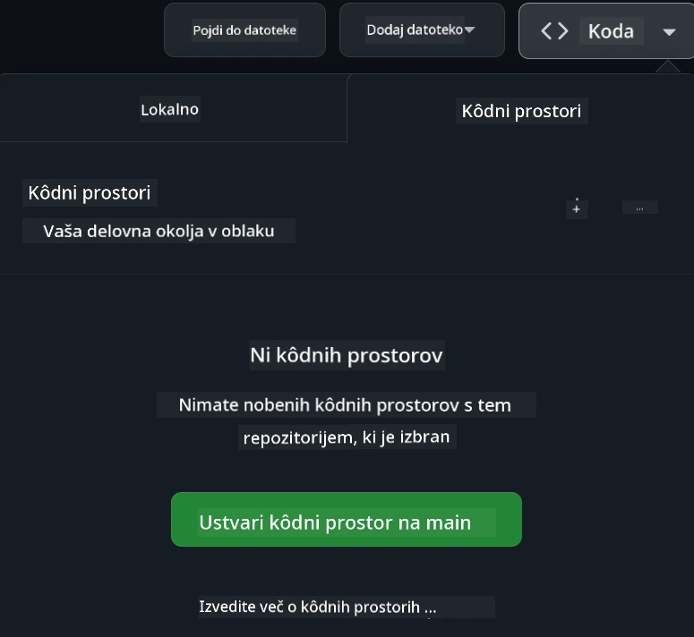

# Spletni razvoj za začetnike - učni načrt

Naučite se osnov spletnega razvoja s 12-tedenskim podrobnim tečajem, ki ga pripravljajo Microsoft Cloud Advocates. Vsaj ena od 24 lekcij poglobi znanje JavaScripta, CSS in HTML skozi praktične projekte, kot so terariji, razširitve brskalnika in vesoljske igre. Vključite se v kvize, razprave in praktične naloge. Izboljšajte svoje sposobnosti in optimizirajte zadrževanje znanja s pomočjo naše učinkovite projektno usmerjene pedagogike. Začnite svojo kodo danes!

Pridružite se Discord kanalu Azure AI Foundry in spoznajte strokovnjake ter druge razvijalce.

Sledite tem korakom, da začnete uporabljati te vire:
1. **Razvejite repozitorij**: Kliknite [](https://GitHub.com/microsoft/Web-Dev-For-Beginners/fork)
2. **Klonirajte repozitorij**:   `git clone https://github.com/microsoft/Web-Dev-For-Beginners.git`
3. [**Pridružite se Azure AI Foundry Discord kanalu in spoznajte strokovnjake ter druge razvijalce**](https://discord.com/invite/ByRwuEEgH4)

### 🌐 Podpora za več jezikov

#### Podprto preko GitHub akcije (samodejno in vedno ažurno)

> **Raje klonirate lokalno?**
>
> Ta repozitorij vključuje več kot 50 prevodov, kar znatno poveča velikost prenosa. Za kloniranje brez prevodov uporabite sparse checkout:
>
> **Bash / macOS / Linux:**
> ```bash
> git clone --filter=blob:none --sparse https://github.com/microsoft/Web-Dev-For-Beginners.git
> cd Web-Dev-For-Beginners
> git sparse-checkout set --no-cone '/*' '!translations' '!translated_images'
> ```
>
> **CMD (Windows):**
> ```cmd
> git clone --filter=blob:none --sparse https://github.com/microsoft/Web-Dev-For-Beginners.git
> cd Web-Dev-For-Beginners
> git sparse-checkout set --no-cone "/*" "!translations" "!translated_images"
> ```
>
> Tako boste dobili vse, kar potrebujete, da zaključite tečaj, z veliko hitrejšim prenosom.

**Če želite dodatne prevode, so podprti jeziki tu. [tukaj](https://github.com/Azure/co-op-translator/blob/main/getting_started/supported-languages.md)**

#### 🧑‍🎓 _Ste študent?_

Obiščite [**Student Hub stran**](https://docs.microsoft.com/learn/student-hub/?WT.mc_id=academic-77807-sagibbon), kjer boste našli vire za začetnike, študentske pakete in celo možnosti za brezplačni certifikatni kupon. To je stran, ki si jo želite shraniti med zaznamke in redno preverjati, saj vsebine mesečno osvežujemo.

### 📣 Obvestilo - Novi izzivi režima GitHub Copilot Agent za dokončanje!

Dodali smo nov izziv, poiščite "GitHub Copilot Agent Challenge 🚀" v večini poglavij. To je nov izziv, ki ga dokončate z uporabo GitHub Copilot in režima Agent. Če režima Agent še niste uporabljali, zmore ne le generirati besedilo, ampak tudi ustvarjati in urejati datoteke, izvajati ukaze in več.

### 📣 Obvestilo - _Nov projekt za izdelavo z uporabo Generativne AI_

Novo projekt AI asistenta je pravkar dodan, poglejte [projekt](./9-chat-project/README.md)

### 📣 Obvestilo - _Novi učni načrt_ o Generativni AI za JavaScript je pravkar izdan

Ne zamudite našega novega učnega načrta o Generativni AI!

Obiščite [https://aka.ms/genai-js-course](https://aka.ms/genai-js-course) za začetek!

Vsaka lekcija vsebuje nalogo za dokončanje, preverjanje znanja in izziv, ki vas vodi pri učenju tem, kot so:
- Uporaba navodil in inženiring navodil
- Generiranje aplikacij za besedilo in slike
- Iskalne aplikacije

Obiščite [https://aka.ms/genai-js-course](https://aka.ms/genai-js-course) in začnite!

## 🌱 Začetek

> **Učitelji**, vključili smo [nekaj predlogov](for-teachers.md), kako uporabiti ta učni načrt. Z veseljem sprejemamo vaše povratne informacije [na našem forumu za razprave](https://github.com/microsoft/Web-Dev-For-Beginners/discussions/categories/teacher-corner)!

**[Učenci](https://aka.ms/student-page/?WT.mc_id=academic-77807-sagibbon)**, za vsako lekcijo začnite s predpredavanjsko vajo in sledite gradivu predavanja, opravite različne dejavnosti in preverite svoje razumevanje s po-predavanjsko vajo.

Za izboljšanje vaše učne izkušnje se povežite s sovrstniki in skupaj delajte na projektih! Razprave so spodbujene v našem [forumu za razprave](https://github.com/microsoft/Web-Dev-For-Beginners/discussions), kjer je naša ekipa moderatorjev na voljo za vaša vprašanja.

Za nadaljnjo izobrazbo priporočamo raziskovanje [Microsoft Learn](https://learn.microsoft.com/users/wirelesslife/collections/p1ddcy5jwy0jkm?WT.mc_id=academic-77807-sagibbon) za dodatne študijske materiale.

### 📋 Nastavitev vašega okolja

Ta učni načrt že vsebuje razvojno okolje! Ko začnete, lahko izberete zagon učnega načrta v [Codespace](https://github.com/features/codespaces/) (_brskalniško okolje brez potrebe po namestitvi_), ali lokalno na svojem računalniku z urejevalnikom besedil, kot je [Visual Studio Code](https://code.visualstudio.com/?WT.mc_id=academic-77807-sagibbon).

#### Ustvarite svoj repozitorij
Da boste lahko zlahka shranjevali svoje delo, je priporočljivo, da ustvarite svojo kopijo tega repozitorija. To lahko naredite s klikom na gumb **Use this template** zgoraj na strani. S tem se bo ustvaril nov repozitorij na vašem GitHub računu s kopijo učnega načrta.

Sledite tem korakom:
1. **Razvejite repozitorij**: Kliknite na gumb "Fork" v zgornjem desnem kotu te strani.
2. **Klonirajte repozitorij**:   `git clone https://github.com/microsoft/Web-Dev-For-Beginners.git`

#### Zagon učnega načrta v Codespace

V svoji kopiji tega repozitorija, ki ste jo ustvarili, kliknite na gumb **Code** in izberite **Open with Codespaces**. Tako boste ustvarili nov Codespace, v katerem boste delali.



#### Zagon učnega načrta lokalno na vašem računalniku

Za zagon tega učnega načrta lokalno na računalniku boste potrebovali urejevalnik besedil, brskalnik in orodje ukazne vrstice. Naša prva lekcija, [Uvod v programske jezike in orodja](../../1-getting-started-lessons/1-intro-to-programming-languages), vas bo popeljala skozi različne možnosti za vsako od teh orodij, da izberete tisto, kar vam najbolj ustreza.

Priporočamo uporabo [Visual Studio Code](https://code.visualstudio.com/?WT.mc_id=academic-77807-sagibbon) kot urejevalnika, ki ima tudi vgrajen [Terminal](https://code.visualstudio.com/docs/terminal/basics/?WT.mc_id=academic-77807-sagibbon). Visual Studio Code lahko prenesete [tukaj](https://code.visualstudio.com/?WT.mc_id=academic-77807-sagibbon).
1. Klonirajte svoj repozitorij na svoj računalnik. To lahko storite s klikom na gumb **Code** in kopiranjem URL-ja:

    [CodeSpace](./images/createcodespace.png)

    Nato odprite [Terminal](https://code.visualstudio.com/docs/terminal/basics/?WT.mc_id=academic-77807-sagibbon) znotraj [Visual Studio Code](https://code.visualstudio.com/?WT.mc_id=academic-77807-sagibbon) in zaženite naslednji ukaz, pri čemer `<your-repository-url>` zamenjate z URL-jem, ki ste ga pravkar kopirali:

    ```bash 
    git clone <your-repository-url>
    ```

2. Odprite mapo v Visual Studio Code. To lahko storite s klikom na **File** > **Open Folder** in izbiro mape, ki ste jo pravkar klonirali.


>  Priporočene razširitve Visual Studio Code:
>
> * [Live Server](https://marketplace.visualstudio.com/items?itemName=ritwickdey.LiveServer&WT.mc_id=academic-77807-sagibbon) - za predogled HTML strani znotraj Visual Studio Code
> * [Copilot](https://marketplace.visualstudio.com/items?itemName=GitHub.copilot&WT.mc_id=academic-77807-sagibbon) - za pomoč pri hitrejšem pisanju kode

## 📂 Vsaka lekcija vključuje:

- neobvezno skicirkno beležko
- neobvezni dodatni video
- predhodni kviz za ogrevanje pred lekcijo
- pisno lekcijo
- za projektno usmerjene lekcije, vodnike korak za korakom za izdelavo projekta
- preverjanja znanja
- izziv
- dodatno branje
- nalogo
- [kviz po lekciji](https://ff-quizzes.netlify.app/web/)

> **Opomba o kvizih**: Vsi kvizi so shranjeni v mapi Quiz-app, skupaj 48 kvizov s po tremi vprašanji. Na voljo so [tukaj](https://ff-quizzes.netlify.app/web/), kviz aplikacijo je mogoče zagnati lokalno ali jo namestiti na Azure; sledite navodilom v mapi `quiz-app`.

## 🗃️ Lekcije

|     |                       Ime projekta                       |                            Proučevani koncepti                             | Cilji učenja                                                                                                                 |                                                         Povezana lekcija                                                          |         Avtor          |
| :-: | :------------------------------------------------------: | :------------------------------------------------------------------------: | ----------------------------------------------------------------------------------------------------------------------------- | :-------------------------------------------------------------------------------------------------------------------------------: | :--------------------: |
| 01  |                     Začetek                              |           Uvod v programiranje in osnovna orodja                           | Spoznajte osnovne temelje večine programskih jezikov in programske opreme, ki pomaga profesionalnim razvijalcem opravljati delo | [Uvod v programske jezike in orodja](./1-getting-started-lessons/1-intro-to-programming-languages/README.md)                     |         Jasmine        |
| 02  |                     Začetek                              |             Osnove GitHub-a, delo v skupini                               | Kako uporabljati GitHub v svojem projektu, kako sodelovati z drugimi na kodi                                                     |                            [Uvod v GitHub](./1-getting-started-lessons/2-github-basics/README.md)                                  |          Floor         |
| 03  |                     Začetek                              |                             Dostopnost                                     | Naučite se osnov spletne dostopnosti                                                                                                |                       [Osnove dostopnosti](./1-getting-started-lessons/3-accessibility/README.md)                                |       Christopher      |
| 04  |                        Osnove JS                         |                         Podatkovni tipi v JavaScript                       | Osnove podatkovnih tipov v JavaScript                                                                                              |                                       [Podatkovni tipi](./2-js-basics/1-data-types/README.md)                                    |         Jasmine        |
| 05  |                        Osnove JS                         |                         Funkcije in metode                                | Spoznajte funkcije in metode za upravljanje logike aplikacije                                                                      |                              [Funkcije in metode](./2-js-basics/2-functions-methods/README.md)                                   | Jasmine in Christopher |
| 06  |                        Osnove JS                         |                        Sprejemanje odločitev z JS                         | Naučite se ustvarjati pogoje v kodi z uporabo metod odločanja                                                                      |                                 [Sprejemanje odločitev](./2-js-basics/3-making-decisions/README.md)                             |         Jasmine        |
| 07  |                        Osnove JS                         |                            Polja in zanke                                | Delo s podatki z uporabo polj in zank v JavaScript                                                                                |                                   [Polja in zanke](./2-js-basics/4-arrays-loops/README.md)                                     |         Jasmine        |
| 08  |       [Terrarium](./3-terrarium/solution/README.md)       |                            HTML v praksi                                 | Ustvarite HTML za spletni terarij, osredotočite se na izdelavo postavitve                                                      |                                 [Uvod v HTML](./3-terrarium/1-intro-to-html/README.md)                                       |           Jen          |
| 09  |       [Terrarium](./3-terrarium/solution/README.md)       |                            CSS v praksi                                  | Ustvarite CSS za oblikovanje spletnega terarija, osredotočite se na osnove CSS in odzivnost strani                               |                                  [Uvod v CSS](./3-terrarium/2-intro-to-css/README.md)                                       |           Jen          |
| 10  |            [Terrarium](./3-terrarium/solution/README.md)            |                 JavaScript closures, manipulacija DOM                    | Izdelajte JavaScript za delovanje terarija z vmesnikom povleci-in-spusti, osredotočeno na closures in manipulacijo DOM           |                  [JavaScript closures, manipulacija DOM](./3-terrarium/3-intro-to-DOM-and-closures/README.md)                 |           Jen          |
| 11  |          [Typing Game](./4-typing-game/solution/README.md)          |                          Izdelava igre tipkanja                          | Naučite se uporabljati dogodke tipkovnice za upravljanje logike vaše JavaScript aplikacije                                        |                                [Programiranje na podlagi dogodkov](./4-typing-game/typing-game/README.md)                         |       Christopher      |
| 12  | [Zeleni brskalniški vtičnik](./5-browser-extension/solution/README.md) |                         Delo z brskalniki                               | Naučite se, kako brskalniki delujejo, njihovo zgodovino in kako pripraviti prvi elemente brskalniškega vtičnika                 |                               [O brskalnikih](./5-browser-extension/1-about-browsers/README.md)                                   |           Jen          |
| 13  | [Zeleni brskalniški vtičnik](./5-browser-extension/solution/README.md) | Gradnja obrazca, klic API-ja in shranjevanje spremenljivk v lokalno shrambo | Izdelajte JavaScript elemente brskalniškega vtičnika za klic API-ja z uporabo spremenljivk, shranjenih v lokalni shrambi        |                [API, obrazci in lokalna shramba](./5-browser-extension/2-forms-browsers-local-storage/README.md)             |           Jen          |
| 14  | [Zeleni brskalniški vtičnik](./5-browser-extension/solution/README.md) |          Ozadnji procesi v brskalniku, spletna zmogljivost              | Uporabite ozadnje procese brskalnika za upravljanje ikone vtičnika; spoznajte spletno zmogljivost in nekatere optimizacije     |             [Ozadna opravila in zmogljivost](./5-browser-extension/3-background-tasks-and-performance/README.md)             |           Jen          |
| 15  |           [Igra v vesolju](./6-space-game/solution/README.md)           |             Naprednejši razvoj iger z JavaScript                       | Spoznajte dedovanje z uporabo razredov in sestave ter vzorec Pub/Sub, v pripravah na izdelavo igre                               |                      [Uvod v napredni razvoj iger](./6-space-game/1-introduction/README.md)                                   |          Chris         |
| 16  |           [Igra v vesolju](./6-space-game/solution/README.md)           |                           Risanje na platno                             | Spoznajte Canvas API, ki se uporablja za risanje elementov na zaslon                                                              |                                [Risanje na platno](./6-space-game/2-drawing-to-canvas/README.md)                              |          Chris         |
| 17  |           [Igra v vesolju](./6-space-game/solution/README.md)           |                   Premikanje elementov po zaslonu                       | Odkrijte, kako lahko elementi pridobijo gibanje z uporabo kartezičnih koordinat in Canvas API-ja                                |                           [Premikanje elementov](./6-space-game/3-moving-elements-around/README.md)                            |          Chris         |
| 18  |           [Igra v vesolju](./6-space-game/solution/README.md)           |                          Zaznavanje trkov                              | Naredite, da elementi trkajo in medsebojno reagirajo z uporabo pritiskov tipk in zagotovite funkcijo ohlajevanja za večjo zmogljivost igre |                              [Zaznavanje trkov](./6-space-game/4-collision-detection/README.md)                              |          Chris         |
| 19  |           [Igra v vesolju](./6-space-game/solution/README.md)           |                             Beleženje rezultatov                        | Izvedite matematične izračune glede na stanje in uspešnost igre                                                                        |                                    [Beleženje rezultatov](./6-space-game/5-keeping-score/README.md)                            |          Chris         |
| 20  |           [Igra v vesolju](./6-space-game/solution/README.md)           |                     Zaključek in ponovni začetek igre                   | Spoznajte zaključek in ponovni začetek igre, vključno s čiščenjem virov in ponastavitvijo vrednosti spremenljivk                |                                [Pogoj zaključka](./6-space-game/6-end-condition/README.md)                                |          Chris         |
| 21  |         [Bankarska aplikacija](./7-bank-project/solution/README.md)     |                 HTML predloge in poti v spletni aplikaciji             | Naučite se ustvariti ogrodje večstranske spletne strani z uporabo usmerjanja in HTML predlog                                       |                            [HTML predloge in poti](./7-bank-project/1-template-route/README.md)                                |          Yohan         |
| 22  |         [Bankarska aplikacija](./7-bank-project/solution/README.md)     |                  Izdelava obrazca za prijavo in registracijo           | Spoznajte izdelavo obrazcev in obravnavo validacijskih rutin                                                                      |                                           [Obrazci](./7-bank-project/2-forms/README.md)                                       |          Yohan         |
| 23  |         [Bankarska aplikacija](./7-bank-project/solution/README.md)     |                   Metode pridobivanja in uporabe podatkov              | Kako podatki tečejo v in iz vaše aplikacije, kako jih pridobiti, shraniti in odstraniti                                           |                                            [Podatki](./7-bank-project/3-data/README.md)                                       |          Yohan         |
| 24  |         [Bankarska aplikacija](./7-bank-project/solution/README.md)     |                      Koncepti upravljanja stanja                      | Naučite se, kako vaša aplikacija ohranja stanje in kako ga programsko upravljati                                                  |                                [Upravljanje stanja](./7-bank-project/4-state-management/README.md)                              |          Yohan         |
| 25  | [Koda brskalnika/VScode](../../8-code-editor) | Delo z VScode | Naučite se uporabljati urejevalnik kode | [Uporaba urejevalnika VScode](./8-code-editor/1-using-a-code-editor/README.md) | Chris |
| 26  | [AI asistenti](./9-chat-project/README.md) | Delo z umetno inteligenco | Naučite se izdelati svojega AI asistenta | [Projekt AI asistenta](./9-chat-project/README.md) | Chris |

## 🏫 Pedagogika

Naš kurikulum je oblikovan z dvema ključnima pedagoškima načeloma v mislih:
* učenje na podlagi projektov
* pogosti kvizi

Program uči osnove JavaScript, HTML in CSS, pa tudi najnovejša orodja in tehnike, ki jih uporabljajo sodobni spletni razvijalci. Študenti bodo imeli priložnost pridobiti praktične izkušnje z izdelavo igre tipkanja, virtualnega terarija, okolju prijaznega brskalniškega vtičnika, igre v slogu vesoljskih osvajačev in bančne aplikacije za podjetja. Ob koncu serije bodo pridobili trdno razumevanje spletnega razvoja.

> 🎓 Prve lekcije tega kurikuluma lahko opravite kot [učno pot](https://docs.microsoft.com/learn/paths/web-development-101/?WT.mc_id=academic-77807-sagibbon) na Microsoft Learn!

Z zagotavljanjem usklajenosti vsebine s projekti je proces za študente bolj zanimiv, prav tako se izboljša zadrževanje konceptov. Poleg tega smo napisali več uvodnih lekcij o osnovah JavaScript, ki uvajajo pojme, povezane z videoposnetkom iz zbirke "[Serija za začetnike: JavaScript](https://channel9.msdn.com/Series/Beginners-Series-to-JavaScript/?WT.mc_id=academic-77807-sagibbon)", katere avtorji so prispevali k temu kurikulumu.

Poleg tega nizkorizični kviz pred razredom usmerja namen študenta k učenju teme, medtem ko drugi kviz po pouku zagotavlja nadaljnjo zadržnost. Ta kurikulum je zasnovan kot prilagodljiv in zabaven ter ga je mogoče opraviti v celoti ali delno. Projekti se začnejo majhni in postopoma postajajo bolj zapleteni do konca 12-tedenskega cikla.

Čeprav smo namerno izpustili uvajanje ogrodij JavaScript, da bi se osredotočili na osnovne veščine, potrebne kot spletni razvijalec pred uporabo ogrodja, je dober naslednji korak po dokončanju tega kurikuluma učenje Node.js preko druge zbirke videoposnetkov: "[Serija za začetnike: Node.js](https://channel9.msdn.com/Series/Beginners-Series-to-Nodejs/?WT.mc_id=academic-77807-sagibbon)".

> Oglejte si naše smernice [Kodeksa ravnanja](CODE_OF_CONDUCT.md) in [Prispevkov](CONTRIBUTING.md). Veselimo se vaših konstruktivnih povratnih informacij!


## 🧭 Dostop brez povezave

To dokumentacijo lahko uporabljate brez povezave z uporabo [Docsify](https://docsify.js.org/#/). Razvežite ta repozitorij, [namestite Docsify](https://docsify.js.org/#/quickstart) na svojo lokalno napravo, nato pa v osnovni mapi tega repozitorija vnesite `docsify serve`. Spletna stran bo na voljo na vratih 3000 na vašem lokalnem računalniku: `localhost:3000`.

## 📘 PDF
PDF vseh lekcij lahko najdete [tukaj](https://microsoft.github.io/Web-Dev-For-Beginners/pdf/readme.pdf).


## 🎒 Drugi tečaji

Naša ekipa pripravlja tudi druge tečaje! Oglejte si:

<!-- CO-OP TRANSLATOR OTHER COURSES START -->
### LangChain
[](https://aka.ms/langchain4j-for-beginners)
[](https://aka.ms/langchainjs-for-beginners?WT.mc_id=m365-94501-dwahlin)
[](https://github.com/microsoft/langchain-for-beginners?WT.mc_id=m365-94501-dwahlin)
---

### Azure / Edge / MCP / Agenti
[](https://github.com/microsoft/AZD-for-beginners?WT.mc_id=academic-105485-koreyst)
[](https://github.com/microsoft/edgeai-for-beginners?WT.mc_id=academic-105485-koreyst)
[](https://github.com/microsoft/mcp-for-beginners?WT.mc_id=academic-105485-koreyst)
[](https://github.com/microsoft/ai-agents-for-beginners?WT.mc_id=academic-105485-koreyst)

---
 
### Serija Generativna AI
[](https://github.com/microsoft/generative-ai-for-beginners?WT.mc_id=academic-105485-koreyst)
[-9333EA?style=for-the-badge&labelColor=E5E7EB&color=9333EA)](https://github.com/microsoft/Generative-AI-for-beginners-dotnet?WT.mc_id=academic-105485-koreyst)
[-C084FC?style=for-the-badge&labelColor=E5E7EB&color=C084FC)](https://github.com/microsoft/generative-ai-for-beginners-java?WT.mc_id=academic-105485-koreyst)
[-E879F9?style=for-the-badge&labelColor=E5E7EB&color=E879F9)](https://github.com/microsoft/generative-ai-with-javascript?WT.mc_id=academic-105485-koreyst)

---
 
### Osnovno učenje
[](https://aka.ms/ml-beginners?WT.mc_id=academic-105485-koreyst)
[](https://aka.ms/datascience-beginners?WT.mc_id=academic-105485-koreyst)
[](https://aka.ms/ai-beginners?WT.mc_id=academic-105485-koreyst)
[](https://github.com/microsoft/Security-101?WT.mc_id=academic-96948-sayoung)
[](https://aka.ms/webdev-beginners?WT.mc_id=academic-105485-koreyst)
[](https://aka.ms/iot-beginners?WT.mc_id=academic-105485-koreyst)
[](https://github.com/microsoft/xr-development-for-beginners?WT.mc_id=academic-105485-koreyst)

---
 
### Serija Copilot
[](https://aka.ms/GitHubCopilotAI?WT.mc_id=academic-105485-koreyst)
[](https://github.com/microsoft/mastering-github-copilot-for-dotnet-csharp-developers?WT.mc_id=academic-105485-koreyst)
[](https://github.com/microsoft/CopilotAdventures?WT.mc_id=academic-105485-koreyst)
<!-- CO-OP TRANSLATOR OTHER COURSES END -->

## Iskanje pomoči

Če naletite na težave ali imate vprašanja o ustvarjanju AI aplikacij, se pridružite drugim učencem in izkušenim razvijalcem v razpravah o MCP. To je podpirajoča skupnost, kjer so vprašanja dobrodošla in kjer se znanje prosto deli.

[](https://discord.gg/nTYy5BXMWG)

Če imate povratne informacije o izdelku ali naletite na napake med razvojem, obiščite:

[](https://aka.ms/foundry/forum)

## Licenca

To skladišče je licencirano pod licenco MIT. Za več informacij glejte datoteko [LICENSE](../../LICENSE).

---

<!-- CO-OP TRANSLATOR DISCLAIMER START -->
**Omejitev odgovornosti**:  
Ta dokument je bil preveden z uporabo AI prevajalske storitve [Co-op Translator](https://github.com/Azure/co-op-translator). Čeprav si prizadevamo za natančnost, upoštevajte, da lahko avtomatizirani prevodi vsebujejo napake ali netočnosti. Izvirni dokument v njegovem izvirnem jeziku je treba obravnavati kot glavni vir. Za ključne informacije priporočamo strokovni človeški prevod. Nismo odgovorni za morebitna nesporazumevanja ali napačne razlage, ki izhajajo iz uporabe tega prevoda.
<!-- CO-OP TRANSLATOR DISCLAIMER END -->