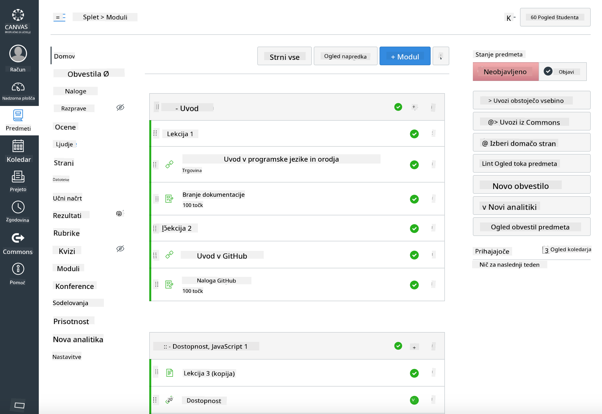

<!--
CO_OP_TRANSLATOR_METADATA:
{
  "original_hash": "75cb51f7ca9ea0b097ef4a1287e9290c",
  "translation_date": "2025-08-27T21:59:38+00:00",
  "source_file": "for-teachers.md",
  "language_code": "sl"
}
-->
## Za učitelje

Bi radi uporabili ta učni načrt v svoji učilnici? Kar izvolite!

Pravzaprav ga lahko uporabite kar v GitHubu z uporabo GitHub Classroom.

Za to naredite fork tega repozitorija. Za vsako lekcijo boste morali ustvariti ločen repozitorij, zato boste morali vsako mapo izvleči v ločen repozitorij. Na ta način lahko [GitHub Classroom](https://classroom.github.com/classrooms) vsako lekcijo obravnava ločeno.

Te [celotne smernice](https://github.blog/2020-03-18-set-up-your-digital-classroom-with-github-classroom/) vam bodo dale idejo, kako nastaviti svojo učilnico.

## Uporaba v Moodle, Canvas ali Blackboard

Ta učni načrt dobro deluje v teh sistemih za upravljanje učenja! Uporabite [datoteko za prenos v Moodle](../../../../../../../teaching-files/webdev-moodle.mbz) za celotno vsebino ali poskusite [datoteko Common Cartridge](../../../../../../../teaching-files/webdev-common-cartridge.imscc), ki vsebuje del vsebine. Moodle Cloud ne podpira celotnih izvozov Common Cartridge, zato je bolje uporabiti datoteko za prenos v Moodle, ki jo je mogoče naložiti v Canvas. Prosimo, sporočite nam, kako lahko izboljšamo to izkušnjo.

  
> Učni načrt v učilnici Moodle

  
> Učni načrt v Canvasu

## Uporaba repozitorija v trenutni obliki

Če želite uporabiti ta repozitorij v trenutni obliki, brez uporabe GitHub Classroom, je to prav tako mogoče. Svojim študentom boste morali sporočiti, katero lekcijo naj skupaj predelajo.

V spletnem formatu (Zoom, Teams ali drugem) lahko oblikujete ločene sobe za kvize in mentorirate študente, da se pripravijo na učenje. Nato povabite študente k reševanju kvizov in oddaji odgovorov kot 'issues' ob določenem času. Podobno lahko ravnate z nalogami, če želite, da študenti sodelujejo javno.

Če imate raje bolj zaseben format, prosite študente, naj naredijo fork učnega načrta, lekcijo za lekcijo, v svoje zasebne GitHub repozitorije in vam omogočijo dostop. Nato lahko kvize in naloge opravijo zasebno ter vam jih oddajo prek issues v vašem učnem repozitoriju.

Obstaja veliko načinov, kako to prilagoditi spletnemu učnemu formatu. Prosimo, sporočite nam, kaj vam najbolj ustreza!

## Prosimo, delite svoje misli!

Želimo, da ta učni načrt deluje za vas in vaše študente. Povežite se z nami v [učiteljskem kotičku](https://github.com/microsoft/Web-Dev-For-Beginners/discussions/categories/teacher-corner) in odprite [**novo težavo**](https://github.com/microsoft/Web-Dev-For-Beginners/issues/new/choose) za kakršne koli zahteve, napake in povratne informacije.

---

**Omejitev odgovornosti**:  
Ta dokument je bil preveden z uporabo storitve za prevajanje z umetno inteligenco [Co-op Translator](https://github.com/Azure/co-op-translator). Čeprav si prizadevamo za natančnost, vas prosimo, da upoštevate, da lahko avtomatizirani prevodi vsebujejo napake ali netočnosti. Izvirni dokument v njegovem maternem jeziku je treba obravnavati kot avtoritativni vir. Za ključne informacije priporočamo profesionalni človeški prevod. Ne prevzemamo odgovornosti za morebitna nesporazume ali napačne razlage, ki bi nastale zaradi uporabe tega prevoda.