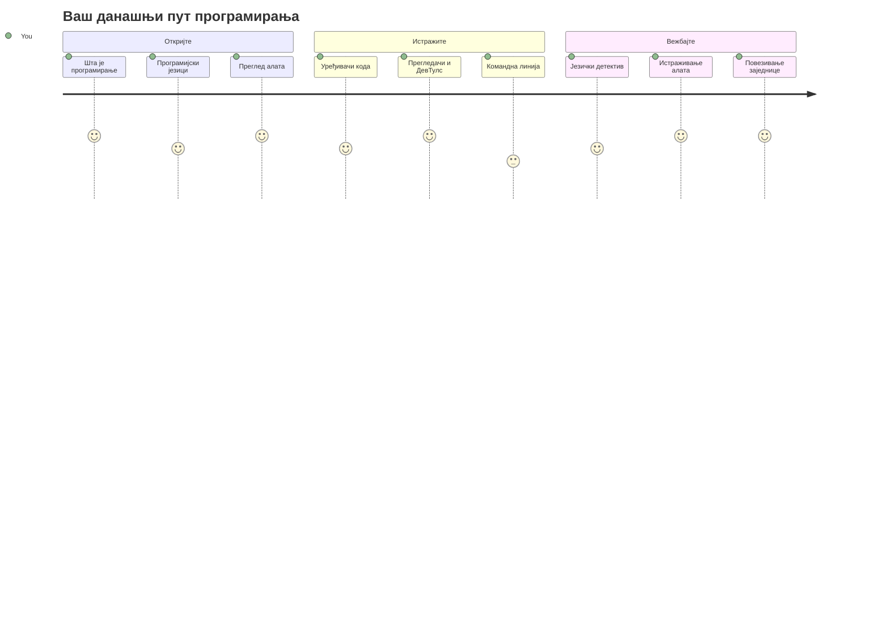
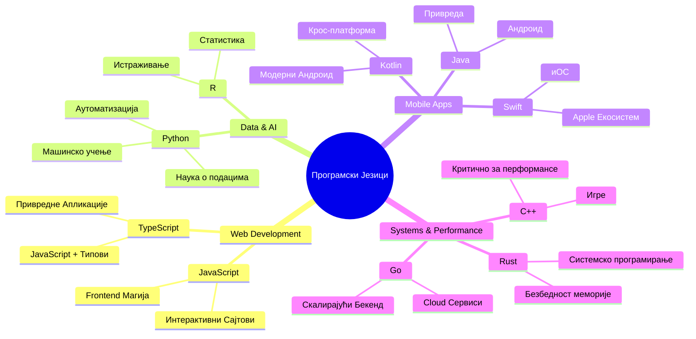
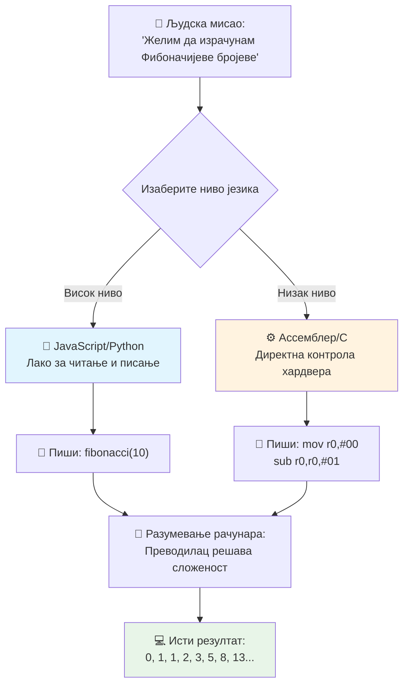
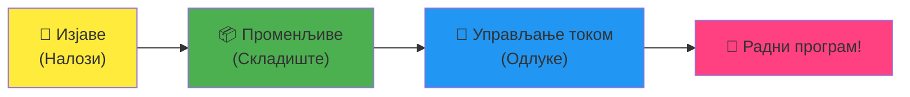
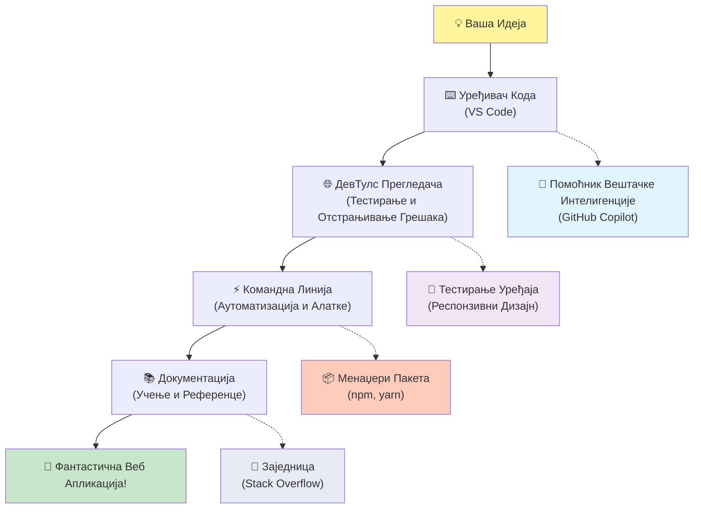
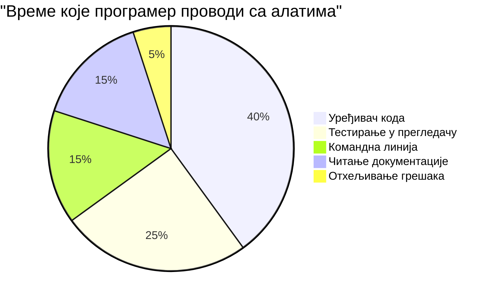
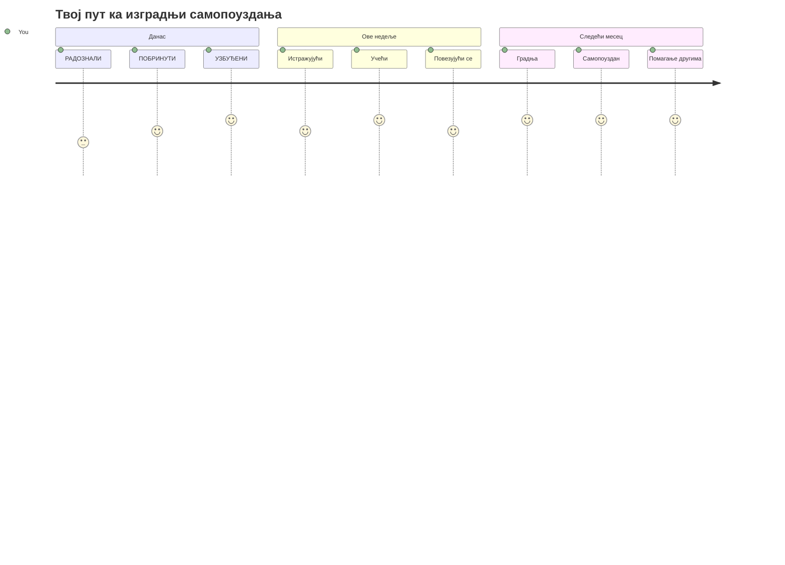

<!--
CO_OP_TRANSLATOR_METADATA:
{
  "original_hash": "d45ddcc54eb9232a76d08328b09d792e",
  "translation_date": "2026-01-07T08:30:02+00:00",
  "source_file": "1-getting-started-lessons/1-intro-to-programming-languages/README.md",
  "language_code": "sr"
}
-->
# Увод у програмске језике и савремене алате за програмере
 
Здраво, будући програмеру! 👋 Могу ли ти рећи нешто што ме и данас сваког дана потресе? Ускоро ћеш открити да програмирање није само око рачунара – то су истинске суперсиле које ти омогућавају да оживиш своје најлуђе идеје!

Знаш онај тренутак када користиш своју омиљену апликацију и све једноставно савршено функционише? Када тапнеш на дугме и догоди се нешто магично што те натера да кажеш „вау, како су то урадили?“ Па, тај неко баш као ти – вероватно седи у свом омиљеном кафићу у 2 ујутру са трећом еспресо кафом – је написао код који је створио ту магију. И ево шта ће ти одузети дах: на крају овог часа нећеш само разумети како су то урадили, већ ће те копкати да и сам пробаш!

Види, сасвим је у реду ако ти програмирање сада делује застрашујуће. Када сам ја почео, стварно сам мислио да мораш бити неки математички геније или да програмираш од пет година. Али ево шта ми је потпуно променило начин размишљања: програмирање је управо као учење да водиш разговор на новом језику. Почнеш са „здраво“ и „хвала“, па онда наручујеш кафу и пре него што приметиш, водиш дубоке филозофске разговоре! Само што су у овом случају ти разговори са рачунарима, а искрено? Они су најстрпљивији саговорници – никада не осуђују твоје грешке и увек су спремни да покушају поново!

Данас ћемо истражити невероватне алате који савремени веб развој чине не само могућим, већ и озбиљно заразним. Причам о управо тим иста којима програмирају у Netflix, Spotify и твојој омиљеној инди апликационој студији сваки дан. И ево дела који ће те натерати да заиграш од радости: већина ових професионалних, индустријских алата је у потпуности бесплатна!


> Скечнот од [Tomomi Imura](https://twitter.com/girlie_mac)


## Видимо шта већ знаш!

Пре него што заронимо у забавне ствари, занимљиво ми је – шта ти већ знаш о овом свету програмирања? И слушај, ако гледаш ова питања и мислиш „апсолутно немам појма о овоме“, то није само у реду, то је савршено! То значи да си баш на правом месту. Замисли овај квиз као загревање пре тренинга – само полако загревамо те мишиће мозга!

[Преузми квиз пре часа](https://forms.office.com/r/dru4TE0U9n?origin=lprLink)


## Авантура која нам предстоји заједно

У реду, стварно сам узбуђен због онога што ћемо данас истражити! Искрено, волео бих да видим твоје лице када ти неки од ових концепата кликну. Ово је невероватно путовање у које крећемо:

- **Шта је програмирање у ствари (и зашто је најцјењенија ствар икада!)** – Открићемо како је код буквално невидљива магија која покреће све око тебе, од аларма који зна када је понедељак ујутру до алгоритма који савршено бира Netflix препоруке
- **Програмски језици и њихове невероватне личности** – Замисли да уђеш на журку где свака особа има сасвим различите суперсиле и начине решавања проблема. Тако изгледа свет програмских језика, и обожаваћеш да их упознаш!
- **Основни грађевински блокови који стварају дигиталну магију** – Замисли их као најбољи креативни LEGO сет. Када схватиш како се ови делови међусобно уклапају, схватићеш да можеш буквално направити било шта што ти маштања пожеле
- **Професионални алати који ће ти дати осећај као да си управо добио чаробни штапић** – Нисам драматичан – ови алати ће ти стварно дати осећај као да имаш суперсиле, а најбоље од свега? То су исти алати које користе професионалци!

> 💡 **Ево шта је важно**: Немој ни да помислиш да треба све да меморишеш данас! Сада желим само да осетиш ту искру узбуђења о томе шта је могуће. Детаљи ће се природно учврстити док заједно вежбамо – тако се прави учење дешава!

> Ову лекцију можеш похађати на [Microsoft Learn](https://docs.microsoft.com/learn/modules/web-development-101/introduction-programming/?WT.mc_id=academic-77807-sagibbon)!

## Па шта тачно *је* програмирање?

У реду, хајде да се позабавимо питањем од милион долара: шта је програмирање у ствари?

Причаћу ти причу која ми је потпуно променилa начин размишљања о овоме. Прошле недеље сам покушавао да објасним мами како да користи наш нови даљински управљач за паметни ТВ. Зауставио сам се да кажем нешто као „Притисни црвено дугме, али не оно велико црвено, мало црвено са леве стране... не, други твој леви... ок, сада држи две секунде, не једну, не три...“ Звучи познато? 😅

То је програмирање! То је уметност давања невероватно детаљних, корак по корак упутстава нечему што је изузетно моћно али му треба све садржано објашњење. Само што уместо да објашњаваш мами (која може питати „које црвено дугме?!“), ти објашњаваш рачунару (који једноставно ради баш оно што кажеш, чак и ако оно што си рекао није баш оно што си мислио).

Ево шта ми је одузело дах када сам први пут научио: рачунари су заправо прилично једноставни у својој сржи. Они буквално разумеју само две ствари – 1 и 0, што је у основи „да“ и „не“ или „укључено“ и „искључено.“ То је све! Али ево где постаје магично – не морамо да причамо у 1-ицама и 0-ицама као у Матриксу. Ту наступају **програмски језици**. Они су као најбољи преводилац на свету који узима твоје потпуно нормалне људске мисли и претвара их у језик који рачунар разуме.

И ево шта ме и даље свако јутро стварно потресе када се пробудим: буквално *све* дигитално у твом животу почело је са неким баш као ти, вероватно у пиџами са шољом кафе, куцајући код на лаптопу. Та Instagram филтер који ти даје савршен изглед? Неки програмер је направио тај код. Препорука која те довела до твоје нове омиљене песме? Програмер је направио тај алгоритам. Апликација која ти помаже да поделиш рачун за вечеру са пријатељима? Да, неко је помислио „ово је досадно, могао бих да поправим ово“ и онда... јесте!

Када научиш да програмираш, ти не учиш само нову вештину – постајеш део ове невероватне заједнице решавача проблема који проводе своје дане размишљајући: „Шта ако бих могао да направим нешто што неког учини дан бољим?“ Искрено, има ли ичег кул од тога?

✅ **Забавна чињеница**: Ево нешто супер кул што можеш да потражиш када будеш имао слободног момента – ко мислиш да је први светски програмер? Даћу ти трачак: можда није онај кога очекујеш! Прича о овој особи је апсолутно фасцинантна и показује да програмирање је оduвек било о креативном решавању проблема и размишљању изван оквира.

### 🧠 **Време за проверу: Како се осећаш?**

**Одвој мало тренутак да размислиш:**
- Да ли ти сада има смисла идеја „давања упутстава рачунарима“?
- Можеш ли да се сетиш неког свакодневног задатка који би желео да аутоматизујеш помоћу програмирања?
- Која питања ти сада лебде по глави о овом целом свету програмирања?

> **Запамти**: Потпуно је нормално ако ти неки концепти сада делују мутно. Учење програмирања је као учење новог језика – треба времена да мозак створи те неуралне везе. Сјајно радиш!

## Програмски језици су као различити укуси магије

У реду, ово ће вероватно звучати чудно, али остани са мном – програмски језици су баш као различите врсте музике. Размишљај о томе: имаш џез који је смирен и импровизацијски, рок који је моћан и једноставан, класичну музику која је елегантна и структурисана, и хип-хоп који је креативан и изражајан. Сваки стил има свој угођај, своју заједницу страствених фанова, и сваки је савршен за различита расположења и прилике.

Програмски језици раде управо тако! Не би користио исти језик да направиш забавну мобилну игру као за обраду огромне количине климатских података, баш као што не би пуштао дет метал на час јоге (па, већина часова јоге у сваком случају! 😄).

Али ево шта ми је сваки пут кад размислим о томе апсолутно невероватно: ти језици су као најстрпљивији, најпаметнији преводилац на свету који седи баш поред тебе. Можеш да изразиш своје идеје на начин који је природан твом људском мозгу, а они све невероватно компликоване ствари преводе у 1-ице и 0-ице које рачунари стварно разумеју. Као да имаш друга који савршено течно говори и „људску креативност“ и „рачунарску логику“ – и никада не умара се, никада не треба паузу за кафу и никада те не суди ако питаш исто питање два пута!

### Популарни програмски језици и њихова употреба


| Језик | Најбоље за | Зашто је популаран |
|----------|----------|------------------|
| **JavaScript** | Веб развој, кориснички интерфејси | Ради у прегледачима и покреће интерактивне сајтове |
| **Python** | Наука о подацима, аутоматизација, вештачка интелигенција | Једноставан за читање и учење, моћне библиотеке |
| **Java** | Пословне апликације, Андроид апликације | Платформски независан, поуздан за велике системе |
| **C#** | Виндовс апликације, развој игара | Јака подршка Microsoft екосистема |
| **Go** | Облачно рачунање, бекенд системи | Брз, једноставан, дизајниран за савремено рачунање |

### Језици високог нивоа у односу на језике ниског нивоа

У реду, ово је искрено био концепт који ми је поломио мозак када сам први пут почео да учим, па ћу поделити поређење које ми је коначно све учинило јасним – и заиста се надам да ће помоћи и теби!

Замисли да си у земљи у којој не говориш језик, а жустро ти треба најближи тоалет (сви смо ту били, зар не? 😅):

- **Програмирање ниског нивоа** је као да тако добро научиш локални дијалекат да можеш да ћаскаш са бабом која продаје воће на углу користећи културолошке референце, локални сленг и унутрашње шале које разуме само неко ко је одрастао тамо. Супер импресивно и невероватно ефикасно... ако случајно течно говориш! Али прилично претерано када само покушаваш да пронађеш тоалет.

- **Програмирање високог нивоа** је као да имаш тог невероватног локалног друга који те заиста разуме. Можеш да кажеш „Употреба ми стварно треба да нађем тоалет“ обичним енглеским, а он обави сав културолошки превод и даје ти упутства на начин који савршено има смисла твом не-локалном мозгу.

У терминологији програмирања:
- **Језици ниског нивоа** (као што су Assembly или C) ти омогућавају невероватно детаљне разговоре са стварним хардвером рачунара, али мораш да размишљаш као машина, што је... па, рећи ћемо да је то велики ментални пресек!
- **Језици високог нивоа** (као JavaScript, Python или C#) ти омогућавају да размишљаш као човек док они обављају сав говор машине иза кулиса. Плус, имају невероватно гостољубиве заједнице пуне људи који се сећају како је било бити нови и искрено желе да помогну!

Погоди које ћу ја препоручити да почнеш да учиш? 😉 Језици високог нивоа су као тренинг точкови које никада нећеш хтети да скинеш јер цео процес чине много забавнијим!


### Пустим те да видиш зашто су језици високог нивоа много пријатнији

У реду, показаћу ти нешто што савршено илуструје зашто сам се заљубио у језике високог нивоа, али прво – мораш ми обећати нешто. Када будеш видео први пример кода, не паничи! Требало би да изгледа застрашујуће. И управо то је поента!

Погледаћемо исти задатак написан у два потпуно различита стила. Обојица праве тзв. Фибоначијев низ – то је прелепи математички низ где је сваки број збир претходна два: 0, 1, 1, 2, 3, 5, 8, 13... (Забавна чињеница: овај образац налазиш буквално свуда у природи – у спиралама семенки сунцокрета, у облицима шишарки, па чак и у формирању галаксија!)

Спреман да видиш разлику? Хајде!

**Језик високог нивоа (JavaScript) – пријатељски човеку:**

```javascript
// Корак 1: Основна поставка Фибоначија
const fibonacciCount = 10;
let current = 0;
let next = 1;

console.log('Fibonacci sequence:');
```

**Ово код ради:**
- **Декларати** константу која одређује колико Фибоначијевих бројева желимо да генеришемо
- **Иницијализовати** две променљиве које прате тренутни и следећи број у низу
- **Поставити** почетне вредности (0 и 1) које дефинишу Фибоначијев образац
- **Приказати** наслов како бисмо означили наш излаз

```javascript
// Корак 2: Генеришите низ са петљом
for (let i = 0; i < fibonacciCount; i++) {
  console.log(`Position ${i + 1}: ${current}`);
  
  // Израчунајте следећи број у низу
  const sum = current + next;
  current = next;
  next = sum;
}
```

**Објашњење шта се овде дешава:**
- **Прелазити** кроз сваки положај у низу помоћу `for` петље
- **Приказати** сваки број са његовом позицијом користећи форматирање шаблона
- **Израчунати** следећи Фибоначијев број сабирањем тренутних и следећих вредности
- **Ажурирати** наше променљиве за праћење да пређемо на следећу итеријацију

```javascript
// Корак 3: Модеран функционални приступ
const generateFibonacci = (count) => {
  const sequence = [0, 1];
  
  for (let i = 2; i < count; i++) {
    sequence[i] = sequence[i - 1] + sequence[i - 2];
  }
  
  return sequence;
};

// Пример коришћења
const fibSequence = generateFibonacci(10);
console.log(fibSequence);
```

**У горњем примеру:**
- **Направио** сам поновљиву функцију користећи савремену стрелицу (`arrow`) синтаксу
- **Креирао** сам низ (array) да сачувам целу секвенцу, уместо да је приказујем један по један
- **Користио** сам индексирање низа да израчунам сваки нови број из претходних вредности
- **Вратио** сам целу секвенцу ради флексибилне употребе у другим деловима програма

**Језик ниског нивоа (ARM Assembly) – пријатељ рачунару:**

```assembly
 area ascen,code,readonly
 entry
 code32
 adr r0,thumb+1
 bx r0
 code16
thumb
 mov r0,#00
 sub r0,r0,#01
 mov r1,#01
 mov r4,#10
 ldr r2,=0x40000000
back add r0,r1
 str r0,[r2]
 add r2,#04
 mov r3,r0
 mov r0,r1
 mov r1,r3
 sub r4,#01
 cmp r4,#00
 bne back
 end
```

Примети начин на који верзија у JavaScript-у чита као енглеска упутства, док верзија у Assembly користи мистериозне команде које директно контролишу процесор рачунара. Обе раде потпуно исти задатак, али језик високог нивоа је много лакши за људе да разумеју, пишу и одржавају.

**Кључне разлике које ћеш приметити:**
- **Читљивост**: JavaScript користи описна имена као `fibonacciCount` док Assembly користи тајанствене ознаке као `r0`, `r1`
- **Коментари**: Језици високог нивоа охрабрују објашњавајуће коментаре који чине код самодокументованим  
- **Структура**: Логички ток ЈаваСкрипта одговара томе како људи размишљају о проблемима корак по корак  
- **Одржавање**: Ажурирање ЈаваСкрипт верзије за различите захтеве је једноставно и јасно  

✅ **О Фибоначијевом низу**: Овај апсолутно предиван бројчани образац (где је сваки број једнак збиру претходна два: 0, 1, 1, 2, 3, 5, 8...) појављује се буквално *свуда* у природи! Пронаћи ћете га у спиралама сунцокрета, пинећим шишкама, облику шкољки наутилиуса, па чак и у начину на који гране дрвећа расту. Веома је фасцинантно како математика и код могу помоћи да разумемо и пресликaмо обрасце које природа користи да створи лепоту!  

## Грађевински блокови који стварају магију  

У реду, сада када сте видели како изгледају језици програмирања у пракси, хајде да разложимо основне делове који чине буквално сваки програм икада написан. Замислите их као суштинске састојке ваше омиљене рецептуре – када разумете шта сваки ради, моћи ћете да читате и пишете код у готово сваком језику!

Ово је помало као учење граматике програмирања. Сећате се у школи када сте учили о именицама, глаголима и како се слажу реченице? Програмирање има своју верзију граматике, а искрено, она је много логичнија и попустљивија од граматике енглеског језика! 😄  

### Наредбе: Упутства корак по корак  

Хајде да почнемо са **наредбама** – оне су као појединачне реченице у разговору са вашим рачунаром. Свака наредба говори рачунару да уради једну одређену ствар, као да дајете упутства: "Скрените лево овде," "Стани на црвено светло," "Парк ин у то место."

Што највише волим код наредби је то колико су обично читљиве. Погледајте ово:  

```javascript
// Основне изјаве које извршавају појединачне радње
const userName = "Alex";                    
console.log("Hello, world!");              
const sum = 5 + 3;                         
```
  
**Ево шта овај код ради:**  
- **Декларише** константну променљиву за чување корисничког имена  
- **Приказује** поздравну поруку на конзоли  
- **Израчунава** и чува резултат математичке операције  

```javascript
// Изјаве које комуницирају са веб страницама
document.title = "My Awesome Website";      
document.body.style.backgroundColor = "lightblue";
```
  
**Корак по корак, ево шта се дешава:**  
- **Модификује** наслов странице који се појављује у картици прегледача  
- **Промењује** боју позадине целог тела странице  

### Променљиве: Систем меморије вашег програма  

У реду, **променљиве** су искрено један од мојих апсолутно омиљених концепата за предавање јер су веома сличне стварима које већ користите сваки дан!

Размислите о листи контаката на вашем телефону. Не памтите бројеве свих људи – уместо тога сачувате „Мама“, „Најбољи пријатељ“ или „Пицерија која доставља до 2 ујутро“ и пустите телефон да се сети стварних бројева. Променљиве функционишу баш тако! Оне су као означене посуде у које ваш програм може да смешта податке и касније их вади помоћу имена које има смисла.

Ево шта је стварно кул: променљиве се могу мењати док ваш програм ради (отуда и назив "променљива" – схватате игру речи?). Баш као што можете ажурирати контакт пицерије када пронађете још боље место, променљиве се могу мењати како програм учи нове информације или како се ситуација мења!

Хајде да вам покажем колико ово може бити једноставно:  

```javascript
// Корак 1: Креирање основних променљивих
const siteName = "Weather Dashboard";        
let currentWeather = "sunny";               
let temperature = 75;                       
let isRaining = false;                      
```
  
**Разумевање ових концепата:**  
- **Чување** неизмењивих вредности у `const` променљивима (као име сајта)  
- **Коришћење** `let` за вредности које се могу мењати током рада програма  
- **Додељивање** различитих типова података: стрингови (текст), бројеви и булови (тачно/нетачно)  
- **Избор** описних имена која објашњавају шта свака променљива садржи  

```javascript
// Корак 2: Рад са објектима за груписање повезаних података
const weatherData = {                       
  location: "San Francisco",
  humidity: 65,
  windSpeed: 12
};
```
  
**У горњем примеру смо:**  
- **Креирали** објекат да групишемо повезане информације о времену  
- **Организовали** више података под једним именом променљиве  
- **Користили** парове кључ-вредност да јасно означимо сваки део информације  

```javascript
// Корак 3: Коришћење и ажурирање променљивих
console.log(`${siteName}: Today is ${currentWeather} and ${temperature}°F`);
console.log(`Wind speed: ${weatherData.windSpeed} mph`);

// Ажурирање променљивих које се мењају
currentWeather = "cloudy";                  
temperature = 68;                          
```
  
**Размотримо сваки део:**  
- **Приказује** информације користећи тзв. шаблонске литерале са `${}` синтаксом  
- **Приступа** својствима објекта преко тачкасте нотације (`weatherData.windSpeed`)  
- **Ажурира** променљиве декларисане са `let` да одражавају променљиве услове  
- **Комбинује** више променљивих да би се креирале смислене поруке  

```javascript
// Корак 4: Модерно деструктурирање за чистији код
const { location, humidity } = weatherData; 
console.log(`${location} humidity: ${humidity}%`);
```
  
**Шта треба да знате:**  
- **Издваја** одређена својства из објеката помоћу деструктурирања  
- **Креира** аутоматски нове променљиве са истим именима као кључеви у објекту  
- **Поједностављује** код избегавањем понављања тачкасте нотације  

### Контролни ток: Учите свој програм да размишља  

У реду, овде програмирање постаје апсолутно фасцинантно! **Контролни ток** је у основи учење вашег програма да доноси паметне одлуке, баш као што то ви радите сваки дан без размишљања.

Замислите ово: јутрос сте вероватно прошли кроз нешто као "Ако пада киша, узећу кишобран. Ако је хладно, обући ћу јакну. Ако касним, прескочићу доручак и узети кафу у пролазу." Ваш мозак природно прати ову if-then логику десетина пута дневно!

Ово је оно што програме чини интелигентним и живим уместо да прате неки досадни, предвидљиви сценарио. Они могу да погледају ситуацију, процене шта се дешава и одговоре адекватно. То је као да програму дајете мозак који може да се прилагођава и доноси одлуке!

Желите видети како ово лепо функционише? Погледајте:  

```javascript
// Корак 1: Основна условна логика
const userAge = 17;

if (userAge >= 18) {
  console.log("You can vote!");
} else {
  const yearsToWait = 18 - userAge;
  console.log(`You'll be able to vote in ${yearsToWait} year(s).`);
}
```
  
**Овде овај код ради:**  
- **Проверава** да ли корисникова старост испуњава услов за гласање  
- **Извршава** различите блокове кода у зависности од резултата услова  
- **Израчунава** и приказује колико још има до могућности гласања ако је испод 18  
- **Пружа** конкретне и корисне повратне информације за сваки сценарио  

```javascript
// Корак 2: Више услова са логичким операторима
const userAge = 17;
const hasPermission = true;

if (userAge >= 18 && hasPermission) {
  console.log("Access granted: You can enter the venue.");
} else if (userAge >= 16) {
  console.log("You need parent permission to enter.");
} else {
  console.log("Sorry, you must be at least 16 years old.");
}
```
  
**Разлагање шта се овде дешава:**  
- **Комбинује** више услова користећи `&&` (и) оператор  
- **Прави** хијерархију услова коришћењем `else if` за више сценарија  
- **Обрађује** све могуће случајеве са коначним `else` исказом  
- **Пружа** јасне, конкретне повратне информације за сваку различиту ситуацију  

```javascript
// Корак 3: Кратак услов са тернарним оператором
const votingStatus = userAge >= 18 ? "Can vote" : "Cannot vote yet";
console.log(`Status: ${votingStatus}`);
```
  
**Што треба да запамтите:**  
- **Користите** тернарни оператор (`? :`) за једноставне услове са две могућности  
- **Пишите** прво услов, затим `?`, па резултат ако је услов тачан, па `:`, па резултат ако није  
- **Примените** овај образац када треба доделити вредности на основу услова  

```javascript
// Корак 4: Обрада више специфичних случајева
const dayOfWeek = "Tuesday";

switch (dayOfWeek) {
  case "Monday":
  case "Tuesday":
  case "Wednesday":
  case "Thursday":
  case "Friday":
    console.log("It's a weekday - time to work!");
    break;
  case "Saturday":
  case "Sunday":
    console.log("It's the weekend - time to relax!");
    break;
  default:
    console.log("Invalid day of the week");
}
```
  
**Овај код постиже следеће:**  
- **Упоређује** вредност променљиве са више специфичних случајева  
- **Групише** сличне случајеве заједно (радни дани против викенда)  
- **Извршава** одговарајући блок кода када се пронађе поклапање  
- **Укључује** `default` случај за непредвиђене вредности  
- **Користи** `break` изјаве да спречи наставак извршавања ка следећем случају  

> 💡 **Аналогија из стварног света**: Размислите о контролном току као о најстрпљивијем GPS-у који вам даје упутства. Може рећи: "Ако је гужва на Главној улици, иди ауто-путем. Ако је ауто-пут блокиран због радова, пробај обилазницу." Програми користе управо ову врсту условне логике да интелигентно реагују на различите ситуације и увек пруже корисницима најбоље могуће искуство.  

### 🎯 **Провера знања: Мастер основних блокова**  

**Хајде да видимо како стојите са основама:**  
- Можете ли објаснити разлику између променљиве и наредбе својим речима?  
- Смислите сценарио из стварног живота где бисте користили if-then одлуку (као у примеру са гласањем)  
- Која вас је ствар о логици програмирања највише изненадила?  

**Брзи подстицај самопоуздања:**  

✅ **Шта следи**: Ускоро ћемо заједно уживати у дубљем уласку у ове концепте док настављамо ову невероватну авантуру! За сада, само се усредсредите на узбуђење због свих невероватних могућности које вас чекају. Специфичне вештине и технике ће вам природно постати пријатне како будемо вежбали заједно – обећавам да ће ово бити далеко забавније него што можда очекујете!  

## Алати заната  

У реду, искрено сам толико узбуђен да се тешко сналазим! 🚀 Управо ћемо причати о невероватним алатима који ће вам дати осећај као да су вам управо додељене кључеве дигиталног свемирског брода.

Знате како кухар има савршено избалансиране ножеве који су као продужетак руку? Или како музичар има ону гитару која као да пева чим је додирне? Па, програмери имају своју верзију ових магичних алата, и ево шта ће вас апсолутно одушевити – већина њих је потпуно бесплатна!

Практично скачем од среће што вам могу поделити ове алате јер су потпуно револуционисали начин на који градимо софтвер. Причамо о AI асистентима за кодирање који могу помоћи да напишете свој код (зар се шалим?), о облачним оквирима у којима можете градити целе апликације буквално било где са Wi-Fi-јем и о алаткама за отклањање грешака толико супериорним да су као да имате рендген визију у програмима.

И ево дела који ми још увек изазива трнце: ово нису „почетнички алати“ које ћете прерасти. Ово су иста она професионална средства која користе програмери у Google-у, Netflix-у и оним малим студијима апликација које волите баш у овом тренутку. Осетићете се као прави професионалац користећи их!  


### Едитори кода и IDE-ови: Ваши нови дигитални најбољи пријатељи  

Причајмо о едиторима кода – они ће заиста постати ваша нова омиљена места за боравак! Замислите их као ваше лично уточиште за кодирање у којем ћете проводити већину времена стварајући и усавршавајући своје дигиталне креације.

Али ево шта је потпуно магично код модерних едитора: они нису само фини уређивачи текста. Они су као најбриљантнији, најпотпорнији ментор за кодирање који седи поред вас 24/7. Они хватају правописне грешке пре него што их уопште приметите, предлажу побољшања која вас чине генијем, помажу вам да разумете шта сваки део кода ради, а неки чак могу и предвидети шта ћете укуцати и понудити да заврше ваше мисли!

Сећам се када сам први пут открио аутоматски допуњавач – буквално сам се осећао као да живим у будућности. Почнете да куцате нешто, а едитор каже: „Хеј, да ли си мислио на ову функцију која ради баш оно што ти треба?“ Као да имате читаоца мисли као пријатеља за кодирање!

**Шта овај едитор чини тако невероватним?**  

Модерни едитори кода нуде импресиван низ карактеристика дизајнираних да повећају вашу продуктивност:  

| Карактеристика | Шта ради | Зашто помаже |  
|----------------|----------|--------------|  
| **Хајлајтинг синтаксе** | Боји различите делове кода | Олакшава читање и уочавање грешака |  
| **Аутоматско довршавање** | Предлаже код док куцате | Убрзава кодирање и смањује правописне грешке |  
| **Алатке за отклањање грешака** | Помажу у проналажењу и исправљању грешака | Штеде сате времена при решавању проблема |  
| **Проширења** | Додају специјализоване функције | Прилагодују едитор било којој технологији |  
| **AI асистенти** | Предлажу код и објашњења | Убрзавају учење и продуктивност |  

> 🎥 **Видеоресурс**: Желите да видите ове алате у акцији? Погледајте овај [Tools of the Trade видео](https://youtube.com/watch?v=69WJeXGBdxg) за свеобухватан преглед.

#### Препоручени едитори за развој веба  

**[Visual Studio Code](https://code.visualstudio.com/?WT.mc_id=academic-77807-sagibbon)** (Бесплатно)  
- Најпопуларнији међу веб програмерима  
- Одличан екосистем проширења  
- Уграђени терминал и Git интеграција  
- **Неопходна проширења**:  
  - [GitHub Copilot](https://marketplace.visualstudio.com/items?itemName=GitHub.copilot) – AI-подржани предлози кода  
  - [Live Share](https://marketplace.visualstudio.com/items?itemName=MS-vsliveshare.vsliveshare) – сарадња у реалном времену  
  - [Prettier](https://marketplace.visualstudio.com/items?itemName=esbenp.prettier-vscode) – аутоматско форматирање кода  
  - [Code Spell Checker](https://marketplace.visualstudio.com/items?itemName=streetsidesoftware.code-spell-checker) – откривање правописних грешака у коду  

**[JetBrains WebStorm](https://www.jetbrains.com/webstorm/)** (Плаћено, бесплатно за студенте)  
- Напредне алатке за дебаговање и тестирање  
- Интелигентно допуњавање кода  
- Уграђена контрола верзија  

**IDE-ови засновани на облаку** (различите цене)  
- [GitHub Codespaces](https://github.com/features/codespaces) – Потпуни VS Code у вашем претраживачу  
- [Replit](https://replit.com/) – Одличан за учење и дељење кода  
- [StackBlitz](https://stackblitz.com/) – Инстантни full-stack веб развој  

> 💡 **Савет за почетак**: Почните са Visual Studio Code – бесплатан је, широко коришћен у индустрији и има огромну заједницу која прави корисне туторијале и проширења.  

### Веб претраживачи: Ваш тајни развојни лабораториј  

У реду, спремите се да вам ум буде потпуно одушевљен! Знате како користите претраживаче да бисте скроловали друштвене мреже и гледали видео снимке? Испоставило се да су они сав овај пут крили невероватну тајну лабораторију за програмере, само чекајући да је откријете!

Сваки пут када кликнете десним тастером миша на веб страницу и изаберете „Inspect Element“ (Инспекција елемента), отварате скривени свет алата за програмере који су искрено моћнији од неких скупих програма за које сам некад плаћао стотине долара. Као да сте открили да ваша обична кујна крије професионалну лабораторију кувара иза тајног панела!
Први пут када ми је неко показао девтулсе у прегледачу, провео сам око три сата само кликајући и вичући „ЧЕКАЈ, ОН МОЖЕ И ТО?!“ Можеш буквално да уређујеш било који сајт у реалном времену, видиш тачно колико брзо све се учитава, тестираш како твој сајт изгледа на различитим уређајима, па чак и да дебагујеш JavaScript као прави професионалац. Апсолутно је невероватно!

**Ево зашто су прегледачи твоје тајно оружје:**

Када правиш веб сајт или веб апликацију, мораш да видиш како она изгледа и функционише у стварном свету. Прегледачи не само да приказују твој рад већ пружају детаљне повратне информације о перформансама, приступачности и потенцијалним проблемима.

#### Девелопер алати прегледача (DevTools)

Модерни прегледачи укључују свеобухватне развојне пакете:

| Категорија алата | Шта ради | Пример употребе |
|------------------|----------|-----------------|
| **Преглед елемената** | Преглед и уређивање HTML/CSS у реалном времену | Прилагоди стил и види резултате одмах |
| **Конзола** | Приказ порука о грешкама и тестирање JavaScript-а | Дебаговање проблема и експериментисање са кодом |
| **Мрежни монитор** | Праћење учитавања ресурса | Оптимизација перформанси и времена учитавања |
| **Тестер приступачности** | Тестирање инклузивног дизајна | Осигурај да твој сајт ради за све кориснике |
| **Симулатор уређаја** | Преглед на различитим величинама екрана | Тестирање респонзивног дизајна без више уређаја |

#### Препоручени прегледачи за развој

- **[Chrome](https://developers.google.com/web/tools/chrome-devtools/)** - ДевТулс индустријски стандард са обимном документацијом
- **[Firefox](https://developer.mozilla.org/docs/Tools)** - Одлични алати за CSS Grid и приступачност
- **[Edge](https://docs.microsoft.com/microsoft-edge/devtools-guide-chromium/?WT.mc_id=academic-77807-sagibbon)** - Изграђен на Chromium-у са Microsoft-овим ресурсима за развој

> ⚠️ **Важно упозорење за тестирање**: Увек тестирај своје сајтове у више прегледача! Оно што савршено ради у Chrome-у можда изгледа другачије у Safari-ју или Firefox-у. Професионални програмери тестирају у свим главним прегледачима како би осигурали доследно корисничко искуство.


### Командна линија: Твој пут ка супермоћима програмера

Хајде да будемо потпуно искрени око командне линије, јер желим да то чујеш од некога ко стварно разуме. Када сам је први пут видео – само тај страшни црни екран са трепћућим текстом – искрено сам помислио: „Не, апсолутно не! Ово изгледа као нешто из хакерског филма из осамдесетих, и ја дефинитивно нисам довољно паметан за ово!“ 😅

Али ево шта бих волео да ми је неко рекао тада, а сада и теби: командна линија није страшна – она је као директан разговор са твојим рачунаром. Замисли то као разлику између наручивања хране преко софистициране апликације са сликама и менијима (што је лепо и лако) и уласка у твој омиљени локални ресторан где кувар тачно зна шта волиш и може да припреми нешто савршено само ако му кажеш „изненади ме нечим феноменалним“.

Командна линија је оно место где програмери осећају као прави чаробњаци. Укуцаш неколико наизглед магичних речи (у реду, то су само команде, али делују магично!), притиснеш ентер и БУМ – направио си целу структуру пројекта, инсталирао моћне алате из целог света, или распоредио своју апликацију на интернет за милионе људи да виде. Када једном пробаш ту моћ, искрено постаје зависност!

**Зашто ће командна линија постати твој омиљени алат:**

Док су графички интерфејси сјајни за многе задатке, командна линија сјаји у аутоматизацији, прецизности и брзини. Многи алати за развој раде првенствено преко командне линије, а учењем њиховог ефикасног коришћења значајно ћеш повећати продуктивност.

```bash
# Корак 1: Креирајте и уђите у директоријум пројекта
mkdir my-awesome-website
cd my-awesome-website
```

**Ово ради овај код:**
- **Креира** нови директоријум под називом "my-awesome-website" за твој пројекат
- **Улази** у новокреирани директоријум да почнеш рад

```bash
# Корак 2: Иницијализујте пројекат са package.json
npm init -y

# Инсталирајте модерне развојне алате
npm install --save-dev vite prettier eslint
npm install --save-dev @eslint/js
```

**Корак по корак, ево шта се дешава:**
- **Иницијализује** нови Node.js пројекат са подразумеваним подешавањима помоћу `npm init -y`
- **Инсталира** Vite као модерни алат за брзу израду и продукцијске билдове
- **Додаје** Prettier за аутоматско форматирање кода и ESLint за проверу квалитета кода
- **Користи** флаг `--save-dev` да означи да су ове зависности само за развој

```bash
# Корак 3: Креирај структуру пројекта и фајлове
mkdir src assets
echo '<!DOCTYPE html><html><head><title>My Site</title></head><body><h1>Hello World</h1></body></html>' > index.html

# Покрени сервер за развој
npx vite
```

**Горе смо:**
- **Организовали** пројекат креирањем одвојених фасцикли за изворни код и ресурсе
- **Генерисали** основни HTML фајл са исправном структуром документа
- **Покренули** Vite дев сервер за live reload и hot module replacement

#### Основни алати командне линије за веб развој

| Алат | Намена | Зашто ти треба |
|-------|---------|-----------------|
| **[Git](https://git-scm.com/)** | Контрола верзија | Праћење промена, сарадња са другима, резервне копије |
| **[Node.js & npm](https://nodejs.org/)** | JavaScript runtime и управљање пакетима | Покрени JavaScript ван прегледача, инсталирај модерне алате за развој |
| **[Vite](https://vitejs.dev/)** | Алат за билд и дев сервер | Блиц развој са hot module replacement-ом |
| **[ESLint](https://eslint.org/)** | Квалитет кода | Аутоматски нахватавање и исправљање проблема у JavaScript-у |
| **[Prettier](https://prettier.io/)** | Форматирање кода | Одржава код доследно форматираним и читким |

#### Опције по платформи

**Windows:**
- **[Windows Terminal](https://docs.microsoft.com/windows/terminal/?WT.mc_id=academic-77807-sagibbon)** - Модерни, богати терминал
- **[PowerShell](https://docs.microsoft.com/powershell/?WT.mc_id=academic-77807-sagibbon)** 💻 - Моћно скриптно окружење
- **[Command Prompt](https://docs.microsoft.com/windows-server/administration/windows-commands/?WT.mc_id=academic-77807-sagibbon)** 💻 - Традиционална Windows командна линија

**macOS:**
- **[Terminal](https://support.apple.com/guide/terminal/)** 💻 - Уграђена апликација терминала
- **[iTerm2](https://iterm2.com/)** - Побољшани терминал са напредним функцијама

**Linux:**
- **[Bash](https://www.gnu.org/software/bash/)** 💻 - Стандардни Linux shell
- **[KDE Konsole](https://docs.kde.org/trunk5/en/konsole/konsole/index.html)** - Напредни емулатор терминала

> 💻 = Прединсталиран на оперативном систему

> 🎯 **Пут учења**: Почни са основним командама као што су `cd` (промена директоријума), `ls` или `dir` (листање фајлова), и `mkdir` (креирање фасцикле). Вежбај са модерним командама попут `npm install`, `git status`, и `code .` (отвара тренутни директоријум у VS Code-у). Са временом ћеш природно усавршити напредније команде и аутоматизацију.


### Документација: Твој увек доступни ментор за учење

У реду, да поделим једну малу тајну која ће те осетно охрабрити као почетника: чак и најискуснији програмери велики део свог времена проводе читајући документацију. И то није зато што не знају шта раде – то је стварно знак мудрости!

Замисли документацију као приступ најстрпљивијим, најпаметнијим учитељима на свету који су доступни 24/7. Заглавио си у проблему у 2 ујутру? Документација пружа топли виртуелни загрљај и баш онај одговор који ти треба. Желиш да научиш о некој новој супер функцији о којој сви говоре? Документација је ту са примјерима корак по корак. Покушаваш да схватиш зашто нешто ради како ради? Погоди шта – документација ће ти то објаснити на начин који ће ти коначно бити јасан!

Ево шта ми је потпуно променило став: свет веб развоја се непредстављиво брзо креће и нико (искрено, баш нико!) не памти све детаље напамет. Видео сам и старије програмере с 15+ година искуства како траже основну синтаксу, и знаш шта? То није срамота – то је паметно! Није важно имати савршену меморију; важно је знати где брзо пронаћи поуздане одговоре и разумети како их применити.

**Ту се дешава права магија:**

Професионални програмери већи део свог времена проводе читајући документацију – не зато што не умеју, већ зато што веб развој тако брзо напредује да треба стално учити и остати у току. Одлична документација ти помаже не само да схватиш *како* нешто користити већ и *зашто* и *када*.

#### Основни извори документације

**[Mozilla Developer Network (MDN)](https://developer.mozilla.org/docs/Web)**
- Златни стандард за документацију веб технологија
- Свеобухватни приручници за HTML, CSS и JavaScript
- Укључује информације о компатибилности у прегледачима
- Поседује практичне примере и интерактивне демонстрације

**[Web.dev](https://web.dev)** (од Google-а)
- Најбоље праксе модерног веб развоја
- Водичи за оптимизацију перформанси
- Принципи приступачности и инклузивног дизајна
- Студије случаја из стварних пројеката

**[Microsoft Developer Documentation](https://docs.microsoft.com/microsoft-edge/#microsoft-edge-for-developers)**
- Ресурси за развој прегледача Edge
- Водичи за Progressive Web Apps
- Информације о крос-платформском развоју

**[Frontend Masters Learning Paths](https://frontendmasters.com/learn/)**
- Структурирани програми учења
- Видео курсеви од стручњака из индустрије
- Практичне вежбе кодирања

> 📚 **Стратегија учења**: Немој да покушаваш да памтиш документацију – уместо тога научи како да се ефикасно крећеш кроз њу. Обележавај често коришћене странице и вежбај претрагу да брзо пронађеш конкретне информације.

### 🔧 **Проверa знања алата: Шта ти се свиђа?**

**Одвојите тренутак да размислиш:**
- Који алат се највише радујеш да прво испробаш? (Нема погрешног одговора!)
- Да ли ти командна линија и даље делује застрашујуће или те интересује?
- Можеш ли да замислиш да користиш девтулсе у прегледачу да погледаш иза завесе твојих омиљених сајтова?


> **Забавна напомена**: Већина програмера проводи око 40% свог времена у едитору кода, али примети колико времена иде на тестирање, учење и решавање проблема. Програмирање није само писање кода – већ креирање искустава!

✅ **Храна за размишљање**: Ево нешто занимљиво за разматрање – како мислиш да алати за прављење сајтова (развој) могу да се разликују од алата за дизајн како изгледају? Као разлика између архитекте који дизајнира прелепу кућу и извођача који ту кућу заправо гради. Обоје су кључни, али им требају различити алати! Овакво размишљање ће ти стварно помоћи да видиш ширу слику о томе како сајтови оживљавају.

## GitHub Copilot Agent изазов 🚀

Користи Agent режим да завршиш следећи изазов:

**Опис:** Истражи могућности модерног едитора кода или IDE и прикажи како може побољшати твој радни ток као веб програмера.

**Задатак:** Изабери едитор кода или IDE (нпр. Visual Studio Code, WebStorm, или cloud-based IDE). Наведи три функције или екстензије које ти помажу да ефикасније пишеш, дебагујеш или одржаваш код. За сваку кратко објасни како унапређује твој радни ток.

---

## 🚀 Изазов

**Дакле, детективе, спреман за свој први случај?**

Сада када имаш ову сјајну основу, имам авантуру која ће ти помоћи да видиш колико је свет програмирања заправо невероватно разнолик и фасцинантан. И слушај – ово није о писању кода још, па нема притиска! Замисли себе као детектива програмских језика на свом првом узбудљивом задатку!

**Твоја мисија, ако је прихватиш:**
1. **Постани истраживач језика**: Изабери три програмска језика из потпуно различитих универзума – можда један за прављење сајтова, један за мобилне апликације и један за обраду података за научнике. Пронађи примере истог једноставног задатка у сва три језика. Ти ћу те уверавати да ћеш бити потпуно задивљен колико могу изгледати другачије док раде исту ствар!

2. **Откриј приче о њиховом пореклу**: Шта сваки језик чини јединственим? Ево једне кул чињенице – сваки програмски језик је настао јер је неко мислио: „Знаш шта? Мора да постоји бољи начин за решавање овог конкретног проблема.“ Можеш ли схватити који су то проблеми били? Неке од тих прича су заиста фасцинантне!

3. **Упознај заједнице**: Погледај колико су отворене и страствене заједнице сваког језика. Неке имају милионе програмера који деле знање и помажу једни другима, друге су мање, али изузетно повезане и подржавајуће. Свидеће ти се различитост личности које ове заједнице имају!

4. **Прати свој угођај**: Који ти језик сада делује најприступачније? Не брините о „правом“ избору – само слушај свој инстинкт! Овде нема погрешног одговора и увек можеш касније испробати друге.

**Додатни детективски задатак**: Погледај можеш ли сазнати које велике сајтове или апликације користе сваки од ових језика. Гарантујем ти да ћеш бити шокиран када сазнаш шта покреће Instagram, Netflix или ту мобилну игру коју не можеш да престанеш да играш!

> 💡 **Запамти**: Не покушаваш данас да постанеш стручњак за неки од ових језика. Само упознај околину пре него што одлучиш где желиш да започнеш. Узми време, забави се и нека те љубопитљивост води!

## Прославимо шта си открио!

Боже мили, данас си усвојио толико невероватних информација! Заиста сам узбуђен да видим колико си тога запамтио са овог сјајног путовања. И запамти – ово није тест где треба све да буде савршено. Ово је више прослава свих кул ствари које си научио о овом фасцинантном свету у који ћеш ускоро заронити!

[Познај квиз после лекције](https://ff-quizzes.netlify.app/web/)
## Преглед и самостална студија

**Уземите време да истражујете и забавите се уз ову активност!**

Покрили сте пуно тема данас, и то је нешто на шта треба да будете поносни! Сада долази забавни део – истраживање тема које су вам пробудиле радозналост. Запамтите, ово није домаћи задатак – ово је авантура!

**Уроните дубље у оно што вас узбуђује:**

**Практично ради са програмским језицима:**  
- Посетите званичне веб-сајтове 2-3 језика који су вам запали за око. Сваки има своју личност и причу!  
- Испробајте неке онлајн кодирачке платформе као што су [CodePen](https://codepen.io/), [JSFiddle](https://jsfiddle.net/), или [Replit](https://replit.com/). Не бојте се да експериментишете – не можете ништа покварити!  
- Прочитајте како је ваш омиљени језик настaо. Заиста, неке од ових прича о пореклу су фасцинантне и помоћи ће вам да разумете зашто језици функционишу онако како функционишу.

**Упознајте се са новим алатима:**  
- Преузмите Visual Studio Code ако већ нисте – бесплатан је и сигурно ћете га заволети!  
- Потрошите неколико минута прегледајући Extensions marketplace. То је као апликациони продавница за ваш уређивач кода!  
- Отворите Developer Tools у вашем претраживачу и само кликајте по њима. Не брините да ћете све разумети – само се упознајте са тим шта се тамо налази.

**Придружите се заједници:**  
- Пратите неке програмерске заједнице на [Dev.to](https://dev.to/), [Stack Overflow](https://stackoverflow.com/), или [GitHub](https://github.com/). Програмерска заједница је изузетно добродошла за новајлије!  
- Погледајте неке почетничке видео снимке о кодирању на YouTube-у. Постоји толико сјајних креатора који се сећају како је када се почиње.  
- Размислите о придруживању локалним састанцима или онлајн заједницама. Верујте ми, програмери воле да помажу новајлијама!

> 🎯 **Слушајте, ово желим да запамтите**: Не очекује се од вас да преко ноћи постанете чаробњак у програмирању! Тренутно просто упознајете овај невероватан нови свет у који ћете ући. Уземите време, уживајте у путовању, и запамтите – сваки појединачни програмер кога цените јединка је некада седео баш тамо где сте ви сада, узбуђен и можда мало преоптерећен. То је сасвим нормално и значи да радите како треба!

## Задатак

[Reading the Docs](assignment.md)

> 💡 **Мали подстицај за ваш задатак**: Баш бих волео да видим да истражите неке алате које још нисмо обрадили! Прескочите уређиваче, претраживаче и командне линије које смо већ поменули – постоји цео невероватан универзум сјајних развојних алата који само чекају да буду откривени. Тражите оне који су активно одржавани и имају живе, корисне заједнице (они обично имају најбоље туторијале и најпомоћније људе када се заглавите и затреба вам пријатељска помоћ).

---

## 🚀 Времеплов вашег програмирачког путовања

### ⚡ **Шта можете урадити у наредних 5 минута**
- [ ] Обележите 2-3 веб-сајта програмских језика који су вам запали за око  
- [ ] Преузмите Visual Studio Code ако већ нисте  
- [ ] Отворите DevTools у претраживачу (F12) и кликћајте по неком сајту  
- [ ] Придружите се једној програмерској заједници (Dev.to, Reddit r/webdev, или Stack Overflow)

### ⏰ **Шта можете постићи у току овог сата**
- [ ] Завршите квиз након лекције и размислите о својим одговорима  
- [ ] Поставите VS Code са GitHub Copilot додатком  
- [ ] Испробајте "Hello World" пример у 2 различита програмска језика онлајн  
- [ ] Погледајте видео "Дан у животу програмера" на YouTube-у  
- [ ] Почните истраживање програмских језика (из изазова)

### 📅 **Ваша авантура у току седмице**
- [ ] Завршите задатак и истражите 3 нова развојна алата  
- [ ] Пратите 5 програмера или налоге о програмирању на друштвеним мрежама  
- [ ] Испробајте направити нешто мало у CodePen-у или Replit-у (чак и само "Hello, [Ваше име]!")  
- [ ] Прочитајте један блог пост програмера о његовом путу у програмирању  
- [ ] Придружите се виртуелном састанку или погледајте програмерски разговор  
- [ ] Почните учење изабраног језика уз онлајн туторијале

### 🗓️ **Ваша трансформација у току месеца**
- [ ] Направите свој први мали пројекат (чак и једноставна веб страница важи!)  
- [ ] Допринесите отвореном коду (започните са исправкама документације)  
- [ ] Будите ментор некоме ко тек почиње са програмирањем  
- [ ] Креирајте свој веб-сајт програмерског портфолија  
- [ ] Повежите се са локалним програмерским заједницама или студијским групама  
- [ ] Почните планирати свој следећи образовани корак

### 🎯 **Коначна рефлексија**

**Пре него што наставите, одвојите тренутак да прославите:**  
- Шта вас је једна ствар у програмирању данас узбудила?  
- Који алат или концепт желите прво да истражите?  
- Како се осећате поводом почетка овог програмирачког пута?  
- Које питање бисте сада желели да поставите програмеру?


> 🌟 **Запамтите**: Сваки стручњак је једном био почетник. Сваки сениор програмер некада се осећао баш као ви сада – узбуђено, можда мало преплављено, и сигурно радознало шта је све могуће. Ви сте у сјајном друштву, и овај пут ће бити невероватан. Добродошли у дивни свет програмирања! 🎉

---

<!-- CO-OP TRANSLATOR DISCLAIMER START -->
**Изјава о одрицању одговорности**:
Овај документ је преведен коришћењем AI услуге за превођење [Co-op Translator](https://github.com/Azure/co-op-translator). Иако тежимо прецизности, имајте у виду да аутоматски преводи могу садржати грешке или нетачности. Изворни документ на његовом оригиналном језику треба сматрати ауторитетним извором. За критичне информације препоручује се професионални превод од стране људског преводиоца. Нисмо одговорни за било каква неспоразуми или погрешне интерпретације које могу настати употребом овог превода.
<!-- CO-OP TRANSLATOR DISCLAIMER END -->