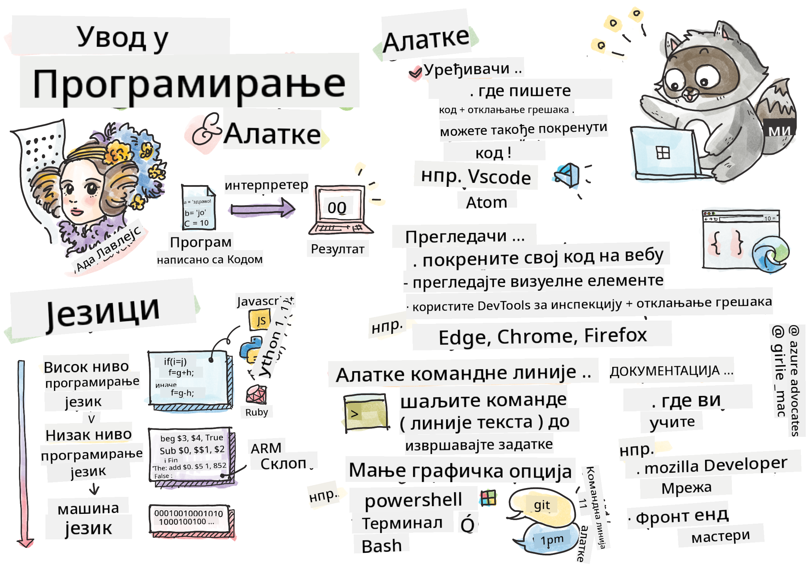

<!--
CO_OP_TRANSLATOR_METADATA:
{
  "original_hash": "c63675cfaf1d223b37bb9fecbfe7c252",
  "translation_date": "2025-08-28T10:29:19+00:00",
  "source_file": "1-getting-started-lessons/1-intro-to-programming-languages/README.md",
  "language_code": "sr"
}
-->
# Увод у програмске језике и алате заната

Ова лекција покрива основе програмских језика. Теме које су овде обрађене примењују се на већину савремених програмских језика данас. У одељку „Алати заната“ научићете о корисном софтверу који вам помаже као програмеру.

  
> Скетч од [Tomomi Imura](https://twitter.com/girlie_mac)

## Квиз пре предавања  
[Квиз пре предавања](https://forms.office.com/r/dru4TE0U9n?origin=lprLink)

## Увод

У овој лекцији ћемо обрадити:

- Шта је програмирање?  
- Типови програмских језика  
- Основни елементи програма  
- Корисни софтвер и алати за професионалног програмера  

> Ову лекцију можете пратити на [Microsoft Learn](https://docs.microsoft.com/learn/modules/web-development-101/introduction-programming/?WT.mc_id=academic-77807-sagibbon)!

## Шта је програмирање?

Програмирање (познато и као кодирање) је процес писања упутстава за уређај као што је рачунар или мобилни уређај. Ова упутства пишемо помоћу програмског језика, који уређај затим интерпретира. Ови скупови упутстава могу се називати различитим именима, али *програм*, *рачунарски програм*, *апликација (апликација)* и *извршни фајл* су нека од популарних имена.

*Програм* може бити било шта што је написано кодом; веб-сајтови, игре и апликације за телефоне су програми. Иако је могуће направити програм без писања кода, основна логика се интерпретира од стране уређаја, а та логика је највероватније написана кодом. Програм који *ради* или *извршава* код спроводи упутства. Уређај на ком читате ову лекцију покреће програм који је приказује на вашем екрану.

✅ Урадите мало истраживање: ко се сматра првим програмером на свету?

## Програмски језици

Програмски језици омогућавају програмерима да пишу упутства за уређај. Уређаји могу разумети само бинарни код (1 и 0), а за *већину* програмера то није баш ефикасан начин комуникације. Програмски језици су средство комуникације између људи и рачунара.

Програмски језици долазе у различитим форматима и могу служити различитим сврхама. На пример, JavaScript се углавном користи за веб апликације, док се Bash углавном користи за оперативне системе.

*Језици ниског нивоа* обично захтевају мање корака него *језици високог нивоа* да би уређај интерпретирао упутства. Међутим, оно што чини језике високог нивоа популарним је њихова читљивост и подршка. JavaScript се сматра језиком високог нивоа.

Следећи код илуструје разлику између језика високог нивоа са JavaScript-ом и језика ниског нивоа са ARM асемблерским кодом.

```javascript
let number = 10
let n1 = 0, n2 = 1, nextTerm;

for (let i = 1; i <= number; i++) {
    console.log(n1);
    nextTerm = n1 + n2;
    n1 = n2;
    n2 = nextTerm;
}
```

```c
 area ascen,code,readonly
 entry
 code32
 adr r0,thumb+1
 bx r0
 code16
thumb
 mov r0,#00
 sub r0,r0,#01
 mov r1,#01
 mov r4,#10
 ldr r2,=0x40000000
back add r0,r1
 str r0,[r2]
 add r2,#04
 mov r3,r0
 mov r0,r1
 mov r1,r3
 sub r4,#01
 cmp r4,#00
 bne back
 end
```

Веровали или не, *оба раде исту ствар*: исписују Фибоначијев низ до 10.

✅ Фибоначијев низ је [дефинисан](https://en.wikipedia.org/wiki/Fibonacci_number) као скуп бројева где је сваки број збир два претходна, почевши од 0 и 1. Првих 10 бројева у Фибоначијевом низу су 0, 1, 1, 2, 3, 5, 8, 13, 21 и 34.

## Елементи програма

Једна инструкција у програму назива се *изјава* и обично има карактер или размак који означава где се инструкција завршава, или *терминира*. Начин на који програм терминира зависи од језика.

Изјаве у програму могу се ослањати на податке које обезбеђује корисник или други извор како би извршиле инструкције. Подаци могу променити понашање програма, па програмски језици долазе са начином да привремено складиште податке како би се касније користили. Ово се називају *променљиве*. Променљиве су изјаве које упућују уређај да сачува податке у својој меморији. Променљиве у програмима су сличне променљивим у алгебри, где имају јединствено име и њихова вредност може да се мења током времена.

Постоји могућност да неке изјаве не буду извршене од стране уређаја. Ово је обично намерно када их програмер напише или случајно када дође до неочекиване грешке. Ова врста контроле над апликацијом чини је робуснијом и лакшом за одржавање. Типично, ове промене у контроли дешавају се када су испуњени одређени услови. Уобичајена изјава која се користи у савременом програмирању за контролу начина на који програм ради је `if..else` изјава.

✅ Више о овом типу изјаве ћете научити у наредним лекцијама.

## Алати заната

[](https://youtube.com/watch?v=69WJeXGBdxg "Алати заната")

> 🎥 Кликните на слику изнад за видео о алатима

У овом одељку ћете научити о неком софтверу који би вам могао бити веома користан док започињете своје професионално програмерско путовање.

**Развојно окружење** је јединствен скуп алата и функција које програмер често користи приликом писања софтвера. Неки од ових алата су прилагођени специфичним потребама програмера и могу се мењати током времена ако програмер промени приоритете у раду, личним пројектима или када користи други програмски језик. Развојна окружења су јединствена као и програмери који их користе.

### Уређивачи

Један од најважнијих алата за развој софтвера је уређивач. Уређивачи су место где пишете свој код, а понекад и где га извршавате.

Програмери се ослањају на уређиваче из неколико додатних разлога:

- *Отклањање грешака* помаже у проналажењу грешака и проблема корак по корак кроз код. Неки уређивачи имају могућности за отклањање грешака; могу се прилагодити и додати за специфичне програмске језике.  
- *Синтаксно истицање* додаје боје и формат текста коду, чинећи га лакшим за читање. Већина уређивача омогућава прилагођено истицање синтаксе.  
- *Екстензије и интеграције* су специјализовани алати за програмере, од стране програмера. Ови алати нису уграђени у основни уређивач. На пример, многи програмери документују свој код како би објаснили како функционише. Могу инсталирати екстензију за проверу правописа како би пронашли грешке у документацији. Већина екстензија је намењена за употребу унутар одређеног уређивача, а већина уређивача долази са начином претраге доступних екстензија.  
- *Прилагођавање* омогућава програмерима да креирају јединствено развојно окружење које одговара њиховим потребама. Већина уређивача је изузетно прилагодљива и може такође омогућити програмерима да креирају сопствене екстензије.

#### Популарни уређивачи и екстензије за веб развој

- [Visual Studio Code](https://code.visualstudio.com/?WT.mc_id=academic-77807-sagibbon)  
  - [Code Spell Checker](https://marketplace.visualstudio.com/items?itemName=streetsidesoftware.code-spell-checker)  
  - [Live Share](https://marketplace.visualstudio.com/items?itemName=MS-vsliveshare.vsliveshare)  
  - [Prettier - Code formatter](https://marketplace.visualstudio.com/items?itemName=esbenp.prettier-vscode)  
- [Atom](https://atom.io/)  
  - [spell-check](https://atom.io/packages/spell-check)  
  - [teletype](https://atom.io/packages/teletype)  
  - [atom-beautify](https://atom.io/packages/atom-beautify)  
- [Sublimetext](https://www.sublimetext.com/)  
  - [emmet](https://emmet.io/)  
  - [SublimeLinter](http://www.sublimelinter.com/en/stable/)  

### Прегледачи

Још један важан алат је прегледач. Веб програмери се ослањају на прегледач како би видели како њихов код ради на вебу. Такође се користи за приказ визуелних елемената веб странице који су написани у уређивачу, као што је HTML.

Многи прегледачи долазе са *алатима за програмере* (DevTools) који садрже скуп корисних функција и информација за помоћ програмерима у прикупљању и хватању важних информација о њиховој апликацији. На пример: Ако веб страница има грешке, понекад је корисно знати када су се догодиле. DevTools у прегледачу могу се конфигурисати да прикупе ове информације.

#### Популарни прегледачи и DevTools

- [Edge](https://docs.microsoft.com/microsoft-edge/devtools-guide-chromium/?WT.mc_id=academic-77807-sagibbon)  
- [Chrome](https://developers.google.com/web/tools/chrome-devtools/)  
- [Firefox](https://developer.mozilla.org/docs/Tools)  

### Алатке командне линије

Неки програмери више воле мање графички приказ за своје свакодневне задатке и ослањају се на командну линију да то постигну. Писање кода захтева значајну количину куцања и неки програмери више воле да не прекидају свој ток на тастатури. Они ће користити пречице на тастатури за пребацивање између прозора на радној површини, рад на различитим фајловима и коришћење алата. Већина задатака може се обавити мишем, али једна од предности коришћења командне линије је што се много тога може урадити без потребе за пребацивањем између миша и тастатуре. Још једна предност командне линије је што је конфигурабилна и можете сачувати прилагођену конфигурацију, променити је касније и увезти је на друге развојне машине. Пошто су развојна окружења тако јединствена за сваког програмера, неки ће избегавати коришћење командне линије, неки ће се у потпуности ослањати на њу, а неки ће преферирати мешавину оба.

### Популарне опције командне линије

Опције за командну линију разликују се у зависности од оперативног система који користите.

*💻 = долази унапред инсталирано на оперативном систему.*

#### Windows

- [Powershell](https://docs.microsoft.com/powershell/scripting/overview?view=powershell-7/?WT.mc_id=academic-77807-sagibbon) 💻  
- [Command Line](https://docs.microsoft.com/windows-server/administration/windows-commands/windows-commands/?WT.mc_id=academic-77807-sagibbon) (познат и као CMD) 💻  
- [Windows Terminal](https://docs.microsoft.com/windows/terminal/?WT.mc_id=academic-77807-sagibbon)  
- [mintty](https://mintty.github.io/)  

#### MacOS

- [Terminal](https://support.apple.com/guide/terminal/open-or-quit-terminal-apd5265185d-f365-44cb-8b09-71a064a42125/mac) 💻  
- [iTerm](https://iterm2.com/)  
- [Powershell](https://docs.microsoft.com/powershell/scripting/install/installing-powershell-core-on-macos?view=powershell-7/?WT.mc_id=academic-77807-sagibbon)  

#### Linux

- [Bash](https://www.gnu.org/software/bash/manual/html_node/index.html) 💻  
- [KDE Konsole](https://docs.kde.org/trunk5/en/konsole/konsole/index.html)  
- [Powershell](https://docs.microsoft.com/powershell/scripting/install/installing-powershell-core-on-linux?view=powershell-7/?WT.mc_id=academic-77807-sagibbon)  

#### Популарни алати командне линије

- [Git](https://git-scm.com/) (💻 на већини оперативних система)  
- [NPM](https://www.npmjs.com/)  
- [Yarn](https://classic.yarnpkg.com/en/docs/cli/)  

### Документација

Када програмер жели да научи нешто ново, највероватније ће се окренути документацији како би научио како да то користи. Програмери се често ослањају на документацију како би их водила кроз правилно коришћење алата и језика, али и како би стекли дубље знање о томе како они функционишу.

#### Популарна документација о веб развоју

- [Mozilla Developer Network (MDN)](https://developer.mozilla.org/docs/Web), од Mozille, издавача [Firefox](https://www.mozilla.org/firefox/) прегледача  
- [Frontend Masters](https://frontendmasters.com/learn/)  
- [Web.dev](https://web.dev), од Google-а, издавача [Chrome](https://www.google.com/chrome/)  
- [Microsoft-ова документација за програмере](https://docs.microsoft.com/microsoft-edge/#microsoft-edge-for-developers), за [Microsoft Edge](https://www.microsoft.com/edge)  
- [W3 Schools](https://www.w3schools.com/where_to_start.asp)  

✅ Урадите истраживање: Сада када знате основе окружења веб програмера, упоредите га са окружењем веб дизајнера.

---

## 🚀 Изазов

Упоредите неке програмске језике. Које су неке од јединствених карактеристика JavaScript-а у односу на Java? А шта је са COBOL-ом у односу на Go?

## Квиз после предавања  
[Квиз после предавања](https://ff-quizzes.netlify.app/web/quiz/2)

## Преглед и самостално учење

Проучите различите језике доступне програмеру. Покушајте да напишете једну линију кода на једном језику, а затим је препишите на два друга. Шта сте научили?

## Задатак

[Читање документације](assignment.md)  

---

**Одрицање од одговорности**:  
Овај документ је преведен коришћењем услуге за превођење помоћу вештачке интелигенције [Co-op Translator](https://github.com/Azure/co-op-translator). Иако се трудимо да превод буде тачан, молимо вас да имате у виду да аутоматизовани преводи могу садржати грешке или нетачности. Оригинални документ на његовом изворном језику треба сматрати меродавним извором. За критичне информације препоручује се професионални превод од стране људи. Не преузимамо одговорност за било каква погрешна тумачења или неспоразуме који могу настати услед коришћења овог превода.