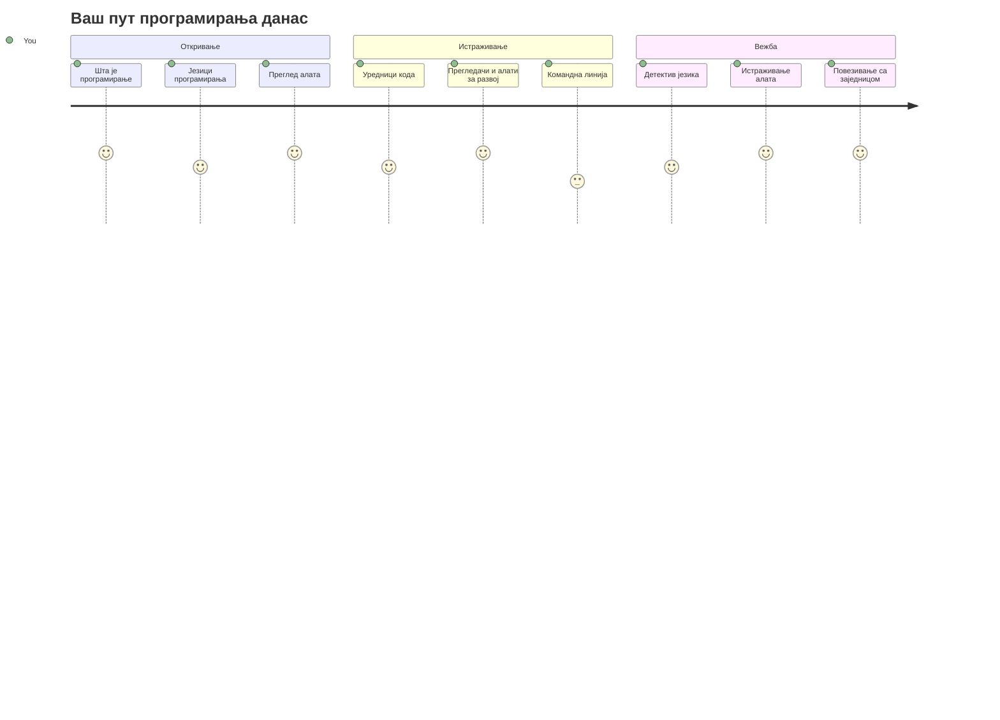
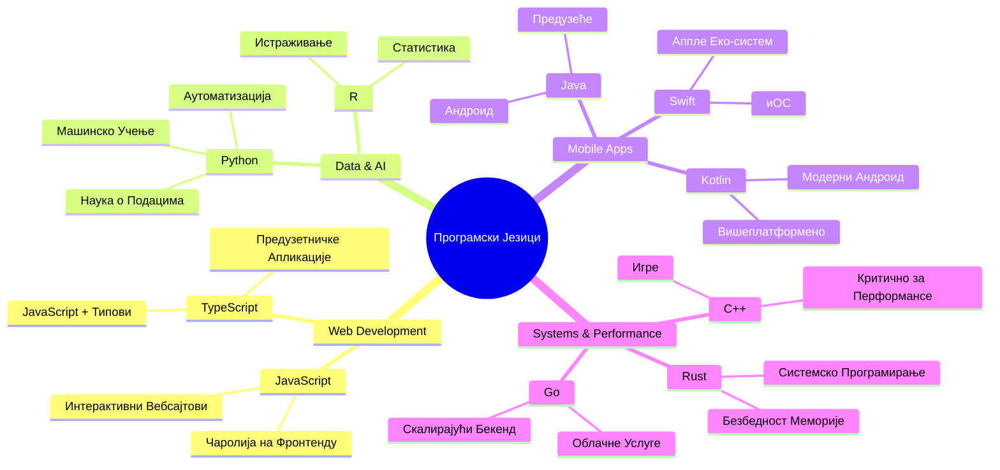
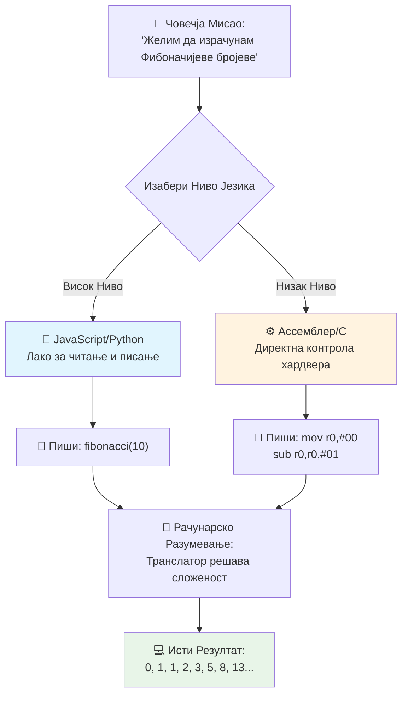
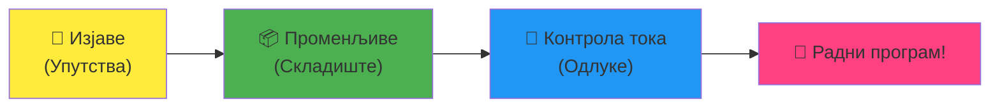
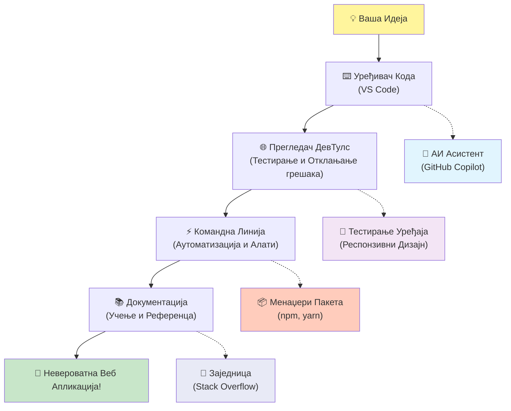
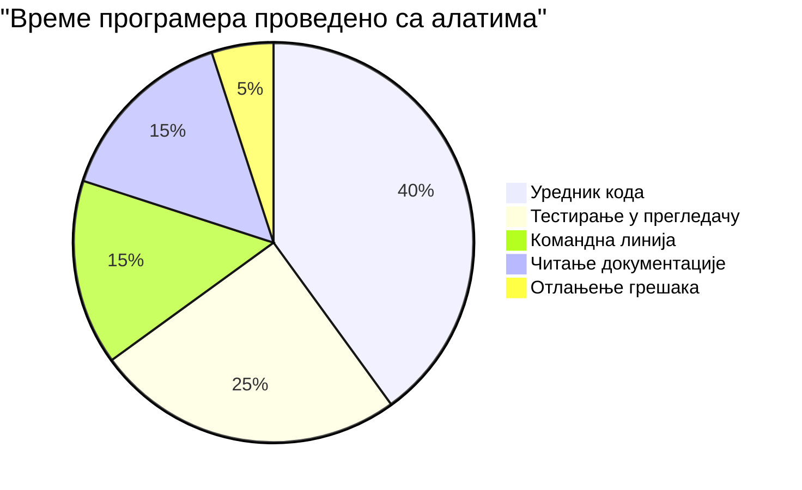
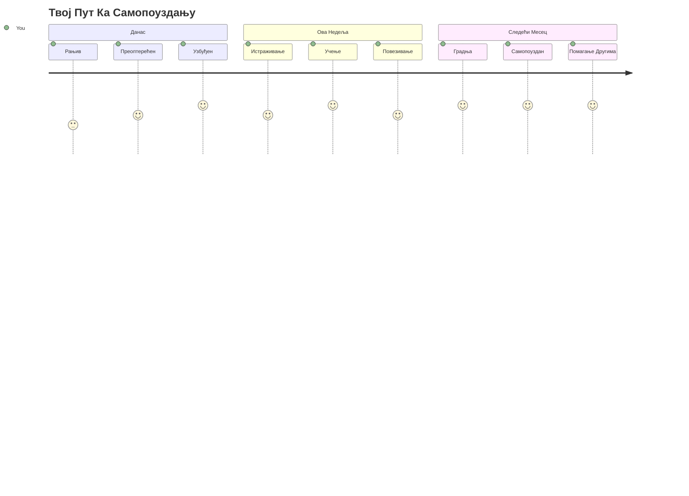

# Увод у програмске језике и савремене алате за програмере
 
Здраво, будући програмеру! 👋 Да ли могу да ти кажем нешто што ме и даље сваког дана покреће узбуђење? Ускоро ћеш открити да програмирање није само око рачунара – то је као да имаш супермоћи да оживиш своје најлудље идеје!

Знаш онај тренутак када користиш своју омиљену апликацију и све се савршено поклопи? Када тапнеш на дугме и нешто потпуно магично се догоди и помислиш „вау, како су то УРАДИЛИ?“ Па, неко баш као ти – вероватно седи у свом омиљеном кафићу у 2 ујутру са својим трећим еспресом – написао је код који је створио ту магију. И ево шта ће ти одузети дах: до краја овог часа нећеш само разумети како су то урадили, већ ћеш једва чекати да и сам пробаш!

Гледај, потпуно разумем ако ти програмирање делује застрашујуће сад. Када сам ја почео, искрено сам мислио да мораш бити неки математички геније или да програмериш од пете године. Али ево шта ми је потпуно променило гледиште: програмирање је баш као учење како да водиш разговоре на новом језику. Почнеш са „здраво“ и „хвала“, па се даље научиш да поручи кафу, и пре него што приметиш, водиш дубоке филозофске разговоре! Али у овом случају, разговараш са рачунарима, и искрено? Они су најстрпљивији саговорници које ћеш икада имати – никада не осуђују твоје грешке и увек су спремни да покушају поново!

Данас ћемо истражити невероватне алате који чине савремени веб развој не само могућим, већ и озбиљно заразним. Причам о једнаким онлајн уредницима, прегледачима и радним токовима које сваки дан користе програмери у Netflix-у, Spotify-у и твом омиљеном чудесном студију за апликације. А ево дела који ће те натерати на радосни плес: већина ових професионалних, индустријских алата је потпуно бесплатна!


> Скетчнот од [Tomomi Imura](https://twitter.com/girlie_mac)


```mermaid
journey
    title Ваш пут програмирања данас
    section Откривање
      Шта је програмирање: 5: You
      Језици програмирања: 4: You
      Преглед алата: 5: You
    section Истраживање
      Уредници кода: 4: You
      Прегледачи и алати за развој: 5: You
      Командна линија: 3: You
    section Вежба
      Детектив језика: 4: You
      Истраживање алата: 5: You
      Повезивање са заједницом: 5: You
```
## Видимо шта већ знаш!

Пре него што се упустимо у забавне ствари, радознао сам – шта већ знаш о овом свету програмирања? И слушај, ако гледаш ова питања и помишљаш „немам баш појма о овоме што пише“, то није само ок, то је савршено! То значи да си на баш правом месту. Замисли овај тест као истезање пре вежбања – ми само загревамо оне мишиће мозга!

[Уради предчасовни квиз](https://ff-quizzes.netlify.app/web/)


## Авантура на коју крећемо заједно

Океј, ја стварно крећем од скакања од узбуђења због онога што ћемо данас истраживати! Заиста, волео бих да видим твоје лице када ти неки од ових појмова буду кликнули. Ево невероватног путовања на које крећемо заједно:

- **Шта је заправо програмирање (и зашто је најфантомскија ствар икада!)** – Открићемо како је код буквално невидљива магија која покреће све око тебе, од тог аларма који некако зна да је понедељак ујутро до алгоритма који савршено креира твоје Netflix препоруке
- **Програмски језици и њихове невероватне личности** – Замисли да уђеш на журку где свака особа има сасвим различите супермоћи и начине решавања проблема. Е тако изгледа свет програмских језика, и волећеш да их упознаш!
- **Основне градивне јединице које чине дигиталну магију** – Замисли ово као ултимативни креативни LEGO сет. Када разумеш како се ови делићи спајају, схватићеш да буквално можеш да направиш било шта што твоја машта сања
- **Професионални алати који ће те натерати да се осећаш као да си управо добио чаробни штапић** – Нисам драматичан овде – ови алати ће те заиста учинити да се осећаш као да имаш супермоћи, а најбоље од свега? То су исти они које користе професионалци!

> 💡 **Ево шта:** Немој ни да помислиш да сада покушаш све да запамтиш! Тренутно желим само да осетиш искру узбуђења о томе шта је могуће. Детаљи ће се природно усадити док вежбамо заједно – тако се заиста учи!

> Можеш овај час проћи на [Microsoft Learn](https://learn.microsoft.com/en-us/learn/modules/web-development-101/introduction-programming/?WT.mc_id=academic-77807-sagibbon)!

## Па шта је у ствари *програмирање*?

У реду, хајде да решимо питање од милион долара: шта је заправо програмирање?

Причаћу ти причу која је потпуно променила мој поглед на ову тему. Прошле недеље сам покушавао да објасним мајци како да користи наш нови даљински за паметни телевизор. Примијетио сам да кажем ствари као „Притисни црвено дугме, али не оно велико црвено, малено црвено са леве стране... не, други твој леви... ок, сад га држи две секунде, не једну, не три...“ Звуче познато? 😅

То је програмирање! То је уметност давање невероватно детаљних, корак по корак упутстава нечему што је моћно али мора да се све савршено подеси. Само што уместо да објашњаваш мајци (која би могла да пита „које црвено дугме?!“), ти објашњаваш рачунару (који уради баш оно што му кажеш, чак и ако то што си рекао није баш оно што си мислио).

Ево шта ми је одузело дах кад сам први пут то научио: рачунари су у основи прилично једноставни. Они буквално разумеју само две ствари – 1 и 0, што је у основи „да“ и „не“ или „укључено“ и „искључено“. То је то! Али ево где постаје магично – не морамо да причамо у 1 и 0 као у Матриксу. Тиме се баве **програмски језици**. Они су као да имаш најбољег преводиоца на свету који узима твоје савршено нормалне људске мисли и претвара их у рачунарски језик.

И ево шта ми сваки јутар даје праву језу кад се пробудим: буквално *све* дигитално у твом животу почело је са неким као ти, вероватно у пижами са шољом кафе, како куца код на лаптопу. Та Instagram филтер који те чини беспрекорним? Неки програмер је то написао. Препорука која те одвела до твоје нове омиљене песме? Програмер је направио тај алгоритам. Апликација која ти помаже да поделиш рачун за вечеру са пријатељима? Ја, неко је помислио „ово је досадно, могао бих то да поправим“ и онда... урадио је!

Када научиш да програмираш, не добијаш само нову вештину – постајеш део ове невероватне заједнице решавача проблема који проводе дане размишљајући, „Шта ако бих могао да направим нешто што некоме уљепша дан макар мало?“ Искрено, има ли нешто кул од тога?

✅ **Занимљива чињеница за трагање**: Ево нешто супер кул што можеш да потражиш кад будеш имао слободан тренутак – ко мислиш да је био први програмер на свету? Дајем ти наговештај: можда није онако како очекујеш! Прича о овој особи је заиста фасцинантна и показује да програмирање увек значи креативно решавање проблема и размишљање изван оквира.

### 🧠 **Временско освежење: Како се осећаш?**

**Погледај на ово:**
- Да ли сада разумеш идеју „давања упутстава рачунарима“?
- Можеш ли да смислиш дневни задатак који би волео да аутоматизујеш програмирањем?
- Која питања ти се врзе у глави о овом целом програмирању?

> **Запамти:** Потпуно је нормално ако ти неки појмови сада изгледају замућено. Учење програмирања је као учење новог језика – треба време да мозак направи те неуронске везе. Сјајно радиш!

## Програмски језици су као различити укуси магије

У реду, ово ће звучати чудно, али остани са мном – програмски језици су као различити музички жанрови. Замисли: имаш џез, који је глатак и импровизаторски, рок који је моћан и директан, класичну музику која је елегантна и структурирана, и хип-хоп који је креативан и изражајан. Свакој стил има свој дух, своју заједницу страствених фанова, и сваки је савршен за различите расположења и прилике.

Програмски језици раде на исти начин! Не би користио исти језик за прављење забавне мобилне игре којим би обрађивао огромну количину климатских података, баш као што не би пуштао дет метaл на јога часу (па, на већини јога часова! 😄).

А ево шта ми сваки пут одузима дах: ови језици су као да имаш најстрпљивијег, најпаметнијег тумача света који седи поред тебе. Можеш да изразиш своје идеје на начин који је природан твом мозгу, а они се баве својом невероватно сложеном преводилачком работом у 1 и 0 које рачунари заиста разумеју. Као да имаш пријатеља који је савршено течан у оба „људска креативност“ и „рачунарска логика“ – и никада не умарају, никада не узимају паузе за кафу и никада те не осуђују ако поставиш исто питање два пута!

### Популарни програмски језици и њихове примене


```mermaid
mindmap
  root((Програмски Језици))
    Web Development
      JavaScript
        Чаролија на Фронтенду
        Интерактивни Вебсајтови
      TypeScript
        JavaScript + Типови
        Предузетничке Апликације
    Data & AI
      Python
        Наука о Подацима
        Машинско Учење
        Аутоматизација
      R
        Статистика
        Истраживање
    Mobile Apps
      Java
        Андроид
        Предузеће
      Swift
        иОС
        Аппле Еко-систем
      Kotlin
        Модерни Андроид
        Вишеплатформено
    Systems & Performance
      C++
        Игре
        Критично за Перформансе
      Rust
        Безбедност Меморије
        Системско Програмирање
      Go
        Облачне Услуге
        Скалирајући Бекенд
```
| Језик | Најбољи за | Зашто је популаран |
|----------|----------|------------------|
| **JavaScript** | Веб развој, кориснички интерфејси | Ради у прегледачима и покреће интерактивне веб сајтове |
| **Python** | Наука о подацима, аутоматизација, вештачка интелигенција | Лако читање и учење, моћне библиотеке |
| **Java** | Пословне апликације, Android апликације | Независност од платформе, робустан за велике системе |
| **C#** | Windows апликације, развој игара | Јак подршка Microsoft екосистема |
| **Go** | Cloud сервиси, backend системи | Брз, једноставан, дизајниран за модерно рачунарство |

### Језици високог и ниског нивоа

Океј, ово је искрено био појам који ми је сломио мозак када сам почео да учим, па ћу поделити аналогју која ми је коначно све разјаснила – и баш се надам да ће помоћи и теби!

Замисли да посећујеш државу чији језик не говориш, и очајнички ти треба најближи тоалет (сви смо то прошли, зар не? 😅):

- **Програмирање ниског нивоа** је као да тако добро научиш локални дијалекат да можеш да ћаскаш са баком која продаје воће на углу користећи културне референце, локални сленг и унутрашње шале које разуме само онај који је одрастао тамо. Супер импресивно и невероватно ефикасно... ако случајно говориш тај језик као матерњи! Али прилично збуњујуће када само покушаваш да нађеш тоалет.

- **Програмирање високог нивоа** је као да имаш тог невероватног локалног пријатеља који те само разуме. Можеш рећи „како да нађем тоалет?“ на обичном енглеском, а он ће све културне разлике превести и дати ти упутства на начин који твом неместном мозгу потпуно има смисла.

У програмирању:
- **Језици ниског нивоа** (као Assembly или C) ти дозвољавају да имаш невероватно детаљне разговоре са самим хардвером рачунара, али онда мораш да мислиш као машина, што је... па, рећи ћу само да је велика ментална промена!
- **Језици високог нивоа** (као JavaScript, Python или C#) ти дозвољавају да мислиш као човек док они воде компликовани језик машине иза сцене. Плус, имају невероватно топле заједнице пунe људи који се сећају како је било бити почетник и заиста желе да помогну!

Погађаш које ћу ти предложити да започнеш? 😉 Језици високог нивоа су као точкови за учење које никада заправо не желиш да скидаш јер чине целокупно искуство много пријатнијим!


```mermaid
flowchart TB
    A["👤 Човечја Мисао:<br/>'Желим да израчунам Фибоначијеве бројеве'"] --> B{Изабери Ниво Језика}
    
    B -->|Висок Ниво| C["🌟 JavaScript/Python<br/>Лако за читање и писање"]
    B -->|Низак Ниво| D["⚙️ Ассемблер/C<br/>Директна контрола хардвера"]
    
    C --> E["📝 Пиши: fibonacci(10)"]
    D --> F["📝 Пиши: mov r0,#00<br/>sub r0,r0,#01"]
    
    E --> G["🤖 Рачунарско Разумевање:<br/>Транслатор решава сложеност"]
    F --> G
    
    G --> H["💻 Исти Резултат:<br/>0, 1, 1, 2, 3, 5, 8, 13..."]
    
    style C fill:#e1f5fe
    style D fill:#fff3e0
    style H fill:#e8f5e8
```
### Показујем ти зашто су језици високог нивоа много пријатељскији

У реду, управо ћу ти показати нешто што савршено илуструје зашто сам се заљубио у језике високог нивоа, али прво – обећај ми нешто. Када видиш први пример кода, не паничи! Треба да изгледа застрашујуће. То је управо поента!

Погледаћемо исти задатак написан на два сасвим различита начина. Обоје креирају такозвану Фибоначијеву низу – то је леп узорак из математике где је сваки број збир претходна два: 0, 1, 1, 2, 3, 5, 8, 13... (Занимљива чињеница: овај узорак можеш пронаћи буквално свуда у природи – спирале семенки сунцокрета, обрасце чепова бора, чак и начин на који се формирају галаксије!)

Спреман да видиш разлику? Кренимо!

**Језик високог нивоа (JavaScript) – пријатељски за људе:**

```javascript
// Корак 1: Основна поставка Фибоначија
const fibonacciCount = 10;
let current = 0;
let next = 1;

console.log('Fibonacci sequence:');
```

**Ово код ради:**
- **Декларише** константу која одређује колико Фибоначијевих бројева желимо да генеришемо
- **Иницијализује** две променљиве које прате тренутни и следећи број у низи
- **Поставља** почетне вредности (0 и 1) које дефинишу Фибоначијев образац
- **Приказује** заглавни текст да означи наш резултат

```javascript
// Корак 2: Генериши низ са петљом
for (let i = 0; i < fibonacciCount; i++) {
  console.log(`Position ${i + 1}: ${current}`);
  
  // Израчунај следећи број у низу
  const sum = current + next;
  current = next;
  next = sum;
}
```

**Објашњење шта се овде дешава:**
- **Пролази** кроз сваки положај у низу користећи `for` петљу
- **Приказује** сваки број са његовим положајем користећи шаблонски стринг
- **Израчунава** следећи Фибоначијев број сабирајући тренутне и следеће вредности
- **Ажурира** променљиве да пређе на следећу итерацију

```javascript
// Корак 3: Модерни функционални приступ
const generateFibonacci = (count) => {
  const sequence = [0, 1];
  
  for (let i = 2; i < count; i++) {
    sequence[i] = sequence[i - 1] + sequence[i - 2];
  }
  
  return sequence;
};

// Пример употребе
const fibSequence = generateFibonacci(10);
console.log(fibSequence);
```

**У горе наведеном смо:**
- **Направили** поново употребљиву функцију користећи модерну стрелицу функције
- **Креирали** низ да сачувамо комплетан низ уместо да га приказујемо број по број
- **Користили** индексирање низа за израчунавање сваког новог броја из претходних вредности
- **Вратили** комплетан низ за флексибилну употребу у другим деловима програма

**Језик ниског нивоа (ARM Assembly) – пријатељски рачунарима:**

```assembly
 area ascen,code,readonly
 entry
 code32
 adr r0,thumb+1
 bx r0
 code16
thumb
 mov r0,#00
 sub r0,r0,#01
 mov r1,#01
 mov r4,#10
 ldr r2,=0x40000000
back add r0,r1
 str r0,[r2]
 add r2,#04
 mov r3,r0
 mov r0,r1
 mov r1,r3
 sub r4,#01
 cmp r4,#00
 bne back
 end
```

Примети како JavaScript верзија изгледа скоро као упутство написано на енглеском, док верзија на асемблеру користи криптичне команде које директно управљају процесором рачунара. Обе обављају исти задатак, али језик високог нивоа је много лакши за разумевање, писање и одржавање од стране људи.

**Кључне разлике које ћеш приметити:**
- **Читљивост**: JavaScript користи описна имена као што је `fibonacciCount`, док Assembly користи шифроване ознаке као `r0`, `r1`
- **Коментари**: Језици вишег нивоа подстичу објашњавајуће коментаре који чине код самодокументованим
- **Структура**: Логички ток JavaScript-а одговара начину на који људи размишљају о проблемима корак по корак
- **Одржавање**: Ажурирање JavaScript верзије за различите захтеве је једноставно и јасно

✅ **О низу Фибоначија**: Овај апсолутно прелеп образац бројева (где је сваки број једнак збиру претходна два: 0, 1, 1, 2, 3, 5, 8...) појављује се буквално *свуда* у природи! Пронаћи ћете га у спиралама сунцокрета, обрасцима чешера, начину на који школке натилуса коврчају, па чак и у начину раста грана дрвећа. Заиста је фасцинантно како математика и код могу помоћи да разумемо и поново створимо обрасце које природа користи да створи лепоту!


## Основни Камењарски Блокови Који Праве Магију

У реду, сада када сте видели како програмски језици изгледају у пракси, хајде да разложимо основне делове који сачињавају буквално сваки написани програм. Замислите их као суштинске састојке у вашем омиљеном рецепту – када једном разумете шта сваки ради, моћи ћете да читате и пишете код у готово било ком језику!

Ово је нешто као учење граматике програмирања. Сећате се у школи када сте учили о именицама, глаголима и како слагати реченице? Програмирање има своју верзију граматике, и искрено, много је логичнија и опроштенија од енглеске граматике! 😄

### Наређења: Упутства Корак по Корак

Хајде да почнемо са **наређењима** – они су као појединачне реченице у разговору са вашим рачунаром. Свако наређење говори рачунару да уради једну специфичну ствар, слично као када дајете упутства: "Скрените лево овде," "Стани на црвено светло," "Паркирaј се на то место."

Оно што волим код наређења је колико су обично читљива. Погледајте ово:

```javascript
// Основне изјаве које извршавају појединачне радње
const userName = "Alex";                    
console.log("Hello, world!");              
const sum = 5 + 3;                         
```

**Ево шта овај код ради:**
- **Декларише** константну променљиву за чување имена корисника
- **Приказује** поруку за поздрав на конзолном излазу
- **Израчунава** и чува резултат математичке операције

```javascript
// Изјаве које интерагују са веб страницама
document.title = "My Awesome Website";      
document.body.style.backgroundColor = "lightblue";
```

**Корак по корак, ево шта се дешава:**
- **Промењује** наслов веб-пајџа који се приказује у картици прегледача
- **Промењује** боју позадине целог тела странице

### Променљиве: Систем Памћења Вашег Програма

У реду, **променљиве** су искрено један од мојих апсолутно омиљених концепата за предавање јер су сасвим сличне стварима које већ користите сваки дан!

Размислите о листи контаката на вашем телефону. Не памтите бројеве телефона свих људи – уместо тога чувате "Мама," "Најбољи пријатељ" или "Пицерија која дистрибуира до 2 ујутро" и телефон памти стварне бројеве. Променљиве раде на исти начин! Оне су као означени контејнери у којима ваш програм може чувати информације и касније их преузимати помоћу имена које заиста има смисла.

Ево шта је стварно кул: промењиве се могу мењати како ваш програм ради (због чега се зову "променљиве" – видите шта су урадили?). Баш као што можете ажурирати контакт за пицерију када пронађете неку бољу, промењиве могу бити освежене док ваш програм сазнаје нове информације или се ситуације мењају!

Показаћу вам колико ово може лепо и једноставно изгледати:

```javascript
// Корак 1: Креирање основних променљивих
const siteName = "Weather Dashboard";        
let currentWeather = "sunny";               
let temperature = 75;                       
let isRaining = false;                      
```

**Разумевање ових концепата:**
- **Чува** непроменљиве вредности у `const` променљивама (као назив сајта)
- **Користи** `let` за вредности које могу да се мењају током рада програма
- **Додељује** различите типове података: стрингове (текст), бројеве и булове (тачно/не)
- **Бира** описна имена која објашњавају шта свака променљива садржи

```javascript
// Корак 2: Рад са објектима за груписање повезаних података
const weatherData = {                       
  location: "San Francisco",
  humidity: 65,
  windSpeed: 12
};
```

**Горњи код ради:**
- **Креира** објекат за груписање повезаних временских информација
- **Организује** више података под једним именом променљиве
- **Користи** парове кључ-вредност за јасно означавање сваког дела информација

```javascript
// Корак 3: Коришћење и ажурирање променљивих
console.log(`${siteName}: Today is ${currentWeather} and ${temperature}°F`);
console.log(`Wind speed: ${weatherData.windSpeed} mph`);

// Ажурирање променљивих које се мењају
currentWeather = "cloudy";                  
temperature = 68;                          
```

**Разумевање сваког дела:**
- **Приказује** информације користећи шаблоне са `${}` синтаксом
- **Приступа** својствима објекта помоћу нотације тачке (`weatherData.windSpeed`)
- **Ажурира** променљиве декларисане са `let` да прикажу променљиве услове
- **Комбинује** више променљивих да направи смислене поруке

```javascript
// Корак 4: Модерно распакивање за чистији код
const { location, humidity } = weatherData; 
console.log(`${location} humidity: ${humidity}%`);
```

**Шта треба да знате:**
- **Извлачи** одређена својства из објеката користећи деструктурирајућу доделу
- **Креира** нове променљиве аутоматски са истим именима као кључеви у објекту
- **Поједностављује** код избегавајући понављајућу нотацију тачке

### Контролни Ток: Учимо Ваш Програм да Размишља

У реду, овде програмирање постаје потпуно невероватно! **Контролни ток** је у ствари учење вашег програма како да доноси паметне одлуке, управо као што то ви радите сваки дан без икаквог размишљања.

Замислите ово: јутрос сте вероватно пролазили кроз нешто као "Ако пада киша, узећу кишобран. Ако је хладно, обући ћу јакну. Ако касним, прескочићу доручак и купити кафић на путу." Ваш мозак природно прати ову if-then логику десетинама пута сваког дана!

То је оно што програме чини интелигентним и живим уместо да само прате досадан, предвидив сценарио. Они заправо могу да посматрају ситуацију, процене шта се дешава и одговоре адекватно. Као да дајете програму мозак који се може прилагодити и правити изборе!

Желите да видите како ово лепо функционише? Пустите да вам покажем:

```javascript
// Корак 1: Основна условна логика
const userAge = 17;

if (userAge >= 18) {
  console.log("You can vote!");
} else {
  const yearsToWait = 18 - userAge;
  console.log(`You'll be able to vote in ${yearsToWait} year(s).`);
}
```

**Ево шта овај код ради:**
- **Проверава** да ли је корисникова старост довољна за гласање
- **Извршава** различите блокове кода у зависности од резултата услова
- **Израчунава** и приказује колико дуго треба да чека да гласа ако је испод 18 година
- **Пружа** конкретне, корисне повратне информације за сваку ситуацију

```javascript
// Корак 2: Више услова са логичким операторима
const userAge = 17;
const hasPermission = true;

if (userAge >= 18 && hasPermission) {
  console.log("Access granted: You can enter the venue.");
} else if (userAge >= 16) {
  console.log("You need parent permission to enter.");
} else {
  console.log("Sorry, you must be at least 16 years old.");
}
```

**Разлагање дешавања овде:**
- **Комбинује** више услова користећи `&&` (и) оператор
- **Креира** хијерархију услова користећи `else if` за различите сценарије
- **Обрађује** све могуће случајеве са коначним `else` изјавом
- **Пружа** јасан и користан повратни одговор за сваку различиту ситуацију

```javascript
// Корак 3: Кратки услов са тернарним оператором
const votingStatus = userAge >= 18 ? "Can vote" : "Cannot vote yet";
console.log(`Status: ${votingStatus}`);
```

**Запамтите ово:**
- **Користите** тернарни оператор (`? :`) за једноставне услове са две опције
- **Пишете** услов прво, па `?`, затим резултат ако је тачно, па `:`, затим резултат ако је нетачно
- **Примена** овог обрасца када треба доделити вредности на основу услова

```javascript
// Корак 4: Обрада више специфичних случајева
const dayOfWeek = "Tuesday";

switch (dayOfWeek) {
  case "Monday":
  case "Tuesday":
  case "Wednesday":
  case "Thursday":
  case "Friday":
    console.log("It's a weekday - time to work!");
    break;
  case "Saturday":
  case "Sunday":
    console.log("It's the weekend - time to relax!");
    break;
  default:
    console.log("Invalid day of the week");
}
```

**Овај код постиже следеће:**
- **Упоређује** вредност променљиве са више одређених случајева
- **Групише** сличне случајеве заједно (радни дани против викенда)
- **Извршава** одговарајући блок кода када налази подударање
- **Укључује** `default` случај за руковање неочекиваним вредностима
- **Користи** `break` наредбе да спречи наставак кода у следећем случају

> 💡 **Аналогија из стварног живота**: Размислите о контролном току као о најстрпљивијем GPS-у на свету који вам даје упутства. Може рећи "Ако има гужве на Главној улици, узми ауто-пут уместо тога. Ако је ауто-пут блокиран због радова, пробај пут прелепим предеоm." Програми користе управо овакву врсту условне логике да паметно реагују на различите ситуације и увек пруже корисницима најбоље могуће искуство.

### 🎯 **Провера Концепта: Мајсторство Основних Каменова**

**Хајде да видимо како стојите са основама:**
- Можете ли објаснити разлику између променљиве и наређења својим речима?
- Замислите ситуацију из стварног живота где бисте користили if-then одлуку (као наш пример гласања)
- Која вас је једна ствар о програмирању највише изненадила?

**Брзо подизање самопоуздања:**

```mermaid
flowchart LR
    A["📝 Изјаве<br/>(Упутства)"] --> B["📦 Променљиве<br/>(Складиште)"] --> C["🔀 Контрола тока<br/>(Одлуке)"] --> D["🎉 Радни програм!"]
    
    style A fill:#ffeb3b
    style B fill:#4caf50
    style C fill:#2196f3
    style D fill:#ff4081
```
✅ **Шта следи**: Очекује нас сјајно искуство у дубље улажење у ове концепте док настављамо заједно ову невероватну авантуру! За сада се фокусирајте само на осећај узбуђења због свих невероватних могућности које вас очекују. Специфичне вештине и технике ће вам природно бити при руци како будемо вежбали заједно – обећавам да ће ово бити далеко забавније него што сте можда мислили!

## Алати Заната

У реду, ово је искрено оно што ме толико узбуђује да се једва суздржавам! 🚀 Управо ћемо причати о невероватним алатима који ће вас учинити да се осећате као да сте управо добили кључеве дигиталног свемирског брода.

Знате како кувар има савршено балансиране ножеве који му делују као продужетак руку? Или како музичар има ону гитару која као да пева оног тренутка када је додирне? Па, програмери имају своју верзију ових магичних алата, а ево шта ће вам потпуно одузети дах – већина њих је потпуно бесплатна!

Практично скачем на столици док размишљам како ћу вам ово поделити, јер су у потпуности револуционисали начин на који правимо софтвер. Причамо о AI помоћницима за кодирање који вам могу помоћи да напишете ваш код (не шалим се!), о облачним окружењима у којима можете градити читаве апликације буквално са било ког места са Wi-Fi-јем, и о тако софистицираним алатима за дебаговање да делују као рендгенски вид за ваше програме.

А сада део који ми и даље изазива узбуђење: ово нису „алати за почетнике“ које ћете прерасти. Ово су управо исте професионалне алате које програмери у Google-у, Netflix-у и тој независној студији апликација коју волите користе у овом тренутку. Осетићете се као прави професионалац када их користите!


```mermaid
graph TD
    A["💡 Ваша Идеја"] --> B["⌨️ Уређивач Кода<br/>(VS Code)"] 
    B --> C["🌐 Прегледач ДевТулс<br/>(Тестирање и Отклањање грешака)"]
    C --> D["⚡ Командна Линија<br/>(Аутоматизација и Алати)"]
    D --> E["📚 Документација<br/>(Учење и Референца)"]
    E --> F["🚀 Невероватна Веб Апликација!"]
    
    B -.-> G["🤖 АИ Асистент<br/>(GitHub Copilot)"]
    C -.-> H["📱 Тестирање Уређаја<br/>(Респонзивни Дизајн)"]
    D -.-> I["📦 Менаџери Пакета<br/>(npm, yarn)"]
    E -.-> J["👥 Заједница<br/>(Stack Overflow)"]
    
    style A fill:#fff59d
    style F fill:#c8e6c9
    style G fill:#e1f5fe
    style H fill:#f3e5f5
    style I fill:#ffccbc
    style J fill:#e8eaf6
```
### Уређивачи кода и IDE-ови: Ваши Нови Дигитални Најбољи Пријатељи

Хајде да причамо о уређивачима кода – они ће заиста постати ваша омиљена места за рад! Замислите их као вашу личну светињу програмирања где ћете проводити већину времена стварајући и усавршавајући ваше дигиталне креације.

Али ево шта је права магија код модерних уређивача: они нису само сјајни уређивачи текста. Они су као најпаметнији и најподржавајући ментор за кодирање који седи поред вас 24/7. Ухвате ваше грешке пре него што их приметите, предлажу побољшања која вас чине генијем, помажу вам да разумете шта сваки део кода ради, а неки чак могу и предвидети шта ћете куцати и понудити да заврше ваше мисли!

Сећам се када сам први пут открио аутоматско довршавање – буквално сам се осећао као да живим у будућности. Почнете да куцате нешто, а ваш уређивач каже: „Да ли си размишљао о овој функцији која ради баш оно што ти треба?“ Као да имате читаоца мисли као пријатеља за кодирање!

**Шта ове уређиваче чини невероватним?**

Модерни уређивачи кода нуде импресиван низ функција осмишљених да побољшају вашу продуктивност:

| Функција | Шта ради | Зашто помаже |
|---------|--------------|--------------|
| **Истраживање синтаксе** | Боји различите делове вашег кода | Олакшава читање и проналажење грешака |
| **Аутоматско довршавање** | Предлаже код док куцате | Убрзава кодирање и смањује типографске грешке |
| **Алати за дебаговање** | Помажу у проналажењу и исправљању грешака | Штеди сате времена за решавање проблема |
| **Проширења** | Додају специјализоване функције | Прилагодите уређивач било којој технологији |
| **AI помоћници** | Предлажу код и објашњења | Убрзавају учење и продуктивност |

> 🎥 **Видео ресурс**: Желите да видите ове алате у акцији? Погледајте овај [Видео о алатима заната](https://youtube.com/watch?v=69WJeXGBdxg) за детаљан преглед.

#### Препоручени уређивачи за веб развој

**[Visual Studio Code](https://code.visualstudio.com/?WT.mc_id=academic-77807-sagibbon)** (бесплатан)
- Најпопуларнији међу веб програмерима
- Одличан екосистем проширења
- Уграђени терминал и Git интеграција
- **Морају имати проширења**:
  - [GitHub Copilot](https://marketplace.visualstudio.com/items?itemName=GitHub.copilot) - AI-помоћ за писање кода
  - [Live Share](https://marketplace.visualstudio.com/items?itemName=MS-vsliveshare.vsliveshare) - Сарадња у реалном времену
  - [Prettier](https://marketplace.visualstudio.com/items?itemName=esbenp.prettier-vscode) - Аутоматско форматирање кода
  - [Code Spell Checker](https://marketplace.visualstudio.com/items?itemName=streetsidesoftware.code-spell-checker) - Ухвата типографске грешке у коду

**[JetBrains WebStorm](https://www.jetbrains.com/webstorm/)** (плаћен, бесплатан за студенте)
- Напредни алати за дебаговање и тестирање
- Интелигентно довршавање кода
- Уграђена контрола верзија

**Облачни IDE-ови** (различите цене)
- [GitHub Codespaces](https://github.com/features/codespaces) - Пун VS Code у вашем претраживачу
- [Replit](https://replit.com/) - Одлично за учење и делјење кода
- [StackBlitz](https://stackblitz.com/) - Инстант веб развој целокупног стека

> 💡 **Савет за почетак**: Почните са Visual Studio Code – бесплатан је, широко коришћен у индустрији и има огромну заједницу која креира корисне туторијале и екстензије.


### Веб Прегледачи: Ваша Тајна Лабораторија За Развој

У реду, спремите се да вам се ум потпуно одузме! Знате како користите прегледаче за претраживање друштвених мрежа и гледање видео снимака? Испоставило се да су читаво време крили ову невероватну тајну лабораторију за програмере, само што чекају да је откријете!

Сваки пут када кликнете десним тастером миша на веб страницу и одаберете „Inspect Element“ (Инспекција елемента), отварате скривени свет алата за програмере који су заправо моћнији од неког скупог софтвера за који сам ја раније плаћао стотине долара. Као да сте открили да ваша обична кухиња крије професионалну кухињску лабораторију иза тајног панела!
Први пут када ми је неко показао алате за развој у прегледачу, провео сам око три сата само кликајући по свему и говорећи „ЧЕКАЈ, МОЖЕ И ТО?!“ Можете буквално да уређујете било који веб сајт у реалном времену, видите колико све брзо учитава, тестирате како ваш сајт изгледа на различитим уређајима, и чак дебагујете JavaScript као потпуни професионалац. То је заиста невероватно!

**Ево зашто су прегледачи ваша тајна суперсила:**

Када креирате веб сајт или веб апликацију, потребно је да видите како она изгледа и функционише у стварном свету. Прегледачи не само да приказују ваш рад, већ пружају и детаљне повратне информације о перформансама, приступачности и потенцијалним проблемима.

#### Алати за развој у прегледачу (DevTools)

Модерни прегледачи укључују свеобухватне сетове алата за развој:

| Категорија алата | Шта ради | Пример употребе |
|------------------|----------|-----------------|
| **Инспектор елемената** | Приказ и уређивање HTML/CSS у реалном времену | Подешавање стила да видите резултате одмах |
| **Конзола** | Приказивање порука о грешкама и тестирање JavaScript-а | Дебаговање проблема и експериментисање са кодом |
| **Мрежни монитор** | Прати како се ресурси учитавају | Оптимизација перформанси и времена учитавања |
| **Провера приступачности** | Тестирање инклузивног дизајна | Осигуравање да сајт ради за све кориснике |
| **Симулатор уређаја** | Преглед на различитим величинама екрана | Тестирање респонсивног дизајна без више уређаја |

#### Препоручени прегледачи за развој

- **[Chrome](https://developers.google.com/web/tools/chrome-devtools/)** - Индустријски стандард DevTools са обимном документацијом
- **[Firefox](https://developer.mozilla.org/docs/Tools)** - Одлични алати за CSS Grid и приступачност
- **[Edge](https://docs.microsoft.com/microsoft-edge/devtools-guide-chromium/?WT.mc_id=academic-77807-sagibbon)** - Изграђен на Chromium-у са Microsoft ресурсима за програмере

> ⚠️ **Важно савет за тестирање**: Увек тестирајте ваше веб странице у више прегледача! Оно што савршено ради у Chrome-у може изгледати другачије у Safari-ју или Firefox-у. Професионални програмери тестирају на свим главним прегледачима како би обезбедили доследно корисничко искуство.


### Алати командне линије: Ваш пут ка суперсилама програмера

Хајде да будемо потпуно искрени у вези командне линије, јер желим да то чујете од неког ко заиста разуме. Када сам је први пут видео – само онај страшни црни екран са трепћућим текстом – буквално сам помислио: „Не, никако! Ово изгледа као нешто из хакерског филма из 1980-их, и дефинитивно нисам довољно паметан за ово!“ 😅

Али ево шта ми је драго што ми тада нико није рекао, а ја вам сада говорим: командна линија није страшна – она је као разговор лице у лице са вашим рачунаром. Замислите то као разлику између наручивања хране преко неке лепо урађене апликације са сликама и менијима (што је лепо и једноставно) и уласка у ваш омиљени локални ресторан где кувар зна тачно шта волите и може спремити нешто сјајно само ако кажете „изненади ме нечем фантастичним“.

Командна линија је место где програмери осећају као прави чаробњаци. Укуцате неколико наизглед магичних речи (у реду, то су само команде, али делују магично!), притиснете ентер и БУМ – створили сте целокупну структуру пројекта, инсталирали моћне алате из целог света, или поставили вашу апликацију на интернет да је милиони људи виде. Када једном осетите ту моћ, искрено постаје прилично заразно!

**Зашто ће командна линија постати ваш омиљени алат:**

Док су графичка сучеља одлична за многе задатке, командна линија изузетно добро ради у аутоматизацији, прецизности и брзини. Много алата за развој ради углавном кроз командну линију, и учење како их ефикасно користити може драматично побољшати вашу продуктивност.

```bash
# Корак 1: Креирајте и приступите директоријуму пројекта
mkdir my-awesome-website
cd my-awesome-website
```

**Ево шта овај код ради:**
- **Креира** нови директоријум под именом "my-awesome-website" за ваш пројекат
- **Улази** у тај новокреирани директоријум да почне рад

```bash
# Корак 2: Иницијализујте пројекат са package.json
npm init -y

# Инсталирајте модерне алате за развој
npm install --save-dev vite prettier eslint
npm install --save-dev @eslint/js
```

**Корак по корак, ево шта се дешава:**
- **Иницијализује** нови Node.js пројекат са подразумеваним подешавањима користећи `npm init -y`
- **Инсталира** Vite као модеран алат за израду пројеката ради брзог развоја и продуктивних билдова
- **Додаје** Prettier за аутоматску форматираност кода и ESLint за проверу квалитета кода
- **Користи** `--save-dev` заставицу да их означи као зависности које су само за развој

```bash
# Корак 3: Креирајте структуру пројекта и фајлове
mkdir src assets
echo '<!DOCTYPE html><html><head><title>My Site</title></head><body><h1>Hello World</h1></body></html>' > index.html

# Покрените сервер за развој
npx vite
```

**Горе смо:**
- **Организовали** пројекат креирањем посебних фасцикли за изворни код и ресурсе
- **Генерисали** основни HTML фајл са исправном структуром документа
- **Покренули** Vite развојни сервер за живо рефрешовање и замену модула у ходу

#### Основни алати командне линије за веб развој

| Алат | Намена | Зашто ти треба |
|------|--------|----------------|
| **[Git](https://git-scm.com/)** | Контрола верзија | Праћење промена, сарадња са другима, резервне копије |
| **[Node.js & npm](https://nodejs.org/)** | JavaScript извршни систем и управљање пакетима | Покретање JavaScript-а ван прегледача, инсталација модерних алата |
| **[Vite](https://vitejs.dev/)** | Алат за билд и развојни сервер | Вртоглаво брз развој са заменом модула у ходу |
| **[ESLint](https://eslint.org/)** | Квалитет кода | Аутоматско проналажење и исправка проблема у JavaScript-у |
| **[Prettier](https://prettier.io/)** | Форматирање кода | Одржавајте код доследно форматираним и читљивим |

#### Опције по платформама

**Windows:**
- **[Windows Terminal](https://docs.microsoft.com/windows/terminal/?WT.mc_id=academic-77807-sagibbon)** - Модеран, са богатим могућностима
- **[PowerShell](https://docs.microsoft.com/powershell/?WT.mc_id=academic-77807-sagibbon)** 💻 - Моћно окружење за скриптове
- **[Command Prompt](https://docs.microsoft.com/windows-server/administration/windows-commands/?WT.mc_id=academic-77807-sagibbon)** 💻 - Традиционална Windows командна линија

**macOS:**
- **[Terminal](https://support.apple.com/guide/terminal/)** 💻 - Уграђена терминална апликација
- **[iTerm2](https://iterm2.com/)** - Напреднији терминал са додатним функцијама

**Linux:**
- **[Bash](https://www.gnu.org/software/bash/)** 💻 - Стандардни Linux шкољка
- **[KDE Konsole](https://docs.kde.org/trunk5/en/konsole/konsole/index.html)** - Напредни емулатор терминала

> 💻 = Прединсталирано у оперативном систему

> 🎯 **Пут учења**: Почни са основним командама као што су `cd` (промена директоријума), `ls` или `dir` (листање фајлова) и `mkdir` (креирање фасцикле). Вежбај са модерним командама као што су `npm install`, `git status` и `code .` (отвара тренутни директоријум у VS Code). Како будете постајали комфорнији, природно ћете усвојити напредније команде и технике аутоматизације.


### Документација: Ваш увек доступан ментор за учење

Добро, да поделим једну малу тајну која ће вас учинити да се осећате много боље као почетник: чак и најискуснији програмери проводе огроман део свог времена читајући документацију. И није то зато што не знају шта раде – то је заправо знак мудрости!

Замислите документацију као приступ најстрпљивијим и најпаметнијим учитељима на свету који су доступни 24/7. Зачепљени сте на неком проблему у 2 ујутро? Документација је ту са топлим виртуелним загрљајем и управо тачним одговором који вам треба. Желите да научите о некој усађеној новој функцији о којој сви говоре? Документација вас подржава са корак-по-корак примерима. Покушавате да разумете зашто нешто ради онако како ради? Погодили сте – документација је спремна да вам то објасни тако да коначно буде јасно!

Ево нечега што ми је потпуно променило перспективу: свет веб развоја се креће невероватном брзином, и нико (мислим нико!) не памти све напамет. Гледао сам искусне програмере са преко 15 година искуства како проверавају основну синтаксу, и знате шта? То није срамота – то је паметно! Није ствар у савршеном памћењу, него у знању где брзо пронаћи поуздане одговоре и разумевању како их применити.

**Ево где се дешава права магија:**

Професионални програмери значајан део свог времена проводе читајући документацију – не зато што не знају шта раде, него зато што веб развојне области тако брзо напредују да је стално учење неопходно. Одлична документација вам помаже да разумете не само *како* нешто користити, већ и *зашто* и *када*.

#### Основни ресурси документације

**[Mozilla Developer Network (MDN)](https://developer.mozilla.org/docs/Web)**
- Златни стандард за документацију о веб технологијама
- Свеобухватни водичи за HTML, CSS и JavaScript
- Укључује информације о компатибилности прегледача
- Садржи практичне примерe и интерактивне демонстрације

**[Web.dev](https://web.dev)** (од Google-а)
- Најбоље праксе модерног веб развоја
- Водичи за оптимизацију перформанси
- Принципи приступачности и инклузивног дизајна
- Студије случајева из стварних пројеката

**[Microsoft Developer Documentation](https://docs.microsoft.com/microsoft-edge/#microsoft-edge-for-developers)**
- Ресурси за развој за Edge прегледач
- Водичи за прогресивне веб апликације
- Увид у крос-платформски развој

**[Frontend Masters Learning Paths](https://frontendmasters.com/learn/)**
- Структурирани курикулуми за учење
- Видео курсеви од индустријских стручњака
- Вежбе кодирања за праксу

> 📚 **Стратегија учења**: Не покушавајте да меморишете документацију – уместо тога научите како да се ефикасно крећете кроз њу. Обележавајте често коришћене референце и вежбајте коришћење претраге да брзо пронађете специфичне информације.

### 🔧 **Провера знања алата: Шта вам највише одговара?**

**Одвојите тренутак да размислите:**
- Који алат сте највише узбуђени да испробате први? (Нема погрешног одговора!)
- Да ли вам командна линија и даље делује застрашујуће или вас занима?
- Можете ли замислити да користите DevTools у прегледачу да погледате „иза завесе“ ваших омиљених сајтова?


```mermaid
pie title "Време програмера проведено са алатима"
    "Уредник кода" : 40
    "Тестирање у прегледачу" : 25
    "Командна линија" : 15
    "Читање документације" : 15
    "Отлањење грешака" : 5
```
> **Занимљива чињеница**: Већина програмера проводи око 40% времена у свом едитору кода, али примети колико се времена троши на тестирање, учење и решавање проблема. Програмирање није само писање кода – то је креирање искустава!

✅ **За размишљање**: Ево нешто занимљиво за размишљање – како мислите да се алати за прављење веб сајтова (развој) разликују од алата за дизајн како да изгледају? То је као разлика између архитекте који дизајнира лепу кућу и извођача који је заправо гради. Обоје су важни, али им требају другачији алати! Овакав начин размишљања ће вам заиста помоћи да видите ширу слику како веб сајтови оживљавају.

## Изазов GitHub Copilot Агенту 🚀

Користите режим Агента да завршите следећи изазов:

**Опис:** Истражите функције модерног кода едитора или IDE-а и покажите како могу побољшати ваш радни ток као веб програмера.

**Упутство:** Изаберите код едитор или IDE (нпр. Visual Studio Code, WebStorm или cloud-based IDE). Набројте три функције или додатка који вам помажу у писању, дебаговању или одржавању кода ефикасније. За сваки наведе кратко објашњење како унапређује ваш радни ток.

---

## 🚀 Изазов

**Добро, детективе, спреман за свој први случај?**

Сад кад имаш ову сјајну основу, имам авантуру која ће ти помоћи да видиш колико је свет програмирања невероватно разнолик и фасцинантан. И слушај – ово још није писање кода, тако да нема притиска! Замисли себе као детектива програмских језика на свом првом узбудљивом задатку!

**Твоја мисија, ако је прихватиш:**
1. **Постани истраживач језика**: Изабери три програмска језика из потпуно различитих области – можда један за прављење веб сајтова, један за мобилне апликације и један за анализу података за научнике. Пронађи примере истог једноставног задатка написаног на сва три језика. Обећавам – бићеш запањен колико могу да изгледају различито док раде исто!

2. **Откриј приче о пореклу**: Шта чини сваки језик посебним? Једна кул чињеница – сваки програмски језик је створен зато што је неко помислио „Знаш шта? Мора постојати бољи начин да се реши овај конкретан проблем.“ Можеш ли да сазнаш који су то проблеми били? Неке од ових прича су заиста фасцинантне!

3. **Упознај заједнице**: Погледај колико су пријатељске и страствене заједнице сваког језика. Неке имају милионе програмера који деле знање и помажу једни другима, друге су мање али изузетно блиске и подржавајуће. Свидеће ти се различите личности тих заједница!

4. **Слушај свој инстинкт**: Који језик ти сада највише прија? Не брините о „савршеном“ избору – само слушај своје осећаје! Овде нема погрешног одговора, а касније увек можеш истражити друге.

**Бонус детективски задатак**: Пробај да сазнаш којим програмским језицима су изграђени велики веб сајтови или апликације. Гарантујем да ћеш бити изненађен када сазнаш шта покреће Instagram, Netflix или ону мобилну игру коју не можеш да оставиш!

> 💡 **Запамти**: Не покушаваш данас да постанеш експерт за било који од ових језика. Све што радиш је да упознајеш комшије пре него што одлучиш где ћеш да се установиш. Узми време, забави се и нека те води радозналост!

## Хајде да прославимо шта си открио!

Боже мили, усвојио си толико невероватних информација данас! Искрено се радујем да видим колико је овог сјајног путовања остао са тобом. И запамти – ово није тест где мораш све да одговориш савршено. Ово је више као прослава свега кул што си научио о овом фасцинантном свету у који се спремаш да зарониш!

[Направи квиз после лекције](https://ff-quizzes.netlify.app/web/)

## Ревизија и самостално учење

**Одвојте време да истражите и забавите се!**
Обухватили сте пуно теме данас, и то је нешто на шта треба бити поносан! Сада долази забавни део – истраживање тема које су пробудиле вашу радозналост. Запамтите, ово није домаћи задатак – ово је авантура!

**Зароните дубље у оно што вас узбуђује:**

**Пробајте програмирање кроз праксу:**
- Посетите званичне сајтове 2-3 језика која су привукла вашу пажњу. Сваки има своју личност и причу!
- Испробајте неке онлајн кодирајуће платформе као што су [CodePen](https://codepen.io/), [JSFiddle](https://jsfiddle.net/), или [Replit](https://replit.com/). Не бојте се експериментисања – ништа не можете покварити!
- Прочитајте о томе како је ваш омиљени језик настао. Заиста, неке од тих прича о пореклу су фасцинантне и помоћи ће вам да разумете зашто језици раде онако како раде.

**Уживајте у новим алаткама:**
- Преузмите Visual Studio Code ако то већ нисте урадили – бесплатан је и свиђаће вам се!
- Проведите неколико минута истражујући Marketplace за Extensions. То је као продавница апликација за ваш код уредник!
- Отворите Developer Tools у прегледачу и кликајте по њима. Немојте бринути да разумете све – само се упознајте са оним што тамо има.

**Приклучите се заједници:**
- Пратите неке програмерске заједнице на [Dev.to](https://dev.to/), [Stack Overflow](https://stackoverflow.com/), или [GitHub](https://github.com/). Програмерска заједница је невероватно пријатељска према почетницима!
- Гледајте видео записе за почетнике на YouTube-у. Постоји много сјајних креатора који још памте како је то почети.
- Размотрите придруживање локалним састанцима или онлајн заједницама. Верујте ми, програмери воле да помажу почетницима!

> 🎯 **Слушајте, ево шта желим да запаметите**: Не очекује се да постанете чаробњак програмирања преко ноћи! Тренутно само упознајете овај невероватни нови свет у који улазите. Узмите време, уживајте у путовању, и запамтите – сваки програмер кога поштујете једном је седео управо тамо где сте ви сада, узбуђен и можда мало преплављен. То је сасвим нормално и показује да сте на добром путу!


## Задатак

[Reading the Docs](assignment.md)

> 💡 **Мали подстицај за ваш задатак**: Волео бих да видим како истражујете неке алате које још нисмо обрадили! Прескочите уреднике, прегледаче и командне алате о којима смо већ причали – постоји цела невероватна универзума сјајних развојних алата који чекају да буду откривени. Тражите оне који се активно одржавају и имају живе, корисне заједнице (они имају најбоље туторијале и најпожељније људе када се заглавите и затреба вам пријатељска помоћ).

---

## 🚀 Ваш временски план путовања програмирања

### ⚡ **Шта можете урадити у наредних 5 минута**
- [ ] Обележите 2-3 сајта програмских језика која су вам привукла пажњу
- [ ] Преузмите Visual Studio Code ако то већ нисте урадили
- [ ] Отворите DevTools у прегледачу (F12) и кликајте по било ком сајту
- [ ] Придружите се једној програмерској заједници (Dev.to, Reddit r/webdev, или Stack Overflow)

### ⏰ **Шта можете постићи у овом часу**
- [ ] Завршите квиз после лекције и размишљајте о вашим одговорима
- [ ] Подесите VS Code са GitHub Copilot додатком
- [ ] Испробајте пример "Hello World" у 2 различита програмска језика онлајн
- [ ] Погледајте видео "Дан у животу програмера" на YouTube-у
- [ ] Започните истраживање о свом изабраном језику (из изазова)

### 📅 **Ваша авантура у току недеље**
- [ ] Завршите задатак и истражите 3 нова развојна алата
- [ ] Пратите 5 програмера или рачуна везаних за програмирање на друштвеним мрежама
- [ ] Покушајте направити нешто мало на CodePen-у или Replit-у (чак и само "Hello, [Ваше име]!")
- [ ] Прочитајте један блог пост програмера о његовом путу кодирања
- [ ] Придружите се виртуелном састанку или гледајте програмерски говор
- [ ] Почните да учите свој одабрани језик уз онлајн туторијале

### 🗓️ **Ваша месечна трансформација**
- [ ] Направите свој први мали пројекат (чак и једноставна веб страница рачуна)
- [ ] Допринесите неком open-source пројекту (почните са исправкама у документацији)
- [ ] Менторирајте некога ко тек почиње у програмирању
- [ ] Креирајте свој портфолио вебсајт
- [ ] Повежите се са локалним програмерским заједницама или групама за учење
- [ ] Почните да планирате свој следећи корак у учењу

### 🎯 **Коначна рефлексија**

**Пре него што наставите, одвојите тренутак да прославите:**
- Шта вас је данас највише узбудило у програмирању?
- Који алат или концепт желите прво да истражите?
- Како се осећате на почетку овог пута у програмирању?
- Које питање бисте желели да поставите програмеру у овом тренутку?


```mermaid
journey
    title Твој Пут Ка Самопоуздању
    section Данас
      Рањив: 3: You
      Преоптерећен: 4: You
      Узбуђен: 5: You
    section Ова Недеља
      Истраживање: 4: You
      Учење: 5: You
      Повезивање: 4: You
    section Следећи Месец
      Градња: 5: You
      Самопоуздан: 5: You
      Помагање Другима: 5: You
```
> 🌟 **Запамтите**: Сваки стручњак је некада био почетник. Сваки искусни програмер је некада осећао управо као ви сада – узбуђено, можда мало преплављено, и свакако радознало о могућностима. Ви сте у сјајном друштву и ово путовање ће бити изванредно. Добродошли у диван свет програмирања! 🎉

---

<!-- CO-OP TRANSLATOR DISCLAIMER START -->
**Изјавa о одрицању одговорности**:  
Овај документ је преведен коришћењем АИ преводилачке услуге [Co-op Translator](https://github.com/Azure/co-op-translator). Иако се трудимо да превод буде тачан, молимо имајте у виду да аутоматизовани преводи могу садржати грешке или неточности. Изворни документ на изворном језику треба сматрати ауторитетним извором. За критичне информације препоручује се професионални људски превод. Нисмо одговорни за било каква неспоразума или нетачне тумачења која могу настати употребом овог превода.
<!-- CO-OP TRANSLATOR DISCLAIMER END -->