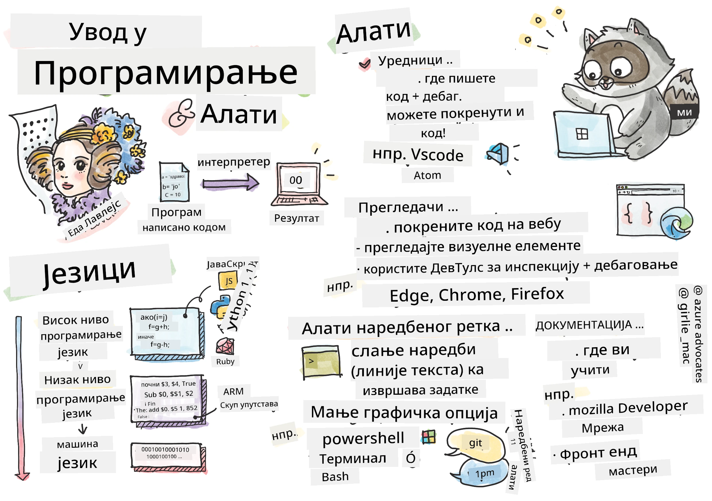
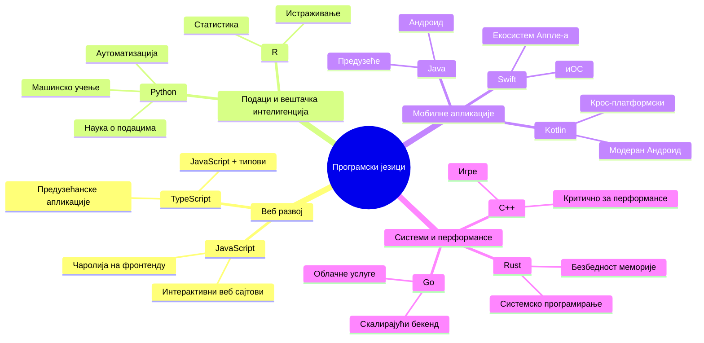
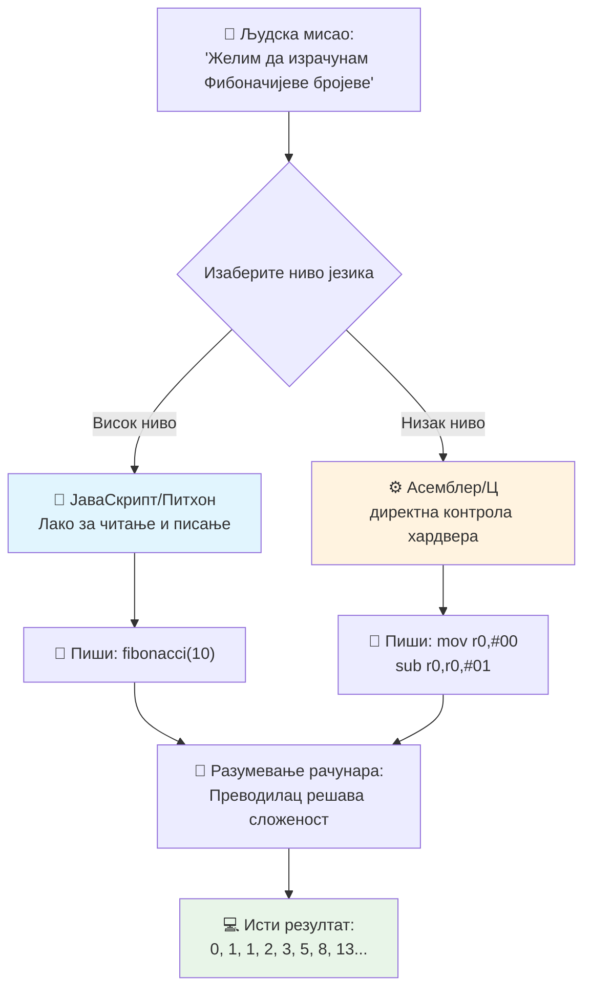
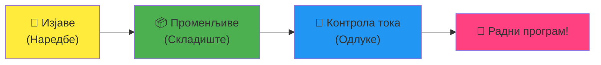
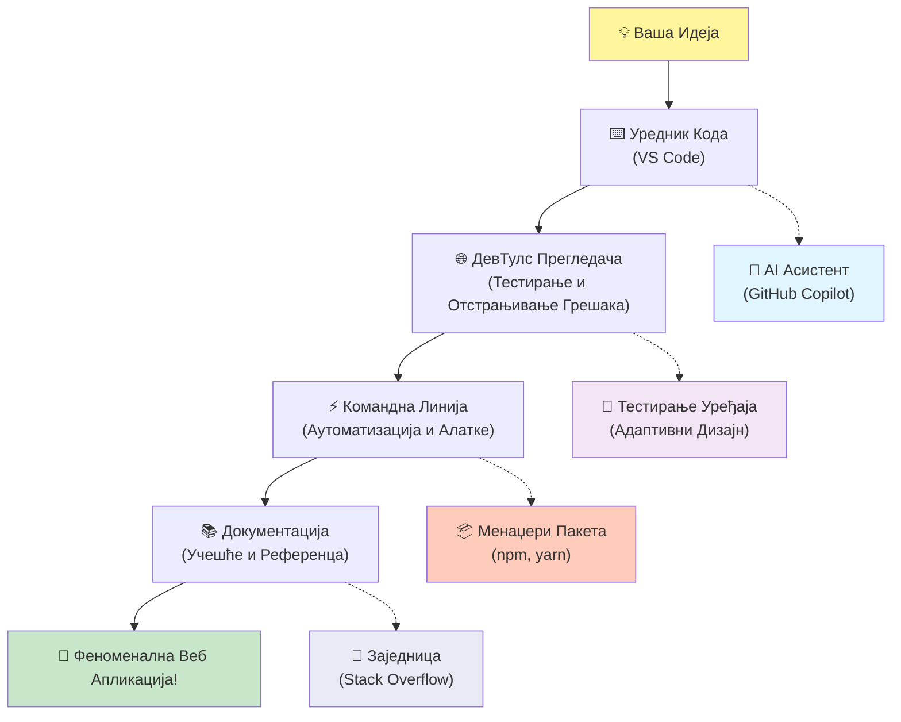
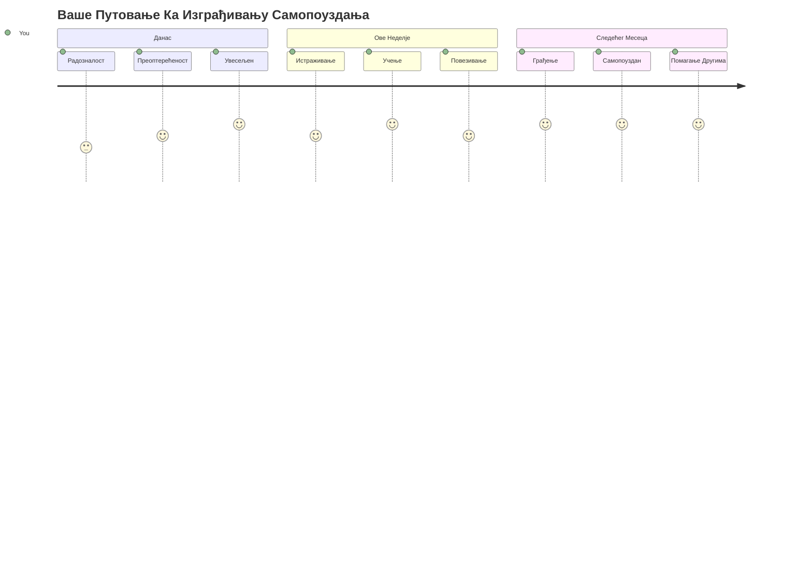

# Увод у програмске језике и савремене алате за развој софтвера

Здраво, будући програмеру! 👋 Могу ли ти рећи нешто што ми још увек изазива узбуђење сваки дан? Ускоро ћеш открити да програмирање није само о рачунарима – то је као да имаш праве супермоћи да оствариш своје најлуђе идеје!

Знаш онај тренутак када користиш своју омиљену апликацију и све једноставно иде савршено? Када додирнеш дугме и догоди се нешто потпуно магично што те натера да кажеш "вау, како су то УРАДИЛИ?" Па, неко баш као ти – вероватно седи у свом омиљеном кафеу у 2 ујутру са трећим еспресом – написао је код који је створио ту магију. И сад ћу ти рећи нешто што ће ти одузети дах: до краја овог часа ти нећеш само разумети како су то урадили, него ћеш једва чекати да и сам покушаш!

Погледај, потпуно разумем ако ти програмирање тренутно делује застрашујуће. Када сам ја почео, истински сам мислио да треба да будеш неки геније за математику или да кодујеш од пет година. Али ево шта ми је потпуно променило гледиште: програмирање је као учење да водиш разговоре на новом језику. Почнеш са „здраво“ и „хвала“, па временом поручујеш кафу, а пре него што схватиш, водиш дубоке филозофске дискусије! Само што у овом случају водиш разговоре са рачунарима, а искрено? Они су најстрпљивији саговорници које ћеш икада имати – никад не осуђују твоје грешке и увек су спремни да пробају поново!

Данас ћемо истражити невероватне алате који чине савремени веб развој не само могућим, већ и озбиљно заразним. Причам ти о истим уређивачима, прегледачима и токовима рада које програмери у Netflix-у, Spotify-ју и твојој омиљеној инди апликационој студији користе сваки дан. А ево дела који ће те натерати да заиграш од среће: већина тих професионалних алата светског стандарда је потпуно бесплатна!


> Скетчнот од [Tomomi Imura](https://twitter.com/girlie_mac)


```mermaid
journey
    title Ваш пут програмирања данас
    section Откријте
      Шта је програмирање: 5: You
      Програмски језици: 4: You
      Преглед алата: 5: You
    section Истражите
      Уређивачи кода: 4: You
      Прегледачи и алати за развој: 5: You
      Командна линија: 3: You
    section Вежбајте
      Детектив језика: 4: You
      Истраживање алата: 5: You
      Повезивање са заједницом: 5: You
```
## Хајде да видимо шта већ знаш!

Пре него што кренемо у забаву, занима ме – шта већ знаш о овом свету програмирања? И слушај, ако гледаш ова питања мислећи „Ја буквално немам појма о овоме“, то није само у реду, то је савршено! То значи да си на потпуно правом месту. Замисли овај квиз као загревање пре тренинга – само припремамо твоје мишиће мозга!

[Уради квиз пре часа](https://ff-quizzes.netlify.app/web/)


## Авантура на коју крећемо заједно

У реду, стварно сам узбуђен због онога што ћемо данас истражити! Искрено, волео бих да видим твоје лице када неки од ових концепата кликну. Ево невероватног путовања на које крећемо заједно:

- **Шта је заправо програмирање (и зашто је најкул ствар икада!)** – Открићемо како је код буквално невидљива магија која покреће све око тебе, од оног аларма који на неки начин зна да је понедељак ујутру до алгоритма који савршено бира препоруке на Netflix-у
- **Програмски језици и њихове невероватне личности** – Замисли да улазиш на журку где свака особа има потпуно различите супермоћи и начине решавања проблема. Такво је и окружење програмских језика, и биће ми драго да их упознаш!
- **Основни саставни делови који чине да дигитална магија функционише** – Размисли о томе као о најкраћем креативном LEGO сету. Када схватиш како се ови делови слажу заједно, схватићеш да буквално можеш да направиш све што ти замисао пожели
- **Професионални алати који ће ти дати осећај као да си управо добио чаробни штапић** – Нисам драматичан – ови алати ће те заиста учинити да се осећаш као да имаш супермоћи, а најбоље од свега? То су исти алати које користе професионалци!

> 💡 **Ево шта је важно**: Немој ни да помислиш да све данас памтиш напамет! Сада само желим да осетиш искру узбуђења о ономе што је могуће. Детаљи ће природно остати како будемо вежбали заједно – такво је право учење!

> Овај час можеш урадити и на [Microsoft Learn](https://learn.microsoft.com/en-us/learn/modules/web-development-101/introduction-programming/?WT.mc_id=academic-77807-sagibbon)!

## Па шта је тачно *програмирање*?

У реду, хајде да се позабавимо милионски важним питањем: шта је заправо програмирање?

Испричаћу ти причу која је потпуно променила мој однос према овоме. Прошле недеље покушавао сам да објасним мами како да користи наш нови паметни даљински управљач за телевизор. Схватио сам да говорим ствари као што су „Притисни црвено дугме, али не оно велико црвено, оно мало црвено лево... не, твоје друго лево... добро, сад држи два секунде, не једну, не три...“ Звуче познато? 😅

То је програмирање! То је уметност да се дају невероватно детаљна, корак по корак упутства нечему што је врло моћно али захтева да све буде савршено објашњено. Само што уместо маме (која може да пита "које црвено дугме?!"), објашњаваш рачунару (који ради баш оно што кажеш, чак и ако оно што си рекао није баш оно што си мислио).

Ово ми је одузело дах када сам први пут сазнао: рачунари су заправо прилично једноставни у сржи. Они буквално разумеју само две ствари – 1 и 0, што је у основи „да“ и „не“ или „укључено“ и „искључено.“ То је све! Али ево где почиње магија – не морамо говорити у 1 и 0 као у филму Матрикс. Тутор долазе у помоћ – **програмски језици**. Они су као најбољи преводилац на свету који узима твоје потпуно нормалне људске мисли и претвара их у језик рачунара.

И ево шта ми још даје стварну језу сваки пут када се пробудим: буквално *све* дигитално у твом животу почело је са неким баш као ти, вероватно у пиџами с шољом кафе, кодујући на лаптопу. Та Instagram филтер који те чини беспрекорним? Неко је то написао. Препорука која те довела до твоје нове омиљене песме? Девелопер је направио тај алгоритам. Апликација која ти помаже да поделиш рачун за вечеру са пријатељима? Да, неко је помислио „ово је досадно, верујем да могу то да поправим“ и онда... поправио.

Када научиш да програмираш, ти не учиш само нову вештину – постајеш део ове невероватне заједнице решавача проблема који проводе дан размишљајући „Шта ако могу направити нешто што ће некоме мало побољшати дан?“ Искрено, има ли нешто кул од тога?

✅ **Занимљива чињеница**: Ево шта чудесно да потражиш кад будеш имао слободан тренутак – ко мислиш да је био први компјутер програмер на свету? Даћу ти савет: можда није онај кога очекујеш! Прича о овој особи је апсолутно фасцинантна и показује да је програмирање увек било о креативном решавању проблема и размишљању ван оквира.

### 🧠 **Пауза за проверу: Како се осећаш?**

**Одвоји тренутак да размислиш:**
- Да ли ти сада има смисла идеја о „давању упутстава рачунарима“?
- Можеш ли да смислиш неки свакодневни посао који би желео да аутоматизујеш програмирањем?
- Која питања ти муче ум о овом целом програмерском свету?

> **Запамти**: Потпуно је нормално ако ти неки концепти тренутно делују нејасно. Учење програмирања је као учење новог језика – мозак ти треба време да изгради оне неуралне везе. Одлично ти иде!

## Програмски језици су као различити укуси магије

У реду, ово ће звучати чудно, али остани са мном – програмски језици су много слични различитим врстама музике. Размисли о томе: имаш џез, који је гласан и импровизован, рок који је снажан и директан, класичну музику која је елегантна и структурана, и хип-хоп који је креативан и изражајан. Сваки стил има свој карактер, своју заједницу фанова, и сваки је савршен за различита расположења и прилике.

Програмски језици раде потпуно исто! Не би користио исти језик да направиш забавну мобилну игру као што би користио да обрађујеш огромне количине климатских података, као што не би пуштао дет метъл на часу јоге (па, барем не на већини часова јоге! 😄).

Али ево шта ми сваки пут одузме дах када о томе размишљам: ти језици су као да имаш најстрпљивијег, најпаметнијег преводиоца на свету који седи поред тебе. Можеш изразити своје идеје на начин који је природан твом људском мозгу, а они обаве сав невероватно сложен посао превођења у 1 и 0 језик који рачунари стварно разумеју. То је као да имаш пријатеља који савршено говори и „људску креативност“ и „рачунарску логику“ – и он никад не умара, никад не иде на паузу за кафу и никад те не осуђује ако исто питање поставиш два пута!

### Популарни програмски језици и њихова употреба


```mermaid
mindmap
  root((Програмски језици))
    Веб развој
      JavaScript
        Чаролија на фронтенду
        Интерактивни веб сајтови
      TypeScript
        JavaScript + типови
        Предузећанске апликације
    Подaци и вештачка интелигенција
      Python
        Наука о подацима
        Машинско учење
        Аутоматизација
      R
        Статистика
        Истраживање
    Мобилне апликације
      Java
        Андроид
        Предузеће
      Swift
        иОС
        Екосистем Аппле-а
      Kotlin
        Модеран Андроид
        Крос-платформски
    Системи и перформансе
      C++
        Игре
        Критично за перформансе
      Rust
        Безбедност меморије
        Системско програмирање
      Go
        Облачне услуге
        Скалирајући бекенд
```
| Језик | Најбоље за | Зашто је популаран |
|----------|----------|------------------|
| **JavaScript** | Веб развој, кориснички интерфејси | Ради у прегледачима и покреће интерактивне веб сајтове |
| **Python** | Наука о подацима, аутоматизација, вештачка интелигенција | Лак за читање и учење, моћне библиотеке |
| **Java** | Пословне апликације, Android апликације | Независан од платформе, робустан за велике системе |
| **C#** | Windows апликације, развој игара | Јака подршка Microsoft екосистема |
| **Go** | Cloud сервисе, backend системе | Брз, једноставан, дизајниран за савремено рачунарство |

### Језици високог vs. ниског нивоа

Ово је био концепт који ми је највише био тежак када сам почео да учим, па ћу поделити аналогију која ми је коначно помогла да схватим – и надам се да ће помоћи и теби!

Замисли да си у посети некој земљи у којој не говориш језик и журиш да пронађеш најближи тоалет (сви смо били ту, зар не? 😅):

- **Програмирање ниског нивоа** је као да тако добро научиш локални дијалекат да можеш да ћаскаш са баком која продаје воће на углу користећи културне референце, локални сленг и унутрашње шале које разуме само неко ко је одрастао тамо. Супер импресивно и невероватно ефикасно... ако си флуентан! Али прилично збуњујуће ако само тражиш тоалет.

- **Програмирање високог нивоа** је као да имаш тог невероватног локалног пријатеља који те просто разуме. Можеш рећи „Баш ми треба тоалет“ на обичном енглеском, а он се брине о свим културним преводима и даје тебе упутства на начин који ти разумеш.

У програмерским терминима:
- **Језици ниског нивоа** (као Assembly или C) ти дају невероватно детаљне разговоре са стварним хардвером рачунара, али мораш да размишљаш као машина, што је... па, рећи ћу само да је то велики ментални преокрет!
- **Језици високог нивоа** (као JavaScript, Python или C#) ти дозвољавају да размишљаш као човек, док они све машине у позадини обрађују. Поред тога, имају невероватно пријатељске заједнице пуне људи који се сећају како је бити почетник и заиста желе да помогну!

Погоди који ћу ти ја предложити да почнеш? 😉 Језици високог нивоа су као помоћне точкове на бициклу које никад нећеш заиста желети да скинеш јер ти цело искуство чине много пријатнијим!


```mermaid
flowchart TB
    A["👤 Људска мисао:<br/>'Желим да израчунaм Фибоначијеве бројеве'"] --> B{Изаберите ниво језика}
    
    B -->|Висок ниво| C["🌟 ЈаваСкрипт/Питхон<br/>Лако за читање и писање"]
    B -->|Низак ниво| D["⚙️ Асемблер/Ц<br/>директна контрола хардвера"]
    
    C --> E["📝 Пиши: fibonacci(10)"]
    D --> F["📝 Пиши: mov r0,#00<br/>sub r0,r0,#01"]
    
    E --> G["🤖 Разумевање рачунара:<br/>Преводилац решава сложеност"]
    F --> G
    
    G --> H["💻 Исти резултат:<br/>0, 1, 1, 2, 3, 5, 8, 13..."]
    
    style C fill:#e1f5fe
    style D fill:#fff3e0
    style H fill:#e8f5e8
```
### Хајде да ти покажем зашто су језици високог нивоа пријатнији

У реду, показаћу ти нешто што савршено илуструје зашто сам се заљубио у језике високог нивоа, али прво – мораш ми обећати једно. Када видиш први пример кода, не паничи! Требало би да изгледа застрашујуће. Управо то је поента!

Погледаћемо исти задатак написан у два потпуно различита стила. Обојица праве такозвану Фибоначијеву низу – то је овај леп математички образац где је сваки број збир претходна два: 0, 1, 1, 2, 3, 5, 8, 13... (Занимљиво: овај образац налазиш буквално свуда у природи – спирале семенки сунцокрета, обрасци шишарки, па чак и како се формирају галаксије!)

Спреман да видиш разлику? Кренимо!

**Језик високог нивоа (JavaScript) – пријатељски према човеку:**

```javascript
// Корак 1: Основна поставка Фибоначија
const fibonacciCount = 10;
let current = 0;
let next = 1;

console.log('Fibonacci sequence:');
```

**Ево шта овај код ради:**
- **Декларише** константу која одређује колико Фибоначијевих бројева желимо да генеришемо
- **Иницијализује** две променљиве које прате тренутни и следећи број у низу
- **Поставља** почетне вредности (0 и 1) које дефинишу Фибоначијев образац
- **Приказује** заглавље као поруку за идентификацију нашег излаза

```javascript
// Корак 2: Генериши низ помоћу петље
for (let i = 0; i < fibonacciCount; i++) {
  console.log(`Position ${i + 1}: ${current}`);
  
  // Израчунај следећи број у низу
  const sum = current + next;
  current = next;
  next = sum;
}
```

**Разјашњава шта се овде дешава:**
- **Пролази кроз** сваку позицију у низу користећи `for` петљу
- **Приказује** сваки број са његовом позицијом користећи формат шаблонског литерала
- **Израчунава** следећи Фибоначијев број сабирајући тренутну и следећу вредност
- **Ажурира** променљиве за праћење преласка у следећу итерацију

```javascript
// Корак 3: Модерни функционални приступ
const generateFibonacci = (count) => {
  const sequence = [0, 1];
  
  for (let i = 2; i < count; i++) {
    sequence[i] = sequence[i - 1] + sequence[i - 2];
  }
  
  return sequence;
};

// Пример употребе
const fibSequence = generateFibonacci(10);
console.log(fibSequence);
```

**Горе, ми смо:**
- **Направили** поново употребљиву функцију користећи савремени стрелачки синтакс
- **Направили** низ у који чувамо целу секвенцу уместо да је приказујемо један по један
- **Користили** индексирање низа да израчунамо сваки нови број из претходних вредности
- **Вратили** целу секвенцу за флексибилну употребу у другим деловима програма

**Језик ниског нивоа (ARM Assembly) – пријатељски према рачунару:**

```assembly
 area ascen,code,readonly
 entry
 code32
 adr r0,thumb+1
 bx r0
 code16
thumb
 mov r0,#00
 sub r0,r0,#01
 mov r1,#01
 mov r4,#10
 ldr r2,=0x40000000
back add r0,r1
 str r0,[r2]
 add r2,#04
 mov r3,r0
 mov r0,r1
 mov r1,r3
 sub r4,#01
 cmp r4,#00
 bne back
 end
```

Примети како верзија у JavaScript-у чита скоро као упутства на енглеском, док верзија у Assembly користи криптичке наредбе које директно контролишу процесор рачунара. Оба обављају исти задатак, али језик високог нивоа је много лакши за људе да разумеју, пишу и одржавају.

**Кључне разлике које ћеш приметити:**
- **Читљивост**: ЈаваСкрипт користи описна имена као што је `fibonacciCount`, док Ассембли користи криптичке ознаке као `r0`, `r1`
- **Коментари**: Високо ниво језика подстиче објашњавајуће коментаре који чине да код сам себе документује
- **Структура**: Логички ток ЈаваСкрипта одговара начину на који људи размишљају о проблемима корак по корак
- **Одржавање**: Ажурирање ЈаваСкрипт верзије за различите захтеве је једноставно и јасно

✅ **О низу Фибоначи**: Овај апсолутно предиван бројни образац (где је сваки број једнак збиру претходна два: 0, 1, 1, 2, 3, 5, 8...) појављује се буквално *свуда* у природи! Можете га пронаћи у спиралама сунцокретових семенки, шарама на четинама, како се љуске наутилуса увијају, па чак и у начину раста гранчица дрвећа. Заиста је задивљујуће како математика и код могу помоћи да разумемо и поново створимо обрасце које природа користи да створи лепоту!


## Грађевински Блокови Који Чине Магију

Добро, сада када сте видели како програмски језици изгледају у пракси, хајде да разложимо основне делове који чине буквално сваки икада написани програм. Замислите их као суштинске састојке у вашем омиљеном рецепту – када разумете шта сваки ради, моћи ћете да читате и пишете код у готово сваком језику!

Ово је као учење граматике програмирања. Сећате се када сте у школи учили о именицама, глаголима и како се праве реченице? Програмирање има своју верзију граматике, и искрено, она је много логичнија и подношљивија од енглеске граматике икада била! 😄

### Наредбе: Упутства Корак по Корак

Хајде да почнемо са **наредбама** – оне су као појединачне реченице у разговору са вашим рачунаром. Свака наредба каже рачунару да уради једну конкретну ствар, као када дајете упутства: "Skreni levo овде," "Станите на црвеном светлу," "Парк на том месту."

Што волим код наредби је како су обично читљиве. Погледај ово:

```javascript
// Основне наредбе које изводе појединачне радње
const userName = "Alex";                    
console.log("Hello, world!");              
const sum = 5 + 3;                         
```

**Ово је шта овај код ради:**
- **Објави** константну променљиву за чување корисниковог имена
- **Прикажи** поздравну поруку у конзоли
- **Израчунај** и сачувај резултат математичке операције

```javascript
// Изјаве које комуницирају са веб страницама
document.title = "My Awesome Website";      
document.body.style.backgroundColor = "lightblue";
```

**Корак по корак, ево шта се дешава:**
- **Измени** наслов веб странице који се појављује на табу прегледача
- **Промени** боју позадине целог тела странице

### Променљиве: Систем Мемоарије Вашег Програма

У реду, **променљиве** су заиста један од мојих омиљених концепата за подучавање јер су толико сличне стварима које већ користите сваки дан!

Размислите о листи контаката на вашем телефону на тренутак. Не памтите бројеве свих људи – уместо тога чувате „Мама“, „Најбољи пријатељ“ или „Пица Која Доставља До 2 Ујутру“ и телефон памти стварне бројеве. Променљиве раде на исти начин! Оне су као означене посуде у којима ваш програм може чувати информације и касније их дохватити коришћењем имена које има смисла.

Ово је стварно сјајно: променљиве могу да се мењају док програм ради (отуда и име „променљива“ – видите шта су урадили?). Баш као што можете ажурирати контакт пицерије када пронађете неко боље место, променљиве се могу ажурирати како ваш програм учи нове информације или како се ситуације мењају!

Показаћу вам колико ово може бити лепо једноставно:

```javascript
// Корак 1: Креирање основних променљивих
const siteName = "Weather Dashboard";        
let currentWeather = "sunny";               
let temperature = 75;                       
let isRaining = false;                      
```

**Разумевање ових појмова:**
- **Чувајте** непромењиве вредности у `const` променљивама (као име сајта)
- **Користите** `let` за вредности које се могу мењати током програма
- **Додељујте** различите типове података: низове (текст), бројеве, и булове (true/false)
- **Изаберите** описна имена која објашњавају шта свака променљива садржи

```javascript
// Корак 2: Рад са објектима за груписање повезаних података
const weatherData = {                       
  location: "San Francisco",
  humidity: 65,
  windSpeed: 12
};
```

**Горе смо:**
- **Креирали** објекат за груписање повезаних информација о времену
- **Организовали** више података под једним именом променљиве
- **Користили** парове кључ-вредност за јасно означавање сваког дела информације

```javascript
// Корак 3: Коришћење и ажурирање променљивих
console.log(`${siteName}: Today is ${currentWeather} and ${temperature}°F`);
console.log(`Wind speed: ${weatherData.windSpeed} mph`);

// Ажурирање променљивих које се могу мењати
currentWeather = "cloudy";                  
temperature = 68;                          
```

**Хајде да разумемо сваки део:**
- **Прикажи** информације користећи шаблонске литерале са `${}` синтаксом
- **Приступи** својствима објекта користећи нотaцију тачком (`weatherData.windSpeed`)
- **Ажурирај** променљиве декларисане као `let` да одразе променљиве услове
- **Комбинуј** више променљивих да би створио значајне поруке

```javascript
// Корак 4: Модеран деструктурирање за чистији код
const { location, humidity } = weatherData; 
console.log(`${location} humidity: ${humidity}%`);
```

**Шта треба да знате:**
- **Извуци** одређена својства из објеката коришћењем деструктурирајуће доделе
- **Креирај** нове променљиве аутоматски са истим именима као кључеви објекта
- **Поједностави** код избегавањем понављајуће нотације тачком

### Контрола Тока: Учити Ваш Програм Да Размишља

Ово је тренутак када програмирање постаје заиста задивљујуће! **Контрола тока** је у основи учење вашег програма да доноси паметне одлуке, баш као што ви то радите сваки дан, чак и без размишљања.

Замислите ово: овај јутро сте вероватно прошли кроз нешто као „Ако пада киша, понећу кишобран. Ако је хладно, обучем јакну. Ако касним, прескочим доручак и купим кафу у пролазу.“ Ваш мозак природно следи ову if-then логику десетинама пута сваки дан!

Ово је оно што програме чини интелигентним и живим уместо само да прате досадну, предвидиву скрипту. Они заиста могу да погледају ситуацију, процене шта се дешава и одговоре адекватно. Као да дајете свом програму мозак који се може прилагодити и доносити одлуке!

Желите да видите како ово сјајно ради? Ево примера:

```javascript
// Корак 1: Основна условна логика
const userAge = 17;

if (userAge >= 18) {
  console.log("You can vote!");
} else {
  const yearsToWait = 18 - userAge;
  console.log(`You'll be able to vote in ${yearsToWait} year(s).`);
}
```

**Овде код ради следеће:**
- **Провери** да ли корисникова старост испуњава услов за гласање
- **Изврши** различите блокове кода у зависности од резултата услова
- **Израчунај** и прикажи колико је времена до права гласа ако је испод 18
- **Пружи** конкретне, корисне повратне информације за сваку ситуацију

```javascript
// Корак 2: Вишеструки услови са логичким операторима
const userAge = 17;
const hasPermission = true;

if (userAge >= 18 && hasPermission) {
  console.log("Access granted: You can enter the venue.");
} else if (userAge >= 16) {
  console.log("You need parent permission to enter.");
} else {
  console.log("Sorry, you must be at least 16 years old.");
}
```

**Разлажемо шта се овде дешава:**
- **Комбинуј** више услова коришћењем `&&` (и) оператора
- **Креирај** хијерархију услова користећи `else if` за више сценарија
- **Обради** све могуће случајеве помоћу коначног `else` блока
- **Пружи** јасне, конкретне повратне информације за сваку различиту ситуацију

```javascript
// Корак 3: Кратак услов са тернарним оператором
const votingStatus = userAge >= 18 ? "Can vote" : "Cannot vote yet";
console.log(`Status: ${votingStatus}`);
```

**То треба да запамтите:**
- **Користите** тернарни оператор (`? :`) за једноставне услове са две опције
- **Напишите** услов прво, па `?`, затим истински резултат, па `:`, па лажни резултат
- **Примени** овај образац када треба доделити вредности у зависности од услова

```javascript
// Корак 4: Руководење са више специфичних случајева
const dayOfWeek = "Tuesday";

switch (dayOfWeek) {
  case "Monday":
  case "Tuesday":
  case "Wednesday":
  case "Thursday":
  case "Friday":
    console.log("It's a weekday - time to work!");
    break;
  case "Saturday":
  case "Sunday":
    console.log("It's the weekend - time to relax!");
    break;
  default:
    console.log("Invalid day of the week");
}
```

**Овај код постиже следеће:**
- **Поређује** вредност променљиве са више конкретних случајева
- **Групише** сличне случајеве (радни дани против викенда)
- **Извршава** одговарајући блок кода када се нађе поклапање
- **Укључује** `default` случај за необичне вредности
- **Користи** `break` наредбе да спречи наставак кода у следећи случај

> 💡 **Примера из стварног света**: Размислите о контроли тока као да имате најстрпљивији ГПС са светa који вам даје упутства. Он може рећи „Ако има гужве на Главној улици, вози аутопутем. Ако је путобрана затворен због радова, покушај сценски пут.“ Програми користе исти овакав условни логички модел да интелигентно реагују на различите ситуације и увек пруже корисницима најбоље могуће искуство.

### 🎯 **Провера Концепта: Владање Грађевинским Блоковима**

**Погледајмо како стојите са основама:**
- Можете ли објаснити разлику између променљиве и наредбе својим речима?
- Замислите стварни сценарио где бисте применили if-then одлуку (нпр. наш пример гласања)
- Која вас је једна ствар у вези са логиком програмирања изненадила?

**Брзи подстицај самопоуздања:**

```mermaid
flowchart LR
    A["📝 Изјаве<br/>(Наредбе)"] --> B["📦 Променљиве<br/>(Складиште)"] --> C["🔀 Контрола тока<br/>(Одлуке)"] --> D["🎉 Радни програм!"]
    
    style A fill:#ffeb3b
    style B fill:#4caf50
    style C fill:#2196f3
    style D fill:#ff4081
```
✅ **Шта следи**: Уживамо у даљем урањању у ове појмове док настављамо ову невероватну заједничку авантуру! За сада само уживајте у узбуђењу због свих невероватних могућности пред вама. Специфичне вештине и технике ће се природно усавршавати како вежбамо заједно – обећавам да ће ово бити много забавније него што сте очекивали!

## Алати Трговине

Добро, искрено, овде се толико узбудим да једва издржавам! 🚀 Управо ћемо разговарати о невероватним алатима који ће вас учинити да се осећате као да су вам баш сад предали кључеве дигиталног свемирског брода.

Знате како кувар има оне савршено балансиране ножеве који делују као продужетак његових руку? Или како музичар има ту једну гитару која као да запева чим је додирне? Па, програмери имају своју верзију ових магичних алата, и ево шта ће вам апсолутно одувати ум – већина њих је потпуно бесплатна!

Празним од узбуђења док вам ово причам јер су потпуно револуционарисали начин на који градимо софтвер. Говоримо о AI асистентима за кодирање који могу помоћи да напишете ваш код (нисам се шалилa!), о облачним окружењима где можете градити целе апликације буквално са било ког места са Ви-Фи-јем, и алатима за дебаговање толико софистицираним да су као да имате X-ray вид за ваше програме.

И ево оног дела који ми и даље даје трнце: ово нису "алати за почетнике" које ћете прерасти. Ово су исто она професионална средства за рад које програмери у Google-у, Netflix-у и тој инди студији апликација коју волите користе баш сада. Осећаћете се као стручњак користећи их!


```mermaid
graph TD
    A["💡 Ваша Идеја"] --> B["⌨️ Уредник Кода<br/>(VS Code)"] 
    B --> C["🌐 ДевТулс Прегледача<br/>(Тестирање и Отстрањивање Грешака)"]
    C --> D["⚡ Командна Линија<br/>(Аутоматизација и Алатке)"]
    D --> E["📚 Документација<br/>(Учешће и Референца)"]
    E --> F["🚀 Феноменална Веб Апликација!"]
    
    B -.-> G["🤖 AI Асистент<br/>(GitHub Copilot)"]
    C -.-> H["📱 Тестирање Уређаја<br/>(Адаптивни Дизајн)"]
    D -.-> I["📦 Менаџери Пакета<br/>(npm, yarn)"]
    E -.-> J["👥 Заједница<br/>(Stack Overflow)"]
    
    style A fill:#fff59d
    style F fill:#c8e6c9
    style G fill:#e1f5fe
    style H fill:#f3e5f5
    style I fill:#ffccbc
    style J fill:#e8eaf6
```
### Уредници Кода и IDE-и: Ваши Нови Дигитални Најбољи Пријатељи

Разговор о уредницима кода – ово ће вам заиста постати нова омиљена места за провод! Замислите их као ваше лично уточиште кодирања где ћете проводити већину времена правећи и усавршавајући своје дигиталне креације.

Али оно што је апсолутно магично код модерних уредника: они нису само скупљени уређивачи текста. Они су као да имате најсјајнијег, најподржавајућег ментора за кодирање тик поред себе 24/7. Уочавају ваше правописне грешке пре него што их и приметите, предлажу побољшања која вас чине генијалцем, помажу вам да разумете шта сваки део кода ради и неки чак могу предвидети шта ћете куцати и понудити да заврше ваше мисли!

Сећам се када сам први пут открио аутокомплетирање – буквално сам се осећао као да живим у будућности. Почнете да куцате нешто, а ваш уредник каже: „Хеј, да ли си мислио на ову функцију која ради баш оно што ти треба?“ Као да имате телепата за кодирање!

**Шта чини ове уреднике невероватним?**

Модерни уредници кода нуде импресиван низ функција дизајнираних да повећају вашу продуктивност:

| Функција | Шта ради | Зашто помаже |
|---------|--------------|--------------|
| **Истакнуће синтаксе** | Боји различите делове вашег кода | Олакшава читање и уочавање грешака |
| **Аутокомплетирање** | Предлаже код док куцате | Брже кодирање и мање грешака у куцању |
| **Алатке за дебаговање** | Помажу да пронађете и поправите грешке | Чува време и нерве у решавању проблема |
| **Проширења** | Додају специјализоване функције | Прилагођавају уредник било којој технологији |
| **AI асистенти** | Предлажу код и објашњења | Убрзавају учење и продуктивност |

> 🎥 **Видео ресурс**: Желите да видите ове алате у раду? Погледајте овај [Видео о Алатима Трговине](https://youtube.com/watch?v=69WJeXGBdxg) за обухватан преглед.

#### Препоручени уредници за развој веба

**[Visual Studio Code](https://code.visualstudio.com/?WT.mc_id=academic-77807-sagibbon)** (бесплатан)
- Најпопуларнији међу веб програмерима
- Одличан екосистем проширења
- Уграђени терминал и интеграција са Git-ом
- **Обавезна проширења**:
  - [GitHub Copilot](https://marketplace.visualstudio.com/items?itemName=GitHub.copilot) - AI нуде код
  - [Live Share](https://marketplace.visualstudio.com/items?itemName=MS-vsliveshare.vsliveshare) - сарадња у реалном времену
  - [Prettier](https://marketplace.visualstudio.com/items?itemName=esbenp.prettier-vscode) - аутоматско форматирање кода
  - [Code Spell Checker](https://marketplace.visualstudio.com/items?itemName=streetsidesoftware.code-spell-checker) - провера правописа у коду

**[JetBrains WebStorm](https://www.jetbrains.com/webstorm/)** (плаћен, бесплатан за студенте)
- Напредне алатке за дебаговање и тестирање
- Интелигентно комплетирање кода
- Уграђена контрола верзија

**Облачни IDE-и** (различите цене)
- [GitHub Codespaces](https://github.com/features/codespaces) - пун VS Code у прегледачу
- [Replit](https://replit.com/) - одличан за учење и дељење кода
- [StackBlitz](https://stackblitz.com/) - тренутни, фулл-стек веб развој

> 💡 **Савет за почетак**: Почните са Visual Studio Code – бесплатан је, широко коришћен у индустрији и има огромну заједницу која ствара корисне туторијале и проширења.


### Веб Прегледачи: Ваша Тајна Лабораторија за Развој

Добро, припремите се да вам ум буде потпуно одушевљен! Знате како сте користили прегледаче да скролујете друштвене мреже и гледате видео записе? Испоставило се да је цео овај временски период сакривао невероватну тајну лабораторију за развојне програмере, само чекајући да је откријете!

Сваки пут кад кликнете десним тастером миша на веб страницу и изаберете "Inspect Element", отварате скривени свет алата за програмере који су заиста моћнији од неких скупих програма на које сам раније трошио стотине долара. То је као да откријете да ваша стара кухиња крије професионалну куварску лабораторију иза тајног панела!
Први пут када ми је неко показао претраживачке ДевТулсе, провео сам отприлике три сата само кликајући и говорећи "ЧЕКАЈ, ОН АЛИ МОЖЕ ТО И?!" Можеш буквално у реалном времену да уређујеш било који сајт, видиш тачно колико све брзо учитава, тестираш како твој сајт изгледа на различитим уређајима и чак дебагујеш JavaScript као прави професионалац. То је апсолутно невероватно!

**Ево зашто су претраживачи твоје тајно оружје:**

Када правиш сајт или веб апликацију, потребно је да видиш како она изгледа и понаша се у стварном свету. Претраживачи не само да приказују твој рад, већ и пружају детаљне повратне информације о перформансама, приступачности и потенцијалним проблемима.

#### Алати за развој претраживача (DevTools)

Модерни претраживачи укључују комплетне развојне алате:

| Категорија алата | Шта ради | Пример употребе |
|---------------|--------------|------------------|
| **Инспектор елемената** | Преглед и уређивање HTML/CSS у реалном времену | Подеси стил да видиш одмах резултате |
| **Конзола** | Погледај поруке о грешкама и тестирај JavaScript | Решавај проблеме и експериментиши са кодом |
| **Мрежни монитор** | Прати како се ресурси учитавају | Оптимизуј перформансе и време учитавања |
| **Провера приступачности** | Тестирај инклузивни дизајн | Осигурај да сајт ради за све кориснике |
| **Симулатор уређаја** | Прегледај на различитим величинама екрана | Тестирај респонсиви дизајн без више уређаја |

#### Препоручени претраживачи за развој

- **[Chrome](https://developers.google.com/web/tools/chrome-devtools/)** - ДевТулси индустријског стандарда са обимном документацијом
- **[Firefox](https://developer.mozilla.org/docs/Tools)** - Одлични алати за CSS Grid и приступачност
- **[Edge](https://docs.microsoft.com/microsoft-edge/devtools-guide-chromium/?WT.mc_id=academic-77807-sagibbon)** - Заснован на Chromium-у са Мицрософтовим ресурсима за развој

> ⚠️ **Важан савет за тестирање**: Увек тестирате своје сајтове у више претраживача! Оно што савршено ради у Chrome-у може изгледати другачије у Safari-ју или Firefox-у. Професионални развојни инжењери тестирају у свим главним претраживачима ради доследног корисничког искуства.


### Алати командне линије: Ваш приступ супермоћима програмера

У реду, хајде да имамо потпуно искрен тренутак овде о командној линији, јер желим да то чујеш од некога ко то заиста разуме. Када сам је први пут видео – само овај застрашујући црни екран са трепћућим текстом – буквално сам помислио: "Не, никако! Ово изгледа као из филма о хакерима из 1980-их и дефинитивно нисам довољно паметан за ово!" 😅

Али ево шта бих волео да ми је неко тада рекао, а шта теби сада говорим: командна линија није застрашујућа – она је као директан разговор са твојим рачунаром. Замисли то као разлику између наручивања хране преко шик апликације са сликама и менијима (што је лепо и лако) и уласка у омиљени локални ресторан где кувар тачно зна шта волиш и може ти спремити нешто савршено само ако кажеш "изненади ме с нечим невероватним."

Командна линија је место где програмери осећају као апсолутни чаробњаци. Откуцаш неколико наизглед магичних речи (у реду, то су само команде, али делују магично!), укуцаш ентер и БУМ – направио си целе структуре пројеката, инсталирао моћне алате са целог света или поставио своју апликацију на интернет да је милиони људи виде. Када пробаш ту моћ први пут, искрено, прилично је зависно!

**Зашто ће командна линија постати твој омиљени алат:**

Док су графички интерфејси сјајни за многе задатке, командна линија блиста у аутоматизацији, прецизности и брзини. Многи развојни алати раде углавном преко командне линије, а учење како их ефикасно користити може драматично побољшати твоју продуктивност.

```bash
# Корак 1: Креирајте и идите у директоријум пројекта
mkdir my-awesome-website
cd my-awesome-website
```

**Ево шта овај код ради:**
- **Креира** нови директоријум "my-awesome-website" за твој пројекат
- **Улази** у новокреирани директоријум да започне рад

```bash
# Корак 2: Иницијализуј пројекат са package.json
npm init -y

# Инсталирај савремене алате за развој
npm install --save-dev vite prettier eslint
npm install --save-dev @eslint/js
```

**Корак по корак, ево шта се дешава:**
- **Иницијализује** нови Node.js пројекат са подразумеваним подешавањима помоћу `npm init -y`
- **Инсталира** Vite као модеран build алат за брз развој и продукцију
- **Додаје** Prettier за аутоматско форматирање кода и ESLint за проверу квалитета кода
- **Користи** `--save-dev` заставицу да означи ове пакете као зависности само за развој

```bash
# Корак 3: Креирај структуру пројекта и фајлове
mkdir src assets
echo '<!DOCTYPE html><html><head><title>My Site</title></head><body><h1>Hello World</h1></body></html>' > index.html

# Покрени сервер за развој
npx vite
```

**Горе смо:**
- **Организовали** пројекат креирањем посебних фасцикли за изворни код и ресурсе
- **Генерисали** основни HTML фајл са правилном структуром документа
- **Покренули** Vite development сервер за живо рефрешовање и хот модул реплацемент

#### Основни алати командне линије за веб развој

| Алат | Сврха | Зашто ти треба |
|------|---------|-----------------|
| **[Git](https://git-scm.com/)** | Контрола верзија | Прати промене, сарађуј са другима, прави резервне копије |
| **[Node.js & npm](https://nodejs.org/)** | Јаваскрипт окружење и управљање пакетима | Покрени JavaScript ван претраживача, инсталирај модерне алате |
| **[Vite](https://vitejs.dev/)** | Алат за градњу и дев сервер | Врло брз развој са хот модул реплацементом |
| **[ESLint](https://eslint.org/)** | Квалитет кода | Аутоматски пронађи и реши проблеме у JavaScript-у |
| **[Prettier](https://prettier.io/)** | Форматирање кода | Одржава код доследно форматираним и читљивим |

#### Опције по платформама

**Windows:**
- **[Windows Terminal](https://docs.microsoft.com/windows/terminal/?WT.mc_id=academic-77807-sagibbon)** - Модеран, пунофункционалан терминал
- **[PowerShell](https://docs.microsoft.com/powershell/?WT.mc_id=academic-77807-sagibbon)** 💻 - Моћно скриптно окружење
- **[Command Prompt](https://learn.microsoft.com/windows-server/administration/windows-commands/windows-commands)** 💻 - Традиционална Windows командна линија

**macOS:**
- **[Terminal](https://support.apple.com/guide/terminal/)** 💻 - Уграђена терминална апликација
- **[iTerm2](https://iterm2.com/)** - Напреднији терминал са додатним функцијама

**Linux:**
- **[Bash](https://www.gnu.org/software/bash/)** 💻 - Стандардни Linux shell
- **[KDE Konsole](https://docs.kde.org/trunk5/en/konsole/konsole/index.html)** - Напредни емулатор терминала

> 💻 = Прединсталирано у оперативном систему

> 🎯 **Пут учења**: Почни са основним командама као што су `cd` (промени директоријум), `ls` или `dir` (листуј фајлове) и `mkdir` (направи фасциклу). Вежбај са модерним командама за радни ток као што су `npm install`, `git status` и `code .` (отвара тренутни директоријум у VS Code). Како постајеш удобнији, природно ћеш усвајати напредније команде и технике аутоматизације.


### Документација: Твој увек доступни ментор за учење

Ок, дозволи ми да поделим једну малу тајну која ће те учинити да се осећаш много боље као почетник: чак и најискуснији програмери проводе огроман део свог времена читајући документацију. И то није зато што не знају шта раде – то је прави знак мудрости!

Замисли документацију као приступ најстрпљивијим и најпаметнијим учитељима на свету који су ти увек на располагању. Заглавио си у проблему у 2 ујутро? Документација је ту са топлим виртуелним загрљајем и управо онаквим одговором каквом ти треба. Желиш да научиш о некој кул новој функцији о којој сви причају? Документација те покрива са корак-по-корак примерима. Покушаваш да схватиш зашто нешто ради онако како ради? Погађаш – документација је спремна да ти објасни на начин који ти коначно све разјасни!

Ево нешто што ми је потпуно променио перспективу: свет веб развоја се невероватно брзо креће, и нико (мислим апсолутно нико!) не памти све напамет. Гледао сам сениоре са 15+ година искуства како траже основну синтаксу, и знаш шта? То није срамота – то је паметно! Није у питању савршено памћење; већ у знању где брзо пронаћи поуздане одговоре и како их применити.

**Ево где се дешава права магија:**

Професионални програмери проводе значајан део свог времена читајући документацију – не зато што не знају шта раде, већ зато што се пејзаж веб развоја толико брзо мења да је непрекидно учење неопходно. Одлична документација ти помаже да разумеш не само *како* нешто користити, већ и *зашто* и *када* то користити.

#### Основни ресурси за документацију

**[Mozilla Developer Network (MDN)](https://developer.mozilla.org/docs/Web)**
- Златни стандард за документацију веб технологија
- Обимни водичи за HTML, CSS и JavaScript
- Укључује информације о компатибилности претраживача
- Садржи практичне примере и интерактивне демое

**[Web.dev](https://web.dev)** (од Google-а)
- Савремене најбоље праксе веб развоја
- Водичи за оптимизацију перформанси
- Принципи приступачности и инклузивног дизајна
- Студии случајева из реалних пројеката

**[Microsoft Developer Documentation](https://docs.microsoft.com/microsoft-edge/#microsoft-edge-for-developers)**
- Ресурси за развој у Edge претраживачу
- Водичи за прогресивне веб апликације
- Упутства за кросплатформски развој

**[Frontend Masters Learning Paths](https://frontendmasters.com/learn/)**
- Структурисани програми учења
- Видео курсеви од стручњака из индустрије
- Практичне вежбе кодирања

> 📚 **Стратегија учења**: Немој да покушаваш да научиш документацију напамет – уместо тога, научи како да је ефикасно претражујеш. Означи често коришћене референце и вежбај коришћење функција претраге да брзо пронађеш специфичне информације.

### 🔧 **Провера знања о алатима: Шта ти највише прија?**

**Одвоји тренутак да размислиш:**
- Који алат си највише узбуђен да прво испробаш? (Нема погрешног одговора!)
- Да ли ти командна линија и даље делује застрашујуће, или те ипак занима?
- Можеш ли да замислиш како користиш ДевТулсе претраживача да завириш иза завесе својих омиљених сајтова?


```mermaid
pie title "Време програмера проведено са алатима"
    "Уређивач кода" : 40
    "Тестирање у прегледачу" : 25
    "Командна линија" : 15
    "Читање документације" : 15
    "Отмеравање грешака" : 5
```
> **Забавна чињеница**: Већина програмера проводи око 40% свог времена у уређивачу кода, али примети колико времена иде на тестирање, учење и решавање проблема. Програмирање није само писање кода – већ је креирање искустава!

✅ **За размишљање**: Ево једне занимљивости – како мислиш да се алати за израду сајтова (развој) могу разликовати од алата за дизајн њиховог изгледа (дизајн)? То је као разлика између архитекте који дизајнира прелепу кућу и извођача радова који је заиста гради. Обоје су кључни, али имају различите радне алате! Овакво размишљање ће ти заиста помоћи да видиш ширу слику како сајтови оживљавају.

## GitHub Copilot Agent Изазов 🚀

Користи Agent режим да завршиш следећи изазов:

**Опис:** Истражи функције савременог уређивача кода или IDE-а и прикажи како може побољшати твој радни ток као веб програмера.

**Наредба:** Изабери уређивач кода или IDE (попут Visual Studio Code, WebStorm-а или cloud-based IDE-а). Наброј три функције или екстензије које ти помажу да ефикасније пишеш, дебагујеш или одржаваш код. За сваку објасни кратко како побољшава твој радни ток.

---

## 🚀 Изазов

**У реду, детективе, спреман за свој први случај?**

Сада када имаш ову сјајну основу, припремио сам авантуру која ће ти помоћи да видиш колико заиста програмерски свет може бити разнолик и фасцинантан. И слушај – ово још није писање кода, па нема притиска! Замисли себе као детектива програмских језика на свом првом узбудљивом случају!

**Твоја мисија, ако је прихватиш:**
1. **Постани истраживач језика**: Изабери три програмска језика из потпуно различитих универзума – можда један за прављење сајтова, један за креирање мобилних апликација и један који обрађује податке за научнике. Пронађи примере истог једноставног задатка написаног у сва три језика. Обећавам да ћеш бити потпуно изненађен колико могу да изгледају различито док раде исту ствар!

2. **Откриј њихове приче о настанку**: Шта прави сваки језик посебним? Ево једна кул чињеница – сваки програмски језик је настао зато што је неко помислио: „Знаш шта? Мора да постоји бољи начин да се реши ова конкретна дилема.“ Можеш ли да сазнаш који су ти проблеми били? Неке од ових прича су заиста фасцинантне!

3. **Упознај заједнице**: Погледај колико су пријатељске и страствене заједнице сваког језика. Неке имају милионе програмера који деле знање и помажу једни другима, друге су мање али невероватно блиске и потпорно. Свидеће ти се да видиш различите личности које ове заједнице имају!

4. **Прати инстинкт**: Који језик ти тренутно делује приступачније? Не брините о томе да направите „савршен“ избор – само слушај својој интуицији! Нема погрешног одговора, а увек можеш касније испробати друге.

**Бонус детективски посао**: Погледај можеш ли сазнати са којим великим сајтовима или апликацијама је сваки језик направљен. Гарантујем да ћеш бити запрепашћен кад научиш шта покреће Instagram, Netflix или ову мобилну игру коју не можеш да престанеш да играш!

> 💡 **Запамти**: Данас не покушаваш да постанеш експерт за било који од ових језика. Само упознај окружење пре него што одлучиш где ћеш се сместити. Узми време, забави се и нека те вођа знатижеља!

## Прославимо шта си открио!

Боже мој, усвојио си толико невероватних информација данас! Ја сам искрено узбуђен да видим колико је овог невероватног путовања остало у теби. И запамти – ово није тест где мораш све савршено знати. Ово је више као прослава свега кул што си научио о овом фасцинантном свету у који ћеш заронити!

[Узми квиз након лекције](https://ff-quizzes.netlify.app/web/)

## Преглед и самостално учење

**Узми времена да истражујеш и забави се!**
Обухватили сте пуно тога данас, и то је нешто на шта треба да будете поносни! Сада долази забаван део – истраживање тема које су пробудиле вашу радозналост. Запамтите, ово није домаћи задатак – ово је авантура!

**Зазарите дубље у оно што вас узбуђује:**

**Пробајте практично програмирање:**
- Посетите званичне сајтове 2-3 програмиранска језика који су вам дали пажњу. Сваки од њих има своју личност и причу!
- Испробајте неке онлајн кодирајуће платформе као што су [CodePen](https://codepen.io/), [JSFiddle](https://jsfiddle.net/), или [Replit](https://replit.com/). Не бојте се да експериментишете – не можете ништа да покварите!
- Прочитајте како је настао ваш омиљени језик. Заиста, неке од тих прича о пореклу су фасцинантне и помоћи ће вам да разумете зашто језици раде онако како раде.

**Упознајте се боље са својим новим алатима:**
- Преузмите Visual Studio Code ако то већ нисте урадили – бесплатан је и сигурно ћете га вољети!
- Потрошите неколико минута прегледајући пијацу додатака (Extensions marketplace). То је као продавница апликација за ваш код уређивач!
- Отворите Developer Tools у вашем претраживачу и само кликајте. Не брините ако све не разумете – само се упознајте са тим шта је све ту.

**Придружите се заједници:**
- Пратите неке заједнице програмера на [Dev.to](https://dev.to/), [Stack Overflow](https://stackoverflow.com/), или [GitHub](https://github.com/). Заједница програмера је изузетно дочекујућа према почетницима!
- Погледајте неке видео снимке за почетнике на YouTube-у. Постоји толико великих креатора који се сећају како је бити на почетку.
- Размислите о прикључењу локалним састанцима или онлајн заједницама. Верујте ми, програмери воле да помажу новајлијама!

> 🎯 **Слушајте, ово желим да запамтите**: Не очекује се да постанете мајстор кодирања преко ноћи! Тренутно се само упознајете са овим невероватним новим светом у који ћете ући. Узмите време, уживајте у путовању и запамтите – сваки програмер којег дивите једном је седео управо тамо где сте ви сада, осећајући узбуђење и можда мало преплављености. То је сасвим нормално и значи да радите како треба!

## Задатак

[Reading the Docs](assignment.md)

> 💡 **Мали подстицај за ваш задатак**: Волео бих да вас видим како истражујете неке алате које још нисмо покривали! Прескочите уређиваче, прегледаче и алате командне линије о којима смо већ причали – постоји ово цело невероватно универзум сјајних развојних алата који чекају да буду откривени. Тражите оне који се активно одржавају и имају живе, корисне заједнице (они обично имају најбоље туторијале и најподржавајуће људе кад заглавите и треба вам пријатељска помоћ).

---

## 🚀 Ваш временски оквир пута у програмирање

### ⚡ **Шта можете урадити у наредних 5 минута**
- [ ] Означите као фаворите 2-3 сајта програмиранских језика који су вас заинтересовали
- [ ] Преузмите Visual Studio Code ако то већ нисте урадили
- [ ] Отворите DevTools у свом претраживачу (F12) и кликајте по било ком сајту
- [ ] Придружите се једној заједници програмера (Dev.to, Reddit r/webdev, или Stack Overflow)

### ⏰ **Шта можете постићи у овом сату**
- [ ] Завршите квиз након лекције и размислите о вашим одговорима
- [ ] Подесите VS Code са GitHub Copilot додатком
- [ ] Испробајте пример "Hello World" у 2 различита програмска језика онлајн
- [ ] Погледајте видео "Дан из живота програмера" на YouTube-у
- [ ] Почните свој детективски рад у програмирању (из изазова)

### 📅 **Ваша авантура током недеље**
- [ ] Завршите задатак и истражите 3 нова развојна алата
- [ ] Пратите 5 програмера или програмерских налога на друштвеним мрежама
- [ ] Покушајте направити нешто мало у CodePen-у или Replit-у (чак и само "Hello, [Ваше име]!")
- [ ] Прочитајте један блог пост програмера о нечјем путовању у програмирању
- [ ] Придружите се виртуелном састанку или погледајте говор о програмирању
- [ ] Почните да учите изабрани језик са онлајн туторијалима

### 🗓️ **Ваша трансформација током месеца**
- [ ] Направите свој први мали пројекат (чак и једноставна веб страница је довољна!)
- [ ] Допринесите пројекту отвореног кода (почните са поправкама документације)
- [ ] Менторишите неког ко тек почиње своје путовање у програмирање
- [ ] Креирајте своју веб страницу портфолија програмера
- [ ] Повежите се са локалним заједницама програмера или групама за учење
- [ ] Почните планирати свој следећи циљ у учењу

### 🎯 **Коначна рефлексија**

**Пре него што наставите, одвојите тренутак да прославите:**
- Шта вас је једна ствар у програмирању данас узбудила?
- Који алат или концепт желите прво да истражите?
- Како се осећате у вези с почетком овог пута у програмирање?
- Које питање бисте сада желели да поставите програмеру?


```mermaid
journey
    title Ваше Путовање Ка Изграђивању Самопоуздања
    section Данас
      Радозналост: 3: You
      Преоптерећеност: 4: You
      Увесељен: 5: You
    section Ове Неделје
      Истраживање: 4: You
      Учење: 5: You
      Повезивање: 4: You
    section Следећег Месеца
      Грађење: 5: You
      Самопоуздан: 5: You
      Помагање Другима: 5: You
```
> 🌟 **Запамтите**: Сваки експерт је некада био почетник. Сваки сениор програмер се једном осећао баш као што се ви сада осећате – узбуђено, можда мало преплављено и дефинитивно радознало о могућностима. У одличном сте друштву, а овај путовање биће невероватно. Добродошли у диван свет програмирања! 🎉

---

<!-- CO-OP TRANSLATOR DISCLAIMER START -->
**Одрицање од одговорности**:  
Овај документ је преведен коришћењем AI сервиса за превођење [Co-op Translator](https://github.com/Azure/co-op-translator). Иако тежимо тачности, имајте у виду да аутоматски преводи могу садржати грешке или нетачности. Оригинални документ на његовом изворном језику треба сматрати ауторитетним извором. За критичне информације препоручује се професионални превод од стране стручњака. Ни ми нисмо одговорни за било каква неспоразума или погрешна тумачења настала употребом овог превода.
<!-- CO-OP TRANSLATOR DISCLAIMER END -->