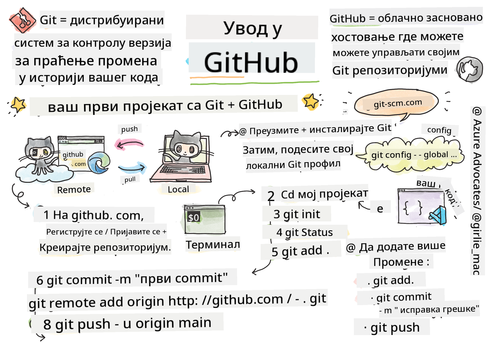
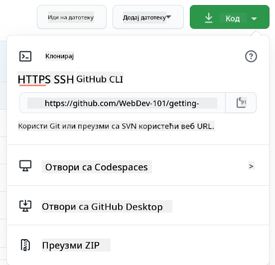

<!--
CO_OP_TRANSLATOR_METADATA:
{
  "original_hash": "361249da70432ddfd4741c917d1a6f50",
  "translation_date": "2025-08-29T12:23:55+00:00",
  "source_file": "1-getting-started-lessons/2-github-basics/README.md",
  "language_code": "sr"
}
-->
# Увод у GitHub

Ова лекција покрива основе GitHub-а, платформе за хостовање и управљање променама у вашем коду.


> Скетч од [Tomomi Imura](https://twitter.com/girlie_mac)

## Квиз пре предавања
[Квиз пре предавања](https://ff-quizzes.netlify.app)

## Увод

У овој лекцији ћемо обрадити:

- праћење рада који обављате на вашем рачунару
- рад на пројектима са другима
- како допринети софтверу отвореног кода

### Предуслови

Пре него што почнете, проверите да ли је Git инсталиран. У терминалу укуцајте:  
`git --version`

Ако Git није инсталиран, [преузмите Git](https://git-scm.com/downloads). Затим подесите свој локални Git профил у терминалу:
* `git config --global user.name "ваше-име"`
* `git config --global user.email "ваш-имејл"`

Да бисте проверили да ли је Git већ конфигурисан, можете укуцати:
`git config --list`

Такође ће вам бити потребан GitHub налог, едитор за код (као што је Visual Studio Code), и потребно је да отворите терминал (или командну линију).

Идите на [github.com](https://github.com/) и направите налог ако га већ немате, или се пријавите и попуните свој профил.

✅ GitHub није једини репозиторијум за код на свету; постоје и други, али GitHub је најпознатији.

### Припрема

Биће вам потребан фолдер са код пројектом на вашем локалном рачунару (лаптопу или ПЦ-у) и јавни репозиторијум на GitHub-у, који ће служити као пример како допринети пројектима других.

---

## Управљање кодом

Претпоставимо да имате фолдер локално са неким код пројектом и желите да почнете да пратите свој напредак користећи git - систем за контролу верзија. Неки људи пореде коришћење git-а са писањем љубавног писма свом будућем себи. Читајући поруке о комитима након неколико дана, недеља или месеци, моћи ћете да се сетите зашто сте донели одређену одлуку или да "вратите" промену - под условом да пишете добре поруке о комитима.

### Задатак: Направите репозиторијум и комитујте код  

> Погледајте видео
> 
> [](https://www.youtube.com/watch?v=9R31OUPpxU4)

1. **Направите репозиторијум на GitHub-у**. На GitHub.com, у картици репозиторијума или из навигационог менија у горњем десном углу, пронађите дугме **new repo**.

   1. Дајте свом репозиторијуму (фолдеру) име.
   1. Изаберите **create repository**.

1. **Пребаците се у свој радни фолдер**. У терминалу, промените директоријум на фолдер који желите да почнете да пратите. Укуцајте:

   ```bash
   cd [name of your folder]
   ```

1. **Иницијализујте git репозиторијум**. У вашем пројекту укуцајте:

   ```bash
   git init
   ```

1. **Проверите статус**. Да бисте проверили статус вашег репозиторијума, укуцајте:

   ```bash
   git status
   ```

   Излаз може изгледати овако:

   ```output
   Changes not staged for commit:
   (use "git add <file>..." to update what will be committed)
   (use "git checkout -- <file>..." to discard changes in working directory)

        modified:   file.txt
        modified:   file2.txt
   ```

   Типично, команда `git status` вам говори, на пример, који фајлови су спремни за _чување_ у репозиторијуму или имају промене које можда желите да сачувате.

1. **Додајте све фајлове за праћење**  
   Ово се такође назива стаговање фајлова/додавање фајлова у стагинг зону.

   ```bash
   git add .
   ```

   Команда `git add` са аргументом `.` означава да су сви ваши фајлови и промене спремни за праћење.

1. **Додајте одабране фајлове за праћење**

   ```bash
   git add [file or folder name]
   ```

   Ово нам помаже да додамо само одабране фајлове у стагинг зону када не желимо да комитујемо све фајлове одједном.

1. **Уклони све фајлове из стагинг зоне**

   ```bash
   git reset
   ```

   Ова команда нам помаже да уклонимо све фајлове из стагинг зоне одједном.

1. **Уклони одређени фајл из стагинг зоне**

   ```bash
   git reset [file or folder name]
   ```

   Ова команда нам помаже да уклонимо само одређени фајл из стагинг зоне који не желимо да укључимо у следећи комит.

1. **Сачувајте свој рад**. У овом тренутку сте додали фајлове у такозвану _стагинг зону_. То је место где Git прати ваше фајлове. Да бисте промену учинили трајном, потребно је да _комитујете_ фајлове. Да бисте то урадили, креирајте _комит_ командом `git commit`. Комит представља тачку чувања у историји вашег репозиторијума. Укуцајте следеће да бисте креирали _комит_:

   ```bash
   git commit -m "first commit"
   ```

   Ово комитује све ваше фајлове, додајући поруку "first commit". За будуће поруке о комитима, желећете да будете описнији како бисте пренели какву сте промену направили.

1. **Повежите свој локални Git репозиторијум са GitHub-ом**. Git репозиторијум је добар на вашем рачунару, али у неком тренутку ћете желети да направите резервну копију својих фајлова негде и такође позовете друге људе да раде са вама на вашем репозиторијуму. Једно одлично место за то је GitHub. Сетите се да смо већ креирали репозиторијум на GitHub-у, тако да је једино што треба да урадимо да повежемо наш локални Git репозиторијум са GitHub-ом. Команда `git remote add` ће то урадити. Укуцајте следећу команду:

   > Напомена: Пре него што укуцате команду, идите на страницу вашег GitHub репозиторијума да бисте пронашли URL репозиторијума. Користићете га у команди испод. Замените ```https://github.com/username/repository_name.git``` са вашим GitHub URL-ом.

   ```bash
   git remote add origin https://github.com/username/repository_name.git
   ```

   Ово креира _remote_, или везу, под именом "origin" која показује на GitHub репозиторијум који сте раније креирали.

1. **Пошаљите локалне фајлове на GitHub**. До сада сте креирали _везу_ између локалног репозиторијума и GitHub репозиторијума. Хајде да пошаљемо ове фајлове на GitHub следећом командом `git push`, овако:

   > Напомена: Име ваше гране може бити другачије од ```main```.

   ```bash
   git push -u origin main
   ```

   Ово шаље ваше комитове у вашу "main" грану на GitHub-у.

2. **Додајте још промена**. Ако желите да наставите са прављењем промена и њиховим слањем на GitHub, само ћете морати да користите следеће три команде:

   ```bash
   git add .
   git commit -m "type your commit message here"
   git push
   ```

   > Савет: Можда ћете желети да усвојите `.gitignore` фајл како бисте спречили да се фајлови које не желите да пратите појаве на GitHub-у - као што је онај фајл са белешкама који чувате у истом фолдеру, али нема место у јавном репозиторијуму. Можете пронаћи шаблоне за `.gitignore` фајлове на [.gitignore templates](https://github.com/github/gitignore).

#### Поруке о комитима

Одлична порука о комиту треба да заврши следећу реченицу:  
Ако се примени, овај комит ће <ваша порука овде>.

За наслов користите императив, садашње време: "промени" уместо "промењено" или "мења".  
Као и у наслову, у телу (опционо) такође користите императив, садашње време. Тело треба да укључи мотивацију за промену и упореди је са претходним понашањем. Објашњавате `зашто`, а не `како`.

✅ Одвојите неколико минута да прегледате GitHub. Можете ли пронаћи заиста добру поруку о комиту? Можете ли пронаћи заиста минималну? Које информације мислите да су најважније и најкорисније за преношење у поруци о комиту?

### Задатак: Сарадња

Главни разлог за постављање ствари на GitHub био је да се омогући сарадња са другим програмерима.

## Рад на пројектима са другима

> Погледајте видео
>
> [](https://www.youtube.com/watch?v=bFCM-PC3cu8)

У вашем репозиторијуму, идите на `Insights > Community` да видите како ваш пројекат стоји у односу на препоручене стандарде заједнице.

Ево неких ствари које могу побољшати ваш GitHub репозиторијум:
- **Опис**. Да ли сте додали опис за ваш пројекат?
- **README**. Да ли сте додали README? GitHub пружа смернице за писање [README](https://docs.github.com/articles/about-readmes/?WT.mc_id=academic-77807-sagibbon).
- **Смернице за доприносе**. Да ли ваш пројекат има [смернице за доприносе](https://docs.github.com/articles/setting-guidelines-for-repository-contributors/?WT.mc_id=academic-77807-sagibbon)?
- **Кодекс понашања**. Да ли ваш пројекат има [кодекс понашања](https://docs.github.com/articles/adding-a-code-of-conduct-to-your-project/)?
- **Лиценца**. Можда најважније, да ли ваш пројекат има [лиценцу](https://docs.github.com/articles/adding-a-license-to-a-repository/)?

Сви ови ресурси ће олакшати укључивање нових чланова тима. То су обично ствари које нови доприносиоци прво гледају пре него што уопште погледају ваш код, како би сазнали да ли је ваш пројекат право место за њихово време.

✅ README фајлови, иако захтевају време за припрему, често се занемарују од стране заузетих одржавалаца. Можете ли пронаћи пример посебно описног README-а? Напомена: постоје неки [алати за креирање добрих README-а](https://www.makeareadme.com/) које бисте можда желели да испробате.

### Задатак: Спојите код

Документација за доприносе помаже људима да допринесу пројекту. Она објашњава које врсте доприноса тражите и како процес функционише. Доприносиоци ће морати да прођу кроз низ корака како би могли да допринесу вашем репозиторијуму на GitHub-у:

1. **Форковање вашег репозиторијума**. Вероватно ћете желети да људи _форкују_ ваш пројекат. Форковање значи креирање реплике вашег репозиторијума на њиховом GitHub профилу.
1. **Клонирање**. Након тога ће клонирати пројекат на свој локални рачунар.
1. **Креирање гране**. Желите да их замолите да креирају _грану_ за свој рад.
1. **Фокусирање на једну област**. Замолите доприносиоце да се концентришу на једну ствар у исто време - на тај начин су веће шансе да можете _спојити_ њихов рад. Замислите да напишу исправку грешке, додају нову функцију и ажурирају неколико тестова - шта ако желите да имплементирате само 2 од 3 или 1 од 3 промене?

✅ Замислите ситуацију у којој су гране посебно критичне за писање и испоруку доброг кода. Које случајеве употребе можете замислити?

> Напомена: Будите промена коју желите да видите у свету и креирајте гране за свој рад. Сви комитови које направите биће направљени на грани на којој сте тренутно "чековани". Користите `git status` да видите на којој сте грани.

Хајде да прођемо кроз процес рада доприносиоца. Претпоставимо да је доприносилац већ _форковао_ и _клонирао_ репозиторијум, тако да има Git репозиторијум спреман за рад на свом локалном рачунару:

1. **Креирање гране**. Користите команду `git branch` да креирате грану која ће садржати промене које желите да допринесете:

   ```bash
   git branch [branch-name]
   ```

1. **Пребацивање на радну грану**. Пребаците се на одређену грану и ажурирајте радни директоријум командом `git switch`:

   ```bash
   git switch [branch-name]
   ```

1. **Радите на променама**. У овом тренутку желите да додате своје промене. Не заборавите да обавестите Git о томе следећим командама:

   ```bash
   git add .
   git commit -m "my changes"
   ```

   Уверите се да сте дали добар назив свом комиту, како за себе тако и за одржаваоца репозиторијума коме помажете.

1. **Комбинујте свој рад са `main` граном**. У неком тренутку завршавате рад и желите да комбинујете свој рад са оним из `main` гране. `Main` грана је можда у међувремену промењена, па се уверите да сте је прво ажурирали на најновију верзију следећим командама:

   ```bash
   git switch main
   git pull
   ```

   У овом тренутку желите да се уверите да се сви _конфликти_, ситуације у којима Git не може лако да _комбинује_ промене, дешавају у вашој радној грани. Због тога покрените следеће команде:

   ```bash
   git switch [branch_name]
   git merge main
   ```

   Ово ће унети све промене из `main` гране у вашу грану и, надамо се, можете само наставити. Ако не, VS Code ће вам показати где је Git _збуњен_, а ви само измените погођене фајлове како бисте рекли који садржај је најтачнији.

1. **Пошаљите свој рад на GitHub**. Слање вашег рада на GitHub подразумева две ствари. Гурање ваше гране на ваш репозиторијум и затим отварање PR-а (Pull Request).

   ```bash
   git push --set-upstream origin [branch-name]
   ```

   Горња команда креира грану на вашем форкованом репозиторијуму.

1. **Отворите PR**. Затим, желите да отворите PR. То радите тако што одете на форковани репозиторијум на GitHub-у. Видећете индикацију на GitHub-у где вас пита да ли желите да креирате нови PR, кликнете на то и бићете одведени
`Pull request` изгледа као смешан термин јер у ствари желите да "пушујете" своје измене у пројекат. Али одржавалац (власник пројекта) или главни тим треба да размотри ваше измене пре него што их споји са "главном" граном пројекта, тако да у суштини тражите одлуку о промени од одржаваоца.

`Pull request` је место где се упоређују и дискутују разлике уведене на грани уз рецензије, коментаре, интегрисане тестове и још много тога. Добар `pull request` прати отприлике иста правила као и порука комита. Можете додати референцу на проблем у трагачу за проблемима, на пример када ваш рад решава неки проблем. Ово се ради коришћењем `#` праћеног бројем вашег проблема. На пример, `#97`.

🤞Држимо палчеве да сви провери прођу и да власник(ци) пројекта споје ваше измене у пројекат🤞

Ажурирајте своју тренутну локалну радну грану са свим новим комитима са одговарајуће удаљене гране на GitHub-у:

`git pull`

## Како допринети отвореном коду

Прво, хајде да пронађемо репозиторијум (или **репо**) на GitHub-у који вас занима и коме бисте желели да допринесете неком променом. Желите да копирате његов садржај на свој рачунар.

✅ Добар начин да пронађете репозиторијуме погодне за почетнике је [претрага по ознаци 'good-first-issue'](https://github.blog/2020-01-22-browse-good-first-issues-to-start-contributing-to-open-source/).



Постоји неколико начина за копирање кода. Један од начина је да "клонирате" садржај репозиторијума, користећи HTTPS, SSH или GitHub CLI (Command Line Interface).

Отворите свој терминал и клонирајте репозиторијум овако:
`git clone https://github.com/ProjectURL`

Да бисте радили на пројекту, промените директоријум на одговарајући фолдер:
`cd ProjectURL`

Такође можете отворити цео пројекат користећи [Codespaces](https://github.com/features/codespaces), GitHub-ов уграђени едитор кода / облачно окружење за развој, или [GitHub Desktop](https://desktop.github.com/).

На крају, можете преузети код у зипованом фолдеру.

### Неколико занимљивих ствари о GitHub-у

Можете да означите звездицом, пратите и/или "форкујете" било који јавни репозиторијум на GitHub-у. Своје означене репозиторијуме можете пронаћи у падајућем менију у горњем десном углу. То је као обележивање, али за код.

Пројекти имају трагач за проблемима, углавном на GitHub-у у картици "Issues", осим ако није другачије назначено, где људи дискутују о проблемима везаним за пројекат. А картица "Pull Requests" је место где људи дискутују и прегледају измене које су у току.

Пројекти могу такође имати дискусије у форумима, мејлинг листама или чет каналима као што су Slack, Discord или IRC.

✅ Погледајте свој нови GitHub репозиторијум и испробајте неколико ствари, као што су подешавање опција, додавање информација у свој репозиторијум и креирање пројекта (као што је Канбан табла). Постоји много тога што можете да урадите!

---

## 🚀 Изазов

Упарите се са пријатељем и радите на коду једно другог. Креирајте пројекат заједно, форкујте код, креирајте гране и спајајте измене.

## Квиз након предавања
[Квиз након предавања](https://ff-quizzes.netlify.app/web/en/)

## Преглед и самостално учење

Прочитајте више о [доприносу софтверу отвореног кода](https://opensource.guide/how-to-contribute/#how-to-submit-a-contribution).

[Git подсетник](https://training.github.com/downloads/github-git-cheat-sheet/).

Вежбајте, вежбајте, вежбајте. GitHub има одличне путеве за учење доступне преко [skills.github.com](https://skills.github.com):

- [Прва недеља на GitHub-у](https://skills.github.com/#first-week-on-github)

Ту ћете пронаћи и напредније курсеве.

## Задатак

Завршите [курс Прва недеља на GitHub-у](https://skills.github.com/#first-week-on-github)

---

**Одрицање од одговорности**:  
Овај документ је преведен коришћењем услуге за превођење помоћу вештачке интелигенције [Co-op Translator](https://github.com/Azure/co-op-translator). Иако тежимо тачности, молимо вас да имате у виду да аутоматски преводи могу садржати грешке или нетачности. Оригинални документ на изворном језику треба сматрати ауторитативним извором. За критичне информације препоручује се професионални превод од стране људи. Не сносимо одговорност за било каква неспоразумевања или погрешна тумачења која могу произаћи из коришћења овог превода.