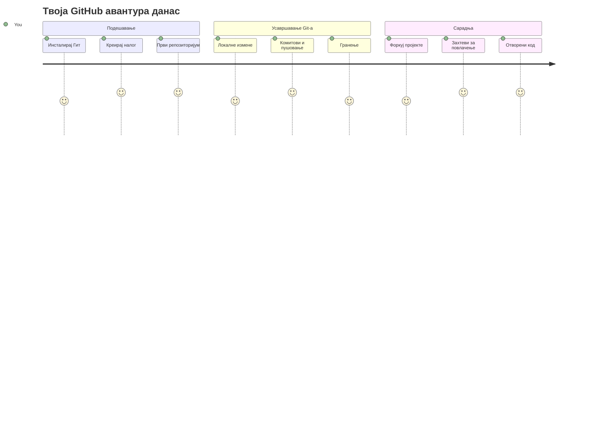
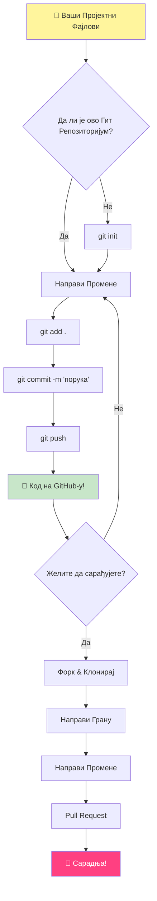
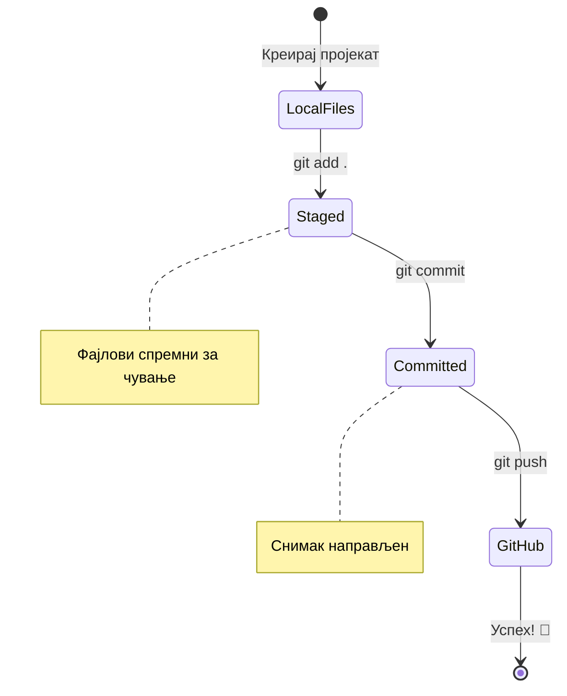
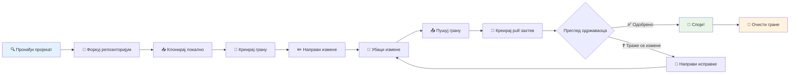
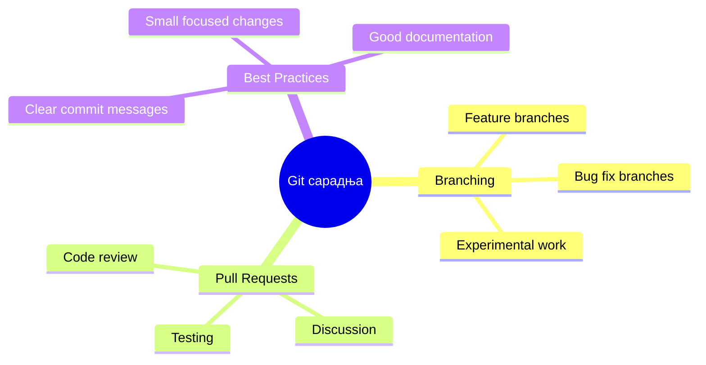
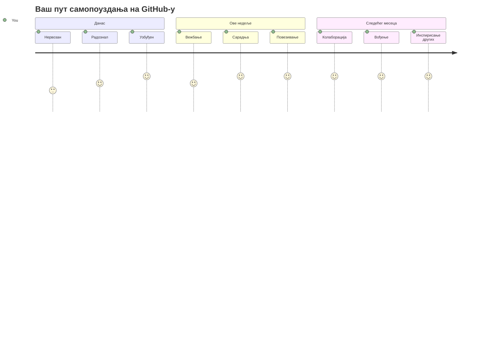

<!--
CO_OP_TRANSLATOR_METADATA:
{
  "original_hash": "5c383cc2cc23bb164b06417d1c107a44",
  "translation_date": "2026-01-07T08:33:23+00:00",
  "source_file": "1-getting-started-lessons/2-github-basics/README.md",
  "language_code": "sr"
}
-->
# Увод у GitHub

Здраво, будући програмеру! 👋 Спреман да се придружиш милионима програмера широм света? Јако сам узбуђен што ти могу представити GitHub – замисли то као друштвену мрежу за програмере, само што уместо дељења фотографија ручка, ми делимо код и заједно градимо невероватне ствари!

Ово ми је заиста невероватно: свака апликација на твом телефону, сваки сајт који посећујеш, и већина алата које ћеш научити да користиш су направљени од стране тимова програмера који сарађују на платформама попут GitHub-а. Она музичка апликација која ти је омиљена? Неко као ти је допринео. Она игра коју не можеш да оставиш? Да, вероватно је направљена уз помоћ сарадње на GitHub-у. А сада ћеш ТИ научити како да будеш део те невероватне заједнице!

Знам да ово може прво деловати као пуно тога – искрено, сећам се када сам први пут гледао GitHub страницу и размишљао "Шта ово уопште значи?" Али ево ствар: сваки програмер је почео баш са места где си ти сада. До краја ове лекције, имаћеш свој GitHub репозиторијум (замисли га као своју личну изложбу пројеката у облаку), и знаћеш како да сачуваш свој рад, делиш га са другима, и чак допринесеш пројектима које користе милиони људи.

Ову ћемо авантуру проћи заједно, корак по корак. Без журбе, без притиска – само ти, ја и неки стварно кул алати који ће ускоро постати твоји нови најбољи пријатељи!


> Sketchnote by [Tomomi Imura](https://twitter.com/girlie_mac)


## Квиз пре предавања
[Pre-lecture quiz](https://ff-quizzes.netlify.app)

## Увод

Пре него што заронимо у стварно узбудљиве ствари, хајде да припремимо твој рачунар за мало GitHub мађије! Замисли ово као организацију твојих уметничких средстава пре него што направиш ремек-дело – када имаш праве алате спремне, све иде много глатко и пуно је забавније.

Провешћу те кроз сваки корак подешавања лично, и обећавам да није ни изблиза онако застрашујуће као што можда изгледа на први поглед. Ако ти нешто не буде одмах јасно, то је потпуно нормално! Сећам се кад сам подешавао своје прво развојно окружење и имао осећај као да покушавам да читам древне хијероглифе. Сваки програмер је био где си ти сада, питајући се да ли ради исправно. Спојлер: ако си овде и учиш, већ радиш исправно! 🌟

У овој лекцији ћемо обрадити:

- праћење посла који радиш на свом рачунару
- рад на пројектима са другима
- како допринети софтверу отвореног кода

### Претпоставке

Хајде да припремимо твој рачунар за мало GitHub мађије! Не брини – ово подешавање треба урадити само једном, а онда ћеш бити спреман за цело своје кодирање.

У реду, почнимо са основом! Прво, морамо да проверимо да ли је Git већ инсталиран на твом рачунару. Git је у суштини као да имаш супер паметног помоћника који памти сваки твој потез на коду – много боље од паничног притискања Ctrl+S свака два секунде (сви смо то радили!).

Проверимо да ли је Git већ инсталиран тако што ћеш у терминалу откуцати ову магичну команду:
`git --version`

Ако Git још није ту, без бриге! Само иди на [download Git](https://git-scm.com/downloads) и преузми га. Када га инсталираш, морамо да ти правилно представимо Git:

> 💡 **Прво подешавање:** Ове команде кажу Gиту ко си ти. Ове информације ће бити прикачене на сваки commit који направиш, па изабери име и имејл које желиш да делиш јавно.

```bash
git config --global user.name "your-name"
git config --global user.email "your-email"
```

Да провериш да ли је Git већ конфигурисан, можеш откуцати:
```bash
git config --list
```

Такође ће ти требати GitHub налог, уређивач кода (нпр. Visual Studio Code) и мораш отворити свој терминал (или командну линију).

Иди на [github.com](https://github.com/) и направи налог ако га немаш, или се пријави и попуни свој профил.

💡 **Модеран савет:** Размисли о постављању [SSH кључева](https://docs.github.com/en/authentication/connecting-to-github-with-ssh) или коришћењу [GitHub CLI](https://cli.github.com/) за лакшу аутентификацију без лозинки.

✅ GitHub није једино место за код у свету; има и других, али GitHub је најпознатији

### Припрема

Потребан ти је и фолдер са код пројектом на локалном рачунару (лаптоп или рачунар), и јавни репозиторијум на GitHub-у, који ће служити као пример како допринети пројектима других.

### Чување твог кода безбедним

Хајде да мало причамо о безбедности – али не брини, нећемо те преплавити страшним стварима! Замисли ове безбедносне праксе као закључавање аутомобила или куће. То су једноставне навике које постају део тебе и штите твој вредан рад.

Показаћемо ти модерне, безбедне начине рада са GitHub-ом од самог почетка. Тако ћеш развити добре навике које ће ти користити током читаве кодерске каријере.

Када радиш са GitHub-ом, важно је да следиш безбедносне најбоље праксе:

| Безбедносна област | Најбоља пракса | Зашто је важна |
|-------------------|----------------|----------------|
| **Аутентификација** | Користи SSH кључеве или Personal Access Tokene | Лозинке су мање безбедне и постају ствар прошлости |
| **Двострука аутентификација** | Омогући 2FA на свом GitHub налогу | Додаје додатни слој заштите налогу |
| **Безбедност репозиторијума** | Нико не треба да шаље осетљиве податке | API кључеви и лозинке никада не смеју бити у јавним репозиторијумима |
| **Управљање зависностима** | Омогући Dependabot за ажурирања | Одржава твоје зависности безбедним и ажурним |

> ⚠️ **Критично безбедносно упозорење:** Никада не шаљи API кључеве, лозинке или друге осетљиве информације у било који репозиторијум. Користи environment променљиве и `.gitignore` фајлове да заштитиш осетљиве податке.

**Модерно подешавање аутентификације:**

```bash
# Генеришите SSH кључ (модерни ed25519 алгоритам)
ssh-keygen -t ed25519 -C "your_email@example.com"

# Поставите Git да користи SSH
git remote set-url origin git@github.com:username/repository.git
```

> 💡 **Професионални савет:** SSH кључеви елиминишу потребу за сталним уношењем лозинки и безбеднији су од традиционалних метода аутентификације.

---

## Управљање твојим кодом као професионалац

ОК, ОВДЕ ствари постају стварно узбудљиве! 🎉 Ускоро ћемо научити како да пратиш и управљаш својим кодом као прави професионалци, и искрено, ово је једна од мојих омиљених ствари за предавање јер је права трансформација.

Замисли ово: пишеш невероватну причу и желиш да пратим сваки нацрт, сваку сјајну измену и сваки „чекај, ово је генијално!“ моменат на путу. То ти Git управо омогућава за твој код! Као да имаш невероватан нотебук који путује кроз време и памти СВЕ – сваки откуцани знак, сваку промену, сваки „јао, сад сам све покварио“ моменат који моментално можеш да поништиш.

Искрено ћемо признати – ово може прво да делује као нешто превише. Када сам ја почео, мислио сам „Зашто не могу једноставно да сачувам фајлове као обично?“ Али веруј ми: кад ти Git проради (и хоће!), имаш онај моменат када ти се упали лампица и помислиш „Како сам икад уопште кодирао без овога?“ Као да си открио да можеш да летиш кад си цео живот само ходао!

Рецимо да имаш фолдер са неким код пројектом локално и желиш да почнеш да пратити свој напредак коришћењем git система за контролу верзија. Неки људи пореде коришћење гита са писањем љубавног писма себи у будућности. Када чита твоје поруке комита дане, недеље или месеце касније, моћи ћеш да се сетиш зашто си направио одређену одлуку, или да "врнеш назад" промену – то јест, када писање добрих порука о "commit-у" има смисла.


### Задаци: Направи свој први репозиторијум!

> 🎯 **Твој задатак (и тако сам узбуђен због тебе!)**: Заједно ћемо направити твој први GitHub репозиторијум! Када завршимо овде, имаћеш свој мали угао интернета где живи твој код, и направићеш свој први "commit" (то је језик програмера за паметно чување рада).
>
> Ово је стварно посебан тренутак – коначно се придружујеш глобалној заједници програмера! Још увек памтим узбуђење када сам направио свој први репо и помислио "Вау, стварно ово радим!"

Корак по корак проћи ћемо ову авантуру заједно. Узми време са сваким делом – нема такмичења ко ће брже, и обећавам да ће сваки корак имати смисла. Запамти, сваки кодер звезда коју се дивиш некада је седео баш тамо где си ти сада, спреман да направи свој први репозиторијум. Колико је то кул?

> Погледај видео
> 
> [](https://www.youtube.com/watch?v=9R31OUPpxU4)

**Хајде да радимо заједно:**

1. **Направи свој репозиторијум на GitHub-у.** Иди на GitHub.com и пронађи светло зелено дугме **New** (или знак **+** у горњем десном углу). Кликни и изабери **New repository**.

   Ево шта треба да урадиш:
   1. Дај репозиторијуму име – нека буде нешто значајно за тебе!
   1. Додај опис ако желиш (ово помаже другима да разумеју чему твој пројекат служи)
   1. Одлучи да ли желиш да буде јаван (сви могу да виде) или приватан (само ти)
   1. Препоручујем да означиш кутију за додавање README фајла – то је као насловна страна твог пројекта
   1. Кликни **Create repository** и прослави – управо си направио свој први репо! 🎉

2. **Уђи у фолдер свог пројекта.** Сада отвори терминал (не брини, није баш страшно колико изгледа!). Морамо да кажемо твом рачунару где су ти фајлови пројекта. Откуцај ову команду:

   ```bash
   cd [name of your folder]
   ```

   **Овде радимо ово:**
   - У суштини говоримо „Хеј рачунару, одведи ме до мог фолдера са пројектом“
   - То је као да отвараш одређени фолдер на десктопу, само што овде радимо текста командом
   - Замијени `[name of your folder]` имем стварног имена твог фолдера са пројектом

3. **Претвори свој фолдер у Git репозиторијум.** Овде почиње магија! Откуцај:

   ```bash
   git init
   ```

   **Ево шта се управо десило (помало кул ствар!):**
   - Git је направио скривени `.git` фолдер у твом пројекту – нећеш га видети, али је ту!
   - Твој обични фолдер је сада „репозиторијум“ који може да прати све промене које направиш
   - Замисли то као да си дао супермоћи твом фолдеру да памти све

4. **Погледај шта се дешава.** Хајде да видимо шта Git мисли о твом пројекту у овом тренутку:

   ```bash
   git status
   ```

   **Разумевање шта ти Git говори:**

   Можда ћеш видети нешто овако:

   ```output
   Changes not staged for commit:
   (use "git add <file>..." to update what will be committed)
   (use "git restore <file>..." to discard changes in working directory)

        modified:   file.txt
        modified:   file2.txt
   ```

   **Не паничи! Ово значи:**
   - Фајлови у **црвеној боји** су фајлови који имају промене али нису спремни за чување
   - Фајлови у **зеленој боји** (када их видиш) су спремни за чување
   - Git ти љубазно говори шта можеш следеће да урадиш

   > 💡 **Професионални савет:** Команда `git status` је твој најбољи пријатељ! Користи је кад год си збуњен шта се дешава. Као да питаш Git-а „Хеј, какав је тренутни положај?“

5. **Припреми фајлове за чување** (ово се зове „staging“):

   ```bash
   git add .
   ```

   **Шта смо управо урадили:**
   - Рекли смо Git-у „Хеј, желим да укључим СВЕ фајлове у следеће чување“
   - `.` значи „све у овом фолдеру“
   - Сада су ти фајлови „спремљени“ и спремни за следећи корак

   **Желиш да будеш селективнији?** Можеш додати само неке специфичне фајлове:

   ```bash
   git add [file or folder name]
   ```

   **Зашто би то желео?**
   - Понекад желиш да сачувдаш повезане промене заједно
   - Помоћи ће ти да организујеш рад у логичке делове
   - Лакше је разумети шта је и када променљено

   **Променио мишљење?** Без бриге! Можеш уклонити фајлове из „спремног за чување“ стања овако:

   ```bash
   # Уклони све са индексa
   git reset
   
   # Уклони само један фајл са индексa
   git reset [file name]
   ```

   Не брини – ово не брише твој рад, само избацује фајлове из „спремних за чување“.

6. **Сачувај свој рад заувек** (прављење првог commit-а!):

   ```bash
   git commit -m "first commit"
   ```

   **🎉 Честитамо! Управо си направио свој први commit!**

   **Ево шта се управо десило:**
   - Git је узео „снимак“ свих твојих спремљених фајлова у овом тренутку
   - Твоја порука комита „first commit“ објашњава зашто је ово тачка чувања
   - Git је дао овом снимку јединствени ID да га увек можеш пронаћи касније
   - Званично си почео да пратиш историју свог пројекта!

   > 💡 **Поруке за будуће commit-ове:** За следеће буди описнији! Уместо „updated stuff“ покушај „Add contact form to homepage“ или „Fix navigation menu bug“. Твоје будуће ја ће ти бити захвално!

7. **Повежи свој локални пројекат са GitHub-ом.** Тренутно твој пројекат постоји само на твом рачунару. Хајде да га повежемо са GitHub репозиторијумом да би могао да га делиш са светом!

   Прво иди на страницу свог GitHub репозиторијума и копирај URL. Затим се врати овде и упиши:

   ```bash
   git remote add origin https://github.com/username/repository_name.git
   ```
   
   (Заменити тај URL стварним URL-ом твог репозиторијума!)

   **Шта смо управо урадили:**
   - Направили смо везу између вашег локалног пројекта и вашег GitHub репозиторијума
   - „Origin“ је само надимак за ваш GitHub репозиторијум – то је као додавање контакта у ваш телефон
   - Сада ваш локални Git зна куда да шаље ваш код када будете спремни да га поделите

   💡 **Једноставнији начин**: Ако имате инсталиран GitHub CLI, можете ово урадити у једној команди:
   ```bash
   gh repo create my-repo --public --push --source=.
   ```

8. **Пошаљите ваш код на GitHub** (велики тренутак!):

   ```bash
   git push -u origin main
   ```

   **🚀 Ето га! Отпремате ваш код на GitHub!**
   
   **Шта се дешава:**
   - Ваши комити путују са вашег рачунара до GitHub-а
   - Опција `-у` успоставља трајну везу тако да су будући push-еви једноставнији
   - „main“ је име ваше главне гранe (као главна фасцикла)
   - После овога, у будућности можете само укуцати `git push` за отпремање!

   💡 **Кратка напомена**: Ако се ваша грана зове другачије (нпр. „master“), користите то име уместо тога. Можете проверити командом `git branch --show-current`.

9. **Ваш нови дневни ритам програмирања** (овде почиње зависност!):

   Од сада, кад год направите измене на свом пројекту, имате овај једноставан трокорак:

   ```bash
   git add .
   git commit -m "describe what you changed"
   git push
   ```

   **Ово постаје ваш ритам рада:**
   - Направите сјајне промене у коду ✨
   - Стейџујте их са `git add` („Хеј Git, обрни пажњу на ове измене!“)
   - Сачувајте их са `git commit` и описном поруком (будући ти ће ти захвалити!)
   - Поделите их са светом користећи `git push` 🚀
   - Понављајте – озбиљно, ово постаје природно као дисање!

   Волим овај радни ток јер је као да имате више тачака за чување у видео игри. Направили сте измену која вам се свиђа? Комитујте је! Желите да пробате нешто ризично? Нема проблема – увек можете да се вратите на последњи комит ако што пође наопако!

   > 💡 **Савет**: Можда ћете желети да користите `.gitignore` фајл да спречите да фајлови које не желите да пратите буду видљиви на GitHub-у – као што је фајл са белешкама који чувате у истој фасцикли, али нема места на јавном репозиторијуму. Можете пронаћи шаблоне за `.gitignore` фајлове на [.gitignore templates](https://github.com/github/gitignore) или направити један помоћу [gitignore.io](https://www.toptal.com/developers/gitignore).

### 🧠 **Први чек-ин у репозиторијум: Како сте се осећали?**

**Одвојите тренутак да прославите и размислите:**
- Како сте се осећали када сте први пут видели свој код на GitHub-у?
- Који корак вам је био најзбуњујући, а који изненађујуће једноставан?
- Можете ли својим речима објаснити разлику између `git add`, `git commit` и `git push`?


> **Запамтите**: Чак и искусни програмери понекад забораве тачне команде. Убацити овај радни ток у мишићну меморију захтева вежбу – сјајно вам иде!

#### Савремени Git радни токови

Размотрите усвајање ових савремених пракси:

- **Conventional Commits**: Користите стандардизован формат поруке комита као што су `feat:`, `fix:`, `docs:` и слично. Сазнајте више на [conventionalcommits.org](https://www.conventionalcommits.org/)
- **Атомски комити**: Нека сваки комит представља једну логичку измену
- **Чести комити**: Комитујте често са описним порукама уместо великих, ретких комита

#### Поруке комита

Добар наслов комита у Git-у завршава следећу реченицу:
Ако се примени, овај комит ће <ваш наслов овде>

За наслов користите императив, садашње време: „change“ а не „changed“ нити „changes“.
Као у наслову, у телу (опционо) такође користите императив, садашње време. Тело би требало да обухвати мотивацију за измену и упореди је са претходним понашањем. Објашњавате `зашто`, а не `како`.

✅ Одвојте неколико минута за истраживање по GitHub-у. Можете ли пронаћи заиста добру поруку комита? Можете ли пронаћи заиста минималну? Које информације мислите да су најважније и најкорисније за пренети у поруци комита?

## Рад са другима (забавни део!)

Држите шешир јер је ОВО место где GitHub постаје заиста магичан! 🪄 Управљали сте својим кодом, али сада дубоко улазимо у мој омиљени део – сарадњу са невероватним људима широм света.

Замислите ово: сутра ујутро видите да је неко у Токију унапредио ваш код док сте спавали. Онда неко из Берлина поправи баг на ком сте заглавили. Поподне, програмер из Сао Паула дода функцију о којој никад нисте ни мислили. То није научна фантастика – то је уторак у GitHub универзуму!

Оно што ме посебно радује је то што су вештине сарадње које ћете научити управо ТОЧНО исти радни токови које тимови у Google-у, Microsoft-у и вашим омиљеним стартапима користе сваког дана. Не учите само кул алат – учите тајни језик који омогућава да цео софтверски свет функционише као један тим.

Сериозно, када доживите узбуђење да неко прихвати ваш први pull request, разумећете зашто програмери постају тако страствени према open source-у. То је као део највећег и најкреативнијег тимског пројекта на свету!

> Погледајте видео
>
> [](https://www.youtube.com/watch?v=bFCM-PC3cu8)

Главни разлог што смо стављали ствари на GitHub био је да омогућимо сарадњу са другим програмерима.


У вашем репозиторијуму идите на `Insights > Community` да видите како ваш пројекат стоји у односу на препоручене стандарде заједнице.

Желите да ваш репозиторијум изгледа професионално и пријатно? Отидите у ваш репозиторијум и кликните на `Insights > Community`. Ова сјајна функција вам показује како ваш пројекат стоји у односу на оно што GitHub заједница сматра „добрим праксама уређеног репозиторијума.“

> 🎯 **Нека ваш пројекат блиста**: Добро организован репозиторијум са добром документацијом је као чист и пријатан излог продавнице. Каже људима да вам је стало до вашег посла и подстиче друге да допринесу!

**Ево шта чини репозиторијум сјајним:**

| Шта додати | Зашто је важно | Шта вам доноси |
|-------------|-------------------|---------------------|
| **Опис** | Први утисак је важан! | Људи одмах знају шта ваш пројекат ради |
| **README** | Насловна страна вашег пројекта | Као пријатни водич за нове посетиоце |
| **Упутства за допринос** | Показује да прихватате помоћ | Људи знају како могу помоћи |
| **Правила понашања** | Ствара пријатан простор | Свако се осећа добродошлим |
| **Лиценца** | Правна јасноћа | Други знају како могу користити ваш код |
| **Политика безбедности** | Показује вашу одговорност | Демонстрира професионалне праксе |

> 💡 **Професионални савет**: GitHub пружа шаблоне за све ове фајлове. Када креирате нови репозиторијум, означите поља да бисте аутоматски генерисали ове фајлове.

**Модерне GitHub функције које треба истражити:**

🤖 **Аутоматизација и CI/CD:**
- **GitHub Actions** за аутоматизовано тестирање и деплој
- **Dependabot** за аутоматске ажурирања зависности

💬 **Заједница и управљање пројектом:**
- **GitHub Discussions** за разговоре заједнице ван issue-а
- **GitHub Projects** за канбан стил управљања пројектом
- **Правила заштите грана** за одржавање стандарда квалитета кода


Сви ови алати помажу при увођењу нових чланова тима. И то су обично ствари које нови сарадници прегледају пре него што погледају ваш код, да би сазнали да ли је ваш пројекат право место за њихово време.

✅ README фајлови, иако захтевају време за припрему, често се занемарују од стране заузетих одржавача. Можете ли пронаћи пример посебно описног? Напомена: постоје неки [алати за креирање добрих README-ја](https://www.makeareadme.com/) које бисте можда желели да испробате.

### Задатак: Споји неки код

Документација за допринос помаже људима да допринесу пројекту. Објашњава које врсте доприноса тражите и како процес функционише. Сарадници ће морати да прођу кроз низ корака да би могли да допринесу вашем репозиторијуму на GitHub-у:


1. **Fork-овање вашег репа** Вероватно ћете желети да људи _fork_-ују ваш пројекат. Fork-овање значи да направе реплику вашег репозиторијума на свом GitHub налогу.
1. **Клонирање**. Одатле ће клонирати пројекат на свој локални рачунар.
1. **Креирање гране**. Биће потребно да им тражите да креирају _грану_ за свој рад.
1. **Фокусирање промене на један аспект**. Замолите сараднике да своје промене концентришу на једну ствар у једном тренутку – тако су веће шансе да можете _спојити_ њихов рад. Замислите да напишу поправку бага, додају нову функцију и ажурирају неколико тестова – шта ако желите или можете имплементирати само 2 од 3, или 1 од 3 промене?

✅ Замислите ситуацију где су гране посебно критичне за писање и испоруку доброг кода. Које употребне случајеве можете смислити?

> Напомена, будите промена коју желите да видите у свету, и креирајте гране и за свој рад. Сви комити које направите биће на грани на којој сте тренутно „checkout-овани“. Користите `git status` да видите која је то гранa.

Прођимо кроз радни ток сарадника. Претпоставимо да је сарадник већ _fork-овао_ и _клонирао_ репо тако да има Git репозиторијум спреман за рад на свом локалном рачунару:

1. **Креирај грану**. Користите команду `git branch` да направите грану која ће садржати промене које желе да унесу:

   ```bash
   git branch [branch-name]
   ```

   > 💡 **Модеран приступ**: Можете и у једној команди направити и прелазак на нову грану:
   ```bash
   git switch -c [branch-name]
   ```

1. **Прелазак на радну грану**. Прелазак на одређену грану и ажурирање радног директоријума са `git switch`:

   ```bash
   git switch [branch-name]
   ```

   > 💡 **Модерна напомена**: `git switch` је нова, јаснија и безбеднија замена за `git checkout` приликом промене грана, посебно за почетнике.

1. **Обави посао**. У овом тренутку желите да додате измене. Не заборавите да обавестите Git помоћу следећих команда:

   ```bash
   git add .
   git commit -m "my changes"
   ```

   > ⚠️ **Квалитет поруке комита**: Обавезно дајте комиту добар назив, и за вас и за одржаваоца репозиторијума у којем помажете. Будите специјални шта сте променили!

1. **Комбинуј свој рад са главном граном**. У неком тренутку завршавате рад и желите да спојите свој рад са `main` граном. Могуће је да се `main` измењивала у међувремену па прво ажурирајте локални `main` из следећих команди:

   ```bash
   git switch main
   git pull
   ```

   У овом тренутку желите да осигурати да се свака конфузија (_conflicts_), ситуације где Git не може лако да _споји_ промене дешавају у вашој радној грани. Стога покрените следеће команде:

   ```bash
   git switch [branch_name]
   git merge main
   ```

   Команда `git merge main` доноси све измене са `main` у вашу грану. Надамо се да можете да наставите без проблема. Ако не, VS Code ће вам показати где је Git _збуњен_ и само модификујте погођене фајлове тако да кажете који садржај је исправан.

   💡 **Модерна алтернатива**: Размотрите коришћење `git rebase` за чистију историју:
   ```bash
   git rebase main
   ```
   Ово репродукује ваше комите на врху најновије main гране, стварајући линеарну историју.

1. **Пошаљи свој рад на GitHub**. Слање рада на GitHub подразумева две ствари: пушовање ваше гране у ваш репо и потом отварање PR-а, Pull Request.

   ```bash
   git push --set-upstream origin [branch-name]
   ```

   Горња команда креира грану на вашем форкованом репозиторијуму.

### 🤝 **Провера вештина сарадње: Спремни за рад са другима?**

**Погледајмо како се осећате у вези сарадње:**
- Да ли вам сада има смисла идеја о forking-у и pull request-има?
- Која је једна ствар коју желите више да вежбате у раду са гранама?
- Колико сте сигурни у свој допринос пројектима других?


> **Потицај самопоуздања**: Сваки програмер кога цените био је некад нервозан због свог првог pull request-а. GitHub заједница је невероватно добродошла према новајлијама!

1. **Отвори PR**. Затим желите да отворите PR. То радите тако што одете у форковани репо на GitHub-у. Видећете индикацију на GitHub-у где ће вам бити понуђено да направите нови PR, кликнете то и отвара се интерфејс где можете променити наслов поруке комита, дати прикладнији опис. Сада ће одржаваоци репозиторијума који сте форк-овали видети овај PR и, _показало се_, вероватно ће га ценити и _спојити_. Сада сте и ви сарадник, јупии :)

   💡 **Модеран савет**: PR-ове можете отварати и помоћу GitHub CLI:
   ```bash
   gh pr create --title "Your PR title" --body "Description of changes"
   ```

   🔧 **Најбоље праксе за PR-ове**:
   - Повежите са релевантним issue-има користећи кључне речи као што су „Fixes #123“
   - Додајте снимке екрана за промене у корисничком интерфејсу
   - Захтевајте специфичне рецензенте
   - Користите draft PR-ове за рад у току
   - Осигурајте да су све CI проверe прошле пре тражeња прегледа
1. **Чишћење**. Смата се добром праксом да се _очисти_ након што успешно спојите PR. Желите да очистите и своју локалну грану и грану коју сте послали на GitHub. Прво да је избришемо локално помоћу следеће наредбе:

   ```bash
   git branch -d [branch-name]
   ```

   Обавезно идите на GitHub страницу за форковани репозиторијум и уклоните удаљену грану коју сте управо послали.

`Pull request` звучи као необичан термин јер у ствари желите да гурнете своје измене у пројекат. Али одржавач (власник пројекта) или основни тим морају да размотре ваше промене пре него што их споје са „главном“ граном пројекта, тако да у ствари тражите одржаваочеву одлуку о промени.

Pull request је место где се упоређују и дискутују разлике уведене на грани са рецензијама, коментарима, интегрисаним тестовима и још много тога. Добар pull request следи приближно иста правила као порука комита. Можете додати референцу на issue у систему за праћење проблема, када, на пример, ваш рад решава неки проблем. Ово се ради коришћењем `#` праћеног бројем вашег issue. На пример `#97`.

🤞Палац на горе да све провере прођу и да власник пројекта споји ваше промене у пројекат🤞

Ажурирајте тренутну локалну радну грану свим новим комитима са одговарајуће удаљене гране на GitHub-у:

`git pull`

## Допринос отвореном софтверу (Ваша шанса да оставите траг!)

Јесте ли спремни за нешто што ће вам потпуно одушевити ум? 🤯 Хајде да причамо о доприносу пројектима отвореног кода – и већ добијам зимицу само када помислим да то делим са вама!

Ово је ваша шанса да постанете део нечега заиста изузетног. Замислите да унапређујете алате које милиони програмера користе сваки дан или да поправите грешку у апликацији коју ваши пријатељи обожавају. То није само сан – то је оно о чему је допринос отвореном коду!

Ево шта ме сваки пут потресе кад помислим на то: сваки алат с којим сте учили – ваши уређивачи кода, фрејмворкови које ћемо истраживати, чак и прегледач у ком читате ово – почели су када је неко баш као ви направио свој први допринос. Онај бриљантни програмер који је направио вашу омиљену VS Code екстензију? И он је некада био почетник који је дрхтавим рукама кликнуо на „create pull request“, баш као што ћете и ви ускоро.

А ево најлепшег дела: заједница отвореног кода је као највећи виртуелни загрљај. Већина пројеката активно траже новајлије и имају issue-e означене као „good first issue“ управо за људе попут вас! Одржаваоци заиста добију узбуђење када виде нове доприносе јер се сећају својих првих корака.

```mermaid
flowchart TD
    A[🔍 Истражи GitHub] --> B[🏷️ Пронађи "добар први задатак"]
    B --> C[📖 Прочитај Упутство за допринос]
    C --> D[🍴 Форкуј Репозиторијум]
    D --> E[💻 Постави локално окружење]
    E --> F[🌿 Креирај грану за нову функцију]
    F --> G[✨ Направи свој допринос]
    G --> H[🧪 Тестирај своје измене]
    H --> I[📝 Напиши јасан комит]
    I --> J[📤 Истегни и направи PR]
    J --> K[💬 Укључи се у повратне информације]
    K --> L[🎉 Укључено! Ти си доприносилац!]
    L --> M[🌟 Пронађи следећи задатак]
    
    style A fill:#e1f5fe
    style L fill:#c8e6c9
    style M fill:#fff59d
```
Овде не учите само како да кодите – ви се припремате да се придружите глобалној породици твораца који се сваког дана буде с размишљањем „Како можемо учинити дигитални свет бољим?“ Добродошли у клуб! 🌟

Прво, хајде да пронађемо репозиторијум (или **repo**) на GitHub-у који вас интересује и коме желите да допринесете променом. Желећете да копирате његов садржај на свој рачунар.

✅ Добар начин за проналажење „пријатељских за почетнике“ репозиторијума је да [претражите по тагу 'good-first-issue'](https://github.blog/2020-01-22-browse-good-first-issues-to-start-contributing-to-open-source/).


Постоји више начина да копирате код. Један од начина је да „клонирате“ садржај репозиторијума, користећи HTTPS, SSH или GitHub CLI (Command Line Interface).

Отворите свој терминал и клонирајте репозиторијум овако:
```bash
# Коришћење HTTPS-а
git clone https://github.com/ProjectURL

# Коришћење SSH-а (потребна је подешавање SSH кључа)
git clone git@github.com:username/repository.git

# Коришћење GitHub CLI-ја
gh repo clone username/repository
```

Да бисте радили на пројекту, пребаците се у прави фолдер:
`cd ProjectURL`

Можете такође отворити цео пројекат помоћу:
- **[GitHub Codespaces](https://github.com/features/codespaces)** - GitHub-ово облачно развојно окружење са VS Code у прегледачу
- **[GitHub Desktop](https://desktop.github.com/)** - GUI апликација за Git операције  
- **[GitHub.dev](https://github.dev)** - Притисните тастер `.` на било ком GitHub репозиторијуму да отворите VS Code у прегледачу
- **VS Code** са екстензијом GitHub Pull Requests

На крају, можете преузети код у зипованој фасцикли.

### Још неколико занимљивих ствари о GitHub-у

Можете означити звездицом, пратити и/или „форковати“ било који јавни репозиторијум на GitHub-у. Можете пронаћи своје оцењене репозиторијуме у падајућем менију у горњем десном углу. То је као обележивач, али за код.

Пројекти имају систем за праћење проблема, најчешће на GitHub-у у картици „Issues“ осим ако није другачије назначено, где људи дискутују о проблемима везаним за пројекат. Картица Pull Requests је место где људи дискутују и прегледају промене у току.

Пројекти могу имати и дискусије на форумима, мејлинг листама или чат каналима као што су Slack, Discord или IRC.

🔧 **Модерне GitHub функције**:  
- **GitHub Discussions** - Уграђени форум за разговоре заједнице  
- **GitHub Sponsors** - Финансијска подршка одржаваоцима  
- **Картица Security** - Извештаји о рањивостима и безбедносна саопштења  
- **Картица Actions** - Погледајте аутоматизоване токове рада и CI/CD пипелине  
- **Картица Insights** - Аналитика о сарадницима, комитима и здрављу пројекта  
- **Картица Projects** - Уграђени GitHub алати за управљање пројектима

✅ Погледајте свој нови GitHub репозиторијум и испробајте неке ствари, као што су уређивање подешавања, додавање информација у репо, креирање пројекта (као Kanban табла) и подешавање GitHub Actions за аутоматизацију. Много тога можете урадити!

---

## 🚀 Изазов

У реду, време је да испробате своје сјајне нове GitHub супермоћи! 🚀 Ево изазова који ће вам помоћи да све сасвим схватите на најзадовољнији начин:

Узмите пријатеља (или неког из породице који вас стално пита шта радите са свим тим „рачунарским стварима“) и крените у заједничку авантуру програмирања! Овде се одиграва права магија – креирајте пројекат, пустите их да га форкују, направите неколико грана и спојите промене као прави професионалци у успону.

Нећу лажити – вероватно ћете се насмејати у неком тренутку (посебно када обоје покушате да промените исти ред), можда ћете запрепашћено погледати, али сигурно ћете имати оне невероватне „аха!“ тренутке који све учење чине вредним. Поред тога, има нешто посебно у томе да поделите тај први успешан merge са неким другим – то је као мала прослава колико сте далеко стигли!

Још увек немате другара за кодирање? Нема бриге! Заједница GitHub-а пуна је невероватно драгих људи који памте како је то било бити нов. Тражите репозиторијуме са ознаком „good first issue“ – они у основи кажу „Хеј почетници, хајде да учимо заједно!“ Каква сјајна ствар!

## Квиз после лекције
[Post-lecture quiz](https://ff-quizzes.netlify.app/web/en/)

## Преглед и наставак учења

Фуј! 🎉 Погледајте себе – управо сте савладали основе GitHub-а као апсолутни шампион! Ако вам је мозак сада мало препун, то је потпуно нормално и искрено добар знак. Управо сте научили алате за које је мени требало недељама да се осећам комотно када сам почео.

Git и GitHub су невероватно моћни (озбиљно, заиста моћни), и сваки програмер који знам – укључујући и оне који сада делују као чаробњаци – морао је да вежба и направи грешке пре него што је све кликнуло. Чињеница да сте прошли ову лекцију значи да сте већ на путу да савладате неке од најважнијих алата у програмерском алатнику.

Ево неколико сјајних ресурса који ће вам помоћи да вежбате и постанете још бољи:

- [Водич за допринос отвореном софтверу](https://opensource.guide/how-to-contribute/#how-to-submit-a-contribution) – Ваш путоказ за прављење разлике  
- [Git Cheatsheet](https://training.github.com/downloads/github-git-cheat-sheet/) – Имајте ово при руци за брзу референцу!

И запамтите: пракса доводи до напретка, а не до перфекције! Што више користите Git и GitHub, то ће вам бити природније. GitHub је направио неке невероватне интерактивне курсеве који вам омогућавају да вежбате у безбедном окружењу:

- [Увод у GitHub](https://github.com/skills/introduction-to-github)  
- [Комуникација коришћењем Markdown-а](https://github.com/skills/communicate-using-markdown)  
- [GitHub Pages](https://github.com/skills/github-pages)  
- [Управљање конфликтима при спајању](https://github.com/skills/resolve-merge-conflicts)

**Осећате се авантуристички? Погледајте ове модерне алате:**  
- [GitHub CLI документација](https://cli.github.com/manual/) – За оне који желе да се осећају као чаробњак командне линије  
- [GitHub Codespaces документација](https://docs.github.com/en/codespaces) – Кодирајте у облаку!  
- [GitHub Actions документација](https://docs.github.com/en/actions) – Аутоматизујте све ствари  
- [Best practices за Git](https://www.atlassian.com/git/tutorials/comparing-workflows) – Подигните свој радни ток на виши ниво

## GitHub Copilot Agent изазов 🚀

Користите Agent режим да завршите следећи изазов:

**Опис:** Креирајте заједнички веб развојни пројекат који демонстрира комплетан GitHub радни ток који сте научили у овој лекцији. Овај изазов ће вам помоћи да увежбате креирање репозиторијума, сарадничке функције и модерне Git радне токове у реалном сценарију.

**Наредба:** Креирајте нови јавни GitHub репозиторијум за једноставан пројекат „Web Development Resources“. Репозиторијум треба да садржи добро структуриран README.md фајл са списком корисних алата и ресурса за веб развој, организованих по категоријама (HTML, CSS, JavaScript итд.). Подесите репозиторијум са одговарајућим стандардима заједнице укључујући лиценцу, смернице за допринос и кодекс понашања. Једно одвојено feature branch-ева направите за додавање CSS ресурса, а други за JavaScript ресурсе. Направите комите на свакој грани са описним порукама, затим креирајте pull request-ове да спојите измене назад у главну грану. Омогућите GitHub функције као што су Issues, Discussions, и подесите основни GitHub Actions workflow за аутоматске провере.

## Задатак

Ваша мисија, ако је прихватите: Завршите курс [Introduction to GitHub](https://github.com/skills/introduction-to-github) на GitHub Skills. Овај интерактивни курс ће вам омогућити да увежбате све што сте научили у безбедном, вођеном окружењу. Плус, добићете лепу значку када завршите! 🏅

**Осећате се спремним за више изазова?**  
- Подесите SSH аутентификацију за свој GitHub налог (без лозинки!)  
- Испробајте коришћење GitHub CLI за дневне Git операције  
- Креирајте репозиторијум са GitHub Actions workflow-ом  
- Истражите GitHub Codespaces тако што ћете отворити управо овај репозиторијум у уређивачу у облаку

---

## 🚀 Ваш GitHub временски план савладавања

### ⚡ **Шта Можете Урадити У Следећих 5 Минута**  
- [ ] Означите звездицом овај репозиторијум и још 3 пројекта која вас интересују  
- [ ] Подесите двофакторску аутентификацију на свом GitHub налогу  
- [ ] Креирајте једноставан README за свој први репозиторијум  
- [ ] Запратите 5 програмера чији рад вас инспирише

### 🎯 **Шта Можете Постићи У Овом Сату**  
- [ ] Завршите квиз после лекције и размислите о свом GitHub путовању  
- [ ] Подесите SSH кључеве за пријављивање без лозинке на GitHub  
- [ ] Направите свој први значајан комит са одличном поруком  
- [ ] Истражите картицу „Explore“ на GitHub-у да откријете трендове пројекте  
- [ ] Вежбајте форкање репозиторијума и прављење мале промене

### 📅 **Ваша Једнонедељна GitHub авантура**  
- [ ] Завршите GitHub Skills курсеве (Introduction to GitHub, Markdown)  
- [ ] Направите свој први pull request пројекту отвореног кода  
- [ ] Подесите сајт са GitHub Pages да представите свој рад  
- [ ] Пријавите се на GitHub Discussions за пројекте који вас занимају  
- [ ] Креирајте репозиторијум са исправним стандардима заједнице (README, Лиценца итд.)  
- [ ] Испробајте GitHub Codespaces за развој у облаку

### 🌟 **Ваша Једномесечна Трансформација**  
- [ ] Допринесите 3 различита пројекта отвореног кода  
- [ ] Постаните ментор неком новом на GitHub-у (платите унапређењем!)  
- [ ] Подесите аутоматизоване токове рада са GitHub Actions  
- [ ] Изградите портфолио који показује ваше GitHub доприносе  
- [ ] Учествујте у Hacktoberfest-у или сличним догађајима заједнице  
- [ ] Постаните одржавач свог пројекта у који други доприносе

### 🎓 **Коначна провера GitHub умећа**

**Прославите колико сте напредовали:**  
- Која вам је омиљена ствар у коришћењу GitHub-а?  
- Која вас колаборативна функција највише узбуђује?  
- Колико сте сада сигурни у допринос отвореном коду?  
- Који пројекат први желите да подржите?


> 🌍 **Добродошли у глобалну заједницу програмера!** Сада имате алате за сарадњу са милионима програмера широм света. Ваш први допринос можда делује мали, али запамтите - сваки велики пројекат отвореног кода почео је са неким ко је направио свој први комит. Питање није да ли ћете направити утицај, већ који невероватан пројекат ће као први имати корист од ваше јединствене перспективе! 🚀

Запамтите: сваки експерт је некада био почетник. Ви то можете! 💪

---

<!-- CO-OP TRANSLATOR DISCLAIMER START -->
**Одрицање од одговорности**:
Овај документ је преведен коришћењем AI преводилачке услуге [Co-op Translator](https://github.com/Azure/co-op-translator). Иако настојимо да обезбедимо тачност, имајте у виду да аутоматизовани преводи могу садржати грешке или нетачности. Оригинални документ на његовом изворном језику треба сматрати ауторитетним извором. За критичне информације препоручује се професионални превод од стране људског преводиоца. Не сносимо одговорност за било каква неспоразума или погрешна тумачења настала коришћењем овог превода.
<!-- CO-OP TRANSLATOR DISCLAIMER END -->