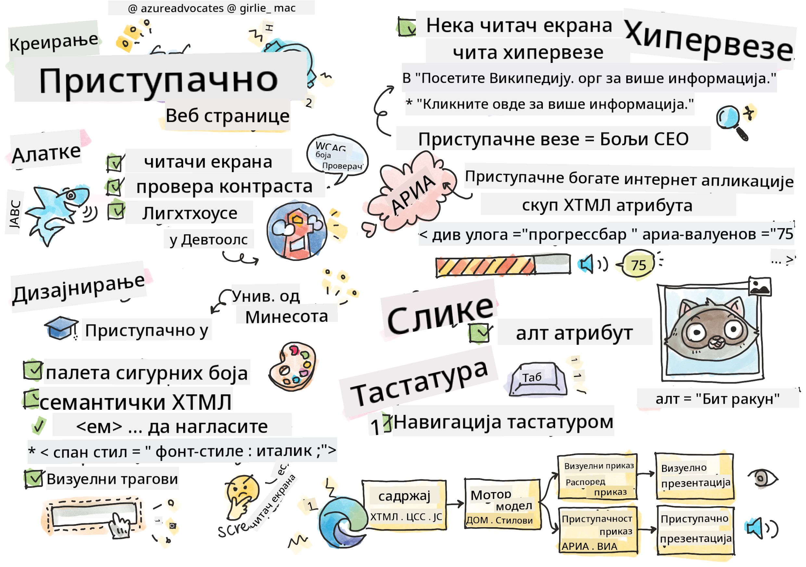
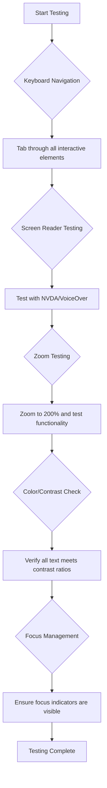
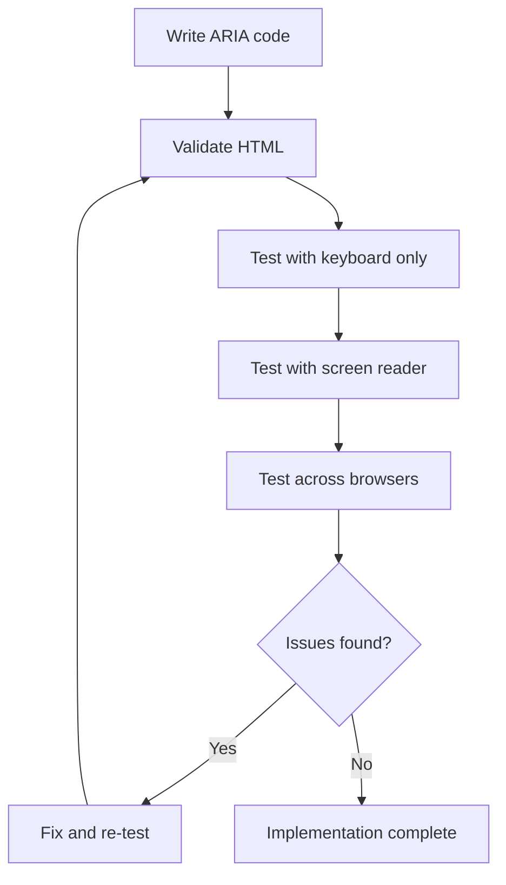

<!--
CO_OP_TRANSLATOR_METADATA:
{
  "original_hash": "90b19cde5b79b29e91babd3138cd8035",
  "translation_date": "2025-10-24T23:11:24+00:00",
  "source_file": "1-getting-started-lessons/3-accessibility/README.md",
  "language_code": "sr"
}
-->
# Прављење приступачних веб страница


> Скетчнота од [Томоми Имура](https://twitter.com/girlie_mac)

## Квиз пре предавања
[Квиз пре предавања](https://ff-quizzes.netlify.app/web/)

> Снага веба је у његовој универзалности. Приступ за све, без обзира на инвалидитет, је суштински аспект.
>
> \- Сер Тимоти Бернерс-Ли, директор W3C и проналазач Светске мреже

Ево нечега што би вас могло изненадити: када правите приступачне веб странице, не помажете само људима са инвалидитетом—заправо побољшавате веб за све!

Да ли сте приметили оне рампе на угловима улица? Првобитно су дизајниране за инвалидска колица, али сада помажу људима са колицима за бебе, радницима за доставу са колицима, путницима са коферима на точковима и бициклистима. Управо тако функционише приступачан веб дизајн—решења која помажу једној групи често на крају користе свима. Баш је кул, зар не?

У овом часу ћемо истражити како да креирате веб странице које заиста раде за све, без обзира на то како прегледају веб. Открићете практичне технике које су већ уграђене у веб стандарде, радити са алатима за тестирање и видети како приступачност чини ваше сајтове употребљивијим за све кориснике.

До краја овог часа, имаћете самопоуздање да приступачност учините природним делом вашег развојног процеса. Спремни да истражите како промишљене дизајнерске одлуке могу отворити веб за милијарде корисника? Хајде да почнемо!

> Овај час можете похађати на [Microsoft Learn](https://docs.microsoft.com/learn/modules/web-development-101/accessibility/?WT.mc_id=academic-77807-sagibbon)!

## Разумевање помоћних технологија

Пре него што пређемо на кодирање, узмимо тренутак да разумемо како људи са различитим способностима заправо доживљавају веб. Ово није само теорија—разумевање ових стварних навигационих образаца учиниће вас много бољим програмером!

Помоћне технологије су невероватни алати који помажу људима са инвалидитетом да интерагују са веб страницама на начине који би вас могли изненадити. Када схватите како ове технологије функционишу, креирање приступачних веб искустава постаје много интуитивније. То је као да учите да видите свој код кроз туђе очи.

### Читачи екрана

[Читачи екрана](https://en.wikipedia.org/wiki/Screen_reader) су прилично софистицирани комади технологије који претварају дигитални текст у говор или брајево писмо. Иако их углавном користе људи са оштећењем вида, они су такође веома корисни за кориснике са поремећајима учења као што је дислексија.

Волим да мислим о читачу екрана као о веома паметном наратору који вам чита књигу. Чита садржај наглас у логичном редоследу, најављује интерактивне елементе као што су "дугме" или "линк" и пружа пречице на тастатури за кретање по страници. Али ево у чему је ствар—читачи екрана могу да раде своју магију само ако градимо веб странице са правилном структуром и смисленим садржајем. Ту ви као програмер ступате на сцену!

**Популарни читачи екрана на различитим платформама:**
- **Windows**: [NVDA](https://www.nvaccess.org/about-nvda/) (бесплатан и најпопуларнији), [JAWS](https://webaim.org/articles/jaws/), [Narrator](https://support.microsoft.com/windows/complete-guide-to-narrator-e4397a0d-ef4f-b386-d8ae-c172f109bdb1/?WT.mc_id=academic-77807-sagibbon) (уграђен)
- **macOS/iOS**: [VoiceOver](https://support.apple.com/guide/voiceover/welcome/10) (уграђен и веома способан)
- **Android**: [TalkBack](https://support.google.com/accessibility/android/answer/6283677) (уграђен)
- **Linux**: [Orca](https://wiki.gnome.org/Projects/Orca) (бесплатан и отвореног кода)

**Како читачи екрана навигирају веб садржај:**

Читачи екрана пружају више метода навигације који чине прегледање ефикасним за искусне кориснике:
- **Секвенцијално читање**: Чита садржај од врха до дна, као праћење књиге
- **Навигација преко обележја**: Прелазак између секција странице (заглавље, навигација, главни део, подножје)
- **Навигација преко наслова**: Прескакање између наслова ради разумевања структуре странице
- **Листе линкова**: Генерисање листе свих линкова ради брзог приступа
- **Контроле формулара**: Директна навигација између поља за унос и дугмади

> 💡 **Ево нечега што ме је одушевило**: 68% корисника читача екрана навигира углавном преко наслова ([WebAIM Survey](https://webaim.org/projects/screenreadersurvey9/#finding)). То значи да је ваша структура наслова као мапа за кориснике—када је правилно урадите, буквално помажете људима да брже пронађу свој пут кроз ваш садржај!

### Изградња вашег процеса тестирања

Ево добрих вести—ефикасно тестирање приступачности не мора бити преоптерећујуће! Желите да комбинујете аутоматизоване алате (они су фантастични у откривању очигледних проблема) са мало ручног тестирања. Ево систематског приступа који сам открио да хвата највише проблема без трошења целог дана:

**Основни процес ручног тестирања:**



**Контролна листа за тестирање корак по корак:**
1. **Навигација тастатуром**: Користите само Tab, Shift+Tab, Enter, Space и стрелице
2. **Тестирање читача екрана**: Омогућите NVDA, VoiceOver или Narrator и навигирајте затворених очију
3. **Тестирање зума**: Тестирајте на нивоима зума од 200% и 400%
4. **Провера контраста боја**: Проверите сав текст и UI компоненте
5. **Тестирање индикатора фокуса**: Уверите се да сви интерактивни елементи имају видљиве стања фокуса

✅ **Почните са Lighthouse**: Отворите DevTools вашег претраживача, покрените Lighthouse анализу приступачности, а затим користите резултате да усмерите своје области ручног тестирања.

### Алатке за зум и увећање

Знате како понекад приближавате на телефону када је текст премали или жмирите на екран лаптопа на јаком сунцу? Многи корисници се ослањају на алатке за увећање како би учинили садржај читљивим сваког дана. Ово укључује људе са слабим видом, старије особе и свакога ко је икада покушао да чита веб страницу напољу.

Модерне технологије зума су еволуирале изван само увећавања. Разумевање како ове алатке функционишу помоћи ће вам да креирате одзивне дизајне који остају функционални и атрактивни на било ком нивоу увећања.

**Модерне могућности зума у претраживачима:**
- **Зум странице**: Пропорционално увећава сав садржај (текст, слике, распоред) - ово је пожељан метод
- **Само зум текста**: Повећава величину фонта уз задржавање оригиналног распореда
- **Пинч-то-зум**: Подршка за мобилне гестове за привремено увећање
- **Подршка претраживача**: Сви модерни претраживачи подржавају зум до 500% без нарушавања функционалности

**Специјализовани софтвер за увећање:**
- **Windows**: [Magnifier](https://support.microsoft.com/windows/use-magnifier-to-make-things-on-the-screen-easier-to-see-414948ba-8b1c-d3bd-8615-0e5e32204198) (уграђен), [ZoomText](https://www.freedomscientific.com/training/zoomtext/getting-started/)
- **macOS/iOS**: [Zoom](https://www.apple.com/accessibility/mac/vision/) (уграђен са напредним функцијама)

> ⚠️ **Дизајнерско разматрање**: WCAG захтева да садржај остане функционалан када је увећан до 200%. На овом нивоу, хоризонтално скроловање треба да буде минимално, а сви интерактивни елементи треба да остану приступачни.

✅ **Тестирајте свој одзивни дизајн**: Увећајте претраживач на 200% и 400%. Да ли се ваш распоред лепо прилагођава? Можете ли и даље приступити свим функцијама без прекомерног скроловања?

## Модерни алати за тестирање приступачности

Сада када разумете како људи навигирају веб уз помоћне технологије, хајде да истражимо алатке које вам помажу да изградите и тестирате приступачне веб странице.

Размислите о овоме: аутоматизовани алати су одлични за откривање очигледних проблема (као што је недостајући alt текст), док ручно тестирање помаже да осигурате да ваша страница буде пријатна за коришћење у стварном свету. Заједно, они вам пружају сигурност да ваше странице раде за све.

### Тестирање контраста боја

Ево добрих вести: контраст боја је један од најчешћих проблема приступачности, али је такође један од најлакших за решавање. Добар контраст користи свима—од корисника са оштећењем вида до људи који покушавају да читају телефон на плажи.

**WCAG захтеви за контраст:**

| Тип текста | WCAG AA (минимум) | WCAG AAA (побољшано) |
|------------|--------------------|----------------------|
| **Обичан текст** (испод 18pt) | Однос контраста 4.5:1 | Однос контраста 7:1 |
| **Велики текст** (18pt+ или 14pt+ bold) | Однос контраста 3:1 | Однос контраста 4.5:1 |
| **UI компоненте** (дугмад, оквири формулара) | Однос контраста 3:1 | Однос контраста 3:1 |

**Основни алати за тестирање:**
- [Colour Contrast Analyser](https://www.tpgi.com/color-contrast-checker/) - Десктоп апликација са алатком за избор боја
- [WebAIM Contrast Checker](https://webaim.org/resources/contrastchecker/) - Веб-базирано са тренутним повратним информацијама
- [Stark](https://www.getstark.co/) - Додатак за алате за дизајн као што су Figma, Sketch, Adobe XD
- [Accessible Colors](https://accessible-colors.com/) - Проналажење приступачних палета боја

✅ **Изградите боље палете боја**: Почните са бојама вашег бренда и користите проверу контраста да креирате приступачне варијације. Документујте их као приступачне боје у вашем дизајнерском систему.

### Свеобухватно тестирање приступачности

Најефикасније тестирање приступачности комбинује више приступа. Ниједан алат не хвата све, па изградња рутине тестирања са различитим методама осигурава темељну покривеност.

**Тестирање у претраживачу (уграђено у DevTools):**
- **Chrome/Edge**: Lighthouse анализа приступачности + панел приступачности
- **Firefox**: Инспектор приступачности са детаљним приказом стабла
- **Safari**: Таб за анализу у Web Inspector-у са симулацијом VoiceOver-а

**Професионални додатци за тестирање:**
- [axe DevTools](https://www.deque.com/axe/devtools/) - Индустријски стандард за аутоматизовано тестирање
- [WAVE](https://wave.webaim.org/extension/) - Визуелне повратне информације са истакнутим грешкама
- [Accessibility Insights](https://accessibilityinsights.io/) - Microsoft-ов свеобухватни пакет за тестирање

**Командна линија и интеграција у CI/CD:**
- [axe-core](https://github.com/dequelabs/axe-core) - JavaScript библиотека за аутоматизовано тестирање
- [Pa11y](https://pa11y.org/) - Алат за тестирање приступачности преко командне линије
- [Lighthouse CI](https://github.com/GoogleChrome/lighthouse-ci) - Аутоматизовано оцењивање приступачности

> 🎯 **Циљ тестирања**: Циљајте на Lighthouse оцену приступачности од 95+ као ваш основни стандард. Запамтите, аутоматизовани алати хватају само око 30-40% проблема приступачности—ручна тестирања су и даље неопходна!

## Изградња приступачности од самог почетка

Кључ успеха у приступачности је да је уградите у своје основе од првог дана. Знам да је примамљиво мислити "Додаћу приступачност касније," али то је као да покушавате да додате рампу кући након што је већ изграђена. Могуће? Да. Лако? Не баш.

Размислите о приступачности као о планирању куће—много је лакше укључити приступачност за инвалидска колица у ваше почетне архитектонске планове него све накнадно прилагођавати.

### Принципи POUR: Ваша основа за приступачност

Смернице за приступачност веб садржаја (WCAG) су изграђене око четири основна принципа који чине POUR. Не брините—ово нису суви академски концепти! Они су заправо практичне смернице за прављење садржаја који ради за све.

Када схватите POUR, доношење одлука о приступачности постаје много интуитивније. То је као да имате менталну контролну листу која води ваше дизајнерске изборе. Хајде да их разложимо:

**🔍 Перцептивно**: Информације морају бити представљене на начине које корисници могу да перципирају кроз своја доступна чула

- Обезбедите текстуалне алтернативе за нетекстуални садржај (слике, видео, аудио)
- Осигурајте довољан контраст боја за сав текст и UI компоненте
- Понудите титлове и транскрипте за мултимедијални садржај
- Дизајнирајте садржај који остаје функционалан када се увећа до 200%
- Користите више сензорних карактеристика (не само боју) за пренос информација

**🎮 Оперативно**: Сви интерфејсни елементи морају бити оперативни кроз доступне методе уноса

- Учини све функције доступним преко навигације
Boja je moćan alat za komunikaciju, ali nikada ne bi trebalo da bude jedini način prenosa važnih informacija. Dizajniranje izvan boje stvara robusnija i inkluzivnija iskustva koja funkcionišu u različitim situacijama.

**Dizajnirajte za razlike u percepciji boja:**

Otprilike 8% muškaraca i 0,5% žena ima neki oblik razlike u percepciji boja (često nazvano "daltonizam"). Najčešći tipovi su:
- **Deuteranopija**: Teškoće u razlikovanju crvene i zelene boje
- **Protanopija**: Crvena boja izgleda tamnije
- **Tritanopija**: Teškoće sa plavom i žutom bojom (retko)

**Strategije za inkluzivnu upotrebu boja:**

```css
/* ❌ Bad: Using only color to indicate status */
.error { color: red; }
.success { color: green; }

/* ✅ Good: Color plus icons and context */
.error {
  color: #d32f2f;
  border-left: 4px solid #d32f2f;
}
.error::before {
  content: "⚠️";
  margin-right: 8px;
}

.success {
  color: #2e7d32;
  border-left: 4px solid #2e7d32;
}
.success::before {
  content: "✅";
  margin-right: 8px;
}
```

**Iznad osnovnih zahteva za kontrast:**
- Testirajte svoje izbore boja pomoću simulatora za daltonizam
- Koristite šare, teksture ili oblike uz kodiranje boja
- Osigurajte da interaktivna stanja ostanu prepoznatljiva bez boje
- Razmotrite kako vaš dizajn izgleda u režimu visokog kontrasta

✅ **Testirajte pristupačnost boja**: Koristite alate poput [Coblis](https://www.color-blindness.com/coblis-color-blindness-simulator/) da vidite kako vaša stranica izgleda korisnicima sa različitim vrstama percepcije boja.

### Indikatori fokusa i dizajn interakcije

Indikatori fokusa su digitalni ekvivalent kursora—pokazuju korisnicima tastature gde se nalaze na stranici. Dobro dizajnirani indikatori fokusa poboljšavaju iskustvo za sve, čineći interakcije jasnim i predvidivim.

**Najbolje prakse za moderne indikatore fokusa:**

```css
/* Enhanced focus styles that work across browsers */
button:focus-visible {
  outline: 2px solid #0066cc;
  outline-offset: 2px;
  box-shadow: 0 0 0 4px rgba(0, 102, 204, 0.25);
}

/* Remove focus outline for mouse users, preserve for keyboard users */
button:focus:not(:focus-visible) {
  outline: none;
}

/* Focus-within for complex components */
.card:focus-within {
  box-shadow: 0 0 0 3px rgba(74, 144, 164, 0.5);
  border-color: #4A90A4;
}

/* Ensure focus indicators meet contrast requirements */
.custom-focus:focus-visible {
  outline: 3px solid #ffffff;
  outline-offset: 2px;
  box-shadow: 0 0 0 6px #000000;
}
```

**Zahtevi za indikatore fokusa:**
- **Vidljivost**: Moraju imati kontrastni odnos od najmanje 3:1 u odnosu na okolne elemente
- **Širina**: Minimalna debljina od 2px oko celog elementa
- **Postojanost**: Trebalo bi da ostanu vidljivi dok se fokus ne pomeri na drugo mesto
- **Razlikovanje**: Moraju biti vizuelno različiti od drugih stanja korisničkog interfejsa

> 💡 **Savjet za dizajn**: Odlični indikatori fokusa često koriste kombinaciju obrisa, senke okvira i promene boje kako bi osigurali vidljivost na različitim pozadinama i u različitim kontekstima.

✅ **Proverite indikatore fokusa**: Prođite kroz svoju veb stranicu koristeći taster Tab i zabeležite koji elementi imaju jasne indikatore fokusa. Da li su neki teško vidljivi ili potpuno nedostaju?

### Semantički HTML: Osnova pristupačnosti

Semantički HTML je kao da asistivnim tehnologijama dajete GPS sistem za vašu veb stranicu. Kada koristite prave HTML elemente za njihovu namenu, u suštini pružate čitačima ekrana, tastaturama i drugim alatima detaljnu mapu koja pomaže korisnicima da se efikasno kreću.

Evo analogije koja mi je zaista pomogla da shvatim: semantički HTML je razlika između dobro organizovane biblioteke sa jasnim kategorijama i korisnim oznakama i skladišta gde su knjige nasumično razbacane. Na oba mesta se nalaze iste knjige, ali gde biste radije pokušali da pronađete nešto? Upravo tako!

**Osnovni elementi strukture pristupačne stranice:**

```html
<!-- Landmark elements provide page navigation structure -->
<header>
  <h1>Your Site Name</h1>
  <nav aria-label="Main navigation">
    <ul>
      <li><a href="/home">Home</a></li>
      <li><a href="/about">About</a></li>
      <li><a href="/services">Services</a></li>
    </ul>
  </nav>
</header>

<main>
  <article>
    <header>
      <h1>Article Title</h1>
      <p>Published on <time datetime="2024-10-14">October 14, 2024</time></p>
    </header>
    
    <section>
      <h2>First Section</h2>
      <p>Content that relates to this section...</p>
    </section>
    
    <section>
      <h2>Second Section</h2>
      <p>More related content...</p>
    </section>
  </article>
  
  <aside>
    <h2>Related Links</h2>
    <nav aria-label="Related articles">
      <ul>
        <li><a href="/related-1">First related article</a></li>
        <li><a href="/related-2">Second related article</a></li>
      </ul>
    </nav>
  </aside>
</main>

<footer>
  <p>&copy; 2024 Your Site Name. All rights reserved.</p>
  <nav aria-label="Footer links">
    <ul>
      <li><a href="/privacy">Privacy Policy</a></li>
      <li><a href="/contact">Contact Us</a></li>
    </ul>
  </nav>
</footer>
```

**Zašto semantički HTML transformiše pristupačnost:**

| Semantički element | Namena | Prednost za čitače ekrana |
|--------------------|--------|--------------------------|
| `<header>` | Zaglavlje stranice ili sekcije | "Banner landmark" - brzo navigiranje do vrha |
| `<nav>` | Navigacioni linkovi | "Navigation landmark" - lista navigacionih sekcija |
| `<main>` | Glavni sadržaj stranice | "Main landmark" - direktan skok na sadržaj |
| `<article>` | Samostalni sadržaj | Oznaka granica članka |
| `<section>` | Tematske grupe sadržaja | Pruža strukturu sadržaja |
| `<aside>` | Povezani sadržaj sa strane | "Complementary landmark" |
| `<footer>` | Zaglavlje stranice ili sekcije | "Contentinfo landmark" |

**Supermoći čitača ekrana sa semantičkim HTML-om:**
- **Navigacija po landmarkovima**: Trenutno skakanje između glavnih sekcija stranice
- **Pregled naslova**: Generisanje sadržaja iz strukture naslova
- **Liste elemenata**: Kreiranje lista svih linkova, dugmadi ili kontrola forme
- **Svesnost konteksta**: Razumevanje odnosa između sekcija sadržaja

> 🎯 **Brzi test**: Pokušajte da navigirate svojom stranicom koristeći čitač ekrana i prečice za landmarkove (D za landmark, H za naslov, K za link u NVDA/JAWS). Da li navigacija ima smisla?

✅ **Proverite svoju semantičku strukturu**: Koristite panel za pristupačnost u DevTools-u vašeg pretraživača da biste videli stablo pristupačnosti i osigurali da vaš markup stvara logičnu strukturu.

### Hijerarhija naslova: Kreiranje logičnog pregleda sadržaja

Naslovi su apsolutno ključni za pristupačan sadržaj—oni su kao kičma koja sve drži zajedno. Korisnici čitača ekrana se u velikoj meri oslanjaju na naslove kako bi razumeli i navigirali vašim sadržajem. Zamislite to kao pružanje sadržaja stranice u obliku tabele.

**Zlatno pravilo za naslove:**
Nikada ne preskačite nivoe. Uvek napredujte logično od `<h1>` do `<h2>` do `<h3>` i tako dalje. Setite se kako ste pravili skice u školi? To je isti princip—ne biste preskočili sa "I. Glavna tačka" direktno na "C. Pod-podtačka" bez "A. Podtačke" između, zar ne?

**Primer savršene strukture naslova:**

```html
<!-- ✅ Excellent: Logical, hierarchical progression -->
<main>
  <h1>Complete Guide to Web Accessibility</h1>
  
  <section>
    <h2>Understanding Screen Readers</h2>
    <p>Introduction to screen reader technology...</p>
    
    <h3>Popular Screen Reader Software</h3>
    <p>NVDA, JAWS, and VoiceOver comparison...</p>
    
    <h3>Testing with Screen Readers</h3>
    <p>Step-by-step testing instructions...</p>
  </section>
  
  <section>
    <h2>Color and Contrast Guidelines</h2>
    <p>Designing with sufficient contrast...</p>
    
    <h3>WCAG Contrast Requirements</h3>
    <p>Understanding the different contrast levels...</p>
    
    <h3>Testing Tools and Techniques</h3>
    <p>Tools for verifying contrast ratios...</p>
  </section>
</main>
```

```html
<!-- ❌ Problematic: Skipping levels, inconsistent structure -->
<h1>Page Title</h1>
<h3>Subsection</h3> <!-- Skipped h2 -->
<h2>This should come before h3</h2>
<h1>Another main heading?</h1> <!-- Multiple h1s -->
```

**Najbolje prakse za naslove:**
- **Jedan `<h1>` po stranici**: Obično glavni naslov stranice ili primarni naslov sadržaja
- **Logičan napredak**: Nikada ne preskačite nivoe (h1 → h2 → h3, ne h1 → h3)
- **Opisni sadržaj**: Neka naslovi budu smisleni čak i kada se čitaju van konteksta
- **Vizuelno stilizovanje pomoću CSS-a**: Koristite CSS za izgled, HTML nivoe za strukturu

**Statistika navigacije čitača ekrana:**
- 68% korisnika čitača ekrana navigira pomoću naslova ([WebAIM Survey](https://webaim.org/projects/screenreadersurvey9/#finding))
- Korisnici očekuju logičan pregled naslova
- Naslovi pružaju najbrži način za razumevanje strukture stranice

> 💡 **Profesionalni savjet**: Koristite ekstenzije pretraživača poput "HeadingsMap" da vizualizujete strukturu naslova. Trebalo bi da izgleda kao dobro organizovana tabela sadržaja.

✅ **Testirajte strukturu naslova**: Koristite navigaciju naslova čitača ekrana (taster H u NVDA) da preskačete kroz naslove. Da li napredak logično prenosi priču vašeg sadržaja?

### Napredne tehnike vizuelne pristupačnosti

Iznad osnovnih principa kontrasta i boje, postoje sofisticirane tehnike koje pomažu u kreiranju zaista inkluzivnih vizuelnih iskustava. Ove metode osiguravaju da vaš sadržaj funkcioniše u različitim uslovima gledanja i sa asistivnim tehnologijama.

**Osnovne strategije vizuelne komunikacije:**

- **Multimodalna povratna informacija**: Kombinujte vizuelne, tekstualne, a ponekad i zvučne signale
- **Progresivno otkrivanje**: Prikazivanje informacija u lako svarljivim delovima
- **Dosledni obrasci interakcije**: Koristite poznate konvencije korisničkog interfejsa
- **Responzivna tipografija**: Prilagodite veličinu teksta različitim uređajima
- **Stanja učitavanja i grešaka**: Pružite jasnu povratnu informaciju za sve korisničke akcije

**CSS alati za poboljšanu pristupačnost:**

```css
/* Screen reader only text - visually hidden but accessible */
.sr-only {
  position: absolute;
  width: 1px;
  height: 1px;
  padding: 0;
  margin: -1px;
  overflow: hidden;
  clip: rect(0, 0, 0, 0);
  white-space: nowrap;
  border: 0;
}

/* Skip link for keyboard navigation */
.skip-link {
  position: absolute;
  top: -40px;
  left: 6px;
  background: #000000;
  color: #ffffff;
  padding: 8px 16px;
  text-decoration: none;
  border-radius: 4px;
  font-weight: bold;
  transition: top 0.3s ease;
  z-index: 1000;
}

.skip-link:focus {
  top: 6px;
}

/* Reduced motion respect */
@media (prefers-reduced-motion: reduce) {
  .skip-link {
    transition: none;
  }
  
  * {
    animation-duration: 0.01ms !important;
    animation-iteration-count: 1 !important;
    transition-duration: 0.01ms !important;
  }
}

/* High contrast mode support */
@media (prefers-contrast: high) {
  .button {
    border: 2px solid;
  }
}
```

> 🎯 **Obrazac pristupačnosti**: "Skip link" je ključan za korisnike tastature. Trebalo bi da bude prvi fokusabilni element na vašoj stranici i da direktno vodi do glavnog sadržaja.

✅ **Implementirajte skip navigaciju**: Dodajte skip linkove na svoje stranice i testirajte ih pritiskom na Tab čim se stranica učita. Trebalo bi da se pojave i omoguće vam da skočite na glavni sadržaj.

## Kreiranje smislenog teksta za linkove

Linkovi su u suštini autoputevi interneta, ali loše napisan tekst za linkove je kao da imate saobraćajne znakove koji samo kažu "Mesto" umesto "Centar Čikaga." Nije baš korisno, zar ne?

Evo nečega što me je zaista iznenadilo kada sam prvi put saznao: čitači ekrana mogu izvući sve linkove sa stranice i prikazati ih kao jednu veliku listu. Zamislite da vam neko preda direktorijum svih linkova na vašoj stranici. Da li bi svaki imao smisla sam po sebi? To je test koji vaš tekst za linkove mora da prođe!

### Razumevanje obrazaca navigacije linkova

Čitači ekrana nude moćne funkcije navigacije linkovima koje se oslanjaju na dobro napisan tekst za linkove:

**Metode navigacije linkova:**
- **Sekvencijalno čitanje**: Linkovi se čitaju u kontekstu kao deo toka sadržaja
- **Generisanje liste linkova**: Svi linkovi na stranici kompajlirani u pretraživi direktorijum
- **Brza navigacija**: Skakanje između linkova pomoću prečica na tastaturi (K u NVDA)
- **Funkcija pretrage**: Pronalaženje specifičnih linkova unosom delimičnog teksta

**Zašto je kontekst važan:**
Kada korisnici čitača ekrana generišu listu linkova, vide nešto poput ovoga:
- "Preuzmi izveštaj"
- "Saznaj više"
- "Kliknite ovde"
- "Politika privatnosti"
- "Kliknite ovde"

Samo dva od ovih linkova pružaju korisne informacije kada se čitaju van konteksta!

> 📊 **Uticaj na korisnike**: Korisnici čitača ekrana skeniraju liste linkova kako bi brzo razumeli sadržaj stranice. Generički tekst za linkove ih primorava da se vrate na kontekst svakog linka, značajno usporavajući njihovo iskustvo pregledanja.

### Uobičajene greške u tekstu za linkove koje treba izbegavati

Razumevanje šta ne funkcioniše pomaže vam da prepoznate i rešite probleme pristupačnosti u postojećem sadržaju.

**❌ Generički tekst za linkove koji ne pruža kontekst:**

```html
<!-- Meaningless when read from a link list -->
<p>Our sustainability efforts are detailed in our recent report. 
   <a href="/sustainability-2024.pdf">Click here</a> to view it.</p>

<!-- Repeated generic text throughout the page -->
<div class="article-card">
  <h3>Web Accessibility Guide</h3>
  <p>Learn the fundamentals...</p>
  <a href="/accessibility-guide">Read more</a>
</div>
<div class="article-card">
  <h3>Color Contrast Tips</h3>
  <p>Improve your design...</p>
  <a href="/color-contrast">Read more</a>
</div>

<!-- URLs as link text (difficult for screen readers to announce) -->
<p>Visit https://www.w3.org/WAI/WCAG21/quickref/ for WCAG guidelines.</p>

<!-- Vague action words -->
<a href="/contact">Go</a> | <a href="/about">See</a> | <a href="/help">View</a>
```

**Zašto ovi obrasci ne funkcionišu:**
- **"Kliknite ovde"** ne govori korisnicima ništa o destinaciji
- **"Saznaj više"** ponovljeno više puta stvara konfuziju
- **Sirovi URL-ovi** su teški za izgovaranje čitačima ekrana
- **Jedna reč** poput "Idi" ili "Pogledaj" nedostaje opisni kontekst

### Pisanje odličnog teksta za linkove

Opisni tekst za linkove koristi svima—korisnici sa vidom mogu brzo skenirati linkove, a korisnici čitača ekrana odmah razumeju destinacije.

**✅ Jasni, opisni primeri teksta za linkove:**

```html
<!-- Descriptive text that explains the destination -->
<p>Our comprehensive <a href="/sustainability-2024.pdf">2024 sustainability report (PDF, 2.1MB)</a> details our environmental initiatives.</p>

<!-- Specific, unique link text for each card -->
<div class="article-card">
  <h3>Web Accessibility Guide</h3>
  <p>Learn the fundamentals of inclusive design...</p>
  <a href="/accessibility-guide">Read our complete web accessibility guide</a>
</div>
<div class="article-card">
  <h3>Color Contrast Tips</h3>
  <p>Improve your design with better color choices...</p>
  <a href="/color-contrast">Explore color contrast best practices</a>
</div>

<!-- Meaningful text instead of raw URLs -->
<p>The <a href="https://www.w3.org/WAI/WCAG21/quickref/">WCAG 2.1 Quick Reference guide</a> provides comprehensive accessibility guidelines.</p>

<!-- Descriptive action links -->
<a href="/contact">Contact our support team</a> | 
<a href="/about">About our company</a> | 
<a href="/help">Get help with your account</a>
```

**Najbolje prakse za tekst za linkove:**
- **Budite specifični**: "Preuzmite kvartalni finansijski izveštaj" naspram "Preuzmite"
- **Uključite tip i veličinu fajla**: "(PDF, 1.2MB)" za fajlove za preuzimanje
- **Napomenite ako linkovi otvaraju eksterno**: "(otvara se u novom prozoru)" kada je prikladno
- **Koristite aktivan jezik**: "Kontaktirajte nas" naspram "Stranica za kontakt"
- **Držite tekst sažetim**: Ciljajte na 2-8 reči kada je moguće

### Napredni obrasci pristupačnosti linkova

Ponekad vizuelni dizajn ili tehnički zahtevi zahtevaju posebna rešenja. Evo sofisticiranih tehnika za uobičajene izazovne scenarije:

**Korišćenje ARIA za poboljšan kontekst:**

```html
<!-- When button text must be short but needs more context -->
<a href="/report.pdf" 
   aria-label="Download 2024 annual financial report, PDF format, 2.3MB">
  Download Report
</a>

<!-- When the full context comes from surrounding content -->
<h3 id="sustainability-heading">Sustainability Initiative</h3>
<p>Our efforts to reduce environmental impact...</p>
<a href="/sustainability-details" 
   aria-labelledby="sustainability-heading"
   aria-describedby="sustainability-summary">
  Learn more
</a>
<p id="sustainability-summary">Detailed breakdown of our 2024 environmental goals and achievements</p>
```

**Indikacija tipova fajlova i eksternih destinacija:**

```html
<!-- Method 1: Include information in visible link text -->
<a href="/annual-report.pdf">
  Download our 2024 annual report (PDF, 2.3MB)
</a>

<!-- Method 2: Use screen reader-only text for file details -->
<a href="/annual-report.pdf">
  Download our 2024 annual report
  <span class="sr-only">(PDF format, 2.3MB)</span>
</a>

<!-- Method 3: External link indication -->
<a href="https://example.com" 
   target="_blank" 
   aria-describedby="external-link-warning">
  Visit external resource
</a>
<span id="external-link-warning" class="sr-only">
  (opens in new window)
</span>

<!-- Method 4: Using CSS for visual indicators -->
<a href="https://example.com" class="external-link">
  External resource
</a>
```

```css
/* Visual indicator for external links */
.external-link::after {
  content: " ↗";
  font-size: 0.8em;
  color: #666;
}

/* Screen reader announcement for external links */
.external-link::before {
  content: "External link: ";
  position: absolute;
  left: -10000px;
  width: 1px;
  height: 1px;
  overflow: hidden;
}
```

> ⚠️ **Važno**: Kada koristite `target="_blank"`, uvek obavestite korisnike da se link otvara u novom prozoru ili kartici. Neočekivane promene navigacije mogu biti zbunjujuće.

✅ **Testirajte kontekst svojih linkova**: Koristite alatke za razvoj pretraživača da generišete listu svih linkova na vašoj stranici. Da li možete da razumete svrhu svakog linka bez okolnog konteksta?

## ARIA: Supermoći HTML pristupačnosti

[Accessible Rich Internet Applications (ARIA)](https://developer.mozilla.org/docs/Web/Accessibility/ARIA) je kao univerzalni prevodilac između vaših kompleksnih veb aplikacija i asistivnih tehnologija. Kada HTML sam po sebi ne može da izrazi sve što vaši interaktivni elementi rade, ARIA dolazi da popuni te praznine.

Volim da mislim o ARIA kao dodavanju korisnih napomena vašem HTML-u—nešto poput režijskih uputstava u scenariju predstave koja pomažu glumcima da razumeju svoje uloge i odnose.

**Najvažnije pravilo o ARIA**: Uvek koristite semantički HTML prvo, a zatim dodajte ARIA da ga poboljšate. Zamislite ARIA kao začin, ne glavno jelo. Trebalo bi da pojasni i poboljša vašu HTML strukturu, nikada da je zameni. Prvo postavite temelje kako treba!

### Strateška implementacija ARIA

ARIA je moćna, ali sa moći dolazi odgovornost. Nepravilna upotreba ARIA može učiniti pristupačnost gorom nego da je uopšte nema. Evo kada i kako je koristiti efikasno:

**✅ Koristite ARIA kada:**
- Kreirate prilagođene interaktivne widgete (harmonike, kartice, karusele)
- Gradite dinamičan sadržaj koji se menja bez ponovnog učitavanja stranice
- Pružate dodatni kontekst za kompleksne odnose korisničkog interfejsa
- Indikujete stanja učitavanja ili ažuriranja uživo
- Kreirate aplikacije sa prilagođenim kontrolama

**❌ Izbegavajte ARIA kada:**
- Standardni HTML elementi već pružaju potrebnu semantiku
- Niste sigurni kako da je pravilno implementirate
- Duplira informacije koje već pruža semantički HTML
- Niste testirali sa stvarnim asistivnim tehnologijama

> 🎯 **Zlatno pravilo ARIA**: "Ne menjajte semantiku osim ako zaista morate, osigurajte pristupačnost tastature uvek, i testirajte sa stvarnim asistivnim tehnologijama."

**Pet kategorija ARIA:**

1. **Uloge**: Šta je ovaj element? (`button`, `tab`, `dialog`)
2. **Svojstva**: Koje su njegove karakteristike? (`aria-required`, `aria-haspopup`)
3. **Stanja**: Koje je njegovo trenutno stanje? (`aria-expanded`, `aria-checked`)
4. **Landmarkovi**: Gde se nalazi u strukturi stranice? (`banner`, `navigation`, `main`)
5. **Regioni uživo**: Kako bi promene trebalo da budu najavljene? (`aria-live`, `aria-atomic`)

### Osnovni ARIA obrasci za moderne veb aplikacije

Ovi obrasci rešavaju najčešće izazove pristupačnosti u interaktivnim veb aplikacijama:

**Imenovanje i opisivanje elemenata:**

```html
<!-- aria-label: Provides accessible name when visible text isn't sufficient -->
<button aria-label="Close newsletter subscription dialog">×</button>

<!-- aria-labelledby: References existing text as the accessible name -->
<section aria-labelledby="news-heading">
  <h2 id="news-heading">Latest News</h2>
  <!-- news content -->
</section>

<!-- aria-describedby: Links to additional descriptive text -->
<input type="password" 
       aria-describedby="pwd-requirements pwd-strength"
       required>
<div id="pwd-requirements">
  Password must contain at least 8 characters, including uppercase, lowercase, and numbers.
</div>
<div id="pwd-strength" aria-live="polite">
  <!-- Dynamic password strength indicator -->
</div>
```

**Regioni uživo za dinamičan sadržaj:**

```html
<!-- Polite announcements (don't interrupt current speech) -->
<div aria-live="polite" id="status-updates">
  <!-- Status messages appear here -->
</div>

<!-- Assertive announcements (interrupt and announce immediately) -->
<div aria-live="assertive" id="urgent-alerts">
  <!-- Error messages and critical alerts -->
</div>

<!-- Loading states with live regions -->
<button id="submit-btn" aria-describedby="loading-status">
  Submit Application
</button>
<div id="loading-status" aria-live="polite" aria-atomic="true">
  <!-- "Processing your application..." appears here -->
</div>
```

**Primer interaktivnog widgeta (harmonika):**

```html
<div class="accordion">
  <h3>
    <button aria-expanded="false" 
            aria-controls="panel-1" 
            id="accordion-trigger-1"
            class="accordion-trigger">
      Accessibility Guidelines
    </button>
  </h3>
  <div id="panel-1" 
       role="region"
       aria-labelledby="accordion-trigger-1" 
       hidden>
    <p>WCAG 2.1 provides comprehensive guidelines...</p>
  </div>
</div>
```

```javascript
// JavaScript to manage accordion state
function toggleAccordion(trigger) {
  const panel = document.getElementById(trigger.getAttribute('aria-controls'));
  const isExpanded = trigger.getAttribute('aria-expanded') === 'true';
  
  // Toggle states
  trigger.setAttribute('aria-expanded', !isExpanded);
  panel.hidden = isExpanded;
  
  // Announce change to screen readers
  const status = document.getElementById('status-updates');
  status.textContent = isExpanded ? 'Section collapsed' : 'Section expanded';
}
```

### Naj
5. **Почните једноставно**: Комплексне ARIA имплементације чешће садрже грешке

**🔍 Радни ток тестирања:**



**🚫 Уобичајене ARIA грешке које треба избегавати:**

- **Супротстављене информације**: Не противречите HTML семантици
- **Превише етикета**: Превише ARIA информација може да збуни кориснике
- **Статична ARIA**: Заборављање ажурирања ARIA стања када се садржај промени
- **Непроверене имплементације**: ARIA која теоретски функционише, али не успева у пракси
- **Недостатак подршке за тастатуру**: ARIA улоге без одговарајућих интеракција са тастатуром

> 💡 **Ресурси за тестирање**: Користите алате као што је [accessibility-checker](https://www.npmjs.com/package/accessibility-checker) за аутоматску ARIA валидацију, али увек тестирајте са правим читачима екрана за потпуно искуство.

✅ **Учите од стручњака**: Проучите [ARIA Authoring Practices Guide](https://w3c.github.io/aria-practices/) за проверене шаблоне и имплементације сложених интерактивних виџета.

## Како учинити слике и медије приступачним

Визуелни и аудио садржај су суштински делови модерног веб искуства, али могу представљати препреке ако нису пажљиво имплементирани. Циљ је осигурати да информације и емоционални утицај вашег медија допру до сваког корисника. Када се навикнете, постаје природно.

Различите врсте медија захтевају различите приступе приступачности. То је као кување—не бисте третирали деликатну рибу на исти начин као што бисте третирали снажан одрезак. Разумевање ових разлика помаже вам да изаберете право решење за сваку ситуацију.

### Стратешка приступачност слика

Свака слика на вашем веб сајту има своју сврху. Разумевање те сврхе помаже вам да напишете бољи алтернативни текст и креирате инклузивнија искуства.

**Четири врсте слика и њихове стратегије за алтернативни текст:**

**Информативне слике** - преносе важне информације:
```html

```

**Декоративне слике** - чисто визуелне без информативне вредности:
```html

```

**Функционалне слике** - служе као дугмад или контроле:
```html
<button>
  
</button>
```

**Комплексне слике** - графикони, дијаграми, инфографике:
```html

<div id="chart-description">
  <p>Detailed description: Sales data shows a steady increase across all quarters...</p>
</div>
```

### Приступачност видеа и аудио садржаја

**Захтеви за видео:**
- **Титлови**: Текстуална верзија говорног садржаја и звучних ефеката
- **Аудио опис**: Нарација визуелних елемената за слепе кориснике
- **Транскрипти**: Комплетна текстуална верзија свих аудио и визуелних садржаја

```html
<video controls>
  <source src="video.mp4" type="video/mp4">
  <track kind="captions" src="captions.vtt" srclang="en" label="English">
  <track kind="descriptions" src="descriptions.vtt" srclang="en" label="Audio descriptions">
</video>
```

**Захтеви за аудио:**
- **Транскрипти**: Текстуална верзија свих говорних садржаја
- **Визуелни индикатори**: За садржај који је само аудио, обезбедите визуелне знаке

### Модерне технике за слике

**Коришћење CSS-а за декоративне слике:**
```css
.hero-section {
  background-image: url('decorative-hero.jpg');
  /* Decorative images in CSS don't need alt text */
}
```

**Респонзивне слике са приступачношћу:**
```html
<picture>
  <source media="(min-width: 800px)" srcset="large-chart.png">
  <source media="(min-width: 400px)" srcset="medium-chart.png">
  
</picture>
```

✅ **Тестирајте приступачност слика**: Користите читач екрана за навигацију кроз страницу са сликама. Да ли добијате довољно информација да разумете садржај?

## Навигација тастатуром и управљање фокусом

Многи корисници навигирају веб искључиво помоћу тастатуре. То укључује људе са моторичким инвалидитетом, напредне кориснике који сматрају да је тастатура бржа од миша, и свакога чији миш више не ради. Осигурање да ваш сајт добро функционише са уносом преко тастатуре је од суштинског значаја и често чини ваш сајт ефикаснијим за све.

### Основни обрасци навигације тастатуром

**Стандардне интеракције тастатуром:**
- **Tab**: Померање фокуса напред кроз интерактивне елементе
- **Shift + Tab**: Померање фокуса уназад
- **Enter**: Активирање дугмади и линкова
- **Space**: Активирање дугмади, потврда поља за потврду
- **Стрелице**: Навигација унутар група компоненти (радио дугмад, менији)
- **Escape**: Затварање модала, падајућих менија или отказивање операција

### Најбоље праксе за управљање фокусом

**Видљиви индикатори фокуса:**
```css
/* Ensure focus is always visible */
button:focus-visible {
  outline: 2px solid #4A90A4;
  outline-offset: 2px;
}

/* Custom focus styles for different components */
.card:focus-within {
  box-shadow: 0 0 0 3px rgba(74, 144, 164, 0.5);
}
```

**Прескочи линкове за ефикасну навигацију:**
```html
<a href="#main-content" class="skip-link">Skip to main content</a>
<a href="#navigation" class="skip-link">Skip to navigation</a>

<nav id="navigation">
  <!-- navigation content -->
</nav>
<main id="main-content">
  <!-- main content -->
</main>
```

**Правилан редослед табова:**
```html
<!-- Use semantic HTML for natural tab order -->
<form>
  <label for="name">Name:</label>
  <input type="text" id="name" tabindex="0">
  
  <label for="email">Email:</label>
  <input type="email" id="email" tabindex="0">
  
  <button type="submit" tabindex="0">Submit</button>
</form>
```

### Задржавање фокуса у модалима

Када се отвори модални дијалог, фокус треба да остане унутар модала:

```javascript
// Modern focus trap implementation
function trapFocus(element) {
  const focusableElements = element.querySelectorAll(
    'button, [href], input, select, textarea, [tabindex]:not([tabindex="-1"])'
  );
  
  const firstElement = focusableElements[0];
  const lastElement = focusableElements[focusableElements.length - 1];

  element.addEventListener('keydown', (e) => {
    if (e.key === 'Tab') {
      if (e.shiftKey && document.activeElement === firstElement) {
        e.preventDefault();
        lastElement.focus();
      } else if (!e.shiftKey && document.activeElement === lastElement) {
        e.preventDefault();
        firstElement.focus();
      }
    }
    
    if (e.key === 'Escape') {
      closeModal();
    }
  });
  
  // Focus first element when modal opens
  firstElement.focus();
}
```

✅ **Тестирајте навигацију тастатуром**: Покушајте да навигирате својим веб сајтом користећи само тастер Tab. Да ли можете да дођете до свих интерактивних елемената? Да ли је редослед фокуса логичан? Да ли су индикатори фокуса јасно видљиви?

## Приступачност формулара

Формулари су кључни за интеракцију корисника и захтевају посебну пажњу када је у питању приступачност.

### Повезивање етикета и контрола формулара

**Свака контрола формулара треба да има етикету:**
```html
<!-- Explicit labeling (preferred) -->
<label for="username">Username:</label>
<input type="text" id="username" name="username" required>

<!-- Implicit labeling -->
<label>
  Password:
  <input type="password" name="password" required>
</label>

<!-- Using aria-label when visual label isn't desired -->
<input type="search" aria-label="Search products" placeholder="Search...">
```

### Руковање грешкама и валидација

**Приступачне поруке о грешкама:**
```html
<label for="email">Email Address:</label>
<input type="email" id="email" name="email" 
       aria-describedby="email-error" 
       aria-invalid="true" required>
<div id="email-error" role="alert">
  Please enter a valid email address
</div>
```

**Најбоље праксе за валидацију формулара:**
- Користите `aria-invalid` за означавање неважећих поља
- Обезбедите јасне, специфичне поруке о грешкама
- Користите `role="alert"` за важна обавештења о грешкама
- Приказујте грешке и одмах и након слања формулара

### Груписање и коришћење fieldset-а

**Групишите повезане контроле формулара:**
```html
<fieldset>
  <legend>Shipping Address</legend>
  <label for="street">Street Address:</label>
  <input type="text" id="street" name="street">
  
  <label for="city">City:</label>
  <input type="text" id="city" name="city">
</fieldset>

<fieldset>
  <legend>Preferred Contact Method</legend>
  <input type="radio" id="contact-email" name="contact" value="email">
  <label for="contact-email">Email</label>
  
  <input type="radio" id="contact-phone" name="contact" value="phone">
  <label for="contact-phone">Phone</label>
</fieldset>
```

## Ваш пут ка приступачности: Кључни закључци

Честитамо! Управо сте стекли основно знање за креирање истински инклузивних веб искустава. Ово је заиста узбудљиво! Приступачност веба није само о испуњавању стандарда—то је о препознавању различитих начина на које људи интерагују са дигиталним садржајем и дизајнирању за ту невероватну сложеност.

Сада сте део растуће заједнице програмера који разумеју да добар дизајн функционише за све. Добродошли у клуб!

**🎯 Ваш алат за приступачност сада укључује:**

| Основни принцип | Имплементација | Утицај |
|----------------|----------------|---------|
| **Семантичка HTML основа** | Користите одговарајуће HTML елементе за њихову намењену сврху | Читачи екрана могу ефикасно навигирати, тастатуре аутоматски функционишу |
| **Инклузивни визуелни дизајн** | Довољан контраст, значајна употреба боја, видљиви индикатори фокуса | Јасно за све у било којим условима осветљења |
| **Описни садржај** | Значајан текст линкова, алтернативни текст, наслови | Корисници разумеју садржај без визуелног контекста |
| **Приступачност тастатуре** | Редослед табова, пречице на тастатури, управљање фокусом | Моторна приступачност и ефикасност за напредне кориснике |
| **Унапређење ARIA** | Стратешка употреба за попуњавање семантичких празнина | Сложене апликације функционишу са помоћним технологијама |
| **Комплетно тестирање** | Аутоматски алати + ручна верификација + тестирање са правим корисницима | Откривање проблема пре него што утичу на кориснике |

**🚀 Ваши следећи кораци:**

1. **Уградите приступачност у свој радни процес**: Учините тестирање природним делом вашег развојног процеса
2. **Учите од правих корисника**: Тражите повратне информације од људи који користе помоћне технологије
3. **Будите у току**: Технике приступачности се развијају са новим технологијама и стандардима
4. **Залажите се за инклузију**: Делите своје знање и учините приступачност приоритетом тима

> 💡 **Запамтите**: Ограничења приступачности често доводе до иновативних, елегантних решења која користе свима. Рампе за инвалидска колица, титлови и гласовне команде су почели као функције приступачности, а постали су уобичајена побољшања.

**Пословни разлог је кристално јасан**: Приступачни веб сајтови достижу више корисника, боље се рангирају на претраживачима, имају ниже трошкове одржавања и избегавају правне ризике. Али искрено? Прави разлог за бригу о приступачности иде много дубље. Приступачни веб сајтови оличавају најбоље вредности веба—отвореност, инклузивност и идеју да свако заслужује једнак приступ информацијама.

Сада сте спремни да изградите инклузивни веб будућности. Сваки приступачан сајт који креирате чини интернет пријатнијим местом за све. То је заиста невероватно када размислите о томе!

## Додатни ресурси

Наставите своје путовање учења о приступачности уз ове основне ресурсе:

**📚 Званични стандарди и смернице:**
- [WCAG 2.1 Guidelines](https://www.w3.org/WAI/WCAG21/quickref/) - Званични стандард приступачности са брзим референцама
- [ARIA Authoring Practices Guide](https://w3c.github.io/aria-practices/) - Комплетни шаблони за интерактивне виџете
- [WebAIM Guidelines](https://webaim.org/) - Практичне, приступачне смернице за почетнике

**🛠️ Алати и ресурси за тестирање:**
- [axe DevTools](https://www.deque.com/axe/devtools/) - Индустријски стандард за тестирање приступачности
- [A11y Project Checklist](https://www.a11yproject.com/checklist/) - Провера приступачности корак по корак
- [Accessibility Insights](https://accessibilityinsights.io/) - Комплетан пакет за тестирање од Microsoft-а
- [Color Oracle](https://colororacle.org/) - Симулатор за тестирање дизајна за особе са слепилом за боје

**🎓 Учење и заједница:**
- [WebAIM Screen Reader Survey](https://webaim.org/projects/screenreadersurvey9/) - Преференције и понашања правих корисника
- [Inclusive Components](https://inclusive-components.design/) - Модерни приступачни шаблони компоненти
- [A11y Coffee](https://a11y.coffee/) - Брзи савети и увиди о приступачности
- [Web Accessibility Initiative (WAI)](https://www.w3.org/WAI/) - Комплетни ресурси за приступачност од W3C-а

**🎥 Практично учење:**
- [Accessibility Developer Guide](https://www.accessibility-developer-guide.com/) - Практичне смернице за имплементацију
- [Deque University](https://dequeuniversity.com/) - Професионални курсеви за приступачност

## Изазов GitHub Copilot Agent 🚀

Користите Agent мод да завршите следећи изазов:

**Опис:** Направите приступачну компоненту модалног дијалога која демонстрира правилно управљање фокусом, ARIA атрибуте и обрасце навигације тастатуром.

**Задатак:** Направите комплетну компоненту модалног дијалога са HTML-ом, CSS-ом и JavaScript-ом која укључује: правилно задржавање фокуса, ESC тастер за затварање, клик ван модала за затварање, ARIA атрибуте за читаче екрана и видљиве индикаторе фокуса. Модал треба да садржи формулар са одговарајућим етикетама и руковањем грешкама. Осигурајте да компонента испуњава WCAG 2.1 AA стандарде.


## 🚀 Изазов

Узмите овај HTML и препишите га тако да буде што приступачнији, користећи стратегије које сте научили.

```html
<!DOCTYPE html>
<html lang="en">
  <head>
    <meta charset="UTF-8">
    <meta name="viewport" content="width=device-width, initial-scale=1.0">
    <title>Turtle Ipsum - The World's Premier Turtle Fan Club</title>
    <link href='../assets/style.css' rel='stylesheet' type='text/css'>
  </head>
  <body>
    <header class="site-header">
      <h1 class="site-title">Turtle Ipsum</h1>
      <p class="site-subtitle">The World's Premier Turtle Fan Club</p>
    </header>
    
    <nav class="main-nav" aria-label="Main navigation">
      <h2 class="nav-header">Resources</h2>
      <ul class="nav-list">
        <li><a href="https://www.youtube.com/watch?v=CMNry4PE93Y">"I like turtles" video</a></li>
        <li><a href="https://en.wikipedia.org/wiki/Turtle">Basic turtle information</a></li>
        <li><a href="https://en.wikipedia.org/wiki/Turtles_(chocolate)">Chocolate turtles candy</a></li>
      </ul>
    </nav>
    
    <main class="main-content">
      <article>
        <h1>Welcome to Turtle Ipsum</h1>
        <p class="intro">
          <a href="/about">Learn more about our turtle community</a> and discover fascinating facts about these amazing creatures.
        </p>
        <p class="article-text">
          Turtle ipsum dolor sit amet, consectetur adipiscing elit, sed do eiusmod tempor incididunt ut labore et dolore magna aliqua. Ut enim ad minim veniam, quis nostrud exercitation ullamco laboris nisi ut aliquip ex ea commodo consequat. Duis aute irure dolor in reprehenderit in voluptate velit esse cillum dolore eu fugiat nulla pariatur. Excepteur sint occaecat cupidatat non proident, sunt in culpa qui officia deserunt mollit anim id est laborum.
        </p>
      </article>
    </main>
    
    <footer class="footer">
      <section class="newsletter-signup">
        <h2>Stay Updated</h2>
        <button type="button" onclick="showNewsletterForm()">Sign up for turtle news</button>
      </section>
      
      <nav class="footer-nav" aria-label="Footer navigation">
        <h2>Site Pages</h2>
        <ul>
          <li><a href="../">Home</a></li>
          <li><a href="../semantic">Semantic HTML example</a></li>
        </ul>
      </nav>
      
      <p class="footer-copyright">&copy; 2024 Instrument. All rights reserved.</p>
    </footer>
  </body>
</html>
```

**Кључна побољшања која су направљена:**
- Додата правилна семантичка HTML структура
- Исправљена хијерархија наслова (један h1, логичан напредак)
- Додат значајан текст линкова уместо "кликните овде"
- Укључени одговарајући ARIA етикете за навигацију
- Додат атрибут lang и одговарајући мета тагови
- Коришћен елемент дугмета за интерактивне елементе
- Структурисан садржај подножја са одговарајућим обележјима

## Квиз након предавања
[Квиз након предавања](https://ff-quizzes.netlify.app/web/en/)

## Преглед и самостално учење

Многе владе имају законе који се односе на захтеве приступачности. Информишите се о законима о приступачности у вашој земљи. Шта је обухваћено, а шта није? Пример је [ова владина веб страница](https://accessibility.blog.gov.uk/).

## Задатак
 
[Анализирајте веб сајт који није приступачан](assignment.md)

Кредити: [Turtle Ipsum](https://github.com/Instrument/semantic-html-sample) од Instrument

---

**Одрицање од одговорности**:  
Овај документ је преведен помоћу услуге за превођење вештачке интелигенције [Co-op Translator](https://github.com/Azure/co-op-translator). Иако настојимо да обезбедимо тачност, молимо вас да имате у виду да аутоматски преводи могу садржати грешке или нетачности. Оригинални документ на његовом изворном језику треба сматрати ауторитативним извором. За критичне информације препоручује се професионални превод од стране људи. Не преузимамо одговорност за било каква погрешна тумачења или неспоразуме који могу настати услед коришћења овог превода.