<!--
CO_OP_TRANSLATOR_METADATA:
{
  "original_hash": "7f2c48e04754724123ea100a822765e5",
  "translation_date": "2026-01-07T08:26:44+00:00",
  "source_file": "1-getting-started-lessons/3-accessibility/README.md",
  "language_code": "sr"
}
-->
# Креирање приступачних веб страница

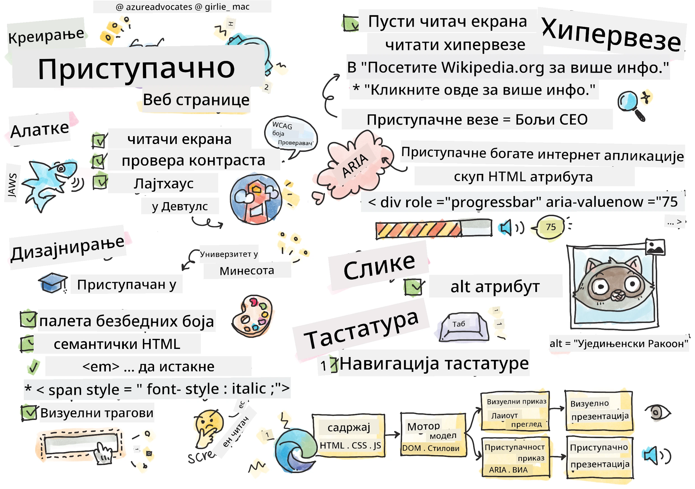
> Скетчнот од [Томоми Имура](https://twitter.com/girlie_mac)

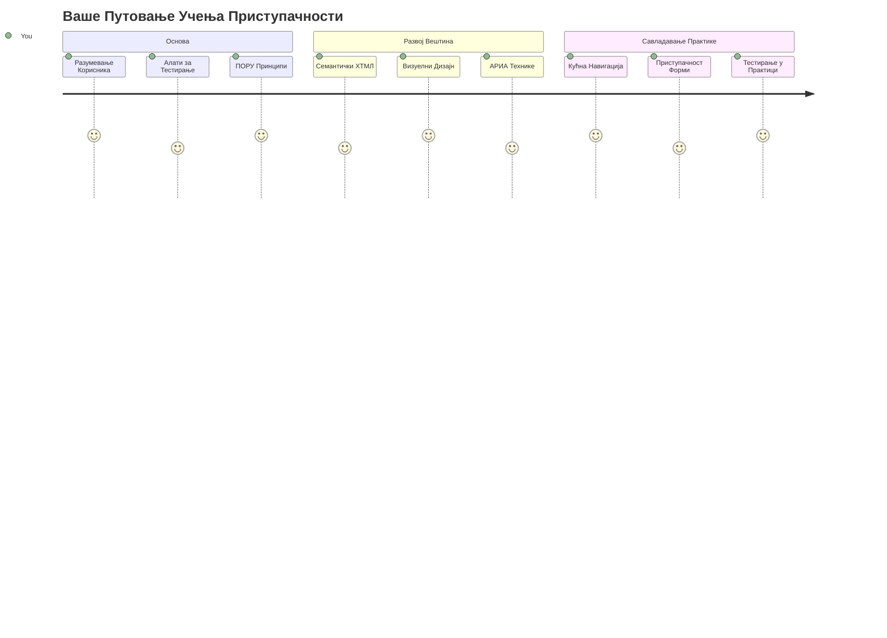
## Пре-предавачки квиз
[Пре-предавачки квиз](https://ff-quizzes.netlify.app/web/)

> Снага Веба је у његовој универзалности. Приступ за све без обзира на инвалидитет је суштински аспект.
>
> \- Сир Тимоти Бернерс-Ли, директор W3C и проналазач Ворлд Вајд Веба

Ево нечега што би вас могло изненадити: када правите приступачне веб сајтове, ви не помажете само особама са инвалидитетом — заправо побољшавате веб за све!

Јесте ли икада приметили оне успоне на тротоарима на угловима улица? Првобитно су били направљени за колица, али сада помажу људима са колицима за бебе, радницима за доставу са колицима, путницима са точковима на пртљагу и бициклистима такође. Управо тако функционише приступачан веб дизајн — решења која помажу једној групи често на крају користе свима. Лепо, зар не?

У овој лекцији ћемо истражити како да направимо веб странице које заиста раде за све, без обзира како претражују веб. Открићете практичне технике које су већ уграђене у веб стандарде, пробати алате за тестирање и видети како приступачност чини ваше сајтове функционалнијим за све кориснике.

До краја ове лекције имаћете самопоуздање да учините приступачност природним делом вашег развојног тока рада. Спремни да истражимо како промишљени дизајн може отворити веб за милијарде корисника? Хајде да почнемо!

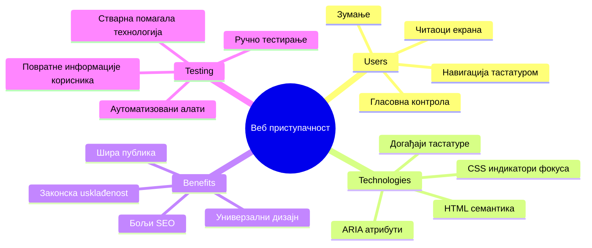
> Ову лекцију можете проћи на [Microsoft Learn](https://docs.microsoft.com/learn/modules/web-development-101/accessibility/?WT.mc_id=academic-77807-sagibbon)!

## Разумевање асистивних технологија

Пре него што заронимо у кодирање, хајде да одвојимо минут и разумемо како људи са различитим способностима заправо доживљавају веб. Ово није само теорија — разумевање ових стварних образаца навигације учиниће вас много бољим програмером!

Асистивне технологије су сјајни алати који помажу особама са инвалидитетом да интерагују са веб страницама на начине који вас могу изненадити. Када схватите како ове технологије функционишу, креирање приступачних веб искустава постаје много интуитивније. Као да учите да гледате свој код очима неког другог.

### Читачи екрана

[Читачи екрана](https://en.wikipedia.org/wiki/Screen_reader) су прилично софистицирани технолошки алати који претварају дигитални текст у говор или брајев излаз. Иако их углавном користе особе са оштећењем вида, такође су веома корисни за кориснике са тешкоћама у учењу као што је дислексија.

Волим да замислим читача екрана као паметног приповедача који вам чита књигу. Чита садржај наглас у логичном редоследу, најављује интерактивне елементе као „дугме“ или „линк“ и пружа тастатурне пречице за скокове по страници. Али ево ствари — читачи екрана могу да раде свој чар само ако направимо веб сајтове са исправном структуром и смисленим садржајем. Ту долазите ви као програмер!

**Популарни читачи екрана на различитим платформама:**
- **Windows**: [NVDA](https://www.nvaccess.org/about-nvda/) (бесплатан и најпопуларнији), [JAWS](https://webaim.org/articles/jaws/), [Narrator](https://support.microsoft.com/windows/complete-guide-to-narrator-e4397a0d-ef4f-b386-d8ae-c172f109bdb1/?WT.mc_id=academic-77807-sagibbon) (уграђени)
- **macOS/iOS**: [VoiceOver](https://support.apple.com/guide/voiceover/welcome/10) (уграђен и веома способан)
- **Android**: [TalkBack](https://support.google.com/accessibility/android/answer/6283677) (уграђен)
- **Linux**: [Orca](https://wiki.gnome.org/Projects/Orca) (бесплатан и отвореног кода)

**Како читачи екрана навигирају кроз веб садржаје:**

Читачи екрана пружају више начина навигације који чине прегледање ефикасним за искусне кориснике:
- **Секвенцијално читање**: Чита садржај од врха према дну, као читање књиге
- **Навигација према оријентирима**: Скочи између секција странице (заглавље, мени, главни садржај, фуснота)
- **Навигација по насловима**: Прескаче између наслова да би разумео структуру странице
- **Листе линкова**: Генерише листу свих линкова за брзи приступ
- **Управљање формама**: Навигира директно између уносних поља и дугмади

> 💡 **Ово ме је задивило**: 68% корисника читача екрана најчешће се креће помоћу наслова ([WebAIM Survey](https://webaim.org/projects/screenreadersurvey9/#finding)). То значи да ваша структура наслова представља мапу за кориснике — када је исправна, буквално помажете људима да брже пронађу пут кроз ваш садржај!

### Креирање вашег тестирачког тока рада

Ево добре вести — ефикасно тестирање приступачности не мора бити преоптерећујуће! Треба да комбинујете аутоматизоване алате (одлични су у хватању очигледних проблема) са ручним тестирањем. Ево систематског приступа који сам открио да хвата највише проблема без трошења целог дана:

**Основни ручни тестирачки ток рада:**

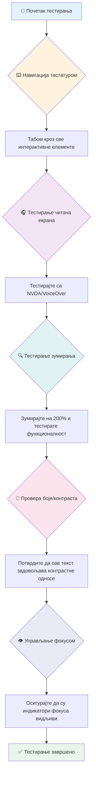
**Чеклист за корак по корак тестирање:**
1. **Тастатурна навигација**: Користите само Tab, Shift+Tab, Enter, Space и стрелице
2. **Тестирање читача екрана**: Укључите NVDA, VoiceOver или Narrator и навигирајте са затвореним очима
3. **Тестирање зумирања**: Тестирајте на 200% и 400% нивоу зума
4. **Провера контраста боја**: Проверите сав текст и UI компоненте
5. **Тестирање индикатора фокуса**: Осигурајте да сви интерактивни елементи имају видљиве стањe фокуса

✅ **Почните са Lighthouse**: Отворите DevTools у прегледачу, покрените Lighthouse приступачност аудит, затим користите резултате за усмеравање ручних тестова.

### Алатке за зум и повећање

Знате како понекад шчепате екран телефона да увећате текст када је премали, или шкљоцнете очима у екран лаптопа на јаком сунцу? Многи корисници се свакодневно ослањају на алатке за увећање да би садржај био читљив. Ово укључује особе слабијег вида, старије особе и сваки пут некога ко је икада покушао да чита веб напољу.

Модерне зум технологије су много више од само увећања. Разумевање како ови алати функционишу помоћи ће вам да креирате одзивне дизајне који остају функционални и привлачни при било ком нивоу увећања.

**Модерне могућности зума прегледача:**
- **Зум странице**: Пропорционално увећава сав садржај (текст, слике, распореде) — ово је препоручени метод
- **Зум само текста**: Повећава величину фонта док задржава оригиналну структуру
- **Пинч-то-зум**: Подршка покретима на мобилним уређајима за привремено увећање
- **Подршка прегледача**: Сви модерни прегледачи подржавају зум до 500% без губитка функционалности

**Специјализовани софтвер за увећање:**
- **Windows**: [Magnifier](https://support.microsoft.com/windows/use-magnifier-to-make-things-on-the-screen-easier-to-see-414948ba-8b1c-d3bd-8615-0e5e32204198) (уграђен), [ZoomText](https://www.freedomscientific.com/training/zoomtext/getting-started/)
- **macOS/iOS**: [Zoom](https://www.apple.com/accessibility/mac/vision/) (уграђен са напредним функцијама)

> ⚠️ **Дизајнерски аспект**: WCAG захтева да садржај остане функционалан при увећању од 200%. На овом нивоу, хоризонтално скроловање би требало бити минимално, а сви интерактивни елементи приступачни.

✅ **Тестирајте свој одзивни дизајн**: Увећајте прегледач на 200% и 400%. Да ли се ваш распоред лепо прилагођава? Можете ли и даље приступити свим функционалностима без превише скроловања?

## Модерни алати за тестирање приступачности

Сад када разумете како људи користе асистивне технологије да навигирају вебом, хајде да истражимо алате који вам помажу да креирате и тестирате приступачне веб сајтове.

Замислите ово овако: аутоматизовани алати су одлични у хватању очигледних проблема (нпр. недостатак алт тега), док ручно тестирање помаже да осигурате да је сајт пријатан за коришћење у стварном свету. Заједно вам дају уверење да сајтови раде за све.

### Тестирање контраста боја

Ево добре вести: контраст боја је један од најчешћих проблема са приступачношћу, али и један од најлаже решивих. Добар контраст користи свима — од корисника са оштећењем вида до оних који покушавају да читају телефоне на плажи.

**WCAG захтеви за контраст:**

| Тип текста | WCAG AA (Минимално) | WCAG AAA (Побољшано) |
|------------|---------------------|----------------------|
| **Обичан текст** (испод 18pt) | однос контраста 4.5:1 | однос контраста 7:1 |
| **Велики текст** (18pt+ или 14pt+ дебео) | однос контраста 3:1 | однос контраста 4.5:1 |
| **UI компоненте** (дугмад, границе форми) | однос контраста 3:1 | однос контраста 3:1 |

**Неопходни алати за тестирање:**
- [Colour Contrast Analyser](https://www.tpgi.com/color-contrast-checker/) - Десктоп апликација са алатом за бирање боја
- [WebAIM Contrast Checker](https://webaim.org/resources/contrastchecker/) - Веб-апликација са тренутном повратном информацијом
- [Stark](https://www.getstark.co/) - Плугин за дизајн алате као што су Figma, Sketch, Adobe XD
- [Accessible Colors](https://accessible-colors.com/) - Проналажење приступачних палета боја

✅ **Креирајте боље палете боја**: Почните са бојама бренда и користите провераче контраста за прављење приступачних варијанти. Документујте их као приступачне бојне токене у вашем дизајн систему.

### Комплетни аудити приступачности

Најефикасније тестирање приступачности комбинује више приступа. Ниједан алат не хвата све, стога изградња рутине тестирања са различитим методама обезбеђује темељну проверу.

**Тестирање у прегледачу (уграђено у DevTools):**
- **Chrome/Edge**: Lighthouse приступачност аудит + Accessibility панел
- **Firefox**: Accessibility инспектор са детаљним приказом стабла
- **Safari**: Audit таб у Web Inspector-у са симулацијом VoiceOver-а

**Професионални тестирачки екстензије:**
- [axe DevTools](https://www.deque.com/axe/devtools/) - индустријски стандард за аутоматизовано тестирање
- [WAVE](https://wave.webaim.org/extension/) - визуелна повратна информација са истицањем грешака
- [Accessibility Insights](https://accessibilityinsights.io/) - Microsoft-ов комплетан тестирачки алат

**Командна линија и CI/CD интеграција:**
- [axe-core](https://github.com/dequelabs/axe-core) - JavaScript библиотека за аутоматизовано тестирање
- [Pa11y](https://pa11y.org/) - алат за тестирање приступачности преко командне линије
- [Lighthouse CI](https://github.com/GoogleChrome/lighthouse-ci) - аутоматизовани систем за оцену приступачности

> 🎯 **Циљ тестирања**: Настојте да остварите Lighthouse оцену приступачности 95+ као основни праг. Имајте на уму да аутоматизовани алати хватају само 30-40% проблема — ручно тестирање је и даље неопходно!

### 🧠 **Провера знања о тестирању: Спремни да пронађете проблеме?**

**Погледајмо како се осећате по питању тестирања приступачности:**
- Која вам се метода тестирања тренутно чини најприступачнијом?
- Можете ли замислити коришћење тастатурне навигације цео дан?
- Која је једна баријера приступачности коју сте лично искусили на интернету?

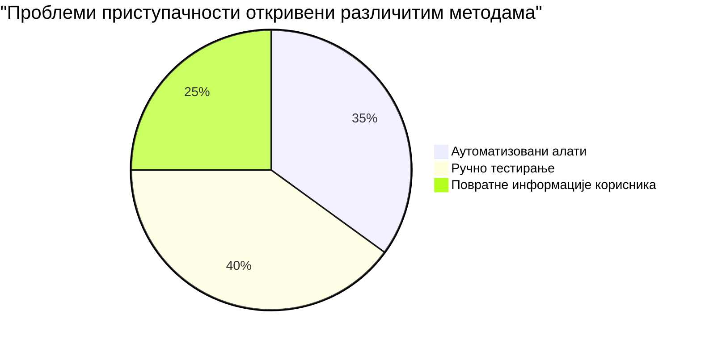
> **Поткрепљење самопоуздања**: Професионални тестери приступачности користе управо ову комбинацију метода. Учите индустријски стандард!

## Креирање приступачности од самог почетка

Кључ успешне приступачности је укључивање у темеље већ од првог дана. Знам да је примамљиво помислити „додаћу приступачност касније“, али то је као да покушавате да додате рампу кући кад је већ саграђена. Могуће? Да. Лако? Не баш.

Замислите приступачност као планирање куће — много је лакше укључити приступ за колица у почетне архитектонске планове него касније радити преслагивања.

### Принципи POUR: Ваш темељ приступачности

Водич за приступачност веб садржаја (WCAG) заснован је на четири основна принципа који се скраћују као POUR. Не брините — ово нису сувопарне академске категорије! Заправо, то су практичне смернице за прављење садржаја који ради за све.

Када савладате POUR, доношење одлука о приступачности постаје много интуитивније. Као да имате менталну листу која води ваше дизајнерске изборе. Ево прегледа:

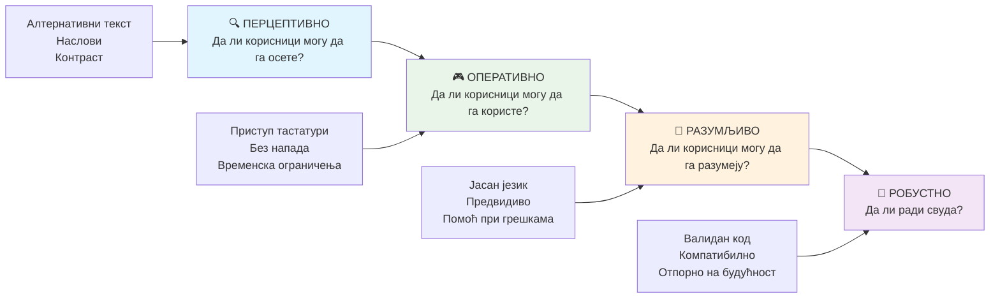
**🔍 Перцептиван**: Информације морају бити представљене на начине које корисници могу доживети својим расположивим чулима

- Обезбедите алтернативе текста за не-текстуални садржај (слике, видео, аудио)
- Осигурајте довољан контраст боја за сав текст и UI компоненте
- Понудите титлове и транскрипте за мултимедијални садржај
- Дизајнирајте садржај који остаје функционалан при повећању величине до 200%
- Користите више сензорних карактеристика (не само боју) за пренос информација

**🎮 Оперативан**: Сви интерфејсни елементи морају бити управљиви преко доступних уноса

- Омогућите сву функционалност коришћењем тастатуре
- Обезбедите корисницима довољно времена за читање и интеракцију са садржајем
- Избегавајте садржај који изазива нападе или вестибуларне поремећаје
- Помозите корисницима да ефикасно навигирају са јасном структуром и оријентирима
- Осигурајте да интерактивни елементи имају довољно велику површину (најмање 44px)

**📖 Разумљив**: Информације и рад интерфејса морају бити јасни и схватљиви

- Користите јасан, једноставан језик прикладан за вашу публику
- Осигурајте да садржај изгледа и функционише на предвидљив, доследан начин
- Обезбедите јасна упутства и поруке о грешкама за унос корисника
- Помозите корисницима да разумеју и исправе грешке у формама
- Организујте садржај са логичним редом читања и хијерархијом информација

**💪 Робустан**: Садржај мора поуздано радити на различитим технологијама и асистивним уређајима

- **Користите валидан, семантички HTML као темељ**
- **Осигурајте компатибилност са тренутним и будућим асистивним технологијама**
- **Пратите веб стандарде и најбоље праксе за маркирање**
- **Тестирајте кроз различите прегледаче, уређаје и асистивне алате**
- **Структуришите садржај тако да се лепо прилагоди када напредне функције нису подржане**

### 🎯 **ПРОВЕРА POUR Принципа: Како га Утемељити**

**Брза рефлексија о основама:**
- Можете ли се сетити неке веб функције која не испуњава сваки POUR принцип?
- Који принцип вам делује најпријатније као програмеру?
- Како би ови принципи могли побољшати дизајн за све, а не само за особе са инвалидитетом?

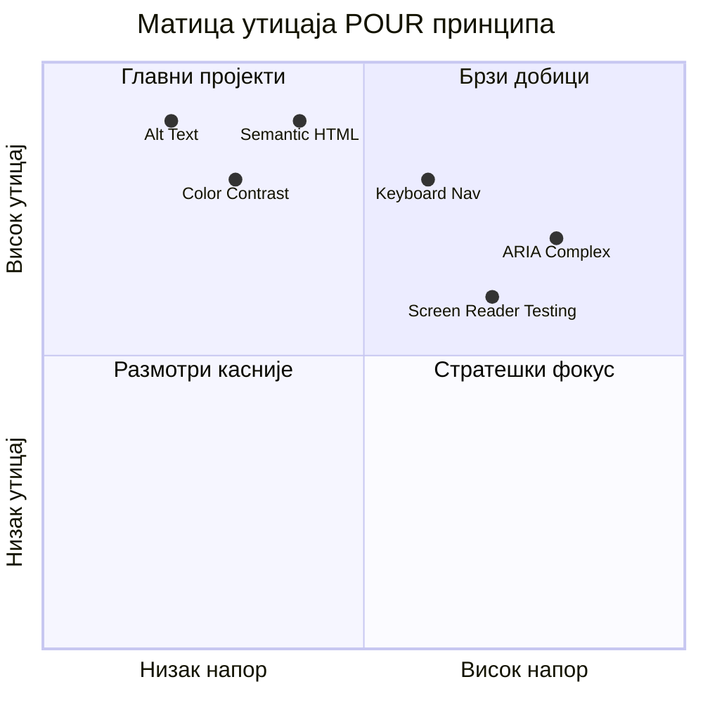
> **Запамтите**: Почните са променама које имају велики утицај, а захтевају мало труда. Семантички HTML и алтернативни текст пружају највећи појачавач приступачности за минималан напор!

## Креирање Приступачног Визуелног Дизајна

Добар визуелни дизајн и приступачност иду руку под руку. Када дизајнирате са приступачношћу на уму, често откријете да ови ограничења воде ка чистијим, елегантнијим решењима која користе свим корисницима.

Хајде да истражимо како направити визуелно привлачан дизајн који функционише за све, без обзира на њихове визуелне могућности или услове под којима прегледају ваш садржај.

### Стратегије боја и визуелне приступачности

Боја је моћна за комуникацију, али никада не би требало да буде једини начин преношења важних информација. Дизајн који иде даље од боје ствара робуснија, инклузивна искуства која функционишу у више ситуација.

**Дизајнирајте за разлике у бојном виду:**

Око 8% мушкараца и 0,5% жена имају неку врсту разлике у бојном виду (често називану "сљепило за боје"). Најчешћи типови су:
- **Деутеранопија**: Тешкоћа у разликовању црвене и зелене
- **Протанопија**: Црвена изгледа замућено
- **Тританопија**: Тешкоћа са плавом и жутом (ретко)

**Инклузивне стратегије боја:**

```css
/* ❌ Bad: Using only color to indicate status */
.error { color: red; }
.success { color: green; }

/* ✅ Good: Color plus icons and context */
.error {
  color: #d32f2f;
  border-left: 4px solid #d32f2f;
}
.error::before {
  content: "⚠️";
  margin-right: 8px;
}

.success {
  color: #2e7d32;
  border-left: 4px solid #2e7d32;
}
.success::before {
  content: "✅";
  margin-right: 8px;
}
```

**Више од основних захтева за контраст:**
- Тестирајте избор боја користећи симулаторе сљепила за боје
- Користите узорке, текстуре или облике уз кодирање бојом
- Обезбедите да интерактивна стања остану препознатљива без боје
- Размотрите како изгледа ваш дизајн у режиму високог контраста

✅ **Тестирајте приступачност боја**: Користите алате као [Coblis](https://www.color-blindness.com/coblis-color-blindness-simulator/) да видите како ваш сајт изгледа корисницима са различитим врстама бојне сљепиле.

### Индикатори фокуса и дизајн интеракције

Индикатори фокуса су дигитални еквивалент курсора — показују корисницима који користе тастатуру где се налазе на страници. Добро дизајнирани индикатори фокуса побољшавају искуство за све тако што чине интеракције јасним и предвидљивим.

**Најбоље праксе савременог индикатора фокуса:**

```css
/* Enhanced focus styles that work across browsers */
button:focus-visible {
  outline: 2px solid #0066cc;
  outline-offset: 2px;
  box-shadow: 0 0 0 4px rgba(0, 102, 204, 0.25);
}

/* Remove focus outline for mouse users, preserve for keyboard users */
button:focus:not(:focus-visible) {
  outline: none;
}

/* Focus-within for complex components */
.card:focus-within {
  box-shadow: 0 0 0 3px rgba(74, 144, 164, 0.5);
  border-color: #4A90A4;
}

/* Ensure focus indicators meet contrast requirements */
.custom-focus:focus-visible {
  outline: 3px solid #ffffff;
  outline-offset: 2px;
  box-shadow: 0 0 0 6px #000000;
}
```

**Захтеви за индикаторе фокуса:**
- **Видљивост**: Морају имати најмање контраст 3:1 у односу на околне елементе
- **Ширина**: Минимално 2пк дебљине око целог елемента
- **Постојаност**: Требају остати видљиви док се фокус не помери
- **Различитост**: Морате бити визуелно одвојени од других UI стања

> 💡 **Савет у дизајну**: Одлични индикатори фокуса често користе комбинацију ивице, сенке и промена боја да би обезбедили видљивост на различитим позадинама и контекстима.

✅ **Проверите индикаторе фокуса**: Навигацијом тастатуром кроз вашу веб страницу забележите који елементи имају јасне индикаторе. Да ли их је тешко видети или их нема потпуно?

### Семантички HTML: Основа приступачности

Семантички HTML је као да вашим асистивним технологијама дајете GPS систем за вашу веб страницу. Када користите праве HTML елементе за њихову намењену сврху, у основи дајете читачима екрана, тастатурама и другим алатима детаљан мапу да помогну корисницима да ефикасно навигирају.

Ево једне аналогије која ми је стварно „кликнула“: семантички HTML је разлика између добро организоване библиотеке са јасним категоријама и корисним знацима у односу на складиште у којем су књиге расуте насумично. Обе локације имају исте књиге, али у којој бисте радо тражили нешто? Управо тако!

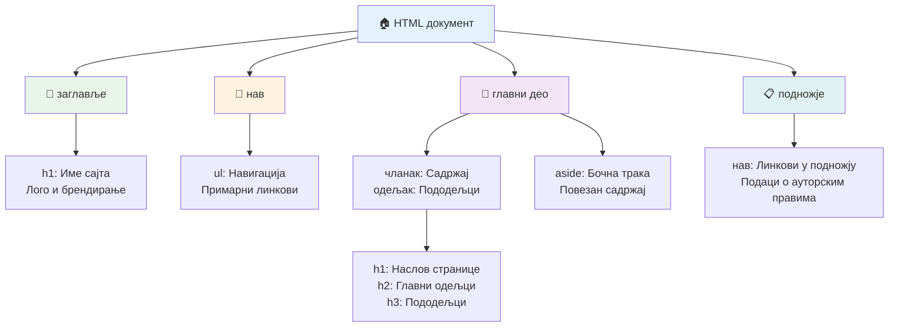
**Грађевински блокови приступачне структуре странице:**

```html
<!-- Landmark elements provide page navigation structure -->
<header>
  <h1>Your Site Name</h1>
  <nav aria-label="Main navigation">
    <ul>
      <li><a href="/home">Home</a></li>
      <li><a href="/about">About</a></li>
      <li><a href="/services">Services</a></li>
    </ul>
  </nav>
</header>

<main>
  <article>
    <header>
      <h1>Article Title</h1>
      <p>Published on <time datetime="2024-10-14">October 14, 2024</time></p>
    </header>
    
    <section>
      <h2>First Section</h2>
      <p>Content that relates to this section...</p>
    </section>
    
    <section>
      <h2>Second Section</h2>
      <p>More related content...</p>
    </section>
  </article>
  
  <aside>
    <h2>Related Links</h2>
    <nav aria-label="Related articles">
      <ul>
        <li><a href="/related-1">First related article</a></li>
        <li><a href="/related-2">Second related article</a></li>
      </ul>
    </nav>
  </aside>
</main>

<footer>
  <p>&copy; 2024 Your Site Name. All rights reserved.</p>
  <nav aria-label="Footer links">
    <ul>
      <li><a href="/privacy">Privacy Policy</a></li>
      <li><a href="/contact">Contact Us</a></li>
    </ul>
  </nav>
</footer>
```

**Зашто семантички HTML трансформише приступачност:**

| Семантички Елемент | Сврха | Корист за Читач Екрана |
|------------------|---------|----------------------|
| `<header>` | Заглавље странице или секције | "Банер лендинг" - брза навигација до врха |
| `<nav>` | Навигациони линкови | "Навигациони лендинг" - листа навигационих одељака |
| `<main>` | Главни садржај странице | "Главни лендинг" - прескочи директно на садржај |
| `<article>` | Самосталан садржај | Обележава границе чланка |
| `<section>` | Тематски груписан садржај | Обезбеђује структуру садржаја |
| `<aside>` | Повезани садржај у бочној траци | "Комплементарни лендинг" |
| `<footer>` | Подножје странице или секције | "Contentinfo лендинг" |

**Суперпоровољности читача екрана са семантичким HTML-ом:**
- **Навигација по лендингима**: Брзо прелазите између главних делова странице
- **Насловне структуре**: Генерише садржај на основу структуре наслова
- **Листе елемената**: Креира листе свих линкова, дугмади или контролa форми
- **Свесност о контексту**: Разумева односе између делова садржаја

> 🎯 **Брзи тест**: Покушајте навигацију са читачем екрана користећи пречице за лендинге (Д за лендинг, Х за наслов, К за линк у NVDA/JAWS). Да ли навигација има смисла?

### 🏗️ **Провера Мајсторства Семантичког HTML-а: Градња Чврстих Основа**

**Процените своје семантичко разумевање:**
- Можете ли препознати лендинге на веб страници просто гледајући HTML?
- Како бисте пријатељу објаснили разлику између `<section>` и `<div>`?
- Коју прву ствар бисте проверили ако корисник читача екрана пријави проблеме са навигацијом?

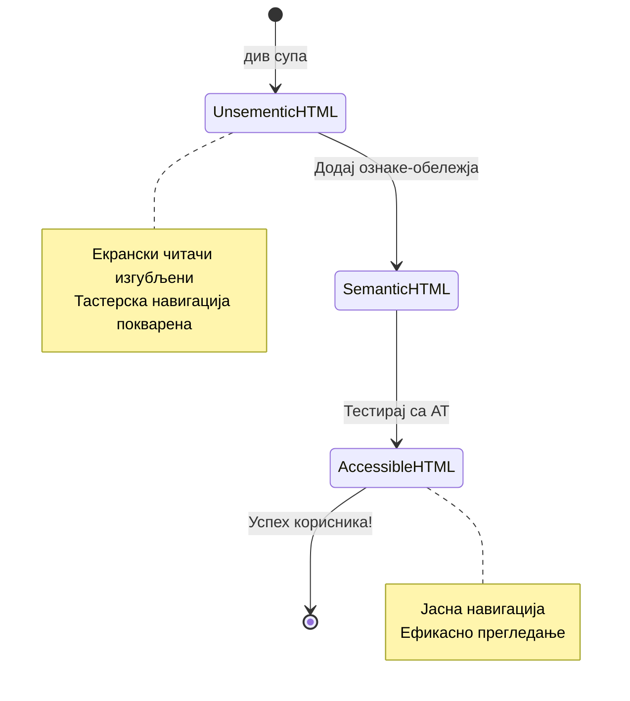
> **Професионални савет**: Добар семантички HTML аутоматски решава око 70% проблема приступачности. Савладајте ову основу и бићете на добром путу!

✅ **Проведите ревизију семантичке структуре**: Користите панел приступачности у алаткама за развој вашег прегледача да видите стабло приступачности и осигурате да ваш markup ствара логичку структуру.

### Хијерархија наслова: Креирање логичног оквира садржаја

Наслови су апсолутно кључни за приступачан садржај — они су као кичма која држи све на окупу. Корисници читача екрана се снажно ослањају на наслове да разумеју и навигирају садржај. Помислите на то као да пружате садржајну табелу за вашу страницу.

**Златно правило за наслове:**
Никада не прескакајте нивое. Увек напредујте логично од `<h1>` ка `<h2>`, `<h3>`, и тако даље. Сећате се како се праве оквири у школи? Потпуно је исти принцип — не бисте прешли директно са „I. Главна тачка“ на „C. Потпотачка“ без „A. Потпоточак“ између, зар не?

**Пример савршене структуре наслова:**

```html
<!-- ✅ Excellent: Logical, hierarchical progression -->
<main>
  <h1>Complete Guide to Web Accessibility</h1>
  
  <section>
    <h2>Understanding Screen Readers</h2>
    <p>Introduction to screen reader technology...</p>
    
    <h3>Popular Screen Reader Software</h3>
    <p>NVDA, JAWS, and VoiceOver comparison...</p>
    
    <h3>Testing with Screen Readers</h3>
    <p>Step-by-step testing instructions...</p>
  </section>
  
  <section>
    <h2>Color and Contrast Guidelines</h2>
    <p>Designing with sufficient contrast...</p>
    
    <h3>WCAG Contrast Requirements</h3>
    <p>Understanding the different contrast levels...</p>
    
    <h3>Testing Tools and Techniques</h3>
    <p>Tools for verifying contrast ratios...</p>
  </section>
</main>
```

```html
<!-- ❌ Problematic: Skipping levels, inconsistent structure -->
<h1>Page Title</h1>
<h3>Subsection</h3> <!-- Skipped h2 -->
<h2>This should come before h3</h2>
<h1>Another main heading?</h1> <!-- Multiple h1s -->
```

**Најбоље праксе за наслове:**
- **Један `<h1>` по страници**: Обично ваш главни наслов странице или примарни наслов садржаја
- **Логичан напредак**: Никада не прескачите нивое (h1 → h2 → h3, а не h1 → h3)
- **Описни садржај**: Направите наслове значајним и када се читају изван контекста
- **Визуелно обликовање CSS-ом**: Користите CSS за изглед, HTML нивое за структуру

**Статистика навигације читача екрана:**
- 68% корисника читача екрана навигира по насловима ([WebAIM Survey](https://webaim.org/projects/screenreadersurvey9/#finding))
- Корисници очекују да пронађу логичан оквир наслова
- Наслови пружају најбржи начин разумевања структуре странице

> 💡 **Професионални савет**: Користите проширења прегледача као што је "HeadingsMap" да визуелишете структуру наслова. Требало би да се чита као добро организована табела садржаја.

✅ **Тестирајте структуру наслова**: Користите навигацију по насловима читача екрана (клавиш H у NVDA) да прелазите кроз наслове. Да ли напредак логично прича причу вашег садржаја?

### Напредне технике визуелне приступачности

Изван основа контраста и боје, постоје софистициране технике које помажу у стварању заиста инклузивних визуелних искустава. Ове методе осигуравају да ваш садржај ради у различитим условима прегледања и асистивним технологијама.

**Основне стратегије визуелне комуникације:**

- **Мулти-модална повратна информација**: Комбинујте визуелне, текстуалне и понекад звучне сигнале
- **Прогресивно откривање**: Представљајте информације у пробављивим деловима
- **Конзистентни обрасци интеракције**: Користите познате UI конвенције
- **Респонзивна типографија**: Прилагођавајте величину текста према уређају
- **Стања учитавања и грешке**: Пружајте јасне повратне информације за све корисничке акције

**CSS алати за побољшану приступачност:**

```css
/* Screen reader only text - visually hidden but accessible */
.sr-only {
  position: absolute;
  width: 1px;
  height: 1px;
  padding: 0;
  margin: -1px;
  overflow: hidden;
  clip: rect(0, 0, 0, 0);
  white-space: nowrap;
  border: 0;
}

/* Skip link for keyboard navigation */
.skip-link {
  position: absolute;
  top: -40px;
  left: 6px;
  background: #000000;
  color: #ffffff;
  padding: 8px 16px;
  text-decoration: none;
  border-radius: 4px;
  font-weight: bold;
  transition: top 0.3s ease;
  z-index: 1000;
}

.skip-link:focus {
  top: 6px;
}

/* Reduced motion respect */
@media (prefers-reduced-motion: reduce) {
  .skip-link {
    transition: none;
  }
  
  * {
    animation-duration: 0.01ms !important;
    animation-iteration-count: 1 !important;
    transition-duration: 0.01ms !important;
  }
}

/* High contrast mode support */
@media (prefers-contrast: high) {
  .button {
    border: 2px solid;
  }
}
```

> 🎯 **Обрасци приступачности**: „Скип линк“ је кључан за кориснике тастатуре. Треба да буде први фокусабилни елемент на вашој страници и омогућава прескакање директно на главни садржај.

✅ **Имплементирајте скип навигацију**: Додајте скип линкове на ваше странице и тестирајте их притиском на Таб одмах по учитавању странице. Они треба да се појаве и омогуће скок до главног садржаја.

## Креирање Смисленог Текста Линка

Линкови су као ауто-путеви интернета, али лоше написан текст линка је као да путокази кажу само „Место“ уместо „Центар Чикага“. Није баш корисно, зар не?

Ево нечега што ми је одушевило ум кад сам први пут сазнао: читачи екрана могу издвојити све линкове са странице и приказати их као једну велику листу. Замислите да вам неко да директоријум свих линкова на вашој страници. Да ли би сваки од њих имао смисла сам за себе? То је тест који ваш текст линка треба да прође!

### Разумевање образаца навигације линка

Читачи екрана нуде моћне функције навигације линковима које зависе од добро написаног текста линка:

**Начини навигације линковима:**
- **Секвенцијално читање**: Линкови се читају у контексту као део текста
- **Генерисање листе линкова**: Сви линкови странице се прикупљају у претраживу листу
- **Брза навигација**: Прелазите између линкова преко тастатурских пречица (К у NVDA)
- **Претрага**: Проналазите одређене линкове куцањем дела текста

**Зашто је контекст важан:**
Када корисници читача екрана генеришу листу линкова, виде нешто овако:
- „Преузми извештај“
- „Сазнај више“
- „Кликни овде“
- „Политика приватности“
- „Кликни овде“

Само два од ових линкова дају корисне информације када се читају изван контекста!

> 📊 **Утицај на корисника**: Корисници читача екрана претражују листе линкова да брзо разумеју садржај странице. Генерички текст линка приморава их да се враћају на контекст сваког линка, знатно успоравајући претраживање.

### Честе грешке у тексту линкова које треба избегавати

Разумевање шта не функционише помаже вам да препознате и исправите проблеме приступачности у постојећем садржају.

**❌ Генерички текст линка који не пружа контекст:**

```html
<!-- Meaningless when read from a link list -->
<p>Our sustainability efforts are detailed in our recent report. 
   <a href="/sustainability-2024.pdf">Click here</a> to view it.</p>

<!-- Repeated generic text throughout the page -->
<div class="article-card">
  <h3>Web Accessibility Guide</h3>
  <p>Learn the fundamentals...</p>
  <a href="/accessibility-guide">Read more</a>
</div>
<div class="article-card">
  <h3>Color Contrast Tips</h3>
  <p>Improve your design...</p>
  <a href="/color-contrast">Read more</a>
</div>

<!-- URLs as link text (difficult for screen readers to announce) -->
<p>Visit https://www.w3.org/WAI/WCAG21/quickref/ for WCAG guidelines.</p>

<!-- Vague action words -->
<a href="/contact">Go</a> | <a href="/about">See</a> | <a href="/help">View</a>
```

**Зашто ови обрасци не успевају:**
- **"Кликни овде"** не говори корисницима ништа о одредишту
- **"Прочитај више"** који се понавља више пута ствара забуну
- **Радни URL-ови** тешко се јасно изговарају читачима екрана
- **Једне речи** као „Иди“ или „Види“ немају описни контекст

### Писање одличног текста линка

Описан текст линка користи свима — оштрооки корисници могу брзо прегледати линкове, а корисници читача екрана одмах разумеју одредишта.

**✅ Јасни, описни примери текста линка:**

```html
<!-- Descriptive text that explains the destination -->
<p>Our comprehensive <a href="/sustainability-2024.pdf">2024 sustainability report (PDF, 2.1MB)</a> details our environmental initiatives.</p>

<!-- Specific, unique link text for each card -->
<div class="article-card">
  <h3>Web Accessibility Guide</h3>
  <p>Learn the fundamentals of inclusive design...</p>
  <a href="/accessibility-guide">Read our complete web accessibility guide</a>
</div>
<div class="article-card">
  <h3>Color Contrast Tips</h3>
  <p>Improve your design with better color choices...</p>
  <a href="/color-contrast">Explore color contrast best practices</a>
</div>

<!-- Meaningful text instead of raw URLs -->
<p>The <a href="https://www.w3.org/WAI/WCAG21/quickref/">WCAG 2.1 Quick Reference guide</a> provides comprehensive accessibility guidelines.</p>

<!-- Descriptive action links -->
<a href="/contact">Contact our support team</a> | 
<a href="/about">About our company</a> | 
<a href="/help">Get help with your account</a>
```

**Најбоље праксе за текст линка:**
- **Будите конкретни**: „Преузмите квартални финансијски извештај“ уместо „Преузми“
- **Укључите тип и величину фајла**: „(PDF, 1.2MB)“ за фајлове за преузимање
- **Напомените ако линк отвара нови прозор**: „(отвара се у новом прозору)“ кад је потребно
- **Користите активајучи језик**: „Контактирајте нас“ уместо „Контакт страница“
- **Будите концизни**: Тежите 2-8 речи кад је могуће

### Напредни обрасци приступачности линкова

Понекад ограничења визуелног дизајна или технички захтеви захтевају посебна решења. Ево софистицираних техника за честе изазовне сценарије:

**Коришћење ARIA за побољшани контекст:**

```html
<!-- When button text must be short but needs more context -->
<a href="/report.pdf" 
   aria-label="Download 2024 annual financial report, PDF format, 2.3MB">
  Download Report
</a>

<!-- When the full context comes from surrounding content -->
<h3 id="sustainability-heading">Sustainability Initiative</h3>
<p>Our efforts to reduce environmental impact...</p>
<a href="/sustainability-details" 
   aria-labelledby="sustainability-heading"
   aria-describedby="sustainability-summary">
  Learn more
</a>
<p id="sustainability-summary">Detailed breakdown of our 2024 environmental goals and achievements</p>
```

**Обележавање типова фајлова и екстерних одредишта:**

```html
<!-- Method 1: Include information in visible link text -->
<a href="/annual-report.pdf">
  Download our 2024 annual report (PDF, 2.3MB)
</a>

<!-- Method 2: Use screen reader-only text for file details -->
<a href="/annual-report.pdf">
  Download our 2024 annual report
  <span class="sr-only">(PDF format, 2.3MB)</span>
</a>

<!-- Method 3: External link indication -->
<a href="https://example.com" 
   target="_blank" 
   aria-describedby="external-link-warning">
  Visit external resource
</a>
<span id="external-link-warning" class="sr-only">
  (opens in new window)
</span>

<!-- Method 4: Using CSS for visual indicators -->
<a href="https://example.com" class="external-link">
  External resource
</a>
```

```css
/* Visual indicator for external links */
.external-link::after {
  content: " ↗";
  font-size: 0.8em;
  color: #666;
}

/* Screen reader announcement for external links */
.external-link::before {
  content: "External link: ";
  position: absolute;
  left: -10000px;
  width: 1px;
  height: 1px;
  overflow: hidden;
}
```

> ⚠️ **Важно**: Када користите `target="_blank"`, увек обавестите кориснике да линк отвара нови прозор или језичак. Неочекиване промене у навигацији могу изазвати дезоријентацију.

✅ **Тестирајте контекст вашег линка**: Користите алате за развој у прегледачу да генеришете листу свих линкова на вашој страници. Можете ли разумети сврху сваког линка без икаквог околног контекста?

## ARIA: Снажна Подршка Приступачности HTML-а

[Accessible Rich Internet Applications (ARIA)](https://developer.mozilla.org/docs/Web/Accessibility/ARIA) је као универзални преводилац између ваших сложених веб апликација и асистивних технологија. Када сам HTML не може све да изрази у ономе што ваше интерактивне компоненте раде, ARIA улази да попуни те празнине.

Волим да замислим ARIA као додавање корисних белешки вашем HTML-у — као упутства за глумце у позоришном тексту која им помажу да разумеју своје улоге и односе.

**Најважније правило о ARIA:** Увек прво користите семантички HTML, затим додајте ARIA за побољшање. Замислите ARIA као зачине, а не главно јело. Треба да појасни и обогати вашу HTML структуру, никада да је замени. Прво сврстану основу како треба!

### Стратегијска имплементација ARIA

ARIA је моћан, али са моћи долази и одговорност. Погрешан ARIA може учинити приступачност гором него без ARIA. Ево када и како га ефективно користити:

**✅ Користите ARIA када:**
- Креирате прилагођене интерактивне виџете (акордеони, картице, карусели)
- Правите динамички садржај који се мења без поновног учитавања странице
- Пружате додатни контекст за сложене UI односе
- Обележавате стања учитавања или живе измене садржаја
- Креирате апликацијске интерфејсе са прилагођеним контролама

**❌ Избегавајте ARIA када:**
- Стандардни HTML елементи већ пружају потребну семантику
- Нисте сигурни како да га правилно имплементирате
- Дуплира информације већ дате семантичким HTML-ом
- Нисте тестирали са стварном асистивном технологијом

> 🎯 **Златно правило ARIA**: „Не мењајте семантику ако није апсолутно неопходно, увек обезбедите тастатурну приступачност и тестирајте са стварном асистивном технологијом.“
**Пет категорија ARIA:**

1. **Улоге**: Шта је овај елемент? (`button`, `tab`, `dialog`)
2. **Својства**: Које су његове карактеристике? (`aria-required`, `aria-haspopup`)
3. **Стања**: Какво му је тренутно стање? (`aria-expanded`, `aria-checked`)
4. **Ландмаркови**: Где се налази у структури странице? (`banner`, `navigation`, `main`)
5. **Лајв региони**: Како треба да се саопштавају промене? (`aria-live`, `aria-atomic`)

### Есенцијални ARIA шаблони за модерне веб апликације

Ови шаблони решавају најчешће изазове приступачности у интерактивним веб апликацијама:

**Именовање и описивање елемената:**

```html
<!-- aria-label: Provides accessible name when visible text isn't sufficient -->
<button aria-label="Close newsletter subscription dialog">×</button>

<!-- aria-labelledby: References existing text as the accessible name -->
<section aria-labelledby="news-heading">
  <h2 id="news-heading">Latest News</h2>
  <!-- news content -->
</section>

<!-- aria-describedby: Links to additional descriptive text -->
<input type="password" 
       aria-describedby="pwd-requirements pwd-strength"
       required>
<div id="pwd-requirements">
  Password must contain at least 8 characters, including uppercase, lowercase, and numbers.
</div>
<div id="pwd-strength" aria-live="polite">
  <!-- Dynamic password strength indicator -->
</div>
```

**Лајв региони за динамички садржај:**

```html
<!-- Polite announcements (don't interrupt current speech) -->
<div aria-live="polite" id="status-updates">
  <!-- Status messages appear here -->
</div>

<!-- Assertive announcements (interrupt and announce immediately) -->
<div aria-live="assertive" id="urgent-alerts">
  <!-- Error messages and critical alerts -->
</div>

<!-- Loading states with live regions -->
<button id="submit-btn" aria-describedby="loading-status">
  Submit Application
</button>
<div id="loading-status" aria-live="polite" aria-atomic="true">
  <!-- "Processing your application..." appears here -->
</div>
```

**Пример интерактивног виџета (акордеон):**

```html
<div class="accordion">
  <h3>
    <button aria-expanded="false" 
            aria-controls="panel-1" 
            id="accordion-trigger-1"
            class="accordion-trigger">
      Accessibility Guidelines
    </button>
  </h3>
  <div id="panel-1" 
       role="region"
       aria-labelledby="accordion-trigger-1" 
       hidden>
    <p>WCAG 2.1 provides comprehensive guidelines...</p>
  </div>
</div>
```

```javascript
// ЈаваСкрипт за управљање стањем акордеона
function toggleAccordion(trigger) {
  const panel = document.getElementById(trigger.getAttribute('aria-controls'));
  const isExpanded = trigger.getAttribute('aria-expanded') === 'true';
  
  // Пребацивање стања
  trigger.setAttribute('aria-expanded', !isExpanded);
  panel.hidden = isExpanded;
  
  // Обавештавање о промени за читаче екрана
  const status = document.getElementById('status-updates');
  status.textContent = isExpanded ? 'Section collapsed' : 'Section expanded';
}
```

### Најбоље праксе за имплементацију ARIA

ARIA је моћна али захтева пажљиву имплементацију. Пратећи ове смернице осигурава се да ваша ARIA побољшава, а не отежава приступачност:

**🛡️ Кључни принципи:**

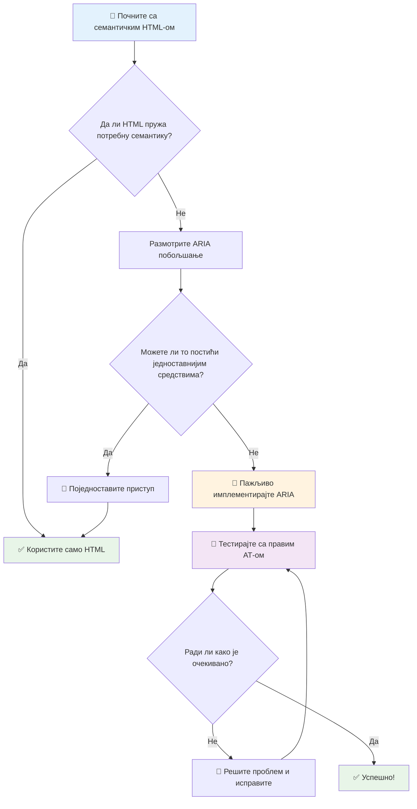
1. **Прво семантички HTML**: Увек дајте предност `<button>` уместо `<div role="button">`
2. **Не кршите семантику**: Никада не мењајте значење постојећег HTML-а (избегавајте `<h1 role="button">`)
3. **Одржавање приступачности тастатуре**: Сви интерактивни ARIA елементи морају бити у потпуности доступни преко тастатуре
4. **Тестирања са стварним корисницима**: Подршка за ARIA значајно варира између асистивних технологија
5. **Почните једноставно**: Компликоване ARIA имплементације су подложније грешкама

**🔍 Радни ток тестирања:**

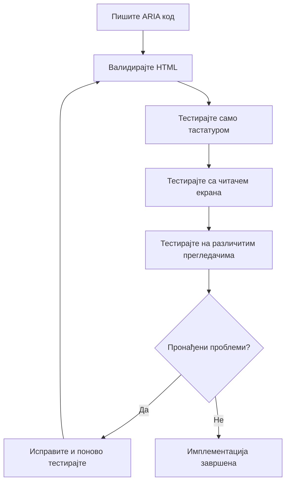
**🚫 Уобичајене ARIA грешке које треба избегавати:**

- **Сукобљене информације**: Немојте сукобљавати семантику HTML-а
- **Прекомерно означавање**: Превише информација о ARIA-има збуњује кориснике
- **Статичка ARIA**: Заборављате да ажурирате ARIA стања када се садржај мења
- **Нетестиране имплементације**: ARIA која у теорији ради, али у пракси не
- **Недостаје подршка за тастатуру**: ARIA улоге без одговарајућих интеракција на тастатури

> 💡 **Ресурси за тестирање**: Користите алате као што је [accessibility-checker](https://www.npmjs.com/package/accessibility-checker) за аутоматску валидацију ARIA, али увек тестирајте са стварним читачима екрана за потпуно искуство.

### 🎭 **Provera veština ARIA: Спремни за сложене интеракције?**

**Процените своје ARIA самопоуздање:**
- Кад бисте изабрали ARIA уместо семантичког HTML-а? (Наговештај: готово никад!)
- Можете ли објаснити зашто је `<div role="button">` обично слабије од `<button>`?
- Која је најважнија ствар коју треба запамтити о ARIA тестирању?

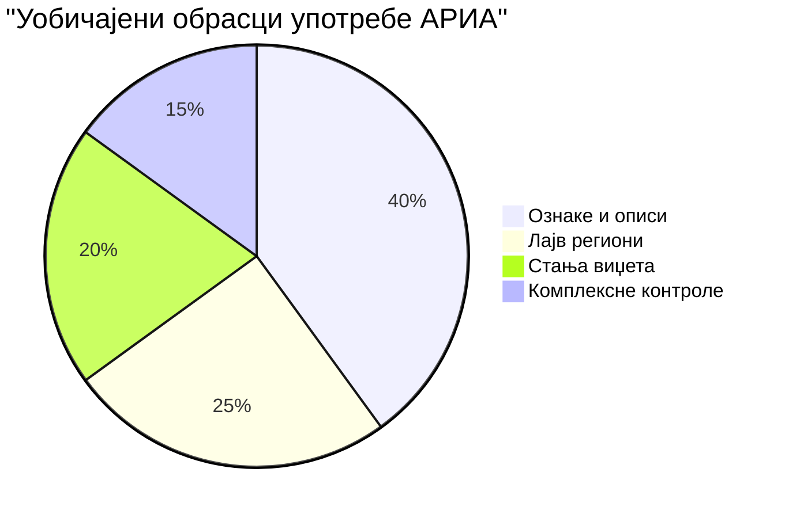
> **Кључни увид**: Већина коришћења ARIA односи се на означавање и описивање елемената. Комплексни шаблони виџета су знатно ређи него што мислите!

✅ **Учите од стручњака**: Изучите [ARIA Authoring Practices Guide](https://w3c.github.io/aria-practices/) за проверене шаблоне и имплементације комплексних интерактивних виџета.

## Приступачност слика и медија

Визуелни и аудио садржај су суштински делови модерних веб искустава, али могу створити баријере ако нису пажљиво имплементирани. Циљ је осигурати да информације и емоционални утисак ваших медија допру до сваког корисника. Када се уложите, то постаје друга природа.

Различите врсте медија захтевају различите приступе приступачности. Као код кувања—не бисте поступали с нежном рибом као с јаким стејком. Разумевање ових разлика вам помаже да изаберете прави приступ за сваку ситуацију.

### Стратегијска приступачност слика

Свака слика на вашем сајту има сврху. Разумевање те сврхе помаже да напишете бољи алтернативни текст и направите инклузивнија искуства.

**Четири врсте слика и стратегије за алт текст:**

**Информативне слике** - преносе важне информације:
```html

```

**Декоративне слике** - искључиво визуелне, без информативне вредности:
```html

```

**Функционалне слике** - служе као дугмад или контроле:
```html
<button>
  
</button>
```

**Комплексне слике** - графикони, дијаграми, инфографике:
```html

<div id="chart-description">
  <p>Detailed description: Sales data shows a steady increase across all quarters...</p>
</div>
```

### Приступачност видео и аудио садржаја

**Захтеви за видео:**
- **Наслови**: Текстуална верзија говора и звукова
- **Аудио описи**: Причање о визуелним елементима за слепе кориснике
- **Транскрипти**: Потпуна текстуална верзија сваког аудио и визуелног садржаја

```html
<video controls>
  <source src="video.mp4" type="video/mp4">
  <track kind="captions" src="captions.vtt" srclang="en" label="English">
  <track kind="descriptions" src="descriptions.vtt" srclang="en" label="Audio descriptions">
</video>
```

**Захтеви за аудио:**
- **Транскрипти**: Текстуална верзија сваког говора
- **Визуелни индикатори**: За аудио садржаје обезбедите визуелне сигнале

### Модерне технике за слике

**Коришћење CSS-а за декоративне слике:**
```css
.hero-section {
  background-image: url('decorative-hero.jpg');
  /* Decorative images in CSS don't need alt text */
}
```

**Респонзивне слике са приступачношћу:**
```html
<picture>
  <source media="(min-width: 800px)" srcset="large-chart.png">
  <source media="(min-width: 400px)" srcset="medium-chart.png">
  
</picture>
```

✅ **Тестирајте приступачност слика**: Користите читач екрана да се крећете по страници са сликама. Да ли добијате довољно информација да разумете садржај?

## Навигација тастатуром и управљање фокусом

Многи корисници користе веб искључиво помоћу тастатуре. То укључује људе са моторичким инвалидитетом, напредне кориснике који тастатуру сматрају бржом од миша и све оне чији миш не ради. Осигурати да ваш сајт одлично ради са тастатуром је пресудно и често убрзава рад за све.

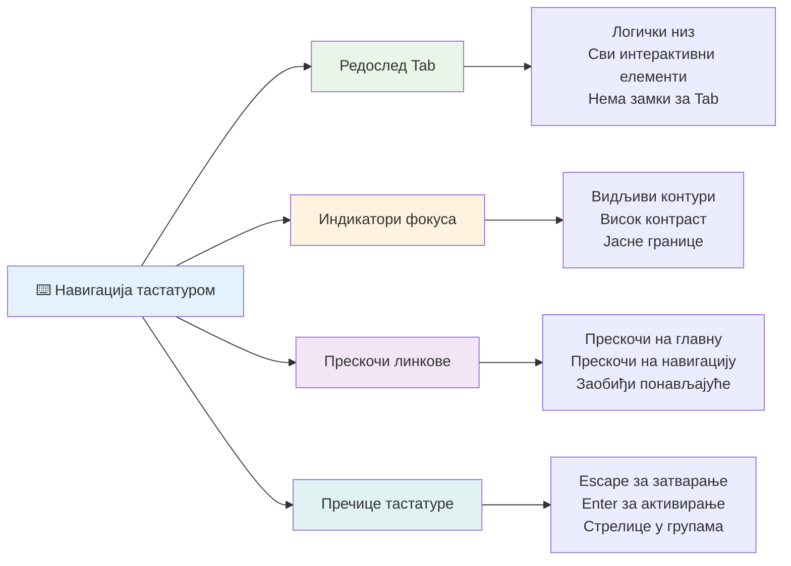
### Есенцијални шаблони навигације тастатуром

**Стандардне интеракције тастатуре:**
- **Tab**: Померање фокуса напред кроз интерактивне елементе
- **Shift + Tab**: Померање фокуса назад
- **Enter**: Активирање дугмади и линкова
- **Space**: Активирање дугмади, означавање чекбоксева
- **Стрелице**: Навигација у оквиру група компоненти (радио тастери, менији)
- **Escape**: Затварање модала, падајућих менија или отказивање операција

### Најбоље праксе за управљање фокусом

**Видљиви индикатори фокуса:**
```css
/* Ensure focus is always visible */
button:focus-visible {
  outline: 2px solid #4A90A4;
  outline-offset: 2px;
}

/* Custom focus styles for different components */
.card:focus-within {
  box-shadow: 0 0 0 3px rgba(74, 144, 164, 0.5);
}
```

**Прескочи линкове за ефикасну навигацију:**
```html
<a href="#main-content" class="skip-link">Skip to main content</a>
<a href="#navigation" class="skip-link">Skip to navigation</a>

<nav id="navigation">
  <!-- navigation content -->
</nav>
<main id="main-content">
  <!-- main content -->
</main>
```

**Правилан редослед табулатора:**
```html
<!-- Use semantic HTML for natural tab order -->
<form>
  <label for="name">Name:</label>
  <input type="text" id="name" tabindex="0">
  
  <label for="email">Email:</label>
  <input type="email" id="email" tabindex="0">
  
  <button type="submit" tabindex="0">Submit</button>
</form>
```

### Заробљавање фокуса у модалима

Када се отварају модални дијалози, фокус треба бити заробљен унутар модала:

```javascript
// Савремена имплементација фокус замке
function trapFocus(element) {
  const focusableElements = element.querySelectorAll(
    'button, [href], input, select, textarea, [tabindex]:not([tabindex="-1"])'
  );
  
  const firstElement = focusableElements[0];
  const lastElement = focusableElements[focusableElements.length - 1];

  element.addEventListener('keydown', (e) => {
    if (e.key === 'Tab') {
      if (e.shiftKey && document.activeElement === firstElement) {
        e.preventDefault();
        lastElement.focus();
      } else if (!e.shiftKey && document.activeElement === lastElement) {
        e.preventDefault();
        firstElement.focus();
      }
    }
    
    if (e.key === 'Escape') {
      closeModal();
    }
  });
  
  // Фокусирај први елемент када се модал отвори
  firstElement.focus();
}
```

✅ **Тестирајте навигацију тастатуром**: Покушајте да навигирате ваш сајт користећи искључиво тастер Tab. Можете ли доћи до свих интерактивних елемената? Да ли је редослед фокуса логичан? Да ли су индикатори фокуса јасно видљиви?

## Приступачност формулара

Формулари су критични за интеракцију корисника и захтевају посебну пажњу за приступачност.

### Повезивање ознака и контрола формулара

**Свака контрола у формулару треба ознаку:**
```html
<!-- Explicit labeling (preferred) -->
<label for="username">Username:</label>
<input type="text" id="username" name="username" required>

<!-- Implicit labeling -->
<label>
  Password:
  <input type="password" name="password" required>
</label>

<!-- Using aria-label when visual label isn't desired -->
<input type="search" aria-label="Search products" placeholder="Search...">
```

### Руковање грешкама и валидација

**Приступачне поруке о грешкама:**
```html
<label for="email">Email Address:</label>
<input type="email" id="email" name="email" 
       aria-describedby="email-error" 
       aria-invalid="true" required>
<div id="email-error" role="alert">
  Please enter a valid email address
</div>
```

**Најбоље праксе валидације формулара:**
- Користите `aria-invalid` за означавање неважећих поља
- Обезбедите јасне, прецизне поруке о грешкама
- Користите `role="alert"` за важна обавештења о грешкама
- Приказујте грешке одмах и приликом слања формулара

### Филдсети и груписање

**Групишите повезане контроле формулара:**
```html
<fieldset>
  <legend>Shipping Address</legend>
  <label for="street">Street Address:</label>
  <input type="text" id="street" name="street">
  
  <label for="city">City:</label>
  <input type="text" id="city" name="city">
</fieldset>

<fieldset>
  <legend>Preferred Contact Method</legend>
  <input type="radio" id="contact-email" name="contact" value="email">
  <label for="contact-email">Email</label>
  
  <input type="radio" id="contact-phone" name="contact" value="phone">
  <label for="contact-phone">Phone</label>
</fieldset>
```

## Ваш пут ка приступачности: Кључни закључци

Честитамо! Управо сте стекли основна знања за креирање заиста инклузивних веб искустава. Ово је заиста узбудљиво! Веб приступачност није само оцењивање усклађености—то је препознавање разноликости начина на које људи комуницирају са дигиталним садржајем и дизајнирање за ту невероватну сложеност.

Сада сте део растуће заједнице програмера који разумеју да одличан дизајн функционише за све. Добродошли у клуб!

**🎯 Ваш скуп алата за приступачност сада укључује:**

| Основни принцип | Имплементација | Утицај |
|-----------------|----------------|--------|
| **Семантичка HTML основа** | Користите одговарајуће HTML елементе за њихову сврху | Читаоци екрана могу ефикасно да навигирају, тастатуре раде аутоматски |
| **Инклузиван визуелни дизајн** | Довољан контраст, смислена употреба боја, видљиви индикатори фокуса | Јасно за све у сваком осветљењу |
| **Дескриптивни садржај** | Смислен текст линкова, алт текст, наслови | Корисници разумеју садржај без визуелног контекста |
| **Приступачност тастатуре** | Редослед табулатора, пречице, управљање фокусом | Моторичка приступачност и ефикасност напредних корисника |
| **Унапређење ARIA-ом** | Стратегијска употреба за попуњавање семантичких празнина | Комплексне апликације раде са асистивним технологијама |
| **Комплетно тестирање** | Аутоматски алати + ручна провера + тестирање са корисницима | Преко хваћања проблема пре него што утичу на кориснике |

**🚀 Ваши следећи кораци:**

1. **Укључите приступачност у ваш радни ток**: Учини тестирање природним делом вашег развојног процеса
2. **Учите од стварних корисника**: Тражите повратне информације од људи који користе асистивне технологије
3. **Будите у току**: Технике приступачности се развијају са новим технологијама и стандардима
4. **Залажите се за инклузију**: Делите своје знање и учините приступачност тимским приоритетом

> 💡 **Запамтите**: Ограничења приступачности често воде ка иновативним, елегантним решењима која користе свима. Рампе, титлови и гласовне контроле сви су почели као приступачне функције и постали главни ток.

**Пословни разлог је сасвим јасан**: Приступачни сајтови достижу више корисника, боље рангирају на претраживачима, имају ниже трошкове одржавања и избегавају правне ризике. Али искрено? Прави разлог за бригу о приступачности иде много дубље. Приступачни сајтови оличују најбоље вредности веба—отвореност, инклузивност и идеју да свако заслужује једнак приступ информацијама.

Сада сте опремљени да градите инклузивни веб будућности. Свака приступачна страница коју направите чини интернет пријатнијим местом за све. То је заиста невероватно када размислите!

## Додатни ресурси

Наставите свој пут учења о приступачности са овим кључним изворима:

**📚 Званични стандарди и смернице:**
- [WCAG 2.1 смернице](https://www.w3.org/WAI/WCAG21/quickref/) - Званични стандард приступачности са брзом референцом
- [ARIA Authoring Practices Guide](https://w3c.github.io/aria-practices/) - Комплетни шаблони за интерактивне виџете
- [WebAIM смернице](https://webaim.org/) - Практичне, прилагођене почетницима смернице

**🛠️ Алатке и ресурси за тестирање:**
- [axe DevTools](https://www.deque.com/axe/devtools/) - Индустријски стандард за тестирање приступачности
- [A11y Project листа провера](https://www.a11yproject.com/checklist/) - Провера приступачности корак по корак
- [Accessibility Insights](https://accessibilityinsights.io/) - Комплетан пакет за тестирање компаније Microsoft
- [Color Oracle](https://colororacle.org/) - Симулација бојне слепоће за тестирање дизајна

**🎓 Учење и заједница:**
- [WebAIM анкета о читачима екрана](https://webaim.org/projects/screenreadersurvey9/) - Поставке и понашања стварних корисника
- [Inclusive Components](https://inclusive-components.design/) - Модерни приступачни компонентни шаблони
- [A11y Coffee](https://a11y.coffee/) - Брзи савети и увиди о приступачности
- [Web Accessibility Initiative (WAI)](https://www.w3.org/WAI/) - Комплетни ресурси W3C за приступачност

**🎥 Практично учење:**
- [Accessibility Developer Guide](https://www.accessibility-developer-guide.com/) - Практичне смернице за имплементацију
- [Deque University](https://dequeuniversity.com/) - Професионални курсеви приступачности

## GitHub Copilot Agent изазов 🚀

Користите Agent режим за извршење следећег изазова:

**Опис:** Креирајте приступачну компоненту модалног дијалога која демонстрира правилно управљање фокусом, ARIA атрибуте и образце навигације тастатуром.

**Задатак:** Направите комплетну компоненту модалног дијалога са HTML, CSS и JavaScript-ом која укључује: правилно заробљавање фокуса, ESC тастер за затварање, кликове ван модала за затварање, ARIA атрибуте за читаче екрана и видљиве индикаторе фокуса. Модал треба да садржи формулар са одговарајућим ознакама и руковањем грешкама. Обезбедите да компонента испуњава WCAG 2.1 AA стандарде.

## 🚀 Изазов

Узмите овај HTML и препишите га да буде што приступачнији, узимајући у обзир научене стратегије.

```html
<!DOCTYPE html>
<html lang="en">
  <head>
    <meta charset="UTF-8">
    <meta name="viewport" content="width=device-width, initial-scale=1.0">
    <title>Turtle Ipsum - The World's Premier Turtle Fan Club</title>
    <link href='../assets/style.css' rel='stylesheet' type='text/css'>
  </head>
  <body>
    <header class="site-header">
      <h1 class="site-title">Turtle Ipsum</h1>
      <p class="site-subtitle">The World's Premier Turtle Fan Club</p>
    </header>
    
    <nav class="main-nav" aria-label="Main navigation">
      <h2 class="nav-header">Resources</h2>
      <ul class="nav-list">
        <li><a href="https://www.youtube.com/watch?v=CMNry4PE93Y">"I like turtles" video</a></li>
        <li><a href="https://en.wikipedia.org/wiki/Turtle">Basic turtle information</a></li>
        <li><a href="https://en.wikipedia.org/wiki/Turtles_(chocolate)">Chocolate turtles candy</a></li>
      </ul>
    </nav>
    
    <main class="main-content">
      <article>
        <h1>Welcome to Turtle Ipsum</h1>
        <p class="intro">
          <a href="/about">Learn more about our turtle community</a> and discover fascinating facts about these amazing creatures.
        </p>
        <p class="article-text">
          Turtle ipsum dolor sit amet, consectetur adipiscing elit, sed do eiusmod tempor incididunt ut labore et dolore magna aliqua. Ut enim ad minim veniam, quis nostrud exercitation ullamco laboris nisi ut aliquip ex ea commodo consequat. Duis aute irure dolor in reprehenderit in voluptate velit esse cillum dolore eu fugiat nulla pariatur. Excepteur sint occaecat cupidatat non proident, sunt in culpa qui officia deserunt mollit anim id est laborum.
        </p>
      </article>
    </main>
    
    <footer class="footer">
      <section class="newsletter-signup">
        <h2>Stay Updated</h2>
        <button type="button" onclick="showNewsletterForm()">Sign up for turtle news</button>
      </section>
      
      <nav class="footer-nav" aria-label="Footer navigation">
        <h2>Site Pages</h2>
        <ul>
          <li><a href="../">Home</a></li>
          <li><a href="../semantic">Semantic HTML example</a></li>
        </ul>
      </nav>
      
      <p class="footer-copyright">&copy; 2024 Instrument. All rights reserved.</p>
    </footer>
  </body>
</html>
```

**Кључна унапређења:**
- Додата исправна семантичка HTML структура
- Исправљена хијерархија наслова (један h1, логична прогресија)
- Додат смислени текст линкова уместо „кликните овде“
- Обезбеђене одговарајуће ARIA ознаке за навигацију
- Додат lang атрибут и одговарајуће meta ознаке
- Користи се button елемент за интерактивне делове
- Структурисан футер помоћу исправних ландмаркова

## Тест након предавања  
[Пост-предавачки квиз](https://ff-quizzes.netlify.app/web/en/)

## Ревизија и самостално учење

Многе владе имају законе о захтевима приступачности. Прочитајте законе из ваше земље о приступачности. Шта је покривено, а шта није? Пример је [овај званични сајт](https://accessibility.blog.gov.uk/).

## Задатак

[Анализирајте неприступачан веб сајт](assignment.md)

Кредити: [Turtle Ipsum](https://github.com/Instrument/semantic-html-sample) од Instrument

---

## 🚀 Ваш план опремања за приступачност

### ⚡ **Шта можете да урадите у наредних 5 минута**
- [ ] Инсталирајте axe DevTools екстензију у прегледач
- [ ] Покрените Lighthouse приступачност ревизију на омиљеном сајту
- [ ] Испробајте навигацију било којим сајтом само уз помоћ тастера Tab
- [ ] Тестирајте уграђени читач екрана у вашем прегледачу (Narrator/VoiceOver)

### 🎯 **Шта можете постићи у наредном сату**
- [ ] Завршите пост-часовни квиз и размислите о увидима приступачности
- [ ] Вежбајте писање значајних алт текстова за 10 различитих слика
- [ ] Ревизија структуре наслова на сајту уз помоћ HeadingsMap екстензије
- [ ] Исправите проблеме приступачности пронађене у изазову HTML-а
- [ ] Тестирајте колор контраст у свом тренутном пројекту са WebAIM алатком

### 📅 **Ваша недељна приступачност рута**
- [ ] Завршите задатак анализа неприступачног веб сајта
- [ ] Подесите развојно окружење са алатима за тестирање приступачности
- [ ] Вежбај навигацију тастатуром на 5 различитих комплексних веб сајтова
- [ ] Направи једноставан формулар са исправним ознакама, руковањем грешкама и ARIA
- [ ] Придружи се заједници за приступачност (A11y Slack, WebAIM форум)
- [ ] Гледај како прави корисници са инвалидитетом навигирају веб сајтове (YouTube има сјајне примере)

### 🌟 **Твоја месечна трансформација**
- [ ] Интегриши тестирање приступачности у свој развојни ток рада
- [ ] Доприноси open source пројекту решавајући проблеме приступачности
- [ ] Спроведи тестирање употребљивости са неким ко користи асистивну технологију
- [ ] Направи библиотеку приступачних компонената за свој тим
- [ ] Залажи се за приступачност у свом радном окружењу или заједници
- [ ] Нека нова особа у приступачности буде твој ментор

### 🏆 **Коначни проверни састанак шампиона приступачности**

**Прослави свој пут приступачности:**
- Која те највише изненадила ствар коју си научио о томе како људи користе веб?
- Који принцип приступачности највише одговара твом стилу развоја?
- Како ти је учење о приступачности променило поглед на дизајн?
- Које је прво унапређење приступачности које желиш да направиш на стварном пројекту?

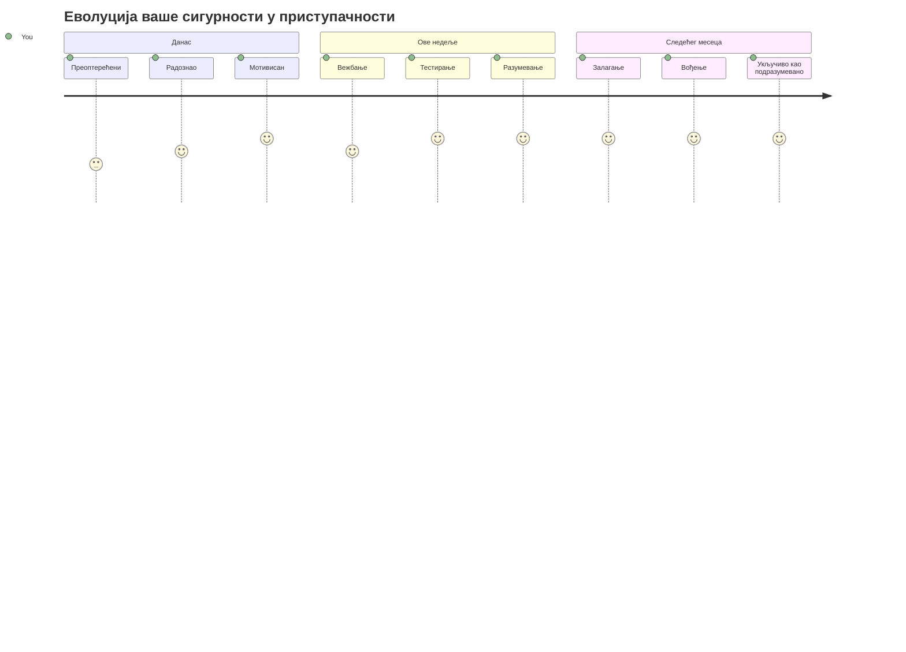
> 🌍 **Ти си сада шампион приступачности!** Разумеш да одлична веб искуства функционишу за све, без обзира како приступају вебу. Свако приступачно својство које направиш чини интернет инклузивнијим. Вебу су потребни програмери као што си ти који приступачност виде не као ограничење, већ као прилику да створе боља искуства за све кориснике. Добродошао у покрет! 🎉

---

<!-- CO-OP TRANSLATOR DISCLAIMER START -->
**Одрицање од одговорности**:  
Овај документ је преведен помоћу AI услуге за превођење [Co-op Translator](https://github.com/Azure/co-op-translator). Иако тежимо прецизности, имајте у виду да аутоматизовани преводи могу садржати грешке или нетачности. Оригинални документ на његовом матичном језику треба сматрати ауторитетним извором. За критичне информације препоручује се професионални људски превод. Нисмо одговорни за било каква неразумевања или погрешне тумачења која произилазе из коришћења овог превода.
<!-- CO-OP TRANSLATOR DISCLAIMER END -->