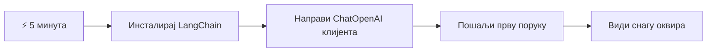
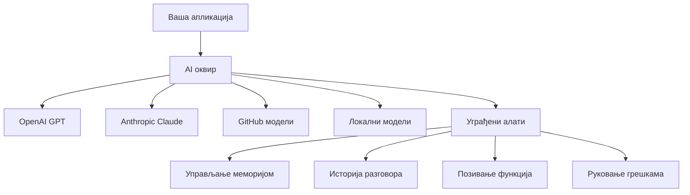
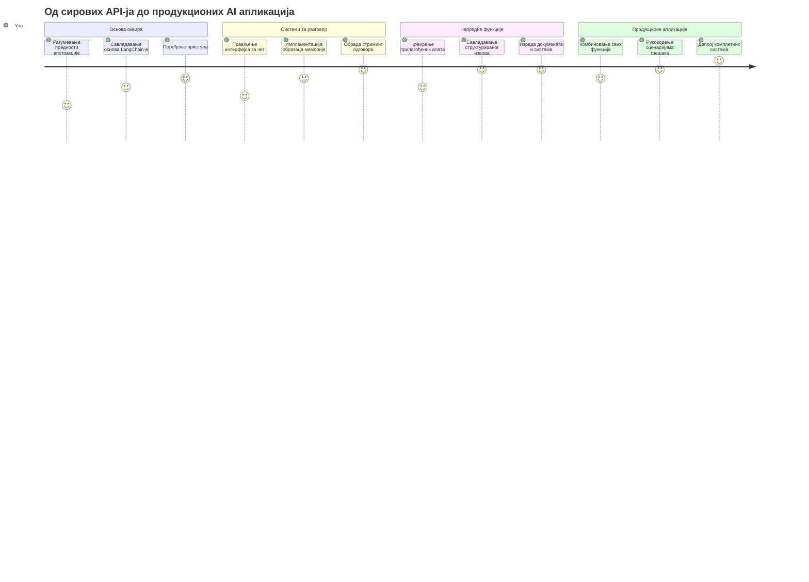
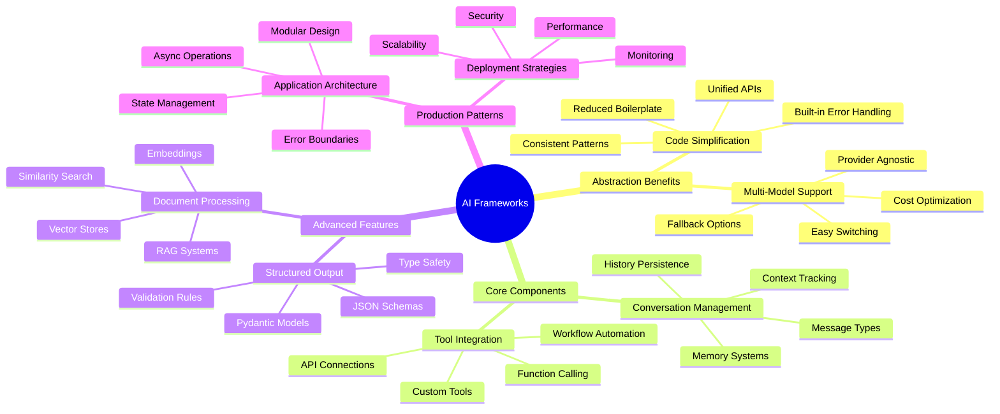
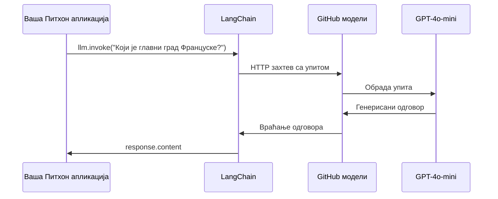
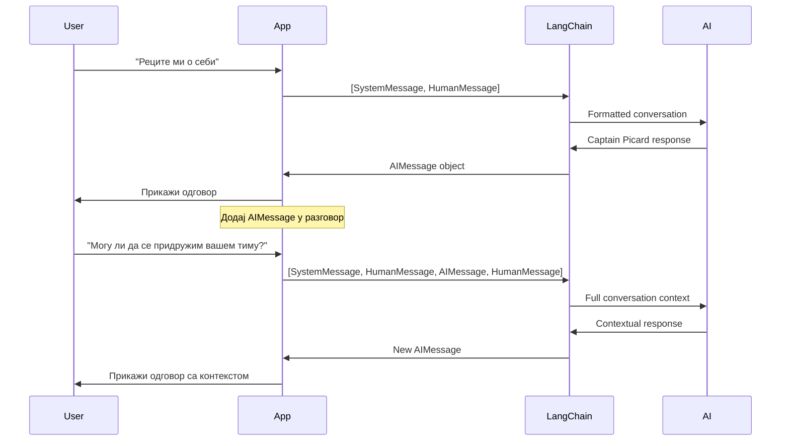
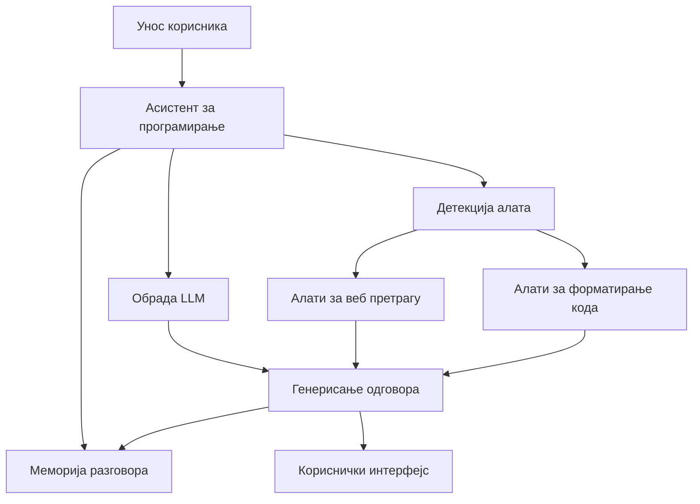
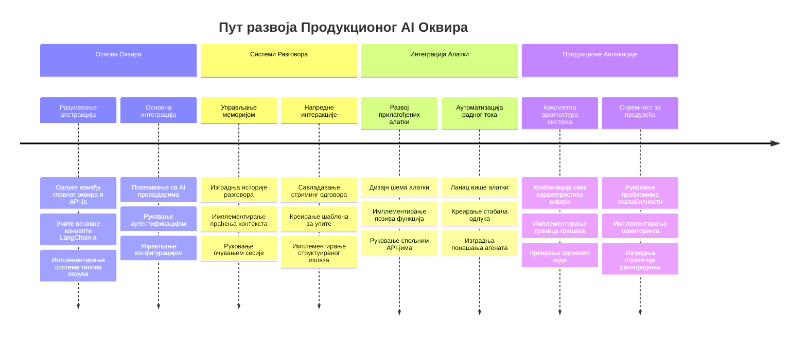
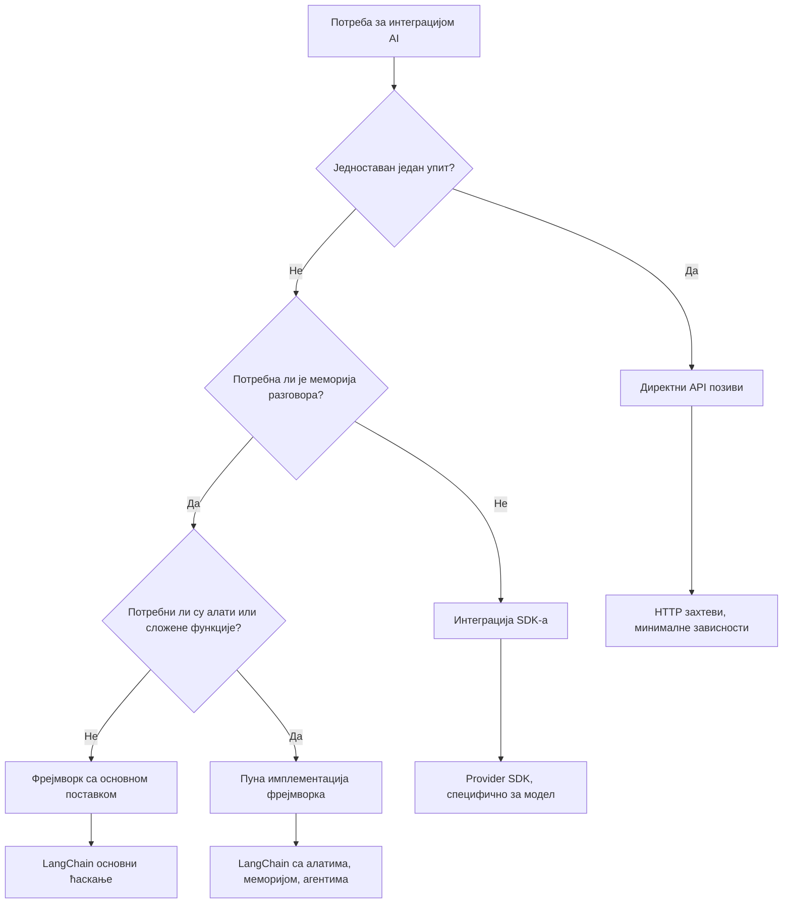

<!--
CO_OP_TRANSLATOR_METADATA:
{
  "original_hash": "3925b6a1c31c60755eaae4d578232c25",
  "translation_date": "2026-01-07T07:34:25+00:00",
  "source_file": "10-ai-framework-project/README.md",
  "language_code": "sr"
}
-->
# AI Фрејмворк

Да ли сте икада осећали преплављеност док сте покушавали да направите AI апликације од нуле? Нисте сами! AI фрејмворци су као швајцарски нож за развој AI - моћни алати који вам могу уштедети време и главобоље приликом израде интелигентних апликација. Размислите о AI фрејмворку као о добро организованој библиотеци: пружа унапред направљене компоненте, стандардизоване API-је и паметне апстракције тако да можете да се фокусирате на решавање проблема уместо борбе са детаљима имплементације.

У овом лекцији ћемо истражити како фрејмворци као што је LangChain могу претворити оно што је раније била сложена интеграција AI у чист, читљив код. Открићете како да се изборите са изазовима из стварног света као што су праћење разговора, имплементација позива алата и коришћење различитих AI модела преко једног јединственог интерфејса.

Када завршимо, знаћете када да користите фрејмворке уместо сирових позива API-ју, како ефикасно употребљавати њихове апстракције и како да градите AI апликације спремне за стварну употребу. Хајде да истражимо шта AI фрејмворци могу учинити за ваше пројекте.

## ⚡ Шта можете урадити у следећих 5 минута

**Пут за брз почетак за заузете програмере**


- **Минут 1**: Инсталирајте LangChain: `pip install langchain langchain-openai`
- **Минут 2**: Подесите свој GitHub токен и увезите ChatOpenAI клијента
- **Минут 3**: Направите једноставан разговор са системским и људским порукама
- **Минут 4**: Додајте основни алат (као функцију сабирања) и видите позив алата AI-ју
- **Минут 5**: Искусите разлику између сирових API позива и фрејмворк апстракције

**Брзи тест код**:
```python
from langchain_openai import ChatOpenAI
from langchain_core.messages import SystemMessage, HumanMessage

llm = ChatOpenAI(
    api_key=os.environ["GITHUB_TOKEN"],
    base_url="https://models.github.ai/inference",
    model="openai/gpt-4o-mini"
)

response = llm.invoke([
    SystemMessage(content="You are a helpful coding assistant"),
    HumanMessage(content="Explain Python functions briefly")
])
print(response.content)
```

**Зашто је ово важно**: За 5 минута ћете видети како AI фрејмворци претварају сложену интеграцију AI у једноставне методе позива. Ово је основа која покреће производне AI апликације.

## Зашто одабрати фрејмворк?

Дакле, спремни сте да направите AI апликацију - одлично! Али ево шта је битно: имате неколико различитих путева које можете изабрати, и сваки има своје предности и недостаци. Личи на избор између ходања, вожње бицикла или аутомобила да бисте стигли негде - сви ће вас одвести тамо, али ће искуство (и напор) бити сасвим различити.

Хајде да разложимо три главна начина на које можете интегрисати AI у своје пројекте:

| Приступ | Предности | Најбоље за | Разматрања |
|----------|------------|----------|--------------|
| **Директни HTTP захтеви** | Потпуна контрола, без зависности | Једноставни упити, учење основе | Више опсежан код, ручно руковање грешкама |
| **SDK интеграција** | Мање шаблонског кода, оптимизација за модел | Апликације са једним моделом | Ограничено на специфичне провајдере |
| **AI фрејмворци** | Јединствени API, уграђене апстракције | Апликације са више модела, сложени токови | Кривa учења, потенцијално претерана апстракција |

### Предности фрејмворка у пракси


**Зашто су фрејмворци важни:**
- **Уједињује** више AI провајдера под један интерфејс
- **Аутоматски управља** меморијом разговора
- **Пружа** спремне алате за уобичајене задатке као што су уграђени прикази и позив функција
- **Рукова** грешкама и логиком поновних покушаја
- **Претвара** сложене токове у читљиве методе позива

> 💡 **Професионални савет**: Користите фрејмворке када мењате између различитих AI модела или градите сложене функције као што су агенти, меморија или позив алата. Држите се директних API позива када учите основе или правите једноставне, фокусиране апликације.

**Закључак**: Као када бираш између специјализованих рукотворних алата и комплетне радионице, битно је изабрати алатку за задатак. Фрејмворци одлично функционишу за сложене апликације пуне функција, док директни API позиви добро раде за једноставне случајеве употребе.

## 🗺️ Ваш пут учења ка мајсторству AI фрејмворка


**Ваш циљ путовања**: До краја ове лекције, савладаћете развој AI фрејмворка и моћи ћете да градите софистициране AI апликације спремне за продукцију које се могу мерити са комерцијалним AI асистентима.

## Увод

У овој лекцији ћемо научити:

- Како користити уобичајени AI фрејмворк.
- Како решавати уобичајене проблеме као што су разговори у чету, коришћење алата, меморија и контекст.
- Како искористити ово да направите AI апликације.

## 🧠 Екосистем развоја AI фрејмворка


**Основни принцип**: AI фрејмворци апстрахују сложеност пружајући моћне апстракције за управљање разговором, интеграцију алата и обраду докумената, омогућавајући програмерима да праве софистициране AI апликације са чистим, одрживим кодом.

## Ваш први AI упит

Хајде да почнемо са основама тако што ћемо направити прву AI апликацију која шаље питање и добија одговор. Као што је Архимед открио принцип потискивања у својој кади, понекад једноставна посматрања доводе до најмоћнијих увида – а фрејмворци чине те увиде приступачним.

### Подешавање LangChain са GitHub моделима

Користићемо LangChain за повезивање са GitHub моделима, што је веома добро јер вам омогућава бесплатан приступ различитим AI моделима. Најбоље од свега? Потребно је само неколико једноставних параметара за конфигурацију да почнете:

```python
from langchain_openai import ChatOpenAI
import os

llm = ChatOpenAI(
    api_key=os.environ["GITHUB_TOKEN"],
    base_url="https://models.github.ai/inference",
    model="openai/gpt-4o-mini",
)

# Пошаљи једноставан захтев
response = llm.invoke("What's the capital of France?")
print(response.content)
```

**Хајде да разложимо шта се овде дешава:**
- **Креира** LangChain клијента користећи класу `ChatOpenAI` - ово је ваша капија ка AI-ју!
- **Конфигурише** везу ка GitHub моделима са вашим аутентификационим токеном
- **Наводи** који AI модел ће се користити (`gpt-4o-mini`) - замислите то као избор вашег AI асистента
- **Шаље** ваше питање користећи методу `invoke()` - овде се дешава магија
- **Извлачи** и приказује одговор - и ето, причате са AI-јем!

> 🔧 **Напомена за подешавање**: Ако користите GitHub Codespaces, у срећи сте - `GITHUB_TOKEN` је већ подешен за вас! Радите локално? Нема проблема, само треба да направите лични приступни токен са одговарајућим дозволама.

**Очекујени резултат:**
```text
The capital of France is Paris.
```


## Прављење конверзационог AI-ја

Први пример демонстрира основе, али то је само једна размена – поставите питање, добијете одговор и то је то. У стварним апликацијама желите да ваш AI памти о чему сте разговарали, као што су Watson и Holmes градили своје истраживачке разговоре током времена.

У томе LangChain постаје нарочито користан. Пружа различите типове порука које помажу у структуирању разговора и омогућавају вам да AI-ју дате личност. Изградњом чет искустава одржаваћете контекст и карактер.

### Разумевање типова порука

Замислите ове типове порука као различите "кеце" које учесници носе у разговору. LangChain користи различите класе порука да прати ко шта говори:

| Тип поруке | Сврха | Пример употребе |
|--------------|---------|------------------|
| `SystemMessage` | Дефинише личност и понашање AI-ја | "Ти си користан асистент за кодирање" |
| `HumanMessage` | Представља унос корисника | "Објасни како функције раде" |
| `AIMessage` | Снима одговоре AI-ја | Претходни AI одговори у разговору |

### Креирање вашег првог разговора

Направимо разговор у којем наш AI преузима одређену улогу. Даћемо му лик Капетана Пикарда - личности познатој по дипломатској мудрости и вођству:

```python
messages = [
    SystemMessage(content="You are Captain Picard of the Starship Enterprise"),
    HumanMessage(content="Tell me about you"),
]
```

**Разлагање ове поставке разговора:**
- **Установљава** улогу и личност AI-ја кроз `SystemMessage`
- **Пружа** почетни кориснички упит преко `HumanMessage`
- **Креира** темељ за вишезвучни разговор

Цели код овог примера изгледа овако:

```python
from langchain_core.messages import HumanMessage, SystemMessage
from langchain_openai import ChatOpenAI
import os

llm = ChatOpenAI(
    api_key=os.environ["GITHUB_TOKEN"],
    base_url="https://models.github.ai/inference",
    model="openai/gpt-4o-mini",
)

messages = [
    SystemMessage(content="You are Captain Picard of the Starship Enterprise"),
    HumanMessage(content="Tell me about you"),
]


# ради
response  = llm.invoke(messages)
print(response.content)
```

Очекујете резултат сличан овоме:

```text
I am Captain Jean-Luc Picard, the commanding officer of the USS Enterprise (NCC-1701-D), a starship in the United Federation of Planets. My primary mission is to explore new worlds, seek out new life and new civilizations, and boldly go where no one has gone before. 

I believe in the importance of diplomacy, reason, and the pursuit of knowledge. My crew is diverse and skilled, and we often face challenges that test our resolve, ethics, and ingenuity. Throughout my career, I have encountered numerous species, grappled with complex moral dilemmas, and have consistently sought peaceful solutions to conflicts.

I hold the ideals of the Federation close to my heart, believing in the importance of cooperation, understanding, and respect for all sentient beings. My experiences have shaped my leadership style, and I strive to be a thoughtful and just captain. How may I assist you further?
```

Да бисте одржали континуитет разговора (уместо ресетовања контекста сваки пут), морате наставити да додате одговоре у листу порука. Као усмена традиција која је чувала приче кроз генерације, овај приступ гради дуготрајну меморију:

```python
from langchain_core.messages import HumanMessage, SystemMessage
from langchain_openai import ChatOpenAI
import os

llm = ChatOpenAI(
    api_key=os.environ["GITHUB_TOKEN"],
    base_url="https://models.github.ai/inference",
    model="openai/gpt-4o-mini",
)

messages = [
    SystemMessage(content="You are Captain Picard of the Starship Enterprise"),
    HumanMessage(content="Tell me about you"),
]


# ради
response  = llm.invoke(messages)

print(response.content)

print("---- Next ----")

messages.append(response)
messages.append(HumanMessage(content="Now that I know about you, I'm Chris, can I be in your crew?"))

response  = llm.invoke(messages)

print(response.content)

```

Лепо, зар не? Шта се овде дешава јесте да позивамо LLM два пута - прво са само две почетне поруке, а онда још једном са пуним историјатом разговора. Као да AI прати наш чет!

Када покренете овај код, добићете други одговор који звучи отприлике овако:

```text
Welcome aboard, Chris! It's always a pleasure to meet those who share a passion for exploration and discovery. While I cannot formally offer you a position on the Enterprise right now, I encourage you to pursue your aspirations. We are always in need of talented individuals with diverse skills and backgrounds. 

If you are interested in space exploration, consider education and training in the sciences, engineering, or diplomacy. The values of curiosity, resilience, and teamwork are crucial in Starfleet. Should you ever find yourself on a starship, remember to uphold the principles of the Federation: peace, understanding, and respect for all beings. Your journey can lead you to remarkable adventures, whether in the stars or on the ground. Engage!
```


Примаћу то као можда ;)

## Стреаминг одговора

Јесте ли приметили како ChatGPT "куца" своје одговоре у реалном времену? То је стриминг у акцији. Као да гледате вешту калиграфкињу како ради - видећи како се ликови појављују потез по потез уместо да се појаве одједном - стриминг чини интеракцију природнијом и пружа одмах повратну информацију.

### Имплементирање стриминга у LangChain-у

```python
from langchain_openai import ChatOpenAI
import os

llm = ChatOpenAI(
    api_key=os.environ["GITHUB_TOKEN"],
    base_url="https://models.github.ai/inference",
    model="openai/gpt-4o-mini",
    streaming=True
)

# Стримовање одговора
for chunk in llm.stream("Write a short story about a robot learning to code"):
    print(chunk.content, end="", flush=True)
```

**Зашто је стриминг сјајан:**
- **Приказује** садржај док се ствара - крај непријатног чекања!
- **Саопштава** корисницима да се нешто стварно дешава
- **Чини** се бржим, иако технички можда није
- **Дозвољава** корисницима да почну да читају док AI још "размишља"

> 💡 **Савет за корисничко искуство**: Стриминг посебно долази до изражаја када је реч о дужим одговорима као што су објашњења кода, креативно писање или детаљни туторијали. Ваши корисници ће уживати у виђењу напретка уместо да гледају празан екран!

### 🎯 Педагошки преглед: Предности апстракције фрејмворка

**Пауза за размишљање**: Управо сте искусили моћ апстракција AI фрејмворка. Упоредите то са неуредним API позивима из претходних лекција.

**Брза самоевалуација**:
- Можете ли објаснити како LangChain поједностављује управљање разговором у односу на ручно праћење порука?
- Која је разлика између метода `invoke()` и `stream()` и када бисте користили сваки?
- Како систем типова порука у фрејмворку побољшава организацију кода?

**Веза са стварним светом**: Обрасци апстракције које сте научили (типови порука, стриминг интерфејси, меморија разговора) користе се у свакој важнијој AI апликацији - од интерфејса ChatGPT-а до помоћи са кодом у GitHub Copilot-у. Савлађујете исте архитектонске узорке које користе професионални тимови за развој AI.

**Изазовно питање**: Како бисте дизајнирали апстракцију фрејмворка за руковање различитим провајдерима AI модела (OpenAI, Anthropic, Google) кроз један интерфејс? Размотрите предности и компромисе.

## Шаблони упита

Шаблони упита раде као реторичке структуре које се користе у класичној оријаторији - размислите како би Цицерон прилагођавао своје говорне образце за различите публике, задржавајући исту убедљиву структуру. Они вам дозвољавају да направите поновно употребљиве упите где можете заменити различите делове информација без преписивања свега од почетка. Када поставите шаблон, само попуните променљиве са вредностима које су вам потребне.

### Креирање поновно употребљивих упита

```python
from langchain_core.prompts import ChatPromptTemplate

# Дефинишите шаблон за објашњења кода
template = ChatPromptTemplate.from_messages([
    ("system", "You are an expert programming instructor. Explain concepts clearly with examples."),
    ("human", "Explain {concept} in {language} with a practical example for {skill_level} developers")
])

# Користите шаблон са различитим вредностима
questions = [
    {"concept": "functions", "language": "JavaScript", "skill_level": "beginner"},
    {"concept": "classes", "language": "Python", "skill_level": "intermediate"},
    {"concept": "async/await", "language": "JavaScript", "skill_level": "advanced"}
]

for question in questions:
    prompt = template.format_messages(**question)
    response = llm.invoke(prompt)
    print(f"Topic: {question['concept']}\n{response.content}\n---\n")
```

**Зашто ћете волети шаблоне:**
- **Одржава** конзистентност упита кроз целу апликацију
- **Нема више** неуредног повезивања стрингова - само чисте, једноставне променљиве
- **Ваш AI** се понаша предвидљиво јер структура остаје иста
- **Ажурирања** су једноставна - промените шаблон једном, и исправљено је свуда

## Структурирани излаз

Јесте ли икада били фрустрирани покушавајући да испарсирате AI одговоре који долазе као неструктурирани текст? Структурирани излаз је као да учите свој AI да прати систематски приступ који је Линеус користио за биолошку класификацију - организован, предвидљив и лак за рад. Можете тражити JSON, специфичне структуре података или било који формат који вам треба.

### Дефинисање шема излаза

```python
from langchain_core.prompts import ChatPromptTemplate
from langchain_core.output_parsers import JsonOutputParser
from pydantic import BaseModel, Field

class CodeReview(BaseModel):
    score: int = Field(description="Code quality score from 1-10")
    strengths: list[str] = Field(description="List of code strengths")
    improvements: list[str] = Field(description="List of suggested improvements")
    overall_feedback: str = Field(description="Summary feedback")

# Поставити парсер
parser = JsonOutputParser(pydantic_object=CodeReview)

# Креирати упит са упутствима за формат
prompt = ChatPromptTemplate.from_messages([
    ("system", "You are a code reviewer. {format_instructions}"),
    ("human", "Review this code: {code}")
])

# Форматирати упит са упутствима
chain = prompt | llm | parser

# Добијте структуриран одговор
code_sample = """
def calculate_average(numbers):
    return sum(numbers) / len(numbers)
"""

result = chain.invoke({
    "code": code_sample,
    "format_instructions": parser.get_format_instructions()
})

print(f"Score: {result['score']}")
print(f"Strengths: {', '.join(result['strengths'])}")
```

**Зашто је структурирани излаз револуција:**
- **Нема више** погађања какав формат ћете добити назад - увек је доследан
- **Повезује се** директно са вашим базама података и API-јима без додатног рада
- **Ухвата** чудне AI одговоре пре него што покваре апликацију
- **Чини** ваш код чистијим јер тачно знате са чим радите

## Позив алата

Сада долазимо до једне од најмоћнијих функција: алата. Овако дајете свом AI-ју практичне могућности изван разговора. Као што су средњовековни еснафи развијали специјализоване алате за одређене занате, можете опремити свој AI фокусираним инструментима. Описујете који су алати доступни, а када неко затражи нешто што одговара, ваш AI може предузети акцију.

### Коришћење Pythona

Додајмо неке алате овако:

```python
from typing_extensions import Annotated, TypedDict

class add(TypedDict):
    """Add two integers."""

    # Анотације морају имати тип и могу опционално да укључују подразумевану вредност и опис (по том редоследу).
    a: Annotated[int, ..., "First integer"]
    b: Annotated[int, ..., "Second integer"]

tools = [add]

functions = {
    "add": lambda a, b: a + b
}
```

Шта се овде дешава? Креирамо шаблон за алат који се зове `add`. Наслеђујући од `TypedDict` и користећи оне напредне `Annotated` типове за `a` и `b`, дајемо LLM-у јасну слику шта овај алат ради и шта му треба. Речник `functions` је као наш алатник - каже нашем коду шта тачно да ради када AI одлучи да користи одређени алат.

Хајде да видимо како зовемо LLM са овим алатом:

```python
llm = ChatOpenAI(
    api_key=os.environ["GITHUB_TOKEN"],
    base_url="https://models.github.ai/inference",
    model="openai/gpt-4o-mini",
)

llm_with_tools = llm.bind_tools(tools)
```

Овде зовемо `bind_tools` са нашим низом `tools` и тиме LLM `llm_with_tools` сада познаје овај алат.

Да бисмо користили овај нови LLM можемо откуцати следећи код:

```python
query = "What is 3 + 12?"

res = llm_with_tools.invoke(query)
if(res.tool_calls):
    for tool in res.tool_calls:
        print("TOOL CALL: ", functions[tool["name"]](../../../10-ai-framework-project/**tool["args"]))
print("CONTENT: ",res.content)
```

Сада када зовемо `invoke` на овом новом llm-у, који има алате, можда ће својство `tool_calls` бити попуњено. Ако јесте, било који идентификовани алат има својство `name` и `args` које идентификују који алат треба позвати и са аргументима. Цео код изгледа овако:

```python
from langchain_core.messages import HumanMessage, SystemMessage
from langchain_openai import ChatOpenAI
import os
from typing_extensions import Annotated, TypedDict

class add(TypedDict):
    """Add two integers."""

    # Анотације морају имати тип и могу опционално укључивати подразумевану вредност и опис (тим редоследом).
    a: Annotated[int, ..., "First integer"]
    b: Annotated[int, ..., "Second integer"]

tools = [add]

functions = {
    "add": lambda a, b: a + b
}

llm = ChatOpenAI(
    api_key=os.environ["GITHUB_TOKEN"],
    base_url="https://models.github.ai/inference",
    model="openai/gpt-4o-mini",
)

llm_with_tools = llm.bind_tools(tools)

query = "What is 3 + 12?"

res = llm_with_tools.invoke(query)
if(res.tool_calls):
    for tool in res.tool_calls:
        print("TOOL CALL: ", functions[tool["name"]](../../../10-ai-framework-project/**tool["args"]))
print("CONTENT: ",res.content)
```

Покретањем овог кода, требало би да видите излаз сличан овоме:

```text
TOOL CALL:  15
CONTENT: 
```

AI је анализирао "Шта је 3 + 12" и препознао ово као задатак за алат `add`. Као што вешт библиотекар зна који извор да консултује у зависности од типа питања, доноси ову одлуку на основу имена алата, описа и спецификација поља. Резултат 15 долази из нашег речника `functions` који извршава алат:

```python
print("TOOL CALL: ", functions[tool["name"]](../../../10-ai-framework-project/**tool["args"]))
```

### Још занимљивији алат који позива веб API
Додавање бројева илуструје концепт, али стварни алати обично изводе сложеније операције, као што је позивање веб APIја. Хајде да проширимо наш пример тако да вештачка интелигенција преузме садржај са интернета — слично као што су телеграфски оператери некада повезивали удаљене локације:

```python
class joke(TypedDict):
    """Tell a joke."""

    # Анотације морају имати тип и опционално могу укључивати подразумевану вредност и опис (у том редоследу).
    category: Annotated[str, ..., "The joke category"]

def get_joke(category: str) -> str:
    response = requests.get(f"https://api.chucknorris.io/jokes/random?category={category}", headers={"Accept": "application/json"})
    if response.status_code == 200:
        return response.json().get("value", f"Here's a {category} joke!")
    return f"Here's a {category} joke!"

functions = {
    "add": lambda a, b: a + b,
    "joke": lambda category: get_joke(category)
}

query = "Tell me a joke about animals"

# остатак кода је исти
```

Ако сада покренете овај код, добићете одговор с нечим сличним:

```text
TOOL CALL:  Chuck Norris once rode a nine foot grizzly bear through an automatic car wash, instead of taking a shower.
CONTENT:  
```

```mermaid
flowchart TD
    A[Кориснички упит: "Испричај шалу о животињама"] --> B[LangChain анализа]
    B --> C{Алат доступан?}
    C -->|Да| D[Изабери алат за шале]
    C -->|Не| E[Генериши директан одговор]
    
    D --> F[Извучи параметре]
    F --> G[Позови joke(категорија="животиње")]
    G --> H[АПИ захтев ка chucknorris.io]
    H --> I[Врати садржај шале]
    I --> J[Прикажи кориснику]
    
    E --> K[Одговор генерисан помоћу ИИ]
    K --> J
    
    subgraph "Слој дефиниције алата"
        L[TypedDict шема]
        M[Имплементација функције]
        N[Валидација параметара]
    end
    
    D --> L
    F --> N
    G --> M
```
Ево кода у целости:

```python
from langchain_openai import ChatOpenAI
import requests
import os
from typing_extensions import Annotated, TypedDict

class add(TypedDict):
    """Add two integers."""

    # Аннотације морају имати тип и могу опционално да укључују подразумевану вредност и опис (у том редоследу).
    a: Annotated[int, ..., "First integer"]
    b: Annotated[int, ..., "Second integer"]

class joke(TypedDict):
    """Tell a joke."""

    # Аннотације морају имати тип и могу опционално да укључују подразумевану вредност и опис (у том редоследу).
    category: Annotated[str, ..., "The joke category"]

tools = [add, joke]

def get_joke(category: str) -> str:
    response = requests.get(f"https://api.chucknorris.io/jokes/random?category={category}", headers={"Accept": "application/json"})
    if response.status_code == 200:
        return response.json().get("value", f"Here's a {category} joke!")
    return f"Here's a {category} joke!"

functions = {
    "add": lambda a, b: a + b,
    "joke": lambda category: get_joke(category)
}

llm = ChatOpenAI(
    api_key=os.environ["GITHUB_TOKEN"],
    base_url="https://models.github.ai/inference",
    model="openai/gpt-4o-mini",
)

llm_with_tools = llm.bind_tools(tools)

query = "Tell me a joke about animals"

res = llm_with_tools.invoke(query)
if(res.tool_calls):
    for tool in res.tool_calls:
        # print("ПОЗИВ АЛАТКЕ: ", tool)
        print("TOOL CALL: ", functions[tool["name"]](../../../10-ai-framework-project/**tool["args"]))
print("CONTENT: ",res.content)
```

## Ембеддинзи и обрада докумената

Ембеддинзи представљају једно од најелегантнијих решења у модерној вештачкој интелигенцији. Замислите да можете узети било који текст и претворити га у нумеричке координате које хватају његово значење. Баш то ембеддинзи и раде – трансформишу текст у тачке у вишедимензионалном простору где слични појмови кластерно седе заједно. То је као да имате координатни систем за идеје, што подсећа на то како је Мендељејев организовао периодни систем по атомским својствима.

### Креирање и коришћење ембеддинга

```python
from langchain_openai import OpenAIEmbeddings
from langchain_community.vectorstores import FAISS
from langchain_community.document_loaders import TextLoader
from langchain.text_splitter import CharacterTextSplitter

# Иницијализуј векторске представе
embeddings = OpenAIEmbeddings(
    api_key=os.environ["GITHUB_TOKEN"],
    base_url="https://models.github.ai/inference",
    model="text-embedding-3-small"
)

# Учитај и подели документе
loader = TextLoader("documentation.txt")
documents = loader.load()

text_splitter = CharacterTextSplitter(chunk_size=1000, chunk_overlap=0)
texts = text_splitter.split_documents(documents)

# Креирај векторски проблем
vectorstore = FAISS.from_documents(texts, embeddings)

# Изврши претрагу по сличности
query = "How do I handle user authentication?"
similar_docs = vectorstore.similarity_search(query, k=3)

for doc in similar_docs:
    print(f"Relevant content: {doc.page_content[:200]}...")
```

### Учитавачи докумената за различите формате

```python
from langchain_community.document_loaders import (
    PyPDFLoader,
    CSVLoader,
    JSONLoader,
    WebBaseLoader
)

# Учитајте различите типове докумената
pdf_loader = PyPDFLoader("manual.pdf")
csv_loader = CSVLoader("data.csv")
json_loader = JSONLoader("config.json")
web_loader = WebBaseLoader("https://example.com/docs")

# Обрадите све документе
all_documents = []
for loader in [pdf_loader, csv_loader, json_loader, web_loader]:
    docs = loader.load()
    all_documents.extend(docs)
```

**Шта можете урадити са ембеддингима:**
- **Изградити** претрагу која заправо разуме шта мислите, а не само поклапање кључних речи
- **Креирати** вештачку интелигенцију која може одговарати на питања о вашим документима
- **Направити** системе препорука који предлажу заиста релевантан садржај
- **Аутоматски** организовати и категорисати ваш садржај

```mermaid
flowchart LR
    A[Документи] --> B[Текст Сплитер]
    B --> C[Креирај Ембединг]
    C --> D[Векторски Складиште]
    
    E[Кориснички Захтев] --> F[Ембединг Захтева]
    F --> G[Претраживање Сличности]
    G --> D
    D --> H[Релевантни Документи]
    H --> I[AI Одговор]
    
    subgraph "Векторски Простор"
        J[Документ А: [0.1, 0.8, 0.3...]]
        K[Документ Б: [0.2, 0.7, 0.4...]]
        L[Захтев: [0.15, 0.75, 0.35...]]
    end
    
    C --> J
    C --> K
    F --> L
    G --> J
    G --> K
```
## Израда комплетне AI апликације

Сада ћемо интегрисати све што сте научили у свеобухватну апликацију — асистента за програмирање који може одговарати на питања, користити алате и пратити меморију разговора. Као што је штампарска преса комбиновала постојеће технологије (покретне слова, мастило, папир и притисак) у нешто трансформативно, ми ћемо спојити наше AI компоненте у нешто практично и корисно.

### Пример комплетне апликације

```python
from langchain_openai import ChatOpenAI, OpenAIEmbeddings
from langchain_core.prompts import ChatPromptTemplate
from langchain_core.messages import HumanMessage, SystemMessage, AIMessage
from langchain_community.vectorstores import FAISS
from typing_extensions import Annotated, TypedDict
import os
import requests

class CodingAssistant:
    def __init__(self):
        self.llm = ChatOpenAI(
            api_key=os.environ["GITHUB_TOKEN"],
            base_url="https://models.github.ai/inference",
            model="openai/gpt-4o-mini"
        )
        
        self.conversation_history = [
            SystemMessage(content="""You are an expert coding assistant. 
            Help users learn programming concepts, debug code, and write better software.
            Use tools when needed and maintain a helpful, encouraging tone.""")
        ]
        
        # Дефиниши алате
        self.setup_tools()
    
    def setup_tools(self):
        class web_search(TypedDict):
            """Search for programming documentation or examples."""
            query: Annotated[str, "Search query for programming help"]
        
        class code_formatter(TypedDict):
            """Format and validate code snippets."""
            code: Annotated[str, "Code to format"]
            language: Annotated[str, "Programming language"]
        
        self.tools = [web_search, code_formatter]
        self.llm_with_tools = self.llm.bind_tools(self.tools)
    
    def chat(self, user_input: str):
        # Додај корисничку поруку у разговор
        self.conversation_history.append(HumanMessage(content=user_input))
        
        # Узми AI одговор
        response = self.llm_with_tools.invoke(self.conversation_history)
        
        # Обради позиве алата ако их има
        if response.tool_calls:
            for tool_call in response.tool_calls:
                tool_result = self.execute_tool(tool_call)
                print(f"🔧 Tool used: {tool_call['name']}")
                print(f"📊 Result: {tool_result}")
        
        # Додај AI одговор у разговор
        self.conversation_history.append(response)
        
        return response.content
    
    def execute_tool(self, tool_call):
        tool_name = tool_call['name']
        args = tool_call['args']
        
        if tool_name == 'web_search':
            return f"Found documentation for: {args['query']}"
        elif tool_name == 'code_formatter':
            return f"Formatted {args['language']} code: {args['code'][:50]}..."
        
        return "Tool execution completed"

# Пример употребе
assistant = CodingAssistant()

print("🤖 Coding Assistant Ready! Type 'quit' to exit.\n")

while True:
    user_input = input("You: ")
    if user_input.lower() == 'quit':
        break
    
    response = assistant.chat(user_input)
    print(f"🤖 Assistant: {response}\n")
```

**Архитектура апликације:**


**Кључне функције које смо имплементирали:**
- **Памти** цео ваш разговор за контекстуалну конзистентност
- **Извршава радње** кроз позиве алата, не само разговор
- **Прати** предвидљиве образце интеракције
- **Управља** аутоматски обрадом грешака и сложеним токовима рада

### 🎯 Педагошки преглед: Архитектура AI за продукцију

**Разумевање архитектуре**: Изградили сте комплетну AI апликацију која комбинује управљање разговором, позивање алата и структуиране токове рада. Ово представља развој AI апликација на нивоу продукције.

**Кључни савлади концепти**:
- **Архитектура заснована на класама**: Организована, одржива структура AI апликације
- **Интеграција алата**: Прилагођена функционалност изван разговора
- **Управљање меморијом**: Перзистентни контекст разговора
- **Обрада грешака**: Робустно понашање апликације

**Веза са индустријом**: Шаблони архитектуре које сте имплементирали (разговорне класе, системи алата, управљање меморијом) су исти шаблони који се користе у корпоративним AI апликацијама као што су Slack AI асистент, GitHub Copilot и Microsoft Copilot. Градите са размишљањем на професионалном нивоу.

**Питање за размислљање**: Како бисте проширили ову апликацију да подржи више корисника, перзистентно складиштење или интеграцију са спољним базама података? Размотрите изазове скалабилности и управљања стањем.

## Задаци: Направите свог AI асистента за учење

**Циљ**: Креирати AI апликацију која помаже студентима да уче програмерске концепте пружајући објашњења, примере кода и интерактивне квизове.

### Захтеви

**Основне функције (обавезно):**
1. **Разговорни интерфејс**: Имплементирати систем четова који одржава контекст кроз више питања
2. **Образовни алати**: Направити најмање два алата који помажу у учењу:
   - Алат за објашњавање кода
   - Генератор квиз питања о концептима
3. **Персонализовано учење**: Користити системске поруке за прилагођавање одговора различитим нивоима знања
4. **Форматирање одговора**: Имплементирати структуриран излаз за питања у квизу

### Кораци за имплементацију

**Корак 1: Подешавање окружења**
```bash
pip install langchain langchain-openai
```

**Корак 2: Основна функционалност четова**
- Направити класу `StudyAssistant`
- Имплементирати меморију разговора
- Додати конфигурацију личности за образовну подршку

**Корак 3: Додати образовне алате**
- **Објашњивач кода**: Разлаже код у разумљиве делове
- **Генератор квизова**: Креира питања о програмерским концептима
- **Праћење напретка**: Прати теме које су обрађене

**Корак 4: Побољшане функције (опционо)**
- Имплементирати стриминг одговоре за боље корисничко искуство
- Додати учитавање докумената за укључивање материјала курса
- Креирати ембеддинге за преузимање садржаја на основу сличности

### Критеријуми за процену

| Карактеристика | Одлично (4) | Добро (3) | Задовољавајуће (2) | Потребан рад (1) |
|----------------|--------------|-----------|--------------------|-----------------|
| **Ток разговора** | Природни, са свешћу о контексту | Добро одржавање контекста | Основни разговор | Нема меморије између размена |
| **Интеграција алата** | Више корисних алата који раде беспрекорно | Имплементирано 2+ алата исправно | 1-2 основна алата | Алати нису функционални |
| **Квалитет кода** | Чист, добро документација, обрада грешака | Добра структура, делимична документација | Основна функционалност ради | Лоша структура, без обраде грешака |
| **Образовна вредност** | Заиста корисно за учење, прилагодљиво | Добра подршка учењу | Основна објашњења | Ограничена образовна корист |

### Пример структуре кода

```python
class StudyAssistant:
    def __init__(self, skill_level="beginner"):
        # Иницијализујте LLM, алате и меморију разговора
        pass
    
    def explain_code(self, code, language):
        # Алат: Објасните како код функционише
        pass
    
    def generate_quiz(self, topic, difficulty):
        # Алат: Креирајте питања за вежбу
        pass
    
    def chat(self, user_input):
        # Главни интерфејс за разговор
        pass

# Пример коришћења
assistant = StudyAssistant(skill_level="intermediate")
response = assistant.chat("Explain how Python functions work")
```

**Бонус изазови:**
- Додати могућности гласа улаз/излаз
- Имплементирати веб интерфејс користећи Streamlit или Flask
- Креирати базу знања од материјала курса користећи ембеддинге
- Додати праћење напретка и персонализоване путеве учења

## 📈 Ваша временска линија за савладавање развоја AI оквира


**🎓 Резултат завршетка**: Успешно сте савладали развој AI оквира користећи исте алате и шаблоне који покрећу модерне AI апликације. Ове вештине представљају врхунце развоја AI апликација и припремају вас за изградњу интелигентних система на нивоу предузећа.

**🔄 Способности на следећем нивоу**:
- Спремни сте да истражујете напредне AI архитектуре (агенти, мулти-агентски системи)
- Припремљени да правите RAG системе са векторским базама података
- Опремљени за креирање мултимодалних AI апликација
- Постављени темељи за скалирање и оптимизацију AI апликација

## Резиме

🎉 Сада сте савладали основе развоја AI оквира и научили како изградити сложене AI апликације користећи LangChain. Као да сте завршили свеобухватну праксу, стекли сте богату палету вештина. Хајде да прегледамо шта сте постигли.

### Шта сте научили

**Основни концепти оквира:**
- **Предности оквира**: Када одабрати оквир уместо директних API позива
- **Основе LangChain-а**: Подешавање и конфигурација веза са AI моделима
- **Типови порука**: Коришћење `SystemMessage`, `HumanMessage` и `AIMessage` за структуиране разговоре

**Напредне функције:**
- **Позивање алата**: Креирање и интеграција прилагођених алата за напредне AI могућности
- **Меморија разговора**: Одржавање контекста кроз више кругова разговора
- **Стриминг одговори**: Имплементација испоруке одговора у реалном времену
- **Шаблони упита**: Прављење поново употребљивих и динамичних упита
- **Структурисани излаз**: Обезбеђивање доследних, лако парсирајућих AI одговора
- **Ембеддинзи**: Креирање семантичке претраге и могућности обраде докумената

**Практичне примене:**
- **Прављење комплетних апликација**: Комбиновати више функција у апликације спремне за продукцију
- **Обрада грешака**: Имплементација робустног управљања грешкама и валидације
- **Интеграција алата**: Креирање прилагођених алата који проширују AI могућности

### Кључне поуке

> 🎯 **Запамтите**: AI оквири као LangChain су у основи ваши пријатељи који крију сложеност и пуни су могућности. Савршени су када вам треба меморија разговора, позивање алата или кад желите да радите са више AI модела без губитка струка.

**Оквир одлука за интеграцију AI:**


### Где наставити од овде?

**Почните одмах да градите:**
- Узмите ове концепте и направите нешто што вас узбуђује!
- Играјте се са различитим AI моделима преко LangChain-а — као да имате игралиште AI модела
- Креирајте алате који решавају стварне проблеме са којима се сусрећете у раду или пројектима

**Спремни за следећи ниво?**
- **AI агенти**: Направите AI системе који могу сами планирати и изводити сложене задатке
- **RAG (Retrieval-Augmented Generation)**: Комбинујте AI са сопственим базама знања за супермоћне апликације
- **Мултимодални AI**: Радите са текстом, сликама и звуком заједно — могућности су бескрајне!
- **Продукциона имплементација**: Научите како да скалирате своје AI апликације и пратите их у реалном свету

**Придружите се заједници:**
- LangChain заједница је фантастична за праћење најновијег и учење најбољих пракси
- GitHub Models вам пружа приступ најсавременијим AI могућностима — савршено за експериментисање
- Наставите да вежбате са различитим примерима — сваки пројекат ће вас нечему новоме научити

Сада имате знање да градите интелигентне, разговорне апликације које могу људима помоћи да реше стварне проблеме. Као ренесансни мајстори који су спојили уметничку визију са техничком вештином, сада можете спојити AI могућности са практичном применом. Питање је: шта ћете створити? 🚀

## GitHub Copilot изазов агента 🚀

Користите режим агента да завршите следећи изазов:

**Опис:** Направите напредног AI асистента за ревизију кода који комбинује више LangChain функција укључујући позив алата, структуирани излаз и меморију разговора да пружи свеобухватне повратне информације о кодовима.

**Упутство:** Направите класу CodeReviewAssistant која имплементира:
1. Алат за анализу сложености кода и предлоге за побољшања
2. Алат за проверу кода у односу на најбоље праксе
3. Структурирани излаз коришћењем Pydantic модела за доследан формат рецензије
4. Меморију разговора за праћење сесија рецензије
5. Главни говорни интерфејс који може обрађивати пријаве кодова и пружати детаљне, применљиве повратне информације

Асистент треба да буде у могућности да рецензира код у више програмских језика, одржава контекст кроз више пријава кодова у сесији и пружа и сажете оцене и детаљне предлоге за побољшање.

Сазнајте више о [режиму агента](https://code.visualstudio.com/blogs/2025/02/24/introducing-copilot-agent-mode) овде.

---

<!-- CO-OP TRANSLATOR DISCLAIMER START -->
**Пажња**:  
Овај документ је преведен коришћењем AI преводилачке услуге [Co-op Translator](https://github.com/Azure/co-op-translator). Иако настојимо да превод буде прецизан, молимо вас да имате на уму да аутоматски преводи могу садржати грешке или нетачности. Оригинални документ на његовом изворном језику треба сматрати ауторитетним извором. За критичне информације препоручује се професионални људски превод. Нисмо одговорни за било каква неспоразума или погрешне тумачења настала употребом овог превода.
<!-- CO-OP TRANSLATOR DISCLAIMER END -->