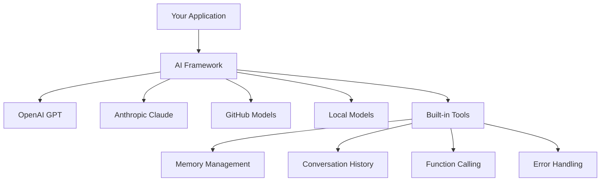
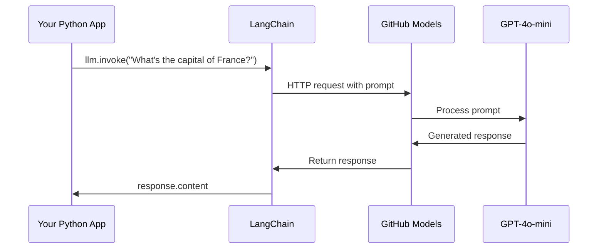
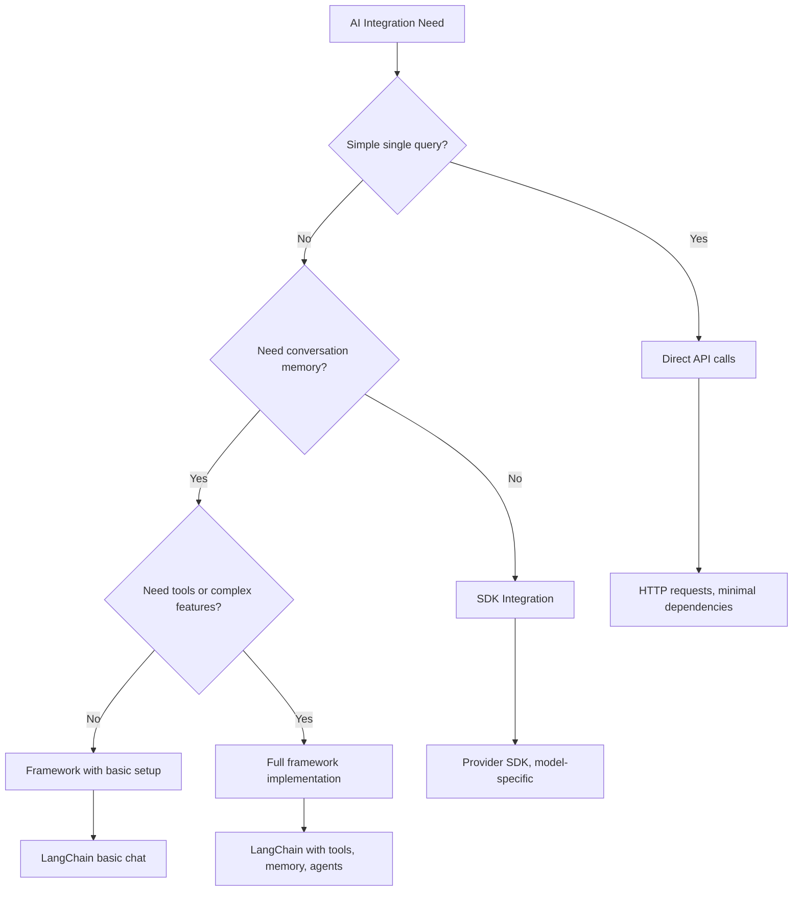

<!--
CO_OP_TRANSLATOR_METADATA:
{
  "original_hash": "e2c4ae5688e34b4b8b09d52aec56c79e",
  "translation_date": "2025-10-24T23:17:12+00:00",
  "source_file": "10-ai-framework-project/README.md",
  "language_code": "sr"
}
-->
# AI оквир

Да ли сте се икада осећали преплављено покушавајући да направите AI апликације од нуле? Нисте сами! AI оквири су као швајцарски нож за развој вештачке интелигенције - моћни алати који вам могу уштедети време и главобоље приликом креирања интелигентних апликација. Замислите AI оквир као добро организовану библиотеку: он пружа унапред направљене компоненте, стандардизоване API-је и паметне апстракције, тако да можете да се фокусирате на решавање проблема уместо на борбу са детаљима имплементације.

У овој лекцији ћемо истражити како оквири попут LangChain-а могу претворити некада сложене задатке интеграције AI-а у чист, читљив код. Открићете како да се носите са изазовима из стварног света, као што су праћење разговора, имплементација позивања алата и управљање различитим AI моделима кроз један уједињени интерфејс.

До краја лекције, знаћете када да се ослоните на оквире уместо на директне API позиве, како да ефикасно користите њихове апстракције и како да направите AI апликације спремне за употребу у стварном свету. Хајде да истражимо шта AI оквири могу да ураде за ваше пројекте.

## Зашто изабрати оквир?

Спремни сте да направите AI апликацију - супер! Али ево у чему је ствар: имате неколико различитих путева којима можете кренути, а сваки од њих има своје предности и мане. То је као да бирате између ходања, вожње бицикла или аутомобила да бисте стигли негде - сви ће вас довести до циља, али искуство (и напор) ће бити потпуно различити.

Хајде да разложимо три главна начина на која можете интегрисати AI у своје пројекте:

| Приступ | Предности | Најбоље за | Разматрања |
|---------|-----------|------------|-------------|
| **Директни HTTP захтеви** | Потпуна контрола, без зависности | Једноставни упити, учење основа | Више кода, ручно руковање грешкама |
| **SDK интеграција** | Мање шаблонског кода, оптимизација за специфичне моделе | Апликације са једним моделом | Ограничено на одређене провајдере |
| **AI оквири** | Уједињени API, уграђене апстракције | Апликације са више модела, сложени токови рада | Крива учења, потенцијална прекомерна апстракција |

### Предности оквира у пракси



**Зашто су оквири важни:**
- **Уједињују** више AI провајдера под једним интерфејсом
- **Аутоматски управљају** меморијом разговора
- **Пружају** готове алате за уобичајене задатке као што су уграђивање и позивање функција
- **Управљају** руковањем грешкама и логиком поновног покушаја
- **Претварају** сложене токове рада у читљиве методске позиве

> 💡 **Савет**: Користите оквире када прелазите између различитих AI модела или градите сложене функције као што су агенти, меморија или позивање алата. Држите се директних API-ја када учите основе или градите једноставне, фокусиране апликације.

**Закључак**: Као што бирате између специјализованих алата мајстора и комплетне радионице, све је у томе да алат прилагодите задатку. Оквири су одлични за сложене, богате функцијама апликације, док директни API-ји добро функционишу за једноставне случајеве употребе.

## Увод

У овој лекцији ћемо научити:

- Како користити уобичајени AI оквир.
- Како решити уобичајене проблеме као што су разговори, коришћење алата, меморија и контекст.
- Како искористити ово за изградњу AI апликација.

## Ваш први AI упит

Хајде да почнемо са основама тако што ћемо направити вашу прву AI апликацију која шаље питање и добија одговор. Као Архимед који открива принцип потиска у својој кади, понекад најједноставнија запажања воде до најмоћнијих увида - а оквири чине те увиде доступним.

### Постављање LangChain-а са GitHub моделима

Користићемо LangChain за повезивање са GitHub моделима, што је прилично супер јер вам пружа бесплатан приступ различитим AI моделима. Најбољи део? Потребно вам је само неколико једноставних параметара конфигурације да бисте започели:

```python
from langchain_openai import ChatOpenAI
import os

llm = ChatOpenAI(
    api_key=os.environ["GITHUB_TOKEN"],
    base_url="https://models.github.ai/inference",
    model="openai/gpt-4o-mini",
)

# Send a simple prompt
response = llm.invoke("What's the capital of France?")
print(response.content)
```

**Хајде да разложимо шта се овде дешава:**
- **Креира** LangChain клијента користећи `ChatOpenAI` класу - ово је ваш портал ка AI-у!
- **Конфигурише** везу са GitHub моделима уз ваш аутентификациони токен
- **Одређује** који AI модел да се користи (`gpt-4o-mini`) - замислите ово као избор вашег AI асистента
- **Шаље** ваше питање користећи `invoke()` метод - овде се дешава магија
- **Извлачи** и приказује одговор - и voilà, разговарате са AI-ом!

> 🔧 **Напомена о подешавању**: Ако користите GitHub Codespaces, имате среће - `GITHUB_TOKEN` је већ подешен за вас! Радите локално? Без бриге, само треба да направите лични приступни токен са одговарајућим дозволама.

**Очекивани излаз:**
```text
The capital of France is Paris.
```



## Изградња конверзационог AI-а

Први пример показује основе, али то је само једна размена - поставите питање, добијете одговор и то је то. У стварним апликацијама, желите да ваш AI памти о чему сте разговарали, као што су Ватсон и Холмс градили своје истраживачке разговоре током времена.

Овде LangChain постаје посебно користан. Он пружа различите типове порука који помажу у структуирању разговора и омогућавају вам да дате вашем AI-у личност. Градићете искуства у ћаскању која одржавају контекст и карактер.

### Разумевање типова порука

Замислите ове типове порука као различите "улоге" које учесници носе у разговору. LangChain користи различите класе порука да би пратио ко шта говори:

| Тип поруке | Сврха | Пример употребе |
|------------|-------|-----------------|
| `SystemMessage` | Дефинише личност и понашање AI-а | "Ви сте користан асистент за програмирање" |
| `HumanMessage` | Представља унос корисника | "Објасните како функције раде" |
| `AIMessage` | Чува одговоре AI-а | Претходни одговори AI-а у разговору |

### Креирање вашег првог разговора

Хајде да направимо разговор у којем наш AI преузима одређену улогу. Нека буде у улози капетана Пикарда - лика познатог по својој дипломатској мудрости и лидерству:

```python
messages = [
    SystemMessage(content="You are Captain Picard of the Starship Enterprise"),
    HumanMessage(content="Tell me about you"),
]
```

**Разлагање поставке разговора:**
- **Утврђује** улогу и личност AI-а кроз `SystemMessage`
- **Пружа** почетни упит корисника преко `HumanMessage`
- **Креира** основу за разговор у више корака

Цео код за овај пример изгледа овако:

```python
from langchain_core.messages import HumanMessage, SystemMessage
from langchain_openai import ChatOpenAI
import os

llm = ChatOpenAI(
    api_key=os.environ["GITHUB_TOKEN"],
    base_url="https://models.github.ai/inference",
    model="openai/gpt-4o-mini",
)

messages = [
    SystemMessage(content="You are Captain Picard of the Starship Enterprise"),
    HumanMessage(content="Tell me about you"),
]


# works
response  = llm.invoke(messages)
print(response.content)
```

Требало би да видите резултат сличан:

```text
I am Captain Jean-Luc Picard, the commanding officer of the USS Enterprise (NCC-1701-D), a starship in the United Federation of Planets. My primary mission is to explore new worlds, seek out new life and new civilizations, and boldly go where no one has gone before. 

I believe in the importance of diplomacy, reason, and the pursuit of knowledge. My crew is diverse and skilled, and we often face challenges that test our resolve, ethics, and ingenuity. Throughout my career, I have encountered numerous species, grappled with complex moral dilemmas, and have consistently sought peaceful solutions to conflicts.

I hold the ideals of the Federation close to my heart, believing in the importance of cooperation, understanding, and respect for all sentient beings. My experiences have shaped my leadership style, and I strive to be a thoughtful and just captain. How may I assist you further?
```

Да бисте одржали континуитет разговора (уместо да ресетујете контекст сваки пут), потребно је да наставите да додајете одговоре на вашу листу порука. Као усмене традиције које су очувале приче кроз генерације, овај приступ гради трајну меморију:

```python
from langchain_core.messages import HumanMessage, SystemMessage
from langchain_openai import ChatOpenAI
import os

llm = ChatOpenAI(
    api_key=os.environ["GITHUB_TOKEN"],
    base_url="https://models.github.ai/inference",
    model="openai/gpt-4o-mini",
)

messages = [
    SystemMessage(content="You are Captain Picard of the Starship Enterprise"),
    HumanMessage(content="Tell me about you"),
]


# works
response  = llm.invoke(messages)

print(response.content)

print("---- Next ----")

messages.append(response)
messages.append(HumanMessage(content="Now that I know about you, I'm Chris, can I be in your crew?"))

response  = llm.invoke(messages)

print(response.content)

```

Прилично занимљиво, зар не? Оно што се овде дешава је да два пута позивамо LLM - прво само са наша два почетна порука, а затим поново са целокупном историјом разговора. То је као да AI заправо прати наш разговор!

Када покренете овај код, добићете други одговор који звучи отприлике овако:

```text
Welcome aboard, Chris! It's always a pleasure to meet those who share a passion for exploration and discovery. While I cannot formally offer you a position on the Enterprise right now, I encourage you to pursue your aspirations. We are always in need of talented individuals with diverse skills and backgrounds. 

If you are interested in space exploration, consider education and training in the sciences, engineering, or diplomacy. The values of curiosity, resilience, and teamwork are crucial in Starfleet. Should you ever find yourself on a starship, remember to uphold the principles of the Federation: peace, understanding, and respect for all beings. Your journey can lead you to remarkable adventures, whether in the stars or on the ground. Engage!
```

Узећу то као можда ;)

## Стримовање одговора

Да ли сте икада приметили како ChatGPT изгледа као да "куца" своје одговоре у реалном времену? То је стримовање у акцији. Као да гледате вештог калиграфа како ради - видите како се слова појављују потез по потез уместо да се одједном материјализују - стримовање чини интеракцију природнијом и пружа тренутне повратне информације.

### Имплементација стримовања са LangChain-ом

```python
from langchain_openai import ChatOpenAI
import os

llm = ChatOpenAI(
    api_key=os.environ["GITHUB_TOKEN"],
    base_url="https://models.github.ai/inference",
    model="openai/gpt-4o-mini",
    streaming=True
)

# Stream the response
for chunk in llm.stream("Write a short story about a robot learning to code"):
    print(chunk.content, end="", flush=True)
```

**Зашто је стримовање одлично:**
- **Приказује** садржај док се креира - више нема непријатног чекања!
- **Чини** да корисници осећају да се нешто заиста дешава
- **Делује** брже, чак и када технички није
- **Омогућава** корисницима да почну да читају док AI још "размишља"

> 💡 **Савет за корисничко искуство**: Стримовање заиста блиста када се бавите дужим одговорима као што су објашњења кода, креативно писање или детаљни туторијали. Ваши корисници ће волети да виде напредак уместо да зуре у празан екран!

## Шаблони упита

Шаблони упита функционишу као реторичке структуре које се користе у класичном беседништву - размислите о томе како би Цицерон прилагодио своје говорне обрасце за различиту публику, истовремено задржавајући исту убедљиву основу. Они вам омогућавају да креирате поновљиве упите где можете заменити различите делове информација без поновног писања свега од почетка. Када поставите шаблон, само попуните променљиве са потребним вредностима.

### Креирање поновљивих упита

```python
from langchain_core.prompts import ChatPromptTemplate

# Define a template for code explanations
template = ChatPromptTemplate.from_messages([
    ("system", "You are an expert programming instructor. Explain concepts clearly with examples."),
    ("human", "Explain {concept} in {language} with a practical example for {skill_level} developers")
])

# Use the template with different values
questions = [
    {"concept": "functions", "language": "JavaScript", "skill_level": "beginner"},
    {"concept": "classes", "language": "Python", "skill_level": "intermediate"},
    {"concept": "async/await", "language": "JavaScript", "skill_level": "advanced"}
]

for question in questions:
    prompt = template.format_messages(**question)
    response = llm.invoke(prompt)
    print(f"Topic: {question['concept']}\n{response.content}\n---\n")
```

**Зашто ћете волети коришћење шаблона:**
- **Одржава** ваше упите конзистентним кроз целу апликацију
- **Нема више** неуредног спајања стрингова - само чисте, једноставне променљиве
- **Ваш AI** се понаша предвидљиво јер структура остаје иста
- **Ажурирања** су лака - промените шаблон једном и он је исправљен свуда

## Структурисани излаз

Да ли вас икада фрустрира покушај да анализирате AI одговоре који се враћају као неструктурисан текст? Структурисани излаз је као да учите ваш AI да следи систематски приступ који је Линејус користио за биолошку класификацију - организован, предвидљив и лак за рад. Можете захтевати JSON, специфичне структуре података или било који формат који вам је потребан.

### Дефинисање шема излаза

```python
from langchain_core.prompts import ChatPromptTemplate
from langchain_core.output_parsers import JsonOutputParser
from pydantic import BaseModel, Field

class CodeReview(BaseModel):
    score: int = Field(description="Code quality score from 1-10")
    strengths: list[str] = Field(description="List of code strengths")
    improvements: list[str] = Field(description="List of suggested improvements")
    overall_feedback: str = Field(description="Summary feedback")

# Set up the parser
parser = JsonOutputParser(pydantic_object=CodeReview)

# Create prompt with format instructions
prompt = ChatPromptTemplate.from_messages([
    ("system", "You are a code reviewer. {format_instructions}"),
    ("human", "Review this code: {code}")
])

# Format the prompt with instructions
chain = prompt | llm | parser

# Get structured response
code_sample = """
def calculate_average(numbers):
    return sum(numbers) / len(numbers)
"""

result = chain.invoke({
    "code": code_sample,
    "format_instructions": parser.get_format_instructions()
})

print(f"Score: {result['score']}")
print(f"Strengths: {', '.join(result['strengths'])}")
```

**Зашто је структурисани излаз револуционаран:**
- **Нема више** нагађања у ком формату ће се вратити - увек је конзистентан
- **Директно се повезује** са вашим базама података и API-јима без додатног рада
- **Открива** чудне AI одговоре пре него што покваре вашу апликацију
- **Чини** ваш код чистијим јер тачно знате са чим радите

## Позивање алата

Сада долазимо до једне од најмоћнијих функција: алати. Овако дајете вашем AI-у практичне могућности изван разговора. Као што су средњовековни еснафи развијали специјализоване алате за одређене занате, можете опремити ваш AI фокусираним инструментима. Описујете који су алати доступни, и када неко затражи нешто што одговара, ваш AI може предузети акцију.

### Коришћење Python-а

Хајде да додамо неке алате овако:

```python
from typing_extensions import Annotated, TypedDict

class add(TypedDict):
    """Add two integers."""

    # Annotations must have the type and can optionally include a default value and description (in that order).
    a: Annotated[int, ..., "First integer"]
    b: Annotated[int, ..., "Second integer"]

tools = [add]

functions = {
    "add": lambda a, b: a + b
}
```

Шта се овде дешава? Креирамо план за алат који се зове `add`. Наслеђивањем из `TypedDict` и коришћењем тих напредних `Annotated` типова за `a` и `b`, дајемо LLM-у јасну слику о томе шта овај алат ради и шта му је потребно. `functions` речник је као наш алатник - он говори нашем коду тачно шта да ради када AI одлучи да користи одређени алат.

Хајде да видимо како позивамо LLM са овим алатом:

```python
llm = ChatOpenAI(
    api_key=os.environ["GITHUB_TOKEN"],
    base_url="https://models.github.ai/inference",
    model="openai/gpt-4o-mini",
)

llm_with_tools = llm.bind_tools(tools)
```

Овде позивамо `bind_tools` са нашим низом `tools`, и на тај начин LLM `llm_with_tools` сада има знање о овом алату.

Да бисмо користили овај нови LLM, можемо написати следећи код:

```python
query = "What is 3 + 12?"

res = llm_with_tools.invoke(query)
if(res.tool_calls):
    for tool in res.tool_calls:
        print("TOOL CALL: ", functions[tool["name"]](../../../10-ai-framework-project/**tool["args"]))
print("CONTENT: ",res.content)
```

Сада када позовемо `invoke` на овом новом LLM-у, који има алате, можда ће својство `tool_calls` бити попуњено. Ако је тако, било који идентификовани алат има својство `name` и `args` које идентификује који алат треба позвати и са којим аргументима. Цео код изгледа овако:

```python
from langchain_core.messages import HumanMessage, SystemMessage
from langchain_openai import ChatOpenAI
import os
from typing_extensions import Annotated, TypedDict

class add(TypedDict):
    """Add two integers."""

    # Annotations must have the type and can optionally include a default value and description (in that order).
    a: Annotated[int, ..., "First integer"]
    b: Annotated[int, ..., "Second integer"]

tools = [add]

functions = {
    "add": lambda a, b: a + b
}

llm = ChatOpenAI(
    api_key=os.environ["GITHUB_TOKEN"],
    base_url="https://models.github.ai/inference",
    model="openai/gpt-4o-mini",
)

llm_with_tools = llm.bind_tools(tools)

query = "What is 3 + 12?"

res = llm_with_tools.invoke(query)
if(res.tool_calls):
    for tool in res.tool_calls:
        print("TOOL CALL: ", functions[tool["name"]](../../../10-ai-framework-project/**tool["args"]))
print("CONTENT: ",res.content)
```

Када покренете овај код, требало би да видите излаз сличан:

```text
TOOL CALL:  15
CONTENT: 
```

AI је анализирао "Шта је 3 + 12" и препознао ово као задатак за алат `add`. Као што вешт библиотекар зна коју референцу да консултује на основу типа постављеног питања, AI је то одредио на основу имена алата, описа и спецификација поља. Резултат од 15 долази из нашег `functions` речника који извршава алат:

```python
print("TOOL CALL: ", functions[tool["name"]](../../../10-ai-framework-project/**tool["args"]))
```

### Занимљивији алат који позива веб API

Сабирање бројева демонстрира концепт, али прави алати обично обављају сложеније операције, као што је позивање веб API-ја. Хајде да проширимо наш пример тако да AI преузима садржај са интернета - слично како су телеграфски оператери некада повезивали удаљене локације:

```python
class joke(TypedDict):
    """Tell a joke."""

    # Annotations must have the type and can optionally include a default value and description (in that order).
    category: Annotated[str, ..., "The joke category"]

def get_joke(category: str) -> str:
    response = requests.get(f"https://api.chucknorris.io/jokes/random?category={category}", headers={"Accept": "application/json"})
    if response.status_code == 200:
        return response.json().get("value", f"Here's a {category} joke!")
    return f"Here's a {category} joke!"

functions = {
    "add": lambda a, b: a + b,
    "joke": lambda category: get_joke(category)
}

query = "Tell me a joke about animals"

# the rest of the code is the same
```

Сада, ако покренете овај код, добићете одговор који изгледа отприлике овако:

```text
TOOL CALL:  Chuck Norris once rode a nine foot grizzly bear through an automatic car wash, instead of taking a shower.
CONTENT:  
```

Ево кода у целости:

```python
from langchain_openai import ChatOpenAI
import requests
import os
from typing_extensions import Annotated, TypedDict

class add(TypedDict):
    """Add two integers."""

    # Annotations must have the type and can optionally include a default value and description (in that order).
    a: Annotated[int, ..., "First integer"]
    b: Annotated[int, ..., "Second integer"]

class joke(TypedDict):
    """Tell a joke."""

    # Annotations must have the type and can optionally include a default value and description (in that order).
    category: Annotated[str, ..., "The joke category"]

tools = [add, joke]

def get_joke(category: str) -> str:
    response = requests.get(f"https://api.chucknorris.io/jokes/random?category={category}", headers={"Accept": "application/json"})
    if response.status_code == 200:
        return response.json().get("value", f"Here's a {category} joke!")
    return f"Here's a {category} joke!"

functions = {
    "add": lambda a, b: a + b,
    "joke": lambda category: get_joke(category)
}

llm = ChatOpenAI(
    api_key=os.environ["GITHUB_TOKEN"],
    base_url="https://models.github.ai/inference",
    model="openai/gpt-4o-mini",
)

llm_with_tools = llm.bind_tools(tools)

query = "Tell me a joke about animals"

res = llm_with_tools.invoke(query)
if(res.tool_calls):
    for tool in res.tool_calls:
        # print("TOOL CALL: ", tool)
        print("TOOL CALL: ", functions[tool["name"]](../../../10-ai-framework-project/**tool["args"]))
print("CONTENT: ",res.content)
```

## Уграђивање и обрада докумената

Уграђивање представља једно од најелегантнијих решења у модерном AI-у. Замислите да можете узети било који део текста и претворити га у нумеричке координате које одражавају његово значење. То је управо оно што уграђивање ради - трансформише текст у тачке у вишедимензионалном простору где се слични концепти групишу. То је као да имате координатни систем за идеје, слично како је Мендељејев организовао периодни систем према атомским својствима.

### К
3. **Персонализовано учење**: Користите системске поруке за прилагођавање одговора различитим нивоима вештина  
4. **Форматирање одговора**: Примените структурисан излаз за питања у квизу  

### Кораци имплементације  

**Корак 1: Подесите своје окружење**  
```bash
pip install langchain langchain-openai
```
  
**Корак 2: Основна функционалност ћаскања**  
- Направите класу `StudyAssistant`  
- Имплементирајте меморију разговора  
- Додајте конфигурацију личности за образовну подршку  

**Корак 3: Додајте образовне алате**  
- **Објашњавач кода**: Разлаже код на разумљиве делове  
- **Генератор квизова**: Креира питања о концептима програмирања  
- **Праћење напретка**: Прати теме које су обрађене  

**Корак 4: Напредне функције (опционо)**  
- Имплементирајте стримовање одговора за боље корисничко искуство  
- Додајте учитавање докумената за укључивање материјала курса  
- Направите ембединг за преузимање садржаја на основу сличности  

### Критеријуми за евалуацију  

| Карактеристика | Одлично (4) | Добро (3) | Задовољавајуће (2) | Потребан рад (1) |  
|----------------|-------------|-----------|--------------------|------------------|  
| **Ток разговора** | Природни, контекстуални одговори | Добро задржавање контекста | Основни разговор | Нема меморије између размена |  
| **Интеграција алата** | Више корисних алата који беспрекорно раде | 2+ алата правилно имплементирана | 1-2 основна алата | Алати не функционишу |  
| **Квалитет кода** | Чист, добро документован, обрада грешака | Добра структура, нека документација | Основна функционалност ради | Лоша структура, без обраде грешака |  
| **Образовна вредност** | Заиста корисно за учење, прилагодљиво | Добра подршка за учење | Основна објашњења | Ограничена образовна корист |  

### Пример структуре кода  

```python
class StudyAssistant:
    def __init__(self, skill_level="beginner"):
        # Initialize LLM, tools, and conversation memory
        pass
    
    def explain_code(self, code, language):
        # Tool: Explain how code works
        pass
    
    def generate_quiz(self, topic, difficulty):
        # Tool: Create practice questions
        pass
    
    def chat(self, user_input):
        # Main conversation interface
        pass

# Example usage
assistant = StudyAssistant(skill_level="intermediate")
response = assistant.chat("Explain how Python functions work")
```
  
**Додатни изазови:**  
- Додајте могућности уноса/излаза гласа  
- Имплементирајте веб интерфејс користећи Streamlit или Flask  
- Направите базу знања из материјала курса користећи ембединг  
- Додајте праћење напретка и персонализоване путеве учења  

## Резиме  

🎉 Сада сте савладали основе развоја AI оквира и научили како да направите софистициране AI апликације користећи LangChain. Као да сте завршили свеобухватно приправништво, стекли сте значајан сет вештина. Хајде да прегледамо шта сте постигли.  

### Шта сте научили  

**Основни концепти оквира:**  
- **Предности оквира**: Разумевање када изабрати оквире уместо директних API позива  
- **Основе LangChain-а**: Подешавање и конфигурисање AI модела  
- **Типови порука**: Коришћење `SystemMessage`, `HumanMessage` и `AIMessage` за структурисане разговоре  

**Напредне функције:**  
- **Позивање алата**: Креирање и интеграција прилагођених алата за побољшане AI могућности  
- **Меморија разговора**: Одржавање контекста током више размена у разговору  
- **Стримовање одговора**: Имплементација испоруке одговора у реалном времену  
- **Шаблони упита**: Изградња поновљивих, динамичких упита  
- **Структурисан излаз**: Обезбеђивање конзистентних, парсабилних AI одговора  
- **Ембединг**: Креирање семантичког претраживања и обраде докумената  

**Практичне примене:**  
- **Изградња комплетних апликација**: Комбиновање више функција у апликације спремне за производњу  
- **Обрада грешака**: Имплементација робусног управљања грешкама и валидације  
- **Интеграција алата**: Креирање прилагођених алата који проширују AI могућности  

### Кључни закључци  

> 🎯 **Запамтите**: AI оквири као што је LangChain су у суштини ваши пријатељи који скривају сложеност и пуни су функција. Савршени су када вам је потребна меморија разговора, позивање алата или желите да радите са више AI модела без губљења разума.  

**Оквир за доношење одлука за AI интеграцију:**  


  
### Шта даље?  

**Почните да градите одмах:**  
- Узмите ове концепте и направите нешто што вас узбуђује!  
- Играјте се са различитим AI моделима кроз LangChain - то је као игралиште за AI моделе  
- Креирајте алате који решавају стварне проблеме са којима се суочавате у раду или пројектима  

**Спремни за следећи ниво?**  
- **AI агенти**: Направите AI системе који могу заправо планирати и извршавати сложене задатке сами  
- **RAG (Генерација уз помоћ претраживања)**: Комбинујте AI са сопственим базама знања за супермоћне апликације  
- **Мултимодални AI**: Радите са текстом, сликама и звуком заједно - могућности су бескрајне!  
- **Продукцијско распоређивање**: Научите како да скалирате своје AI апликације и пратите их у стварном свету  

**Придружите се заједници:**  
- LangChain заједница је фантастична за праћење новитета и учење најбољих пракси  
- GitHub Models вам пружа приступ најсавременијим AI могућностима - савршено за експериментисање  
- Наставите да вежбате са различитим случајевима употребе - сваки пројекат ће вас научити нечему новом  

Сада имате знање да направите интелигентне, конверзацијске апликације које могу помоћи људима да реше стварне проблеме. Као ренесансни мајстори који су комбиновали уметничку визију са техничком вештином, сада можете спојити AI могућности са практичном применом. Питање је: шта ћете створити? 🚀  

## Изазов GitHub Copilot Agent 🚀  

Користите Agent мод да завршите следећи изазов:  

**Опис:** Направите напредног AI асистента за ревизију кода који комбинује више LangChain функција, укључујући позивање алата, структурисан излаз и меморију разговора, како би пружио свеобухватне повратне информације о поднетом коду.  

**Упутство:** Направите класу CodeReviewAssistant која имплементира:  
1. Алат за анализу сложености кода и предлагање побољшања  
2. Алат за проверу кода у односу на најбоље праксе  
3. Структурисан излаз користећи Pydantic моделе за конзистентан формат ревизије  
4. Меморију разговора за праћење сесија ревизије  
5. Главни интерфејс за ћаскање који може обрађивати поднети код и пружати детаљне, акционе повратне информације  

Асистент би требало да буде у стању да прегледа код на више програмских језика, одржава контекст током више поднетих кодова у једној сесији и пружа и резиме оцене и детаљне предлоге за побољшање.  

Сазнајте више о [agent mode](https://code.visualstudio.com/blogs/2025/02/24/introducing-copilot-agent-mode) овде.  

---

**Одрицање од одговорности**:  
Овај документ је преведен помоћу услуге за превођење вештачке интелигенције [Co-op Translator](https://github.com/Azure/co-op-translator). Иако настојимо да обезбедимо тачност, молимо вас да имате у виду да аутоматски преводи могу садржати грешке или нетачности. Оригинални документ на његовом изворном језику треба сматрати ауторитативним извором. За критичне информације препоручује се професионални превод од стране људи. Не преузимамо одговорност за било каква погрешна тумачења или неспоразуме који могу настати услед коришћења овог превода.