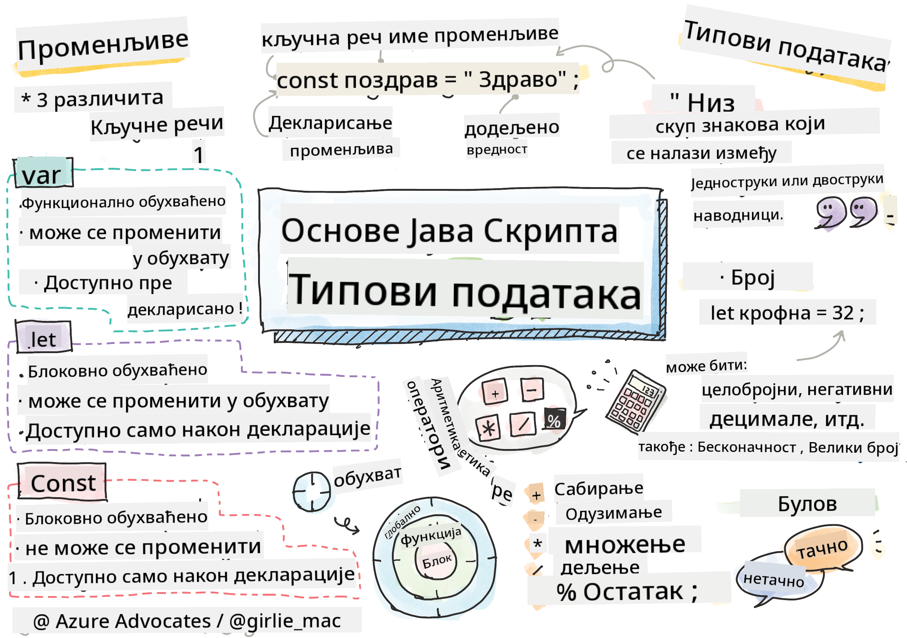

<!--
CO_OP_TRANSLATOR_METADATA:
{
  "original_hash": "fc6aef8ecfdd5b0ad2afa6e6ba52bfde",
  "translation_date": "2025-08-28T10:21:02+00:00",
  "source_file": "2-js-basics/1-data-types/README.md",
  "language_code": "sr"
}
-->
# Основе JavaScript-а: Типови података

  
> Скетч од [Tomomi Imura](https://twitter.com/girlie_mac)

## Квиз пре предавања  
[Квиз пре предавања](https://ashy-river-0debb7803.1.azurestaticapps.net/quiz/7)

Ова лекција покрива основе JavaScript-а, језика који омогућава интерактивност на вебу.

> Ову лекцију можете проћи на [Microsoft Learn](https://docs.microsoft.com/learn/modules/web-development-101-variables/?WT.mc_id=academic-77807-sagibbon)!

[](https://youtube.com/watch?v=JNIXfGiDWM8 "Променљиве у JavaScript-у")

[](https://youtube.com/watch?v=AWfA95eLdq8 "Типови података у JavaScript-у")

> 🎥 Кликните на слике изнад за видео снимке о променљивама и типовима података

Хајде да почнемо са променљивама и типовима података који их попуњавају!

## Променљиве

Променљиве чувају вредности које могу бити коришћене и мењане у вашем коду.

Креирање и **декларисање** променљиве има следећу синтаксу **[кључна реч] [име]**. Састоји се од два дела:

- **Кључна реч**. Кључне речи могу бити `let` или `var`.  

✅ Кључна реч `let` је уведена у ES6 и даје вашој променљивој такозвани _блоковски домет_. Препоручује се да користите `let` уместо `var`. Блоковске домете ћемо детаљније обрадити у наредним деловима.  
- **Име променљиве**, које сами бирате.

### Задатак - рад са променљивама

1. **Декларишите променљиву**. Декларишите променљиву користећи кључну реч `let`:

    ```javascript
    let myVariable;
    ```

   `myVariable` је сада декларисана помоћу кључне речи `let`. Тренутно нема вредност.

1. **Доделите вредност**. Сачувајте вредност у променљивој помоћу оператора `=`, праћеног очекиваном вредношћу.

    ```javascript
    myVariable = 123;
    ```

   > Напомена: употреба `=` у овој лекцији означава "оператор доделе", који се користи за постављање вредности променљивој. Не означава једнакост.

   `myVariable` је сада *иницијализована* са вредношћу 123.

1. **Рефакторишите**. Замените свој код следећом изјавом.

    ```javascript
    let myVariable = 123;
    ```

    Ово се назива _експлицитна иницијализација_, када је променљива декларисана и истовремено јој је додељена вредност.

1. **Промените вредност променљиве**. Промените вредност променљиве на следећи начин:

   ```javascript
   myVariable = 321;
   ```

   Када је променљива декларисана, можете променити њену вредност у било ком тренутку у вашем коду помоћу оператора `=` и нове вредности.

   ✅ Пробајте! Можете писати JavaScript директно у вашем претраживачу. Отворите прозор претраживача и идите на Developer Tools. У конзоли ћете пронаћи упит; укуцајте `let myVariable = 123`, притисните Enter, а затим укуцајте `myVariable`. Шта се дешава? Напомена: више о овим концептима ћете научити у наредним лекцијама.

## Константе

Декларација и иницијализација константе прати исте концепте као и променљива, са изузетком кључне речи `const`. Константе се обично декларишу великим словима.

```javascript
const MY_VARIABLE = 123;
```

Константе су сличне променљивама, са два изузетка:

- **Морају имати вредност**. Константе морају бити иницијализоване, иначе ће доћи до грешке приликом извршавања кода.
- **Референца не може бити промењена**. Референца константе не може бити промењена након иницијализације, иначе ће доћи до грешке приликом извршавања кода. Погледајмо два примера:
   - **Једноставна вредност**. Следеће НИЈЕ дозвољено:
   
      ```javascript
      const PI = 3;
      PI = 4; // not allowed
      ```
 
   - **Референца објекта је заштићена**. Следеће НИЈЕ дозвољено.
   
      ```javascript
      const obj = { a: 3 };
      obj = { b: 5 } // not allowed
      ```

    - **Вредност објекта није заштићена**. Следеће ЈЕ дозвољено:
    
      ```javascript
      const obj = { a: 3 };
      obj.a = 5;  // allowed
      ```

      Овде мењате вредност објекта, али не и саму референцу, што је дозвољено.

   > Напомена: `const` значи да је референца заштићена од поновног додељивања. Међутим, вредност није _непроменљива_ и може се мењати, посебно ако је у питању сложена структура попут објекта.

## Типови података

Променљиве могу чувати различите типове вредности, попут бројева и текста. Ови различити типови вредности познати су као **типови података**. Типови података су важан део развоја софтвера јер помажу програмерима да одлуче како код треба да буде написан и како софтвер треба да ради. Поред тога, неки типови података имају јединствене карактеристике које помажу у трансформацији или извлачењу додатних информација из вредности.

✅ Типови података се такође називају JavaScript примитивама, јер су то најосновнији типови података које језик пружа. Постоји 7 примитивних типова података: string, number, bigint, boolean, undefined, null и symbol. Одвојите минут да визуализујете шта свака од ових примитива може представљати. Шта је `zebra`? А `0`? `true`?

### Бројеви

У претходном одељку, вредност `myVariable` била је бројевни тип података.

`let myVariable = 123;`

Променљиве могу чувати све врсте бројева, укључујући децималне или негативне бројеве. Бројеви се такође могу користити са аритметичким операторима, који ће бити обрађени у [следећем одељку](../../../../2-js-basics/1-data-types).

### Аритметички оператори

Постоји неколико врста оператора за извођење аритметичких функција, а неки од њих су наведени овде:

| Симбол | Опис                                                                    | Пример                          |
| ------ | ----------------------------------------------------------------------- | -------------------------------- |
| `+`    | **Сабирање**: Израчунава збир два броја                                 | `1 + 2 //очекивани одговор је 3` |
| `-`    | **Одузимање**: Израчунава разлику два броја                             | `1 - 2 //очекивани одговор је -1` |
| `*`    | **Множење**: Израчунава производ два броја                              | `1 * 2 //очекивани одговор је 2` |
| `/`    | **Дељење**: Израчунава количник два броја                               | `1 / 2 //очекивани одговор је 0.5` |
| `%`    | **Остатак**: Израчунава остатак од дељења два броја                     | `1 % 2 //очекивани одговор је 1` |

✅ Пробајте! Испробајте неку аритметичку операцију у конзоли вашег претраживача. Да ли вас резултати изненађују?

### Ниске (Strings)

Ниске су низови карактера који се налазе између једноструких или двоструких наводника.

- `'Ово је ниска'`
- `"Ово је такође ниска"`
- `let myString = 'Ово је вредност ниске сачувана у променљивој';`

Запамтите да користите наводнике када пишете ниску, иначе ће JavaScript претпоставити да је у питању име променљиве.

### Форматирање ниски

Ниске су текстуалне и понекад ће захтевати форматирање.

Да бисте **конкатенисали** две или више ниски, односно спојили их, користите оператор `+`.

```javascript
let myString1 = "Hello";
let myString2 = "World";

myString1 + myString2 + "!"; //HelloWorld!
myString1 + " " + myString2 + "!"; //Hello World!
myString1 + ", " + myString2 + "!"; //Hello, World!

```

✅ Зашто је `1 + 1 = 2` у JavaScript-у, али `'1' + '1' = 11?` Размислите о томе. Шта је са `'1' + 1`?

**Шаблонске ниске** су још један начин за форматирање ниски, осим што се уместо наводника користи обрнути апостроф. Све што није обичан текст мора бити смештено у ознаке `${ }`. Ово укључује све променљиве које могу бити ниске.

```javascript
let myString1 = "Hello";
let myString2 = "World";

`${myString1} ${myString2}!` //Hello World!
`${myString1}, ${myString2}!` //Hello, World!
```

Можете постићи своје циљеве форматирања било којим методом, али шаблонске ниске ће поштовати све размаке и преломе линија.

✅ Када бисте користили шаблонску ниску уместо обичне ниске?

### Булови (Booleans)

Булови могу имати само две вредности: `true` или `false`. Булови могу помоћи у доношењу одлука о томе који редови кода треба да се изврше када су одређени услови испуњени. У многим случајевима, [оператори](../../../../2-js-basics/1-data-types) помажу у постављању вредности булова, и често ћете приметити и писати променљиве које се иницијализују или чије се вредности ажурирају помоћу оператора.

- `let myTrueBool = true`
- `let myFalseBool = false`

✅ Променљива се може сматрати 'истинитом' ако се процени као булова вредност `true`. Интересантно је да су у JavaScript-у [све вредности истините осим ако нису дефинисане као лажне](https://developer.mozilla.org/docs/Glossary/Truthy).

---

## 🚀 Изазов

JavaScript је познат по својим изненађујућим начинима руковања типовима података у одређеним ситуацијама. Истражите мало о овим 'замкама'. На пример: осетљивост на велика и мала слова може вас изненадити! Пробајте ово у вашој конзоли: `let age = 1; let Age = 2; age == Age` (резултат је `false` -- зашто?). Које друге замке можете пронаћи?

## Квиз након предавања  
[Квиз након предавања](https://ashy-river-0debb7803.1.azurestaticapps.net/quiz/8)

## Преглед и самостално учење

Погледајте [ову листу JavaScript вежби](https://css-tricks.com/snippets/javascript/) и испробајте једну. Шта сте научили?

## Задатак

[Вежбање типова података](assignment.md)

---

**Одрицање од одговорности**:  
Овај документ је преведен коришћењем услуге за превођење помоћу вештачке интелигенције [Co-op Translator](https://github.com/Azure/co-op-translator). Иако настојимо да обезбедимо тачност, молимо вас да имате у виду да аутоматски преводи могу садржати грешке или нетачности. Оригинални документ на његовом изворном језику треба сматрати ауторитативним извором. За критичне информације препоручује се професионални превод од стране људи. Не преузимамо одговорност за било каква погрешна тумачења или неспоразуме који могу настати услед коришћења овог превода.