# Основе ЈаваСкрипта: Типови података

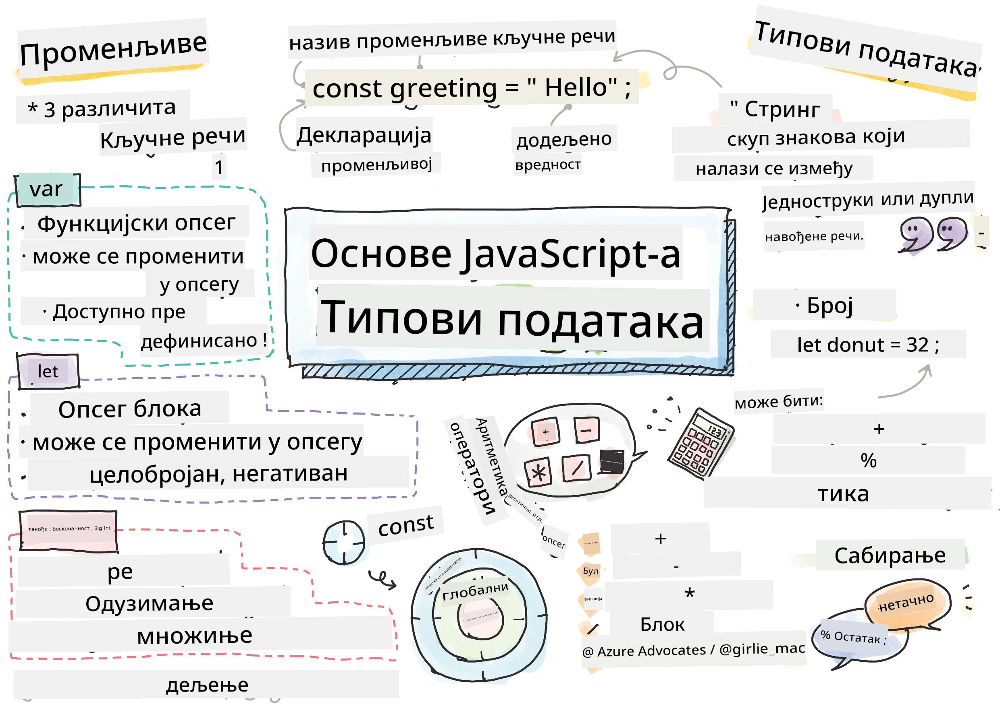
> Скетчнот од [Томоми Имура](https://twitter.com/girlie_mac)

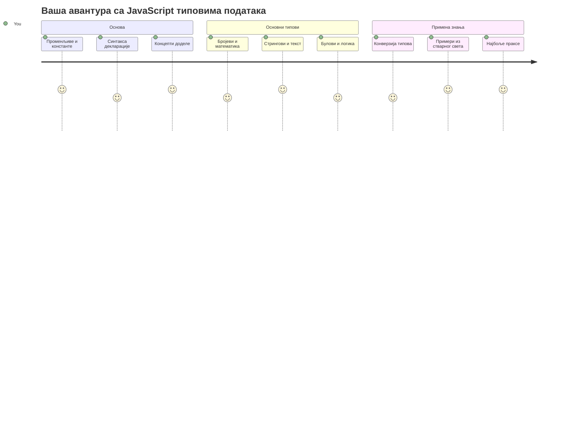
Типови података су један од основних концепата у ЈаваСкрипту који ћете сретати у сваком програму који напишете. Замислите типове података као систем архивирања који су користили древни библиотекари у Александрији – имали су одређена места за свитке који садрже поезију, математику и историјске записе. ЈаваСкрипт организаује информације на сличан начин са различитим категоријама за различите врсте података.

У овом часу истражићемо основне типове података који чине ЈаваСкрипт функционалним. Научићете како да радите са бројевима, текстом, тачним/нетачним вредностима, и разумете зашто је одабир исправног типа кључан за ваше програме. Ови концепти могу изгледати апстрактно на почетку, али са вежбом постаће вам други природа.

Разумевање типова података учиниће све остало у ЈаваСкрипту много јаснијим. Баш као што архитекте морају разумети различите грађевинске материјале пре него што подигну катедралу, ови основи ће подупрети све што сте у будућности изградили.

## Пре-предавачки квиз
[Прe-квиз](https://ff-quizzes.netlify.app/web/)

Овај час покрива основе ЈаваСкрипта, језика који омогућава интерактивност на вебу.

> Можете проћи овај час на [Microsoft Learn](https://docs.microsoft.com/learn/modules/web-development-101-variables/?WT.mc_id=academic-77807-sagibbon)!

[](https://youtube.com/watch?v=JNIXfGiDWM8 "Перемљиве у ЈаваСкрипту")

[](https://youtube.com/watch?v=AWfA95eLdq8 "Типови података у ЈаваСкрипту")

> 🎥 Кликните на слике горе за видео записе о променљивим и типовима података

Хајде да почнемо са променљивима и типовима података који их попуњавају!

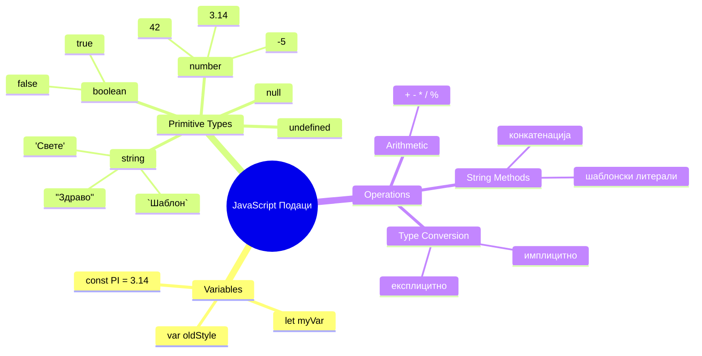
## Променљиве

Променљиве су основни грађевни блокови у програмирању. Као што су средњовековни алхемичари користили тегле са етикетама за чување различитих супстанци, променљиве вам омогућавају да сачувате информацију и дате јој описно име како бисте могли касније да се позовете на њу. Потребно вам је да запамтите нечију старост? Сачувајте је у променљивој званој `age`. Желите да пратите име корисника? Чувајте га у променљивој званој `userName`.

Фокусираћемо се на модеран приступ креирању променљивих у ЈаваСкрипту. Технике које ћете овде научити представљају годинама развоја језика и најбоље праксе развијене у програмерској заједници.

Креирање и **дефинисање** променљиве има следећу синтаксу **[кључна реч] [име]**. Састоји се из два дела:

- **Кључна реч**. Користите `let` за променљиве које могу да се мењају, или `const` за вредности које остају непромењиве.
- **Име променљиве**, ово је описно име које сами бирају.

✅ Кључна реч `let` је уведена у ES6 и даје вашој променљивој такозвани _блокски опсег_. Препоручује се да користите `let` или `const` уместо старије кључне речи `var`. О блокским опсезима ћемо говорити детаљније у будућим деловима.

### Задатак - рад са променљивимa

1. **Дефинишите променљиву**. Почнимо са креирањем наше прве променљиве:

    ```javascript
    let myVariable;
    ```

   **Шта ово постиже:**
   - Ово говори ЈаваСкрипту да креира складиште под називом `myVariable`
   - ЈаваСкрипт резервише простор у меморији за ову променљиву
   - Променљива тренутно нема вредност (undefined)

2. **Додајте вредност**. Сада убацимо нешто у нашу променљиву:

    ```javascript
    myVariable = 123;
    ```

   **Како ради додела вредности:**
   - Оператор `=` додељује вредност 123 нашој променљивој
   - Променљива сада садржи ову вредност уместо undefined
   - Ову вредност можете користити у вашем коду помоћу `myVariable`

   > Напомена: употреба `=` у овом часу означава да користимо "оператор доделе," који се користи за постављање вредности променљивој. Не означава једнакост.

3. **Радите паметно**. Заправо, хајде да комбинујемо ова два корака:

    ```javascript
    let myVariable = 123;
    ```

    **Овај приступ је ефикаснији:**
    - Дефинишете променљиву и додељујете вредност у једном изразу
    - Ово је стандардна пракса међу програмерима
    - Смањује дужину кода уз очување јасноће

4. **Промените мишљење**. Шта ако желимо да сачувамо други број?

   ```javascript
   myVariable = 321;
   ```

   **Разумевање поновне доделе:**
   - Променљива сада садржи 321 уместо 123
   - Претходна вредност је замењена – променљиве у сваком тренутку чувају само једну вредност
   - Ова препознатљивост је кључна особина променљивих дефинисаних са `let`

   ✅ Испробајте! Можете писати ЈаваСкрипт директно у вашем прегледачу. Отворите прозор прегледача и идите у Developer Tools. У конзоли ћете наћи упит; укуцајте `let myVariable = 123`, притисните ентер, затим укуцајте `myVariable`. Шта се дешава? Запамтите, о овим концептима ћете научити више у наредним часовима.

### 🧠 **Провера владања променљивима: Доста сте се упознали**

**Погледајте како се осећате у вези са променљивимa:**
- Можете ли објаснити разлику између дефинисања и додељивања променљиве?
- Шта се дешава ако покушате да користите променљиву пре него што је дефинишете?
- Када бисте изабрали `let` уместо `const` за променљиву?

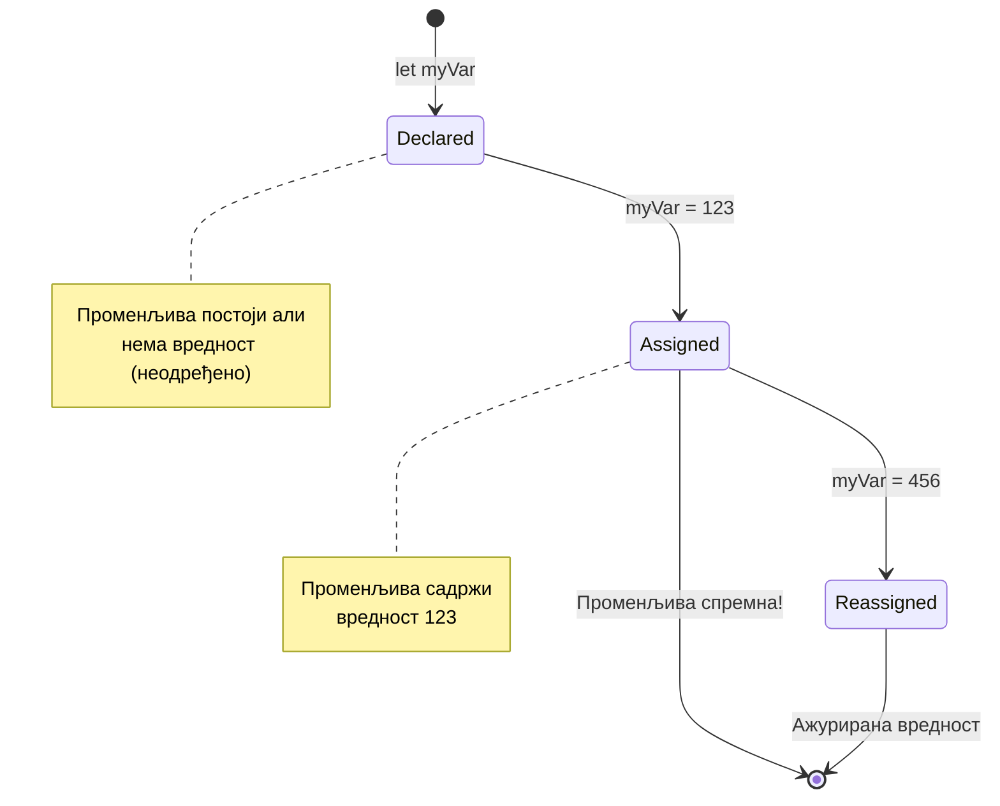
> **Брзи савет**: Замислите променљиве као означене кутије за складиштење. Креирате кутију (`let`), убацујете нешто у њу (`=`), и касније можете заменити садржај по потреби!

## Константе

Понекад морате сачувати информацију која никада не сме да се промени током извођења програма. Замислите константе као математичке принципе које је Евклид утврдио у старој Грчкој – кад се једном докажу и забележе, остају фиксни за сва наредна посматрања.

Константе раде слично као променљиве, али са важним ограничењем: када их једном доделите, вредност не може да се промени. Ова непроменљивост помаже у спречавању случајних модификација критичних вредности у вашем програму.

Декларација и иницијализација константе следи исте концепте као код променљиве, осим што се користи кључна реч `const`. Константе се обично декларишу великим словима.

```javascript
const MY_VARIABLE = 123;
```

**Ево шта овај код ради:**
- **Прави** константу под називом `MY_VARIABLE` са вредношћу 123
- **Користи** конвенцију писања великим словима за константе
- **Спречава** било какве будуће промене ове вредности

Константе имају два главна правила:

- **Морате им одмах дати вредност** – празне константе нису дозвољене!
- **Никада не можете променити ту вредност** – ЈаваСкрипт ће пријавити грешку ако покушате. Хајде да видимо шта то значи:

   **Једноставна вредност** - Ово НИЈЕ дозвољено:
   
      ```javascript
      const PI = 3;
      PI = 4; // није дозвољено
      ```

   **Шта треба да запамтите:**
   - **Покушаји** поновног додељивања константи изазваће грешку
   - **Штити** важне вредности од случајних промена
   - **Осигурава** да вредност остане конзистентна током целог програма
 
   **Референца на објекат је заштићена** - Ово НИЈЕ дозвољено:
   
      ```javascript
      const obj = { a: 3 };
      obj = { b: 5 } // није дозвољено
      ```

   **Разумевање ових концепата:**
   - **Спречава** замену целог објекта новим
   - **Штити** референцу на оригинални објекат
   - **Одржава** идентитет објекта у меморији

    **Вредност објекта није заштићена** - Ово ЈЕ дозвољено:
    
      ```javascript
      const obj = { a: 3 };
      obj.a = 5;  // дозвољено
      ```

      **Разлагање шта се дешава:**
      - **Модификује** вредност својства унутар објекта
      - **Чува** исту референцу на објекат
      - **Показује** да се садржај објекта може мењати док је референца константна

   > Напомена, `const` значи да је референца заштићена од поновне доделе. Вредност није _непроменљива_ и може се мењати, посебно ако је сложенији конструк као објекат.

## Типови података

ЈаваСкрипт организује информације у различите категорије које зовемо типови података. Овај концепт подсећа на начин на који су древни ученици категорисали знање – Аристотел је разликовао различите типове резоновања, знајући да логички принципи не могу једнако да се примене у поезији, математици и природној филозофији.

Типови података су важни зато што различите операције раде са различитим врстама информација. Баш као што не можете обављати аритметику над чијим се именом или алфабетски поредити математички израз, ЈаваСкрипт захтева одговарајући тип података за сваку операцију. То разумевање спречава грешке и чини ваш код поузданијим.

Променљиве могу да чувају различите типове вредности, као што су бројеви и текст. Ове различите врсте вредности познате су као **тип података**. Типови података су важан део развоја софтвера јер помажу програмерима да доносе одлуке о томе како кôд треба писати и како софтвер треба да функционише. Поред тога, неки типови података имају јединствене особине које помажу да се трансформишу или извуку додатне информације из вредности.

✅ Типови података се такође називају и примитивни типови у ЈаваСкрипту, јер су најнижи ниво типова података које пружа језик. Постоји 7 примитивних типова: стринг, број, bigint, boolean, undefined, null и symbol. Одвојите минут да визуелизујете шта сваки од ових примитива може представљати. Шта је `zebra`? А шта је `0`? `true`?

### Бројеви

Бројеви су најједноставнији тип података у ЈаваСкрипту. Без обзира радите ли са целим бројевима као што је 42, децималним као 3.14, или негативним као -5, ЈаваСкрипт их обрађује једнако.

Сећате се наше променљиве од раније? Тај 123 који смо сачували био је заправо тип броја:

```javascript
let myVariable = 123;
```

**Кључне карактеристике:**
- ЈаваСкрипт аутоматски препознаје нумеричке вредности
- Можете изводити математичке операције са овим променљивимa
- Није потребна експлицитна декларација типа

Променљиве могу да чувају све врсте бројева, укључујући децимале или негативне бројеве. Бројеви се такође могу користити са арифметичким операторима, који су обрађени у [следећем одељку](../../../../2-js-basics/1-data-types).

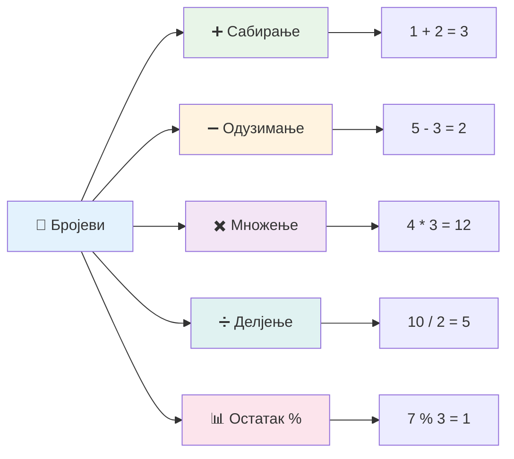
### Арифметички оператори

Арифметички оператори вам омогућавају да изводите математичке израчуне у ЈаваСкрипту. Ови оператори следе исте принципе које су математичари користили вековима – исте симболе који су се појављивали у делима учењака као што је Ал-Хваризми, који је развио алгебарску нотацију.

Оператори раде онако како бисте очекивали од традиционалне математике: плус за сабирање, минус за одузимање и тако даље.

Постоји неколико типова оператора за коришћење током арифметичких функција, а неки од њих су наведени овде:

| Симбол | Опис                                                                    | Пример                           |
| ------ | ------------------------------------------------------------------------ | -------------------------------- |
| `+`    | **Сабирање**: Израчунава збир два броја                                  | `1 + 2 // очекивани одговор је 3`   |
| `-`    | **Одузимање**: Израчунава разлику два броја                              | `1 - 2 // очекивани одговор је -1`  |
| `*`    | **Множење**: Израчунава производ два броја                              | `1 * 2 // очекивани одговор је 2`   |
| `/`    | **Дељење**: Израчунава количник два броја                              | `1 / 2 // очекивани одговор је 0.5` |
| `%`    | **Остатак**: Израчунава остатак при дељењу два броја                    | `1 % 2 // очекивани одговор је 1`   |

✅ Испробајте! Испробајте арифметичку операцију у конзоли вашег претраживача. Да ли вас резултати изненађују?

### 🧮 **Провера математичких вештина: Израчунавање са самопоуздањем**

**Испитајте своје разумевање аритметике:**
- Која је разлика између `/` (дељење) и `%` (остатак)?
- Можете ли предвидети колико је `10 % 3`? (Напомена: није 3.33...)
- Зашто може бити корисно користити оператор остатка у програмирању?

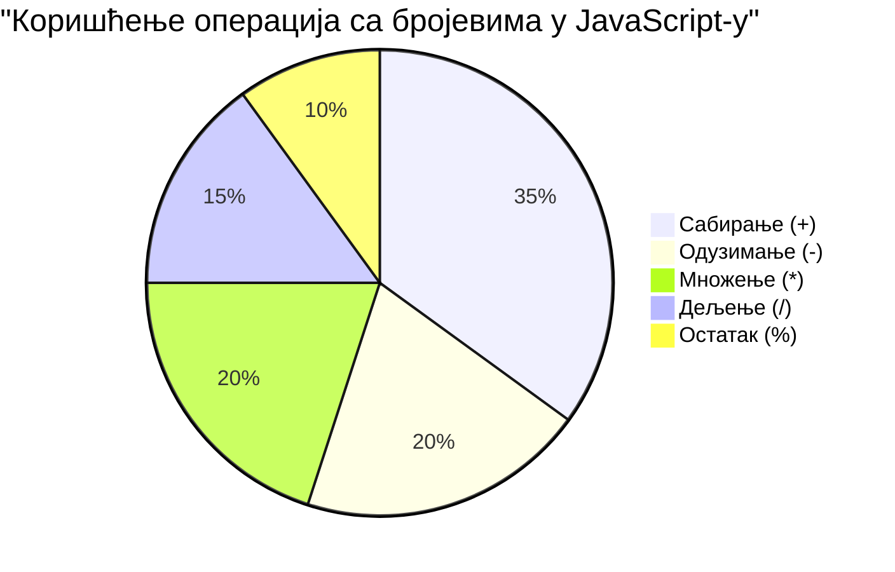
> **Увид из стварног живота**: Оператор остатка (%) је веома користан за проверавање да ли су бројеви парни/непарни, креирање образаца или пребацивање кроз низове!

### Стрингови

У ЈаваСкрипту, текстуални подаци су представљени као стрингови (низови карактера). Појам "стринг" долази од концепта карактера увезаних у низ, баш као што су писари у средњовековним манастирима повезивали слова да би формирали речи и реченице у својим рукописима.

Стрингови су основни за веб развој. Сваки део текста приказаног на веб сајту – корисничка имена, ознаке дугмади, поруке о грешкама, садржај – обрађује се као стринг податак. Разумевање стрингова је кључно за креирање функционалног корисничког интерфејса.

Стрингови су скуп карактера који се налазе између једноструких или дуплих наводника.

```javascript
'This is a string'
"This is also a string"
let myString = 'This is a string value stored in a variable';
```

**Разумевање ових концепата:**
- **Користи** или једноструке наводнике `'` или двоструке наводнике `"` за дефинисање стрингова
- **Чува** текстуалне податке који могу укључивати слова, бројеве и симболе
- **Додељује** стрингове променљивим ради касније употребе
- **Захтева** наводнике да би разликовали текст од имена променљивих

Запамтите да користите наводнике када пишете стринг, иначе ће ЈаваСкрипт претпоставити да је то име променљиве.

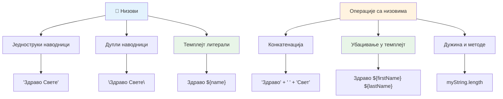
### Форматирање стрингова

Манипулација стринговима вам омогућава да комбинујете текстуалне елементе, убаците променљиве и креирате динамички садржај који реагује на стање програма. Ова техника вам омогућава да програмски конструишете текст.

Често морате да спојите више стрингова заједно – овај процес се зове конкатенација.
Да бисте **спојили** два или више низа, или их повезали заједно, користите оператор `+`.

```javascript
let myString1 = "Hello";
let myString2 = "World";

myString1 + myString2 + "!"; //Здраво Свете!
myString1 + " " + myString2 + "!"; //Здраво Свете!
myString1 + ", " + myString2 + "!"; //Здраво, Свете!
```

**Корак по корак, ево шта се дешава:**
- **Споји** више низова користећи оператор `+`
- **Повежи** низове директно заједно без размака у првом примеру
- **Додаје** карактере размака `" "` између низова за бољу читљивост
- **Убацује** интерпункцију као што су зарези за правилно форматирање

✅ Зашто је `1 + 1 = 2` у JavaScript-у, али `'1' + '1' = 11?` Размислите о томе. А шта је са `'1' + 1`?

**Темплејт литерали** су други начин форматирања низова, само што уместо наводника користе склонку (backtick). Све што није обичан текст мора бити смештено у плейсхолдере `${ }`. Ово укључује и све променљиве које могу бити низови.

```javascript
let myString1 = "Hello";
let myString2 = "World";

`${myString1} ${myString2}!` //Здраво Свете!
`${myString1}, ${myString2}!` //Здраво, Свете!
```

**Разумемо сваки део:**
- **Користи** склонке `` ` `` уместо обичних наводника за прављење темплејт литерала
- **Уграђује** променљиве директно користећи плейсхолдер `${}`
- **Чува** размаке и формат тачно како је написано
- **Обезбеђује** чистији начин креирања сложених низова са променљивама

Можете постићи жељено форматирање било којом методом, али темплејт литерали ће поштовати све размаке и преломе редова.

✅ Када бисте користили темплејт литерал уместо обичног низа?

### 🔤 **Провера знања о низовима: Самопоуздање у манипулацији текстом**

**Процените своје вештине рада са низовима:**
- Можете ли објаснити зашто је `'1' + '1'` једнако `'11'` уместо `2`?
- Коју методу рада са низовима сматрате читљивијом: конкатенацију или темплејт литерале?
- Шта се дешава ако заборавите наводнике око низа?

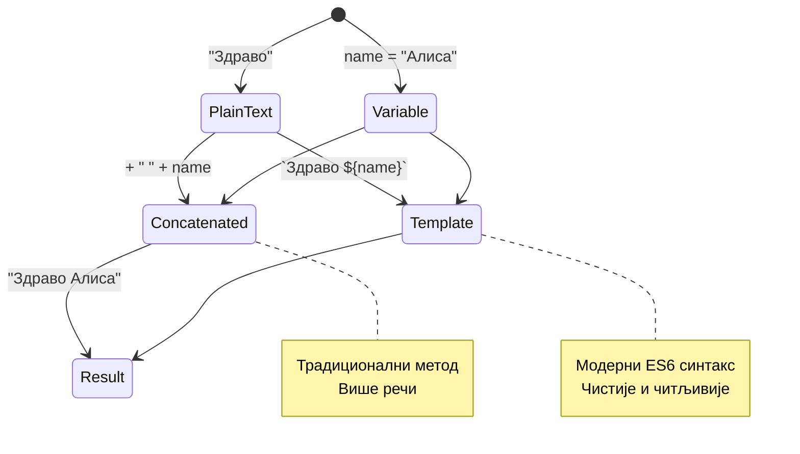
> **Професионални савет**: Темплејт литерали су углавном препоручљиви за сложено креирање низова зато што су читљивији и лепо рукују вишеинструменталним низовима!

### Булеани

Булеани представљају најједноставнији облик података: могу да садрже само једну од две вредности – `true` или `false`. Овај бинарни логички систем потиче од рада Џорџа Булеа, математичара из 19. века који је развио Булову алгебру.

Упркос једноставности, булеани су суштински за логику програма. Омогућавају вашем коду да доноси одлуке засноване на условима – да ли је корисник пријављен, да ли је дугме кликнуто или да ли су испуњени извесни критеријуми.

Булеани могу имати само две вредности: `true` или `false`. Булеани помажу при одлучивању која линија кода треба да се изврши када су испуњени одређени услови. У многим случајевима, [оператори](../../../../2-js-basics/1-data-types) помажу у подешавању вредности булеана и често ћете приметити и писати иницијацију променљивих или ажурирање њихових вредности уз помоћ оператора.

```javascript
let myTrueBool = true;
let myFalseBool = false;
```

**У горе наведеном, ми смо:**
- **Креирали** променљиву која чува булеанову вредност `true`
- **Приказали** како се чува булеан `false`
- **Користили** тачне кључне речи `true` и `false` (без потребе за наводницима)
- **Припремили** ове променљиве за коришћење у условним изјавама

✅ Променљива се може сматрати 'трути' ако евалуира на булеан `true`. Занимљиво је да у JavaScript-у [све вредности се сматрају трути сем ако су дефинисане као фалси](https://developer.mozilla.org/docs/Glossary/Truthy).

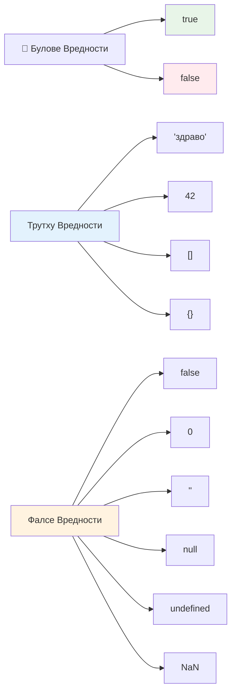
### 🎯 **Провера логике булеана: Вештине доношења одлука**

**Тестирајте своје разумевање булеана:**
- Зашто мислите да JavaScript има "трути" и "фалси" вредности осим само `true` и `false`?
- Можете ли предвидети која од ових вредности је фалси: `0`, `"0"`, `[]`, `"false"`?
- Како булеани могу бити корисни у контроли тока програма?

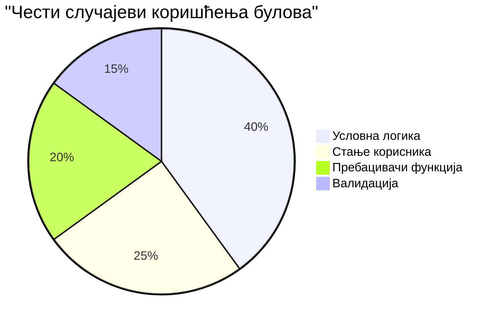
> **Запамтите**: У JavaScript-у само 6 вредности су фалси: `false`, `0`, `""`, `null`, `undefined` и `NaN`. Све остало је трути!

---

## 📊 **Резиме вашег алата за типове података**

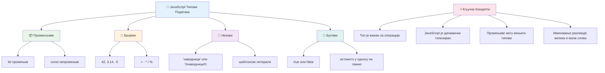
## Изазов GitHub Copilot агента 🚀

Користите Agent режим да завршите следећи изазов:

**Опис:** Креирајте менаџер личних информација који демонстрира све JavaScript типове података које сте научили у овом часу, а који рукова реалним ситуацијама из света.

**Задатак:** Направите JavaScript програм који креира објекат профила корисника који садржи: име (низ), године (број), статус студента (булеан), омиљене боје као низ и објекат адресе са улицом, градом и поштанским бројем. Укључите функције за приказивање информација о профилу и ажурирање појединачних поља. Обавезно прикажете конкатенацију низова, темплејт литерале, аритметичке операције са годинама и логичку булеан логику за статус студента.

Сазнајте више о [agent режиму](https://code.visualstudio.com/blogs/2025/02/24/introducing-copilot-agent-mode) овде.

## 🚀 Изазов

JavaScript има понашања која програмере могу изненадити. Ево класичног примера за истраживање: покушајте ово у конзоли прегледача: `let age = 1; let Age = 2; age == Age` и посматрајте резултат. Враћа `false` – можете ли одредити зашто?

Ово представља један од многих JavaScript понашања коју вреди разумети. Познавање ових необичних случајева помоћи ће вам да пишете поузданији код и ефикасније решавате проблеме.

## Тест након предавања
[Тест након предавања](https://ff-quizzes.netlify.app)

## Преглед и самостално учење

Погледајте [овој листи JavaScript вежби](https://css-tricks.com/snippets/javascript/) и пробајте једну. Шта сте научили?

## Задатак

[Вежба за типове података](assignment.md)

## 🚀 Ваш временски план за савладавање JavaScript типова података

### ⚡ **Шта можете урадити у следећих 5 минута**
- [ ] Отворите конзолу прегледача и креирајте 3 променљиве различитих типова података
- [ ] Покушајте изазов: `let age = 1; let Age = 2; age == Age` и утврдите зашто је фалси
- [ ] Вежбајте конкатенацију низова са својим именом и омиљеним бројем
- [ ] Тестирајте шта се дешава када додате број низу

### 🎯 **Шта можете постићи у овој сати**
- [ ] Завршите тест након часа и прегледајте све нејасне појмове
- [ ] Направите мини калкулатор који сабира, одузима, множе и дели два броја
- [ ] Направите једноставан форматирач имена користећи темплејт литерале
- [ ] Истражите разлике између оператора `==` и `===`
- [ ] Вежбајте конвертовање између различитих типова података

### 📅 **Ваш JavaScript темељ за недељу дана**
- [ ] Уз поверење и креативност завршите задатак
- [ ] Направите лични профил који користи све типове података које сте учили
- [ ] Вежбајте са [JavaScript вежбама са CSS-Tricks](https://css-tricks.com/snippets/javascript/)
- [ ] Направите једноставан валидатор форми користећи булеан логику
- [ ] Истражите типове података низова и објеката (преглед наредних часова)
- [ ] Придружите се JavaScript заједници и постављајте питања о типовима података

### 🌟 **Ваш месечни развој**
- [ ] Интегришите знање о типовима података у веће програмерске пројекте
- [ ] Разумите када и зашто користити сваки тип података у стварним апликацијама
- [ ] Помозите другим почетницима да разумеју основне концепте JavaScript-а
- [ ] Направите малу апликацију која управља различитим типовима корисничких података
- [ ] Истражите напредне концепте типовa података као што су принудна конверзија и строга једнакост
- [ ] Допринесите отвореним JavaScript пројектима побољшавањем документације

### 🧠 **Завршна провера савладавања типова података**

**Прославите свој филозофски темељ JavaScript-а:**
- Који вас тип података највише изненадио својим понашањем?
- Колико сте комфорантни у објашњавању разлике између променљивих и константи пријатељу?
- Која вам је најзанимљивија ствар коју сте открили о систему типова у JavaScript-у?
- Коју стварну апликацију можете замислити да направите користећи ове основе?

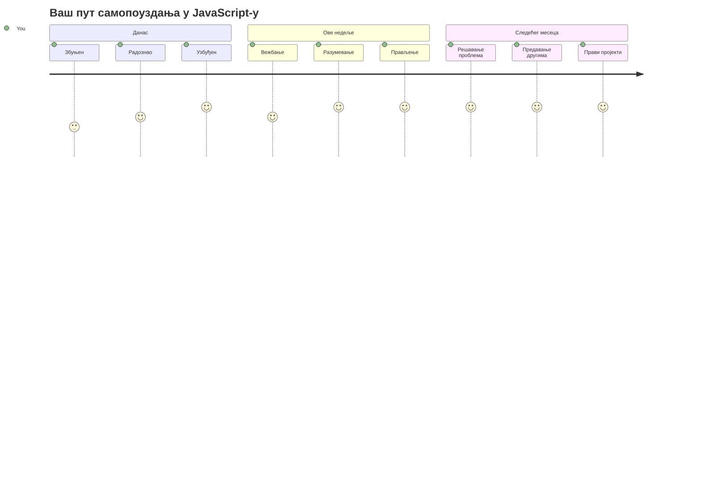
> 💡 **Изградили сте темеље!** Разумевање типова података је као учење азбуке пре писања прича. Сваки JavaScript програм који ћете икада написати користиће ове основне концепте. Сада имате грађевинске блокове да направите интерактивне веб странице, динамичне апликације и решавате стварне проблеме помоћу кода. Добро дошли у дивни свет JavaScript-а! 🎉

---

<!-- CO-OP TRANSLATOR DISCLAIMER START -->
**Одрицање одговорности**:
Овај документ је преведен помоћу AI преводилачке услуге [Co-op Translator](https://github.com/Azure/co-op-translator). Иако тежимо прецизности, молимо вас да имате у виду да аутоматизовани преводи могу садржати грешке или нетачности. Изворни документ на његовом матичном језику треба посматрати као ауторитет. За критичне информације препоручује се стручни људски превод. Нисмо одговорни за било каква неспоразума или погрешне тумачења која могу настати коришћењем овог превода.
<!-- CO-OP TRANSLATOR DISCLAIMER END -->