# Основи JavaScript-а: Методи и функције

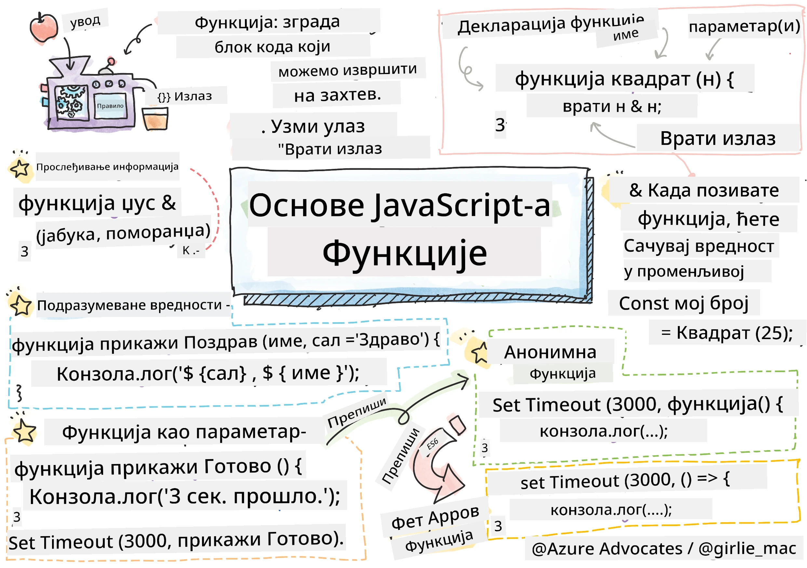
> Скетчнот аутора [Tomomi Imura](https://twitter.com/girlie_mac)

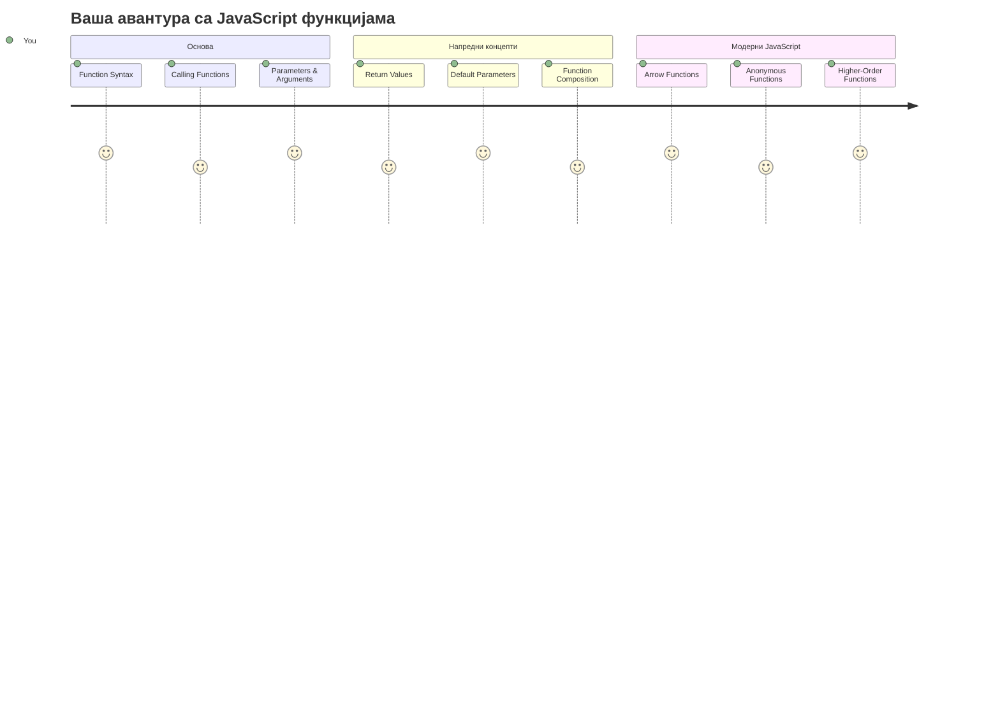
## Квиз пре предавања
[Квиз пре предавања](https://ff-quizzes.netlify.app)

Поновно писање истог кода је једна од најчешћих фрустрација у програмирању. Функције решавају овај проблем омогућавајући вам да упакујете код у поново употребљиве блокове. Размислите о функцијама као о стандардизованим деловима који су учинили Фордову монтажну траку револуционарном – када направите поуздану компоненту, можете је користити где год је потребно без поновног изграђивања од нуле.

Функције вам омогућавају да упакујете делове кода тако да их можете поново користити широм вашег програма. Уместо да копирате и налепљујете исту логику свуда, можете једном направити функцију и позивати је кад год је потребно. Овај приступ држи ваш код организованим и чини ажурирања много лакшим.

У овој лекцији научићете како да направите своје функције, проследите им информације и добијете корисне резултате назад. Открићете разлику између функција и метода, научити модерне приступе синтакси и видети како функције могу да раде са другим функцијама. Ове концепте ћемо градити корак по корак.

[](https://youtube.com/watch?v=XgKsD6Zwvlc "Methods and Functions")

> 🎥 Кликните на слику изнад за видео о методама и функцијама.

> Можете узети ову лекцију на [Microsoft Learn](https://docs.microsoft.com/learn/modules/web-development-101-functions/?WT.mc_id=academic-77807-sagibbon)!

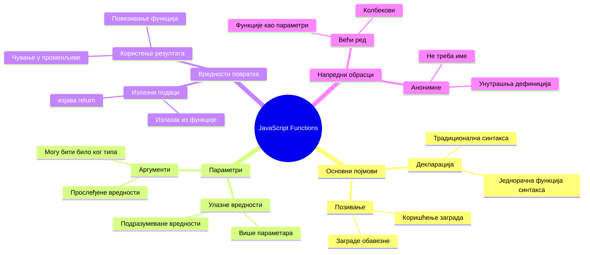
## Функције

Функција је самостални блок кода који извршава одређени задатак. Она инкапсулира логику коју можете извршавати кад год је потребно.

Уместо да пишете исти код више пута кроз цео програм, можете га упаковати у функцију и позивати ту функцију кад год вам затреба. Овај приступ држи ваш код чистим и чини ажурирања много лакшим. Замислите изазов одржавања ако бисте морали да мењате логику која је расута на 20 различитих места у вашем коду.

Врло је важно именовати функције описно. Добро именована функција јасно комуницира свој циљ – када видите `cancelTimer()`, одмах разумете шта ради, као што јасно означено дугме каже тачно шта ће се десити када га кликнете.

## Креирање и позивање функције

Хајде да прегледамо како се прави функција. Синтакса прати доследан образац:

```javascript
function nameOfFunction() { // дефиниција функције
 // дефиниција/тело функције
}
```

Хајде да то разложимо:
- Кључна реч `function` кажe JavaScript-у "Хеј, ја креирам функцију!"
- `nameOfFunction` је место где дајете својој функцији описно име
- Заграде `()` су место где можете додати параметре (ускоро ћемо до тога доћи)
- Коврџаве заграде `{}` садрже стварни код који се извршава када позовете функцију

Хајде да направимо једну једноставну функцију поздрављања да видимо како то ради:

```javascript
function displayGreeting() {
  console.log('Hello, world!');
}
```

Ова функција исписује "Hello, world!" у конзолу. Када је дефинишете, можете је користити колико год желите.

Да бисте извршили (или "позвали") своју функцију, напишите њено име праћено заградама. JavaScript вам омогућава да дефинишете функцију пре или после позива – JavaScript покретач ће се побринути за редослед извршавања.

```javascript
// позивање наше функције
displayGreeting();
```

Када покренете овај ред, извршава се сав код унутар ваше функције `displayGreeting`, приказујући "Hello, world!" у конзоли вашег претраживача. Ову функцију можете позивати више пута.

### 🧠 **Провера основа функција: Правите своје прве функције**

**Погледајмо како вам иде с основним функцијама:**
- Можете ли објаснити зашто користимо коврџаве заграде `{}` у дефиницијама функција?
- Шта се дешава ако напишете `displayGreeting` без заграда?
- Зашто бисте желели да позивате исту функцију више пута?

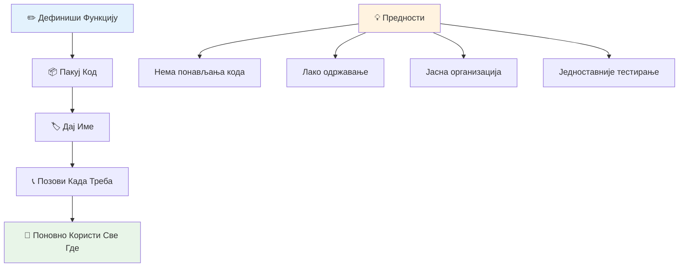
> **Напомена:** Током ових лекција користили сте **методе**. `console.log()` је метод – у суштини функција која припада објекту `console`. Кључна разлика је у томе што су методи везани за објекте, док функције стоје самостално. Многи програмери ове појмове користе наизменично у свакодневном говору.

### Најбоље праксе са функцијама

Ево неколико савета да вам помогну да пишете одличне функције:

- Дајте функцијама јасна, описна имена – ваш будући ја ће вам бити захвалан!
- Користите **camelCase** за имена са више речи (на пример `calculateTotal` уместо `calculate_total`)
- Свака функција треба да буде усредсређена на једну ствар и да је добро уради

## Прослеђивање информација функцији

Наша функција `displayGreeting` је ограничена – може приказивати само "Hello, world!" за све. Параметри нам омогућавају да функције буду флексибилније и корисније.

**Параметри** делују као места на која можете убацити различите вредности сваки пут када користите функцију. На овај начин иста функција може радити са разноразним информацијама сваки пут када се позове.

Параметре набрајате у заградама када дефинишете функцију, одвајајући више параметара зарезима:

```javascript
function name(param, param2, param3) {

}
```

Сваки параметар делује као место за убацивање – када неко позове вашу функцију, он даје стварне вредности које се убацују на ta места.

Ажурирајмо нашу функцију поздрављања да прихвата име особе:

```javascript
function displayGreeting(name) {
  const message = `Hello, ${name}!`;
  console.log(message);
}
```

Примећујете како користимо обратне наводнике (`` ` ``) и `${}` да убацимо име директно у поруку – ово се зове template literal и веома је користан начин прављења стрингова са варијаблама мешаним унутра.

Сада, када позовемо нашу функцију, можемо проследити било које име:

```javascript
displayGreeting('Christopher');
// приказује „Здраво, Кристофере!“ када се покрене
```

JavaScript узима стринг `'Christopher'`, додељује га параметру `name` и креира персонализовану поруку "Hello, Christopher!"

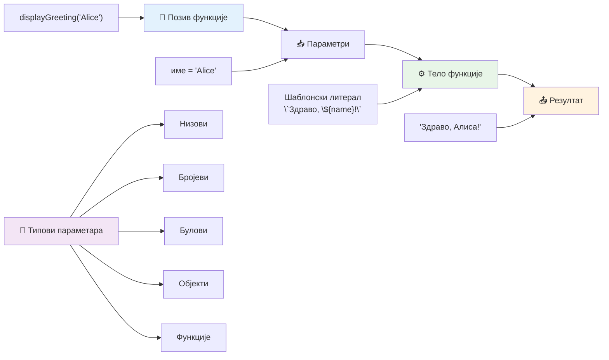
## Подразумеване вредности

Шта ако желимо да неки параметри буду опциони? Ту помажу подразумеване вредности!

Рецимо да желимо да људи могу прилагодити реч поздрављања, али ако не наведу другу, користићемо "Hello" као резервну вредност. Подразумеване вредности можете поставити коришћењем знака једнакости, као када постављате променљиву:

```javascript
function displayGreeting(name, salutation='Hello') {
  console.log(`${salutation}, ${name}`);
}
```

Овде је `name` и даље обавезан, али `salutation` има резервну вредност `'Hello'` ако нико не унесе другачији поздрав.

Сада можемо позивати ову функцију на два различита начина:

```javascript
displayGreeting('Christopher');
// приказује "Здраво, Кристофере"

displayGreeting('Christopher', 'Hi');
// приказује "Здраво, Кристофере"
```

У првом позиву, JavaScript користи подразумевани "Hello" јер нисмо навели поклон. У другом позиву, користи наш прилагођени "Hi". Ова флексибилност чини функције прилагодљивим различитим ситуацијама.

### 🎛️ **Провера знања параметара: Чинећи функције флексибилним**

**Тестирајте своје разумевање параметара:**
- Која је разлика између параметра и аргумента?
- Зашто су подразумеване вредности корисне у стварном програмирању?
- Можете ли предвидети шта се дешава ако проследите више аргумената него параметара?

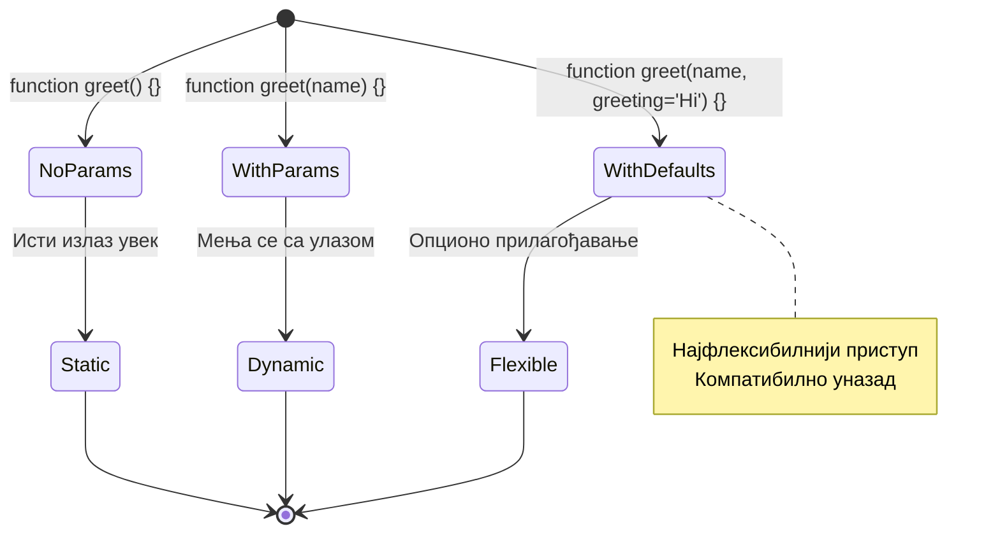
> **Испробани савет:** Подразумевани параметри чине ваше функције пријатнијим за кориснике. Корисници могу брзо почети са смисленим подразумеваним вредностима, али и прилагодити када је потребно!

## Враћање вредности

До сада су наше функције само исписивале поруке у конзолу, али шта ако желите да функција нешто израчуна и врати резултат?

Ту на сцену ступају **враћања вредности**. Уместо само приказивања нечег, функција вам може вратити вредност коју можете сачувати у променљиву или користити у другим деловима кода.

Да пошаљете вредност назад, користите кључну реч `return` праћену оним што желите да вратите:

```javascript
return myVariable;
```

Ово је важно: када функција достигне `return` израз, одмах престаје да се извршава и шаље ту вредност ономе ко ју је позвао.

Изменимо нашу функцију поздрављања да враћа поруку уместо да је исписује:

```javascript
function createGreetingMessage(name) {
  const message = `Hello, ${name}`;
  return message;
}
```

Сада, уместо да исписује поздрав, ова функција креира поруку и враћа је нама.

Да бисмо користили враћену вредност, можемо је сачувати у променљиву као и било коју другу вредност:

```javascript
const greetingMessage = createGreetingMessage('Christopher');
```

Сада `greetingMessage` садржи "Hello, Christopher" и можемо га користити било где у нашем коду – за приказ на веб-страници, укључивање у емаил или прослеђивање другој функцији.

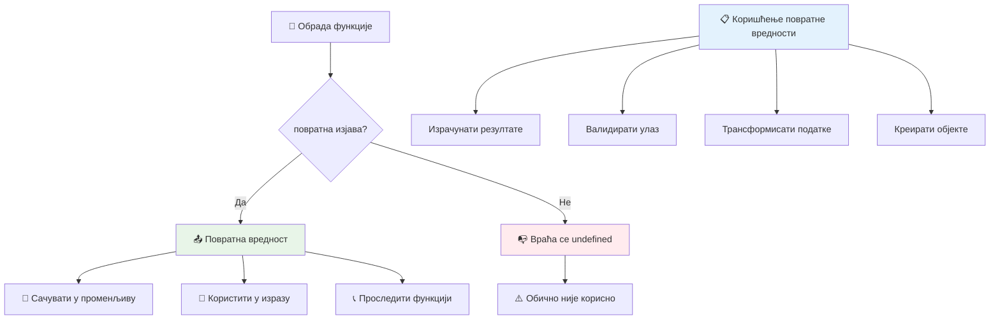
### 🔄 **Провера враћених вредности: Добивање резултата**

**Оцени своје разумевање враћених вредности:**
- Шта се дешава са кодом након `return` у функцији?
- Зашто је враћање вредности често боље од само исписивања у конзолу?
- Може ли функција вратити различите типове вредности (стринг, број, бул)?

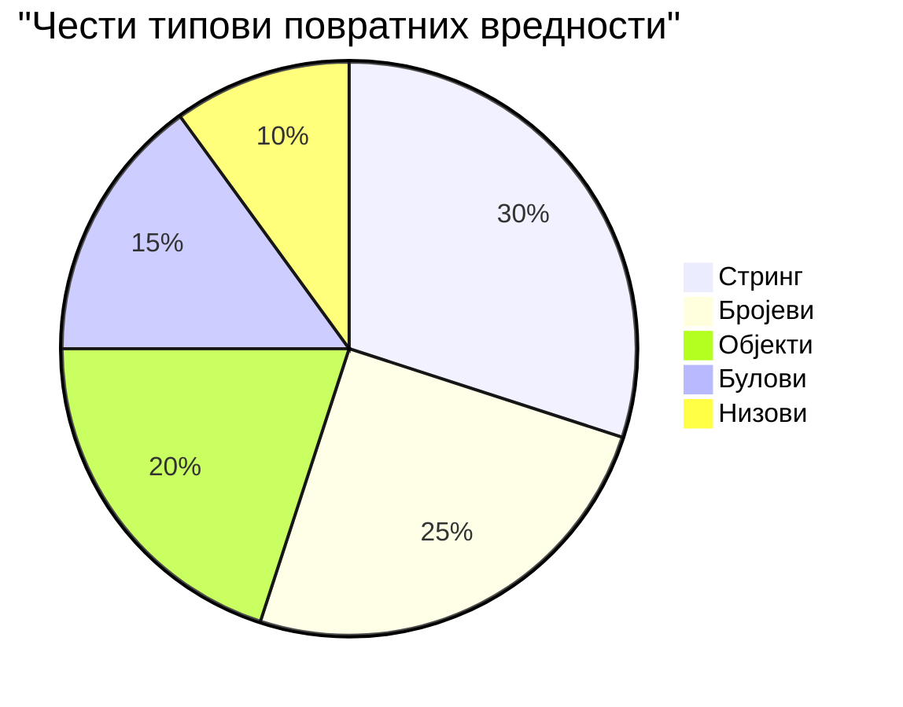
> **Кључно откриће:** Функције које враћају вредности су флексибилније јер позивач одлучује шта ће урадити са резултатом. Ово чини ваш код модуларнијим и поновно употребљивим!

## Функције као параметри за функције

Функције могу бити прослеђене као параметри другим функцијама. Иако овај концепт може изгледати сложено у почетку, то је моћна функција која омогућава флексибилан стил програмирања.

Овај образац је јако чест када желите да кажете "када се нешто деси, уради ово". На пример, "када тајмер заврши, покрени овај код" или "када корисник кликне на дугме, позови ову функцију".

Погледајмо `setTimeout`, који је уграђена функција која чека одређени временски период, па онда покреће неки код. Морамо јој рећи који код да покрене – савршен случај за прослеђивање функције!

Пробајте овај код – након 3 секунде ћете видети поруку:

```javascript
function displayDone() {
  console.log('3 seconds has elapsed');
}
// вредност тајмера је у милисекундама
setTimeout(displayDone, 3000);
```

Примећујете како прослеђујемо `displayDone` (без заграда) функцији `setTimeout`. Ми не позивамо функцију сами – ми јој је предајемо и кажемо "позови ово за 3 секунде".

### Анонимне функције

Понекад вам треба функција само за једну ствар и не желите да јој дајете име. Размислите – ако функцију користите само једном, зашто оптерећивати код додатним именом?

JavaScript вам даје могућност да направите **анонимне функције** – функције без имена које можете дефинисати управо тамо где су вам потребне.

Ево како можемо преписати наш пример са тајмером користећи анонимну функцију:

```javascript
setTimeout(function() {
  console.log('3 seconds has elapsed');
}, 3000);
```

Ово постиже исти резултат, али функција је дефинисана директно у позиву `setTimeout`, елиминишући потребу за посебном декларацијом функције.

### Функције стрелице (arrow functions)

Модерни JavaScript има још краћи начин писања функција који се зове **arrow functions** (функције стрелице). Користе `=>` (што изгледа као стрелица – јел' тако?) и веома су популарне међу програмерима.

Функције стрелице вам омогућавају да прескочите кључну реч `function` и напишете краћи, јаснији код.

Ево нашег примера с тајмером написаног функцијом стрелицом:

```javascript
setTimeout(() => {
  console.log('3 seconds has elapsed');
}, 3000);
```

`()` је место где иду параметри (у овом случају празно), па долази стрелица `=>`, и на крају тело функције у коврџавим заградама. Ово пружа исту функционалност са сажетом синтаксом.

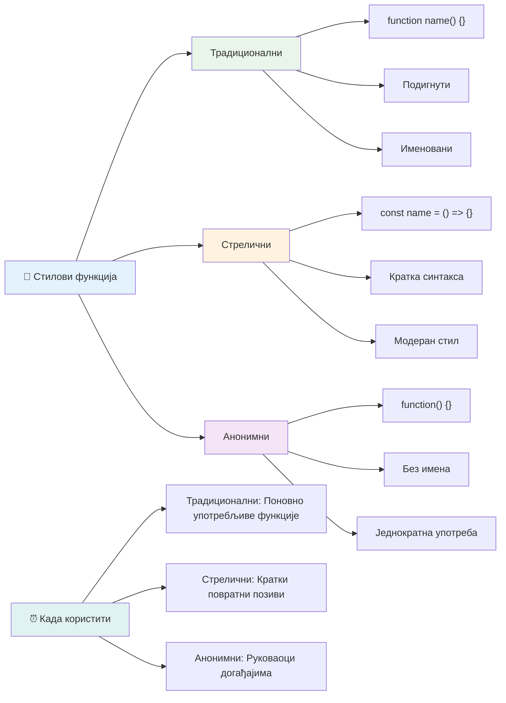
### Када користити који приступ

Када бисте користили који приступ? Практични савет: ако ћете користити функцију више пута, дајте јој име и дефинишите је посебно. Ако је за једну специфичну употребу, размислите о анонимној функцији. И стрелице и традиционална синтакса су валидни избори, иако су стрелице постале доминантне у модерним JavaScript код база.

### 🎨 **Провера стила функција: Изаберите праву синтаксу**

**Тестирајте разумевање синтаксе:**
- Када бисте радије користили стрелице уместо традиционалне синтаксе функције?
- Која је главна предност анонимних функција?
- Можете ли смислити ситуацију у којој је именована функција боља од анонимне?

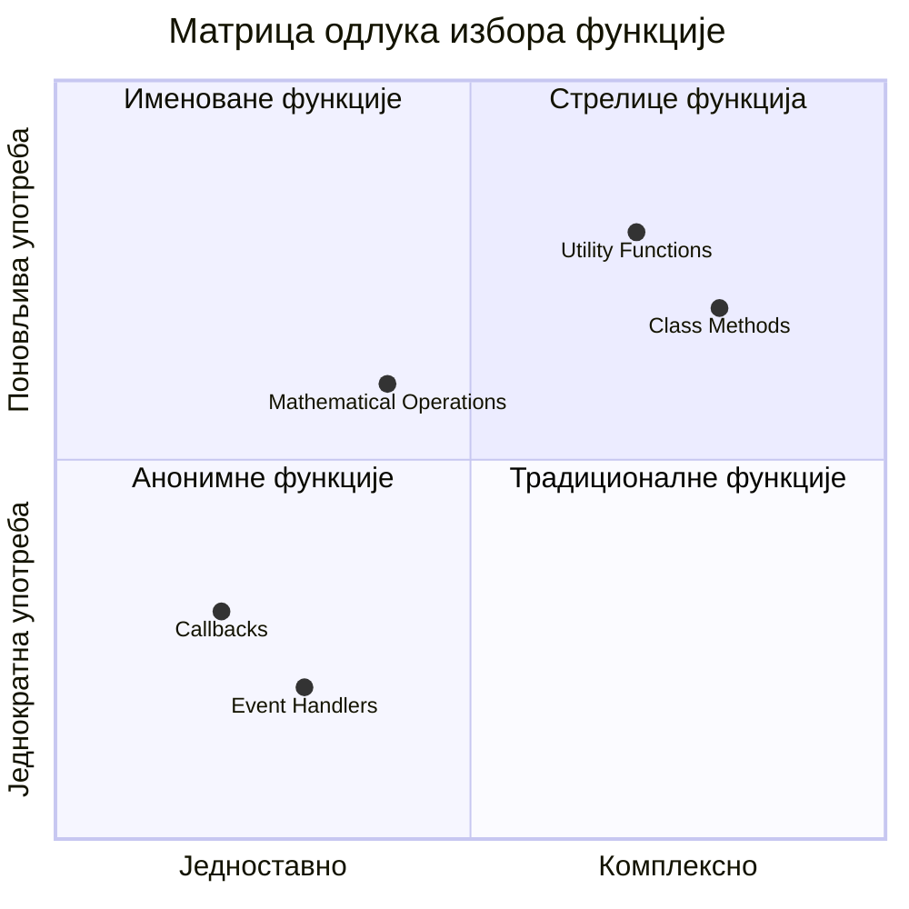
> **Модеран тренд:** Функције стрелице постају подразумевани избор за многе програмере због своје концизне синтаксе, али традиционалне функције и даље имају своје место!

---


## 🚀 Изазов

Можете ли у једној реченици изразити разлику између функција и метода? Покушајте!

## GitHub Copilot Agent изазов 🚀

Користите Agent режим да завршите следећи изазов:

**Опис:** Направите библиотеку корисних математичких функција која демонстрира различите концепте функција обрађене у овој лекцији, укључујући параметре, подразумеване вредности, враћање вредности и стрелице.

**Задатак:** Направите JavaScript датотеку под називом `mathUtils.js` која садржи следеће функције:
1. Функцију `add` која узима два параметра и враћа њихов збир
2. Функцију `multiply` са подразумеваним вредностима параметара (други параметар подразумевано 1)
3. Функцију стрелицу `square` која узима број и враћа његов квадрат
4. Функцију `calculate` која прихвата другу функцију као параметар и два броја, и примењује функцију на те бројеве
5. Прикажите позив сваке функције са одговарајућим тест примерима

Сазнајте више о [agent режиму](https://code.visualstudio.com/blogs/2025/02/24/introducing-copilot-agent-mode) овде.

## Квиз после предавања
[Квиз после предавања](https://ff-quizzes.netlify.app)

## Преглед и самостални рад

Вреди [прочитати мало више о функцијама стрелицама](https://developer.mozilla.org/docs/Web/JavaScript/Reference/Functions/Arrow_functions), јер се све више користе у код базама. Вежбајте писање функције, а затим је препишите користећи ову синтаксу.

## Задатак

[Забава са функцијама](assignment.md)

---

## 🧰 **Резиме вашег скупа алата за JavaScript функције**

```mermaid
graph TD
    A["🎯 ЈаваСкрипт функције"] --> B["📋 Декларација функције"]
    A --> C["📥 Параметри"]
    A --> D["📤 Вредности повратка"]
    A --> E["🎨 Модерна синтакса"]
    
    B --> B1["function name() {}"]
    B --> B2["Описно именовање"]
    B --> B3["Поновљиви блокови кода"]
    
    C --> C1["Улазни подаци"]
    C --> C2["Подразумеване вредности"]
    C --> C3["Више параметара"]
    
    D --> D1["return израз"]
    D --> D2["Излаз из функције"]
    D --> D3["Проследити податке назад"]
    
    E --> E1["Arrow функције: () =>"]
    E --> E2["Анонимне функције"]
    E --> E3["Функције вишег реда"]
    
    F["⚡ Кључне предности"] --> F1["Поновна употреба кода"]
    F --> F2["Боља организација"]
    F --> F3["Једноставније тестирање"]
    F --> F4["Модуларни дизајн"]
    
    style A fill:#e3f2fd
    style B fill:#e8f5e8
    style C fill:#fff3e0
    style D fill:#f3e5f5
    style E fill:#e0f2f1
    style F fill:#fce4ec
```
---

## 🚀 Ваш временски план за савладавање JavaScript функција

### ⚡ **Шта можете урадити у наредних 5 минута**
- [ ] Напишите једну једноставну функцију која враћа ваш омиљени број
- [ ] Направите функцију са два параметра која их сабира заједно
- [ ] Покушајте да конвертујете традиционалну функцију у стреличну синтаксу
- [ ] Вежбајте изазов: објасните разлику између функција и метода

### 🎯 **Шта можете постићи у овом сату**
- [ ] Завршите квиз након лекције и прегледајте све нејасне појмове
- [ ] Направите библиотеку математичких алата из изазова GitHub Copilot
- [ ] Креирајте функцију која користи другу функцију као параметар
- [ ] Вежбајте писање функција са подразумеваним параметрима
- [ ] Експериментишите са шаблонским литералима у повратним вредностима функција

### 📅 **Ваше дужонедељно савладавање функција**
- [ ] Завршите задатак "Забава са функцијама" креативно
- [ ] Рефакторирате неки понављајући код који сте написали у поновно употребљиве функције
- [ ] Направите мали калкулатор користећи само функције (без глобалних променљивих)
- [ ] Вежбајте стреличне функције са методама низова као што су `map()` и `filter()`
- [ ] Направите колекцију корисних функција за честе задатке
- [ ] Проучите функције вишег реда и концепте функционалног програмирања

### 🌟 **Ваш месечни трансформациони план**
- [ ] Савладајте напредне концепте функција као што су клаужуре и опсег
- [ ] Направите пројекат који интензивно користи композицију функција
- [ ] Допринесите отвореном коду побољшавајући документацију функција
- [ ] Подучите неког другог о функцијама и различитим стиловима синтаксе
- [ ] Истражите парадигме функционалног програмирања у JavaScript-у
- [ ] Креирајте личну библиотеку поновно употребљивих функција за будуће пројекте

### 🏆 **Завршна провера шампиона функција**

**Прославите своје савладавање функција:**
- Која је најкориснија функција коју сте до сада креирали?
- Како вам је учење о функцијама променило начин размишљања о организацији кода?
- Који стил синтаксе функција више волите и зашто?
- Који стварни проблем бисте решили писањем функције?

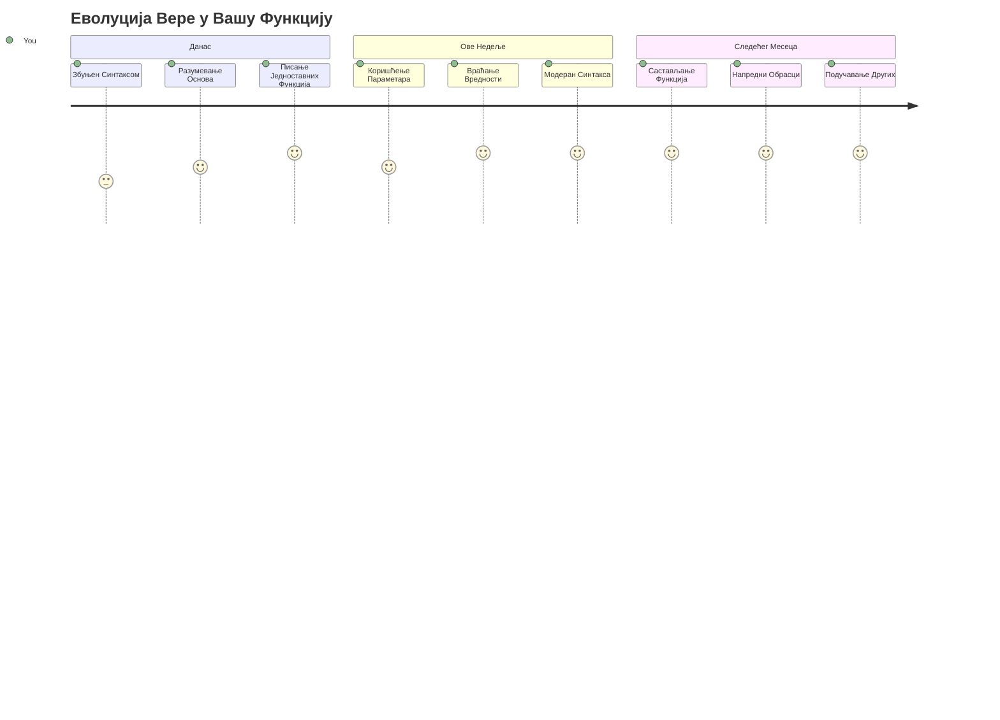
> 🎉 **Савладали сте један од најмоћнијих концепата у програмирању!** Функције су градивни блокови сложенијих програма. Сваку апликацију коју направите користиће функције за организовање, поновну употребу и структуру кода. Сада разумете како да логике упакујете у поновно употребљиве компоненте, чинећи вас ефикаснијим и успешнијим програмером. Добро дошли у свет модуларног програмирања! 🚀

---

<!-- CO-OP TRANSLATOR DISCLAIMER START -->
**Ограничење одговорности**:  
Овај документ је преведен помоћу ИИ преводилачке услуге [Co-op Translator](https://github.com/Azure/co-op-translator). Док настојимо да обезбедимо тачност, молимо вас да имате у виду да аутоматски преводи могу садржати грешке или нетачности. Оригинални документ на његовом изворном језику треба сматрати ауторитетним извором. За критичне информације препоручује се професионални превод од стране људског преводиоца. Нисмо одговорни за било каква неспоразумевања или погрешне тумачења која произлазе из употребе овог превода.
<!-- CO-OP TRANSLATOR DISCLAIMER END -->