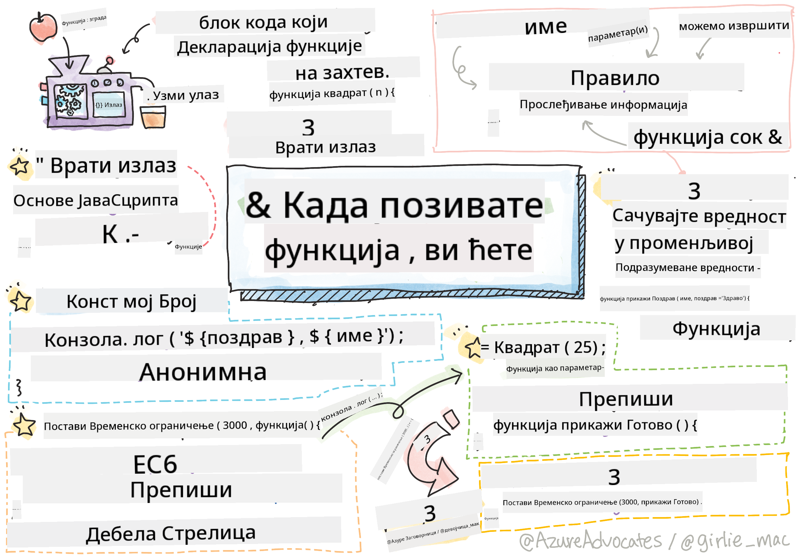

<!--
CO_OP_TRANSLATOR_METADATA:
{
  "original_hash": "b4612bbb9ace984f374fcc80e3e035ad",
  "translation_date": "2025-08-28T10:19:32+00:00",
  "source_file": "2-js-basics/2-functions-methods/README.md",
  "language_code": "sr"
}
-->
# Основе JavaScript-а: Методи и функције


> Скетч од [Tomomi Imura](https://twitter.com/girlie_mac)

## Квиз пре предавања
[Квиз пре предавања](https://ff-quizzes.netlify.app/web/quiz/9)

Када размишљамо о писању кода, увек желимо да осигурамо да је наш код читљив. Иако ово може звучати контраинтуитивно, код се чита много више пута него што се пише. Један од основних алата у арсеналу програмера за осигурање одрживог кода је **функција**.

[](https://youtube.com/watch?v=XgKsD6Zwvlc "Методи и функције")

> 🎥 Кликните на слику изнад за видео о методима и функцијама.

> Ову лекцију можете проћи на [Microsoft Learn](https://docs.microsoft.com/learn/modules/web-development-101-functions/?WT.mc_id=academic-77807-sagibbon)!

## Функције

У својој суштини, функција је блок кода који можемо извршити на захтев. Ово је савршено за сценарије где треба да обавимо исти задатак више пута; уместо да дуплирамо логику на више места (што би било тешко ажурирати када дође време), можемо је централизовати на једном месту и позвати кад год нам је потребно да се операција изврши - чак можете позвати функције из других функција!

Једнако важно је и могућност именовања функције. Иако ово може изгледати тривијално, име пружа брз начин за документовање дела кода. Можете то замислити као етикету на дугмету. Ако кликнем на дугме које пише "Откажи тајмер", знам да ће зауставити рад сата.

## Креирање и позивање функције

Синтакса за функцију изгледа овако:

```javascript
function nameOfFunction() { // function definition
 // function definition/body
}
```

Ако желим да креирам функцију за приказивање поздрава, то би могло изгледати овако:

```javascript
function displayGreeting() {
  console.log('Hello, world!');
}
```

Кад год желимо да позовемо (или активирамо) нашу функцију, користимо име функције праћено са `()`. Важно је напоменути да наша функција може бити дефинисана пре или после него што одлучимо да је позовемо; JavaScript компајлер ће је пронаћи за вас.

```javascript
// calling our function
displayGreeting();
```

> **NOTE:** Постоји посебан тип функције познат као **метод**, који сте већ користили! У ствари, видели смо ово у нашем демо примеру изнад када смо користили `console.log`. Оно што метод чини другачијим од функције је то што је метод везан за објекат (`console` у нашем примеру), док је функција независна. Многи програмери користе ове термине наизменично.

### Најбоље праксе за функције

Постоји неколико најбољих пракси које треба имати на уму приликом креирања функција:

- Као и увек, користите описна имена како бисте знали шта функција ради
- Користите **camelCasing** за спајање речи
- Држите функције фокусиране на одређени задатак

## Прослеђивање информација функцији

Да би функција била више употребљива, често ћете желети да јој проследите информације. Ако узмемо у обзир наш пример `displayGreeting` изнад, он ће приказати само **Здраво, свет!**. Није баш најкориснија функција коју бисмо могли креирати. Ако желимо да је учинимо мало флексибилнијом, као што је омогућавање некоме да наведе име особе коју поздравља, можемо додати **параметар**. Параметар (понекад назван и **аргумент**) је додатна информација која се шаље функцији.

Параметри се наводе у делу дефиниције унутар заграда и одвајају се зарезима, овако:

```javascript
function name(param, param2, param3) {

}
```

Можемо ажурирати наш `displayGreeting` да прихвати име и да га прикаже.

```javascript
function displayGreeting(name) {
  const message = `Hello, ${name}!`;
  console.log(message);
}
```

Када желимо да позовемо нашу функцију и проследимо параметар, наводимо га у заградама.

```javascript
displayGreeting('Christopher');
// displays "Hello, Christopher!" when run
```

## Подразумеване вредности

Можемо учинити нашу функцију још флексибилнијом додавањем више параметара. Али шта ако не желимо да захтевамо да свака вредност буде наведена? У складу са нашим примером поздрава, могли бисмо оставити име као обавезно (потребно нам је да знамо кога поздрављамо), али желимо да омогућимо да се сам поздрав прилагоди по жељи. Ако неко не жели да га прилагоди, пружамо подразумевану вредност. Да бисмо пружили подразумевану вредност параметру, постављамо је на исти начин као што постављамо вредност за променљиву - `parameterName = 'defaultValue'`. Да видимо комплетан пример:

```javascript
function displayGreeting(name, salutation='Hello') {
  console.log(`${salutation}, ${name}`);
}
```

Када позовемо функцију, можемо одлучити да ли желимо да поставимо вредност за `salutation`.

```javascript
displayGreeting('Christopher');
// displays "Hello, Christopher"

displayGreeting('Christopher', 'Hi');
// displays "Hi, Christopher"
```

## Враћање вредности

До сада ће функција коју смо направили увек излазити на [конзолу](https://developer.mozilla.org/docs/Web/API/console). Понекад ово може бити управо оно што тражимо, посебно када креирамо функције које ће позивати друге услуге. Али шта ако желим да направим помоћну функцију за израчунавање и да ми врати вредност како бих је могао користити негде другде?

Ово можемо урадити коришћењем **враћене вредности**. Враћена вредност се враћа из функције и може се чувати у променљивој на исти начин као што бисмо могли чувати литералну вредност као што је стринг или број.

Ако функција враћа нешто, онда се користи кључна реч `return`. Кључна реч `return` очекује вредност или референцу онога што се враћа, овако:

```javascript
return myVariable;
```  

Могли бисмо креирати функцију за креирање поруке поздрава и враћање вредности позиваоцу.

```javascript
function createGreetingMessage(name) {
  const message = `Hello, ${name}`;
  return message;
}
```

Када позивамо ову функцију, чуваћемо вредност у променљивој. Ово је исто као када бисмо поставили променљиву на статичку вредност (као `const name = 'Christopher'`).

```javascript
const greetingMessage = createGreetingMessage('Christopher');
```

## Функције као параметри за функције

Како напредујете у својој програмерској каријери, наићи ћете на функције које прихватају функције као параметре. Овај занимљив трик се често користи када не знамо када ће се нешто догодити или завршити, али знамо да треба да извршимо операцију као одговор.

Као пример, размислите о [setTimeout](https://developer.mozilla.org/docs/Web/API/WindowOrWorkerGlobalScope/setTimeout), који започиње тајмер и извршава код када се заврши. Треба да му кажемо који код желимо да изврши. Звучи као савршен посао за функцију!

Ако покренете код испод, након 3 секунде видећете поруку **Прошло је 3 секунде**.

```javascript
function displayDone() {
  console.log('3 seconds has elapsed');
}
// timer value is in milliseconds
setTimeout(displayDone, 3000);
```

### Анонимне функције

Хајде да поново погледамо оно што смо направили. Креирамо функцију са именом која ће се користити само једном. Како наша апликација постаје сложенија, можемо видети да креирамо много функција које ће бити позване само једном. Ово није идеално. Испоставља се да не морамо увек да пружимо име!

Када прослеђујемо функцију као параметар, можемо заобићи њено креирање унапред и уместо тога је направити као део параметра. Користимо исту кључну реч `function`, али је градимо као параметар.

Хајде да препишемо код изнад да користимо анонимну функцију:

```javascript
setTimeout(function() {
  console.log('3 seconds has elapsed');
}, 3000);
```

Ако покренете наш нови код, приметићете да добијамо исте резултате. Направили смо функцију, али нисмо морали да јој дамо име!

### Функције са стрелицом

Један пречица која је уобичајена у многим програмским језицима (укључујући JavaScript) је могућност коришћења онога што се назива **стрелица** или **дебела стрелица** функција. Користи посебан индикатор `=>`, који изгледа као стрелица - отуда име! Коришћењем `=>`, можемо прескочити кључну реч `function`.

Хајде да поново препишемо наш код да користимо функцију са стрелицом:

```javascript
setTimeout(() => {
  console.log('3 seconds has elapsed');
}, 3000);
```

### Када користити коју стратегију

Сада сте видели да имамо три начина да проследимо функцију као параметар и можда се питате када да користите који. Ако знате да ћете функцију користити више пута, креирајте је на уобичајен начин. Ако ћете је користити само на једном месту, генерално је најбоље користити анонимну функцију. Да ли ћете користити функцију са стрелицом или традиционални `function` синтаксу зависи од вас, али приметићете да већина савремених програмера преферира `=>`.

---

## 🚀 Изазов

Можете ли у једној реченици објаснити разлику између функција и метода? Покушајте!

## Квиз после предавања
[Квиз после предавања](https://ff-quizzes.netlify.app/web/quiz/10)

## Преглед и самостално учење

Вреди [прочитати мало више о функцијама са стрелицом](https://developer.mozilla.org/docs/Web/JavaScript/Reference/Functions/Arrow_functions), јер се све више користе у кодним базама. Вежбајте писање функције, а затим је препишите користећи ову синтаксу.

## Задатак

[Забава са функцијама](assignment.md)

---

**Одрицање од одговорности**:  
Овај документ је преведен коришћењем услуге за превођење помоћу вештачке интелигенције [Co-op Translator](https://github.com/Azure/co-op-translator). Иако се трудимо да превод буде тачан, молимо вас да имате у виду да аутоматизовани преводи могу садржати грешке или нетачности. Оригинални документ на његовом изворном језику треба сматрати ауторитативним извором. За критичне информације препоручује се професионални превод од стране људског преводиоца. Не преузимамо одговорност за било каква погрешна тумачења или неспоразуме који могу настати услед коришћења овог превода.