# Основе ЈаваСкрипта: Доношење одлука

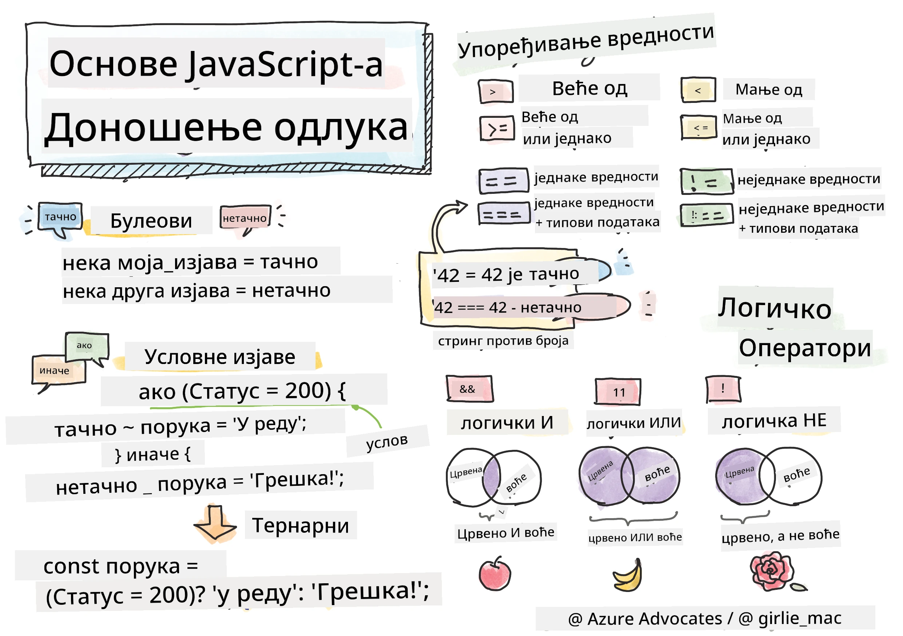

> Скетчнот од [Томоми Имура](https://twitter.com/girlie_mac)

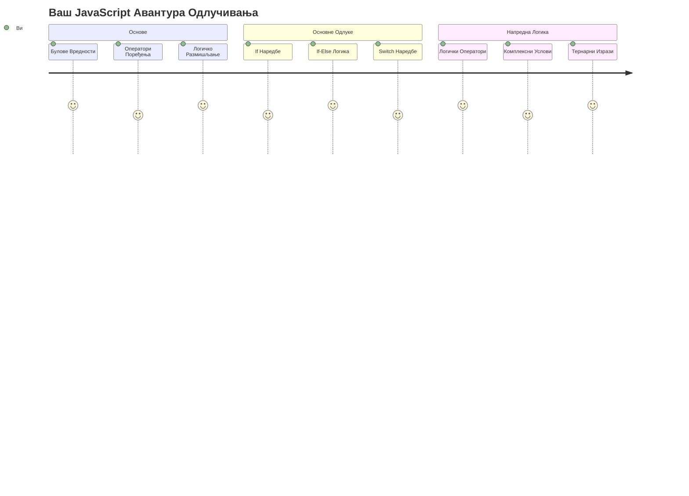
Јесте ли се икада запитали како апликације доносе паметне одлуке? Као што навигациони систем бира најбржи пут, или како термостат одлучује када да укључи грејање? Ово је основни појам доношења одлука у програмирању.

Баш као што је аналитички уређај Чарлса Бабеџа био дизајниран да прати различите секвенце операција на основу услова, савремени ЈаваСкрипт програми морају да доносе изборе базиране на различитим околностима. Њихова способност да разгранавају и доносе одлуке је оно што претвара статички код у реактивне, интелигентне апликације.

У овој лекцији ћете научити како да имплементирате условну логику у вашим програмима. Истражићемо условне наредбе, операторе поређења и логичке изразе који омогућавају вашем коду да процењује ситуације и одговара на одговарајући начин.

## Квиз пре предавања

[Квиз пре предавања](https://ff-quizzes.netlify.app/web/quiz/11)

Способност доношења одлука и контроле тока програма је основни аспект програмирања. Овај део покрива како да контролишете извршавање ваших ЈаваСкрипт програма користећи булове вредности и условну логику.

[](https://youtube.com/watch?v=SxTp8j-fMMY "Доношење одлука")

> 🎥 Кликните на слику изнад за видео о доношењу одлука.

> Ову лекцију можете похађати на [Microsoft Learn](https://docs.microsoft.com/learn/modules/web-development-101-if-else/?WT.mc_id=academic-77807-sagibbon)!

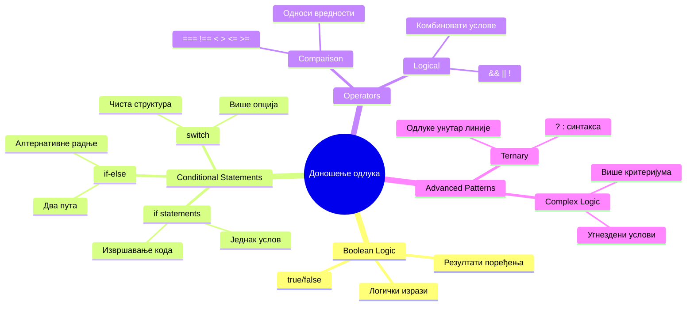
## Кратак подсетник о Буловима

Пре него што истражимо доношење одлука, подсетимо се булових вредности из претходне лекције. Назване по математичару Џорџу Булу, ове вредности представљају бинарна стања – или `true` или `false`. Нема двозначности, нема средине.

Ове бинарне вредности чине основу целокупне рачунарске логике. Свако доношење одлуке у вашем програму на крају се своди на булову процену.

Креирање булових променљивих је једноставно:

```javascript
let myTrueBool = true;
let myFalseBool = false;
```

Ово креира две променљиве са јасним буловим вредностима.

✅ Булови су добили име по енглеском математичару, филозофу и логику Џорџу Булу (1815–1864).

## Оператори поређења и булови

У пракси, ретко ћете ручно постављати булове вредности. Уместо тога, генерисаћете их процењивањем услова: „Да ли је овај број већи од оног?“ или „Да ли су ове вредности једнаке?“

Оператори поређења омогућавају ову процену. Они упоређују вредности и враћају булове резултате на основу односа између операнда.

| Симбол | Опис                                                                                                                                                         | Пример             |
| ------ | ------------------------------------------------------------------------------------------------------------------------------------------------------------- | ------------------ |
| `<`    | **Мање од**: Упоређује две вредности и враћа булову вредност `true` ако је вредност са леве стране мања од вредности са десне                             | `5 < 6 // true`    |
| `<=`   | **Мање или једнако**: Упоређује две вредности и враћа булову вредност `true` ако је вредност са леве стране мања или једнака са вредношћу са десне          | `5 <= 6 // true`   |
| `>`    | **Веће од**: Упоређује две вредности и враћа булову вредност `true` ако је вредност са леве стране већа од вредности са десне                               | `5 > 6 // false`   |
| `>=`   | **Веће или једнако**: Упоређује две вредности и враћа булову вредност `true` ако је вредност са леве стране већа или једнака са вредношћу са десне          | `5 >= 6 // false`  |
| `===`  | **Строга једнакост**: Упоређује две вредности и враћа булову вредност `true` ако су вредности са обе стране једнаке И ПРИ ТОМ СУ истог типа података          | `5 === 6 // false` |
| `!==`  | **Није једнако**: Упоређује две вредности и враћа супротну булову вредност од оне коју би вратио оператор строге једнакости                                   | `5 !== 6 // true`  |

✅ Проверите ваше знање тако што ћете написати нека поређења у конзоли вашег прегледача. Да ли вас нешто од добијених резултата изненађује?

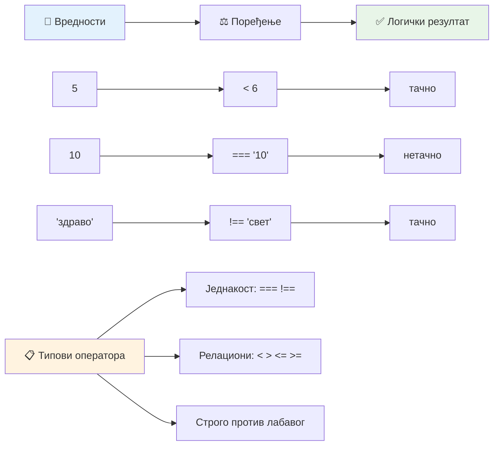
### 🧠 **Провера савладавања поређења: Разумевање булове логике**

**Тестирајте своје разумевање поређења:**
- Зашто мислите да је `===` (строга једнакост) генерално пожељнији од `==` (лабава једнакост)?
- Можете ли предвидети шта враћа `5 === '5'`? А шта враћа `5 == '5'`?
- Која је разлика између `!==` и `!=`?

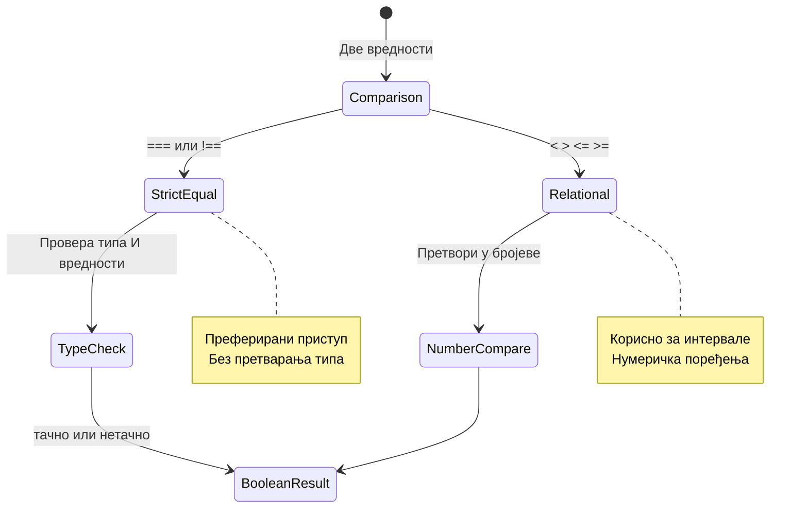
> **Корисни савет**: Увек користите `===` и `!==` за провере једнакости, осим ако вам није потребна конверзија типа. Ово спречава неочекивано понашање!

## Наредба if

Наредба `if` је као постављање питања у вашем коду. „Ако је овај услов истинит, онда уради ову ствар.“ Веројатно је најважнији алат који ћете користити за доношење одлука у ЈаваСкрипту.

Ево како функционише:

```javascript
if (condition) {
  // Услов је истинит. Код у овом блоку ће се извршити.
}
```

Услов иде у заграде, и ако је `true`, ЈаваСкрипт извршава код унутар витичастих заграда. Ако је `false`, ЈаваСкрипт једноставно прескаче тај блок.

Често ћете користити операторе поређења да направите ове услове. Ево једног практичног примера:

```javascript
let currentMoney = 1000;
let laptopPrice = 800;

if (currentMoney >= laptopPrice) {
  // Услов је тачан. Код у овом блоку ће се извршити.
  console.log("Getting a new laptop!");
}
```

Пошто `1000 >= 800` вреднује у `true`, код унутар блока се извршава, приказујући "Добијање новог лаптопа!" у конзоли.

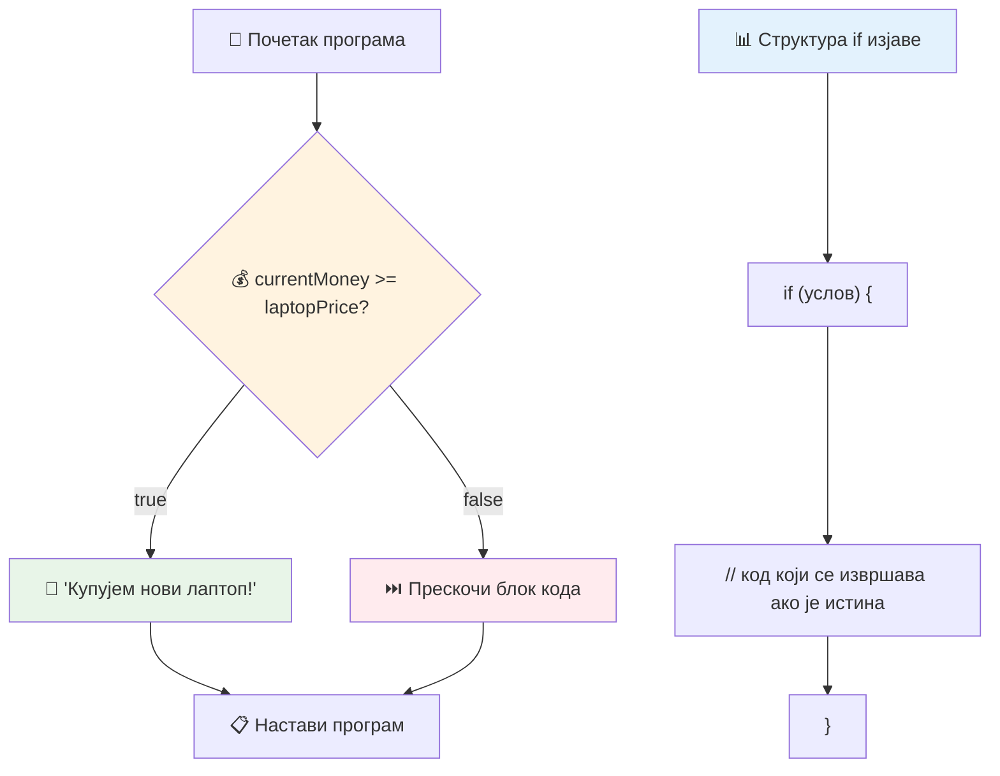
## Наредба If..Else

Али шта ако желите да ваш програм уради нешто друго када услов није истинит? Ту долази `else` – као резервни план.

Наредба `else` вам омогућава да кажете "ако овај услов није истинит, уради ово друго."

```javascript
let currentMoney = 500;
let laptopPrice = 800;

if (currentMoney >= laptopPrice) {
  // Услов је тачан. Код у овом блоку ће се извршити.
  console.log("Getting a new laptop!");
} else {
  // Услов је нетачан. Код у овом блоку ће се извршити.
  console.log("Can't afford a new laptop, yet!");
}
```

Сада, пошто је `500 >= 800` `false`, ЈаваСкрипт прескаче први блок и извршава блок `else`. У конзоли ћете видети "Још не могу приуштити нови лаптоп!"

✅ Испробајте разумевање овог и следећег кода тако што ћете их покренути у конзоли прегледача. Промените вредности променљивих currentMoney и laptopPrice да бисте видели различите излазе `console.log()`.

### 🎯 **Провера if-else логике: разгранавање путева**

**Процените своје разумевање условне логике:**
- Шта се дешава ако `currentMoney` тачно одговара `laptopPrice`?
- Можете ли замислити стварни сценарио у ком је if-else логика корисна?
- Како бисте проширили ово да обрадите више ценовних разреда?

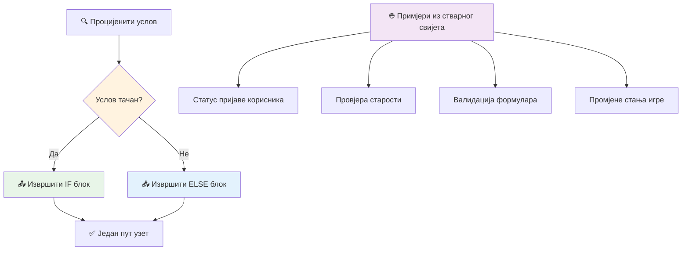
> **Кључна увида**: If-else обезбеђује да се изабере тачно један пут. Ово гарантује да ваш програм увек има одговор на било који услов!

## Наредба Switch

Понекад треба да упоредите једну вредност са више опција. Док бисте могли користити више угнежђених `if..else` наредби, тај приступ постаје незгодан. Наредба `switch` пружа чистију структуру за руковање више дискретних вредности.

Овај концепт подсећа на механичке прекидаче коришћене у раним телефонским централама – једна улазна вредност одређује коју специфичну путању ће извршење следити.

```javascript
switch (expression) {
  case x:
    // блок кода
    break;
  case y:
    // блок кода
    break;
  default:
    // блок кода
}
```

Ево како је структура:
- ЈаваСкрипт процењује израз једном
- Прегледа сваки `case` да пронађе подударност
- Када пронађе подударност, извршава тај блок кода
- Наредба `break` говори ЈаваСкрипту да стане и изађе из switch-а
- Ако ниједан случај није упарен, извршава се `default` блок (ако га имате)

```javascript
// Програм који користи switch изјаву за дан у недељи
let dayNumber = 2;
let dayName;

switch (dayNumber) {
  case 1:
    dayName = "Monday";
    break;
  case 2:
    dayName = "Tuesday";
    break;
  case 3:
    dayName = "Wednesday";
    break;
  default:
    dayName = "Unknown day";
    break;
}
console.log(`Today is ${dayName}`);
```

У овом примеру, ЈаваСкрипт види да је `dayNumber` `2`, пронађе подударајући `case 2`, постави `dayName` на "Tuesday" и онда изађе из switch-а. Резултат? "Today is Tuesday" се приказује у конзоли.

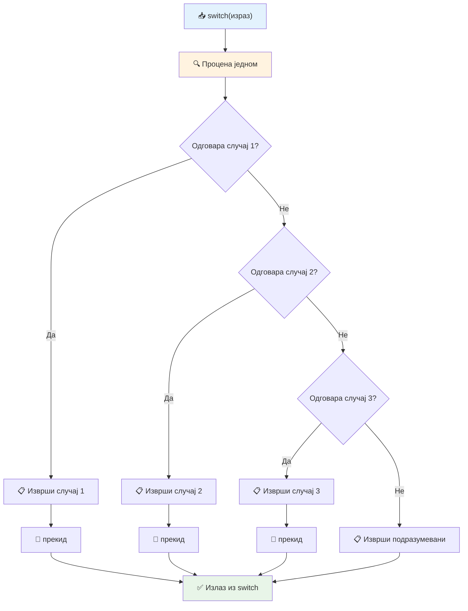
✅ Испробајте разумевање овог и следећег кода покретањем у конзоли прегледача. Промените вредност променљиве a да видите другачији излаз `console.log()`.

### 🔄 **Мастеринг наредбе Switch: Више опција**

**Тестирајте своје разумевање switch-а:**
- Шта се дешава ако заборавите `break` наредбу?
- Када бисте користили `switch` уместо више `if-else` изјава?
- Зашто је `default` случај користан чак и ако мислите да сте покрили све могућности?

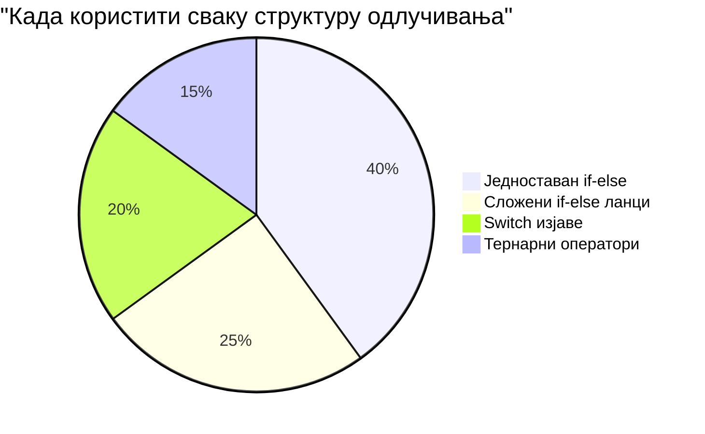
> **Најбоља пракса**: Користите `switch` када упоређујете једну променљиву са више специфичних вредности. Користите `if-else` за проверу опсега или сложене услове!

## Логички оператори и булови

Комплексне одлуке често захтевају истовремену процену више услова. Баш као што Булова алгебра омогућава математичарима да комбинују логичке изразе, програмирање пружа логичке операторе за повезивање више булових услова.

Ови оператори омогућавају софистицирану условну логику спајањем једноставних true/false процена.

| Симбол | Опис                                                                                           | Пример                                                                   |
| ------ | ---------------------------------------------------------------------------------------------- | ------------------------------------------------------------------------- |
| `&&`   | **Логички И (AND)**: Упоређује два булова израза. Враћа true **само ако су оба тачна**          | `(5 > 3) && (5 < 10) // Обе стране су истините. Враћа true`              |
| `\|\|` | **Логички ИЛИ (OR)**: Упоређује два булова израза. Враћа true ако је бар једна страна тачна    | `(5 > 10) \|\| (5 < 10) // Једна страна је нетачна, друга истина. Враћа true` |
| `!`    | **Логичка НЕ (NOT)**: Враћа супротну вредност буловог израза                                   | `!(5 > 10) // 5 није веће од 10, тако да "!" даје true`                   |

Ови оператори вам омогућавају да комбинујете услове на корисне начине:
- AND (`&&`) значи да морају оба услова бити тачна
- OR (`||`) значи да бар један услов мора бити тачан  
- NOT (`!`) мења true у false (и обратно)

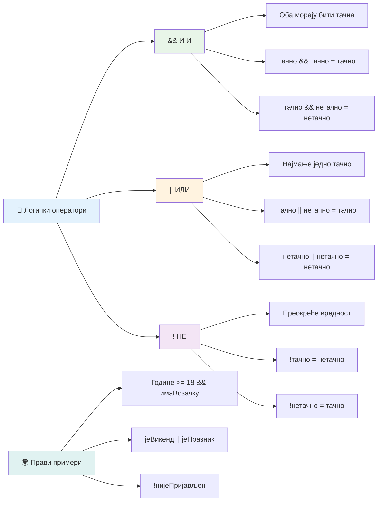
## Услови и одлуке са логичким оператерима

Погледајмо ове логичке операторе у акцији на реалистичнијем примеру:

```javascript
let currentMoney = 600;
let laptopPrice = 800;
let laptopDiscountPrice = laptopPrice - (laptopPrice * 0.2); // Цена лаптопа са попустом од 20 процената

if (currentMoney >= laptopPrice || currentMoney >= laptopDiscountPrice) {
  // Услов је тачан. Код у овом блоку ће се извршити.
  console.log("Getting a new laptop!");
} else {
  // Услов је нетачан. Код у овом блоку ће се извршити.
  console.log("Can't afford a new laptop, yet!");
}
```

У овом примеру: рачунамо цену са 20% попуста (640), затим процењујемо да ли нам расположива средства покривају или пуни износ ИЛИ цену с попустом. Пошто 600 није довољно за ценовни праг од 640, услов враћа `false`.

### 🧮 **Провера логичких оператора: комбиновaње услова**

**Тестирајте разумевање логичких оператора:**
- У изразу `A && B`, шта се дешава ако је A нетачно? Да ли се B уопште процењује?
- Можете ли смислити ситуацију у којој бисте користили сва три оператора (&&, ||, !) заједно?
- Која је разлика између `!user.isActive` и `user.isActive !== true`?

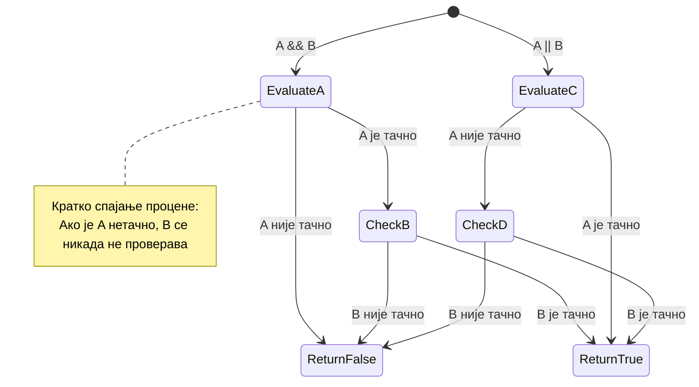
> **Савет за перформансе**: ЈаваСкрипт користи „краткоспојну процену“ - у `A && B` ако је A нетачно, B се уопште не процењује. Искористите ово у своју корист!

### Оператор негације

Понекад је лакше размишљати када нешто није тачно. На пример, уместо да питате „Да ли је корисник пријављен?“, можда желите да питате „Да ли корисник није пријављен?“ Оператер узвика (`!`) преокреће логику за вас.

```javascript
if (!condition) {
  // извршава се ако је услов нетачан
} else {
  // извршава се ако је услов тачан
}
```

Оператор `!` је као да кажете „супротно од...“ – ако је нешто `true`, `!` га чини `false`, и обрнуто.

### Тернарни изрази

За једноставне условне доделе, ЈаваСкрипт пружа **тернарни оператор**. Ова концизна синтакса вам омогућава да напишете условни израз у једној линији, корисно када желите да доделите једну од две вредности на основу услова.

```javascript
let variable = condition ? returnThisIfTrue : returnThisIfFalse;
```

Чита се као питање: „Да ли је овај услов истинит? Ако јесте, користи ову вредност. Ако није, користи ону вредност.“

Испод је конкретнији пример:

```javascript
let firstNumber = 20;
let secondNumber = 10;
let biggestNumber = firstNumber > secondNumber ? firstNumber : secondNumber;
```

✅ Посветите минут да неколико пута прочитате овај код. Да ли разумете како ови оператори функционишу?

Ова линија каже: „Да ли је `firstNumber` већи од `secondNumber`? Ако јесте, стави `firstNumber` у `biggestNumber`. Ако није, стави `secondNumber` у `biggestNumber`.“

Тернарни оператор је само краћа верзија традиционалне `if..else` наредбе:

```javascript
let biggestNumber;
if (firstNumber > secondNumber) {
  biggestNumber = firstNumber;
} else {
  biggestNumber = secondNumber;
}
```

Оба приступа производе идентичне резултате. Тернарни оператор нуди концизност, док је традиционална if-else структура можда читљивија за сложеније услове.

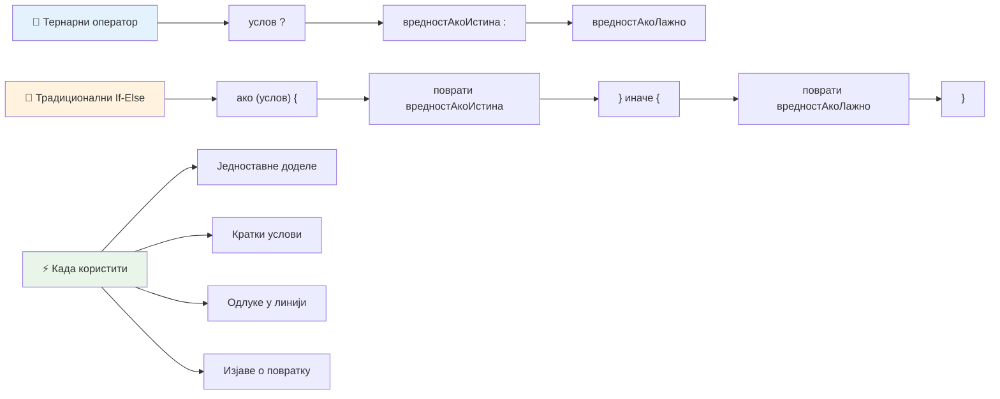
---


## 🚀 Изазов

Направите програм који је прво написан са логичким операторима, а затим га препишите користећи тернарни израз. Који синтакс ви више волите?

---

## Изазов GitHub Copilot агента 🚀

Користите Agent режим да завршите следећи изазов:

**Опис:** Направите свеобухватан калкулатор оцена који демонстрира више концепата доношења одлука из ове лекције, укључујући if-else наредбе, switch наредбе, логичке операторе и тернарне изразе.

**Захтев:** Напишите ЈаваСкрипт програм који узима нумеричку оцену студента (0-100) и одређује његову словну оцену према следећим критеријумима:
- А: 90-100
- B: 80-89  
- C: 70-79
- D: 60-69
- F: испод 60

Захтеви:
1. Користите if-else наредбу за одређивање словне оцене

2. Користите логичке операторе да проверите да ли студент пролази (оцена >= 60) И има почаст (оцена >= 90)
3. Користите switch изјаву да пружите специфичне повратне информације за сваки словни разред
4. Користите тернарни оператор да одредите да ли је студент подобан за следећи курс (оцена >= 70)
5. Укључите проверу уноса како бисте осигурали да је резултат између 0 и 100

Тестирајте свој програм са разним оценама укључујући и крајње случајеве као што су 59, 60, 89, 90, и неважећи уноси.

Сазнајте више о [agent mode](https://code.visualstudio.com/blogs/2025/02/24/introducing-copilot-agent-mode) овде.


## Квиз након предавања

[Пост-лекцијски квиз](https://ff-quizzes.netlify.app/web/quiz/12)

## Преглед и самосталан рад

Прочитајте више о бројним операторима доступним кориснику [на MDN](https://developer.mozilla.org/docs/Web/JavaScript/Reference/Operators).

Прођите кроз одличан Josh Comeau-ов [operator lookup](https://joshwcomeau.com/operator-lookup/)!

## Задатак

[Оператори](assignment.md)

---

## 🧠 **Резиме вашег сета алата за доношење одлука**

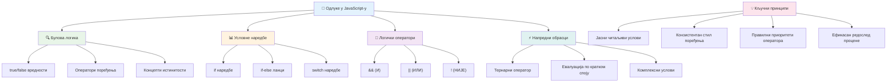
---

## 🚀 Ваш временски оквир за усавршавање у доношењу одлука у JavaScript-у

### ⚡ **Шта можете учинити у наредних 5 минута**
- [ ] Вежбајте операторе поређења у конзоли прегледача
- [ ] Напишите једноставну if-else изјаву која проверава ваш узраст
- [ ] Покушајте изазов: препишите if-else користећи тернарни оператор
- [ ] Тестирајте шта се дешава са различитим "true" и "false" вредностима

### 🎯 **Шта можете постићи у овом сату**
- [ ] Завршите квиз након лекције и прегледајте све збуњујуће концепте
- [ ] Направите свеобухватни калкулатор оцена из GitHub Copilot изазова
- [ ] Креирајте једноставно стабло одлука за стварни сценарио (нпр. избор одеће)
- [ ] Вежбајте комбиновaње више услова помоћу логичких оператора
- [ ] Експериментишите са switch изјавама за различите случајеве

### 📅 **Ваше недељно усавршавање логике**
- [ ] Завршите задатак о оператерима са креативним примерима
- [ ] Направите мини апликацију квиза користећи различите условне структуре
- [ ] Креирајте валидатор формулара који проверава више улазних услова
- [ ] Вежбајте Josh Comeau-ове [operator lookup](https://joshwcomeau.com/operator-lookup/) вежбе
- [ ] Рефакторишите постојећи код да користи прикладније условне структуре
- [ ] Проучите short-circuit процену и импликације на перформансе

### 🌟 **Ваш месечни трансформациони процес**
- [ ] Савладајте сложене унутрашње услове и одржавајте читљивост кода
- [ ] Направите апликацију са софистицираном логиком доношења одлука
- [ ] Допринесите open source пројектима унапређујући условну логику
- [ ] Подучите друге о различитим условним структурама и када их користити
- [ ] Истражите функционалне приступе условној логици
- [ ] Направите лични референтни водич за најбоље праксе условног изражавања

### 🏆 **Завршни преглед вашег мајсторства у доношењу одлука**

**Прославите своје умеће логичког размишљања:**
- Која је најсложенија логика одлуке коју сте успешно имплементирали?
- Која условна структура вам најприродније одговара и зашто?
- Како вам је учење о логичким операторима променило приступ решавању проблема?
- Која стварна апликација би имала користи од софистициране логике доношења одлука?

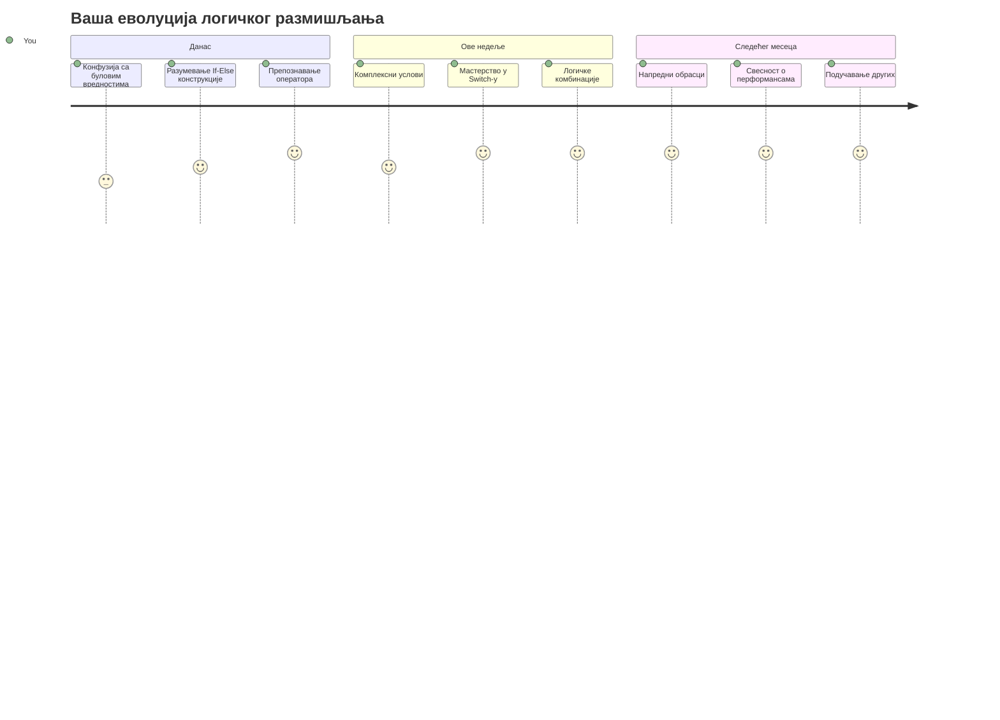
> 🧠 **Овладали сте уметношћу дигиталног доношења одлука!** Свако интерактивној апликацији је потребна условна логика да интелигентно реагује на корисничке акције и променљиве услове. Сада разумете како да натерате своје програме да размишљају, процењују и бирају одговарајуће реакције. Ова основа логике ће покретати сваку динамичну апликацију коју изградите! 🎉

---

<!-- CO-OP TRANSLATOR DISCLAIMER START -->
**Пажња**:  
Овај документ је преведен помоћу AI сервиса за превођење [Co-op Translator](https://github.com/Azure/co-op-translator). Иако тежимо прецизности, молимо вас да имате на уму да аутоматски преводи могу садржати грешке или нетачности. Изворни документ на његовом оригиналном језику треба сматрати ауторитетним извором. За критичне информације препоручује се професионалан превод од стране људског стручњака. Нисмо одговорни за било каква неспоразума или погрешне тумачења која произилазе из коришћења овог превода.
<!-- CO-OP TRANSLATOR DISCLAIMER END -->