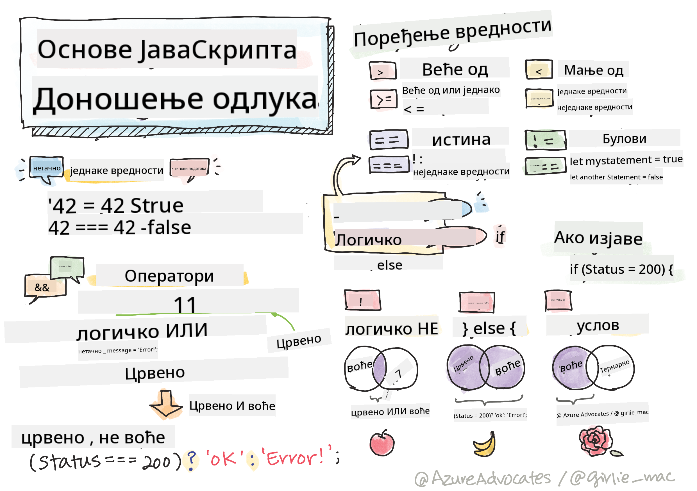

<!--
CO_OP_TRANSLATOR_METADATA:
{
  "original_hash": "f7009631b73556168ca435120a231c98",
  "translation_date": "2025-08-29T12:15:09+00:00",
  "source_file": "2-js-basics/3-making-decisions/README.md",
  "language_code": "sr"
}
-->
# Основе JavaScript-а: Доношење одлука



> Скетч од [Томоми Имура](https://twitter.com/girlie_mac)

## Квиз пре предавања

[Квиз пре предавања](https://ff-quizzes.netlify.app/web/quiz/11)

Доношење одлука и контрола редоследа извршавања кода чини ваш код поново употребљивим и робусним. Овај део покрива синтаксу за контролу тока података у JavaScript-у и њен значај када се користи са Буловим типовима података.

[](https://youtube.com/watch?v=SxTp8j-fMMY "Доношење одлука")

> 🎥 Кликните на слику изнад за видео о доношењу одлука.

> Ову лекцију можете проћи на [Microsoft Learn](https://docs.microsoft.com/learn/modules/web-development-101-if-else/?WT.mc_id=academic-77807-sagibbon)!

## Кратак подсетник о Буловима

Булови могу имати само две вредности: `true` или `false`. Булови помажу у доношењу одлука о томе који редови кода треба да се изврше када су одређени услови испуњени.

Поставите ваш бул на `true` или `false` овако:

`let myTrueBool = true`  
`let myFalseBool = false`

✅ Булови су добили име по енглеском математичару, филозофу и логичару Џорџу Булу (1815–1864).

## Оператори поређења и Булови

Оператори се користе за процену услова прављењем поређења која ће створити Булову вредност. Испод је листа често коришћених оператора.

| Симбол | Опис                                                                                                                                                          | Пример             |
| ------ | ------------------------------------------------------------------------------------------------------------------------------------------------------------- | ------------------ |
| `<`    | **Мање од**: Поређује две вредности и враћа Булову вредност `true` ако је вредност са леве стране мања од десне                                               | `5 < 6 // true`    |
| `<=`   | **Мање или једнако**: Поређује две вредности и враћа Булову вредност `true` ако је вредност са леве стране мања или једнака десној                             | `5 <= 6 // true`   |
| `>`    | **Веће од**: Поређује две вредности и враћа Булову вредност `true` ако је вредност са леве стране већа од десне                                               | `5 > 6 // false`   |
| `>=`   | **Веће или једнако**: Поређује две вредности и враћа Булову вредност `true` ако је вредност са леве стране већа или једнака десној                             | `5 >= 6 // false`  |
| `===`  | **Строга једнакост**: Поређује две вредности и враћа Булову вредност `true` ако су вредности са леве и десне стране једнаке И истог типа података              | `5 === 6 // false` |
| `!==`  | **Неједнакост**: Поређује две вредности и враћа супротну Булову вредност од оне коју би вратио оператор строге једнакости                                      | `5 !== 6 // true`  |

✅ Проверите своје знање тако што ћете написати нека поређења у конзоли вашег претраживача. Да ли вас неки од враћених података изненађује?

## If изјава

`if` изјава ће извршити код између својих блокова ако је услов тачан.

```javascript
if (condition) {
  //Condition is true. Code in this block will run.
}
```

Логички оператори се често користе за формирање услова.

```javascript
let currentMoney;
let laptopPrice;

if (currentMoney >= laptopPrice) {
  //Condition is true. Code in this block will run.
  console.log("Getting a new laptop!");
}
```

## If..Else изјава

`else` изјава ће извршити код између својих блокова када је услов нетачан. Она је опционална уз `if` изјаву.

```javascript
let currentMoney;
let laptopPrice;

if (currentMoney >= laptopPrice) {
  //Condition is true. Code in this block will run.
  console.log("Getting a new laptop!");
} else {
  //Condition is false. Code in this block will run.
  console.log("Can't afford a new laptop, yet!");
}
```

✅ Тестирајте своје разумевање овог кода и следећег кода тако што ћете га покренути у конзоли претраживача. Промените вредности променљивих `currentMoney` и `laptopPrice` да бисте променили враћени `console.log()`.

## Switch изјава

`switch` изјава се користи за извршавање различитих радњи на основу различитих услова. Користите `switch` изјаву да изаберете један од многих блокова кода који ће се извршити.

```javascript
switch (expression) {
  case x:
    // code block
    break;
  case y:
    // code block
    break;
  default:
  // code block
}
```

```javascript
// program using switch statement
let a = 2;

switch (a) {
  case 1:
    a = "one";
    break;
  case 2:
    a = "two";
    break;
  default:
    a = "not found";
    break;
}
console.log(`The value is ${a}`);
```

✅ Тестирајте своје разумевање овог кода и следећег кода тако што ћете га покренути у конзоли претраживача. Промените вредности променљиве `a` да бисте променили враћени `console.log()`.

## Логички оператори и Булови

Одлуке могу захтевати више од једног поређења и могу се повезати логичким операторима да би се добила Булова вредност.

| Симбол | Опис                                                                                     | Пример                                                                  |
| ------ | ----------------------------------------------------------------------------------------- | ----------------------------------------------------------------------- |
| `&&`   | **Логичко И**: Поређује два Булова израза. Враћа `true` **само** ако су обе стране тачне | `(5 > 6) && (5 < 6 ) //Једна страна је нетачна, друга је тачна. Враћа false` |
| `\|\|` | **Логичко ИЛИ**: Поређује два Булова израза. Враћа `true` ако је бар једна страна тачна   | `(5 > 6) \|\| (5 < 6) //Једна страна је нетачна, друга је тачна. Враћа true` |
| `!`    | **Логичко НЕ**: Враћа супротну вредност Буловог израза                                    | `!(5 > 6) // 5 није веће од 6, али "!" ће вратити true`                 |

## Услови и одлуке са логичким операторима

Логички оператори могу се користити за формирање услова у `if..else` изјавама.

```javascript
let currentMoney;
let laptopPrice;
let laptopDiscountPrice = laptopPrice - laptopPrice * 0.2; //Laptop price at 20 percent off

if (currentMoney >= laptopPrice || currentMoney >= laptopDiscountPrice) {
  //Condition is true. Code in this block will run.
  console.log("Getting a new laptop!");
} else {
  //Condition is true. Code in this block will run.
  console.log("Can't afford a new laptop, yet!");
}
```

### Оператор негације

До сада сте видели како можете користити `if...else` изјаву за креирање условне логике. Све што иде у `if` мора се проценити као `true` или `false`. Коришћењем оператора `!` можете _негирати_ израз. То би изгледало овако:

```javascript
if (!condition) {
  // runs if condition is false
} else {
  // runs if condition is true
}
```

### Тернарни изрази

`if...else` није једини начин за изражавање логике одлуке. Такође можете користити нешто што се зове тернарни оператор. Његова синтакса изгледа овако:

```javascript
let variable = condition ? <return this if true> : <return this if false>
```

Испод је конкретнији пример:

```javascript
let firstNumber = 20;
let secondNumber = 10;
let biggestNumber = firstNumber > secondNumber ? firstNumber : secondNumber;
```

✅ Одвојите минут да прочитате овај код неколико пута. Да ли разумете како ови оператори функционишу?

Горњи код каже:

- ако је `firstNumber` већи од `secondNumber`
- онда додели `firstNumber` променљивој `biggestNumber`
- иначе додели `secondNumber`.

Тернарни израз је само компактнији начин писања кода испод:

```javascript
let biggestNumber;
if (firstNumber > secondNumber) {
  biggestNumber = firstNumber;
} else {
  biggestNumber = secondNumber;
}
```

---

## 🚀 Изазов

Направите програм који је прво написан са логичким операторима, а затим га препишите користећи тернарни израз. Која синтакса вам више одговара?

---

## Квиз након предавања

[Квиз након предавања](https://ff-quizzes.netlify.app/web/quiz/12)

## Преглед и самостално учење

Прочитајте више о многим операторима доступним кориснику [на MDN](https://developer.mozilla.org/docs/Web/JavaScript/Reference/Operators).

Погледајте сјајан [преглед оператора](https://joshwcomeau.com/operator-lookup/) Џоша Комоа!

## Задатак

[Оператори](assignment.md)

---

**Одрицање од одговорности**:  
Овај документ је преведен коришћењем услуге за превођење помоћу вештачке интелигенције [Co-op Translator](https://github.com/Azure/co-op-translator). Иако настојимо да обезбедимо тачност, молимо вас да имате у виду да аутоматски преводи могу садржати грешке или нетачности. Оригинални документ на изворном језику треба сматрати меродавним извором. За критичне информације препоручује се професионални превод од стране људи. Не сносимо одговорност за било каква погрешна тумачења или неспоразуме који могу произаћи из коришћења овог превода.