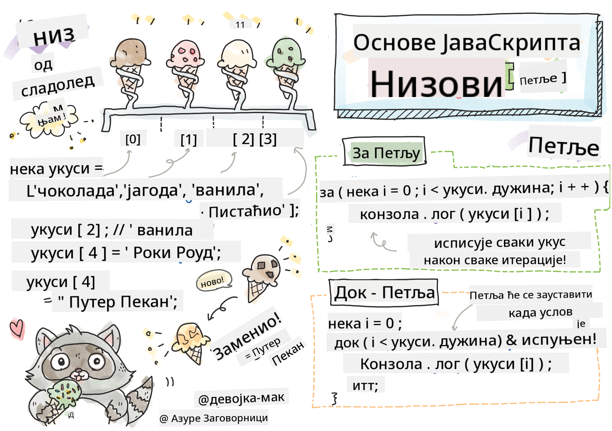

<!--
CO_OP_TRANSLATOR_METADATA:
{
  "original_hash": "9029f96b0e034839c1799f4595e4bb66",
  "translation_date": "2025-08-29T12:16:20+00:00",
  "source_file": "2-js-basics/4-arrays-loops/README.md",
  "language_code": "sr"
}
-->
# Основе JavaScript-а: Низови и Петље

  
> Скетч од [Tomomi Imura](https://twitter.com/girlie_mac)

## Квиз пре предавања  
[Квиз пре предавања](https://ff-quizzes.netlify.app/web/quiz/13)

Ова лекција покрива основе JavaScript-а, језика који омогућава интерактивност на вебу. У овој лекцији ћете научити о низовима и петљама, који се користе за манипулацију подацима.

[](https://youtube.com/watch?v=1U4qTyq02Xw "Низови")

[](https://www.youtube.com/watch?v=Eeh7pxtTZ3k "Петље")

> 🎥 Кликните на слике изнад за видео снимке о низовима и петљама.

> Ову лекцију можете проћи на [Microsoft Learn](https://docs.microsoft.com/learn/modules/web-development-101-arrays/?WT.mc_id=academic-77807-sagibbon)!

## Низови

Рад са подацима је чест задатак у било ком програмском језику, а тај задатак је много лакши када су подаци организовани у структурном формату, као што су низови. Уз низове, подаци се чувају у структури сличној листи. Једна од главних предности низова је што можете чувати различите типове података у једном низу.

✅ Низови су свуда око нас! Можете ли смислити пример низа из стварног живота, као што је низ соларних панела?

Синтакса за низ је пар угластих заграда.

```javascript
let myArray = [];
```

Ово је празан низ, али низови могу бити декларисани већ попуњени подацима. Вредности у низу се одвајају зарезом.

```javascript
let iceCreamFlavors = ["Chocolate", "Strawberry", "Vanilla", "Pistachio", "Rocky Road"];
```

Вредности у низу добијају јединствену вредност која се зове **индекс**, цео број који се додељује на основу њихове удаљености од почетка низа. У примеру изнад, стринг вредност "Chocolate" има индекс 0, а индекс "Rocky Road" је 4. Користите индекс са угластим заградама да бисте дохватили, променили или убацили вредности у низ.

✅ Да ли вас изненађује што низови почињу од нултог индекса? У неким програмским језицима индекси почињу од 1. Постоји занимљива историја око овога, коју можете [прочитати на Википедији](https://en.wikipedia.org/wiki/Zero-based_numbering).

```javascript
let iceCreamFlavors = ["Chocolate", "Strawberry", "Vanilla", "Pistachio", "Rocky Road"];
iceCreamFlavors[2]; //"Vanilla"
```

Можете користити индекс да промените вредност, овако:

```javascript
iceCreamFlavors[4] = "Butter Pecan"; //Changed "Rocky Road" to "Butter Pecan"
```

И можете убацити нову вредност на одређени индекс овако:

```javascript
iceCreamFlavors[5] = "Cookie Dough"; //Added "Cookie Dough"
```

✅ Чешћи начин додавања вредности у низ је коришћењем оператора за низове, као што је array.push().

Да бисте сазнали колико ставки има у низу, користите својство `length`.

```javascript
let iceCreamFlavors = ["Chocolate", "Strawberry", "Vanilla", "Pistachio", "Rocky Road"];
iceCreamFlavors.length; //5
```

✅ Испробајте сами! Користите конзолу вашег претраживача да креирате и манипулишете низом који сами направите.

## Петље

Петље нам омогућавају да извршавамо поновљиве или **итеративне** задатке, и могу уштедети доста времена и кода. Свака итерација може се разликовати у својим променљивама, вредностима и условима. Постоје различите врсте петљи у JavaScript-у, и све имају мале разлике, али у суштини раде исту ствар: пролазе кроз податке.

### For петља

`for` петља захтева 3 дела за итерацију:  
- `counter` Променљива која се обично иницијализује бројем који броји број итерација  
- `condition` Израз који користи операторе поређења да би зауставио петљу када постане `false`  
- `iteration-expression` Извршава се на крају сваке итерације, обично се користи за промену вредности бројача  

```javascript
// Counting up to 10
for (let i = 0; i < 10; i++) {
  console.log(i);
}
```

✅ Покрените овај код у конзоли претраживача. Шта се дешава када направите мале промене у бројачу, услову или изразу итерације? Можете ли учинити да ради уназад, стварајући одбројавање?

### While петља

За разлику од синтаксе `for` петље, `while` петље захтевају само услов који ће зауставити петљу када услов постане `false`. Услови у петљама обично се ослањају на друге вредности као што су бројачи, и морају се управљати током трајања петље. Почетне вредности за бројаче морају бити креиране изван петље, а сви изрази за испуњавање услова, укључујући промену бројача, морају се одржавати унутар петље.

```javascript
//Counting up to 10
let i = 0;
while (i < 10) {
 console.log(i);
 i++;
}
```

✅ Зашто бисте изабрали for петљу уместо while петље? 17.000 корисника је имало исто питање на StackOverflow-у, а нека од мишљења [могу вам бити занимљива](https://stackoverflow.com/questions/39969145/while-loops-vs-for-loops-in-javascript).

## Петље и низови

Низови се често користе са петљама јер већина услова захтева дужину низа да би зауставила петљу, а индекс такође може бити вредност бројача.

```javascript
let iceCreamFlavors = ["Chocolate", "Strawberry", "Vanilla", "Pistachio", "Rocky Road"];

for (let i = 0; i < iceCreamFlavors.length; i++) {
  console.log(iceCreamFlavors[i]);
} //Ends when all flavors are printed
```

✅ Експериментишите са проласком кроз низ који сами направите у конзоли вашег претраживача.

---

## 🚀 Изазов

Постоје и други начини проласка кроз низове осим for и while петљи. Постоје [forEach](https://developer.mozilla.org/docs/Web/JavaScript/Reference/Global_Objects/Array/forEach), [for-of](https://developer.mozilla.org/docs/Web/JavaScript/Reference/Statements/for...of), и [map](https://developer.mozilla.org/docs/Web/JavaScript/Reference/Global_Objects/Array/map). Препишите вашу петљу кроз низ користећи једну од ових техника.

## Квиз након предавања  
[Квиз након предавања](https://ff-quizzes.netlify.app/web/quiz/14)

## Преглед и самостално учење

Низови у JavaScript-у имају много метода који су изузетно корисни за манипулацију подацима. [Прочитајте о овим методама](https://developer.mozilla.org/docs/Web/JavaScript/Reference/Global_Objects/Array) и испробајте неке од њих (као што су push, pop, slice и splice) на низу који сами направите.

## Задатак

[Прођите кроз низ](assignment.md)

---

**Одрицање од одговорности**:  
Овај документ је преведен коришћењем услуге за превођење помоћу вештачке интелигенције [Co-op Translator](https://github.com/Azure/co-op-translator). Иако тежимо тачности, молимо вас да имате у виду да аутоматски преводи могу садржати грешке или нетачности. Оригинални документ на изворном језику треба сматрати ауторитативним извором. За критичне информације препоручује се професионални превод од стране људи. Не сносимо одговорност за било каква неспоразумевања или погрешна тумачења која могу произаћи из коришћења овог превода.