<!--
CO_OP_TRANSLATOR_METADATA:
{
  "original_hash": "1710a50a519a6e4a1b40a5638783018d",
  "translation_date": "2026-01-07T07:49:42+00:00",
  "source_file": "2-js-basics/4-arrays-loops/README.md",
  "language_code": "sr"
}
-->
# Основе JavaScript-а: Низови и Петље


> Скетчнот од [Tomomi Imura](https://twitter.com/girlie_mac)

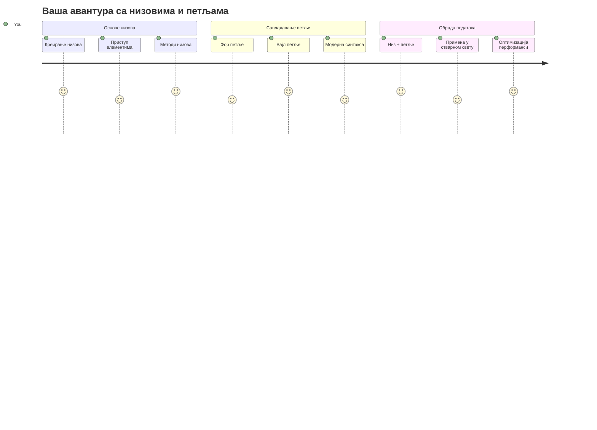
## Пре-предавачки квиз
[Пре-предавачки квиз](https://ff-quizzes.netlify.app/web/quiz/13)

Јесте ли се икада запитали како веб сајтови прате артикле у корпи за куповину или приказују вашу листу пријатеља? Ту ступају на сцену низови и петље. Низови су као дигитални контејнери који држе више информација, док петље омогућавају да ефикасно радите са свим тим подацима без понављања кода.

Заједно, ови два концепта чине темељ за рад са информацијама у вашим програмима. Научићете како да пређете са ручног писања сваког корака на креирање паметног, ефикасног кода који може брзо обрадити стотине или чак хиљаде ставки.

До краја ове лекције, разумећете како да извршите сложене задатке над подацима са само неколико линија кода. Хајде да истражимо ове основне програмерске концепте.

[](https://youtube.com/watch?v=1U4qTyq02Xw "Arrays")

[](https://www.youtube.com/watch?v=Eeh7pxtTZ3k "Loops")

> 🎥 Кликните на слике изнад за видео записе о низовима и петљама.

> Ову лекцију можете похађати на [Microsoft Learn](https://docs.microsoft.com/learn/modules/web-development-101-arrays/?WT.mc_id=academic-77807-sagibbon)!

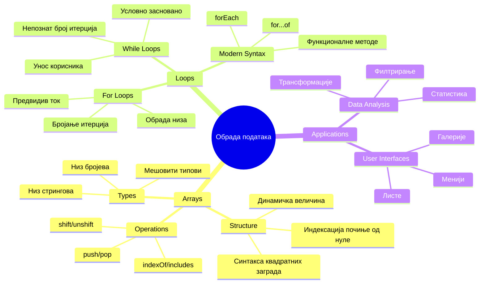
## Низови

Замислите низове као дигитални фајл орман - уместо да чувате један документ по фиоци, можете организовати више повезаних ставки у једном, структурираном контејнеру. У програмерским терминима, низови вам омогућавају да складиштите више информација у једном организованом пакету.

Без обзира да ли правите галерију фотографија, управљате списком задатака или пратите најбоље резултате у игри, низови представљају основу за организацију података. Хајде да видимо како функционишу.

✅ Низови су свуда око нас! Можете ли смислити пример низа у стварном животу, као што је низ соларних панела?

### Креирање низова

Креирање низа је супер једноставно - само користите квадратне заграде!

```javascript
// Празан низ - као празна колица за куповину која чекају на ставке
const myArray = [];
```

**Шта се овде дешава?**
Тек сте креирали празан контејнер коришћењем тих квадратних заграда `[]`. Замислите то као празан полицу у библиотеци - спреман је да држи све књиге које желите да организујете.

Такође можете одмах од почетка да попуните свој низ почетним вредностима:

```javascript
// Мени укуса ваше продавнице сладоледа
const iceCreamFlavors = ["Chocolate", "Strawberry", "Vanilla", "Pistachio", "Rocky Road"];

// Профил корисника (миксирање различитих типова података)
const userData = ["John", 25, true, "developer"];

// Испитни резултати за ваш омиљени предмет
const scores = [95, 87, 92, 78, 85];
```

**Занимљивости које треба приметити:**
- Можете чувати текст, бројеве или чак true/false вредности у истом низу
- Само раздвојите сваки елемент зарезом - лако!
- Низови су савршени за чување повезаних информација заједно

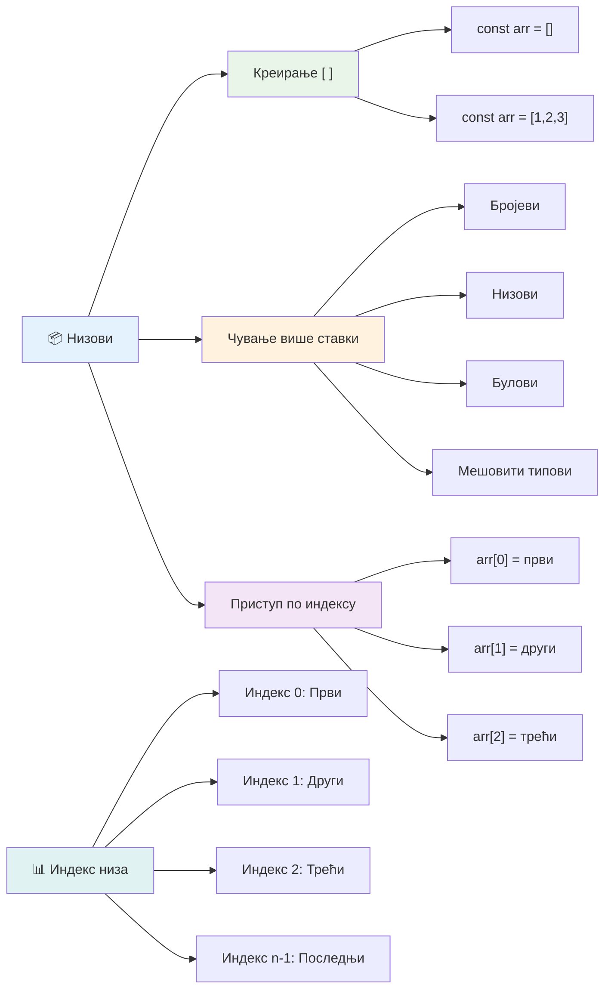
### Индексирање низова

Ево нечега што вам можда на први поглед делује необично: низови броје своје ставке почевши од 0, а не од 1. Ово индексирање од нуле има своје корене у начину на који рачунарска меморија функционише - то је програмерска конвенција још од раних дана рачунарских језика као што је C. Свака позиција у низу добија свој јединствени број који се назива **инекс**.

| Индекс | Вредност | Опис |
|-------|-------|-------------|
| 0 | "Chocolate" | Први елемент |
| 1 | "Strawberry" | Други елемент |
| 2 | "Vanilla" | Трећи елемент |
| 3 | "Pistachio" | Четврти елемент |
| 4 | "Rocky Road" | Пети елемент |

✅ Да ли вас изненађује што низови почињу са индексом нула? У неким програмерским језицима индекси почињу од 1. Око тога постоји занимљива историја коју можете [прочитати на Википедији](https://en.wikipedia.org/wiki/Zero-based_numbering).

**Приступање елементима низа:**

```javascript
const iceCreamFlavors = ["Chocolate", "Strawberry", "Vanilla", "Pistachio", "Rocky Road"];

// Приступ појединачним елементима коришћењем заградне нотације
console.log(iceCreamFlavors[0]); // "Чоколада" - први елемент
console.log(iceCreamFlavors[2]); // "Ванила" - трећи елемент
console.log(iceCreamFlavors[4]); // "Роки Роад" - последњи елемент
```

**Шта се овде дешава:**
- **Користи** квадратне заграде са бројем индекса за приступ елементима
- **Враћа** вредност сачувану на тој специфичној позицији у низу
- **Почиње** бројевати од 0, па је први елемент индекс 0

**Измена елемената низа:**

```javascript
// Промените постојећу вредност
iceCreamFlavors[4] = "Butter Pecan";
console.log(iceCreamFlavors[4]); // "Батер Пекан"

// Додајте нови елемент на крај
iceCreamFlavors[5] = "Cookie Dough";
console.log(iceCreamFlavors[5]); // "Тесто за колачиће"
```

**У горњем примеру смо:**
- **Изменили** елемент са индексом 4 са "Rocky Road" у "Butter Pecan"
- **Додали** нови елемент "Cookie Dough" на индекс 5
- **Аутоматски проширили** дужину низа када се дода елемент изван тренутних граница

### Дужина низа и често коришћене методе

Низови имају уграђена својства и методе које знатно олакшавају рад са подацима.

**Пронаћи дужину низа:**

```javascript
const iceCreamFlavors = ["Chocolate", "Strawberry", "Vanilla", "Pistachio", "Rocky Road"];
console.log(iceCreamFlavors.length); // 5

// Дужина се аутоматски ажурира како се низ мења
iceCreamFlavors.push("Mint Chip");
console.log(iceCreamFlavors.length); // 6
```

**Кључне тачке за памћење:**
- **Враћа** укупан број елемената у низу
- **Аутоматски ажурира** када се додају или уклањају елементи
- **Обезбеђује** динамички број који је користан за петље и валидацију

**Основне методе низа:**

```javascript
const fruits = ["apple", "banana", "orange"];

// Додај елементе
fruits.push("grape");           // Додаје на крај: ["јабука", "банана", "поморанџа", "грожђе"]
fruits.unshift("strawberry");   // Додаје на почетак: ["јагода", "јабука", "банана", "поморанџа", "грожђе"]

// Уклони елементе
const lastFruit = fruits.pop();        // Уклања и враћа "грожђе"
const firstFruit = fruits.shift();     // Уклања и враћа "јагода"

// Пронађи елементе
const index = fruits.indexOf("banana"); // Враћа 1 (позиција "банана")
const hasApple = fruits.includes("apple"); // Враћа тачно
```

**Разумевање ових метода:**
- **Додаје** елементе са `push()` (на крај) и `unshift()` (на почетак)
- **Уклања** елементе са `pop()` (са краја) и `shift()` (са почетка)
- **Пронађе** елементе помоћу `indexOf()` и проверава постојање са `includes()`
- **Враћа** корисне вредности као што су уклоњени елементи или индекси позиција

✅ Испробајте сами! Користите конзолу у вашем прегледачу да креирате и манипулишете сопственим низом.

### 🧠 **Провера основа низа: Организовање података**

**Тестирајте своје разумевање низова:**
- Зашто мислите да низови почињу бројати од 0, а не од 1?
- Шта се деси ако покушате да приступите индексу који не постоји (нпр. `arr[100]` у низу од 5 елемената)?
- Можете ли смислити три сценарија из стварног живота у којима би низови били корисни?

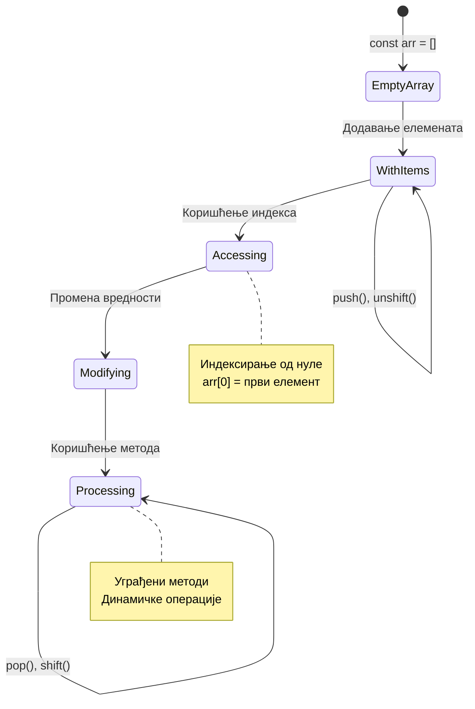
> **Увид из стварног живота**: Низови су свуда у програмирању! Социјалне мреже, корпе за куповину, галерије слика, листе песама - све су то низови иза сцене!

## Петље

Замислите чувену казну из романа Чарлса Дикенса где су ученици морали да пишу реченице по више пута на дасци. Замислите да можете једноставно да наредите некоме „напиши ову реченицу 100 пута“ и да се то аутоматски изврши. Управо то петље раде за ваш код.

Петље су као непознати помоћник који може поновити задатке без грешке. Без обзира да ли треба да проверите сваки предмет у корпи за куповину или да прикажете све фотографије у албуму, петље ефикасно управљају понављањем.

JavaScript пружа неколико типова петљи за избор. Погледајмо сваки и схватимо када их користити.

```mermaid
flowchart TD
    A["🔄 Типови петљи"] --> B["For петља"]
    A --> C["While петља"]
    A --> D["For...of петља"]
    A --> E["forEach метода"]
    
    B --> B1["Познат број итерција"]
    B --> B2["Бројачка"]
    B --> B3["for(init; услов; увећање)"]
    
    C --> C1["Непознат број итерција"]
    C --> C2["Условна"]
    C --> C3["while(услов)"]
    
    D --> D1["Модерни ES6+"]
    D --> D2["Итерација низова"]
    D --> D3["for(елемент из низа)"]
    
    E --> E1["Функционални стил"]
    E --> E2["Метода низа"]
    E --> E3["низ.forEach(повратни_позив)"]
    
    F["⏰ Када користити"] --> F1["For: Бројање, индекси"]
    F --> F2["While: Унос корисника, претраживање"]
    F --> F3["For...of: Једноставна итерација"]
    F --> F4["forEach: Функционално програмирање"]
    
    style A fill:#e3f2fd
    style B fill:#e8f5e8
    style C fill:#fff3e0
    style D fill:#f3e5f5
    style E fill:#e0f2f1
    style F fill:#fce4ec
```
### For петља

`for` петља је као да подесите тајмер - тачно знате колико пута нешто желите да се догоди. Врло је организована и предвидљива, што је чини савршеном када радите са низовима или када треба да бројите нешто.

**Структура for петље:**

| Компонента | Сврха | Пример |
|-----------|---------|----------|
| **Иницијализација** | Поставља почетну тачку | `let i = 0` |
| **Услов** | Када наставити | `i < 10` |
| **Инкремент** | Како ажурирати | `i++` |

```javascript
// Бројање од 0 до 9
for (let i = 0; i < 10; i++) {
  console.log(`Count: ${i}`);
}

// Практичнији пример: обрада резултата
const testScores = [85, 92, 78, 96, 88];
for (let i = 0; i < testScores.length; i++) {
  console.log(`Student ${i + 1}: ${testScores[i]}%`);
}
```

**Корак по корак, ево шта се дешава:**
- **Иницијализује** бројач `i` на 0 на почетку
- **Проверaва** услов `i < 10` пре сваке итерације
- **Извршава** блок кода кад је услов тачан
- **Повећава** `i` за 1 након сваке итерације са `i++`
- **Зауставља** се када услов постане нетачан (кад `i` достигне 10)

✅ Покрените овај код у конзоли прегледача. Шта се деси када направите мале измене бројачу, услову или изразу итерације? Можете ли да га терате уназад, правећи одбројавање?

### 🗓️ **Провера вештине for петље: Контролисано понављање**

**Оцени своје разумевање for петље:**
- Која су три дела for петље и шта сваки ради?
- Како бисте прошли кроз низ уназад?
- Шта се деси ако заборавите део за повећање (`i++`)?

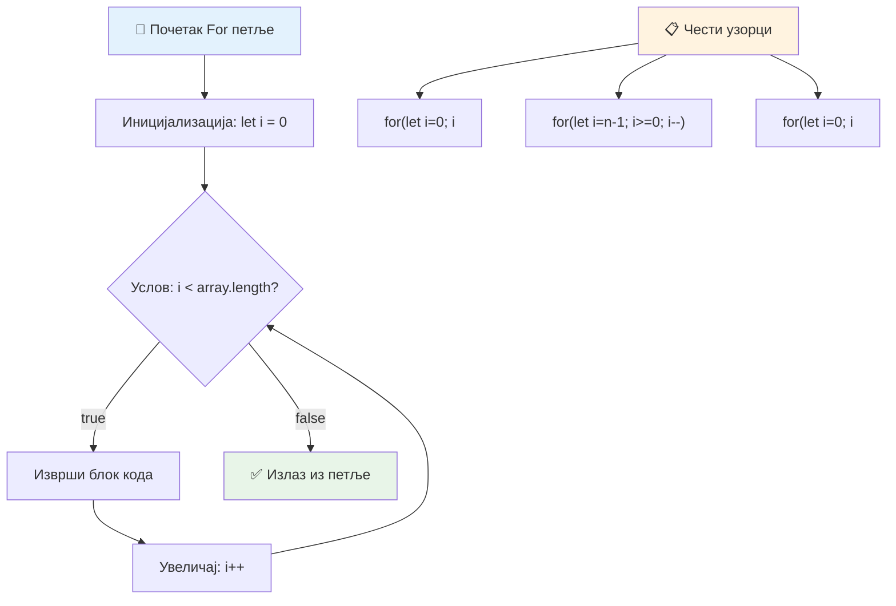
> **Мудрост о петљама**: For петље су савршене кад тачно знате колико пута треба нешто да поновите. Оне су најчешћи избор за обраду низова!

### While петља

`while` петља је као да кажете „настави да радиш ово док...“ - можда не знате колико пута ће се извршити, али знате када да се заустави. Савршена је за ствари као што је тражење уноса корисника док не добијете потребне податке, или претраживање до проналажења резултата.

**Карактеристике while петље:**
- **Наставља** извршавање док је услов тачан
- **Захтева** ручно управљање бројачем ако постоји
- **Проверaва** услов пре сваке итерације
- **Ризикује** бесконачне петље ако услов никада не постане нетачан

```javascript
// Основни пример бројања
let i = 0;
while (i < 10) {
  console.log(`While count: ${i}`);
  i++; // Не заборавите да увећате!
}

// Практичнији пример: обрада уноса корисника
let userInput = "";
let attempts = 0;
const maxAttempts = 3;

while (userInput !== "quit" && attempts < maxAttempts) {
  userInput = prompt(`Enter 'quit' to exit (attempt ${attempts + 1}):`);
  attempts++;
}

if (attempts >= maxAttempts) {
  console.log("Maximum attempts reached!");
}
```

**Разумевање ових примера:**
- **Управља** бројачем `i` ручно унутар тела петље
- **Повећава** бројач да спречи бесконачне петље
- **Приказује** практичну употребу са уносом корисника и ограничењем покушаја
- **Укључује** безбедносне механизме да спречи бескрајно извршавање

### ♾️ **Провера мудрости while петље: Понављање базирано на услову**

**Тестирајте разумевање while петље:**
- Која је главна опасност при коришћењу while петљи?
- Када бисте изабрали while петљу уместо for петље?
- Како спречити бесконачне петље?

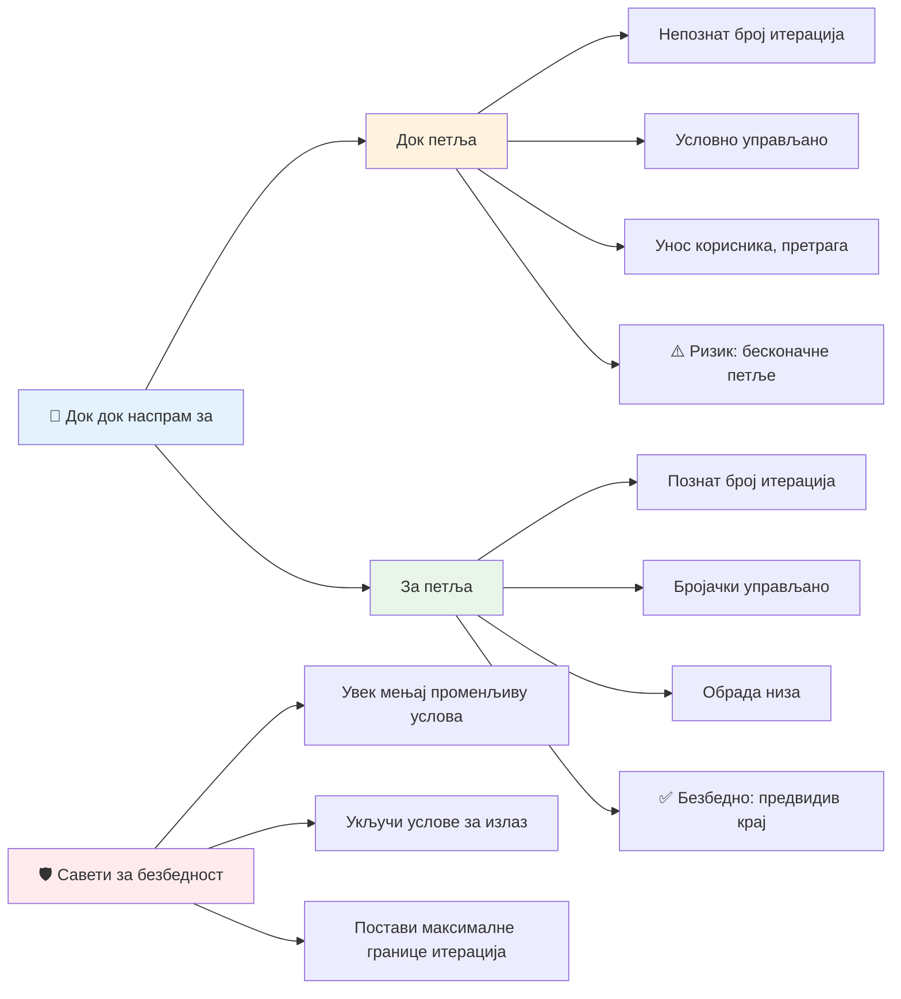
> **Безбедност на првом месту**: While петље су моћне али захтевају пажљиво управљање условом. Увек будите сигурни да ће услов петље на крају постати нетачан!

### Модерне алтернативе петљи

JavaScript нуди модерну синтаксу петљи која може ваш код учинити читљивијим и мање склоним грешкама.

**For...of петља (ES6+):**

```javascript
const colors = ["red", "green", "blue", "yellow"];

// Модеран приступ - чистији и безбеднији
for (const color of colors) {
  console.log(`Color: ${color}`);
}

// Упореди са традиционалном for петљом
for (let i = 0; i < colors.length; i++) {
  console.log(`Color: ${colors[i]}`);
}
```

**Кључне предности for...of:**
- **Уклања** потребу за управљањем индексом и грешкама „обављања“
- **Обезбеђује** директан приступ елементима низа
- **Побољшава** читљивост кода и смањује сложеност синтаксе

**forEach метода:**

```javascript
const prices = [9.99, 15.50, 22.75, 8.25];

// Користећи forEach за стил функционалног програмирања
prices.forEach((price, index) => {
  console.log(`Item ${index + 1}: $${price.toFixed(2)}`);
});

// forEach са стреличним функцијама за једноставне операције
prices.forEach(price => console.log(`Price: $${price}`));
```

**Шта треба знати о forEach:**
- **Извршава** функцију за сваки елемент низа
- **Обезбеђује** вредност елемента и индекс као параметре
- **Не може** се рано прекинути (за разлику од традиционалних петљи)
- **Враћа** undefined (не креира нови низ)

✅ Зашто бисте изабрали for петљу уместо while петље? 17К гледалаца на StackOverflow-у имало је исто питање, а неки од одговора вам могу бити занимљиви [овде](https://stackoverflow.com/questions/39969145/while-loops-vs-for-loops-in-javascript).

### 🎨 **Провера модерне синтаксе петљи: Прихватање ES6+**

**Оцени своје разумевање модерног JavaScript-а:**
- Које су предности `for...of` у односу на традиционалне for петље?
- Када бисте ипак радије користили традиционалне for петље?
- Која је разлика између `forEach` и `map`?

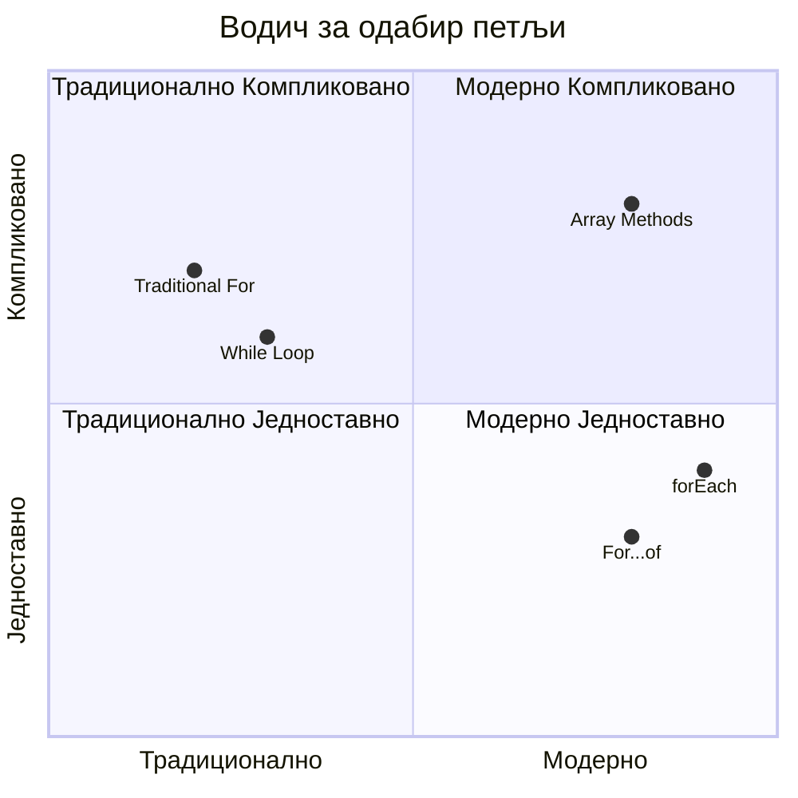
> **Модерни тренд**: ES6+ синтакса као `for...of` и `forEach` постаје преферирани приступ за итерирање низова јер је чистија и мање склона грешкама!

## Петље и низови

Комбиновање низова са петљама ствара моћне могућности обраде података. Ова комбинација је фундаментална за многе програмерске задатке, од приказа листа до израчунавања статистика.

**Традиционална обрада низова:**

```javascript
const iceCreamFlavors = ["Chocolate", "Strawberry", "Vanilla", "Pistachio", "Rocky Road"];

// Класичан приступ помоћу for петље
for (let i = 0; i < iceCreamFlavors.length; i++) {
  console.log(`Flavor ${i + 1}: ${iceCreamFlavors[i]}`);
}

// Модеран приступ помоћу for...of петље
for (const flavor of iceCreamFlavors) {
  console.log(`Available flavor: ${flavor}`);
}
```

**Разумемо следеће приступе:**
- **Користи** својство дужине низа за одређивање граница петље
- **Приступа** елементима по индексу у традиционалним for петљама
- **Обезбеђује** директан приступ елементима у for...of петљама
- **Обрађује** сваки елемент тачно једном

**Пример практичне обраде података:**

```javascript
const studentGrades = [85, 92, 78, 96, 88, 73, 89];
let total = 0;
let highestGrade = studentGrades[0];
let lowestGrade = studentGrades[0];

// Обрадите све оцене у једној петљи
for (let i = 0; i < studentGrades.length; i++) {
  const grade = studentGrades[i];
  total += grade;
  
  if (grade > highestGrade) {
    highestGrade = grade;
  }
  
  if (grade < lowestGrade) {
    lowestGrade = grade;
  }
}

const average = total / studentGrades.length;
console.log(`Average: ${average.toFixed(1)}`);
console.log(`Highest: ${highestGrade}`);
console.log(`Lowest: ${lowestGrade}`);
```

**Ево како овај код функционише:**
- **Иницијализује** променљиве за праћење збира и екстрема
- **Обрађује** сваки резултат једном ефикасном петљом
- **Сабира** укупан зброј за израчунавање просека
- **Практикује** праћење највеће и најмање вредности током итерације
- **Израчунава** коначну статистику након завршетка петље

✅ Иградите сопствени низ и експериментишите са петљама у конзоли свог прегледача.

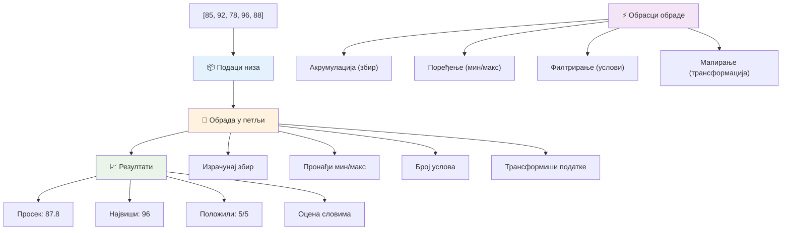
---

## Изазов са GitHub Copilot Agent-ом 🚀

Користите Agent режим за завршетак следећег изазова:

**Опис:** Направите свеобухватну функцију за обраду података која комбинује низове и петље за анализу скупа података и генерисање значајних увида.

**Задатак:** Направите функцију под називом `analyzeGrades` која прими низ објеката о студентским оценама (сваки садржи име и резултат) и враћа објекат са статистикама, укључујући највиши резултат, најнижи резултат, просечан резултат, број пролазника (резултат >= 70) и низ имена студената са резултатима изнад просека. У свом решењу користите најмање две различите врсте петљи.

Сазнајте више о [agent режиму](https://code.visualstudio.com/blogs/2025/02/24/introducing-copilot-agent-mode) овде.

## 🚀 Изазов
JavaScript нуди неколико модерних метода за низове који могу заменити традиционалне петље за специфичне задатке. Истражите [forEach](https://developer.mozilla.org/docs/Web/JavaScript/Reference/Global_Objects/Array/forEach), [for-of](https://developer.mozilla.org/docs/Web/JavaScript/Reference/Statements/for...of), [map](https://developer.mozilla.org/docs/Web/JavaScript/Reference/Global_Objects/Array/map), [filter](https://developer.mozilla.org/docs/Web/JavaScript/Reference/Global_Objects/Array/filter) и [reduce](https://developer.mozilla.org/docs/Web/JavaScript/Reference/Global_Objects/Array/reduce). 

**Ваша такмичење:** Преформатирајте пример са оцена ученика користећи најмање три различите методе за низове. Приметите колико код постаје чистији и читљивији уз модерни JavaScript синтакс.

## Квиз након предавања
[Квиз након предавања](https://ff-quizzes.netlify.app/web/quiz/14)


## Преглед и самостално учење

Низови у JavaScript-у имају много метода које су изузетно корисне за манипулацију подацима. [Прочитајте о овим методама](https://developer.mozilla.org/docs/Web/JavaScript/Reference/Global_Objects/Array) и испробајте неке од њих (као што су push, pop, slice и splice) на низу по вашем избору.

## Задатак

[Прочитај низ](assignment.md)

---

## 📊 **Резиме вашег алата за низове и петље**

```mermaid
graph TD
    A["🎯 Мастерство низова и петљи"] --> B["📦 Основе низова"]
    A --> C["🔄 Типови петљи"]
    A --> D["🔗 Обрада података"]
    A --> E["🎨 Модерне технике"]
    
    B --> B1["Креирање: [ ]"]
    B --> B2["Индексирање: arr[0]"]
    B --> B3["Методе: push, pop"]
    B --> B4["Својства: length"]
    
    C --> C1["For: Познат број итерација"]
    C --> C2["While: Засновано на услову"]
    C --> C3["For...of: Директан приступ"]
    C --> C4["forEach: Функционално"]
    
    D --> D1["Израчун статистике"]
    D --> D2["Трансформација података"]
    D --> D3["Филтрирање и претрага"]
    D --> D4["Обрада у реалном времену"]
    
    E --> E1["Arrow функције"]
    E --> E2["Повезивање метода"]
    E --> E3["Деструктурирање"]
    E --> E4["Шаблонски литерали"]
    
    F["💡 Кључне користи"] --> F1["Ефикасно руковање подацима"]
    F --> F2["Мања понављања кода"]
    F --> F3["Скалабилна решења"]
    F --> F4["Чистија синтакса"]
    
    style A fill:#e3f2fd
    style B fill:#e8f5e8
    style C fill:#fff3e0
    style D fill:#f3e5f5
    style E fill:#e0f2f1
    style F fill:#fce4ec
```
---

## 🚀 Календар савладавања низа и петљи

### ⚡ **Шта можете урадити у наредних 5 минута**
- [ ] Креирајте низ омиљених филмова и приступите специфичним елементима
- [ ] Напишите for петљу која броји од 1 до 10
- [ ] Испробајте изазов са модерним методама низова из лекције
- [ ] Вежбајте индексирање низа у конзоли претраживача

### 🎯 **Шта можете постићи у овом сату**
- [ ] Завршите квиз након лекције и прегледајте делове који су тешки
- [ ] Изградите свеобухватан анализатор оцена из GitHub Copilot изазова
- [ ] Креирајте једноставну корпу за куповину која додаје и уклања ставке
- [ ] Вежбајте претварање између различитих типова петљи
- [ ] Експериментишите са методама низа као што су `push`, `pop`, `slice` и `splice`

### 📅 **Ваша недељна обрада података**
- [ ] Завршите задатак "Прочитај низ" уз креативна побољшања
- [ ] Направите апликацију за то-до листу користећи низове и петље
- [ ] Креирајте једноставан калкулатор статистике за бројчане податке
- [ ] Вежбајте са [MDN методама за низове](https://developer.mozilla.org/docs/Web/JavaScript/Reference/Global_Objects/Array)
- [ ] Направите галерију фотографија или интерфејс за листу песама
- [ ] Истражите функционално програмирање помоћу `map`, `filter` и `reduce`

### 🌟 **Ваш месечни трансформацијски план**
- [ ] Савладајте напредне операције на низовима и оптимизацију перформанси
- [ ] Изградите комплетан табло за визуелизацију података
- [ ] Допринесите пројектима отвореног кода који се баве обрадом података
- [ ] Подучите неког другог о низовима и петљама уз практичне примере
- [ ] Креирајте личну библиотеку поново употребљивих функција за обраду података
- [ ] Истражите алгоритме и структуре података базиране на низовима

### 🏆 **Коначни преглед шампиона обраде података**

**Прославите своје умеће у раду са низовима и петљама:**
- Која је најкориснија операција над низовима коју сте научили за реалне апликације?
- Који тип петље вам највише прија и зашто?
- Како вам је разумевање низова и петљи променило приступ организовању података?
- Који компликовани задатак обраде података бисте желели да решите следећи?

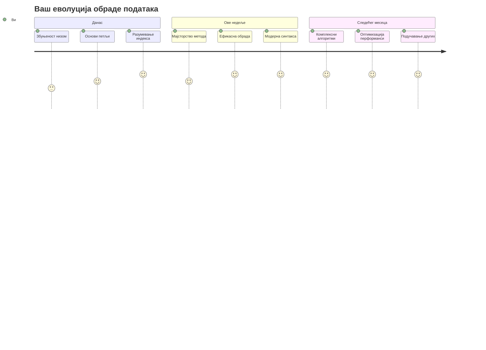
> 📦 **Откључали сте моћ организације и обраде података!** Низови и петље су темељ скоро сваке апликације коју изградите. Од једноставних листа до сложене анализе података, сада имате алате да ефикасно и елегантно управљате информацијама. Сваки динамичан веб сајт, мобилна апликација и апликација заснована на подацима ослањају се на ове основне концепте. Добродошли у свет скалабилне обраде података! 🎉

---

<!-- CO-OP TRANSLATOR DISCLAIMER START -->
**Одрицање од одговорности**:  
Овај документ је преведен коришћењем AI преводилачке услуге [Co-op Translator](https://github.com/Azure/co-op-translator). Иако се трудимо да обезбедимо прецизност, имајте у виду да аутоматски преводи могу садржати грешке или нетачности. Оригинални документ на свом изворном језику треба сматрати ауторитетним извором. За критичне информације препоручује се професионални превод од стране човека. Нисмо одговорни за било каква неспоразума или погрешне интерпретације које могу настати коришћењем овог превода.
<!-- CO-OP TRANSLATOR DISCLAIMER END -->