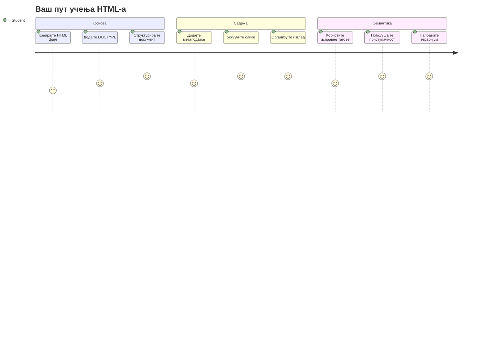
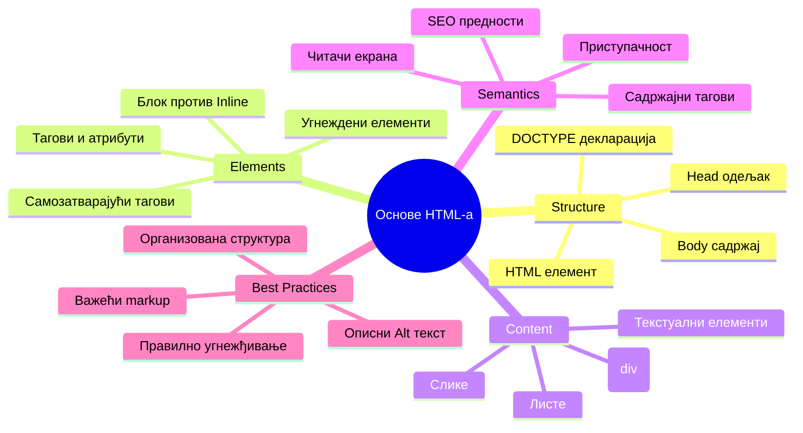
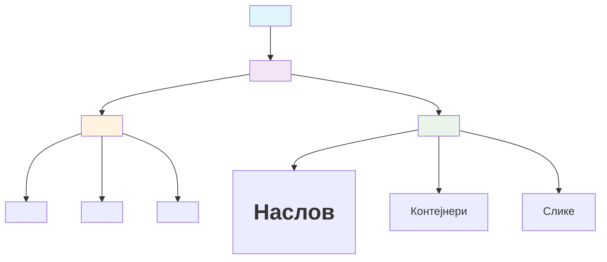
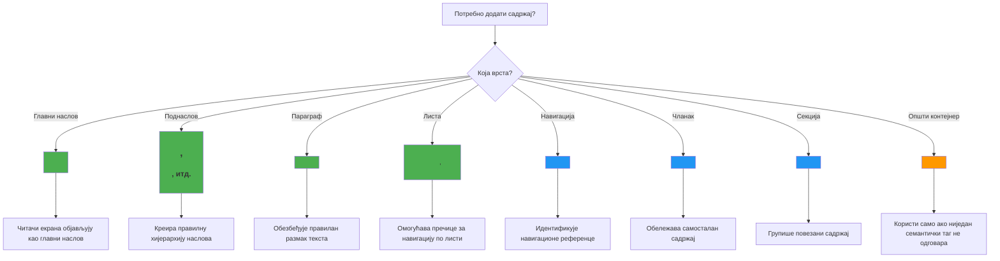
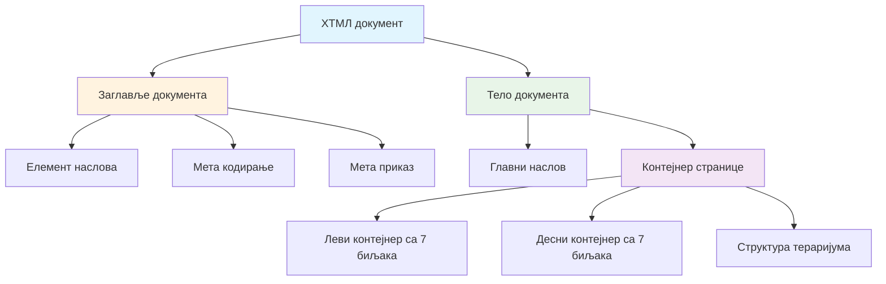
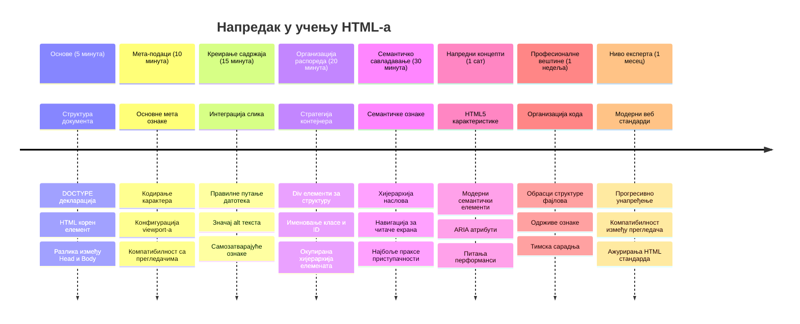

<!--
CO_OP_TRANSLATOR_METADATA:
{
  "original_hash": "3fcfa99c4897e051b558b5eaf1e8cc74",
  "translation_date": "2026-01-07T08:20:29+00:00",
  "source_file": "3-terrarium/1-intro-to-html/README.md",
  "language_code": "sr"
}
-->
# Terrarium Project Deo 1: Uvod u HTML



> Sketchnote autora [Tomomi Imura](https://twitter.com/girlie_mac)

HTML, ili HyperText Markup Language, je osnova svake web stranice koju ste ikada posetili. Zamislite HTML kao kostur koji daje strukturu veb stranicama – on definiše gde sadržaj ide, kako je organizovan i šta svaki deo predstavlja. Dok će CSS kasnije "ukrasiti" vaš HTML bojama i rasporedima, a JavaScript oživeti interaktivnošću, HTML pruža osnovnu strukturu koja sve ostalo omogućava.

U ovoj lekciji napravićete HTML strukturu za virtuelni interfejs terarijuma. Ovaj projekat iz prve ruke naučiće vas osnovnim HTML pojmovima dok gradite nešto vizuelno zanimljivo. Naučićete kako da organizujete sadržaj koristeći semantičke elemente, radite sa slikama i napravite osnovu za interaktivnu veb aplikaciju.

Na kraju lekcije imaćete radnu HTML stranicu koja prikazuje slike biljaka u organizovanim kolonama, spremnu za stilizaciju u sledećoj lekciji. Ne brinite ako na početku izgleda jednostavno – to je upravo ono što HTML treba da bude pre nego što CSS doda vizuelni sjaj.


## Pre-večerna provera znanja

[Pre-večerni kviz](https://ff-quizzes.netlify.app/web/quiz/15)

> 📺 **Gledajte i učite**: Pogledajte ovaj koristan video pregled
> 
> [](https://www.youtube.com/watch?v=1TvxJKBzhyQ)

## Postavljanje vašeg projekta

Pre nego što zaronimo u HTML kod, hajde da postavimo odgovarajući radni prostor za vaš projekat terarijuma. Kreiranje organizovane strukture fajlova od samog početka je važna navika koja će vam koristiti tokom celog puta razvoja veba.

### Zadatak: Napravite strukturu vašeg projekta

Napravite poseban folder za projekat terarijuma i dodajte svoj prvi HTML fajl. Evo dva pristupa koja možete koristiti:

**Opcija 1: Korišćenje Visual Studio Code**
1. Otvorite Visual Studio Code
2. Kliknite na "File" → "Open Folder" ili koristite `Ctrl+K, Ctrl+O` (Windows/Linux) ili `Cmd+K, Cmd+O` (Mac)
3. Kreirajte novi folder pod imenom `terrarium` i izaberite ga
4. U Explorer panelu kliknite na ikonu "New File"
5. Imenovajte fajl `index.html`


**Opcija 2: Korišćenje komandne linije**
```bash
mkdir terrarium
cd terrarium
touch index.html
code index.html
```

**Ovo je šta ove komande rade:**
- **Prave** novi direktorijum nazvan `terrarium` za vaš projekat
- **Ulaze** u direktorijum terrarium
- **Prave** prazan fajl `index.html`
- **Otvaraju** fajl u Visual Studio Code za uređivanje

> 💡 **Pro savet**: Ime fajla `index.html` je specijalno u razvoju veba. Kada neko poseti web sajt, pregledači automatski traže `index.html` kao podrazumevanu stranicu za prikazivanje. To znači da URL kao `https://mysite.com/projects/` automatski prikazuje `index.html` fajl iz `projects` foldera bez potrebe da se ime fajla eksplicitno navodi u URL-u.

## Razumevanje strukture HTML dokumenta

Svaki HTML dokument prati određenu strukturu koju pregledači moraju razumeti i pravilno prikazati. Zamislite ovu strukturu kao formalno pismo – ima obavezne elemente u određenom redosledu koji pomažu primaocu (u ovom slučaju pregledaču) da obradi sadržaj ispravno.


Počnimo dodavanjem osnovne osnove koja je potrebna svakom HTML dokumentu.

### DOCTYPE deklaracija i korenski element

Prve dve linije bilo kog HTML fajla služe kao "uvod" dokumenta za pregledač:

```html
<!DOCTYPE html>
<html></html>
```

**Razumevanje šta ovaj kod radi:**
- **Deklariše** tip dokumenta kao HTML5 korišćenjem `<!DOCTYPE html>`
- **Pravi** korenski `<html>` element koji sadrži sav sadržaj stranice
- **Uspostavlja** moderne veb standarde za pravilno prikazivanje u pregledačima
- **Osigurava** dosledan prikaz na različitim pregledačima i uređajima

> 💡 **VS Code savet**: Zadržite pokazivač miša iznad bilo kog HTML taga u VS Code-u da vidite korisne informacije iz MDN Web Docs, uključujući primere korišćenja i detalje o kompatibilnosti sa pregledačima.

> 📚 **Saznajte više**: DOCTYPE deklaracija sprečava da pregledači uđu u "quirks mode", koji se koristio za podršku veoma starim sajtovima. Moderni razvoj veba koristi jednostavnu `<!DOCTYPE html>` deklaraciju da bi obezbedio [prikaz po standardima](https://developer.mozilla.org/docs/Web/HTML/Quirks_Mode_and_Standards_Mode).

### 🔄 **Pedagoška provera**
**Pauzirajte i razmislite**: Pre nego što nastavite, uverite se da razumete:
- ✅ Zašto svaki HTML dokument treba DOCTYPE deklaraciju
- ✅ Šta sadrži `<html>` korenski element
- ✅ Kako ova struktura pomaže pregledačima da pravilno prikazuju stranice

**Brzi auto-test**: Možete li svojim rečima objasniti šta znači "prikaz po standardima"?

## Dodavanje ključnih meta podataka dokumenta

Sekcija `<head>` HTML dokumenta sadrži ključne informacije koje pregledači i pretraživači trebaju, ali koje posetioci ne vide direktno na stranici. Zamislite je kao "iza kulisa" informacije koje pomažu vašoj stranici da pravilno funkcioniše i da se pravilno prikazuje na različitim uređajima i platformama.

Ovi meta podaci govore pregledačima kako da prikažu stranicu, koji karakter encoding da koriste i kako da se nose sa različitim veličinama ekrana – sve je to esencijalno za pravljenje profesionalnih, pristupačnih veb stranica.

### Zadatak: Dodajte deo zaglavlja dokumenta

Ubacićete ovu `<head>` sekciju između vaših početnih i završnih `<html>` tagova:

```html
<head>
	<title>Welcome to my Virtual Terrarium</title>
	<meta charset="utf-8" />
	<meta http-equiv="X-UA-Compatible" content="IE=edge" />
	<meta name="viewport" content="width=device-width, initial-scale=1" />
</head>
```

**Razlaganje šta svaki element postiže:**
- **Postavlja** naslov stranice koji se pojavljuje u tabovima pregledača i rezultatima pretrage
- **Specifikuje** UTF-8 kodiranje karaktera radi pravilnog prikaza teksta širom sveta
- **Obezbeđuje** kompatibilnost sa modernim verzijama Internet Explorera
- **Konfiguriše** responzivni dizajn tako što podešava viewport da odgovara širini uređaja
- **Kontroliše** početni nivo zumiranja da prikaže sadržaj u prirodnoj veličini

> 🤔 **Razmislite o ovome**: Šta bi se desilo ako biste postavili viewport meta tag ovako: `<meta name="viewport" content="width=600">`? Ovo bi forsiralo da stranica uvek bude široka 600 piksela, čime bi bio narušen responzivni dizajn! Saznajte više o [ispravnoj konfiguraciji viewporta](https://developer.mozilla.org/docs/Web/HTML/Viewport_meta_tag).

## Izgradnja tela dokumenta

Element `<body>` sadrži sav vidljivi sadržaj vaše veb stranice – sve što će korisnici videti i sa čim će komunicirati. Dok je sekcija `<head>` davala uputstva pregledaču, sekcija `<body>` sadrži pravi sadržaj: tekst, slike, dugmad i druge elemente koji stvaraju vaš korisnički interfejs.

Dodajmo strukturu tela i razumimo kako HTML tagovi rade zajedno da kreiraju smisleni sadržaj.

### Razumevanje strukture HTML tagova

HTML koristi uparene tagove da definiše elemente. Većina tagova ima početni tag kao `<p>` i završni tag kao `</p>`, sa sadržajem između: `<p>Zdravo, svete!</p>`. To pravi paragraf koji sadrži tekst "Zdravo, svete!".

### Zadatak: Dodajte body element

Ažurirajte svoj HTML fajl tako da uključi `<body>` element:

```html
<!DOCTYPE html>
<html>
	<head>
		<title>Welcome to my Virtual Terrarium</title>
		<meta charset="utf-8" />
		<meta http-equiv="X-UA-Compatible" content="IE=edge" />
		<meta name="viewport" content="width=device-width, initial-scale=1" />
	</head>
	<body></body>
</html>
```

**Evo šta ova kompletna struktura omogućava:**
- **Uspostavlja** osnovni HTML5 okvir dokumenta
- **Uključuje** ključne meta podatke za pravilno prikazivanje u pregledaču
- **Pravi** prazno telo spremno za vaš vidljivi sadržaj
- **Prati** najbolje prakse modernog razvoja veba

Sada ste spremni da dodate vidljive elemente vašeg terarijuma. Koristićemo `<div>` elemente kao kontejnere za organizovanje različitih sekcija sadržaja i `` elemente za prikaz slika biljaka.

### Rad sa slikama i kontejnerima za raspored

Slike su posebne u HTML-u jer koriste "self-closing" tagove. Za razliku od elemenata kao što su `<p></p>` koji obuhvataju sadržaj, `` tag sadrži sve potrebne informacije unutar samog taga pomoću atributa kao što su `src` za putanju do slike i `alt` za pristupačnost.

Pre nego što dodate slike u svoj HTML, moraćete da pravilno organizujete fajlove projekta tako što ćete napraviti folder za slike i dodati grafike biljaka.

**Prvo, pripremite svoje slike:**
1. Napravite folder pod imenom `images` unutar foldera terarijuma
2. Preuzmite slike biljaka iz [solution foldera](../../../../3-terrarium/solution/images) (ukupno 14 slika biljaka)
3. Kopirajte sve slike biljaka u novi `images` folder

### Zadatak: Napravite raspored za prikaz biljaka

Sada dodajte slike biljaka organizovane u dve kolone između vaših `<body></body>` tagova:

```html
<div id="page">
	<div id="left-container" class="container">
		<div class="plant-holder">
			
		</div>
		<div class="plant-holder">
			
		</div>
		<div class="plant-holder">
			
		</div>
		<div class="plant-holder">
			
		</div>
		<div class="plant-holder">
			
		</div>
		<div class="plant-holder">
			
		</div>
		<div class="plant-holder">
			
		</div>
	</div>
	<div id="right-container" class="container">
		<div class="plant-holder">
			
		</div>
		<div class="plant-holder">
			
		</div>
		<div class="plant-holder">
			
		</div>
		<div class="plant-holder">
			
		</div>
		<div class="plant-holder">
			
		</div>
		<div class="plant-holder">
			
		</div>
		<div class="plant-holder">
			
		</div>
	</div>
</div>
```

**Korak po korak, evo šta se dešava u ovom kodu:**
- **Pravi** glavni kontejner stranice sa `id="page"` za držanje celog sadržaja
- **Usvaja** dva kontejnera za kolone: `left-container` i `right-container`
- **Organizuje** 7 biljaka u levoj koloni i 7 biljaka u desnoj koloni
- **Obavija** svaku sliku biljke u `plant-holder` div radi pojedinačnog pozicioniranja
- **Primjenjuje** dosledne nazive klasa za CSS stilizaciju u sledećoj lekciji
- **Dodeljuje** jedinstvene ID-e svakom slici biljke za JavaScript interakciju kasnije
- **Uključuje** ispravne putanje do foldera sa slikama

> 🤔 **Razmislite o ovome**: Primetite da sve slike trenutno imaju isti alt tekst "plant". Ovo nije idealno za pristupačnost. Korisnici sa čitačima ekrana bi čuli "plant" 14 puta zaredom bez saznanja koja konkretna biljka je prikazana. Možete li smisliti bolje, opisnije alt tekstove za svaku sliku?

> 📝 **Tipovi HTML elemenata**: `<div>` elementi su "blok nivoa" i zauzimaju punu širinu, dok su `<span>` elementi "inline" i zauzimaju samo potrebnu širinu. Šta mislite šta bi se dogodilo ako biste promenili sve ove `<div>` tagove u `<span>` tagove?

### 🔄 **Pedagoška provera**
**Razumevanje strukture**: Uzmite trenutak da pregledate svoju HTML strukturu:
- ✅ Možete li identifikovati glavne kontejnere u vašem rasporedu?
- ✅ Razumete li zašto svaka slika ima jedinstveni ID?
- ✅ Kako biste opisali svrhu `plant-holder` divova?

**Vizuelna inspekcija**: Otvorite svoj HTML fajl u pregledaču. Trebalo bi da vidite:
- Osnovnu listu slika biljaka
- Slike organizovane u dve kolone
- Jednostavan, nestilizovani raspored

**Zapamtite**: Ovaj jednostavan izgled je upravo ono što HTML treba da izgleda pre stilizacije CSS-om!

Sa ovim dodatkom oznake, biljke će se pojaviti na ekranu, mada još neće izgledati dotjerano – za to služi CSS u sledećoj lekciji! Za sada imate čvrstu HTML osnovu koja pravilno organizuje vaš sadržaj i prati najbolje prakse za pristupačnost.

## Korišćenje semantičkog HTML-a za pristupačnost

Semantički HTML znači biranje HTML elemenata na osnovu njihovog značenja i svrhe, a ne samo izgleda. Kada koristite semantički markup, komunicirate strukturu i značenje svog sadržaja pregledačima, pretraživačima i asistivnim tehnologijama poput čitača ekrana.


Ovaj pristup čini vaše sajtove pristupačnijim korisnicima sa invaliditetom i pomaže pretraživačima da bolje razumeju vaš sadržaj. To je osnovni princip modernog veb razvoja koji stvara bolje iskustvo za sve.

### Dodavanje semantičkog naslova stranice

Dodajmo pravi naslov na vašu terarijum stranicu. Ubacite ovaj red odmah posle otvarajućeg `<body>` taga:

```html
<h1>My Terrarium</h1>
```

**Zašto je semantički markup važan:**
- **Pomaže** čitačima ekrana da lakše navigiraju i razumeju strukturu stranice
- **Poboljšava** SEO tako što razjašnjava hijerarhiju sadržaja
- **Unapređuje** pristupačnost za korisnike sa oštećenjem vida ili kognitivnim razlikama
- **Pravi** bolje korisničko iskustvo na svim uređajima i platformama
- **Prati** veb standarde i najbolje prakse za profesionalni razvoj

**Primeri semantičkog u odnosu na nese-mantički izbor:**

| Svrha | ✅ Semantički izbor | ❌ Nese-mantički izbor |
|---------|-------------------|------------------------|
| Glavni naslov | `<h1>Naslov</h1>` | `<div class="big-text">Naslov</div>` |
| Navigacija | `<nav><ul><li></li></ul></nav>` | `<div class="menu"><div></div></div>` |
| Dugme | `<button>Klikni me</button>` | `<span onclick="...">Klikni me</span>` |
| Sadržaj članka | `<article><p></p></article>` | `<div class="content"><div></div></div>` |

> 🎥 **Pogledajte u praksi**: Pogledajte [kako čitači ekrana komuniciraju sa veb stranicama](https://www.youtube.com/watch?v=OUDV1gqs9GA) da biste razumeli zašto je semantički markup ključan za pristupačnost. Primetite kako pravilna HTML struktura pomaže korisnicima da efikasno navigiraju.

## Kreiranje terarijum kontejnera

Sada dodajmo HTML strukturu za sam terarijum – staklenu posudu u kojoj će biljke na kraju biti smeštene. Ova sekcija ilustruje važan koncept: HTML pruža strukturu, ali bez CSS stilizacije ovi elementi još neće biti vidljivi.

Terarijum markup koristi opisne nazive klasa koje će učiniti CSS stilizaciju intuitivnom i lako održivom u sledećoj lekciji.

### Zadatak: Dodajte strukturu terarijuma

Ubacite ovaj markup iznad poslednjeg `</div>` taga (pre zatvarajućeg taga kontejnera stranice):

```html
<div id="terrarium">
	<div class="jar-top"></div>
	<div class="jar-walls">
		<div class="jar-glossy-long"></div>
		<div class="jar-glossy-short"></div>
	</div>
	<div class="dirt"></div>
	<div class="jar-bottom"></div>
</div>
```

**Razumevanje ove terarijumske strukture:**
- **Pravi** glavni kontejner terarijuma sa jedinstvenim ID-jem za stilizaciju
- **Дефинише** посебне елементе за сваку визуелну компоненту (горе, зидови, прљавштина, дно)  
- **Укључује** угнежђене елементе за ефекте рефлексије стакла (сјајни елементи)  
- **Користи** описне класе које јасно указују на сврху сваког елемента  
- **Припрема** структуру за CSS стилизовање која ће створити изглед стакленог тераријума  

> 🤔 **Приметили сте нешто?**: Чак иако сте додали ову ознаку, не видите ништа ново на страници! Ово савршено илуструје како HTML пружа структуру док CSS пружа изглед. Ови `<div>` елементи постоје, али још немају визуелно стилизовање – то ће доћи у наредној лекцији!  


### 🔄 **Педагошки преглед**  
**Мастерисање HTML структуре**: Пре него што наставите, увјерите се да можете:  
- ✅ Објаснити разлику између HTML структуре и визуелног изгледа  
- ✅ Препознати семантичке и не-семантичке HTML елементе  
- ✅ Описати како исправна ознака користи приступачности  
- ✅ Препознати потпуну структуру стабла документа  

**Тестирање вашег разумевања**: Покушајте да отворите свој HTML фајл у прегледачу са искљученим JavaScript-ом и без CSS-а. Ово вам показује јасну семантичку структуру коју сте креирали!  

---  

## Изазов GitHub Copilot агента  

Користите Agent режим да завршите следећи изазов:  

**Опис:** Креирајте семантичку HTML структуру за одељак водича за негу биљака који се може додати пројекту тераријума.  

**Задатак:** Направите семантички HTML одељак који укључује главни наслов „Водич за негу биљака“, три пододељка са насловима „Заливање“, „Потребе за светлом“ и „Нега земље“, од којих сваки садржи параграф са информацијама о нези биљака. Користите исправне семантичке HTML тегове као што су `<section>`, `<h2>`, `<h3>`, и `<p>` за одговарајућу структуру садржаја.  

Сазнајте више о [agent mode](https://code.visualstudio.com/blogs/2025/02/24/introducing-copilot-agent-mode) овде.  

## Изазов Историје HTML-а  

**Учите о еволуцији веба**  

HTML се значајно развио од када је Тим Бернерс-Ли креирао први веб претраживач у ЦЕРН-у 1990. године. Неки старији тагови као што је `<marquee>` су сада застарели јер се лоше слажу са савременим стандардима приступачности и принципима адаптивног дизајна.  

**Испробајте овај експеримент:**  
1. Привремено упакујте свој `<h1>` наслов у `<marquee>` таг: `<marquee><h1>My Terrarium</h1></marquee>`  
2. Отворите страницу у прегледачу и посматрајте ефекат скроловања  
3. Размислите зашто је овај таг застарео (савет: размислите о корисничком искуству и приступачности)  
4. Уклonite `<marquee>` таг и вратite се на семантичку ознаку  

**Питања за размишљање:**  
- Како би скролујући наслов могао утицати на кориснике са оштећењем вида или осетљивошћу на покрет?  
- Које савремене CSS технике могу достићи сличне визуелне ефекте са већом приступачношћу?  
- Зашто је важно користити тренутне веб стандарде уместо застарелих елемената?  

Истражите више о [застарелим и забрањеним HTML елементима](https://developer.mozilla.org/docs/Web/HTML/Element#Obsolete_and_deprecated_elements) да бисте разумели како се веб стандарди развијају да би побољшали корисничко искуство.  

## Квиз након предавања  

[Квиз након предавања](https://ff-quizzes.netlify.app/web/quiz/16)  

## Преглед и самостално учење  

**Продубите своје знање о HTML-у**  

HTML је темељ веба више од 30 година, развијен од једноставног језика за означавање докумената до софистициране платформе за изградњу интерактивних апликација. Разумевање ове еволуције помаже вам да цените савремене веб стандарде и донесете боље одлуке у развоју.  

**Препоручени путеви учења:**  

1. **Историја и еволуција HTML-а**  
   - Истражите временску линију од HTML 1.0 до HTML5  
   - Испитајте зашто су одређени тагови застарели (приступачност, прилагодљивост мобилним уређајима, одрживост)  
   - Истражите нове HTML функције и предлоге  

2. **Детаљно проучавање семантичког HTML-а**  
   - Проучите комплетну листу [семантичких елемената HTML5](https://developer.mozilla.org/docs/Web/HTML/Element)  
   - Увежбајте препознавање када користити `<article>`, `<section>`, `<aside>`, и `<main>`  
   - Сазнајте о ARIA атрибутима за побољшану приступачност  

3. **Модерни веб развој**  
   - Истражите [изградњу адаптивних сајтова](https://docs.microsoft.com/learn/modules/build-simple-website/?WT.mc_id=academic-77807-sagibbon) на Microsoft Learn  
   - Разумите како се HTML интегрише са CSS-ом и JavaScript-ом  
   - Упознајте се са најбољим праксама за веб перформансе и SEO  

**Питања за размишљање:**  
- Које сте застареле HTML тагове пронашли и зашто су уклоњени?  
- Које се нове HTML функције предлажу за будуће верзије?  
- Како семантички HTML доприноси приступачности веба и SEO-у?  

### ⚡ **Шта можете урадити у наредних 5 минута**  
- [ ] Отворите DevTools (F12) и прегледајте HTML структуру ваше омиљене веб странице  
- [ ] Направите једноставан HTML фајл са основним теговима: `<h1>`, `<p>`, и ``  
- [ ] Валидација вашег HTML-а помоћу W3C HTML Validator онлајн  
- [ ] Покушајте да додате коментар у HTML користећи `<!-- comment -->`  

### 🎯 **Шта можете постићи овај сат**  
- [ ] Завршити квиз након лекције и прегледати концепте семантичког HTML-а  
- [ ] Направити једноставну веб страницу о себи користећи исправну HTML структуру  
- [ ] Експериментисати са различитим нивоима наслова и теговима за форматирање текста  
- [ ] Додати слике и линкове ради вежбе мултимедијалне интеграције  
- [ ] Истражити HTML5 функције које још нисте пробали  

### 📅 **Ваш седмодневни HTML план**  
- [ ] Завршити пројекат тераријума са семантичком ознаком  
- [ ] Креирати приступачну веб страницу користећи ARIA ознаке и улоге  
- [ ] Вежбати прављење форми са различитим типовима уноса  
- [ ] Истражити HTML5 API-је као што су localStorage или геолокација  
- [ ] Учитати адаптивне HTML шаблоне и мобилни приступ дизајну  
- [ ] Прегледати HTML код других програмера за најбоље праксе  

### 🌟 **Ваш месечни темељ за веб**  
- [ ] Направити портфолио веб сајт који показује ваше HTML умеће  
- [ ] Научити шаблонирање HTML-а са оквиром као што је Handlebars  
- [ ] Придонети open source пројектима побољшавајући HTML документацију  
- [ ] Мастерисати напредне HTML концепте као што су прилагођени елементи  
- [ ] Интегрисати HTML са CSS фрејмворцима и JavaScript библиотекама  
- [ ] Менторовати друге који уче основе HTML-а  

## 🎯 Ваш временски план за савладавање HTML-а  


### 🛠️ Сажетак вашег HTML алата  

Након завршетка ове лекције, сада имате:  
- **Структуру документа**: Потпуну HTML5 основу са исправним DOCTYPE-ом  
- **Семантичку ознаку**: Садржајне ознаке које побољшавају приступачност и SEO  
- **Интеграцију слика**: Исправну организацију фајлова и праксе за alt текст  
- **Контенере распореда**: Стратешко коришћење div елемената са описним класама  
- **Свесност о приступачности**: Разумевање навигације помоћу читача екрана  
- **Модерне стандарде**: Тренутне HTML5 праксе и знање о застарелим таговима  
- **Основу пројекта**: Чврсту базу за CSS стилизовање и JavaScript интерактивност  

**Следећи кораци**: Ваша HTML структура је спремна за CSS стилизовање! Семантичка основа коју сте изградили учиниће наредну лекцију много лакшом за разумевање.  

## Задатак  

[Вежбајте свој HTML: Направите блог макету](assignment.md)

---

<!-- CO-OP TRANSLATOR DISCLAIMER START -->
**Одрицање од одговорности**:
Овaј документ је преведен коришћењем AI услуге за превођење [Co-op Translator](https://github.com/Azure/co-op-translator). Иако настојимо да превод буде што прецизнији, имајте у виду да аутоматизовани преводи могу садржати грешке или нетачности. Оригинални документ на његовом изворном језику треба сматрати овлашћеним извором. За критичне информације препоручује се професионални људски превод. Нисмо одговорни за било каква неспоразуме или погрешне тумачења која произилазе из употребе овог превода.
<!-- CO-OP TRANSLATOR DISCLAIMER END -->