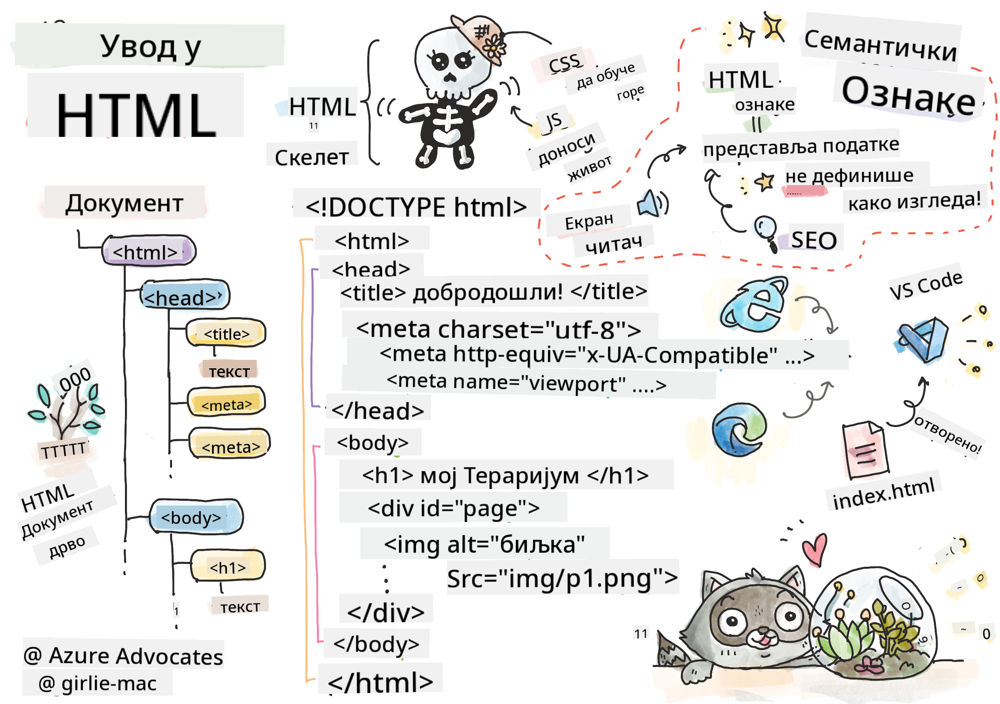
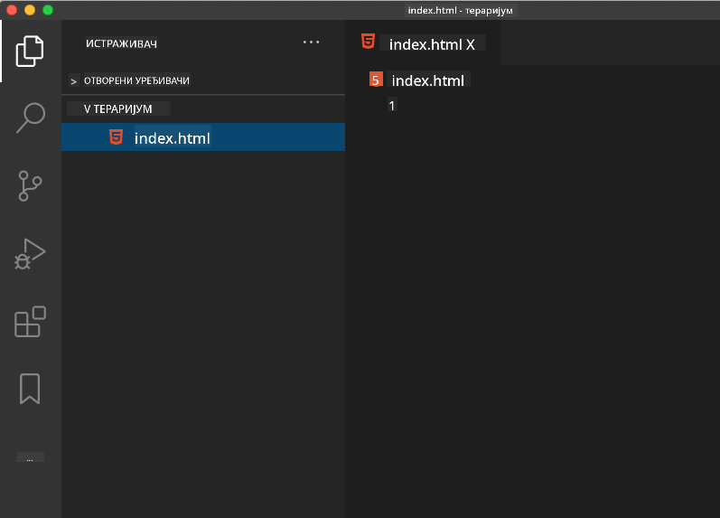

<!--
CO_OP_TRANSLATOR_METADATA:
{
  "original_hash": "46a0639e719b9cf1dfd062aa24cad639",
  "translation_date": "2025-08-27T22:00:56+00:00",
  "source_file": "3-terrarium/1-intro-to-html/README.md",
  "language_code": "sr"
}
-->
# Пројекат Тераријум, део 1: Увод у HTML

  
> Скетч од [Томоми Имура](https://twitter.com/girlie_mac)

## Квиз пре предавања

[Квиз пре предавања](https://ashy-river-0debb7803.1.azurestaticapps.net/quiz/15)

> Погледајте видео

> 
> [](https://www.youtube.com/watch?v=1TvxJKBzhyQ)

### Увод

HTML, или Хипертекстуални Ознаковни Језик, представља „скелет“ веба. Ако CSS „облачи“ ваш HTML, а JavaScript му даје живот, онда је HTML тело ваше веб апликације. Чак и синтакса HTML-а одражава ту идеју, јер укључује ознаке као што су „head“, „body“ и „footer“.

У овој лекцији ћемо користити HTML да направимо „скелет“ интерфејса нашег виртуелног тераријума. Имаће наслов и три колоне: десну и леву колону где ће се налазити биљке које се могу превлачити, и централни део који ће представљати стаклени тераријум. До краја ове лекције, моћи ћете да видите биљке у колонама, али интерфејс ће изгледати помало чудно; не брините, у следећем делу ћете додати CSS стилове како би интерфејс изгледао боље.

### Задатак

На вашем рачунару, направите фасциклу под називом 'terrarium' и унутар ње фајл под називом 'index.html'. Ово можете урадити у Visual Studio Code-у након што направите фасциклу тераријума тако што ћете отворити нови прозор VS Code-а, кликнути на 'open folder' и пронаћи вашу нову фасциклу. Кликните на мало дугме 'file' у панелу Explorer и направите нови фајл:



Или

Користите ове команде у вашем git bash-у:  
* `mkdir terrarium`  
* `cd terrarium`  
* `touch index.html`  
* `code index.html` или `nano index.html`  

> index.html фајлови указују претраживачу да је то подразумевани фајл у фасцикли; URL-ови као што је `https://anysite.com/test` могу бити изграђени коришћењем структуре фасцикли која укључује фасциклу под називом `test` са `index.html` унутар ње; `index.html` не мора бити приказан у URL-у.

---

## DocType и html ознаке

Први ред HTML фајла је његов doctype. Изненађујуће је што овај ред мора бити на самом врху фајла, али он говори старијим претраживачима да страница треба да се рендерује у стандардном режиму, пратећи тренутну html спецификацију.

> Савет: у VS Code-у, можете прећи мишем преко ознаке и добити информације о њеној употреби из MDN референтних водича.

Други ред треба да буде отварајућа ознака `<html>`, одмах праћена затварајућом ознаком `</html>`. Ове ознаке су коренски елементи вашег интерфејса.

### Задатак

Додајте ове редове на врх вашег `index.html` фајла:

```HTML
<!DOCTYPE html>
<html></html>
```

✅ Постоји неколико различитих режима који се могу одредити постављањем DocType-а са упитним низом: [Quirks Mode и Standards Mode](https://developer.mozilla.org/docs/Web/HTML/Quirks_Mode_and_Standards_Mode). Ови режими су коришћени за подршку веома старим претраживачима који се данас ретко користе (Netscape Navigator 4 и Internet Explorer 5). Можете се држати стандардне декларације doctype-а.

---

## 'head' документа

'Head' део HTML документа укључује кључне информације о вашој веб страници, познате као [метаподаци](https://developer.mozilla.org/docs/Web/HTML/Element/meta). У нашем случају, серверу на који ће ова страница бити послата за рендеровање, шаљемо ове четири ствари:

-   наслов странице  
-   метаподатке странице, укључујући:  
    -   'character set', који указује на то који се кодни распоред користи на страници  
    -   информације о претраживачу, укључујући `x-ua-compatible` који указује да је IE=edge претраживач подржан  
    -   информације о томе како би viewport требало да се понаша када се страница учита. Постављање viewport-а да има почетни зум од 1 контролише ниво увећања када се страница први пут учита.  

### Задатак

Додајте 'head' блок у ваш документ између отварајућих и затварајућих `<html>` ознака.

```html
<head>
	<title>Welcome to my Virtual Terrarium</title>
	<meta charset="utf-8" />
	<meta http-equiv="X-UA-Compatible" content="IE=edge" />
	<meta name="viewport" content="width=device-width, initial-scale=1" />
</head>
```

✅ Шта би се догодило ако поставите viewport мета ознаку овако: `<meta name="viewport" content="width=600">`? Прочитајте више о [viewport-у](https://developer.mozilla.org/docs/Web/HTML/Viewport_meta_tag).

---

## `body` документа

### HTML ознаке

У HTML-у, додајете ознаке у ваш .html фајл како бисте креирали елементе веб странице. Свака ознака обично има отварајућу и затварајућу ознаку, као што је: `<p>здраво</p>` за означавање пасуса. Креирајте тело вашег интерфејса додавањем скупа `<body>` ознака унутар `<html>` пара ознака; ваш код сада изгледа овако:

### Задатак

```html
<!DOCTYPE html>
<html>
	<head>
		<title>Welcome to my Virtual Terrarium</title>
		<meta charset="utf-8" />
		<meta http-equiv="X-UA-Compatible" content="IE=edge" />
		<meta name="viewport" content="width=device-width, initial-scale=1" />
	</head>
	<body></body>
</html>
```

Сада можете почети са изградњом ваше странице. Обично користите `<div>` ознаке за креирање одвојених елемената на страници. Направићемо серију `<div>` елемената који ће садржати слике.

### Слике

Једна HTML ознака која не захтева затварајућу ознаку је `` ознака, јер има `src` елемент који садржи све информације потребне страници за рендеровање елемента.

Направите фасциклу у вашој апликацији под називом `images` и у њу додајте све слике из [фасцикле са изворним кодом](../../../../3-terrarium/solution/images); (постоји 14 слика биљака).

### Задатак

Додајте те слике биљака у две колоне између `<body></body>` ознака:

```html
<div id="page">
	<div id="left-container" class="container">
		<div class="plant-holder">
			
		</div>
		<div class="plant-holder">
			
		</div>
		<div class="plant-holder">
			
		</div>
		<div class="plant-holder">
			
		</div>
		<div class="plant-holder">
			
		</div>
		<div class="plant-holder">
			
		</div>
		<div class="plant-holder">
			
		</div>
	</div>
	<div id="right-container" class="container">
		<div class="plant-holder">
			
		</div>
		<div class="plant-holder">
			
		</div>
		<div class="plant-holder">
			
		</div>
		<div class="plant-holder">
			
		</div>
		<div class="plant-holder">
			
		</div>
		<div class="plant-holder">
			
		</div>
		<div class="plant-holder">
			
		</div>
	</div>
</div>
```

> Напомена: Div-ови наспрам Span-ова. Div-ови се сматрају 'блок' елементима, а Span-ови 'inline'. Шта би се догодило ако бисте ове div-ове претворили у span-ове?

Са овим кодом, биљке се сада појављују на екрану. Изгледају прилично лоше, јер још увек нису стилизоване помоћу CSS-а, што ћемо урадити у следећој лекцији.

Свака слика има alt текст који ће се појавити чак и ако не можете да видите или рендерујете слику. Ово је важан атрибут за укључивање ради приступачности. Сазнајте више о приступачности у будућим лекцијама; за сада, запамтите да alt атрибут пружа алтернативне информације за слику ако корисник из неког разлога не може да је види (због споре везе, грешке у src атрибуту или ако корисник користи читач екрана).

✅ Да ли сте приметили да свака слика има исти alt текст? Да ли је ово добра пракса? Зашто или зашто не? Можете ли побољшати овај код?

---

## Семантички ознаке

Уопштено, пожељно је користити значајне 'семантичке' ознаке приликом писања HTML-а. Шта то значи? То значи да користите HTML ознаке које представљају тип података или интеракције за које су дизајниране. На пример, главни наслов текста на страници треба да користи `<h1>` ознаку.

Додајте следећи ред одмах испод ваше отварајуће `<body>` ознаке:

```html
<h1>My Terrarium</h1>
```

Коришћење семантичког означавања, као што је коришћење `<h1>` за наслове и `<ul>` за неуређене листе, помаже читачима екрана да се крећу кроз страницу. Уопштено, дугмад треба писати као `<button>`, а листе као `<li>`. Иако је _могуће_ користити посебно стилизоване `<span>` елементе са обрађивачима кликова да би се имитирала дугмад, боље је за кориснике са инвалидитетом да користе технологије које одређују где се дугме налази на страници и да интерагују са њим ако се елемент појављује као дугме. Из тог разлога, покушајте да користите семантичке ознаке што је више могуће.

✅ Погледајте читач екрана и [како он интерагује са веб страницом](https://www.youtube.com/watch?v=OUDV1gqs9GA). Можете ли видети зашто би несемантичке ознаке могле фрустрирати корисника?

## Тераријум

Последњи део овог интерфејса укључује креирање ознака које ће бити стилизоване да направе тераријум.

### Задатак:

Додајте овај код изнад последње `</div>` ознаке:

```html
<div id="terrarium">
	<div class="jar-top"></div>
	<div class="jar-walls">
		<div class="jar-glossy-long"></div>
		<div class="jar-glossy-short"></div>
	</div>
	<div class="dirt"></div>
	<div class="jar-bottom"></div>
</div>
```

✅ Иако сте додали овај код на екран, не видите ништа што се рендерује. Зашто?

---

## 🚀Изазов

Постоје неке занимљиве 'старе' ознаке у HTML-у које је и даље забавно испробати, иако не би требало да користите застареле ознаке као што су [ове ознаке](https://developer.mozilla.org/docs/Web/HTML/Element#Obsolete_and_deprecated_elements) у вашем коду. Ипак, можете ли користити стару `<marquee>` ознаку да натерате h1 наслов да се хоризонтално помера? (ако то урадите, не заборавите да је уклоните након тога)

## Квиз након предавања

[Квиз након предавања](https://ashy-river-0debb7803.1.azurestaticapps.net/quiz/16)

## Преглед и самостално учење

HTML је 'проверени и поуздани' систем градивних блокова који је помогао у изградњи веба какав данас познајемо. Сазнајте мало о његовој историји проучавајући старе и нове ознаке. Можете ли схватити зашто су неке ознаке застареле, а неке додате? Које ознаке би могле бити уведене у будућности?

Сазнајте више о изградњи сајтова за веб и мобилне уређаје на [Microsoft Learn](https://docs.microsoft.com/learn/modules/build-simple-website/?WT.mc_id=academic-77807-sagibbon).

## Задатак

[Вежбајте ваш HTML: Направите макету блога](assignment.md)

---

**Одрицање од одговорности**:  
Овај документ је преведен коришћењем услуге за превођење помоћу вештачке интелигенције [Co-op Translator](https://github.com/Azure/co-op-translator). Иако се трудимо да обезбедимо тачност, молимо вас да имате у виду да аутоматски преводи могу садржати грешке или нетачности. Оригинални документ на његовом изворном језику треба сматрати меродавним извором. За критичне информације препоручује се професионални превод од стране људи. Не преузимамо одговорност за било каква погрешна тумачења или неспоразуме који могу настати услед коришћења овог превода.