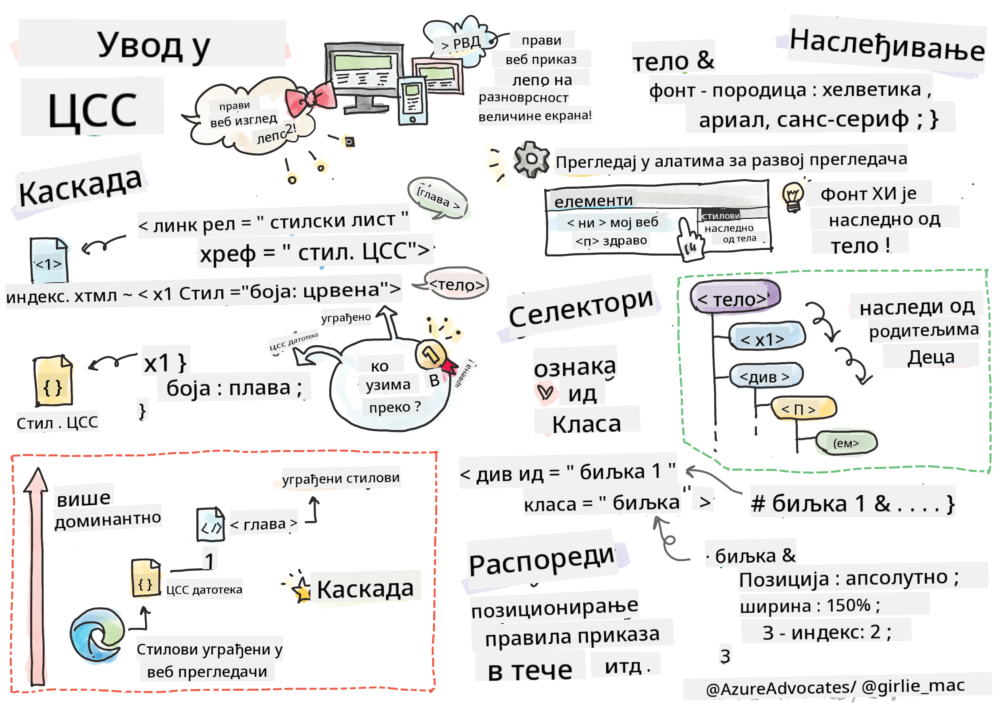
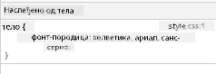
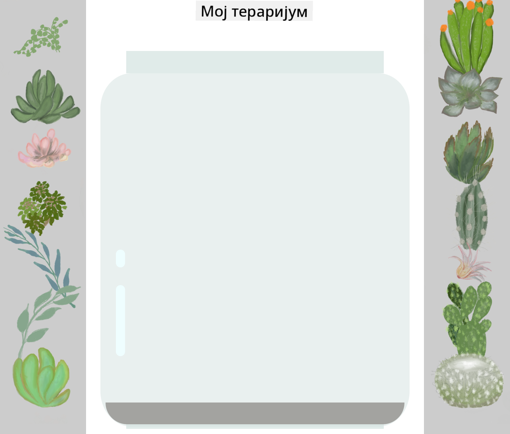

<!--
CO_OP_TRANSLATOR_METADATA:
{
  "original_hash": "92c4431eac70670b0450b02c1d11279a",
  "translation_date": "2025-10-24T23:24:23+00:00",
  "source_file": "3-terrarium/2-intro-to-css/README.md",
  "language_code": "sr"
}
-->
# Пројекат Тераријум, део 2: Увод у CSS


> Скетч од [Tomomi Imura](https://twitter.com/girlie_mac)

Сећате ли се како је ваш HTML тераријум изгледао прилично основно? CSS је ту да трансформише ту једноставну структуру у нешто визуелно привлачно.

Ако је HTML као изградња оквира куће, онда је CSS све оно што чини да се кућа осећа као дом - боје зидова, распоред намештаја, осветљење и како се просторије међусобно повезују. Замислите како је палата Версај почела као једноставна ловачка кућа, али пажљивим уређењем и распоредом постала једна од највеличанственијих грађевина на свету.

Данас ћемо ваш тераријум трансформисати из функционалног у углађен. Научићете како да прецизно позиционирате елементе, направите распореде који реагују на различите величине екрана и створите визуелну привлачност која чини веб странице занимљивим.

До краја овог часа, видећете како стратешко стилизовање CSS-ом може драматично побољшати ваш пројекат. Хајде да додамо мало стила вашем тераријуму.

## Квиз пре предавања

[Квиз пре предавања](https://ff-quizzes.netlify.app/web/quiz/17)

## Почетак рада са CSS-ом

CSS се често сматра само начином да се ствари учине лепим, али он има много ширу сврху. CSS је као редитељ филма - контролишете не само како све изгледа, већ и како се креће, реагује на интеракцију и прилагођава различитим ситуацијама.

Модеран CSS је изузетно способан. Можете писати код који аутоматски прилагођава распореде за телефоне, таблете и десктоп рачунаре. Можете креирати глатке анимације које усмеравају пажњу корисника тамо где је потребно. Резултати могу бити прилично импресивни када све функционише заједно.

> 💡 **Савет професионалца**: CSS се стално развија са новим функцијама и могућностима. Увек проверите [CanIUse.com](https://caniuse.com) да бисте потврдили подршку прегледача за нове CSS функције пре него што их употребите у производним пројектима.

**Ево шта ћемо постићи на овом часу:**
- **Креираћемо** комплетан визуелни дизајн за ваш тераријум користећи модерне CSS технике
- **Истражићемо** основне концепте као што су каскада, наслеђивање и CSS селектори
- **Применићемо** стратегије позиционирања и распореда које реагују на промене величине екрана
- **Изградићемо** контејнер тераријума користећи CSS облике и стилизовање

### Предуслов

Требало би да сте завршили HTML структуру за ваш тераријум из претходног часа и да је спремна за стилизовање.

> 📺 **Видео ресурс**: Погледајте овај користан видео водич
>
> [](https://www.youtube.com/watch?v=6yIdOIV9p1I)

### Постављање вашег CSS фајла

Пре него што почнемо са стилизовањем, потребно је да повежемо CSS са нашим HTML-ом. Ова веза говори прегледачу где да пронађе упутства за стилизовање нашег тераријума.

У вашем фолдеру за тераријум, направите нови фајл под називом `style.css`, а затим га повежите у секцији `<head>` вашег HTML документа:

```html
<link rel="stylesheet" href="./style.css" />
```

**Ево шта овај код ради:**
- **Креира** везу између вашег HTML и CSS фајла
- **Говори** прегледачу да учита и примени стилове из `style.css`
- **Користи** атрибут `rel="stylesheet"` да назначи да је ово CSS фајл
- **Реферише** путању до фајла са `href="./style.css"`

## Разумевање CSS каскаде

Да ли сте се икада запитали зашто се CSS назива "Каскадни стилски листови"? Стилови се спуштају као водопад, а понекад долази до конфликта међу њима.

Замислите како функционишу војне командне структуре - генерална наредба може рећи "сви војници носе зелену униформу," али специфична наредба за вашу јединицу може рећи "носите свечане плаве униформе за церемонију." Специфичнија инструкција има предност. CSS следи сличну логику, а разумевање ове хијерархије чини отклањање грешака много лакшим.

### Експериментисање са приоритетом каскаде

Хајде да видимо каскаду у акцији тако што ћемо направити конфликт у стилу. Прво, додајте inline стил вашем `<h1>` тагу:

```html
<h1 style="color: red">My Terrarium</h1>
```

**Шта овај код ради:**
- **Примењује** црвену боју директно на `<h1>` елемент користећи inline стилизовање
- **Користи** атрибут `style` да угради CSS директно у HTML
- **Креира** правило стила са највишим приоритетом за овај специфичан елемент

Затим, додајте ово правило у ваш `style.css` фајл:

```css
h1 {
  color: blue;
}
```

**У горњем примеру, урадили смо следеће:**
- **Дефинисали** CSS правило које циља све `<h1>` елементе
- **Поставили** боју текста на плаву користећи екстерни стилски лист
- **Креирали** правило са нижим приоритетом у поређењу са inline стиловима

✅ **Провера знања**: Која боја се приказује у вашој веб апликацији? Зашто та боја има предност? Можете ли смислити сценарије у којима бисте желели да надјачате стилове?

> 💡 **Редослед приоритета у CSS-у (од највишег до најнижег):**
> 1. **Inline стилови** (атрибут style)
> 2. **ID-ови** (#myId)
> 3. **Класе** (.myClass) и атрибути
> 4. **Селектори елемената** (h1, div, p)
> 5. **Подразумевани стилови прегледача**

## CSS наслеђивање у пракси

CSS наслеђивање функционише као генетика - елементи наслеђују одређене особине од својих родитељских елемената. Ако поставите породицу фонтова на елементу body, сав текст унутар њега аутоматски ће користити исти фонт. То је слично као што се препознатљива линија вилице породице Хабсбург појављивала кроз генерације без потребе да се одређује за сваког појединца.

Међутим, не наслеђује се све. Стилови текста као што су фонтови и боје се наслеђују, али својства распореда као што су маргине и оквири не. Као што деца могу наследити физичке особине, али не и модне изборе својих родитеља.

### Посматрање наслеђивања фонта

Хајде да видимо наслеђивање у пракси постављањем породице фонтова на елементу `<body>`:

```css
body {
  font-family: 'Segoe UI', Tahoma, Geneva, Verdana, sans-serif;
}
```

**Разлагање онога што се овде дешава:**
- **Поставља** породицу фонтова за целу страницу циљајући елемент `<body>`
- **Користи** стек фонтова са резервним опцијама за бољу компатибилност са прегледачима
- **Примењује** модерне системске фонтове који изгледају одлично на различитим оперативним системима
- **Осигурава** да сви елементи наследе овај фонт, осим ако није специфично надјачан

Отворите алатке за програмере у вашем прегледачу (F12), идите на картицу Елементи и инспектирајте ваш `<h1>` елемент. Видећете да наслеђује породицу фонтова од елемента body:



✅ **Експеримент**: Покушајте да поставите друга наследна својства на `<body>` као што су `color`, `line-height` или `text-align`. Шта се дешава са вашим насловом и другим елементима?

> 📝 **Наследна својства укључују**: `color`, `font-family`, `font-size`, `line-height`, `text-align`, `visibility`
>
> **Ненаследна својства укључују**: `margin`, `padding`, `border`, `width`, `height`, `position`

## Савладавање CSS селектора

CSS селектори су ваш начин да циљате специфичне елементе за стилизовање. Они функционишу као да дајете прецизна упутства - уместо да кажете "кућа," можете рећи "плава кућа са црвеним вратима на улици Мејпл."

CSS пружа различите начине да будете прецизни, а избор правог селектора је као избор одговарајућег алата за задатак. Понекад треба да стилизујете сва врата у комшилуку, а понекад само једна специфична врата.

### Селектори елемената (Тагови)

Селектори елемената циљају HTML елементе по њиховом имену тагова. Савршени су за постављање основних стилова који се широко примењују на вашој страници:

```css
body {
  font-family: 'Segoe UI', Tahoma, Geneva, Verdana, sans-serif;
  margin: 0;
  padding: 0;
}

h1 {
  color: #3a241d;
  text-align: center;
  font-size: 2.5rem;
  margin-bottom: 1rem;
}
```

**Разумевање ових стилова:**
- **Поставља** конзистентну типографију широм целе странице са селектором `body`
- **Уклања** подразумеване маргине и размаке прегледача ради боље контроле
- **Стилизује** све насловне елементе бојом, поравнањем и размаком
- **Користи** `rem` јединице за скалабилно, приступачно величање фонта

Док селектори елемената добро функционишу за опште стилизовање, биће вам потребни специфичнији селектори за стилизовање појединачних компоненти као што су биљке у вашем тераријуму.

### ID селектори за јединствене елементе

ID селектори користе симбол `#` и циљају елементе са специфичним атрибутима `id`. Пошто ID-ови морају бити јединствени на страници, они су савршени за стилизовање појединачних, посебних елемената као што су наши леви и десни контејнери за биљке.

Хајде да креирамо стилизовање за контејнере са стране нашег тераријума где ће биљке бити смештене:

```css
#left-container {
  background-color: #f5f5f5;
  width: 15%;
  left: 0;
  top: 0;
  position: absolute;
  height: 100vh;
  padding: 1rem;
  box-sizing: border-box;
}

#right-container {
  background-color: #f5f5f5;
  width: 15%;
  right: 0;
  top: 0;
  position: absolute;
  height: 100vh;
  padding: 1rem;
  box-sizing: border-box;
}
```

**Ево шта овај код постиже:**
- **Позиционира** контејнере на крајње леве и десне ивице користећи `absolute` позиционирање
- **Користи** јединице `vh` (висина видљивог дела екрана) за одзивну висину која се прилагођава величини екрана
- **Примењује** `box-sizing: border-box` тако да се padding укључи у укупну ширину
- **Уклања** непотребне `px` јединице из вредности нула ради чистијег кода
- **Поставља** суптилну боју позадине која је пријатнија за очи од упадљиве сиве

✅ **Изазов квалитета кода**: Приметите како овај CSS крши принцип DRY (Don't Repeat Yourself). Можете ли га рефакторисати користећи и ID и класу?

**Побољшани приступ:**
```html
<div id="left-container" class="container"></div>
<div id="right-container" class="container"></div>
```

```css
.container {
  background-color: #f5f5f5;
  width: 15%;
  top: 0;
  position: absolute;
  height: 100vh;
  padding: 1rem;
  box-sizing: border-box;
}

#left-container {
  left: 0;
}

#right-container {
  right: 0;
}
```

### Селектори класа за поновљиве стилове

Селектори класа користе симбол `.` и савршени су када желите да примените исте стилове на више елемената. За разлику од ID-ова, класе се могу поново користити широм вашег HTML-а, што их чини идеалним за конзистентне стилске обрасце.

У нашем тераријуму, свака биљка захтева слично стилизовање, али и индивидуално позиционирање. Користићемо комбинацију класа за заједничке стилове и ID-ова за јединствено позиционирање.

**Ево HTML структуре за сваку биљку:**
```html
<div class="plant-holder">
  
</div>
```

**Кључни елементи објашњени:**
- **Користи** `class="plant-holder"` за конзистентно стилизовање контејнера широм свих биљака
- **Примењује** `class="plant"` за заједничко стилизовање слика и понашања
- **Укључује** јединствени `id="plant1"` за индивидуално позиционирање и интеракцију са JavaScript-ом
- **Обезбеђује** описни alt текст за приступачност корисницима екрана за читање

Сада додајте ове стилове у ваш `style.css` фајл:

```css
.plant-holder {
  position: relative;
  height: 13%;
  left: -0.6rem;
}

.plant {
  position: absolute;
  max-width: 150%;
  max-height: 150%;
  z-index: 2;
  transition: transform 0.3s ease;
}

.plant:hover {
  transform: scale(1.05);
}
```

**Разлагање ових стилова:**
- **Креира** релативно позиционирање за држач биљке ради успостављања контекста позиционирања
- **Поставља** сваки држач биљке на висину од 13%, осигуравајући да све биљке стану вертикално без скроловања
- **Помера** држаче мало улево ради бољег центрирања биљака унутар њихових контејнера
- **Омогућава** биљкама да се одзивно скалирају са својствима `max-width` и `max-height`
- **Користи** `z-index` за слојевито постављање биљака изнад других елемената у тераријуму
- **Додаје** суптилан ефекат при преласку мишем са CSS транзицијама ради боље интеракције са корисником

✅ **Критичко размишљање**: Зашто нам требају и `.plant-holder` и `.plant` селектори? Шта би се десило ако бисмо покушали да користимо само један?

> 💡 **Дизајнерски образац**: Контејнер (`.plant-holder`) контролише распоред и позиционирање, док садржај (`.plant`) контролише изглед и скалирање. Ова подела чини код лакшим за одржавање и флексибилнијим.

## Разумевање CSS позиционирања

CSS позиционирање је као да сте редитељ представе - одређујете где сваки глумац стоји и како се креће по сцени. Неки глумци следе стандардну формацију, док други захтевају специфично позиционирање ради драматичног ефекта.

Када разумете позиционирање, многи изазови у распореду постају управљиви. Потребан вам је навигациони бар који остаје на врху док корисници скролују? Позиционирање то решава. Желите алатку која се појављује на одређеној локацији? И то је позиционирање.

### Пет вредности позиционирања

| Вредност позиционирања | Понашање | Пример употребе |
|------------------------|----------|-----------------|
| `static` | Подразумевани ток, игнорише top/left/right/bottom | Нормалан распоред документа |
| `relative` | Позициониран релативно
Хајде да направимо тераријум у тегли корак по корак. Сваки део користи апсолутно позиционирање и величине засноване на процентима за одзивни дизајн:

```css
.jar-walls {
  height: 80%;
  width: 60%;
  background: #d1e1df;
  border-radius: 1rem;
  position: absolute;
  bottom: 0.5%;
  left: 20%;
  opacity: 0.5;
  z-index: 1;
  box-shadow: inset 0 0 2rem rgba(0, 0, 0, 0.1);
}

.jar-top {
  width: 50%;
  height: 5%;
  background: #d1e1df;
  position: absolute;
  bottom: 80.5%;
  left: 25%;
  opacity: 0.7;
  z-index: 1;
  border-radius: 0.5rem 0.5rem 0 0;
}

.jar-bottom {
  width: 50%;
  height: 1%;
  background: #d1e1df;
  position: absolute;
  bottom: 0;
  left: 25%;
  opacity: 0.7;
  border-radius: 0 0 0.5rem 0.5rem;
}

.dirt {
  width: 60%;
  height: 5%;
  background: #3a241d;
  position: absolute;
  border-radius: 0 0 1rem 1rem;
  bottom: 1%;
  left: 20%;
  opacity: 0.7;
  z-index: -1;
}
```

**Разумевање конструкције тераријума:**
- **Користи** димензије засноване на процентима за одзивно скалирање на свим величинама екрана
- **Позиционира** елементе апсолутно ради прецизног слагања и поравнања
- **Примењује** различите вредности непрозирности за ефекат стаклене транспарентности
- **Имплементира** слојеве помоћу `z-index` тако да биљке изгледају као да су унутар тегле
- **Додаје** суптилну сенку и префињену заобљеност ивица за реалистичнији изглед

### Одзивни дизајн са процентима

Приметите како све димензије користе проценте уместо фиксних пиксел вредности:

**Зашто је ово важно:**
- **Обезбеђује** да се тераријум пропорционално скалира на било којој величини екрана
- **Одржава** визуелне односе између компоненти тегле
- **Пружа** конзистентно искуство од мобилних телефона до великих десктоп монитора
- **Омогућава** дизајну да се прилагоди без нарушавања визуелног распореда

### CSS јединице у акцији

Користимо `rem` јединице за заобљеност ивица, које се скалирају у односу на величину коренског фонта. Ово ствара приступачније дизајне који поштују корисничке преференције за величину фонта. Сазнајте више о [CSS релативним јединицама](https://www.w3.org/TR/css-values-3/#font-relative-lengths) у званичној спецификацији.

✅ **Визуелни експерименти**: Пробајте да измените ове вредности и посматрајте ефекте:
- Промените непрозирност тегле са 0.5 на 0.8 – како то утиче на изглед стакла?
- Подесите боју земље са `#3a241d` на `#8B4513` – какав визуелни утицај то има?
- Измените `z-index` земље на 2 – шта се дешава са слојевима?

---

## Изазов GitHub Copilot Agent 🚀

Користите Agent мод да завршите следећи изазов:

**Опис:** Направите CSS анимацију која чини да биљке у тераријуму нежно њишу лево-десно, симулирајући ефекат природног ветра. Ово ће вам помоћи да увежбате CSS анимације, трансформације и кључне кадрове, док истовремено побољшавате визуелну привлачност вашег тераријума.

**Задатак:** Додајте CSS анимације кључних кадрова како би биљке у тераријуму нежно њихале са стране на страну. Направите анимацију њихања која благо ротира сваку биљку (2-3 степена) лево и десно у трајању од 3-4 секунде, и примените је на `.plant` класу. Уверите се да анимација бесконачно петља и да има функцију ублажавања за природно кретање.

Сазнајте више о [agent modu](https://code.visualstudio.com/blogs/2025/02/24/introducing-copilot-agent-mode) овде.

## 🚀 Изазов: Додавање рефлексија на стаклу

Спремни да побољшате свој тераријум реалистичним рефлексијама на стаклу? Ова техника ће додати дубину и реалност дизајну.

Направићете суптилне нагласке који симулирају како светлост рефлектује на стакленим површинама. Овај приступ је сличан ономе како су ренесансни сликари попут Јана ван Ајка користили светлост и рефлексију да би насликано стакло изгледало тродимензионално. Ево шта је ваш циљ:



**Ваш изазов:**
- **Направите** суптилне беле или светле овалне облике за рефлексије на стаклу
- **Позиционирајте** их стратешки на левој страни тегле
- **Примените** одговарајуће ефекте непрозирности и замућења за реалистичну рефлексију светлости
- **Користите** `border-radius` за креирање органских, мехурастих облика
- **Експериментишите** са градијентима или сенкама за побољшану реалност

## Квиз након предавања

[Квиз након предавања](https://ff-quizzes.netlify.app/web/quiz/18)

## Проширите своје знање о CSS-у

CSS може изгледати сложено на почетку, али разумевање ових основних концепата пружа чврсту основу за напредније технике.

**Ваше следеће области учења CSS-а:**
- **Flexbox** - поједностављује поравнање и расподелу елемената
- **CSS Grid** - пружа моћне алате за креирање сложених распореда
- **CSS Variables** - смањује понављање и побољшава одрживост
- **Одзивни дизајн** - осигурава да сајтови добро функционишу на различитим величинама екрана

### Интерактивни ресурси за учење

Увежбајте ове концепте уз ове занимљиве, практичне игре:
- 🐸 [Flexbox Froggy](https://flexboxfroggy.com/) - Савладајте Flexbox кроз забавне изазове
- 🌱 [Grid Garden](https://codepip.com/games/grid-garden/) - Научите CSS Grid уз гајење виртуелне шаргарепе
- 🎯 [CSS Battle](https://cssbattle.dev/) - Тестирајте своје CSS вештине кроз кодирачке изазове

### Додатно учење

За свеобухватне основе CSS-а, завршите овај Microsoft Learn модул: [Стилизујте вашу HTML апликацију помоћу CSS-а](https://docs.microsoft.com/learn/modules/build-simple-website/4-css-basics/?WT.mc_id=academic-77807-sagibbon)

## Задатак

[Рефакторисање CSS-а](assignment.md)

---

**Одрицање од одговорности**:  
Овај документ је преведен помоћу услуге за превођење вештачке интелигенције [Co-op Translator](https://github.com/Azure/co-op-translator). Иако се трудимо да обезбедимо тачност, молимо вас да имате у виду да аутоматски преводи могу садржати грешке или нетачности. Оригинални документ на његовом изворном језику треба сматрати меродавним извором. За критичне информације препоручује се професионални превод од стране људи. Не преузимамо одговорност за било каква погрешна тумачења или неспоразуме који могу настати услед коришћења овог превода.