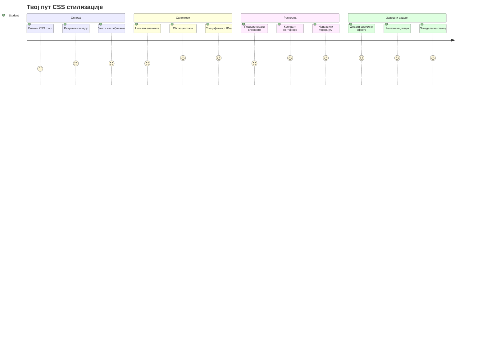
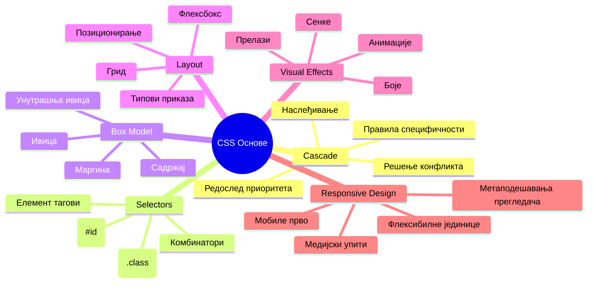
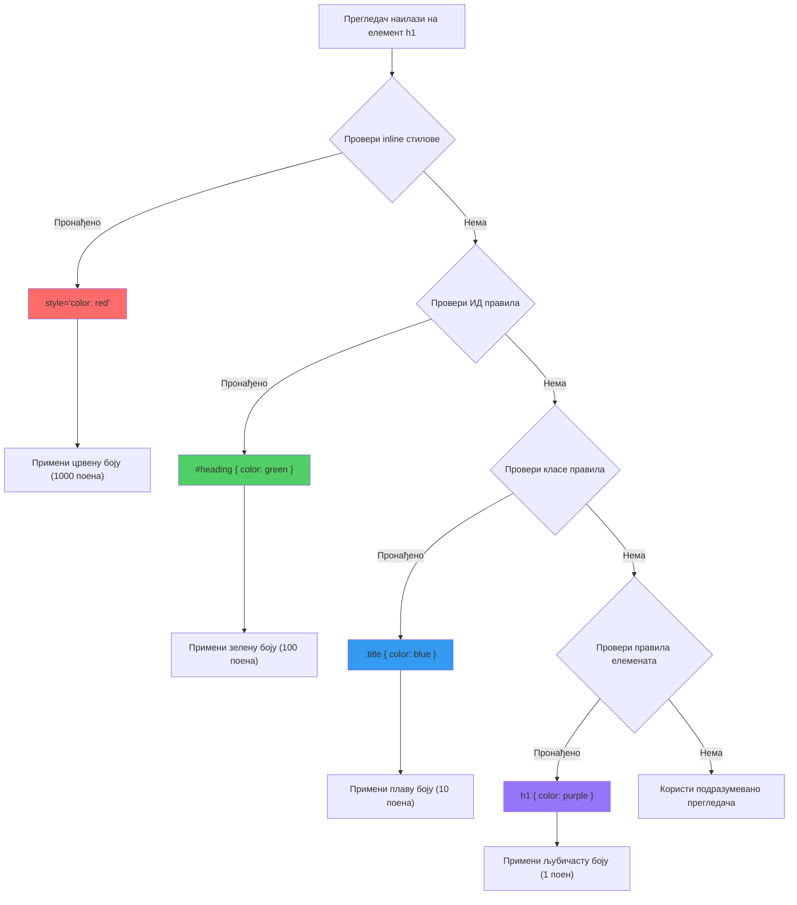
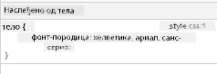
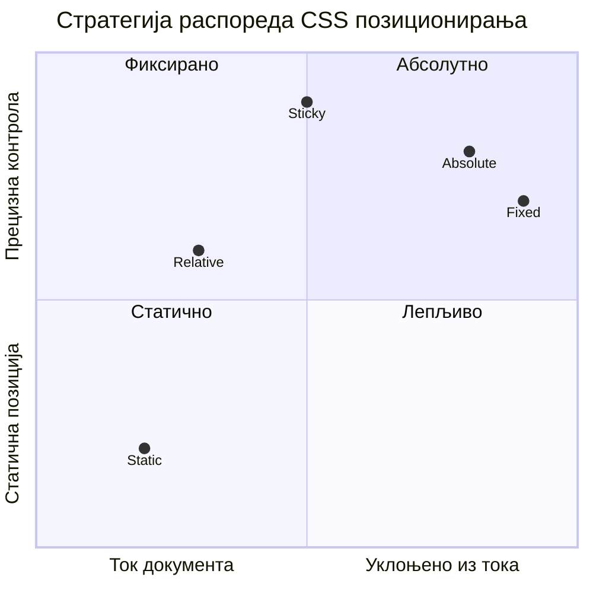
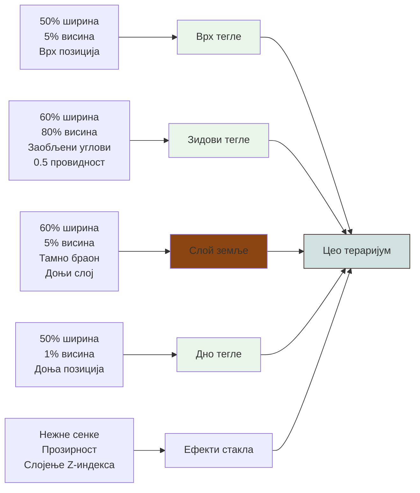
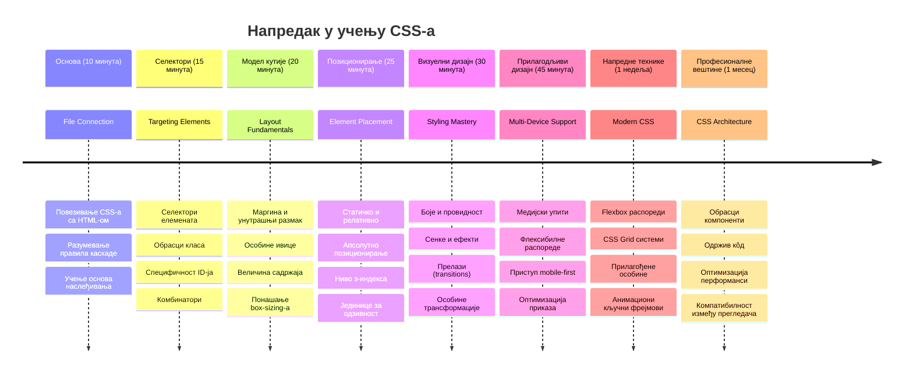

<!--
CO_OP_TRANSLATOR_METADATA:
{
  "original_hash": "e39f3a4e3bcccf94639e3af1248f8a4d",
  "translation_date": "2026-01-07T08:24:59+00:00",
  "source_file": "3-terrarium/2-intro-to-css/README.md",
  "language_code": "sr"
}
-->
# Terrarium Projekat Deo 2: Uvod u CSS



> Sketchnote autora [Tomomi Imura](https://twitter.com/girlie_mac)

Sećate li se kako je vaš HTML terarijum izgledao prilično osnovno? CSS je mesto gde tu običnu strukturu pretvaramo u nešto vizuelno privlačno.

Ako je HTML kao gradnja okvira kuće, onda je CSS sve ono što čini da se kuća oseća kao dom - boje farbe, raspored nameštaja, osvetljenje i kako se sobe povezuju. Zamislite kako je Dvorac Versaј počeo kao jednostavan lovački dom, ali pažnja na dekoraciju i raspored pretvorila ga je u jednu od najimpresivnijih zgrada na svetu.

Danas ćemo vaš terarijum pretvoriti iz funkcionalnog u doteran. Naučićete kako precizno pozicionirati elemente, kako praviti rasporede koji reaguje na različite veličine ekrana i kako stvoriti vizuelnu privlačnost koja sajtove čini zanimljivim.

Na kraju ovog časa, videćete kako strateški CSS stil može drastično poboljšati vaš projekat. Dodajmo malo stila vašem terarijumu.


## Pre-časni kviz

[Pre-časni kviz](https://ff-quizzes.netlify.app/web/quiz/17)

## Početak sa CSS-om

CSS se često smatra samo za "ulepšavanje stvari", ali on ima mnogo širu svrhu. CSS je kao režiser filma - vi kontrolišete ne samo kako sve izgleda, već i kako se pomera, kako reaguje na interakciju i kako se prilagođava različitim situacijama.

Moderan CSS je izuzetno sposoban. Možete pisati kod koji automatski podešava rasporede za telefone, tablete i desktop računare. Možete kreirati glatke animacije koje usmeravaju pažnju korisnika gde je potrebno. Rezultati mogu biti zaista impresivni kada sve funkcioniše zajedno.

> 💡 **Pro savet**: CSS se konstantno razvija sa novim funkcijama i mogućnostima. Uvek proverite [CanIUse.com](https://caniuse.com) da biste potvrdili podršku pretraživača za novije CSS funkcije pre nego što ih upotrebite u produkciji.

**Evo šta ćemo postići na ovom času:**
- **Kreira** kompletan vizuelni dizajn vašeg terarijuma koristeći moderne CSS tehnike
- **Istražuje** osnovne koncepte poput kaskade, nasleđivanja i CSS selektora
- **Implementira** responzivne strategije pozicioniranja i rasporeda
- **Gradi** terarijum kontejner koristeći CSS oblike i stilizaciju

### Preduslov

Treba da imate završenu HTML strukturu za vaš terarijum iz prethodnog časa i da je spremna za stilizaciju.

> 📺 **Video resurs**: Pogledajte ovaj koristan video tutorijal
>
> [](https://www.youtube.com/watch?v=6yIdOIV9p1I)

### Podešavanje vašeg CSS fajla

Pre nego što počnemo sa stilizacijom, treba da povežemo CSS sa našim HTML-om. Ovo povezivanje govori pregledaču gde da pronađe uputstva za stilizaciju našeg terarijuma.

U vašem terarijum folderu kreirajte novi fajl pod nazivom `style.css`, zatim ga povežite u `<head>` sekciji vašeg HTML dokumenta:

```html
<link rel="stylesheet" href="./style.css" />
```

**Šta ovaj kod radi:**
- **Kreira** vezu između vaših HTML i CSS fajlova
- **Govori** pregledaču da učita i primeni stilove iz `style.css`
- **Koristi** atribut `rel="stylesheet"` da označi da je u pitanju CSS fajl
- **Referencira** putanju do fajla sa `href="./style.css"`

## Razumevanje CSS kaskade

Da li ste se ikada zapitali zašto se CSS zove "Kaskadni" stilovi? Stilovi se slivaju kao vodopad, i ponekad se međusobno sukobljavaju.

Razmislite o vojnim komandama - generalna naredba može reći "sve trupe nose zelenu", ali specifična naredba vašoj jedinici može reći "nosite plave uniforme za ceremoniju". Preciznija instrukcija ima prioritet. CSS sledi sličnu logiku, i razumevanje ove hijerarhije čini debugovanje mnogo lakšim.

### Eksperimentisanje sa prioritetom kaskade

Hajde da vidimo kaskadu u praksi tako što ćemo napraviti sukob stilova. Prvo, dodajte inline stil vašem `<h1>` tagu:

```html
<h1 style="color: red">My Terrarium</h1>
```

**Šta ovaj kod radi:**
- **Primjenjuje** crvenu boju direktno na `<h1>` element koristeći inline stilizaciju
- **Koristi** atribut `style` za ugrađeni CSS direktno u HTML
- **Kreira** stil sa najvišim prioritetom za ovaj specifični element

Zatim dodajte sledeće pravilo u vaš `style.css` fajl:

```css
h1 {
  color: blue;
}
```

**U prethodnom primeru smo:**
- **Definisali** CSS pravilo koje cilja sve `<h1>` elemente
- **Postavili** boju teksta na plavu koristeći eksterni stil
- **Kreira** pravilo sa nižim prioritetom u odnosu na inline stilove

✅ **Provera znanja**: Koja boja se prikazuje u vašoj veb aplikaciji? Zašto ta boja pobeđuje? Možete li smisliti situacije u kojima biste želeli da poništite stilove?


> 💡 **Redosled prioriteta CSS-a (od najvišeg do najnižeg):**
> 1. **Inline stilovi** (atribut style)
> 2. **ID selektori** (#myId)
> 3. **Klase** (.myClass) i atributi
> 4. **Selektori elemenata** (h1, div, p)
> 5. **Podrazumevani stilovi preglednika**

## Nasleđivanje u CSS-u u praksi

CSS nasleđivanje funkcioniše kao genetika - elementi nasleđuju određena svojstva od svojih roditeljskih elemenata. Ako postavite font familiju na `<body>`, sav tekst unutra automatski koristi isti font. To je slično kao prepoznatljiv donji deo lica Habsburške porodice koji se pojavljivao u generacijama bez specifičnih podešavanja za svakog pojedinačno.

Međutim, ne nasleđuje se sve. Stilovi teksta kao što su fontovi i boje se nasleđuju, ali svojstva rasporeda kao margine i ivice ne. Baš kao što deca mogu naslediti fizičke karakteristike, ali ne i modne izbore roditelja.

### Posmatranje nasleđivanja fonta

Hajde da vidimo nasleđivanje u praksi postavljanjem familije fontova na `<body>` element:

```css
body {
  font-family: 'Segoe UI', Tahoma, Geneva, Verdana, sans-serif;
}
```

**Objašnjenje šta se ovde dešava:**
- **Postavlja** familiju fonta za celu stranicu ciljajući `<body>` element
- **Koristi** složenu listu fontova sa opcijama za fallback radi bolje kompatibilnosti
- **Primjenjuje** moderne sistemske fontove koji lepo izgledaju na različitim operativnim sistemima
- **Osigurava** da svi potčinjeni elementi nasleđuju ovaj font osim ako nije specifično drugačije određeno

Otvorite alatke za razvojne programere u pregledaču (F12), idite na karticu Elements i pregledajte `<h1>` element. Videćete da nasleđuje font familiju od `<body>`:



✅ **Eksperimentisanje**: Pokušajte da postavite druga svojstva koja se nasleđuju na `<body>` kao što su `color`, `line-height` ili `text-align`. Šta se dešava sa vašim naslovom i drugim elementima?

> 📝 **Svojstva koja se nasleđuju uključuju**: `color`, `font-family`, `font-size`, `line-height`, `text-align`, `visibility`
>
> **Svojstva koja se ne nasleđuju uključuju**: `margin`, `padding`, `border`, `width`, `height`, `position`

### 🔄 **Pedagoška provera**
**Razumevanje osnova CSS-a**: Pre nego što nastavite sa selektorima, proverite da li možete:
- ✅ Objasniti razliku između kaskade i nasleđivanja
- ✅ Predvideti koji stil će pobediti u slučaju konflikta specifikacije
- ✅ Identifikovati koja svojstva se nasleđuju od roditeljskih elemenata
- ✅ Ispravno povezati CSS fajlove sa HTML-om

**Brzi test**: Ako imate ove stilove, koje boje će biti `<h1>` unutar `<div class="special">`?
```css
div { color: blue; }
.special { color: green; }
h1 { color: red; }
```
*Odgovor: Crvena (selektor elementa direktno cilja h1)*

## Savladavanje CSS selektora

CSS selektori su vaš način da ciljate specifične elemente za stilizaciju. Oni funkcionišu kao davanje preciznih uputstava - umesto da kažete "kuća", možete reći "plava kuća sa crvenim vratima u ulici Maple".

CSS pruža različite načine da budete specifični, a izbor pravog selektora je kao izbor odgovarajućeg alata za zadatak. Ponekad treba da stilizujete sva vrata u komšiluku, a ponekad samo jedna konkretna vrata.

### Selektori elemenata (tagovi)

Selektori elemenata ciljaju HTML elemente po imenu taga. Idealni su za postavljanje baznih stilova koji se široko primenjuju na stranici:

```css
body {
  font-family: 'Segoe UI', Tahoma, Geneva, Verdana, sans-serif;
  margin: 0;
  padding: 0;
}

h1 {
  color: #3a241d;
  text-align: center;
  font-size: 2.5rem;
  margin-bottom: 1rem;
}
```

**Razumevanje ovih stilova:**
- **Postavlja** doslednu tipografiju za celu stranicu koristeći selektor `body`
- **Uklanja** podrazumevane margine i padding pregledača za bolju kontrolu
- **Stilizuje** sve zaglavne elemente sa bojom, poravnanjem i razmakom
- **Koristi** `rem` jedinice za skalabilno i pristupačno podešavanje veličine fonta

Iako selektori elemenata dobro funkcionišu za opštu stilizaciju, trebaće vam specifičniji selektori za stilizovanje pojedinačnih komponenti poput biljaka u vašem terarijumu.

### ID selektori za jedinstvene elemente

ID selektori koriste simbol `#` i ciljaju elemente sa specifičnim `id` atributom. Pošto ID mora biti jedinstven na stranici, idealni su za stilizaciju pojedinačnih, posebnih elemenata kao što su kontejneri biljaka sa leve i desne strane.

Napravimo stilizaciju za bočne kontejnere terarijuma gde će živeti biljke:

```css
#left-container {
  background-color: #f5f5f5;
  width: 15%;
  left: 0;
  top: 0;
  position: absolute;
  height: 100vh;
  padding: 1rem;
  box-sizing: border-box;
}

#right-container {
  background-color: #f5f5f5;
  width: 15%;
  right: 0;
  top: 0;
  position: absolute;
  height: 100vh;
  padding: 1rem;
  box-sizing: border-box;
}
```

**Šta ovaj kod postiže:**
- **Pozicionira** kontejnere na krajnju levu i desnu ivicu koristeći `absolute` pozicioniranje
- **Koristi** `vh` (visina vidnog polja) jedinice za responzivnu visinu koja se prilagođava veličini ekrana
- **Primjenjuje** `box-sizing: border-box` da bi se padding uzeo u ukupnu širinu
- **Uklanja** nepotrebne `px` jedinice iz vrednosti nula radi čišćeg koda
- **Postavlja** blagu boju pozadine koja je prijatnija za oči od oštre sive

✅ **Zadatak za kvalitet koda**: Primetili ste da ovaj CSS krši DRY (Don’t Repeat Yourself) princip. Možete li ga refaktorisati koristeći i ID i klasu?

**Poboljšani pristup:**
```html
<div id="left-container" class="container"></div>
<div id="right-container" class="container"></div>
```

```css
.container {
  background-color: #f5f5f5;
  width: 15%;
  top: 0;
  position: absolute;
  height: 100vh;
  padding: 1rem;
  box-sizing: border-box;
}

#left-container {
  left: 0;
}

#right-container {
  right: 0;
}
```

### Klase selektori za ponovnu upotrebu stilova

Klase selektori koriste simbol `.` i idealni su kada želite da primenite iste stilove na više elemenata. Za razliku od ID-jeva, klase se mogu ponovo koristiti u vašem HTML-u, što ih čini pogodnim za dosledne stilističke obrasce.

U našem terarijumu, svaka biljka treba sličan stil, ali i jedinstveno pozicioniranje. Koristićemo kombinaciju klasa za zajedničke stilove i ID-jeva za jedinstveno pozicioniranje.

**Evo HTML strukture za svaku biljku:**
```html
<div class="plant-holder">
  
</div>
```

**Ključni elementi objašnjeni:**
- **Koristi** `class="plant-holder"` za doslednu stilizaciju kontejnera svih biljaka
- **Primjenjuje** `class="plant"` za zajedničku stilizaciju i ponašanje slika
- **Uključuje** jedinstveni `id="plant1"` za individualno pozicioniranje i JavaScript interakciju
- **Obezbeđuje** opisni alt tekst za pristupačnost čitačima ekrana

Sada dodajte ove stilove u vaš `style.css` fajl:

```css
.plant-holder {
  position: relative;
  height: 13%;
  left: -0.6rem;
}

.plant {
  position: absolute;
  max-width: 150%;
  max-height: 150%;
  z-index: 2;
  transition: transform 0.3s ease;
}

.plant:hover {
  transform: scale(1.05);
}
```

**Objašnjenje ovih stilova:**
- **Kreira** relativno pozicioniranje za plant-holder da ustanovi kontekst pozicioniranja
- **Postavlja** svaki plant-holder na 13% visine, omogućavajući da sve biljke stanu vertikalno bez skrolovanja
- **Pomera** kontejnere blago ulevo da bolje centriraju biljke unutar kontejnera
- **Dozvoljava** biljkama da se skaliraju responzivno sa `max-width` i `max-height` svojstvima
- **Koristi** `z-index` da sloji biljke iznad drugih elemenata terarijuma
- **Dodaje** suptilan hover efekat sa CSS tranzicijama radi bolje interakcije korisnika

✅ **Kritičko razmišljanje**: Zašto nam trebaju oba selektora `.plant-holder` i `.plant`? Šta bi se desilo ako bismo pokušali da koristimo samo jedan?

> 💡 **Dizajn obrazac**: Kontejner (`.plant-holder`) kontroliše raspored i pozicioniranje, dok sadržaj (`.plant`) kontroliše izgled i skaliranje. Ovo razdvajanje čini kod održivijim i fleksibilnijim.

## Razumevanje CSS pozicioniranja

CSS pozicioniranje je kao da ste režiser scene - vi određujete gde svaki glumac stoji i kako se kreće po sceni. Neki glumci slede normalnu formaciju, dok drugi zahtevaju specifično pozicioniranje za dramatični efekat.

Kada shvatite pozicioniranje, mnogi izazovi rasporeda postaju rešivi. Treba vam navigacioni bar koji ostaje na vrhu dok korisnici skroluju? Pozicioniranje to omogućava. Hoćete tooltip koji se pojavljuje na određenoj lokaciji? To je takođe pozicioniranje.

### Pet vrednosti pozicioniranja


| Vrednost pozicioniranja | Ponašanje | Upotreba |
|------------------------|------------|----------|
| `static` | Podrazumevani tok, ignoriše top/left/right/bottom | Normalni raspored dokumenata |
| `relative` | Pozicioniran u odnosu na svoju normalnu poziciju | Male prilagodbe, kreiranje konteksta pozicioniranja |
| `absolute` | Pozicioniran u odnosu na najbližeg pozicioniranog pretka | Precizno postavljanje, prekrivanje |
| `fixed` | Pozicioniran u odnosu na viewport | Navigacioni barovi, lebdeći elementi |
| `sticky` | Menja se između relativnog i fiksnog u zavisnosti od skrolovanja | Zaglavlja koja se zakače pri skrolovanju |

### Pozicioniranje u našem terarijumu

Naš terarijum koristi stratešku kombinaciju tipova pozicioniranja da bi kreirao željeni raspored:

```css
/* Container positioning */
.container {
  position: absolute; /* Removes from normal flow */
  /* ... other styles ... */
}

/* Plant holder positioning */
.plant-holder {
  position: relative; /* Creates positioning context */
  /* ... other styles ... */
}

/* Plant positioning */
.plant {
  position: absolute; /* Allows precise placement within holder */
  /* ... other styles ... */
}
```

**Razumevanje strategije pozicioniranja:**
- **Apsolutni kontejneri** su uklonjeni iz normalnog toka dokumenta i zakačeni na ivice ekrana
- **Relativni držači biljaka** kreiraju kontekst pozicioniranja dok ostaju u toku dokumenta
- **Apsolutne biljke** mogu biti precizno pozicionirane unutar svojih relativnih držača
- **Ova kombinacija** omogućava da biljke stoje vertikalno jedan preko drugog, a da budu pojedinačno pozicionisane

> 🎯 **Zašto je ovo bitno**: Elementi `.plant` trebaju apsolutno pozicioniranje da bi mogli biti prevlačivi u sledećem času. Apsolutno pozicioniranje uklanja ih iz normalnog toka rasporeda, omogućavajući interakciju drag-and-drop.

✅ **Eksperiment**: Probajte da promenite vrednosti pozicioniranja i posmatrajte rezultate:
- Šta se dešava ako promenite `.container` iz `absolute` u `relative`?
- Како се распоред мења ако `.plant-holder` користи `absolute` уместо `relative`?
- Шта се дешава када промените позиционирање `.plant` у `relative`?

### 🔄 **Педагошки преглед**
**Мастер позиционирања у CSS-у**: Пауза да се провери ваше разумевање:
- ✅ Можете ли објаснити зашто би биљке требало да имају `absolute` позиционирање за превлачење и испуштање?
- ✅ Да ли разумете како релативни контејнери праве контекст позиционирања?
- ✅ Зашто бочни контејнери користе `absolute` позиционирање?
- ✅ Шта би се десило ако у потпуности уклоните декларације позиционирања?

**Веза са стварним светом**: Размислите о томе како CSS позиционирање одражава стварни распоред:
- **Static**: Књиге на полици (природни редослед)
- **Relative**: Померање књиге мало али задржавање места
- **Absolute**: Стављање обележивача на тачан број странице
- **Fixed**: Лепљива белешка која остаје видљива док листате странице

## Изградња тераријума са CSS-ом

Сада ћемо направити стаклену теглу користећи само CSS — без слика или графичког софтвера.

Креирање реалистичних стаклених, сенка и дубинских ефеката коришћењем позиционирања и транспарентности показује визуелне могућности CSS-а. Ова техника одражава како су архитекте из Баухауса користили једноставне геометријске облике да створе сложене, лепе структуре. Када разумете ове принципе, препознаћете CSS технике иза многих веб дизајна.


### Креирање делова стаклене тегле

Хајде да градимо теглу тераријума корак по корак. Сваки део користи апсолутно позиционирање и димензије базиране на процентима за респонзиван дизајн:

```css
.jar-walls {
  height: 80%;
  width: 60%;
  background: #d1e1df;
  border-radius: 1rem;
  position: absolute;
  bottom: 0.5%;
  left: 20%;
  opacity: 0.5;
  z-index: 1;
  box-shadow: inset 0 0 2rem rgba(0, 0, 0, 0.1);
}

.jar-top {
  width: 50%;
  height: 5%;
  background: #d1e1df;
  position: absolute;
  bottom: 80.5%;
  left: 25%;
  opacity: 0.7;
  z-index: 1;
  border-radius: 0.5rem 0.5rem 0 0;
}

.jar-bottom {
  width: 50%;
  height: 1%;
  background: #d1e1df;
  position: absolute;
  bottom: 0;
  left: 25%;
  opacity: 0.7;
  border-radius: 0 0 0.5rem 0.5rem;
}

.dirt {
  width: 60%;
  height: 5%;
  background: #3a241d;
  position: absolute;
  border-radius: 0 0 1rem 1rem;
  bottom: 1%;
  left: 20%;
  opacity: 0.7;
  z-index: -1;
}
```

**Разумевање конструкције тераријума:**
- **Користи** димензије базиране на процентима за респонзивно скалирање на свим величинама екрана
- **Позиционира** елементе апсолутно да би их прецизно поређао и сложео
- **Примeњује** различите вредности провидности да би створио ефекат стакла
- **Имплементира** слојеве са `z-index` да би биљке биле унутар тегле
- **Додаје** суптилне сенке и углачане ивице ради реалистичнијег изгледа

### Респонзивни дизајн са процентима

Приметите како све димензије користе проценат уместо фиксних вредности пиксела:

**Зашто је ово битно:**
- **Обезбеђује** да се тераријум пропорционално скалира на било којој величини екрана
- **Одржава** визуелне односе између делова тегле
- **Пружа** конзистентно искуство од мобилних телефона до великих десктоп монитора
- **Омогућава** дизајну да се прилагоди без ломљења визуелног распореда

### CSS јединице у пракси

Користимо `rem` јединице за `border-radius`, које се скалирају релативно на основну величину фонта. Ово ствара приступачнији дизајн који поштује корисничка подешавања фонта. Сазнајте више о [релативним CSS јединицама](https://www.w3.org/TR/css-values-3/#font-relative-lengths) у званичној спецификацији.

✅ **Визуелни експерименти**: Покушајте да мењате ове вредности и посматрајте ефекте:
- Промените прозирност тегле са 0.5 на 0.8 – како то утиче на изглед стакла?
- Прилагодите боју земље са `#3a241d` на `#8B4513` – какав је визуелни утицај?
- Измените `z-index` земље на 2 – шта се дешава са слојевима?

### 🔄 **Педагошки преглед**
**Разумевање CSS визуелног дизајна**: Потврдите своје разумевање визуелног CSS-а:
- ✅ Како димензије базиране на процентима стварају респонзиван дизајн?
- ✅ Зашто провидност прави ефекат стаклене провидности?
- ✅ Коју улогу игра `z-index` у слојевима елемената?
- ✅ Како вредности `border-radius` обликују теглу?

**Принцип дизајна**: Примећујете како градимо сложене визуале од једноставних облика:
1. **Правоугаоници** → **Заобљени правоугаоници** → **Делови тегле**
2. **Једнобојно** → **Провидност** → **Ефекат стакла**
3. **Појединачни елементи** → **Слојна композиција** → **3D изглед**

---

## GitHub Copilot Agent изазов 🚀

Користите Agent мод да завршите следећи задатак:

**Опис:** Направите CSS анимацију која ће нежно љуљати биљке у тераријуму напред-назад, симулирајући природан ефекат ветра. Ово ће вам помоћи да вежбате CSS анимације, трансформације и кључне кадрове док унапређујете визуелни изглед тераријума.

**Задатак:** Додајте CSS анимације кључних кадрова које мењају положај биљака нежно лево-десно. Креирајте љуљачку анимацију која ротира сваки цвет мало (2-3 степена) лево и десно у трајању од 3-4 секунде и примените је на `.plant` класу. Обезбедите бесконачно понављање анимације са функцијом ублажавања за природан покрет.

Сазнајте више о [agent мод](https://code.visualstudio.com/blogs/2025/02/24/introducing-copilot-agent-mode).

## 🚀 Изазов: Додавање стаклених рефлексија

Спремни да унапредите свој тераријум реалистичним стакленим рефлексијама? Ова техника даје дубину и реализам дизајну.

Направићете суптилне наглашене беле или светле овалне облике за стаклене рефлексије. Овај приступ подсећа на начин на који су ренесансни сликари попут Јана ван Ајка користили светлост и одраз да би направили тродимензионални изглед на сликаном стаклу. Ево шта циљате:


**Ваш задатак:**
- **Креирајте** суптилне беле или светле овалне облике за стаклене рефлексије
- **Позиционирајте** их стратешки на левој страни тегле
- **Примeнујте** одговарајућу провидност и ефекте замућења за реалистично одражавање светлости
- **Употребите** `border-radius` да бисте направили органске, мехурићасте облике
- **Експериментишите** са преливима или сенкама ради боље реалистичности

## Квиз након предавања

[Post-lecture quiz](https://ff-quizzes.netlify.app/web/quiz/18)

## Проширите своје CSS знање

CSS може на први поглед деловати сложено, али разумевање ових основних концепата пружа стабилну основу за напредније технике.

**Следећа поља учења у CSS-у:**
- **Flexbox** - поједностављује поравнање и расподелу елемената
- **CSS Grid** - нуди моћне алате за прављење сложених распореда
- **CSS варијабле** - смањује понављања и побољшава одрживост кода
- **Респонзивни дизајн** - осигурава да сајтови добро раде на различитим величинама екрана

### Интерактивни ресурси за учење

Вежбајте ове концепте уз занимљиве игре:
- 🐸 [Flexbox Froggy](https://flexboxfroggy.com/) - Савладајте Flexbox кроз забавне изазове
- 🌱 [Grid Garden](https://codepip.com/games/grid-garden/) - Научите CSS Grid уз гајење виртуелних шаргарепа
- 🎯 [CSS Battle](https://cssbattle.dev/) - Тестирајте своје CSS вештине кодирајући изазове

### Додатно учење

За темељно разумевање CSS основа, завршите овај Microsoft Learn модул: [Style your HTML app with CSS](https://docs.microsoft.com/learn/modules/build-simple-website/4-css-basics/?WT.mc_id=academic-77807-sagibbon)

### ⚡ **Шта можете урадити у наредних 5 минута**
- [ ] Отворите DevTools и прегледајте CSS стилове на било којој веб страници користећи панел Elements
- [ ] Направите једноставан CSS фајл и повежите га са HTML страницом
- [ ] Покушајте да мењате боје користећи различите методе: хекс, RGB и именоване боје
- [ ] Вежбајте box model додавањем padding-а и margin-а на div

### 🎯 **Шта можете постићи у овом сату**
- [ ] Завршите квиз након лекције и прегледајте CSS основе
- [ ] Стилујте своју HTML страницу са фонтовима, бојама и размаком
- [ ] Креирајте једноставан распоред користећи flexbox или grid
- [ ] Експериментишите са CSS транзицијама за глатке ефекте
- [ ] Вежбајте респонзивни дизајн помоћу media queries

### 📅 **Ваша недељна CSS авантура**
- [ ] Завршите задатак стилизовања тераријума са креативним приступом
- [ ] Савладајте CSS Grid креирањем распореда фотогалерије
- [ ] Научите CSS анимације да оживите своје дизајне
- [ ] Истражите CSS препроцесоре као што су Sass или Less
- [ ] Проучите принципе дизајна и примените их у CSS-у
- [ ] Анализирајте и реконструишите занимљиве дизајне које пронађете онлајн

### 🌟 **Ваше месечно усавршавање дизајна**
- [ ] Изградите потпуни систем респонзивног веб дизајна
- [ ] Научите CSS-in-JS или utility-first фрејмворке као Tailwind
- [ ] Приступите open source пројектима унапређујући CSS
- [ ] Савладајте напредне CSS концепте као што су CSS custom properties и containment
- [ ] Креирајте поновно употребљиве библиотеке компонената са модуларним CSS-ом
- [ ] Менторишите друге који уче CSS и делите дизајнерска знања

## 🎯 Ваш временски план за савладавање CSS-а


### 🛠️ Резиме вашег CSS алатника

Након завршетка ове лекције, сада имате:
- **Разумевање каскаде**: Како стилови наслеђују и превазилазе једни друге
- **Мастерство селектора**: Прецизно циљање елемената, класа и ID-јева
- **Вештине позиционирања**: Стратешко постављање и слојно организовање елемената
- **Визуелни дизајн**: Креирање стаклених ефеката, сенки и транспарентности
- **Респонзивне технике**: Распореди базирани на процентима који се прилагођавају било ком екрану
- **Организација кода**: Чиста, одржива структура CSS-а
- **Модерне праксе**: Коришћење релативних јединица и приступачних дизајнерских образаца

**Следећи кораци**: Ваш тераријум сада има структуру (HTML) и стил (CSS). Последња лекција ће додати интерактивност уз JavaScript!

## Задатак

[CSS Refactoring](assignment.md)

---

<!-- CO-OP TRANSLATOR DISCLAIMER START -->
**Ограничење одговорности**:  
Овај документ је преведен коришћењем AI услуге за превођење [Co-op Translator](https://github.com/Azure/co-op-translator). Иако тежимо прецизности, молимо Вас да имате у виду да аутоматски преводи могу садржати грешке или нетачности. Оригинални документ на његовом изворном језику треба сматрати ауторитетним извором. За кључне информације препоручује се професионални превод од стране стручног лудског преводиоца. Нисмо одговорни за било каква неспоразуме или погрешне тумачења која произилазе из коришћења овог превода.
<!-- CO-OP TRANSLATOR DISCLAIMER END -->