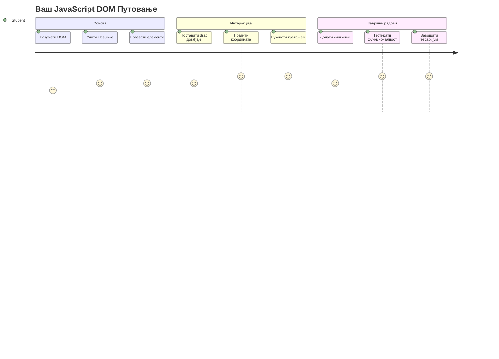
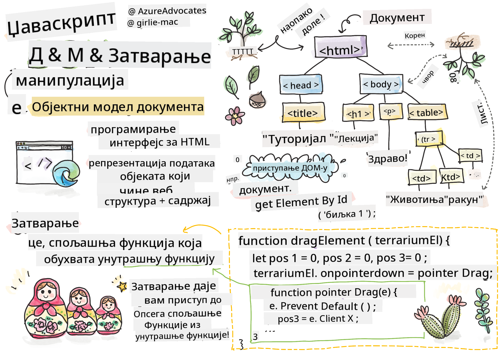
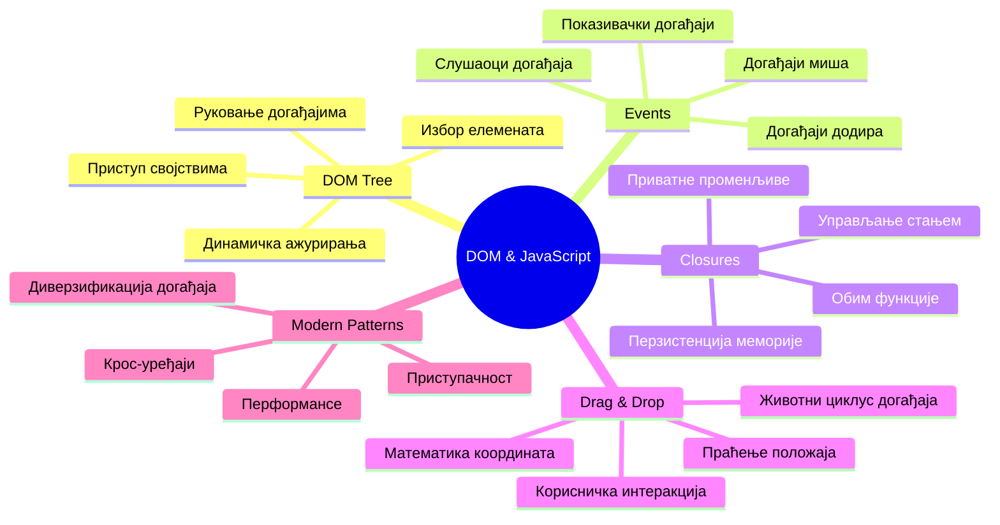
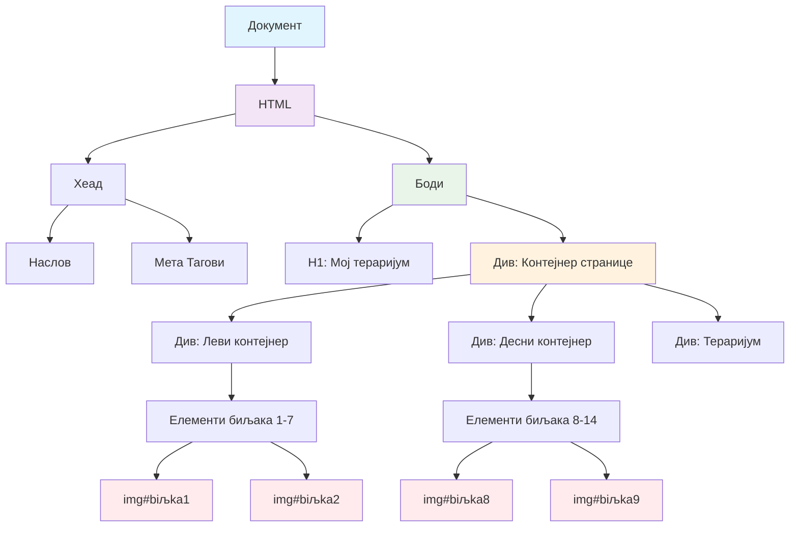
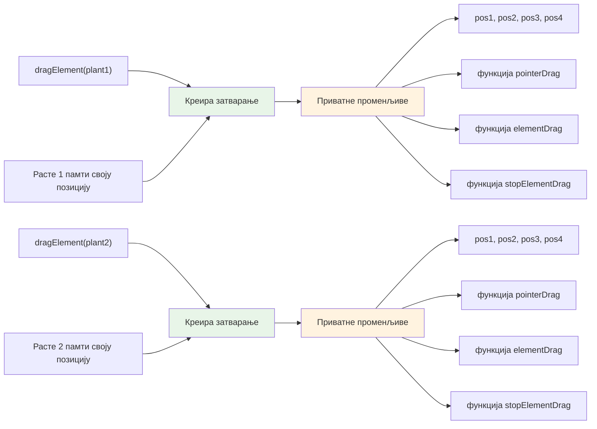
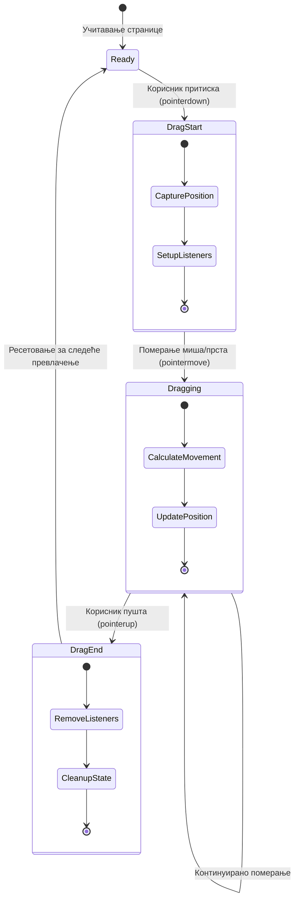
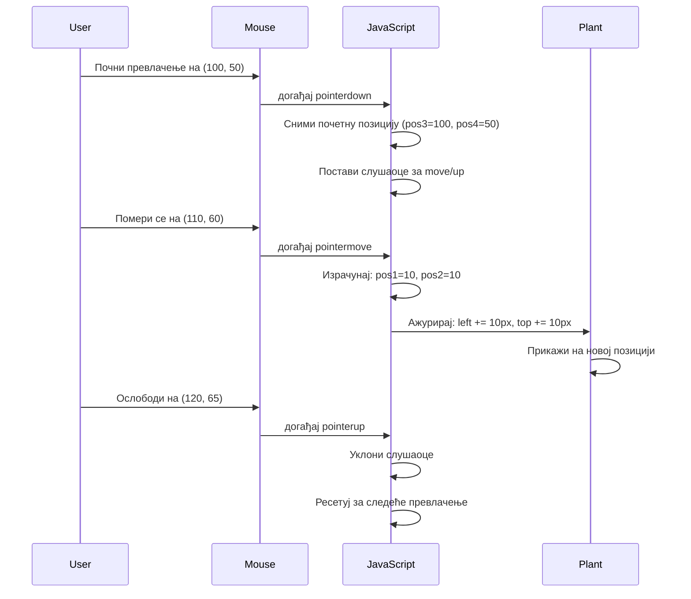
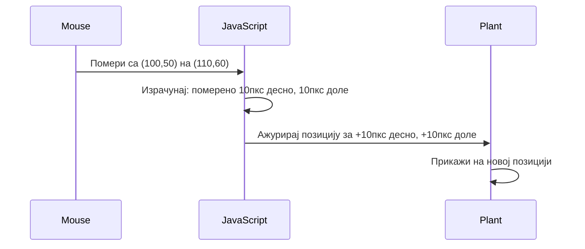
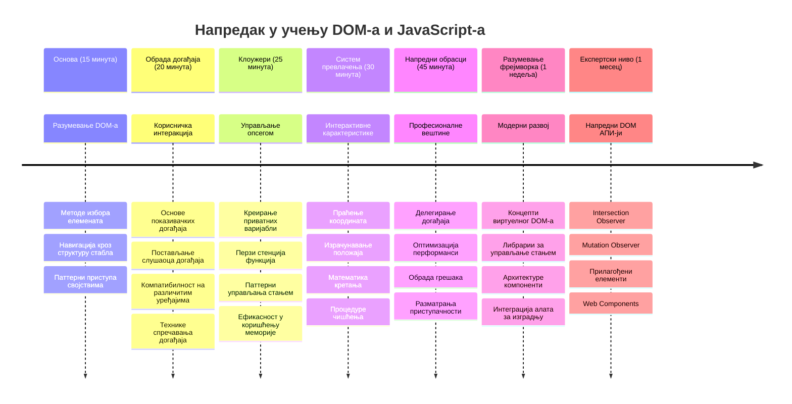

<!--
CO_OP_TRANSLATOR_METADATA:
{
  "original_hash": "973e48ad87d67bf5bb819746c9f8e302",
  "translation_date": "2026-01-07T08:22:25+00:00",
  "source_file": "3-terrarium/3-intro-to-DOM-and-closures/README.md",
  "language_code": "sr"
}
-->
# Пројекат Тераријум, део 3: Манипулација DOM-ом и JavaScript затварања



> Скетчнот од [Tomomi Imura](https://twitter.com/girlie_mac)

Добродошли у један од најузбудљивијих аспеката веб развоја – чинење ствари интерактивним! Document Object Model (DOM) је као мост између вашег HTML-а и JavaScript-а, а данас ћемо га користити да оживимо ваш тераријум. Када је Тим Бернерс-Ли направио први веб прегледач, замишљао је веб где документи могу бити динамички и интерактивни – DOM чини ту визију могућом.

Такође ћемо истражити JavaScript затварања, која можда на први поглед звуче застрашујуће. Замислите затварања као креирање „џепова меморије“ где ваше функције могу да памте важне информације. Као да свака биљка у вашем тераријуму има свој запис који прати њену позицију. До краја овог часа, разумећете колико су природна и корисна.

Ево шта правимо: тераријум у ком корисници могу да превлаче и испуштају биљке где год пожеле. Научићете технике манипулације DOM-ом које покрећу све, од превлачења и испуштања фајлова до интерактивних игара. Хајде да ваш тераријум оживимо.


## Квиз пре часа

[Квиз пре часа](https://ff-quizzes.netlify.app/web/quiz/19)

## Разумевање DOM-а: Ваш пут ка интерактивним веб страницама

Document Object Model (DOM) је начин на који JavaScript комуницира са вашим HTML елементима. Када ваш прегледач учита HTML страницу, он креира структуриран приказ те странице у меморији – то је DOM. Замислите га као породично стабло где је сваки HTML елемент члан породице који JavaScript може да приступи, измени или преуреди.

Манипулација DOM-ом претвара статичке странице у интерактивне веб сајтове. Сваки пут када видите да се дугме мења боју при преласку миша, садржај се ажурира без освежавања странице или можете да превлачите елементе, то је DOM манипулација у акцији.




> Приказ DOM-а и HTML ознаке која га позива. Из [Olfa Nasraoui](https://www.researchgate.net/publication/221417012_Profile-Based_Focused_Crawler_for_Social_Media-Sharing_Websites)

**Ево шта DOM чини моћним:**
- **Обезбеђује** структуриран начин приступа било ком елементу на вашој страници
- **Омогућава** динамичка ажурирања садржаја без освежавања странице
- **Дозвољава** одговарање у реалном времену на корисничке интеракције као што су кликови и превлачења
- **Ствара** основ за модерне интерактивне веб апликације

## JavaScript затварања: Креирање организованог и моћног кода

[JavaScript затварање](https://developer.mozilla.org/docs/Web/JavaScript/Closures) је као да функцији дате сопствени приватни радни простор са упорном меморијом. Размислите како су Дарвинове финчеве на Галапагоским острвима развиле специјализоване кљунове у зависности од свог специфичног окружења – затварања раде слично, креирајући специјализоване функције које „памте“ свој специфични контекст чак и после што је родитељска функција завршила.

У нашем тераријуму, затварања помажу свакој биљци да памти своју позицију независно. Овај образац се понавља у професионалном JavaScript развоју, чинећи га вредним концептом за разумевање.


> 💡 **Разумевање затварања**: Затварања су важна тема у JavaScript-у и многи програмери их користе годинама пре него што у потпуности схвате све теоријске аспекте. Данас се фокусирамо на практичну примену – видећете како затварања природно излазе док градимо наше интерактивне функције. Разумевање ће се развијати како будете гледали како решавају стварне проблеме.


> Приказ DOM-а и HTML ознаке која га позива. Из [Olfa Nasraoui](https://www.researchgate.net/publication/221417012_Profile-Based_Focused_Crawler_for_Social_Media-Sharing_Websites)

У овом часу, завршићемо наш интерактивни пројекат тераријума креирањем JavaScript-а који ће омогућити кориснику манипулацију биљкама на страници.

## Пре него што почнемо: Спремамо се за успех

Потребни су вам ваши HTML и CSS фајлови из претходних лекција тераријума – спремни смо да ту статичну дизајн претворимо у интерактивну. Ако нам се придружујете први пут, прво завршите те лекције да бисте разумели важан контекст.

Ево шта ћемо направити:
- **Глатко превлачење и испуштање** за све биљке у тераријуму
- **Праћење координата** како би биљке памтиле своје позиције
- **Комплетан интерактивни интерфејс** користећи ванила JavaScript
- **Чист и организован код** користећи образце затварања

## Постављање JavaScript фајла

Хајде да направимо JavaScript фајл који ће учинити ваш тераријум интерактивним.

**Први корак: Креирање скрипт фајла**

Унутар фолдера тераријума направите нови фајл под именом `script.js`.

**Други корак: Повежите JavaScript са вашим HTML-ом**

Додајте овај таг скрипте у `<head>` секцију вашег фајла `index.html`:

```html
<script src="./script.js" defer></script>
```

**Зашто је атрибут `defer` важан:**
- **Обезбеђује** да ваш JavaScript сачека док сваки HTML не буде учитан
- **Спречава** грешке када JavaScript тражи елементе који још увек нису спремни
- **Гарантује** да су сви ваши елементи биљака доступни за интеракцију
- **Пружа** боље перформансе него постављање скрипти на дно странице

> ⚠️ **Важна напомена**: Атрибут `defer` спречава честе проблеме везане за тајминг. Без њега, JavaScript може покушати да приступи HTML елементима пре него што се учитају, што доводи до грешака.

---

## Повезивање JavaScript-а са вашим HTML елементима

Пре него што учинимо елементе превуком клика (draggable), JavaScript мора да их пронађе у DOM-у. Замислите то као библиотечки каталог – када имате шифру, можете тачно пронаћи књигу која вам треба и приступити свему у њој.

Користићемо метод `document.getElementById()` да направимо ове везе. То је као прецизан систем архивирања – дате ID и он пронађе управо онај елемент који вам треба у вашем HTML-у.

### Омогућавање функције превлачења за све биљке

Додајте овај код у ваш фајл `script.js`:

```javascript
// Омогући функцију превлачења за свих 14 биљака
dragElement(document.getElementById('plant1'));
dragElement(document.getElementById('plant2'));
dragElement(document.getElementById('plant3'));
dragElement(document.getElementById('plant4'));
dragElement(document.getElementById('plant5'));
dragElement(document.getElementById('plant6'));
dragElement(document.getElementById('plant7'));
dragElement(document.getElementById('plant8'));
dragElement(document.getElementById('plant9'));
dragElement(document.getElementById('plant10'));
dragElement(document.getElementById('plant11'));
dragElement(document.getElementById('plant12'));
dragElement(document.getElementById('plant13'));
dragElement(document.getElementById('plant14'));
```

**Ево шта овај код постиже:**
- **Пронађе** сваки елемент биљке у DOM-у користећи његов јединствени ID
- **Добија** JavaScript референцу за сваки HTML елемент
- **Прослеђује** сваки елемент функцији `dragElement` (коју ћемо направити следеће)
- **Припрема** сваку биљку за интеракцију превлачења и испуштања
- **Повезује** вашу HTML структуру са JavaScript функционалношћу

> 🎯 **Зашто користити ID-јеве уместо класа?** ID-јеви дају јединствене идентификаторе за конкретне елементе, док се CSS класе користе за стилизовање група елемената. Када JavaScript треба да манипулише појединачним елементима, ID пружа прецизност и боље перформансе.

> 💡 **Трик за програмере**: Обратите пажњу како зовемо `dragElement()` за сваку биљку појединачно. Овај приступ осигурава да свака биљка добије своје независно понашање превлачења, што је кључно за глатку интеракцију са корисником.

### 🔄 **Педагошки проверавај**
**Разумевање DOM веза**: Пре него што пређете на функцију превлачења, проверите да ли можете:
- ✅ Објаснити како `document.getElementById()` пронађе HTML елементе
- ✅ Разумети зашто користимо јединствене ID-јеве за сваку биљку
- ✅ Описати сврху атрибута `defer` у таговима скрипти
- ✅ Упознати како се JavaScript и HTML повезују преко DOM-а

**Кратак самопровера**: Шта би се десило ако два елемента имају исти ID? Зашто `getElementById()` враћа само један елемент?
*Одговор: ID-јеви требају бити јединствени; ако су дуплирани, враћа се само први елемент*

---

## Креирање затварања dragElement

Сада ћемо направити срж наше функционалности превлачења: затварање које управља понашањем превлачења за сваку биљку. Ово затварање ће садржати више унутрашњих функција које раде заједно како би пратили кретање миша и ажурирали позиције елемената.

Затварања су савршена за овај задатак јер нам омогућавају да направимо „приватне“ променљиве које опстају између позива функција, дајући свакој биљци свој сопствени систем праћења координата.

### Разумевање затварања на једноставном примеру

Показаћу затварања једноставним примером који илуструје концепт:

```javascript
function createCounter() {
    let count = 0; // Ово је као приватна променљива
    
    function increment() {
        count++; // Унутрашња функција памти спољашњу променљиву
        return count;
    }
    
    return increment; // Враћамо унутрашњу функцију
}

const myCounter = createCounter();
console.log(myCounter()); // 1
console.log(myCounter()); // 2
```

**Ево шта се дешава у овом образцу затварања:**
- **Креира** приватну променљиву `count` која постоји само унутар овог затварања
- **Унутрашња функција** може приступити и мењати ту спољну променљиву (механизам затварања)
- **Када вратимо** унутрашњу функцију, она одржава везу са тим приватним подацима
- **Чак и након** што `createCounter()` заврши извршавање, `count` опстаје и памти своју вредност

### Зашто су затварања савршена за функцију превлачења

За наш тераријум, свака биљка треба да памти своје тренутне координате позиције. Затварања пружају савршено решење:

**Кључне користи за наш пројекат:**
- **Чува** приватне променљиве позиције за сваку биљку независно
- **Спречава** губитак података о координатама између догађаја превлачења
- **Спречава** конфликте променљивих између различитих елемената који се могу превлачити
- **Ствара** чисту и организовану структуру кода

> 🎯 **Циљ учења**: Не морате одмах савладати сваки аспект затварања. Усредсредите се да видите како нам помажу да организујемо код и одржавамо стање за нашу функционалност превлачења.


### Креирање функције dragElement

Хајде да сада изградимо главну функцију која ће обради све логику превлачења. Додајте ову функцију испод ваших декларација елемената биљака:

```javascript
function dragElement(terrariumElement) {
    // Иницијализуј променљиве за праћење позиције
    let pos1 = 0,  // Претходна X позиција миша
        pos2 = 0,  // Претходна Y позиција миша
        pos3 = 0,  // Тренутна X позиција миша
        pos4 = 0;  // Тренутна Y позиција миша
    
    // Подеси почетног слушаоца догађаја превлачења
    terrariumElement.onpointerdown = pointerDrag;
}
```

**Разумевање система праћења позиције:**
- **`pos1` и `pos2`**: Чувају разлику између старих и нових положаја миша
- **`pos3` и `pos4`**: Праћење тренутних координата миша
- **`terrariumElement`**: Конкретни елемент биљке који правимо превлачивим
- **`onpointerdown`**: Догађај који се активира када корисник почне превлачење

**Ево како функционише образац са затварањем:**
- **Креира** приватне променљиве позиције за сваки елемент биљке
- **Одржава** те променљиве током целог животног века превлачења
- **Обезбеђује** да свака биљка прати своје координате независно
- **Пружа** чист интерфејс кроз функцију `dragElement`

### Зашто користити pointer догађаје?

Можда вас занима зашто користимо `onpointerdown` уместо познатијег `onclick`. Ево разлога:

| Тип догађаја | Најбоље за | Мана |
|--------------|------------|-------|
| `onclick`    | Једноставни клик дугмета | Не може да рукује превлачењем (само кликови и пуштања) |
| `onpointerdown` | И миш и додир | Новији, али добро подржан |
| `onmousedown` | Само миш на десктопу | Искључује мобилне кориснике |

**Зашто су pointer догађаји савршени за оно што правимо:**
- **Ради одлично** без обзира да ли корисник користи миш, прст или стилус
- **Пружa исти осећај** на лаптопу, таблету или телефону
- **Управља** самом радњом превлачења (не само кликом)
- **Ствара** глатко искуство које корисници очекују од модерних веб апликација

> 💡 **За будућност**: Pointer догађаји су модеран начин руковања корисничким интеракцијама. Уместо да пишете посебан код за миш и додир, добијате оба аутоматски. Пријатно, зар не?

### 🔄 **Педагошки проверавај**
**Разумевање руковања догађајима**: Устаните и потврдите своје разумевање догађаја:
- ✅ Зашто користимо pointer догађаје уместо миш догађаја?
- ✅ Како променљиве у затварању опстају између позива функција?
- ✅ Која је улога `preventDefault()` у глатком превлачењу?
- ✅ Зашто прикачујемо слушаоце догађаја на документ, а не на појединачне елементе?

**Повезаност са стварним светом**: Размислите о интерфејсима за превлачење и испуштање које користите свакодневно:
- **Постављање фајлова**: Превлачење фајлова у прозор претраживача
- **Канбан таблице**: Померање задатака између колона
- **Галерије слика**: Прераспоређивање редоследа фотографија
- **Мобилни интерфејси**: Превлачење и клизање на екрану осетљивом на додир

---

## Функција pointerDrag: Занимамо почетак превлачења

Када корисник кликне на биљку (било кликом миша или додиром прста), функција `pointerDrag` улази у акцију. Ова функција бележи почетне координате и поставља систем превлачења.

Додајте ову функцију унутар вашег затварања `dragElement`, одмах испод линије `terrariumElement.onpointerdown = pointerDrag;`:

```javascript
function pointerDrag(e) {
    // Спријечити подразумевано понашање прегледача (као што је селекција текста)
    e.preventDefault();
    
    // Заробити почетни положај миша/дотирања
    pos3 = e.clientX;  // X координата где је повлачење почело
    pos4 = e.clientY;  // Y координата где је повлачење почело
    
    // Подесити слушаоце догађаја за процес превлачења
    document.onpointermove = elementDrag;
    document.onpointerup = stopElementDrag;
}
```

**Корак по корак, ево шта се дешава:**
- **Спречава** подразумевано понашање прегледача које може сметати превлачењу
- **Бележи** тачне координате на којима је корисник започео превлачење
- **Поставља** слушаоце догађаја за наставак кретања превлачења
- **Припрема** систем за праћење кретања миша/прста широм целог документа

### Разумевање спречавања догађаја

Линија `e.preventDefault()` је пресудна за глатко превлачење:

**Без спречавања, прегледачи могу:**
- **Означавати** текст док превлачите преко странице
- **Покренути** контекстуалне меније при десном клику превлачења
- **Ометати** нашу прилагођену функционалност превлачења
- **Стварају** визуелне артефакте током операције превлачења

> 🔍 **Експеримент**: Након завршетка овог часа, покушајте да уклоните `e.preventDefault()` и видите како то утиче на искуство превлачења. Брзо ћете уочити зашто је ова линија неопходна!

### Систем праћења координата

Својства `e.clientX` и `e.clientY` нам дају прецизне координате миша/додира:

| Својство | Шта мери | Примена |
|----------|----------|----------|
| `clientX` | Хоризонталну позицију релативно на прозор прегледача | Праћење кретања лево-десно |
| `clientY` | Вертикалну позицију релативно на прозор прегледача | Праћење кретања горе-доле |
**Разумевање ових координата:**
- **Пружа** позиционирање са пиксел-прецизношћу
- **Ажурира се** у реалном времену како корисник помера показивач
- **Остаје** конзистентно на различитим величинама екрана и нивоима зумирања
- **Омогућава** глатку, реактивну интеракцију превлачења

### Постављање глобалних слушаћа догађаја на документу

Приметите како прикачујемо догађаје померања и заустављања на цео `document`, а не само на елемент биљке:

```javascript
document.onpointermove = elementDrag;
document.onpointerup = stopElementDrag;
```

**Зашто прикачити на документ:**
- **Наставља** праћење чак и када миш напусти елемент биљке
- **Спријечава** прекид превлачења ако корисник брзо помери миш
- **Пружа** глатко превлачење преко целог екрана
- **Обрађује** безбедносне случајеве када курсор изађе из прозора претраживача

> ⚡ **Белешка о перформансама**: Показаћемо како очистити ове слушаоце на нивоу документа када се превлачење заврши како бисмо избегли цурење меморије и проблеме са перформансама.

## Завршетак система превлачења: кретање и чишћење

Сада ћемо додати две преостале функције које управљају стварним кретањем превлачења и чишћењем када превлачење престане. Ове функције заједно стварају глатко, реактивно кретање биљке кроз ваш тераријум.

### Функција elementDrag: праћење кретања

Додајте функцију `elementDrag` одмах након затварајуће витичасте заграде функције `pointerDrag`:

```javascript
function elementDrag(e) {
    // Израчунај растојање померено од последњег догађаја
    pos1 = pos3 - e.clientX;  // Хоризонтално померено растојање
    pos2 = pos4 - e.clientY;  // Вертикално померено растојање
    
    // Ажурирај праћење тренутне позиције
    pos3 = e.clientX;  // Нова тренутна X позиција
    pos4 = e.clientY;  // Нова тренутна Y позиција
    
    // Примени померање на позицију елемента
    terrariumElement.style.top = (terrariumElement.offsetTop - pos2) + 'px';
    terrariumElement.style.left = (terrariumElement.offsetLeft - pos1) + 'px';
}
```

**Разумевање математике координата:**
- **`pos1` и `pos2`**: Израчунавају колико се миш померио од последњег ажурирања
- **`pos3` и `pos4`**: Чувају тренутну позицију миша за наредну калкулацију
- **`offsetTop` и `offsetLeft`**: Добијају тренутну позицију елемента на страници
- **Логика одузимања**: Помера елемент за онолико колико се миш померио


**Ево како изгледа калкулација кретања:**
1. **Мери** разлику између старе и нове позиције миша
2. **Рачуна** колико треба померити елемент на основу кретања миша
3. **Ажурира** CSS позицију елемента у реалном времену
4. **Чува** нову позицију као основицу за следећу калкулацију

### Визуелна репрезентација математике


### Функција stopElementDrag: чишћење

Додајте функцију за чишћење након затварајуће витичасте заграде функције `elementDrag`:

```javascript
function stopElementDrag() {
    // Уклони слушаоце догађаја нивоа документа
    document.onpointerup = null;
    document.onpointermove = null;
}
```

**Зашто је чишћење важно:**
- **Спријечава** цурење меморије од осталих слушаоца догађаја
- **Зауставља** понашање превлачења када корисник пусти биљку
- **Омогућава** другим елементима да се превлаче независно
- **Ресетује** систем за следећу операцију превлачења

**Шта се дешава без чишћења:**
- Слушаоци догађаја настављају да раде и после престанка превлачења
- Перформансе се смањују јер се слушаоци нагомилавају
- Неочекивано понашање у интеракцији са другим елементима
- Браузер троши ресурсе на непотребно руковање догађајима

### Разумевање CSS позиционих својстава

Наш систем превлачења манипулише два кључна CSS својства:

| Својство | Шта контролише | Како га користимо |
|----------|----------------|-------------------|
| `top` | Удаљеност од горње ивице | Вертикално позиционирање током превлачења |
| `left` | Удаљеност од леве ивице | Хоризонтално позиционирање током превлачења |

**Кључне информације о offset својствима:**
- **`offsetTop`**: Тренутна удаљеност од горње стране позиционираног родитељског елемента
- **`offsetLeft`**: Тренутна удаљеност од леве стране позиционираног родитељског елемента
- **Контекст позиционирања**: Ове вредности су релативне према најближем позиционираном претку
- **Ажурирања у реалном времену**: Одмах се мењају када ми мењамо CSS позицијске вредности

> 🎯 **Филозофија дизајна**: Овај систем превлачења је намерно флексибилан – нема „зона за одлагање“ или ограничења. Корисници могу постављати биљке било где, имајући пуну креативну контролу над дизајном свог тераријума.

## Све заједно: ваш комплетан систем превлачења

Честитамо! Управо сте изградили сложен систем превлачења и испуштања користећи ванила JavaScript. Ваша комплетна функција `dragElement` садржи снажан closure који управља:

**Шта ваш closure постиже:**
- **Одржава** приватне променљиве позиције за сваку биљку независно
- **Обрађује** комплетан животни циклус превлачења од почетка до краја
- **Пружа** глатко, реактивно кретање на целом екрану
- **Очишћава** ресурсе правилно да спречи цурење меморије
- **Креира** интуитиван, креативан интерфејс за дизајн тераријума

### Тестирање вашег интерактивног тераријума

Сада тестирате ваш интерактивни тераријум! Отворите датотеку `index.html` у веб претраживачу и испробајте функционалност:

1. **Кликните и држите** било коју биљку да почнете превлачење
2. **Померајте миш или прст** и гледајте како биљка глатко прати
3. **Пустите** да биљка падне на нову позицију
4. **Експериментишите** са различитим распоредом да бисте истражили интерфејс

🥇 **Постигнуће**: Креирали сте потпуно интерактивну веб апликацију која користи основне концепте које професионални програмери користе свакодневно. Тај drag-and-drop користи исте принципе као слање фајлова, канбан табле и многе друге интерактивне интерфејсе.

### 🔄 **Педагошки преглед**
**Потпуна разумавања система**: Проверите своје знање целог система превлачења:
- ✅ Како closure одржава независно стање за сваку биљку?
- ✅ Зашто је потребна математика координата за глатко кретање?
- ✅ Шта би се десило ако заборавимо да очистимо слушаоце догађаја?
- ✅ Како се овај образац скалира на комплексније интеракције?

**Разматрање квалитета кода**: Прегледајте своје комплетно решење:
- **Модуларни дизајн**: Свакој биљци припада свој инстанца closure-а
- **Ефикасност догађаја**: Правилно постављање и чишћење слушалаца
- **Подршка за више уређаја**: Ради на десктопу и мобилном
- **Свест о перформансама**: Без цурења меморије или сувишних калкулација


---

## GitHub Copilot Agent изазов 🚀

Користите Agent режим да завршите следећи изазов:

**Опис:** Унапредите тераријум пројекат додавањем функције ресетовања која враћа све биљке у њихове почетне позиције са глатким анимацијама.

**Подстицај:** Направите ресет дугме које, када се кликне, анимира све биљке натраг до њихових оригиналних позиција са бочног панела користећи CSS транзиције. Функција би требало да сачува оригиналне позиције када се страница учита и глатко врати биљке на те позиције у трајању од 1 секунде када се дугме ресета притисне.

Сазнајте више о [agent режиму](https://code.visualstudio.com/blogs/2025/02/24/introducing-copilot-agent-mode).

## 🚀 Додатни изазов: Проширите своје вештине

Спремни да подигнете свој тераријум на виши ниво? Покушајте да имплементирате ове надоградње:

**Креативна проширења:**
- **Дупли клик** на биљку да је доведе у први план (з-индекс манипулација)
- **Додајте визуелне повратне информације** као што је благи сјај при лебдењу преко биљки
- **Имплементирајте границе** како бисте спречили да се биљке превлаче ван тераријума
- **Направите функцију чувања** која памти позиције биљака користећи localStorage
- **Додајте звучне ефекте** за подизање и постављање биљки

> 💡 **Могућност учења**: Сваки од ових изазова ће вас научити новим аспектима манипулације DOM-ом, руковања догађајима и дизајна корисничког искуства.

## Квиз после предавања

[Post-lecture quiz](https://ff-quizzes.netlify.app/web/quiz/20)

## Преглед & Самосталан рад: Продубљивање разумевања

Мастеризовали сте основе манипулације DOM-ом и closure-а, али увек има више за истраживање! Ево неколико путева за ширење знања и вештина.

### Алтернативни приступи превлачењу и испуштању

Користили смо pointer догађаје за максималну флексибилност, али веб развој нуди више приступа:

| Приступ | Најпогоднији за | Вредност учења |
|---------|-----------------|----------------|
| [HTML Drag and Drop API](https://developer.mozilla.org/docs/Web/API/HTML_Drag_and_Drop_API) | Пренос фајлова, формалне зоне за превлачење | Разумевање нативних могућности претраживача |
| [Touch Events](https://developer.mozilla.org/docs/Web/API/Touch_events) | Мобилне специјалне интеракције | Шаблони развоја usredsređeni на мобилне уређаје |
| CSS `transform` својства | Глатке анимације | Технике оптимизације перформанси |

### Напредне теме манипулације DOM-ом

**Следећи кораци у вашим учењима:**
- **Делегирање догађаја**: Ефикасно руковање догађајима за више елемената
- **Intersection Observer**: Препознавање када елементи улазе/излазе из видног поља
- **Mutation Observer**: Прати промене у DOM структури
- **Web Components**: Креирање поновљивих, инкапсулираних UI елемената
- **Концепти виртуелног DOM-а**: Разумевање како фрејмворци оптимизују ажурирања DOM-а

### Кључни ресурси за даље учење

**Техничка документација:**
- [MDN Водич за pointer event-е](https://developer.mozilla.org/docs/Web/API/Pointer_events) – Свеобухватна референца pointer догађаја
- [W3C спецификација pointer event-а](https://www.w3.org/TR/pointerevents1/) – Званична стандардна документација
- [Дубинско разумевање JavaScript closure-а](https://developer.mozilla.org/docs/Web/JavaScript/Closures) – Напредни обрасци closure-а

**Компатибилност прегледача:**
- [CanIUse.com](https://caniuse.com/) – Провера подршке функција у прегледачима
- [MDN Browser Compatibility Data](https://github.com/mdn/browser-compat-data) – Детаљне информације о компатибилности

**Могућности за праксу:**
- **Изградите** пукле игру користећи сличне механизме превлачења
- **Креирајте** канбан таблу са управљањем задатака превлачењем
- **Дизајнирајте** галерију слика са распоредом фотографија које се могу превлачити
- **Експериментишите** са gestama на додир за мобилне интерфејсе

> 🎯 **Стратегија учења**: Најбољи начин да ове концепте учврстите је пракса. Покушајте да направите варијације интерфејса за превлачење – сваки пројекат ће вас научити нечему новом о интеракцији са корисником и манипулацији DOM-ом.

### ⚡ **Шта можете урадити у наредних 5 минута**
- [ ] Отворите DevTools претраживача и у конзоли укуцајте `document.querySelector('body')`
- [ ] Покушајте да промените текст на веб страници користећи `innerHTML` или `textContent`
- [ ] Додајте слушаоца догађаја за кликовање на било које дугме или линк на страници
- [ ] Испитајте структуру DOM стабла користећи панел Elements

### 🎯 **Шта можете постићи у овом часу**
- [ ] Завршите квиз након лекције и прегледајте концепте манипулације DOM-ом
- [ ] Направите интерактивну веб страницу која реагује на корисничке кликове
- [ ] Вежбајте руковање догађајима са различитим типовима (click, mouseover, keypress)
- [ ] Направите једноставну листу обавеза или бројач користећи манипулацију DOM-ом
- [ ] Истражите везу између HTML елемената и JavaScript објеката

### 📅 **Ваша JavaScript путовања током недеље**
- [ ] Завршите интерактивни тераријум пројекат са drag-and-drop функционалношћу
- [ ] Мастерирајте делегирање догађаја за ефикасно руковање
- [ ] Учите о event-loop-у и асинхроном JavaScript-у
- [ ] Вежбајте closure коришћењем модула са приватним стањем
- [ ] Истражите модерне DOM API-је попут Intersection Observer-а
- [ ] Направите интерактивне компоненте без коришћења фрејмворка

### 🌟 **Ваш месечни JavaScript мајсторски ниво**
- [ ] Направите сложену једностраничну апликацију користећи ванила JavaScript
- [ ] Учите модеран фрејмворк (React, Vue или Angular) и упоредите га са ванила DOM-ом
- [ ] Доприносите open source JavaScript пројектима
- [ ] Мастерирајте напредне концепте као што су web components и custom elements
- [ ] Креирајте перформантне веб апликације са оптималним DOM шаблонима
- [ ] Подучавајте друге о манипулацији DOM-ом и основама JavaScript-а

## 🎯 Ваша временска линија за мајсторство JavaScript DOM-а


### 🛠️ Ваш резиме JavaScript алата

Након завршетка ове лекције, сада поседујете:
- **Домено знање о DOM-у**: Избор елемената, манипулација својствима и навигација кроз стабло
- **Експертизу у догађајима**: Руководење интеракцијом на више уређаја помоћу pointer догађаја
- **Разумевање closure-а**: Управљање приватним стањем и трајност функција
- **Интерактивне системе**: Потпуна имплементација drag-and-drop-а од нуле
- **Свест о перформансама**: Правилно чишћење догађаја и управљање меморијом
- **Модерне шаблоне**: Технике организације кода коришћене у професионалном развоју
- **Корисничко искуство**: Креирање интуитивних, реактивних интерфејса

**Стечене професионалне вештине**: Креирали сте функције користећи исте технике као:
- **Trello/Kanban табле**: Превлачење картица између колона
- **Системи за слање фајлова**: Drag-and-drop руковање фајловима
- **Галерије слика**: Интерфејси за распоред фотографија
- **Мобилне апликације**: Патерни интеракције засновани на додиру

**Следећи ниво**: Спремни сте да истражите модерне фрејмворке као што су React, Vue или Angular који се надовезују на ове фундаменталне концепте манипулације DOM-ом!

## Задатак

[Work a bit more with the DOM](assignment.md)

---

<!-- CO-OP TRANSLATOR DISCLAIMER START -->
**Одрицање од одговорности**:  
Овај документ је преведен помоћу услуге за аутоматски превод на бази вештачке интелигенције [Co-op Translator](https://github.com/Azure/co-op-translator). Иако настојимо прецизности, имајте у виду да аутоматски преводи могу садржати грешке или нетачности. Оригинални документ на његовом изворном језику треба сматрати ауторитетним извором. За критичне информације препоручује се професионални људски превод. Нисмо одговорни за било каква неспоразуми или погрешна тумачења настала коришћењем овог превода.
<!-- CO-OP TRANSLATOR DISCLAIMER END -->