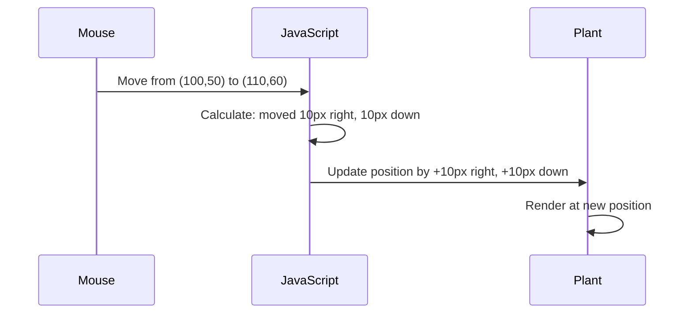

<!--
CO_OP_TRANSLATOR_METADATA:
{
  "original_hash": "bc93f6285423033ebf5b8abeb5282888",
  "translation_date": "2025-10-24T23:22:39+00:00",
  "source_file": "3-terrarium/3-intro-to-DOM-and-closures/README.md",
  "language_code": "sr"
}
-->
# Пројекат Тераријум, део 3: Манипулација DOM-ом и JavaScript затварања


> Скетч од [Tomomi Imura](https://twitter.com/girlie_mac)

Добродошли у један од најзанимљивијих аспеката веб развоја - прављење интерактивних елемената! Document Object Model (DOM) је као мост између вашег HTML-а и JavaScript-а, а данас ћемо га користити да оживимо ваш тераријум. Када је Тим Бернерс-Ли створио први веб прегледач, замислио је веб где документи могу бити динамични и интерактивни - DOM чини ту визију могућом.

Такође ћемо истражити JavaScript затварања, која могу звучати застрашујуће на први поглед. Замислите затварања као "џепове меморије" где ваше функције могу памтити важне информације. То је као да свака биљка у вашем тераријуму има свој сопствени запис података за праћење своје позиције. До краја овог часа, разумећете колико су природна и корисна.

Ево шта градимо: тераријум где корисници могу да превлаче и постављају биљке где год желе. Научићете технике манипулације DOM-ом које омогућавају све, од превлачења и отпуштања датотека до интерактивних игара. Хајде да оживимо ваш тераријум.

## Квиз пре предавања

[Квиз пре предавања](https://ff-quizzes.netlify.app/web/quiz/19)

## Разумевање DOM-а: Ваш пут ка интерактивним веб страницама

Document Object Model (DOM) је начин на који JavaScript комуницира са вашим HTML елементима. Када ваш прегледач учита HTML страницу, он креира структурисану репрезентацију те странице у меморији - то је DOM. Замислите га као породично стабло где је сваки HTML елемент члан породице до којег JavaScript може приступити, модификовати га или га преместити.

Манипулација DOM-ом претвара статичне странице у интерактивне веб странице. Сваки пут када видите да дугме мења боју при преласку мишем, садржај се ажурира без освежавања странице или елементи које можете превлачити, то је рад манипулације DOM-ом.


> Репрезентација DOM-а и HTML ознака које га референцирају. Од [Olfa Nasraoui](https://www.researchgate.net/publication/221417012_Profile-Based_Focused_Crawler_for_Social_Media-Sharing_Websites)

**Ево шта DOM чини моћним:**
- **Омогућава** структурисан начин приступа било ком елементу на вашој страници
- **Омогућава** динамичка ажурирања садржаја без освежавања странице
- **Омогућава** одговор у реалном времену на интеракције корисника као што су кликови и превлачења
- **Ствара** основу за модерне интерактивне веб апликације

## JavaScript затварања: Креирање организованог и моћног кода

[JavaScript затварање](https://developer.mozilla.org/docs/Web/JavaScript/Closures) је као да функцији дате сопствени приватни простор за рад са трајном меморијом. Замислите како су Дарвинове зебе на Галапагосу развиле специјализоване кљунове на основу свог специфичног окружења - затварања функционишу на сличан начин, стварајући специјализоване функције које "памте" свој специфичан контекст чак и након што њихова родитељска функција заврши.

У нашем тераријуму, затварања помажу свакој биљци да памти своју позицију независно. Овај образац се често користи у професионалном JavaScript развоју, што га чини вредним концептом за разумевање.

> 💡 **Разумевање затварања**: Затварања су значајна тема у JavaScript-у, и многи програмери их користе годинама пре него што у потпуности схвате све теоријске аспекте. Данас се фокусирамо на практичну примену - видећете како затварања природно настају док градимо наше интерактивне функције. Разумевање ће се развијати како будете видели како решавају стварне проблеме.


> Репрезентација DOM-а и HTML ознака које га референцирају. Од [Olfa Nasraoui](https://www.researchgate.net/publication/221417012_Profile-Based_Focused_Crawler_for_Social_Media-Sharing_Websites)

У овом часу, завршићемо наш интерактивни пројекат тераријума креирањем JavaScript-а који ће омогућити кориснику да манипулише биљкама на страници.

## Пре него што почнемо: Припрема за успех

Биће вам потребни ваши HTML и CSS фајлови из претходних лекција о тераријуму - сада ћемо направити ту статичну дизајн интерактивним. Ако се први пут придружујете, завршавање тих лекција прво ће пружити важан контекст.

Ево шта ћемо изградити:
- **Глатко превлачење и отпуштање** за све биљке у тераријуму
- **Праћење координата** како би биљке памтиле своје позиције
- **Комплетан интерактивни интерфејс** користећи ванила JavaScript
- **Чист, организован код** користећи обрасце затварања

## Постављање вашег JavaScript фајла

Хајде да креирамо JavaScript фајл који ће учинити ваш тераријум интерактивним.

**Корак 1: Креирајте ваш скрипт фајл**

У вашем фолдеру за тераријум, креирајте нови фајл под називом `script.js`.

**Корак 2: Повежите JavaScript са вашим HTML-ом**

Додајте овај `<script>` таг у секцију `<head>` вашег `index.html` фајла:

```html
<script src="./script.js" defer></script>
```

**Зашто је `defer` атрибут важан:**
- **Осигурава** да ваш JavaScript чека док се сав HTML не учита
- **Спречава** грешке где JavaScript тражи елементе који још нису спремни
- **Гарантује** да су сви ваши елементи биљака доступни за интеракцију
- **Пружа** боље перформансе него постављање скрипти на дно странице

> ⚠️ **Важно обавештење**: `defer` атрибут спречава уобичајене проблеме са временом учитавања. Без њега, JavaScript може покушати да приступи HTML елементима пре него што се учитају, што узрокује грешке.

---

## Повезивање JavaScript-а са вашим HTML елементима

Пре него што можемо учинити елементе превлачним, JavaScript мора да их пронађе у DOM-у. Замислите ово као систем каталогизације библиотеке - када имате број каталога, можете пронаћи тачно књигу која вам је потребна и приступити свим њеним садржајима.

Користићемо метод `document.getElementById()` да направимо ове везе. То је као да имате прецизан систем за архивирање - дате ID и он проналази тачно елемент који вам је потребан у вашем HTML-у.

### Омогућавање функције превлачења за све биљке

Додајте овај код у ваш `script.js` фајл:

```javascript
// Enable drag functionality for all 14 plants
dragElement(document.getElementById('plant1'));
dragElement(document.getElementById('plant2'));
dragElement(document.getElementById('plant3'));
dragElement(document.getElementById('plant4'));
dragElement(document.getElementById('plant5'));
dragElement(document.getElementById('plant6'));
dragElement(document.getElementById('plant7'));
dragElement(document.getElementById('plant8'));
dragElement(document.getElementById('plant9'));
dragElement(document.getElementById('plant10'));
dragElement(document.getElementById('plant11'));
dragElement(document.getElementById('plant12'));
dragElement(document.getElementById('plant13'));
dragElement(document.getElementById('plant14'));
```

**Ево шта овај код постиже:**
- **Проналази** сваки елемент биљке у DOM-у користећи његов јединствени ID
- **Претражује** JavaScript референцу за сваки HTML елемент
- **Прослеђује** сваки елемент функцији `dragElement` (коју ћемо креирати у наставку)
- **Припрема** сваку биљку за интерактивно превлачење и отпуштање
- **Повезује** вашу HTML структуру са JavaScript функционалношћу

> 🎯 **Зашто користити ID-еве уместо класа?** ID-еви пружају јединствене идентификаторе за специфичне елементе, док су CSS класе дизајниране за стилизовање група елемената. Када JavaScript треба да манипулише појединачним елементима, ID-еви нуде прецизност и перформансе које су нам потребне.

> 💡 **Савет**: Приметите како позивамо `dragElement()` за сваку биљку појединачно. Овај приступ осигурава да свака биљка добије своје независно понашање при превлачењу, што је од суштинског значаја за глатку интеракцију корисника.

---

## Изградња затварања функције dragElement

Сада ћемо креирати срж наше функционалности превлачења: затварање које управља понашањем превлачења за сваку биљку. Ово затварање ће садржати више унутрашњих функција које раде заједно да прате кретање миша и ажурирају позиције елемената.

Затварања су савршена за овај задатак јер нам омогућавају да креирамо "приватне" променљиве које трају између позива функција, дајући свакој биљци свој независни систем за праћење координата.

### Разумевање затварања кроз једноставан пример

Дозволите ми да демонстрирам затварања кроз једноставан пример који илуструје концепт:

```javascript
function createCounter() {
    let count = 0; // This is like a private variable
    
    function increment() {
        count++; // The inner function remembers the outer variable
        return count;
    }
    
    return increment; // We're giving back the inner function
}

const myCounter = createCounter();
console.log(myCounter()); // 1
console.log(myCounter()); // 2
```

**Ево шта се дешава у овом обрасцу затварања:**
- **Креира** приватну променљиву `count` која постоји само унутар овог затварања
- **Унутрашња функција** може приступити и модификовати ту спољашњу променљиву (механизам затварања)
- **Када вратимо** унутрашњу функцију, она одржава своју везу са тим приватним подацима
- **Чак и након** што `createCounter()` заврши извршење, `count` остаје и памти своју вредност

### Зашто су затварања савршена за функционалност превлачења

За наш тераријум, свакој биљци је потребно да памти своје тренутне координате позиције. Затварања пружају савршено решење:

**Кључне предности за наш пројекат:**
- **Одржавају** приватне променљиве позиције за сваку биљку независно
- **Чувају** податке о координатама између догађаја превлачења
- **Спречавају** конфликте променљивих између различитих превлачних елемената
- **Креирају** чисту, организовану структуру кода

> 🎯 **Циљ учења**: Не морате савладати сваки аспект затварања одмах. Фокусирајте се на то како нам помажу да организујемо код и одржавамо стање за нашу функционалност превлачења.

### Креирање функције dragElement

Сада ћемо изградити главну функцију која ће управљати свом логиком превлачења. Додајте ову функцију испод ваших декларација елемената биљака:

```javascript
function dragElement(terrariumElement) {
    // Initialize position tracking variables
    let pos1 = 0,  // Previous mouse X position
        pos2 = 0,  // Previous mouse Y position  
        pos3 = 0,  // Current mouse X position
        pos4 = 0;  // Current mouse Y position
    
    // Set up the initial drag event listener
    terrariumElement.onpointerdown = pointerDrag;
}
```

**Разумевање система за праћење позиције:**
- **`pos1` и `pos2`**: Чувају разлику између старих и нових позиција миша
- **`pos3` и `pos4`**: Прате тренутне координате миша
- **`terrariumElement`**: Специфичан елемент биљке који правимо превлачним
- **`onpointerdown`**: Догађај који се активира када корисник започне превлачење

**Ево како функционише образац затварања:**
- **Креира** приватне променљиве позиције за сваки елемент биљке
- **Одржава** те променљиве током животног циклуса превлачења
- **Осигурава** да свака биљка прати своје координате независно
- **Пружа** чист интерфејс кроз функцију `dragElement`

### Зашто користити догађаје показивача?

Можда се питате зашто користимо `onpointerdown` уместо познатијег `onclick`. Ево објашњења:

| Тип догађаја | Најбоље за | Мана |
|--------------|------------|------|
| `onclick` | Једноставни кликови на дугме | Не може да обради превлачење (само кликове и отпуштање) |
| `onpointerdown` | И миш и додир | Новије, али добро подржано данас |
| `onmousedown` | Само десктоп миш | Изоставља кориснике мобилних уређаја |

**Зашто су догађаји показивача савршени за оно што градимо:**
- **Одлично функционишу** без обзира да ли неко користи миш, прст или чак стилус
- **Исти осећај** на лаптопу, таблету или телефону
- **Обрађују** стварно кретање превлачења (не само кликове и отпуштање)
- **Креирају** глатко искуство које корисници очекују од модерних веб апликација

> 💡 **Припрема за будућност**: Догађаји показивача су модеран начин за обраду интеракција корисника. Уместо да пишете посебан код за миш и додир, добијате оба бесплатно. Прилично згодно, зар не?

---

## Функција pointerDrag: Хватање почетка превлачења

Када корисник притисне биљку (било кликом миша или додиром прста), функција `pointerDrag` ступа у акцију. Ова функција хвата почетне координате и поставља систем превлачења.

Додајте ову функцију унутар вашег затварања `dragElement`, одмах након линије `terrariumElement.onpointerdown = pointerDrag;`:

```javascript
function pointerDrag(e) {
    // Prevent default browser behavior (like text selection)
    e.preventDefault();
    
    // Capture the initial mouse/touch position
    pos3 = e.clientX;  // X coordinate where drag started
    pos4 = e.clientY;  // Y coordinate where drag started
    
    // Set up event listeners for the dragging process
    document.onpointermove = elementDrag;
    document.onpointerup = stopElementDrag;
}
```

**Корак по корак, ево шта се дешава:**
- **Спречава** подразумевано понашање прегледача које би могло ометати превлачење
- **Бележи** тачне координате где је корисник започео гест превлачења
- **Успоставља** слушаоце догађаја за текуће кретање превлачења
- **Припрема** систем за праћење кретања миша/прста преко целог документа

### Разумевање спречавања догађаја

Линија `e.preventDefault()` је кључна за глатко превлачење:

**Без спречавања, прегледачи могу:**
- **Изабрати** текст приликом превлачења преко странице
- **Активирати** контекстне меније при превлачењу десним кликом
- **Ометати** наше прилагођено понашање превлачења
- **Креирати** визуелне артефакте током операције превлачења

> 🔍 **Експеримент**: Након завршетка овог часа, покушајте да уклоните `e.preventDefault()` и видите како то утиче на искуство превлачења. Брзо ћете разумети зашто је ова линија неопходна!

### Систем за праћење координата

Својства `e.clientX` и `e.clientY` нам дају прецизне координате миша/додира:

| Својство | Шта мери | Примена |
|----------|----------|---------|
| `clientX` | Хор
- **`pos3` и `pos4`**: Чувају тренутну позицију миша за следећи прорачун
- **`offsetTop` и `offsetLeft`**: Добијају тренутну позицију елемента на страници
- **Логика одузимања**: Помера елемент за исту количину колико се миш померио

**Ево разраде прорачуна кретања:**
1. **Мери** разлику између старе и нове позиције миша
2. **Рачуна** колико треба померити елемент на основу кретања миша
3. **Ажурира** CSS својства позиције елемента у реалном времену
4. **Чува** нову позицију као основу за следећи прорачун кретања

### Визуелна репрезентација математике



### Функција stopElementDrag: Чишћење

Додајте функцију за чишћење након затварајуће коврџаве заграде функције `elementDrag`:

```javascript
function stopElementDrag() {
    // Remove the document-level event listeners
    document.onpointerup = null;
    document.onpointermove = null;
}
```

**Зашто је чишћење важно:**
- **Спречава** цурење меморије услед заосталих слушалаца догађаја
- **Зауставља** понашање повлачења када корисник отпусти биљку
- **Омогућава** независно повлачење других елемената
- **Ресетује** систем за следећу операцију повлачења

**Шта се дешава без чишћења:**
- Слушаоци догађаја настављају да раде чак и након што се повлачење заустави
- Перформансе се погоршавају како се нагомилавају неискоришћени слушаоци
- Неочекивано понашање приликом интеракције са другим елементима
- Ресурси претраживача се троше на непотребно руковање догађајима

### Разумевање CSS својстава позиције

Наш систем за повлачење манипулише два кључна CSS својства:

| Својство | Шта контролише | Како га користимо |
|----------|----------------|-------------------|
| `top` | Удаљеност од горње ивице | Вертикално позиционирање током повлачења |
| `left` | Удаљеност од леве ивице | Хоризонтално позиционирање током повлачења |

**Кључни увиди о offset својствима:**
- **`offsetTop`**: Тренутна удаљеност од горње ивице позиционираног родитељског елемента
- **`offsetLeft`**: Тренутна удаљеност од леве ивице позиционираног родитељског елемента
- **Контекст позиционирања**: Ове вредности су релативне у односу на најближи позиционирани предак
- **Ажурирања у реалном времену**: Промене се дешавају одмах када модификујемо CSS својства

> 🎯 **Филозофија дизајна**: Овај систем за повлачење је намерно флексибилан – нема "зона за одлагање" или ограничења. Корисници могу поставити биљке било где, пружајући им потпуну креативну контролу над дизајном тераријума.

## Спајање свега: Ваш комплетан систем за повлачење

Честитамо! Управо сте изградили софистициран систем за повлачење и испуштање користећи чист JavaScript. Ваша комплетна функција `dragElement` сада садржи моћну затворену функцију која управља:

**Шта ваша затворена функција постиже:**
- **Чува** приватне променљиве позиције за сваку биљку независно
- **Рукује** комплетним животним циклусом повлачења од почетка до краја
- **Омогућава** глатко, одзивно кретање широм целог екрана
- **Чисти** ресурсе правилно како би спречила цурење меморије
- **Креира** интуитиван, креативан интерфејс за дизајн тераријума

### Тестирање вашег интерактивног тераријума

Сада тестирајте ваш интерактивни тераријум! Отворите ваш `index.html` фајл у веб претраживачу и испробајте функционалност:

1. **Кликните и држите** било коју биљку да започнете повлачење
2. **Померајте миш или прст** и гледајте како биљка глатко прати
3. **Отпустите** да бисте испустили биљку на нову позицију
4. **Експериментишите** са различитим распоредима да бисте истражили интерфејс

🥇 **Постигнуће**: Креирали сте потпуно интерактивну веб апликацију користећи основне концепте које професионални програмери користе свакодневно. Та функционалност повлачења и испуштања користи исте принципе који стоје иза отпремања фајлова, канбан табли и многих других интерактивних интерфејса.


---

## Изазов GitHub Copilot Agent 🚀

Користите Agent мод да завршите следећи изазов:

**Опис:** Унапредите пројекат тераријума додавањем функције ресетовања која враћа све биљке на њихове оригиналне позиције уз глатке анимације.

**Задатак:** Креирајте дугме за ресетовање које, када се кликне, анимира све биљке назад на њихове оригиналне позиције у бочној траци користећи CSS прелазе. Функција треба да чува оригиналне позиције када се страница учита и глатко премешта биљке назад на те позиције у трајању од 1 секунде када се дугме за ресетовање притисне.

Сазнајте више о [agent mode](https://code.visualstudio.com/blogs/2025/02/24/introducing-copilot-agent-mode) овде.

## 🚀 Додатни изазов: Проширите своје вештине

Спремни да подигнете свој тераријум на виши ниво? Покушајте да имплементирате ова побољшања:

**Креативна проширења:**
- **Дупли клик** на биљку да је поставите у први план (манипулација z-index-ом)
- **Додајте визуелни ефекат** попут суптилног сјаја приликом преласка мишем преко биљака
- **Имплементирајте границе** како би се спречило да биљке буду повучене ван тераријума
- **Креирајте функцију чувања** која памти позиције биљака користећи localStorage
- **Додајте звучне ефекте** за подизање и постављање биљака

> 💡 **Могућност учења**: Сваки од ових изазова ће вас научити новим аспектима манипулације DOM-ом, руковања догађајима и дизајна корисничког интерфејса.

## Квиз након предавања

[Квиз након предавања](https://ff-quizzes.netlify.app/web/quiz/20)

## Преглед и самостално учење: Продубљивање разумевања

Овладали сте основама манипулације DOM-ом и затвореним функцијама, али увек има још тога да се истражи! Ево неколико путева за проширење вашег знања и вештина.

### Алтернативни приступи повлачењу и испуштању

Користили смо pointer догађаје за максималну флексибилност, али веб развој нуди више приступа:

| Приступ | Најбоље за | Вредност учења |
|---------|-----------|----------------|
| [HTML Drag and Drop API](https://developer.mozilla.org/docs/Web/API/HTML_Drag_and_Drop_API) | Отпремање фајлова, формалне зоне за повлачење | Разумевање могућности претраживача |
| [Touch Events](https://developer.mozilla.org/docs/Web/API/Touch_events) | Мобилне интеракције | Шаблони развоја за мобилне уређаје |
| CSS `transform` својства | Глатке анимације | Технике оптимизације перформанси |

### Напредне теме манипулације DOM-ом

**Следећи кораци у вашем путу учења:**
- **Делегација догађаја**: Ефикасно руковање догађајима за више елемената
- **Intersection Observer**: Детектовање када елементи уђу/изађу из видног поља
- **Mutation Observer**: Праћење промена у структури DOM-а
- **Web Components**: Креирање поново употребљивих, инкапсулираних UI елемената
- **Концепти виртуелног DOM-а**: Разумевање како фрејмворкови оптимизују ажурирања DOM-а

### Основни ресурси за наставак учења

**Техничка документација:**
- [MDN Pointer Events Guide](https://developer.mozilla.org/docs/Web/API/Pointer_events) - Комплетан референтни водич за pointer догађаје
- [W3C Pointer Events Specification](https://www.w3.org/TR/pointerevents1/) - Званична документација стандарда
- [JavaScript Closures Deep Dive](https://developer.mozilla.org/docs/Web/JavaScript/Closures) - Напредни шаблони затворених функција

**Компатибилност претраживача:**
- [CanIUse.com](https://caniuse.com/) - Проверите подршку функција у различитим претраживачима
- [MDN Browser Compatibility Data](https://github.com/mdn/browser-compat-data) - Детаљне информације о компатибилности

**Могућности за вежбање:**
- **Направите** игру слагалице користећи сличне механизме повлачења
- **Креирајте** канбан таблу са управљањем задацима путем повлачења и испуштања
- **Дизајнирајте** галерију слика са могућношћу повлачења фотографија
- **Експериментишите** са гестовима додира за мобилне интерфејсе

> 🎯 **Стратегија учења**: Најбољи начин да учврстите ове концепте је кроз праксу. Покушајте да направите варијације интерфејса за повлачење – сваки пројекат ће вас научити нечему новом о интеракцији корисника и манипулацији DOM-ом.

## Задатак

[Радите мало више са DOM-ом](assignment.md)

---

**Одрицање од одговорности**:  
Овај документ је преведен помоћу услуге за превођење вештачке интелигенције [Co-op Translator](https://github.com/Azure/co-op-translator). Иако настојимо да обезбедимо тачност, молимо вас да имате у виду да аутоматски преводи могу садржати грешке или нетачности. Оригинални документ на његовом изворном језику треба сматрати ауторитативним извором. За критичне информације препоручује се професионални превод од стране људи. Не преузимамо одговорност за било каква погрешна тумачења или неспоразуме који могу настати услед коришћења овог превода.