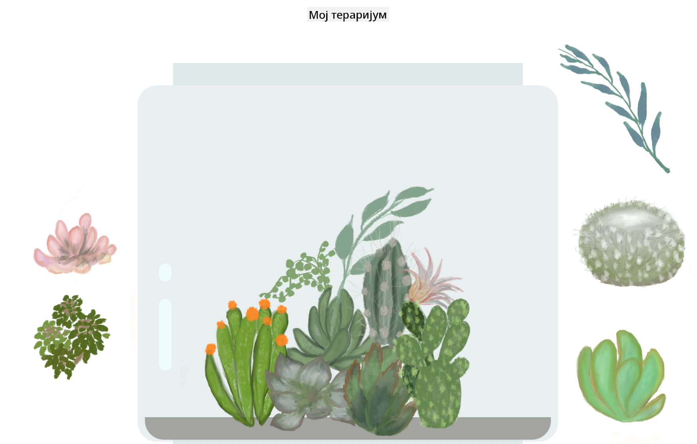

<!--
CO_OP_TRANSLATOR_METADATA:
{
  "original_hash": "7965cd2bc5dc92ad888dc4c6ab2ab70a",
  "translation_date": "2025-08-28T10:23:00+00:00",
  "source_file": "3-terrarium/README.md",
  "language_code": "sr"
}
-->
# Мој тераријум: Пројекат за учење о HTML-у, CSS-у и манипулацији DOM-ом помоћу JavaScript-а 🌵🌱

Мала вежба са превлачењем и испуштањем. Уз мало HTML-а, JS-а и CSS-а, моћи ћете да направите веб интерфејс, стилизујете га и чак додате више интеракција по вашем избору.

# Лекције

1. [Увод у HTML](./1-intro-to-html/README.md)
2. [Увод у CSS](./2-intro-to-css/README.md)
3. [Увод у DOM и затварања у JS-у](./3-intro-to-DOM-and-closures/README.md)

## Захвалнице

Написано са ♥️ од стране [Џен Лупер](https://www.twitter.com/jenlooper)

Тераријум креиран помоћу CSS-а инспирисан је стакленом теглом Јакуба Мандре на [codepen](https://codepen.io/Rotarepmi/pen/rjpNZY).

Илустрације су ручно нацртане од стране [Џен Лупер](http://jenlooper.com) уз помоћ Procreate-а.

## Објавите свој тераријум

Можете објавити свој тераријум на вебу користећи Azure Static Web Apps.

1. Форкујте овај репозиторијум

2. Притисните ово дугме

3. Прођите кроз чаробњака за креирање апликације. Уверите се да сте подесили корен апликације на `/solution` или на корен ваше базе кода. У овој апликацији нема API-ја, тако да не морате бринути о додавању истог. Гитхаб фасцикла ће бити креирана у вашем форкованом репозиторијуму која ће помоћи Azure Static Web Apps-у да изгради и објави вашу апликацију на новој URL адреси.

---

**Одрицање од одговорности**:  
Овај документ је преведен коришћењем услуге за превођење помоћу вештачке интелигенције [Co-op Translator](https://github.com/Azure/co-op-translator). Иако се трудимо да обезбедимо тачност, молимо вас да имате у виду да аутоматски преводи могу садржати грешке или нетачности. Оригинални документ на његовом изворном језику треба сматрати меродавним извором. За критичне информације препоручује се професионални превод од стране људи. Не преузимамо одговорност за било каква погрешна тумачења или неспоразуме који могу настати услед коришћења овог превода.