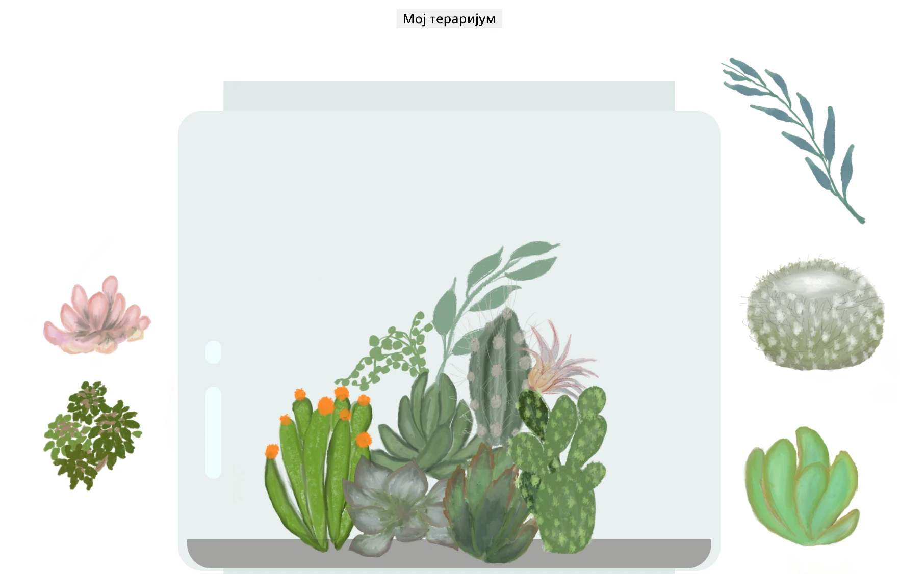

<!--
CO_OP_TRANSLATOR_METADATA:
{
  "original_hash": "6329fbe8bd936068debd78cca6f09c0a",
  "translation_date": "2025-08-28T10:24:07+00:00",
  "source_file": "3-terrarium/solution/README.md",
  "language_code": "sr"
}
-->
# Моја Тераријум: Пројекат за учење о HTML-у, CSS-у и манипулацији DOM-ом помоћу JavaScript-а 🌵🌱

Мала вежба са превлачењем и пуштањем. Уз мало HTML-а, JS-а и CSS-а, можете направити веб интерфејс, стилизовати га и додати интеракцију.

## Кредити

Написано са ♥️ од стране [Џен Лупер](https://www.twitter.com/jenlooper)

Тераријум креиран помоћу CSS-а инспирисан је стакленом теглом Јакуба Мандре на [codepen](https://codepen.io/Rotarepmi/pen/rjpNZY).

Илустрације су ручно нацртане од стране [Џен Лупер](http://jenlooper.com) користећи Procreate.

## Објавите свој Тераријум

Можете објавити свој тераријум на вебу користећи Azure Static Web Apps.

1. Форкујте овај репозиторијум

2. Притисните ово дугме

3. Прођите кроз чаробњака за креирање апликације. Уверите се да сте подесили корен апликације на `/solution` или на корен ваше базе кода. У овој апликацији нема API-ја, тако да не морате да бринете о томе. У вашем форкованом репозиторијуму биће креиран `.github` фолдер који ће помоћи Azure Static Web Apps сервису да изгради и објави вашу апликацију на нову URL адресу.

---

**Одрицање од одговорности**:  
Овај документ је преведен коришћењем услуге за превођење помоћу вештачке интелигенције [Co-op Translator](https://github.com/Azure/co-op-translator). Иако настојимо да обезбедимо тачност, молимо вас да имате у виду да аутоматски преводи могу садржати грешке или нетачности. Оригинални документ на његовом изворном језику треба сматрати ауторитативним извором. За критичне информације препоручује се професионални превод од стране људи. Не преузимамо одговорност за било каква погрешна тумачења или неспоразуме који могу настати услед коришћења овог превода.