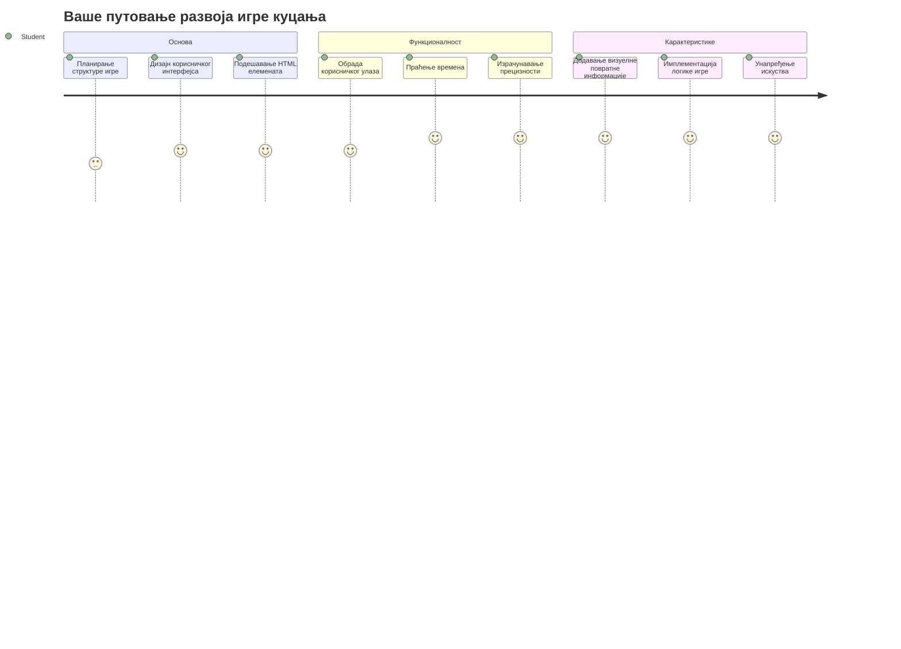
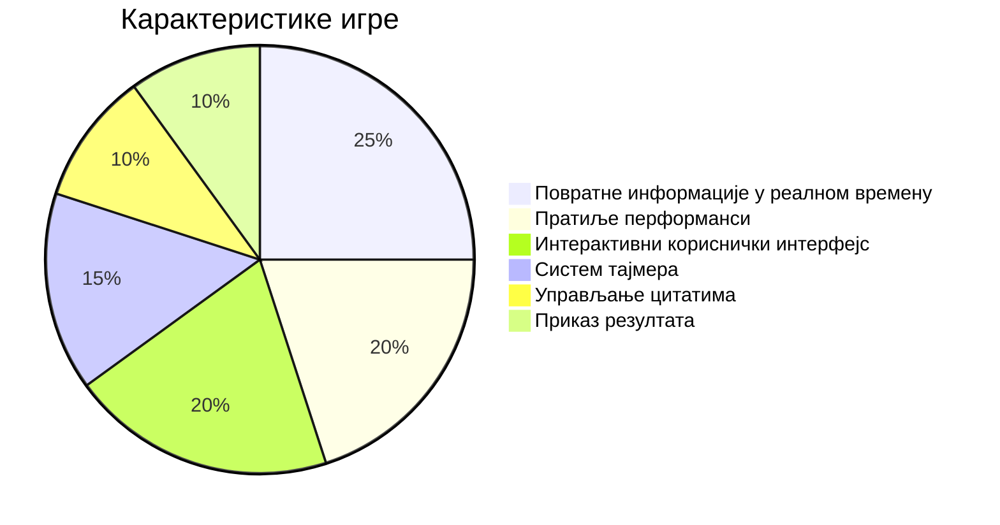
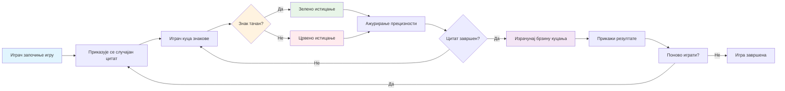
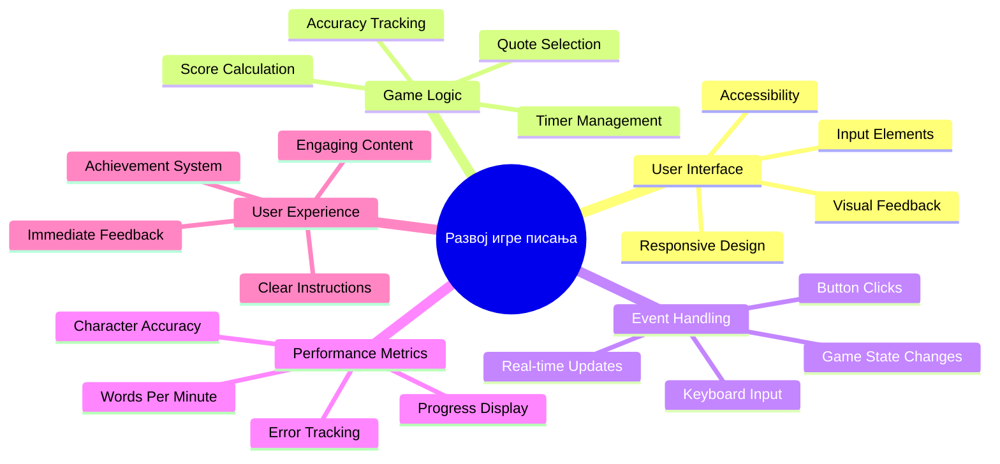
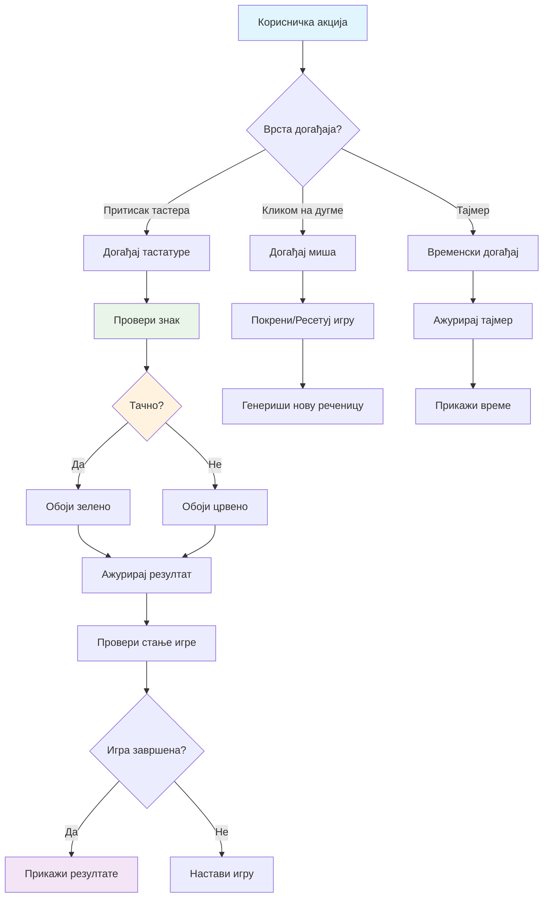
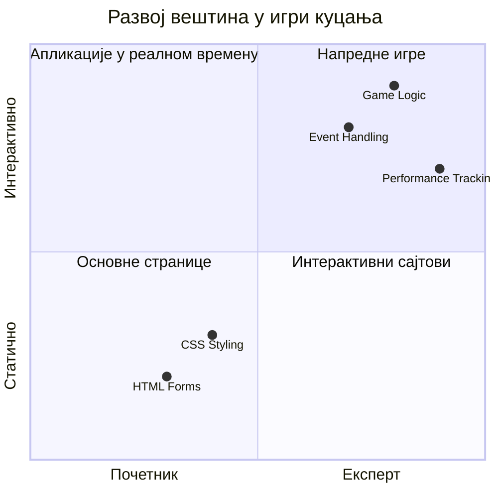
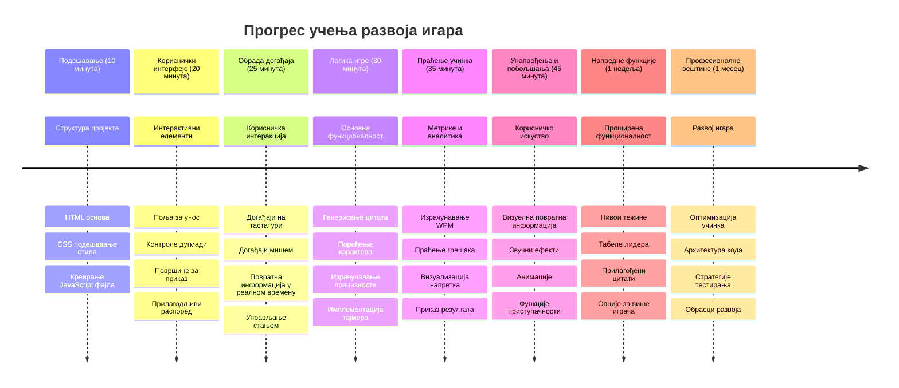

# Програмирање вођено догађајима - Направите игру куцања

## Увод

Ово је нешто што сваки програмер зна, али ретко о томе говори: брзо куцање је суперсила! 🚀 Размислите о томе - што брже можете да пренесете своје идеје из мозга у уредник кода, тиме више ваша креативност може да тече. Као да имате директну линију између својих мисли и екрана.

Желите да знате један од најбољих начина да развијете ову вештину? Погодили сте - направићемо игру!

> Хајде да заједно направимо сјајну игру куцања!

Спремни да све те вештине из JavaScript-а, HTML-а и CSS-а које сте учили примените у пракси? Правићемо игру куцања која ће вас изазивати са случајним цитатима легендарног детектива [Шерлока Холмса](https://en.wikipedia.org/wiki/Sherlock_Holmes). Игра ће пратити колико брзо и прецизно можете да куцате - и верујте ми, то је зараљивије него што мислите!

## Шта Треба да Знате

Пре него што почнемо, уверите се да вам ови појмови нису страни (не брините ако вам треба кратак подсетник - сви смо то прошли!):

- Креирање текстуалног уноса и дугмади
- CSS и подешавање стилова помоћу класа  
- Основе JavaScript-а
  - Креирање низова
  - Креирање случајног броја
  - Добијање тренутног времена

Ако вам неки од ових појмова делују мало замућено, цео свет! Понекад је најбољи начин да учврстите знање тако што ћете се упустити у пројекат и решавати ствари у ходу.

### 🔄 **Педагошки преглед**
**Процена основа**: Пре почетка развоја, уверите се да разумете:
- ✅ Како HTML форме и улазни елементи раде
- ✅ CSS класе и динамичко стилизовање
- ✅ JavaScript слушаоце догађаја и обрађиваче
- ✅ Манипулацију низовима и случајан избор
- ✅ Мерење времена и израчунавање

**Брзи самотест**: Можете ли да објасните како ови појмови функционишу заједно у интерактивној игри?
- **Догађаји** се активирају када корисници интерактују са елементима
- **Обрађивачи** обрађују те догађаје и ажурирају стање игре
- **CSS** пружа визуелну повратну информацију за корисничке акције
- **Временско мерење** омогућава мерење учинка и напредак у игри

## Хајде да Направимо Ову Ствари!

[Креирање игре куцања коришћењем програмирања вођеног догађајима](./typing-game/README.md)

### ⚡ **Шта Можете Урадити у Следећих 5 Минута**
- [ ] Отворите конзолу прегледача и покушајте да слушате догађаје тастатуре помоћу `addEventListener`
- [ ] Направите једноставну HTML страницу са пољем за унос и тестирате детекцију куцања
- [ ] Вежбајте манипулацију стрингова упоређујући укуцани текст са циљаним текстом
- [ ] Експериментишите са `setTimeout` да бисте разумели временске функције

### 🎯 **Шта Можете Постићи У Овом Сату**
- [ ] Попуните квиз након лекције и разумите програмирање вођено догађајима
- [ ] Направите основну верзију игре куцања са валидацијом речи
- [ ] Додајте визуелну повратну информацију за исправно и погрешно куцање
- [ ] Имплементирајте систем бодовања заснован на брзини и прецизности
- [ ] Стилски уредите игру уз помоћ CSS-а да буде визуелно привлачна

### 📅 **Вишеоднедевни Развој Ваше Игре**
- [ ] Завршите комплетну игру куцања са свим функцијама и финесама
- [ ] Додајте нивое тежине са различитим сложеностима речи
- [ ] Имплементирајте праћење статистика корисника (ВПМ, прецизност током времена)
- [ ] Креирајте звучне ефекте и анимације за боље корисничко искуство
- [ ] Прилагодите игру за мобилне уређаје са додирним управљањем
- [ ] Поделите игру онлајн и прикупите повратне информације од корисника

### 🌟 **Месечни Интерактивни Развој**
- [ ] Направите више игара које истражују различите моделе интеракције
- [ ] Учите о игровним циклусима, управљању стањем и оптимизацији перформанси
- [ ] Допринесите пројектима отвореног кода у развоју игара
- [ ] Савладајте напредне концепте времена и глатке анимације
- [ ] Креирајте портфолио који приказује разне интерактивне апликације
- [ ] Будите ментор онима који су заинтересовани за развој игара и корисничку интеракцију

## 🎯 Ваш Рок за Мастеринг Играња

### 🛠️ Сажетак Вашег Комплета За Развој Игре

Након завршетка овог пројекта, савладаћете:
- **Програмирање вођено догађајима**: Одзивни кориснички интерфејси који реагују на унос
- **Повратна информација у реалном времену**: Инстант визуелна и перформансна ажурирања
- **Мерење учинка**: Тачни системи мерења времена и бодовања
- **Управљање стањем игре**: Контрола тока апликације и корисничког искуства
- **Интерактивни дизајн**: Креирање привлачних и зависничких корисничких искустава
- **Модерни веб API-ји**: Коришћење могућности прегледача за богате интеракције
- **Обрасци приступачности**: Инклузивни дизајн за све кориснике

**Примена у стварном свету**: Ове вештине директно се користе у:
- **Веб апликацијама**: Сваки интерактивни интерфејс или контролна табла
- **Едукативном софтверу**: Училачки платформи и алати за процену вештина
- **Алатима за продуктивност**: Текстуални уредници, IDE-и и софтвер за колаборацију
- **Индустрији игара**: Игре у прегледачу и интерактивна забава
- **Мобилном развоју**: Интерфејси засновани на додиру и руковање геста
 
**Следећи ниво**: Спремни сте да истражите напредне оквире за игре, мултиплејер системе у реалном времену или сложене интерактивне апликације!

## Захвалнице

Написао са ♥️ [Christopher Harrison](http://www.twitter.com/geektrainer)

---

<!-- CO-OP TRANSLATOR DISCLAIMER START -->
**Одрицање од одговорности**:  
Овај документ је преведен коришћењем услуге за аутоматски превод [Co-op Translator](https://github.com/Azure/co-op-translator). Иако настојимо да превод буде тачан, имајте у виду да аутоматски преводи могу садржати грешке или нетачности. Оригинални документ на његовом изворном језику треба сматрати ауторитетним извором. За критичне информације препорука је професионални превод од стране стручног човека. Не сносимо одговорност за било каква недоразумевања или погрешне тумачења која могу настати коришћењем овог превода.
<!-- CO-OP TRANSLATOR DISCLAIMER END -->