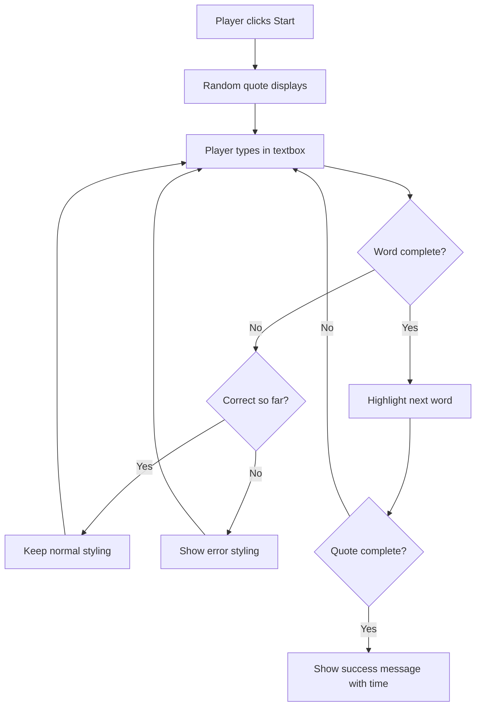
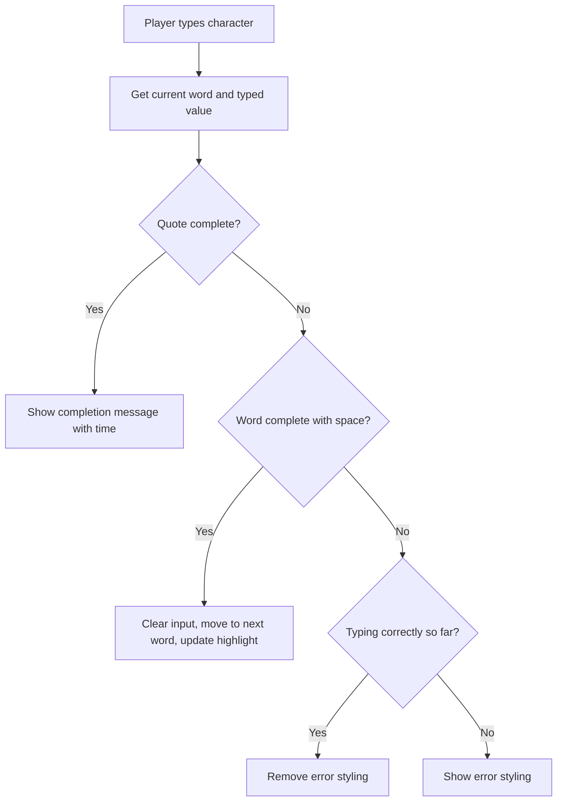

<!--
CO_OP_TRANSLATOR_METADATA:
{
  "original_hash": "e6b75e5b8caae906473a8a09d77b7121",
  "translation_date": "2025-10-24T23:36:51+00:00",
  "source_file": "4-typing-game/typing-game/README.md",
  "language_code": "sr"
}
-->
# Прављење игре уз помоћ догађаја

Да ли сте се икада запитали како веб-сајтови знају када кликнете на дугме или унесете текст у текстуално поље? То је магија програмирања заснованог на догађајима! Шта је бољи начин да научите ову суштинску вештину него креирањем нечега корисног - игре за брзо куцање која реагује на сваки ваш притисак тастера.

Имаћете прилику да из прве руке видите како веб-претраживачи "комуницирају" са вашим JavaScript кодом. Сваки пут када кликнете, куцате или померите миш, претраживач шаље мале поруке (које називамо догађајима) вашем коду, а ви одлучујете како да реагујете!

Када завршимо, направићете праву игру за куцање која прати вашу брзину и тачност. Још важније, разумећете основне концепте који покрећу сваки интерактивни веб-сајт који сте икада користили. Хајде да почнемо!

## Квиз пре предавања

[Квиз пре предавања](https://ff-quizzes.netlify.app/web/quiz/21)

## Програмирање засновано на догађајима

Размислите о вашој омиљеној апликацији или веб-сајту - шта их чини живим и одзивним? Све је у томе како реагују на оно што радите! Сваки додир, клик, превлачење или притисак тастера ствара оно што називамо "догађајем", и ту се дешава права магија веб-развоја.

Ево шта програмирање за веб чини тако занимљивим: никада не знамо када ће неко кликнути на то дугме или почети да куца у текстуално поље. Можда ће кликнути одмах, чекати пет минута или можда никада неће кликнути! Ова непредвидивост значи да морамо другачије размишљати о томе како пишемо наш код.

Уместо да пишемо код који се извршава одозго на доле као рецепт, пишемо код који стрпљиво чека да се нешто догоди. То је слично као што су оператери телеграфа у 19. веку седели поред својих машина, спремни да реагују чим стигне порука преко жице.

Па шта је тачно "догађај"? Једноставно речено, то је нешто што се догоди! Када кликнете на дугме - то је догађај. Када укуцате слово - то је догађај. Када померите миш - то је још један догађај.

Програмирање засновано на догађајима нам омогућава да подесимо наш код да слуша и реагује. Креирамо посебне функције које називамо **слушаоци догађаја** које стрпљиво чекају да се догоди нешто специфично, а затим реагују када се то догоди.

Замислите слушаоце догађаја као звона на вратима за ваш код. Поставите звоно (`addEventListener()`), кажете му који звук да слуша (као што је 'клик' или 'притисак тастера'), а затим одредите шта треба да се догоди када неко позвони (ваша прилагођена функција).

**Како функционишу слушаоци догађаја:**
- **Слушају** одређене корисничке акције као што су кликови, притисци тастера или покрети миша
- **Извршавају** ваш прилагођени код када се догоди одређени догађај
- **Реагују** одмах на интеракције корисника, стварајући беспрекорно искуство
- **Обрађују** више догађаја на истом елементу користећи различите слушаоце

> **NOTE:** Вреди нагласити да постоји много начина за креирање слушалаца догађаја. Можете користити анонимне функције или креирати именоване. Можете користити разне пречице, као што је постављање `click` својства, или коришћење `addEventListener()`. У нашем задатку ћемо се фокусирати на `addEventListener()` и анонимне функције, јер је то вероватно најчешћа техника коју веб-развојни програмери користе. Такође је најфлексибилнија, јер `addEventListener()` ради за све догађаје, а име догађаја може бити обезбеђено као параметар.

### Уобичајени догађаји

Иако веб-претраживачи нуде десетине различитих догађаја које можете слушати, већина интерактивних апликација се ослања на само неколико основних догађаја. Разумевање ових основних догађаја ће вам дати темељ за изградњу софистицираних корисничких интеракција.

Постоје [десетине догађаја](https://developer.mozilla.org/docs/Web/Events) које можете слушати приликом креирања апликације. У основи, све што корисник уради на страници изазива догађај, што вам даје много моћи да осигурате да добију искуство које желите. Срећом, обично ће вам бити потребно само неколико основних догађаја. Ево неколико уобичајених (укључујући два која ћемо користити приликом креирања наше игре):

| Догађај | Опис | Уобичајени случајеви употребе |
|---------|------|-----------------------------|
| `click` | Корисник је кликнуо на нешто | Дугмад, линкови, интерактивни елементи |
| `contextmenu` | Корисник је кликнуо десним тастером миша | Прилагођени менији десног клика |
| `select` | Корисник је означио део текста | Уређивање текста, операције копирања |
| `input` | Корисник је унео текст | Валидација формулара, претрага у реалном времену |

**Разумевање ових типова догађаја:**
- **Активирају се** када корисници интерагују са одређеним елементима на вашој страници
- **Пружају** детаљне информације о акцији корисника кроз објекте догађаја
- **Омогућавају** креирање одзивних, интерактивних веб-апликација
- **Раде** конзистентно на различитим претраживачима и уређајима

## Креирање игре

Сада када разумете како догађаји функционишу, хајде да то знање применимо у пракси креирањем нечега корисног. Направићемо игру за брзо куцање која демонстрира обраду догађаја, а истовремено вам помаже да развијете важну вештину програмера.

Креираћемо игру како бисмо истражили како догађаји функционишу у JavaScript-у. Наша игра ће тестирати вештину куцања играча, што је једна од најпотцењенијих вештина коју би сви програмери требало да имају. Занимљива чињеница: распоред тастатуре QWERTY који данас користимо заправо је дизајниран 1870-их за писаће машине - а добре вештине куцања су и данас једнако вредне за програмере! Општи ток игре изгледаће овако:



**Како ће наша игра функционисати:**
- **Почиње** када играч кликне на дугме за почетак и приказује насумични цитат
- **Праћење** напретка куцања играча реч по реч у реалном времену
- **Истиче** тренутну реч како би усмерила пажњу играча
- **Пружа** тренутне визуелне повратне информације о грешкама у куцању
- **Рачуна** и приказује укупно време када се цитат заврши

Хајде да направимо нашу игру и научимо о догађајима!

### Структура фајлова

Пре него што почнемо са кодирањем, хајде да се организујемо! Имање чисте структуре фајлова од самог почетка ће вам уштедети главобоље касније и учинити ваш пројекат професионалнијим. 😊

Држаћемо ствари једноставним са само три фајла: `index.html` за структуру странице, `script.js` за сву логику игре и `style.css` да све изгледа лепо. Ово је класична тројка која покреће већину веба!

**Креирајте нови фолдер за ваш рад отварањем конзоле или терминала и унесите следећу команду:**

```bash
# Linux or macOS
mkdir typing-game && cd typing-game

# Windows
md typing-game && cd typing-game
```

**Шта ове команде раде:**
- **Креирају** нови директоријум назван `typing-game` за ваше пројектне фајлове
- **Прелазе** у новокреирани директоријум аутоматски
- **Постављају** чисто радно окружење за развој ваше игре

**Отворите Visual Studio Code:**

```bash
code .
```

**Ова команда:**
- **Покреће** Visual Studio Code у тренутном директоријуму
- **Отвара** ваш пројектни фолдер у едитору
- **Пружа** приступ свим алатима за развој који су вам потребни

**Додајте три фајла у фолдер у Visual Studio Code са следећим именима:**
- `index.html` - Садржи структуру и садржај ваше игре
- `script.js` - Обрађује сву логику игре и слушаоце догађаја
- `style.css` - Дефинише визуелни изглед и стил

## Креирање корисничког интерфејса

Сада хајде да изградимо сцену на којој ће се одвијати сва акција наше игре! Замислите ово као дизајнирање контролне табле за свемирски брод - морамо осигурати да све што је потребно нашим играчима буде тамо где очекују.

Хајде да схватимо шта је заправо потребно нашој игри. Да сте играли игру за куцање, шта бисте желели да видите на екрану? Ево шта нам је потребно:

| Елемент интерфејса | Сврха | HTML Елемент |
|--------------------|-------|-------------|
| Приказ цитата | Приказује текст за куцање | `<p>` са `id="quote"` |
| Област порука | Приказује статус и поруке о успеху | `<p>` са `id="message"` |
| Унос текста | Место где играчи куцају цитат | `<input>` са `id="typed-value"` |
| Дугме за почетак | Започиње игру | `<button>` са `id="start"` |

**Разумевање структуре интерфејса:**
- **Организује** садржај логично одозго на доле
- **Додељује** јединствене ID-еве елементима за циљање у JavaScript-у
- **Пружа** јасну визуелну хијерархију за боље корисничко искуство
- **Укључује** семантичке HTML елементе за приступачност

Сваки од ових елемената ће требати ID-еве како бисмо могли да радимо са њима у нашем JavaScript-у. Такође ћемо додати референце на CSS и JavaScript фајлове које ћемо креирати.

Креирајте нови фајл под називом `index.html`. Додајте следећи HTML:

```html
<!-- inside index.html -->
<html>
<head>
  <title>Typing game</title>
  <link rel="stylesheet" href="style.css">
</head>
<body>
  <h1>Typing game!</h1>
  <p>Practice your typing skills with a quote from Sherlock Holmes. Click **start** to begin!</p>
  <p id="quote"></p> <!-- This will display our quote -->
  <p id="message"></p> <!-- This will display any status messages -->
  <div>
    <input type="text" aria-label="current word" id="typed-value" /> <!-- The textbox for typing -->
    <button type="button" id="start">Start</button> <!-- To start the game -->
  </div>
  <script src="script.js"></script>
</body>
</html>
```

**Разлагање онога што ова структура HTML-а постиже:**
- **Повезује** CSS стилове у `<head>` за стилизовање
- **Креира** јасан наслов и упутства за кориснике
- **Успоставља** резервисане параграфе са специфичним ID-евима за динамички садржај
- **Укључује** поље за унос текста са атрибутима приступачности
- **Пружа** дугме за почетак игре
- **Учитава** JavaScript фајл на крају ради оптималног перформанса

### Покретање апликације

Тестирање ваше апликације често током развоја помаже вам да рано уочите проблеме и видите свој напредак у реалном времену. Live Server је непроцењив алат који аутоматски освежава ваш претраживач кад год сачувате промене, чинећи развој много ефикаснијим.

Увек је најбоље развијати апликацију постепено како бисте видели како ствари изгледају. Хајде да покренемо нашу апликацију. Постоји одличан додатак за Visual Studio Code под називом [Live Server](https://marketplace.visualstudio.com/items?itemName=ritwickdey.LiveServer&WT.mc_id=academic-77807-sagibbon) који ће хостовати вашу апликацију локално и освежавати претраживач сваки пут када сачувате.

**Инсталирајте [Live Server](https://marketplace.visualstudio.com/items?itemName=ritwickdey.LiveServer&WT.mc_id=academic-77807-sagibbon) пратећи линк и кликом на Install:**

**Шта се дешава током инсталације:**
- **Отвара** ваш претраживач за покретање Visual Studio Code-а
- **Води** вас кроз процес инсталације додатка
- **Може захтевати** поновно покретање Visual Studio Code-а за завршетак подешавања

**Када је инсталиран, у Visual Studio Code-у, кликните Ctrl-Shift-P (или Cmd-Shift-P) да отворите палету команди:**

**Разумевање палете команди:**
- **Пружа** брз приступ свим командама у VS Code-у
- **Претражује** команде док куцате
- **Нуди** пречице за бржи развој

**Унесите "Live Server: Open with Live Server":**

**Шта ради Live Server:**
- **Покреће** локални сервер за развој вашег пројекта
- **Аутоматски** освежава претраживач када сачувате фајлове
- **Сервира** ваше фајлове са локалне URL адресе (обично `localhost:5500`)

**Отворите претраживач и идите на `https://localhost:5500`:**

Сада би требало да видите страницу коју сте креирали! Хајде да додамо мало функционалности.

## Додавање CSS-а

Сада хајде да ствари изгледају лепо! Визуелне повратне информације су од суштинског значаја за корисничке интерфејсе још од раних дана рачунарства. Осамдесетих година истраживачи су открили да тренутне визуелне повратне информације значајно побољшавају перформансе корисника и смањују грешке. Управо то ћемо креирати.

Нашој игри је потребно да буде кристално јасно шта се дешава. Играчи би одмах требало да знају коју реч треба да куцају, а ако направе грешку, то би требало да виде одмах. Хајде да креирамо неке једноставне, али ефективне стилове:

Креирајте нови фајл под називом `style.css` и додајте следећи синтакс:

```css
/* inside style.css */
.highlight {
  background-color: yellow;
}

.error {
  background-color: lightcoral;
  border: red;
}
```

**Разумевање ових CSS класа:**
- **Истиче** тренутну реч жутом позадином ради јасног визуелног вођења
- **Сигнализира** грешке у куцању светло коралном бојом позадине
- **Пружа** тренутне повратне информације без ометања тока ку
| Низ цитата | Чува све могуће цитате за игру | `['Цитат 1', 'Цитат 2', ...]` |
| Низ речи | Разбија тренутни цитат на појединачне речи | `['Када', 'имаш', '...', ...]` |
| Индекс речи | Прати коју реч играч куца | `0, 1, 2, 3...` |
| Време почетка | Рачуна протекло време за бодовање | `Date.now()` |

**Такође ће нам бити потребне референце на елементе корисничког интерфејса:**
| Елемент | ID | Сврха |
|---------|----|---------|
| Унос текста | `typed-value` | Место где играчи куцају |
| Приказ цитата | `quote` | Приказује цитат за куцање |
| Област порука | `message` | Приказује ажурирања статуса |

```javascript
// inside script.js
// all of our quotes
const quotes = [
    'When you have eliminated the impossible, whatever remains, however improbable, must be the truth.',
    'There is nothing more deceptive than an obvious fact.',
    'I ought to know by this time that when a fact appears to be opposed to a long train of deductions it invariably proves to be capable of bearing some other interpretation.',
    'I never make exceptions. An exception disproves the rule.',
    'What one man can invent another can discover.',
    'Nothing clears up a case so much as stating it to another person.',
    'Education never ends, Watson. It is a series of lessons, with the greatest for the last.',
];
// store the list of words and the index of the word the player is currently typing
let words = [];
let wordIndex = 0;
// the starting time
let startTime = Date.now();
// page elements
const quoteElement = document.getElementById('quote');
const messageElement = document.getElementById('message');
const typedValueElement = document.getElementById('typed-value');
```

**Разлагање онога што овај код за подешавање постиже:**
- **Чува** низ цитата Шерлока Холмса користећи `const` јер се цитати неће мењати
- **Иницијализује** променљиве за праћење помоћу `let` јер ће се ове вредности ажурирати током игре
- **Прикупља** референце на DOM елементе користећи `document.getElementById()` за ефикасан приступ
- **Поставља** основу за сву функционалност игре са јасним, описним именима променљивих
- **Организује** повезане податке и елементе логично ради лакшег одржавања кода

✅ Слободно додајте још цитата у вашу игру

> 💡 **Савет**: Елементе можемо добити кад год желимо у коду користећи `document.getElementById()`. Због чињенице да ћемо се често позивати на ове елементе, избегавамо грешке у куцању са стринг литералима користећи константе. Фрејмворци као што су [Vue.js](https://vuejs.org/) или [React](https://reactjs.org/) могу вам помоћи да боље управљате централизацијом вашег кода.
>
**Зашто овај приступ тако добро функционише:**
- **Спречава** грешке у куцању приликом више референцирања елемената
- **Побољшава** читљивост кода са описним именима константи
- **Омогућава** бољу подршку IDE-а са аутоматским довршавањем и провером грешака
- **Олакшава** рефакторисање ако се ID елемената касније промене

Одвојите минут да погледате видео о коришћењу `const`, `let` и `var`

[](https://youtube.com/watch?v=JNIXfGiDWM8 "Врсте променљивих")

> 🎥 Кликните на слику изнад за видео о променљивама.

### Додајте логику за почетак

Овде све долази на своје место! 🚀 Управо ћете написати свој први прави слушалац догађаја, и постоји нешто веома задовољавајуће у томе да видите како ваш код реагује на клик дугмета.

Размислите о овоме: негде тамо, играч ће кликнути на дугме "Почни", а ваш код мора бити спреман за њега. Немамо појма када ће то урадити - можда одмах, можда након што попије кафу - али када то уради, ваша игра оживљава.

Када корисник кликне на `start`, потребно је изабрати цитат, подесити кориснички интерфејс и припремити праћење тренутне речи и времена. Испод је JavaScript који треба да додате; о њему ћемо разговарати одмах након блока скрипте.

```javascript
// at the end of script.js
document.getElementById('start').addEventListener('click', () => {
  // get a quote
  const quoteIndex = Math.floor(Math.random() * quotes.length);
  const quote = quotes[quoteIndex];
  // Put the quote into an array of words
  words = quote.split(' ');
  // reset the word index for tracking
  wordIndex = 0;

  // UI updates
  // Create an array of span elements so we can set a class
  const spanWords = words.map(function(word) { return `<span>${word} </span>`});
  // Convert into string and set as innerHTML on quote display
  quoteElement.innerHTML = spanWords.join('');
  // Highlight the first word
  quoteElement.childNodes[0].className = 'highlight';
  // Clear any prior messages
  messageElement.innerText = '';

  // Setup the textbox
  // Clear the textbox
  typedValueElement.value = '';
  // set focus
  typedValueElement.focus();
  // set the event handler

  // Start the timer
  startTime = new Date().getTime();
});
```

**Хајде да разложимо код на логичке секције:**

**📊 Подешавање праћења речи:**
- **Бира** насумични цитат користећи `Math.floor()` и `Math.random()` ради разноврсности
- **Претвара** цитат у низ појединачних речи користећи `split(' ')`
- **Ресетује** `wordIndex` на 0 јер играчи почињу са првом речју
- **Припрема** стање игре за нову рунду

**🎨 Подешавање и приказ корисничког интерфејса:**
- **Креира** низ `<span>` елемената, обавијајући сваку реч ради индивидуалног стилизовања
- **Спаја** span елементе у један стринг ради ефикасног ажурирања DOM-а
- **Истиче** прву реч додавањем CSS класе `highlight`
- **Брише** све претходне поруке игре ради чистог почетка

**⌨️ Припрема текстуалног поља:**
- **Брише** постојећи текст у пољу за унос
- **Фокусира** се на текстуално поље како би играчи могли одмах почети да куцају
- **Припрема** област за унос за нову сесију игре

**⏱️ Иницијализација тајмера:**
- **Бележи** тренутни временски жиг користећи `new Date().getTime()`
- **Омогућава** тачно израчунавање брзине куцања и времена завршетка
- **Покреће** праћење перформанси за сесију игре

### Додајте логику куцања

Овде се бавимо срцем наше игре! Не брините ако вам се на први поглед чини превише - проћи ћемо кроз сваки део, и на крају ћете видети колико је све логично.

Оно што овде градимо је прилично софистицирано: сваки пут када неко откуца слово, наш код ће проверити шта је откуцано, дати повратну информацију и одлучити шта треба да се деси следеће. То је слично начину на који су рани текстуални процесори попут WordStar-а из 1970-их пружали повратне информације у реалном времену куцачима.

```javascript
// at the end of script.js
typedValueElement.addEventListener('input', () => {
  // Get the current word
  const currentWord = words[wordIndex];
  // get the current value
  const typedValue = typedValueElement.value;

  if (typedValue === currentWord && wordIndex === words.length - 1) {
    // end of sentence
    // Display success
    const elapsedTime = new Date().getTime() - startTime;
    const message = `CONGRATULATIONS! You finished in ${elapsedTime / 1000} seconds.`;
    messageElement.innerText = message;
  } else if (typedValue.endsWith(' ') && typedValue.trim() === currentWord) {
    // end of word
    // clear the typedValueElement for the new word
    typedValueElement.value = '';
    // move to the next word
    wordIndex++;
    // reset the class name for all elements in quote
    for (const wordElement of quoteElement.childNodes) {
      wordElement.className = '';
    }
    // highlight the new word
    quoteElement.childNodes[wordIndex].className = 'highlight';
  } else if (currentWord.startsWith(typedValue)) {
    // currently correct
    // highlight the next word
    typedValueElement.className = '';
  } else {
    // error state
    typedValueElement.className = 'error';
  }
});
```

**Разумевање тока логике куцања:**

Ова функција користи приступ водопада, проверавајући услове од најспецифичнијих до најопштијих. Хајде да разложимо сваки сценарио:



**🏁 Завршен цитат (Сценарио 1):**
- **Проверава** да ли откуцана вредност одговара тренутној речи И да ли смо на последњој речи
- **Рачуна** протекло време одузимањем времена почетка од тренутног времена
- **Претвара** милисекунде у секунде дељењем са 1,000
- **Приказује** поруку честитке са временом завршетка

**✅ Завршена реч (Сценарио 2):**
- **Открива** завршетак речи када унос завршава размаком
- **Потврђује** да обрезани унос тачно одговара тренутној речи
- **Брише** поље за унос за следећу реч
- **Прелази** на следећу реч повећавајући `wordIndex`
- **Ажурира** визуелно истицање уклањањем свих класа и истицањем нове речи

**📝 Куцање у току (Сценарио 3):**
- **Проверава** да ли тренутна реч почиње са оним што је до сада откуцано
- **Уклања** било какво стилизовање грешке како би показала да је унос исправан
- **Омогућава** наставак куцања без прекида

**❌ Стање грешке (Сценарио 4):**
- **Активира** се када откуцани текст не одговара почетку очекиване речи
- **Примењује** CSS класу грешке ради тренутне визуелне повратне информације
- **Помаже** играчима да брзо идентификују и исправе грешке

## Тестирајте своју апликацију

Погледајте шта сте постигли! 🎉 Управо сте направили праву, функционалну игру куцања од нуле користећи програмирање засновано на догађајима. Одвојите тренутак да то цените - ово није мала ствар!

Сада долази фаза тестирања! Да ли ће радити како је очекивано? Да ли смо нешто пропустили? Ево у чему је ствар: ако нешто не функционише савршено одмах, то је потпуно нормално. Чак и искусни програмери редовно проналазе грешке у свом коду. То је све део процеса развоја!

Кликните на `start`, и почните да куцате! Требало би да изгледа мало као анимација коју смо видели раније.


**Шта тестирати у вашој апликацији:**
- **Потврђује** да кликом на Start се приказује насумични цитат
- **Проверава** да ли куцање правилно истиче тренутну реч
- **Проверава** да ли се стилизовање грешке појављује за нетачно куцање
- **Осигурава** да завршетак речи правилно помера истицање
- **Тестира** да ли завршетак цитата приказује поруку о завршетку са временом

**Уобичајени савети за отклањање грешака:**
- **Проверите** конзолу прегледача (F12) за JavaScript грешке
- **Потврдите** да се сви називи датотека тачно поклапају (осетљиви на велика и мала слова)
- **Осигурајте** да Live Server ради и да се правилно освежава
- **Тестирајте** различите цитате да бисте потврдили да насумични избор функционише

---

## Изазов GitHub Copilot Agent 🎮

Користите Agent мод да завршите следећи изазов:

**Опис:** Проширите игру куцања имплементацијом система тежине који се прилагођава игри на основу перформанси играча. Овај изазов ће вам помоћи да вежбате напредно руковање догађајима, анализу података и динамичко ажурирање корисничког интерфејса.

**Задатак:** Направите систем за прилагођавање тежине игре куцања који:
1. Праће брзину куцања играча (речи у минути) и проценат тачности
2. Аутоматски се прилагођава на три нивоа тежине: Лако (једноставни цитати), Средње (тренутни цитати), Тешко (сложени цитати са интерпункцијом)
3. Приказује тренутни ниво тежине и статистику играча на корисничком интерфејсу
4. Имплементира бројач серија који повећава тежину након 3 узастопна добра перформанса
5. Додаје визуелне повратне информације (боје, анимације) за означавање промена тежине

Додајте потребне HTML елементе, CSS стилове и JavaScript функције за имплементацију ове функције. Укључите одговарајуће руковање грешкама и осигурајте да игра остане приступачна са одговарајућим ARIA ознакама.

Сазнајте више о [agent mode](https://code.visualstudio.com/blogs/2025/02/24/introducing-copilot-agent-mode) овде.

## 🚀 Изазов

Спремни да подигнете своју игру куцања на виши ниво? Покушајте да имплементирате ове напредне функције како бисте продубили своје разумевање руковања догађајима и манипулације DOM-ом:

**Додајте више функционалности:**

| Функција | Опис | Вештине које ћете вежбати |
|---------|-------------|------------------------|
| **Контрола уноса** | Онемогућите слушалац догађаја `input` након завршетка, и поново га омогућите када се кликне на дугме | Управљање догађајима и контролисање стања |
| **Управљање стањем UI-а** | Онемогућите текстуално поље када играч заврши цитат | Манипулација својствима DOM-а |
| **Модални дијалог** | Прикажите модални дијалог са поруком о успеху | Напредни UI обрасци и приступачност |
| **Систем високих резултата** | Чувајте високе резултате користећи `localStorage` | API-ји за складиштење у прегледачу и трајност података |

**Савети за имплементацију:**
- **Истражите** `localStorage.setItem()` и `localStorage.getItem()` за трајно складиштење
- **Вежбајте** додавање и уклањање слушалаца догађаја динамички
- **Истражите** HTML елементе за дијалог или CSS модалне обрасце
- **Размислите** о приступачности приликом онемогућавања и омогућавања контроле формулара

## Квиз након предавања

[Квиз након предавања](https://ff-quizzes.netlify.app/web/quiz/22)

## Преглед и самостално учење

Прочитајте о [свим доступним догађајима](https://developer.mozilla.org/docs/Web/Events) за програмере преко веб прегледача, и размислите о сценаријима у којима бисте користили сваки од њих.

## Задатак

[Направите нову игру куцања](assignment.md)

---

**Одрицање од одговорности**:  
Овај документ је преведен помоћу услуге за превођење вештачке интелигенције [Co-op Translator](https://github.com/Azure/co-op-translator). Иако настојимо да обезбедимо тачност, молимо вас да имате у виду да аутоматски преводи могу садржати грешке или нетачности. Оригинални документ на његовом изворном језику треба сматрати меродавним извором. За критичне информације препоручује се професионални превод од стране људи. Не преузимамо одговорност за било каква погрешна тумачења или неспоразуме који могу настати услед коришћења овог превода.