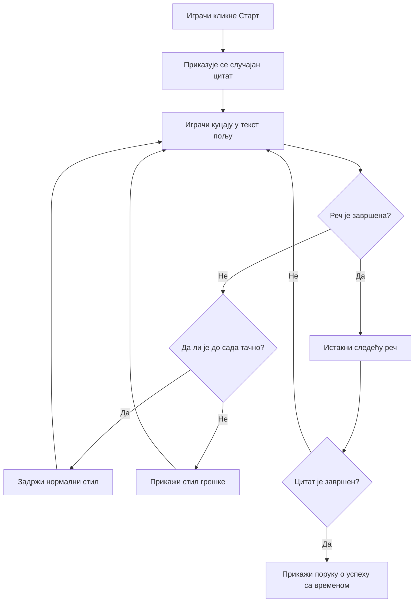
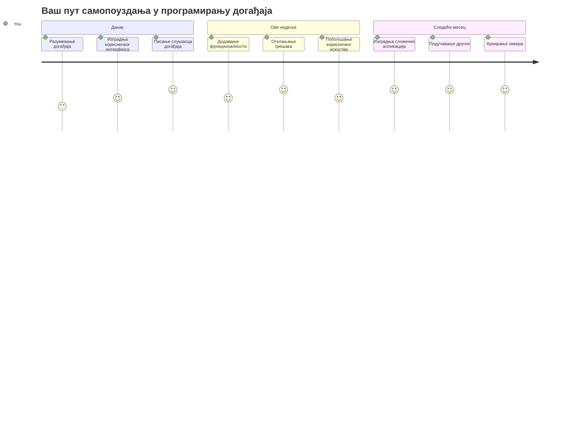

# Креирање игре помоћу догађаја

Да ли сте се икада запитали како веб сајтови знају када кликнете на дугме или укуцате нешто у текстуално поље? То је магија програмирања управљаног догађајима! Како боље научити ову важну вештину него тако што ћете изградити нешто корисно - игру брзог куцања која реагује на сваки ваш унос.

Почећете да видите из прве руке како веб прегледачи "комуницирају" са вашим JavaScript кодом. Свaki пут када кликнете, укуцате или померите миш, прегледач шаље мале поруке (које зовемо догађаји) вашем коду, а ви одлучујете како да одговорите!

До краја овог упутства направићете праву игру куцања која прати вашу брзину и прецизност. Још важније, разумећете основне концепте који покрећу сваки интерактивни веб сајт који сте икада користили. Хајде да почнемо!

## Квиз пре предавања

[Pre-lecture quiz](https://ff-quizzes.netlify.app/web/quiz/21)

## Програмирање управљано догађајима

Размислите о вашој омиљеној апликацији или веб сајту - шта га чини живим и одзивним? Све је у томе како реагује на оно што радите! Сваки додир, клик, превлачење прстом или унос карактера ствара оно што зовемо "догађај", и ту се дешава права магија веб развоја.

Ево шта програмирање за веб чини занимљивим: никада не знамо када ће неко кликнути на то дугме или почети да куца у текстуално поље. Можда ће кликнути одмах, сачекати пет минута, или можда никада неће ни кликнути! Ова непредвидивост значи да морамо другачије размишљати о томе како пишемо код.

Уместо да пишемо код који се извршава од врха до дна као рецепт, пишемо код који стрпљиво чека да се нешто деси. То је слично као што су телеграфски оператери у 1800-им годинама седели поред машина, спремни да одговоре чим порука стигне жицом.

Па шта је тачно "догађај"? Једноставно речено, то је нешто што се дешава! Када кликнете на дугме - то је догађај. Када укуцате слово - то је догађај. Када померите миш - то је други догађај.

Програмирање управљано догађајима нам омогућава да поставимо наш код да слуша и реагује. Креирамо посебне функције које зовемо **слушаоци догађаја** (event listeners) које стрпљиво чекају да се нешто конкретно деси, а затим стартују када се то догоди.

Замислите слушаоце догађаја као да имате звонац на вратима за ваш код. Поставите звонце (`addEventListener()`), кажете му који звук да слуша (као 'click' или 'keypress'), а затим дефинишете шта треба да се деси када неко звони (ваша прилагођена функција).

**Ево како слушаоци догађаја функционишу:**
- **Слушају** конкретне корисничке акције као што су кликови, уноси и покрети миша
- **Извршавају** ваш прилагођени код када се наведен догађај догоди
- **Одговарају одмах** на корисничке интеракције, стварајући беспрекорно искуство
- **Обрађују** више догађаја на истом елементу помоћу различитих слушалаца

> **NOTE:** Вредно је напоменути да постоји много начина за креирање слушалаца догађаја. Можете користити анонимне функције или направити именоване. Можете користити различите пречице, као што је постављање `click` својства, или коришћењем `addEventListener()`. У нашој вежби ћемо се фокусирати на `addEventListener()` и анонимне функције, јер је то вероватно најчешћа техника коју веб програмери користе. Такође је најфлексибилнија јер `addEventListener()` ради за све догађаје, а име догађаја може бити прослеђено као параметар.

### Чести догађаји

Иако веб прегледачи нуде десетине различитих догађаја које можете слушати, већина интерактивних апликација се ослања само на неколико основних догађаја. Разумевање ових кључних догађаја даће вам основу за прављење софистицираних корисничких интеракција.

Постоје [десетине догађаја](https://developer.mozilla.org/docs/Web/Events) које можете слушати када креирате апликацију. У основи, све што корисник уради на страници покреће догађај, што вам даје велику моћ да им омогућите желјено искуство. Срећом, обично ће вам требати само мали број догађаја. Ево неколико уобичајених (укључујући два која ћемо користити у креирању наше игре):

| Догађај | Опис | Уобичајени случајеви употребе |
|---------|-------|------------------------------|
| `click` | Корисник је кликнуо нешто | Дуџмићи, линкови, интерактивни елементи |
| `contextmenu` | Корисник је кликнуо десним тастером миша | Прилагођени менији за десни клик |
| `select` | Корисник је издвојио текст | Уређивање текста, операције копирања |
| `input` | Корисник је унео текст | Валидација форми, претрага у реалном времену |

**Разумевање ових типова догађаја:**
- **Активирају се** када корисници интрахују са специфичним елементима на вашој страници
- **Пружају** детаљне информације о корисничкој акцији преко догађајних објеката
- **Омогућавају** вам да креирате реагујуће, интерактивне веб апликације
- **Раде** доследно преко различитих прегледача и уређаја

## Креирање игре

Сада када разумете како догађаји функционишу, хајде да применимо то знање тако што ћемо направити нешто корисно. Направићемо игру брзог куцања која демонстрира обраду догађаја и помаже вам да развијете важну програмерску вештину.

Направићемо игру да истражимо како догађаји раде у ЈаваСкрипту. Наша игра ће тестирати вештину куцања играча, која је једна од најпотцењенијих вештина коју сваки програмер треба да има. Забавна чињеница: распореда тастатуре QWERTY који данас користимо уствари је дизајниран 1870-их година за пишуће машине - и добре вештине куцања су и даље драгоцене за програмере данас! Општи ток игре ће изгледати овако:


**Ево како ће наша игра радити:**  
- **Почиње** када играч кликне на дугме старт и приказује насумични цитат  
- **Праћује** играчев напредак у куцању реч по реч у реалном времену  
- **Истиче** текућу реч да усмери пажњу играча  
- **Пружа** одмах визуелне повратне информације о грешкама у куцању  
- **Израчунава** и приказује укупно време када се цитат заврши  

Хајде да направимо нашу игру и научимо о догађајима!

### Структура фајлова

Пре него што почнемо са кодирањем, хајде да се организујемо! Имање чисту структуру фајлова од почетка ће вам уштедети главобоље касније и учинити ваш пројекат професионалнијим. 😊

Задржаћемо ствари једноставним са само три фајла: `index.html` за структуру странице, `script.js` за сву логику игре и `style.css` да све лепо изгледа. Ово је класични трио који покреће већину веба!

**Направите нову фасциклу за свој рад отварањем конзоле или терминала и извршењем следеће команде:**

```bash
# Линукс или макОС
mkdir typing-game && cd typing-game

# Виндоус
md typing-game && cd typing-game
```
  
**Ево шта ове команде раде:**  
- **Креирају** нови директоријум под називом `typing-game` за ваше пројектне фајлове  
- **Аутоматски** улазе у новокреирани директоријум  
- **Постављају** чист радни простор за развој ваше игре  

**Отворите Visual Studio Code:**

```bash
code .
```
  
**Ова команда:**  
- **Покреће** Visual Studio Code у тренутном директоријуму  
- **Отвара** ваш пројектни фолдер у едитору  
- **Обезбеђује** приступ свим развојним алатима који ће вам требати  

**Додајте три фајла у фасциклу у Visual Studio Code са следећим именима:**  
- `index.html` - Садржи структуру и садржај ваше игре  
- `script.js` - Обрађује сву логику игре и слушаоце догађаја  
- `style.css` - Дефинише визуелни изглед и стилизовање  

## Креирање корисничког интерфејса

Сада хајде да направимо бину на којој ће се одвијати сва акција игре! Замислите да дизајнирате контролни панел свемирског брода - морамо осигурати да све што нашим играчима треба буде баш тамо где га очекују.

Хајде да схватимо шта нам игра стварно треба. Да ли бисте играјући игру брзог куцања, шта бисте желели да видите на екрану? Ево шта ћемо морати имати:

| UI Елемент | Сврха | HTML елемент |
|------------|-------|--------------|
| Приказ цитата | Приказује текст за куцање | `<p>` са `id="quote"` |
| Подручје порука | Приказује поруке статуса и успеха | `<p>` са `id="message"` |
| Текстуални унос | Где играчи куцају цитат | `<input>` са `id="typed-value"` |
| Дуљме за старт | Започиње игру | `<button>` са `id="start"` |

**Разумевање структуре интерфејса:**  
- **Организује** садржај логички од врха до дна  
- **Додељује** јединствене идентификаторе елементима за JavaScript приступ  
- **Обезбеђује** јасну визуелну хијерархију за боље корисничко искуство  
- **Укључује** семантичке HTML елементе за приступачност  

Сваки од њих ће морати да има ID да бисмо могли да радимо са њима у нашем JavaScript-у. Такође ћемо додати референце на CSS и JavaScript фајлове које ћемо направити.

Креирајте нови фајл под именом `index.html`. Додајте следећи HTML:

```html
<!-- inside index.html -->
<html>
<head>
  <title>Typing game</title>
  <link rel="stylesheet" href="style.css">
</head>
<body>
  <h1>Typing game!</h1>
  <p>Practice your typing skills with a quote from Sherlock Holmes. Click **start** to begin!</p>
  <p id="quote"></p> <!-- This will display our quote -->
  <p id="message"></p> <!-- This will display any status messages -->
  <div>
    <input type="text" aria-label="current word" id="typed-value" /> <!-- The textbox for typing -->
    <button type="button" id="start">Start</button> <!-- To start the game -->
  </div>
  <script src="script.js"></script>
</body>
</html>
```
  
**Разлагање шта ова структура HTML ради:**  
- **Повезује** CSS стилски лист у `<head>` за стилизовање  
- **Креира** јасан наслов и упутства за кориснике  
- **Успоставља** резервисана места (placeholder) у параграфима са специфичним ID-јевима за динамички садржај  
- **Укључује** поље за унос са атрибутима приступачности  
- **Обезбеђује** дугме за старт игре  
- **Учитава** JavaScript фајл на крају ради оптималних перформанси  

### Покретање апликације

Тестирање апликације често током развоја помаже вам да раније приметите проблеме и видите свој напредак у реалном времену. Live Server је незаменљив алат који аутоматски освежава прегледач сваки пут кад сачувате измене, чинећи развој много ефикаснијим.

Увек је најбоље развијати итеративно да бисте видели како ствари изгледају. Хајде да покренемо нашу апликацију. Постоји сјајан екстензија за Visual Studio Code под називом [Live Server](https://marketplace.visualstudio.com/items?itemName=ritwickdey.LiveServer&WT.mc_id=academic-77807-sagibbon) која ће и хостовати вашу апликацију локално и освежавати прегледач сваки пут када сачувате.

**Инсталирајте [Live Server](https://marketplace.visualstudio.com/items?itemName=ritwickdey.LiveServer&WT.mc_id=academic-77807-sagibbon) пратећи линк и кликом на Install:**

**Ево шта се дешава током инсталације:**  
- **Тражи** од вашег прегледача да покрене Visual Studio Code  
- **Води** вас кроз процес инсталације екстензије  
- **Може захтевати** поновно покретање Visual Studio Code-а да би завршио подешавање  

**Када је инсталација готова, у Visual Studio Code-у притисните Ctrl-Shift-P (или Cmd-Shift-P) да отворите командну палету:**

**Разумевање командне палете:**  
- **Обезбеђује** брз приступ свим VS Code командама  
- **Претражује** команде док куцате  
- **Нуди** тастатурне пречице за бржи развој  

**Укуцајте "Live Server: Open with Live Server":**

**Шта Live Server ради:**  
- **Покреће** локални развојни сервер за ваш пројекат  
- **Аутоматски** освежава прегледач када сачувате фајлове  
- **Сервира** ваше фајлове са локалног URL-а (обично `localhost:5500`)  

**Отворите прегледач и идите на `https://localhost:5500`:**

Сада бисте требали видети страницу коју сте направили! Хајде да додамо неку функционалност.

## Додавање CSS-а

Сада хајде да ствари учинимо лепим! Визуелне повратне информације су одувек биле кључне за корисничке интерфејсе од раних дана рачунарства. 1980-их, истраживачи су открили да одмах визуелна повратна информација драматично побољшава перформансе корисника и смањује грешке. Баш то ћемо и направити.

Наша игра мора бити кристално јасна око онога што се дешава. Играчима треба одмах да буде јасно коју реч треба да куцају, а ако направе грешку, одмах да то виде. Хајде да направимо једноставно али ефектно стилизовање:

Креирајте нови фајл под именом `style.css` и додајте следећи синтакс.

```css
/* inside style.css */
.highlight {
  background-color: yellow;
}

.error {
  background-color: lightcoral;
  border: red;
}
```
  
**Разумевање ових CSS класа:**  
- **Истиче** текућу реч жутом позадином за јасан визуелни водич  
- **Сигнализира** грешке у куцању светло корал бојом позадине  
- **Пружа** одмах повратне информације без прекида корисниковог тока куцања  
- **Користи** контрастне боје за приступачност и јасну визуелну комуникацију  

✅ Када је CSS у питању, можете поставити страницу како желите. Уложите мало времена и учините да страница изгледа привлачније:

- Изаберите другачији фонт  
- Обојите наслове  
- Промените димензије елемената  

## JavaScript

Ево где ствари постају занимљиве! 🎉 Имамо HTML структуру и CSS стилове, али тренутно је наша игра као леп ауто без мотора. JavaScript ће бити тај мотор - он чини да све ради и одговара на оно што играчи раде.

Овде ћете видети како ваше дело оживљава. Корак по корак ћемо прећи све, да ништа не буде превише застрашујуће:

| Корак | Сврха | Шта ћете научити |
|-------|--------|-------------------|
| [Креирање константи](../../../../4-typing-game/typing-game) | Подешавање цитата и DOM референци | Управљање променљивим и селекција DOM-а |
| [Слушалац догађаја за старт игре](../../../../4-typing-game/typing-game) | Обрада иницијализације игре | Обрада догађаја и ажурирање UI-а |
| [Слушалац догађаја за куцање](../../../../4-typing-game/typing-game) | Обрада корисничког уноса у реалном времену | Валидација уноса и динамична повратна информација |

**Ово структуирано упутство вам помаже да:**  
- **Организујете** ваш код у логичне, управљиве делове  
- **Градите** функционалност корак по корак ради лакшег отклањања грешака  
- **Разумете** како различити делови апликације заједно функционишу  
- **Креирате** поновно употребљиве шаблоне за будуће пројекте  

Али прво, направите нови фајл под именом `script.js`.

### Додавање константи

Пре него што кренемо у акцију, хајде да прикупимо све ресурсе! Баш као што NASA контрола мисије поставља све њихове системе за праћење пре лансирања, много је лакше када имате све припремљено и спремно. То нас штеди од тражења касније и помаже да избегнемо штампане грешке.

Ево шта прво морамо да подесимо:

| Тип података | Сврха | Пример |
|--------------|--------|---------|
| Низ цитата | Чува све могуће цитате за игру | `['Quote 1', 'Quote 2', ...]` |
| Низ речи | Разбија тренутну цитату на појединачне речи | `['When', 'you', 'have', ...]` |
| Индекс речи | Праћење коју реч играч куца | `0, 1, 2, 3...` |
| Почетно време | Израчунавање протеклог времена за бодовање | `Date.now()` |

**Такође ћемо морати референце на наше UI елементе:**
| Елемент | ID | Намена |
|---------|----|---------|
| Текстуални унос | `typed-value` | Где играчи куцају |
| Приказ цитате | `quote` | Приказује цитат који треба куцати |
| Подручје порука | `message` | Приказује ажурирања статуса |

```javascript
// унутар script.js
// сви наши цитати
const quotes = [
    'When you have eliminated the impossible, whatever remains, however improbable, must be the truth.',
    'There is nothing more deceptive than an obvious fact.',
    'I ought to know by this time that when a fact appears to be opposed to a long train of deductions it invariably proves to be capable of bearing some other interpretation.',
    'I never make exceptions. An exception disproves the rule.',
    'What one man can invent another can discover.',
    'Nothing clears up a case so much as stating it to another person.',
    'Education never ends, Watson. It is a series of lessons, with the greatest for the last.',
];
// чувај листу речи и индекс речи коју играч тренутно куца
let words = [];
let wordIndex = 0;
// почетно време
let startTime = Date.now();
// елементи странице
const quoteElement = document.getElementById('quote');
const messageElement = document.getElementById('message');
const typedValueElement = document.getElementById('typed-value');
```

**Разлагање шта овај код ради:**
- **Чува** низ цитата Шерлока Холмса користећи `const` јер цитати неће бити мењани
- **Иницијализује** пратеће променљиве са `let` јер ће се те вредности мењати током играња
- **Фаќа** референце на DOM елементе користећи `document.getElementById()` за ефикасан приступ
- **Поставља** темеље за сву функционалност игре са јасним и описним именима променљивих
- **Организује** повезане податке и елементе логички ради лакшег одржавања кода

✅ Наставите и додате још цитата у вашу игру

> 💡 **Професионални савет**: Можемо преузети елементе кад год желимо из кода користећи `document.getElementById()`. Због чињенице што ћемо се на овe елементe редовно позивати, избегавамо грешке у куцању стринг литерала помоћу константи. Фрејмворкови као што су [Vue.js](https://vuejs.org/) или [React](https://reactjs.org/) могу вам помоћи боље да управљате централизацијом вашег кода.
>
**Ево зашто овај приступ тако добро функционише:**
- **Спречава** правописне грешке приликом вишеструког позивања елемената
- **Побољшава** читљивост кода са описним именима константи
- **Омогућава** бољу подршку IDE-а са аутоматским довршавањем и провером грешака
- **Олакшава** рефакторинг ако се ID-јеви елемената промене касније

Одвојите минут и погледајте видео о коришћењу `const`, `let` и `var`

[](https://youtube.com/watch?v=JNIXfGiDWM8 "Types of variables")

> 🎥 Кликните на слику изнад за видео о променљивима.

### Додавање логике за почетак

Овде све почиње да се уклапа! 🚀 Ускоро ћете написати свој први стварни event listener, и постоји нешто врло задовољавајуће у томе када видите да ваш код реагује на кликање дугмета.

Размислите: негде напољу играч ће кликнути “Start” дугме, и ваш код мора бити спреман за то. Не знамо када ће то урадити – одмах или након што отпију кафу – али када то ураде, ваша игра ће оживети.

Када корисник кликне `start`, потребно је изабрати цитат, подесити кориснички интерфејс, и пратити тренутну реч и тајминг. Испод је JavaScript који треба да додате; дискутујемо га одмах након блока са скриптом.

```javascript
// на крају script.js
document.getElementById('start').addEventListener('click', () => {
  // добити цитат
  const quoteIndex = Math.floor(Math.random() * quotes.length);
  const quote = quotes[quoteIndex];
  // Ставити цитат у низ речи
  words = quote.split(' ');
  // ресетовати индекс речи за праћење
  wordIndex = 0;

  // ажурирања корисничког интерфејса
  // Креирати низ span елемената како бисмо могли поставити класу
  const spanWords = words.map(function(word) { return `<span>${word} </span>`});
  // Претворити у стринг и поставити као innerHTML на приказ цитата
  quoteElement.innerHTML = spanWords.join('');
  // Истакнути прву реч
  quoteElement.childNodes[0].className = 'highlight';
  // Очистити претходне поруке
  messageElement.innerText = '';

  // Подесити поље за унос
  // Очистити поље за унос
  typedValueElement.value = '';
  // поставити фокус
  typedValueElement.focus();
  // поставити обраду догађаја

  // Почети тајмер
  startTime = new Date().getTime();
});
```

**Разложимо код у логичке делове:**

**📊 Постављање праћења речи:**
- **Изабира** насумични цитат користећи `Math.floor()` и `Math.random()` да би било различито
- **Претвара** цитат у низ појединачних речи коришћењем `split(' ')`
- **Ресетује** `wordIndex` на 0 јер играчи почињу од прве речи
- **Припрема** стање игре за нови круг

**🎨 Подешавање и приказ UI-а:**
- **Креира** низ `<span>` елемената, омотавајући сваку реч ради појединачног стилисања
- **Везује** span елементе у један стринг за ефикасну ажурирање DOM-а
- **Истиче** прву реч додавањем CSS класе `highlight`
- **Брише** све претходне поруке игре ради чистог почетка

**⌨️ Припрема текст бокса:**
- **Брише** постојећи текст у пољу за унос
- **Поставља фокус** у текст кутију да играчи одмах могу почети са куцањем
- **Припрема** улазно поље за нову игру

**⏱️ Иницијализација тајмера:**
- **Фаќа** тренутно време помоћу `new Date().getTime()`
- **Омогућава** прецизно мерење брзине куцања и времена завршетка
- **Почиње** праћење перформанси током игре

### Додавање логике куцања

Овде решавамо срж наше игре! Не брините ако прво изгледа сложено – проћи ћемо кроз сваки део, а на крају ћете видети колико је све логично.

Оно што градимо је прилично софистицирано: сваки пут када неко укуца слово, наш код ће проверити шта је укуцао, дати повратну информацију и одлучити шта треба следеће да се деси. Слично је као рани поступци текста као што је WordStar из 1970-их који су омогућавали повратне информације у реалном времену.

```javascript
// на крају script.js
typedValueElement.addEventListener('input', () => {
  // Добијање тренутне речи
  const currentWord = words[wordIndex];
  // добијање тренутне вредности
  const typedValue = typedValueElement.value;

  if (typedValue === currentWord && wordIndex === words.length - 1) {
    // крај реченице
    // Прикажи успех
    const elapsedTime = new Date().getTime() - startTime;
    const message = `CONGRATULATIONS! You finished in ${elapsedTime / 1000} seconds.`;
    messageElement.innerText = message;
  } else if (typedValue.endsWith(' ') && typedValue.trim() === currentWord) {
    // крај речи
    // очисти typedValueElement за нову реч
    typedValueElement.value = '';
    // пређи на следећу реч
    wordIndex++;
    // ресетуј име класе за све елементе у цитату
    for (const wordElement of quoteElement.childNodes) {
      wordElement.className = '';
    }
    // истицање нове речи
    quoteElement.childNodes[wordIndex].className = 'highlight';
  } else if (currentWord.startsWith(typedValue)) {
    // тренутно тачно
    // истицање следеће речи
    typedValueElement.className = '';
  } else {
    // стање грешке
    typedValueElement.className = 'error';
  }
});
```

**Разумевање тока логике куцања:**

Ова функција користи приступ „водопад“, проверавајући услове од најспецифичнијих ка општијим. Разложимо сваки сценарио:

```mermaid
flowchart TD
    A[Играктер куца карактер] --> B[Узми тренутну реч и унету вредност]
    B --> C{Цитат је завршен?}
    C -->|Да| D[Прикажи поруку о завршетку са временом]
    C -->|Не| E{Реч је завршена размаком?}
    E -->|Да| F[Обриши унос, пређи на следећу реч, ажурирај истицање]
    E -->|Не| G{Да ли је куцање до сада исправно?}
    G -->|Да| H[Уклони стил грешке]
    G -->|Не| I[Прикажи стил грешке]
```


**🏁 Цитат завршен (Сценарио 1):**
- **Проверава** да ли укуцана вредност одговара тренутној речи И да ли је последња реч
- **Израчунава** протекло време одузимањем почетног времена од тренутног
- **Претвара** милисекунде у секунде делењем са 1.000
- **Приказује** честитку са временом завршетка

**✅ Реч завршена (Сценарио 2):**
- **Детецира** завршетак речи када унос заврши размаком
- **Верификује** да скинути унос тачно одговара тренутној речи
- **Брише** поље за унос ради следеће речи
- **Напредује** на следећу реч повећањем `wordIndex`
- **Ажурира** визуелно истицање уклањањем свих класа и истакнућем нове речи

**📝 Ток куцања (Сценарио 3):**
- **Потврђује** да тренутна реч почиње са оним што је укуцано до сада
- **Уклања** било какво стилизовање грешке да покаже да је унос исправан
- **Дозвољава** да се куцање настави без прекида

**❌ Стање грешке (Сценарио 4):**
- **Покреће се** када укуцани текст не одговара очекиваном почетку речи
- **Додаје** CSS класу за грешку како би пружио тренутну визуелну повратну информацију
- **Помога** играчима да брзо идентификују и исправе грешке

## Тестирајте своју апликацију

Погледајте шта сте постигли! 🎉 Управо сте направили праву, функционалну игру куцања од нуле користећи event-driven програмирање. Одвојите тренутак да то цените – није мал достијег!

Сада почиње фаза тестирања! Да ли ће радити како се очекује? Да ли смо нешто пропустили? Ево шта: ако нешто не ради савршено одмах, то је у потпуности нормално. Чак и искусни програмери редовно налазе багове у свом коду. То је део развојног процеса!

Кликните на `start` и почните куцати! Требало би да изгледа слично анимацији коју смо видели пре.


**Шта тестирати у вашој апликацији:**
- **Проверава** да ли кликом на Start приказује насумичан цитат
- **Потврђује** да куцање исправно истиче тренутну реч
- **Проверава** појаву стилизовања грешке при нетачном куцању
- **Осигурава** да завршетак речи правилно помера истакнуто
- **Тестира** да ли завршетак цитата приказује поруку завршетка са временом

**Чести савети за отклањање грешака:**
- **Проверавајте** конзолу прегледача (F12) за JavaScript грешке
- **Потврдите** да су сви називи фајлова тачно написани (велика/мала слова)
- **Осигурајте** да Live Server ради и правилно освежава страницу
- **Тестирајте** различите цитате да проверите да ли случајни избор ради

---

## GitHub Copilot Agent изазов 🎮

Користите Agent режим да завршите следећи изазов:

**Опис:** Проширите игру куцања имплементацијом система тешкоће који прилагођава игру према перформансама играча. Овај изазов ће вам помоћи да вежбате напредно управљање догађајима, анализу података и динамичке UI измене.

**Задатак:** Направите систем прилагођавања тежине за игру куцања који:
1. Праћење брзине куцања играча (речи по минути) и проценат тачности
2. Аутоматски се прилагођава на три нивоа тежине: Лако (једноставни цитати), Средње (постојећи цитати), Тешко (сложени цитати са интерпункцијом)
3. Приказује тренутни ниво тежине и статистику играча на UI-у
4. Имплементира бројач низова који повећава тежину након 3 узастопне добре игре
5. Додаје визуелну повратну информацију (боје, анимације) да означи промене тежине

Додајте потребне HTML елементе, CSS стилове и JavaScript функције за ову функционалност. Укључите правилно руковање грешкама и обезбедите да игра остане приступачна са одговарајућим ARIA ознакама.

Сазнајте више о [agent режиму](https://code.visualstudio.com/blogs/2025/02/24/introducing-copilot-agent-mode) овде.

## 🚀 Изазов

Спремни да подигнете вашу игру куцања на виши ниво? Покушајте да примените ове напредне функције ради дубљег разумевања управљања догађајима и манипулације DOM-ом:

**Додајте више функционалности:**

| Функција | Опис | Вештине које ћете вежбати |
|---------|-------------|------------------------|
| **Контрола уноса** | Искључите `input` event listener по завршетку, и опет га укључите по клику на дугме | Управљање догађајима и контролом стања |
| **Управљање UI статусом** | Онемогућите текст кутију када играч заврши цитат | Манипулација својствима DOM-а |
| **Модални дијалог** | Прикажите модални прозор са поруком о успеху | Напредни UI обрасци и приступачност |
| **Систем високог резултата** | Чувајте најбоље резултате користећи `localStorage` | API за складиштење у прегледачу и перзистенција података |

**Савети за имплементацију:**
- **Истражите** `localStorage.setItem()` и `localStorage.getItem()` за перзистентно складиштење
- **Вежбајте** динамичко додавање и уклањање event listener-а
- **Истражите** HTML дијалог елементе или CSS модалне шаблоне
- **Размислите** о приступачности приликом онемогућавања и омогућавања форм контролa

## Квиз након предавања

[Квиз након предавања](https://ff-quizzes.netlify.app/web/quiz/22)

---

## 🚀 Ваш временски оквир овладавања игром куцања

### ⚡ **Шта можете урадити у наредних 5 минута**
- [ ] Тестирајте вашу игру куцања са различитим цитатима да проверите глаткост рада
- [ ] Експериментишите са CSS стилима – пробајте да промените боју истакнућа и грешака
- [ ] Отворите DevTools у прегледачу (F12) и пратите Конзолу док играте
- [ ] Изазовите себе да што брже завршите цитат

### ⏰ **Шта можете постићи у овој сату**
- [ ] Додајте више цитата у низ (можда из омиљених књига или филмова)
- [ ] Имплементирајте систем високих резултата уз localStorage из изазова
- [ ] Направите калкулатор речи по минути који се приказује након сваке игре
- [ ] Додајте звučне ефекте за исправно куцање, грешке и завршетак

### 📅 **Ваша авантура у току недеље**
- [ ] Направите мултиплејер верзију где пријатељи могу такмичити један поред другог
- [ ] Креирајте различите тежине са различитим нивоима сложености цитата
- [ ] Додајте индикатор напретка који показује колико цитата је завршено
- [ ] Имплементирајте корисничке налоге са праћењем личних статистика
- [ ] Дизајнирајте прилагођене теме и дозволите корисницима да бирају стил

### 🗓️ **Ваша трансформација током месеца**
- [ ] Креирајте курс куцања са лекцијама које постепено уче исправном постављању прстију
- [ ] Направите анализе које показују која слова или речи изазивају највише грешака
- [ ] Додајте подршку за различите језике и распореде тастатуре
- [ ] Интегришите се са образовним API-јевима за увоз цитата из књижевних база података
- [ ] Објавите вашу унапређену игру куцања за друге да користе и уживају

### 🎯 **Крајња рефлексија**

**Пре него наставите, одвојите тренутак да прославите:**
- Који је био најзадовољнији тренутак док сте правили ову игру?
- Како се осећате у вези event-driven програмирања сада у поређењу са почетком?
- Која је једна функција коју сте узбуђени да додате и која ће игру учинити јединственом?
- Како ћете применити концепте управљања догађајима на друге пројекте?


> 🌟 **Запамтите**: Управо сте овладали једним од кључних концепата који покрећу сваки интерактивни веб сајт и апликацију. Event-driven програмирање је оно што веб чини живим и реактивним. Сваки пут када видите падајући мени, форму која валидаје док куцате или игру која реагује на ваше кликове, сада разумете магију иза тога. Нисте само научили програмирање – научили сте да креирате искуства која су интуитивна и интерактивна! 🎉

---

## Преглед и самоучење

Прочитајте о [свим догађајима доступним](https://developer.mozilla.org/docs/Web/Events) програмеру преко веб прегледача, и размислите о сценаријима у којима бисте користили сваки од њих.

## Задатак

[Направите нову игру тастатуром](assignment.md)

---

<!-- CO-OP TRANSLATOR DISCLAIMER START -->
**Одрицање одговорности**:  
Овај документ је преведен помоћу AI услуге за превођење [Co-op Translator](https://github.com/Azure/co-op-translator). Иако се трудимо да превод буде тачан, имајте у виду да аутоматски преводи могу садржати грешке или нетачности. Оригинални документ на његовом матичном језику треба сматрати авторитативним извором. За критичне информације препоручује се професионални људски превод. Нисмо одговорни за било каква неспоразуми или погрешне тумачења која произилазе из коришћења овог превода.
<!-- CO-OP TRANSLATOR DISCLAIMER END -->