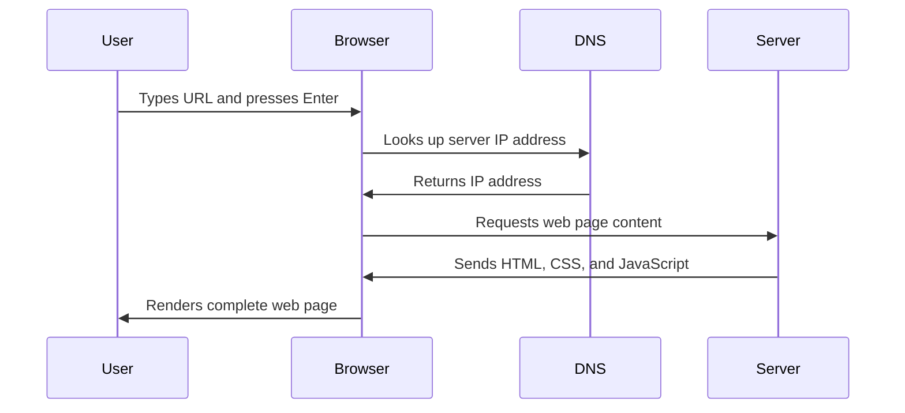

<!--
CO_OP_TRANSLATOR_METADATA:
{
  "original_hash": "33a875c522f237a2026e4653240dfc07",
  "translation_date": "2025-10-24T23:45:58+00:00",
  "source_file": "5-browser-extension/1-about-browsers/README.md",
  "language_code": "sr"
}
-->
# Пројекат проширења за прегледач, део 1: Све о прегледачима


> Скица од [Wassim Chegham](https://dev.to/wassimchegham/ever-wondered-what-happens-when-you-type-in-a-url-in-an-address-bar-in-a-browser-3dob)

## Квиз пре предавања

[Квиз пре предавања](https://ff-quizzes.netlify.app/web/quiz/23)

### Увод

Проширења за прегледаче су мини-апликације које побољшавају ваше искуство прегледања интернета. Као што је Тим Бернерс-Ли замислио интерактивни веб, проширења проширују могућности прегледача изван једноставног прегледа докумената. Од менаџера лозинки који чувају ваше налоге безбедним до алата за избор боја који помажу дизајнерима да пронађу савршене нијансе, проширења решавају свакодневне изазове у прегледању.

Пре него што направимо ваше прво проширење, хајде да разумемо како прегледачи функционишу. Као што је Александер Грејем Бел морао да разуме пренос звука пре него што је изумео телефон, познавање основа прегледача помоћи ће вам да направите проширења која се беспрекорно интегришу са постојећим системима прегледача.

На крају ове лекције, разумећете архитектуру прегледача и започећете изградњу свог првог проширења.

## Разумевање веб прегледача

Веб прегледач је у суштини софистицирани тумач докумената. Када укуцате "google.com" у траку за адресу, прегледач извршава сложен низ операција - захтева садржај са сервера широм света, а затим анализира и приказује тај код у интерактивне веб странице које видите.

Овај процес подсећа на то како је први веб прегледач, WorldWideWeb, дизајнирао Тим Бернерс-Ли 1990. године како би хипертекстуалне документе учинио доступним свима.

✅ **Мало историје**: Први прегледач се звао 'WorldWideWeb' и креирао га је сер Тимоти Бернерс-Ли 1990. године.


> Неки од раних прегледача, преко [Karen McGrane](https://www.slideshare.net/KMcGrane/week-4-ixd-history-personal-computing)

### Како прегледачи обрађују веб садржај

Процес између уноса URL-а и приказивања веб странице укључује неколико координисаних корака који се дешавају у року од неколико секунди:



**Ево шта овај процес постиже:**
- **Преводи** URL који је читљив људима у IP адресу сервера путем DNS претраге
- **Успоставља** сигурну везу са веб сервером користећи HTTP или HTTPS протоколе
- **Захтева** специфичан садржај веб странице са сервера
- **Прима** HTML код, CSS стилове и JavaScript код са сервера
- **Приказује** сав садржај у интерактивну веб страницу коју видите

### Основне функције прегледача

Савремени прегледачи пружају бројне функције које програмери проширења могу искористити:

| Функција | Сврха | Могућности за проширења |
|---------|---------|------------------------|
| **Мотор за приказивање** | Приказује HTML, CSS и JavaScript | Модификација садржаја, убацивање стилова |
| **JavaScript мотор** | Извршава JavaScript код | Прилагођени скриптови, интеракције са API-јем |
| **Локално складиштење** | Чува податке локално | Корисничке преференције, кеширани подаци |
| **Мрежни слој** | Обрађује веб захтеве | Надгледање захтева, анализа података |
| **Сигурносни модел** | Штити кориснике од злонамерног садржаја | Филтрирање садржаја, побољшања сигурности |

**Разумевање ових функција помаже вам да:**
- **Идентификујете** где ваше проширење може донети највише вредности
- **Изаберете** праве API-је прегледача за функционалност вашег проширења
- **Дизајнирате** проширења која ефикасно раде са системима прегледача
- **Обезбедите** да ваше проширење прати најбоље праксе сигурности прегледача

### Разматрања за развој проширења за више прегледача

Различити прегледачи примењују стандарде са благим варијацијама, слично као што различити програмски језици могу различито обрађивати исти алгоритам. Chrome, Firefox и Safari имају јединствене карактеристике које програмери морају узети у обзир током развоја проширења.

> 💡 **Савет**: Користите [caniuse.com](https://www.caniuse.com) да проверите које веб технологије су подржане у различитим прегледачима. Ово је непроцењиво када планирате функције вашег проширења!

**Кључна разматрања за развој проширења:**
- **Тестирајте** своје проширење на прегледачима Chrome, Firefox и Edge
- **Прилагодите** се различитим API-јима за проширења и форматима манифеста
- **Решите** различите карактеристике перформанси и ограничења
- **Обезбедите** алтернативе за функције специфичне за прегледач које можда нису доступне

✅ **Инсигхт из аналитике**: Можете утврдити које прегледаче ваши корисници преферирају инсталирањем аналитичких пакета у своје пројекте веб развоја. Ови подаци вам помажу да одредите приоритете за подршку одређеним прегледачима.

## Разумевање проширења за прегледаче

Проширења за прегледаче решавају уобичајене изазове прегледања интернета додавањем функционалности директно у интерфејс прегледача. Уместо да захтевају одвојене апликације или сложене радне токове, проширења пружају тренутни приступ алатима и функцијама.

Овај концепт подсећа на то како су рани компјутерски пионири попут Дагласа Енгелбарта замишљали проширење људских способности помоћу технологије - проширења проширују основну функционалност вашег прегледача.

**Популарне категорије проширења и њихове предности:**
- **Алатке за продуктивност**: Менаџери задатака, апликације за бележење и алати за праћење времена који вам помажу да останете организовани
- **Побољшања сигурности**: Менаџери лозинки, блокатори реклама и алати за приватност који штите ваше податке
- **Алатке за програмере**: Форматери кода, алати за избор боја и алати за отклањање грешака који олакшавају развој
- **Побољшање садржаја**: Режими читања, преузимачи видео записа и алати за снимање екрана који побољшавају ваше искуство на вебу

✅ **Питање за размишљање**: Која су ваша омиљена проширења за прегледач? Које специфичне задатке обављају и како побољшавају ваше искуство прегледања?

## Инсталирање и управљање проширењима

Разумевање процеса инсталације проширења помаже вам да предвидите корисничко искуство када људи инсталирају ваше проширење. Процес инсталације је стандардизован у савременим прегледачима, са мањим варијацијама у дизајну интерфејса.


> **Важно**: Обавезно укључите режим за програмере и дозволите проширења из других продавница када тестирате своја проширења.

### Процес инсталације проширења током развоја

Када развијате и тестирате своја проширења, пратите овај ток рада:

```bash
# Step 1: Build your extension
npm run build
```

**Шта ова команда постиже:**
- **Компилира** ваш изворни код у датотеке спремне за прегледач
- **Пакује** JavaScript модуле у оптимизоване пакете
- **Генерише** финалне датотеке проширења у `/dist` фасцикли
- **Припрема** ваше проширење за инсталацију и тестирање

**Корак 2: Идите на управљање проширењима у прегледачу**
1. **Отворите** страницу за управљање проширењима у вашем прегледачу
2. **Кликните** на дугме "Подешавања и више" (икона `...`) у горњем десном углу
3. **Изаберите** "Проширења" из падајућег менија

**Корак 3: Учитајте своје проширење**
- **За нове инсталације**: Изаберите `load unpacked` и одаберите своју `/dist` фасциклу
- **За ажурирања**: Кликните на `reload` поред већ инсталираног проширења
- **За тестирање**: Омогућите "Режим за програмере" да приступите додатним функцијама за отклањање грешака

### Инсталација проширења у продукцији

> ✅ **Напомена**: Ова упутства за развој су специфична за проширења која сами правите. Да бисте инсталирали објављена проширења, посетите званичне продавнице проширења за прегледаче као што је [Microsoft Edge Add-ons store](https://microsoftedge.microsoft.com/addons/Microsoft-Edge-Extensions-Home).

**Разумевање разлике:**
- **Инсталације током развоја** омогућавају вам да тестирате необјављена проширења током развоја
- **Инсталације из продавнице** пружају проверена, објављена проширења са аутоматским ажурирањима
- **Сајдлоудинг** омогућава инсталацију проширења изван званичних продавница (захтева режим за програмере)

## Изградња проширења за угљенични отисак

Направићемо проширење за прегледач које приказује угљенични отисак енергетске употребе у вашем региону. Овај пројекат демонстрира основне концепте развоја проширења док ствара практичан алат за подизање свести о заштити животне средине.

Овај приступ прати принцип "учења кроз рад" који се показао ефикасним још од образовних теорија Џона Дјуија - комбинујући техничке вештине са значајним апликацијама у стварном свету.

### Захтеви пројекта

Пре почетка развоја, хајде да прикупимо потребне ресурсе и зависности:

**Потребан приступ API-ју:**
- **[CO2 Signal API кључ](https://www.co2signal.com/)**: Унесите своју имејл адресу да бисте добили бесплатан API кључ
- **[Код региона](http://api.electricitymap.org/v3/zones)**: Пронађите код свог региона користећи [Electricity Map](https://www.electricitymap.org/map) (на пример, Бостон користи 'US-NEISO')

**Алатке за развој:**
- **[Node.js и NPM](https://www.npmjs.com)**: Алат за управљање пакетима за инсталацију зависности пројекта
- **[Почетни код](../../../../5-browser-extension/start)**: Преузмите фасциклу `start` за почетак развоја

✅ **Сазнајте више**: Унапредите своје вештине управљања пакетима уз овај [детаљан Learn модул](https://docs.microsoft.com/learn/modules/create-nodejs-project-dependencies/?WT.mc_id=academic-77807-sagibbon)

### Разумевање структуре пројекта

Разумевање структуре пројекта помаже у ефикасној организацији развојног рада. Као што је Александријска библиотека била организована за лако проналажење знања, добро организована база кода чини развој ефикаснијим:

```
project-root/
├── dist/                    # Built extension files
│   ├── manifest.json        # Extension configuration
│   ├── index.html           # User interface markup
│   ├── background.js        # Background script functionality
│   └── main.js              # Compiled JavaScript bundle
└── src/                     # Source development files
    └── index.js             # Your main JavaScript code
```

**Објашњење сваке датотеке:**
- **`manifest.json`**: **Дефинише** метаподатке проширења, дозволе и улазне тачке
- **`index.html`**: **Креира** кориснички интерфејс који се појављује када корисници кликну на ваше проширење
- **`background.js`**: **Обрађује** позадинске задатке и слушаче догађаја прегледача
- **`main.js`**: **Садржи** финални компилирани JavaScript након процеса изградње
- **`src/index.js`**: **Садржи** ваш главни развојни код који се компилира у `main.js`

> 💡 **Савет за организацију**: Чувајте свој API кључ и код региона у сигурној белешци за лако референцирање током развоја. Ове вредности ће вам бити потребне за тестирање функционалности вашег проширења.

✅ **Напомена о сигурности**: Никада не постављајте API кључеве или осетљиве акредитиве у свој репозиторијум кода. Показаћемо вам како да их безбедно чувате у наредним корацима.

## Креирање интерфејса проширења

Сада ћемо изградити компоненте корисничког интерфејса. Проширење користи приступ са два екрана: екран за конфигурацију за почетно подешавање и екран са резултатима за приказ података.

Ово прати принцип прогресивног откривања који се користи у дизајну интерфејса од раних дана рачунарства - откривање информација и опција у логичном редоследу како би се избегло преоптерећење корисника.

### Преглед приказа проширења

**Преглед подешавања** - Конфигурација за први пут:


**Преглед резултата** - Приказ података о угљеничном отиску:


### Изградња формулара за конфигурацију

Формулар за подешавање прикупља податке о конфигурацији корисника током прве употребе. Када се конфигурише, ове информације се чувају у складишту прегледача за будуће сесије.

У `/dist/index.html` датотеци, додајте ову структуру формулара:

```html
<form class="form-data" autocomplete="on">
    <div>
        <h2>New? Add your Information</h2>
    </div>
    <div>
        <label for="region">Region Name</label>
        <input type="text" id="region" required class="region-name" />
    </div>
    <div>
        <label for="api">Your API Key from tmrow</label>
        <input type="text" id="api" required class="api-key" />
    </div>
    <button class="search-btn">Submit</button>
</form>
```

**Ево шта овај формулар постиже:**
- **Креира** семантичку структуру формулара са одговарајућим ознакама и асоцијацијама уноса
- **Омогућава** функцију аутоматског попуњавања
**Опис:** Унапредите екстензију за претраживач додавањем функција за валидацију формулара и повратне информације кориснику како бисте побољшали корисничко искуство приликом уноса API кључева и кодова региона.

**Задатак:** Направите JavaScript функције за валидацију које проверавају да ли поље за API кључ садржи најмање 20 карактера и да ли код региона прати исправан формат (на пример, 'US-NEISO'). Додајте визуелне повратне информације променом боје оквира уноса у зелено за исправне уносе и црвено за неисправне. Такође, додајте функцију за укључивање/искључивање приказа API кључа ради безбедности.

Сазнајте више о [режиму агента](https://code.visualstudio.com/blogs/2025/02/24/introducing-copilot-agent-mode) овде.

## 🚀 Изазов

Погледајте продавницу екстензија за претраживач и инсталирајте једну на свој претраживач. Можете на занимљив начин истражити њене датотеке. Шта откривате?

## Квиз након предавања

[Квиз након предавања](https://ff-quizzes.netlify.app/web/quiz/24)

## Преглед и самостално учење

У овом лекцији сте научили нешто о историји веб претраживача; искористите ову прилику да сазнате више о томе како су изумитељи Светске мреже замислили њену употребу читајући више о њеној историји. Неки корисни сајтови укључују:

[Историја веб претраживача](https://www.mozilla.org/firefox/browsers/browser-history/)

[Историја веба](https://webfoundation.org/about/vision/history-of-the-web/)

[Интервју са Тимом Бернерс-Лијем](https://www.theguardian.com/technology/2019/mar/12/tim-berners-lee-on-30-years-of-the-web-if-we-dream-a-little-we-can-get-the-web-we-want)

## Задатак 

[Промените стил ваше екстензије](assignment.md)

---

**Одрицање од одговорности**:  
Овај документ је преведен помоћу услуге за превођење вештачке интелигенције [Co-op Translator](https://github.com/Azure/co-op-translator). Иако настојимо да обезбедимо тачност, молимо вас да имате у виду да аутоматски преводи могу садржати грешке или нетачности. Оригинални документ на његовом изворном језику треба сматрати ауторитативним извором. За критичне информације препоручује се професионални превод од стране људи. Не преузимамо одговорност за било каква погрешна тумачења или неспоразуме који могу настати услед коришћења овог превода.