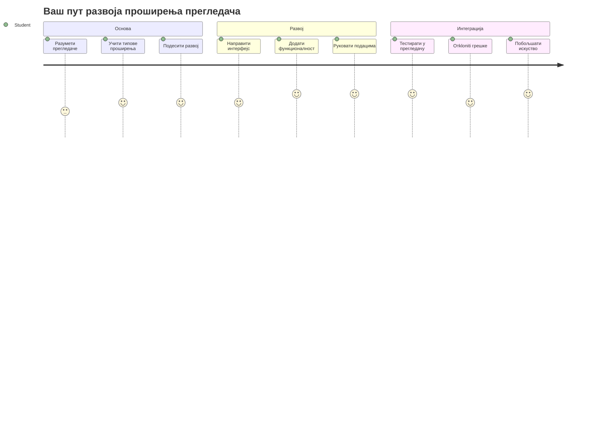
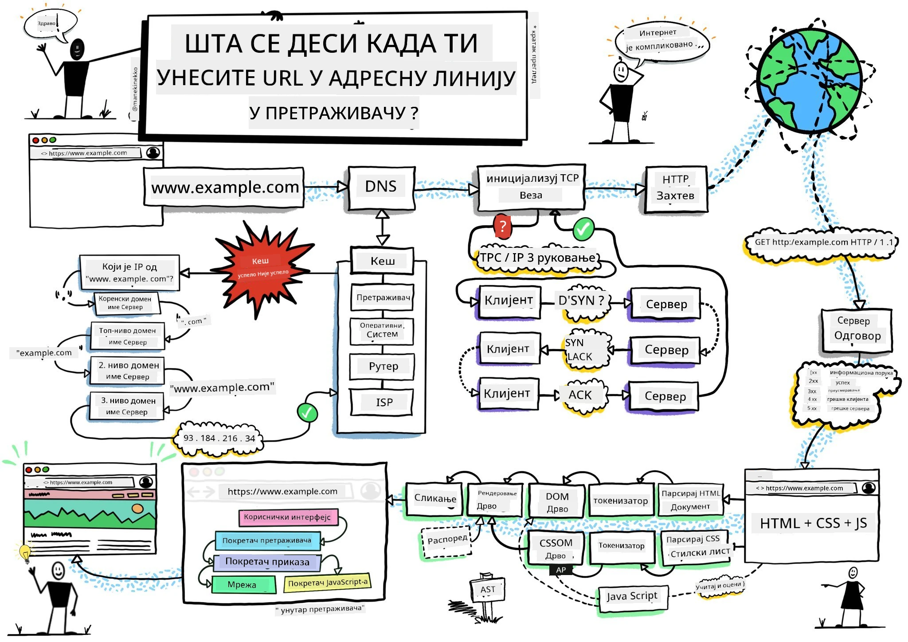
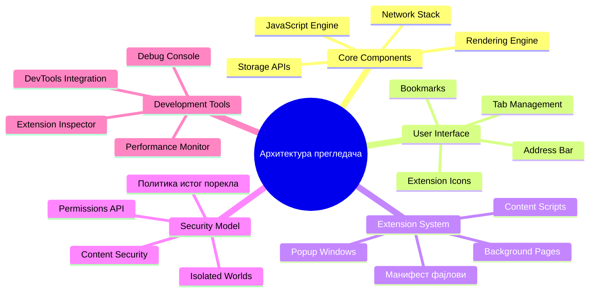
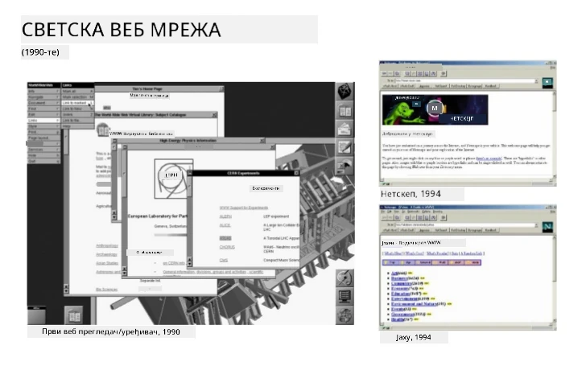
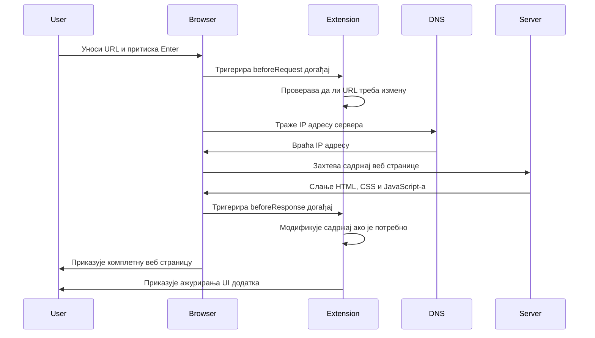
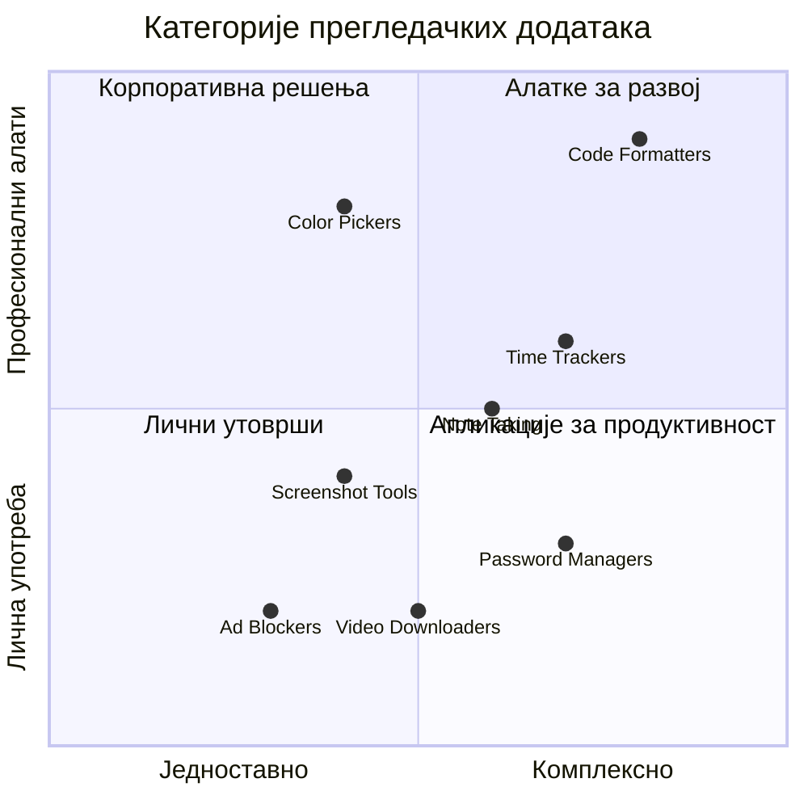
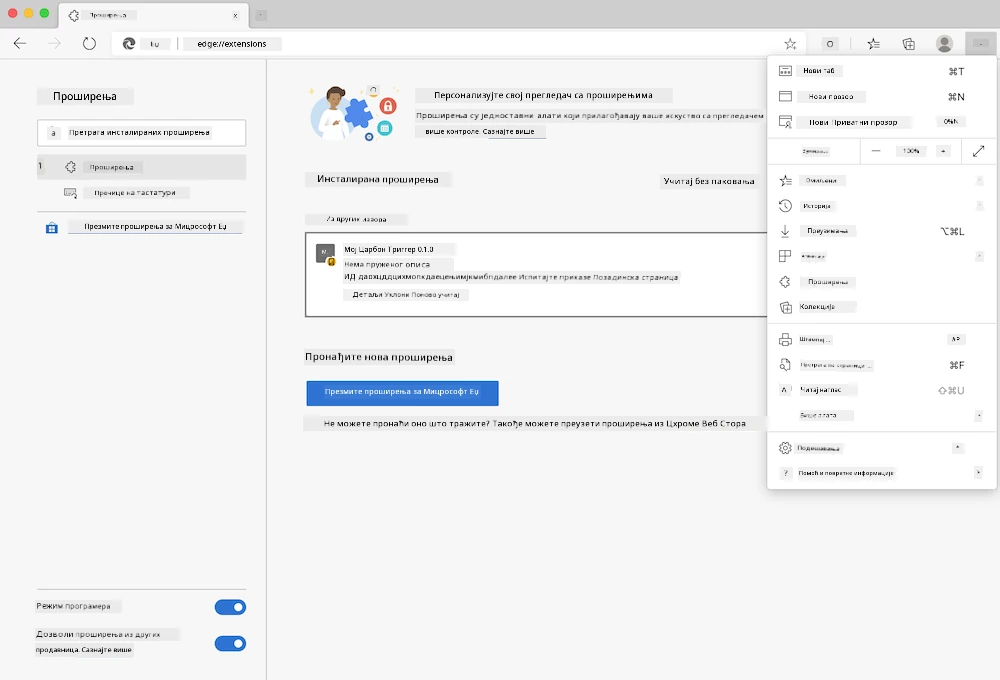
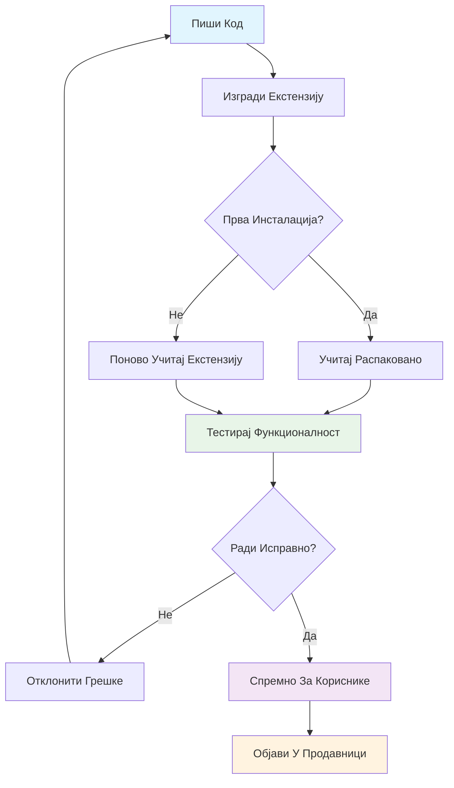
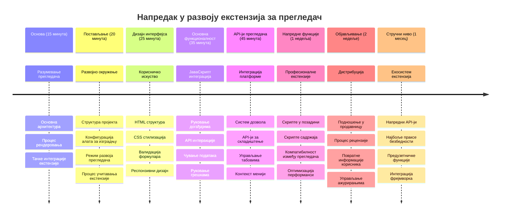

# Пројекат проширења прегледача Deo 1: Све о прегледачима



> Скетчнот од [Wassim Chegham](https://dev.to/wassimchegham/ever-wondered-what-happens-when-you-type-in-a-url-in-an-address-bar-in-a-browser-3dob)

## Квиз пре предавања

[Квиз пре предавања](https://ff-quizzes.netlify.app/web/quiz/23)

### Увод

Проширења прегледача су мини-програмчићи који побољшавају ваше искуство веб претраживања. Као што је Тим Бернерс-Ли замислио интерактивни веб, проширења проширују могућности прегледача изван једноставног приказивања докумената. Од менаџера лозинки који штите ваше налоге до алата за одабир боја који помажу дизајнерима да одаберу савршене нијансе, проширења решавају свакодневне изазове прегледања.

Пре него што направимо ваше прво проширење, хајде да разумемо како прегледачи функционишу. Као што је Александру Грејаму Белу требало да разуме пренос звука пре него што изуми телефон, познавање основа прегледача помоћи ће вам да направите проширења која се беспрекорно интегришу са постојећим системима прегледача.

До краја ове лекције, разумећете архитектуру прегледача и почећете са израдом свог првог проширења.


## Разумевање веб прегледача

Веб прегледач је у суштини сложени тумач докумената. Када унесете "google.com" у траку за адресу, прегледач извршава комплексну серију операција – захтева садржај са сервера широм света, затим парсира и приказује тај код у интерактивне веб странице које видите.

Овај процес одражава како је први веб прегледач, WorldWideWeb, дизајнирао Тим Бернерс-Ли 1990. године да би хиперлинковани документи били доступни свима.

✅ **Мало историје**: Први прегледач назван је 'WorldWideWeb' и креирао га је сер Тимоти Бернерс-Ли 1990. године.


> Неки рани прегледачи, преко [Karen McGrane](https://www.slideshare.net/KMcGrane/week-4-ixd-history-personal-computing)

### Како прегледачи обрађују веб садржај

Процес између уноса УРЛ-a и приказа веб странице укључује неколико координисаних корака који се дешавају у року од секунди:


**Ево шта тај процес обавља:**
- **Преводи** читљиви УРЛ у ИП адресу сервера преко DNS претраге
- **Успоставља** сигурну везу са веб сервером коришћењем HTTP или HTTPS протокола
- **Захтева** одређени веб садржај са сервера
- **Прима** HTML ознаку, CSS стилове и Јаваскрипт код са сервера
- **Приказује** сав садржај у интерактивној веб страници коју видите

### Основне функције прегледача

Модерни прегледачи пружају бројне функције које програмери проширења могу искористити:

| Функција | Сврха | Могућности за проширења |
|---------|---------|------------------------|
| **Рендеринг мотор** | Приказује HTML, CSS и JavaScript | Модификација садржаја, уметање стилова |
| **JavaScript мотор** | Извршава JavaScript код | Прилагођени скрипти, API интеракције |
| **Локална меморија** | Чува податке локално | Корисничке поставке, кеширани подаци |
| **Мрежни слој** | Обрађује веб захтеве | Праћење захтева, анализа података |
| **Безбедносни модел** | Штити кориснике од злонамерног садржаја | Филтрирање садржаја, безбедносна унапређења |

**Разумевање ових функција вам помаже да:**
- **Препознате** где ваше проширење може донети највећу вредност
- **Изаберете** праве браузер API-је за функционалност проширења
- **Дизајнирате** проширења која ефикасно раде са системима прегледача
- **Обезбедите** да ваше проширење следи најбоље безбедносне праксе прегледача

### Разматрања за развој на више прегледача

Различити прегледачи имплементирају стандарде са мањим варијацијама, слично као што различити програмијски језици могу другачије руковати истим алгоритмом. Chrome, Firefox и Safari имају јединствене карактеристике које програмери морају узети у обзир током развоја проширења.

> 💡 **Професионални савет**: Користите [caniuse.com](https://www.caniuse.com) да проверите које веб технологије су подржане у различитим прегледачима. Ово је непроцењиво при планирању функција вашег проширења!

**Кључна разматрања за развој проширења:**
- **Тестирајте** проширења у Chrome, Firefox и Edge прегледачима
- **Прилагодите** се различитим API-јима и форматима манифеста проширења
- **Решавајте** различите перформансе и ограничења
- **Обезбедите** алтернативе за функције специфичне за прегледач које можда нису доступне

✅ **Увид из аналитике**: Можете сазнати који прегледачи су најпопуларнији међу вашим корисницима инсталирањем аналитичких пакета у вашим пројектима веб развоја. Ови подаци вам помажу да одредите приоритете подршке прегледачима.

## Разумевање проширења за прегледач

Проширења прегледача решавају уобичајене изазове у веб претраживању додавањем функционалности директно у интерфејс прегледача. Уместо да захтевају посебне апликације или сложене радне токове, проширења пружају непосредан приступ алатима и функцијама.

Овај концепт одражава како су рани рачунарски пионири као Douglas Engelbart замишљали побољшање људских капацитета технологијом - проширења повећавају базичну функционалност вашег прегледача.


**Популарне категорије проширења и њихове користи:**
- **Алатке за продуктивност**: Менаџери задатака, апликације за узимање белешки и алати за праћење времена који вам помажу да останете организовани
- **Безбедносна побољшања**: Менаџери лозинки, блокатори реклама и алати за приватност који штите ваше податке
- **Алатке за програмере**: Форматери кода, одабирачи боја и алати за отклањање грешака који убрзавају развој
- **Побољшање садржаја**: Режими читања, преузимачи видео записа и алати за снимање екрана који унапређују ваше веб искуство

✅ **Питање за размишљање**: Која су ваша омиљена проширења прегледача? Које конкретне задатке обављају и како унапређују ваше прегледање?

### 🔄 **Педагошки преглед**
**Разумевање архитектуре прегледача**: Пре него што пређете на развој проширења, уверите се да можете:
- ✅ Објаснити како прегледачи обрађују веб захтеве и приказују садржај
- ✅ Идентификовати главне компоненте архитектуре прегледача
- ✅ Разумети како се проширења интегришу са функционалношћу прегледача
- ✅ Препознати безбедносни модел који штити кориснике

**Кратки самопроверавајући тест**: Можете ли пратити пут од уноса УРЛ-а до приказа веб странице?
1. **DNS претрага** претвара УРЛ у ИП адресу
2. **HTTP захтев** преузима содржај са сервера
3. **Парсирање** обрађује HTML, CSS и JavaScript
4. **Рендеровање** приказује коначну веб страницу
5. **Проширења** могу мењати садржај у више корака

## Инсталација и управљање проширењима

Разумевање процеса инсталације проширења помаже да предвидите корисничко искуство када људи инсталирају ваше проширење. Процес инсталације је стандардизован у модерним прегледачима, уз мање разлике у дизајну интерфејса.



> **Важно**: Обавезно укључите режим програмера и дозволите проширења из других продавница када тестирате сопствена проширења.

### Процес инсталације проширења за развој

Када развијате и тестирате своја проширења, пратите овај радни ток:


```bash
# Корак 1: Направите ваш додатак
npm run build
```

**Ова команда ради:**
- **Компилира** изворни код у фајлове спремне за прегледач
- **Пакује** JavaScript модуле у оптимизоване пакете
- **Генерише** коначне фајлове проширења у фолдеру `/dist`
- **Припрема** проширење за инсталацију и тестирање

**Корак 2: Идите на странице за управљање проширењима прегледача**
1. **Отворите** страницу за управљање проширењима у вашем прегледачу
2. **Кликните** на дугме "Поставке и још" (икона `...`) горе десно
3. **Изаберите** "Проширења" из падајућег менија

**Корак 3: Учитајте ваше проширење**
- **За нове инсталације**: Изаберите `load unpacked` и покажите на ваш `/dist` фолдер
- **За ажурирања**: Кликните `reload` поред већ инсталираног проширења
- **За тестирање**: Укључите "Developer mode" за приступ додатним алаткама за отклањање грешака

### Инсталација проширења за продукцију

> ✅ **Напомена**: Ова упутства за развој су намењена за проширења која сами градите. За инсталирање објављених проширења посетите званичне продавнице проширења прегледача као што је [Microsoft Edge Add-ons store](https://microsoftedge.microsoft.com/addons/Microsoft-Edge-Extensions-Home).

**Разлика:**
- **Развојна инсталација** омогућава тестирање непубликованих проширења током развоја
- **Инсталација из продавнице** пружа проверена, објављена проширења са аутоматским ажурирањима
- **Сајдлоадинг** омогућава инсталацију проширења ван званичних продавница (захтева режим развојног програмера)

## Направите ваше проширење угљеничног отиска

Направићемо проширење прегледача које приказује угљенични отисак енергетске потрошње вашег региона. Овај пројекат демонстрира основне концепте развоја проширења, док истовремено прави корисан алат за еколошку свест.

Овај приступ прати принцип "учења кроз рад" који се показао ефикасним још од образовних теорија Џона Дјуија—спајање техничких вештина са значајним применама у стварном свету.

### Захтеви пројекта

Пре почетка развоја, прикупимо потребне ресурсе и зависности:

**Потребан приступ API-ју:**
- **[CO2 Signal API кључ](https://www.co2signal.com/)**: Унесите вашу видео адресу е-поште да бисте добили бесплатан API кључ
- **[Код региона](http://api.electricitymap.org/v3/zones)**: Пронађите код свог региона преко [Electricity Map](https://www.electricitymap.org/map) (на пример, Boston користи 'US-NEISO')

**Алати за развој:**
- **[Node.js и NPM](https://www.npmjs.com)**: Систем за управљање пакетима за инсталацију зависности пројекта
- **[Почетни код](../../../../5-browser-extension/start)**: Преузмите фолдер `start` за почетак рада

✅ **Сазнајте више**: Унапредите своје вештине управљања пакетима уз овај [свеобухватни Learn модул](https://docs.microsoft.com/learn/modules/create-nodejs-project-dependencies/?WT.mc_id=academic-77807-sagibbon)

### Разумевање структуре пројекта

Разумевање структуре пројекта помаже да организујете рад ефикасно. Као што је Библиотека у Алесандрии била организована ради лаког приступа знању, тако и добро организован код чини развој ефикаснијим:

```
project-root/
├── dist/                    # Built extension files
│   ├── manifest.json        # Extension configuration
│   ├── index.html           # User interface markup
│   ├── background.js        # Background script functionality
│   └── main.js              # Compiled JavaScript bundle
├── src/                     # Source development files
│   └── index.js             # Your main JavaScript code
├── package.json             # Project dependencies and scripts
└── webpack.config.js        # Build configuration
```

**Разлагање шта сваки фајл ради:**
- **`manifest.json`**: **Дефинише** метаподатке проширења, дозволе и улазне тачке
- **`index.html`**: **Креира** кориснички интерфејс који се појављује када корисници кликну на ваше проширење
- **`background.js`**: **Рукова** позадинским задацима и слушањем догађаја прегледача
- **`main.js`**: **Садржи** коначно обједињен JavaScript након процеса израде
- **`src/index.js`**: **Смешта** ваш главни изворни код који се компајлира у `main.js`

> 💡 **Савет за организацију**: Чувајте свој API кључ и код региона у безбедној белешци ради лаког проналажења током развоја. Биће вам потребне ове вредности да тестирате функционалност проширења.

✅ **Безбедносна напомена**: Никада не комитујте API кључеве или осетљиве акредитиве у ваш репозиторијум кода. Показаћемо вам како безбедно руковати овим у наредним корацима.

## Креирање интерфејса проширења

Сада ћемо направити компоненте корисничког интерфејса. Проширење користи приступ са два екрана: екран за подешавање за почетну конфигурацију и екран за приказ резултата.

Ово прати принцип постепеног откривања коришћен од раних дана рачунарства – откривање информација и опција у логичном низу како се корисник не би преоптеретио.

### Преглед приказа проширења

**Приказ подешавања** – конфигурација новог корисника:


**Приказ резултата** – приказ података о угљеничном отиску:


### Креирање формулара за подешавање

Формулар за подешавање прикупља конфигурацијске податке корисника током првог коришћења. Једном када се подешавања сачувају, ова информација остаје у локалној меморији прегледача за будуће сесије.

У фајлу `/dist/index.html` додајте ову структуру формулара:

```html
<form class="form-data" autocomplete="on">
    <div>
        <h2>New? Add your Information</h2>
    </div>
    <div>
        <label for="region">Region Name</label>
        <input type="text" id="region" required class="region-name" />
    </div>
    <div>
        <label for="api">Your API Key from tmrow</label>
        <input type="text" id="api" required class="api-key" />
    </div>
    <button class="search-btn">Submit</button>
</form>
```

**Ево шта овај формулар ради:**
- **Креира** семантичку структуру формулара са исправним етикетама и везама за уносе
- **Омогућава** аутоматско попуњавање у прегледачу ради бољег искуства корисника
- **Захтева** да оба поља буду попуњена пре слања путем `required` атрибута
- **Организује** уносе са описним именима класа ради лакшег стилизовања и циљања у JavaScript-у
- **Пружа** јасна упутства корисницима који постављају проширење први пут

### Креирање приказа резултата

Затим креирајте област за приказ резултата која ће приказивати податке о угљеничном отиску. Додајте овај HTML испод формулара:

```html
<div class="result">
    <div class="loading">loading...</div>
    <div class="errors"></div>
    <div class="data"></div>
    <div class="result-container">
        <p><strong>Region: </strong><span class="my-region"></span></p>
        <p><strong>Carbon Usage: </strong><span class="carbon-usage"></span></p>
        <p><strong>Fossil Fuel Percentage: </strong><span class="fossil-fuel"></span></p>
    </div>
    <button class="clear-btn">Change region</button>
</div>
```

**Објашњење шта ова структура пружа:**
- **`loading`**: **Приказује** поруку о учитавању док се подаци из API-ја преузимају
- **`errors`**: **Приказује** поруке о грешкама ако позиви API-ју не успеју или су подаци неисправни
- **`data`**: **Држи** необрађене податке за сврху отклањања грешака током развоја
- **`result-container`**: **Приказује** форматиране информације о угљеничном отиску корисницима
- **`clear-btn`**: **Дозвољава** корисницима да промене свој регион и поново конфигуришу проширење

### Постављање процеса израде

Сада инсталирајмо зависности пројекта и тестирамо процес израде:

```bash
npm install
```

**Овај процес инсталације ради:**
- **Преузима** Webpack и друге развојне зависности наведене у `package.json`
- **Конфигурише** систем за израду за компајлирање модерног JavaScript-а
- **Припрема** средину за развој за изградњу и тестирање проширења
- **Омогућава** паковање кода, оптимизацију и функције компатибилности са више прегледача

> 💡 **Увид у процес изградње**: Webpack обједињује ваш изворни код из `/src/index.js` у `/dist/main.js`. Овај процес оптимизује код за продукцију и обезбеђује компатибилност са прегледачима.

### Тестирање вашег напретка

У овом тренутку можете тестирати своје проширење:
1. **Покрените** команду за израду да саставите свој код
2. **Учитајте** додатак у свој претраживач користећи режим за развојне програмере
3. **Проверите** да ли се формулар исправно приказује и изгледа професионално
4. **Проверите** да ли су сви елементи формулара правилно усклађени и функционални

**Шта сте постигли:**
- **Поставили** основну HTML структуру за ваш додатак
- **Креирали** интерфејсе за конфигурацију и резултате са правилним семантичким означавањем
- **Поставили** савремен развојни ток користећи индустријско стандардне алате
- **Припремили** основу за додавање интерактивне JavaScript функционалности

### 🔄 **Педагошки пресек**
**Напредак у развоју додатка**: Потврдите своје разумевање пре наставка:
- ✅ Можете ли објаснити сврху сваке датотеке у структури пројекта?
- ✅ Разумете ли како процес израде трансформише ваш изворни код?
- ✅ Зашто разделимо конфигурацију и резултате у различите UI секције?
- ✅ Како структура формулара подржава и употребљивост и приступачност?

**Разумевање развојног тока**: Сада би требало да можете:
1. **Измените** HTML и CSS за интерфејс свог додатка
2. **Покрените** команду за израду да саставите измене
3. **Поново учитајте** додатак у претраживачу да тестирате ажурирања
4. **Отклоније грешке** користећи алате за програмере у претраживачу

Завршили сте прву фазу развоја додатка за претраживач. Као што су браћа Рајт прво морала да разумеју аеродинамику пре летa, разумевање ових основних концепата припрема вас за израду сложенијих интерактивних функција у следећем лекцији.

## Изазов GitHub Copilot агента 🚀

Користите Agent режим да довршите следећи изазов:

**Опис:** Побољшајте додатак за претраживач додавањем валидације формулара и повратних информација кориснику ради бољег корисничког искуства приликом уноса API кључева и регионалних кодова.

**Задатак:** Креирајте JavaScript функције за валидацију које проверавају да ли поље за API кључ садржи најмање 20 карактера и да ли регионални код следи исправан формат (нпр. 'US-NEISO'). Додајте визуелну повратну информацију мењањем боје ивице у зелену за важеће уносе и црвену за неважеће. Такође додајте могућност укључивања/искључивања приказа API кључа ради безбедности.

Сазнајте више о [agent режиму](https://code.visualstudio.com/blogs/2025/02/24/introducing-copilot-agent-mode) овде.

## 🚀 Изазов

Погледајте једну продавницу додатака за претраживач и инсталирајте један у свој претраживач. Можете интересантно испитати њене фајлове. Шта сте открили?

## Квиз после предавања

[Квиз после предавања](https://ff-quizzes.netlify.app/web/quiz/24)

## Ревизија & Самосталан рад

У овој лекцији сте научили нешто о историји веб претраживача; искористите ову прилику да сазнате како су изумитељи Светске мреже замишљали њену употребу читајући више о њеној историји. Неке корисне странице укључују:

[Историја веб претраживача](https://www.mozilla.org/firefox/browsers/browser-history/)

[Историја Веба](https://webfoundation.org/about/vision/history-of-the-web/)

[Интервју с Тимом Бернерс-Лијем](https://www.theguardian.com/technology/2019/mar/12/tim-berners-lee-on-30-years-of-the-web-if-we-dream-a-little-we-can-get-the-web-we-want)

### ⚡ **Шта можете урадити у наредних 5 минута**
- [ ] Отворите страницу проширења за Chrome/Edge (chrome://extensions) и прегледајте шта имате инсталирано
- [ ] Погледајте картицу Мрежа у DevTools док учитавате веб страницу
- [ ] Покушајте да видите извор странице (Ctrl+U) да бисте видели HTML структуру
- [ ] Инспектујте било који елемент на веб страници и измените његов CSS у DevTools

### 🎯 **Шта можете постићи у овом сату**
- [ ] Завршити квиз после лекције и разумети основе претраживача
- [ ] Креирати основну датотеку manifest.json за додатак претраживача
- [ ] Направити једноставан "Hello World" додатак који приказује искачући прозор
- [ ] Тестирати учитавање додатка у режиму развојних програмера
- [ ] Истражити документацију за додатке за свој циљни претраживач

### 📅 **Ваша недеља развоја додатка**
- [ ] Завршити функционалан додатак са стварном употребном вредношћу
- [ ] Сазнати о content scripts, background scripts и интеракцијама са popup-ом
- [ ] Мастерирати API-је претраживача као што су storage, tabs, и messaging
- [ ] Дизајнирати корисничке интерфејсе погодне за кориснике
- [ ] Тестирати свој додатак на различитим вебсајтовима и сценаријима
- [ ] Објавити свој додатак у продавници додатака претраживача

### 🌟 **Ваш месеци развоја додатака за претраживач**
- [ ] Направити више додатака који решавају различите корисничке проблеме
- [ ] Сазнати напредне API-је претраживача и најбоље безбедносне праксе
- [ ] Доприносити пројектима отвореног кода за додатке
- [ ] Мастерирати крос-претраживачку компатибилност и прогресивно унапређење
- [ ] Креирати алате и шаблоне за развој додатака који ће користити други
- [ ] Постати експерт за додатке за претраживач који помаже другим програмерима

## 🎯 Ваша временска линија мајсторства у развоју додатака за претраживач


### 🛠️ Резиме вашег алатног сета за развој додатака

Након завршетка ове лекције, сада имате:
- **Знање о архитектури претраживача**: Разумевање рендеринг покретача, безбедносних модела и интеграције додатака
- **Развојно окружење**: Савремени сет алата са Webpack, NPM и могућностима отклањања грешака
- **Основе UI/UX**: Семантичка HTML структура са обрасцима прогресивног откривања
- **Свесност о безбедности**: Разумевање дозвола претраживача и безбедних развојних пракси
- **Концепти крос-претраживача**: Знање о компатибилности и приступима тестирању
- **API интеграција**: Основа за рад са спољним изворима података
- **Професионални радни ток**: Индустријски стандардни поступци развоја и тестирања

**Примена у стварном свету**: Ове вештине се директно примењују на:
- **Веб развој**: Једностраничне апликације и прогресивне веб апликације
- **Десктоп апликације**: Electron и веб-базирани десктоп софтвер
- **Мобилни развој**: Хибридне апликације и веб-базирана мобилна решења
- **Пословни алати**: Интерне продуктивне апликације и аутоматизација радних токова
- **Отворени код**: Допринос пројектима додатака и веб стандардима

**Следећи ниво**: Спремни сте да додате интерактивне функције, радите са API-јима претраживача и креирате додатке који решавају стварне корисничке проблеме!

## Задатак

[Преуредите свој додатак](assignment.md)

---

<!-- CO-OP TRANSLATOR DISCLAIMER START -->
**Одрицање од одговорности**:  
Овај документ је преведен уз помоћ АИ сервиса за превођење [Co-op Translator](https://github.com/Azure/co-op-translator). Иако се трудимо да превод буде што прецизнији, имајте на уму да аутоматски преводи могу садржати грешке или нетачности. Изворни документ на његовом оригиналном језику сматра се ауторитетом. За критичне информације препоручује се професионални људски превод. Не сносимо одговорност за било каква неспоразума или погрешна тумачења настала коришћењем овог превода.
<!-- CO-OP TRANSLATOR DISCLAIMER END -->