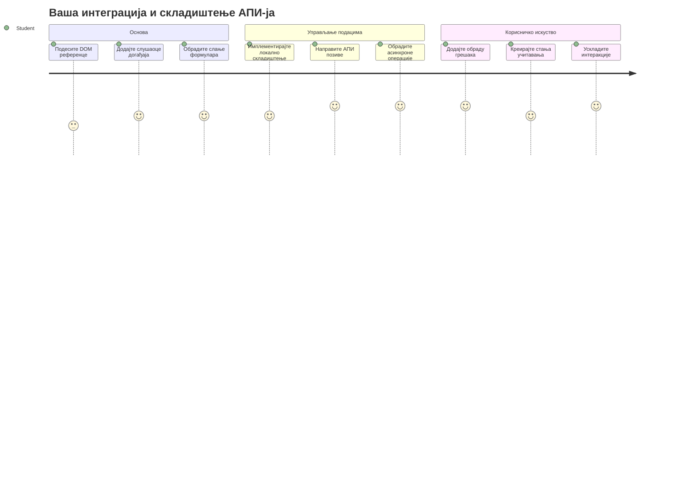
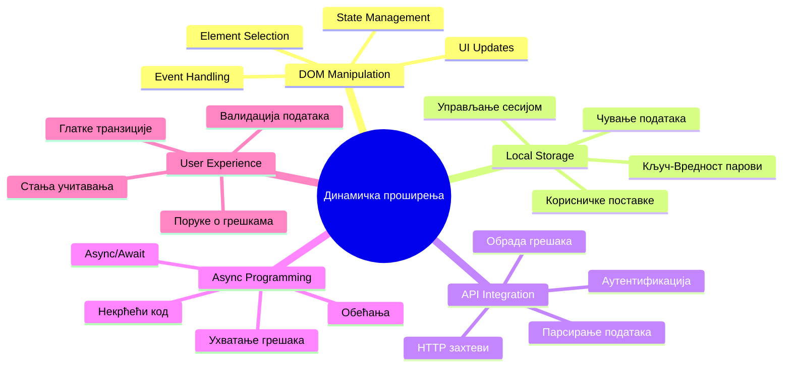
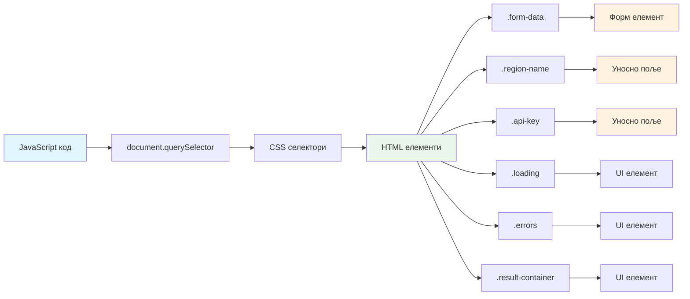
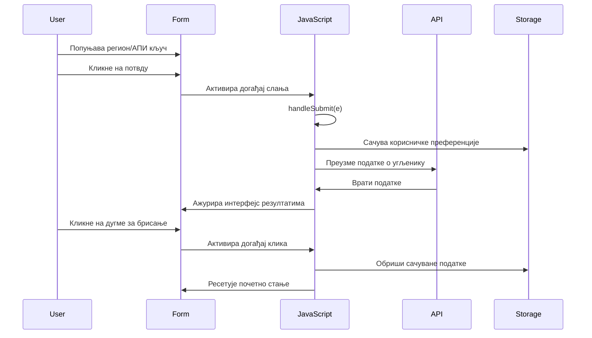
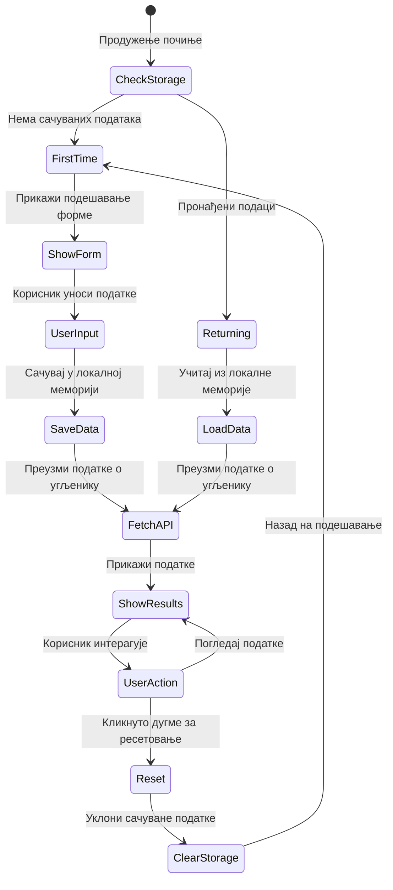
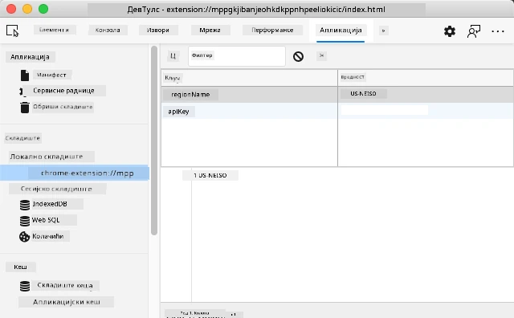
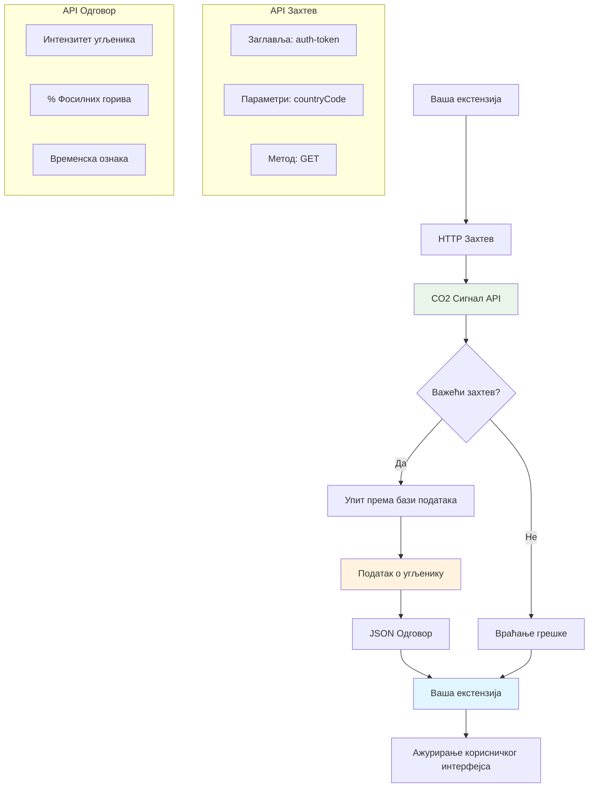
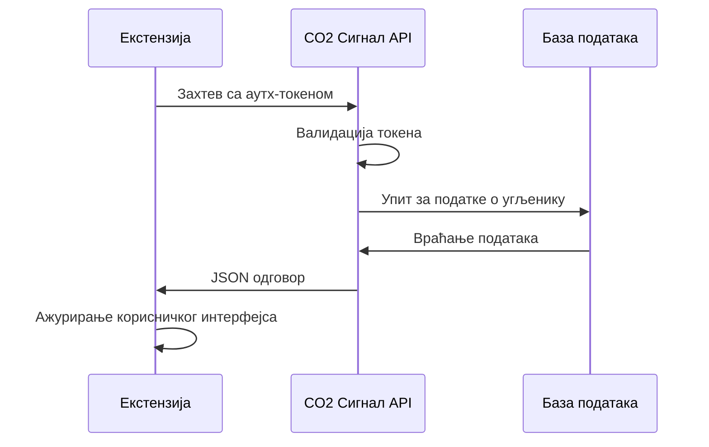
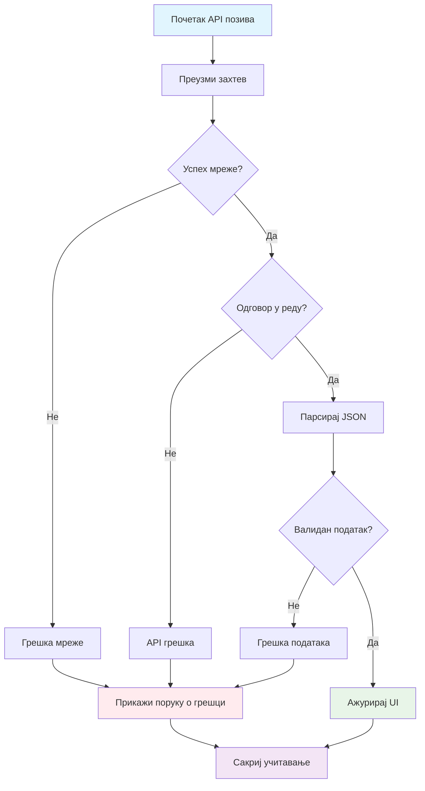
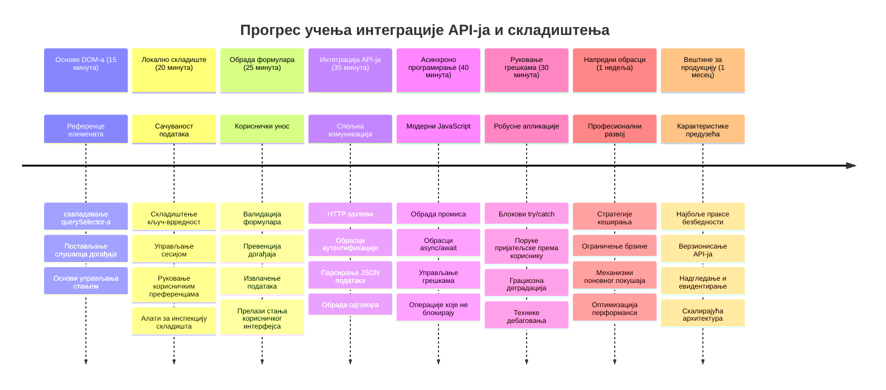

# Пројекат проширења прегледача, део 2: Позив API-ја, коришћење локалне меморије


## Претквиз предавања

[Претквиз предавања](https://ff-quizzes.netlify.app/web/quiz/25)

## Увод

Сећате се проширења прегледача које сте почели да правите? Тренутно имате лепо уређен формулар, али он је у суштини статичан. Данас ћемо га оживети повезујући га са правим подацима и дајући му меморију.

Размислите о рачунарима контроле мисије Аполо – они нису само приказивали фиксне информације. Константно су комуницирали са свемирским летелицама, ажурирали податке о телеметрији и памтили критичне параметре мисије. Ово је врста динамичног понашања коју данас правимо. Ваше проширење ће прибавити податке са интернета, узети праве податке о животној средини и запамтити ваша подешавања за следећи пут.

Интеграција API-ја може звучати компликовано, али у ствари је само подучавање вашег кода како да комуницира са другим сервисима. Без обзира да ли преузимате податке о времену, друштвене медије или информације о угљеничном отиску као што ћемо чинити данас, све је то о успостављању ових дигиталних веза. Такође ћемо истражити како прегледачи могу да сачувају информације – слично као што библиотеке користе картотеке да памте где припадају књиге.

На крају овог часа имаћете проширење прегледача које преузима праве податке, чува корисничке преференције и пружа глатко корисничко искуство. Хајде да почнемо!


✅ Пратите бројане сегменте у одговарајућим фајловима да бисте знали где да ставите свој код

## Постављање елемената за манипулацију у проширењу

Пре него што ваш JavaScript може да манипулише интерфејсом, потребне су му референце на одређене HTML елементе. Можете то схватити као да телескоп треба да буде усмерен ка одређеним звездама – пре него што је Галилео могао да проучава Јупитерове месеце, морао је да пронађе и усмери се на самог Јупитера.

У вашем `index.js` фајлу креираћемо `const` променљиве које ће хватају референце на сваки важан елемент формулара. Ово је слично као што научници означавају своју опрему – уместо да сваки пут прегледају целу лабораторију, могу директно приступити ономе што им треба.


```javascript
// поља форми
const form = document.querySelector('.form-data');
const region = document.querySelector('.region-name');
const apiKey = document.querySelector('.api-key');

// резултати
const errors = document.querySelector('.errors');
const loading = document.querySelector('.loading');
const results = document.querySelector('.result-container');
const usage = document.querySelector('.carbon-usage');
const fossilfuel = document.querySelector('.fossil-fuel');
const myregion = document.querySelector('.my-region');
const clearBtn = document.querySelector('.clear-btn');
```

**Ово је шта овај код ради:**
- **Хвата** елементе формулара коришћењем `document.querySelector()` са CSS класним селекторима
- **Прави** референце на улазна поља за име региона и API кључ
- **Успоставља** везе ка елементима за приказ резултата о подацима о коришћењу угљеника
- **Поставља приступ** UI елементима као што су индикатори учитавања и поруке о грешкама
- **Смешта** сваку референцу елемента у `const` променљиву за лаку поновну употребу у целом коду

## Додавање слушача догађаја

Сада ћемо учинити да ваше проширење реагује на корисничке акције. Слушачи догађаја су начин вашег кода да прати корисничке интеракције. Можете их посматрати као оператере у раним телефонским централним – они су слушали долазне позиве и повезивали праве кругове када је неко желео да успостави везу.


```javascript
form.addEventListener('submit', (e) => handleSubmit(e));
clearBtn.addEventListener('click', (e) => reset(e));
init();
```

**Разумевање ових концепата:**
- **Повезује** слушача за `submit` догађај на формулар који се активира када корисник притисне Enter или кликне на слање
- **Повезује** слушача за `click` догађај на дугме за брисање да ресетује формулар
- **Прослеђује** објекат догађаја `(e)` хендлер функцијама за додатну контролу
- **Позива** функцију `init()` одмах да подеси почетно стање проширења

✅ Обратите пажњу на краћу стреличну синтаксу функције која се овде користи. Овај модерни JavaScript приступ је чистији од традиционалних израза функција, али оба раде подједнако добро!

### 🔄 **Провера разумевања**
**Разумевање обраде догађаја**: Пре него што пређете на инициализацију, уверите се да можете:
- ✅ Објаснити како `addEventListener` повезује корисничке акције са JavaScript функцијама
- ✅ Разумети зашто прослеђујемо објекат догађаја `(e)` хендлер функцијама
- ✅ Препознати разлику између догађаја `submit` и `click`
- ✅ Описати када се окреће функција `init()` и зашто

**Брзи самотест**: Шта би се десило ако заборавите `e.preventDefault()` при слању формулара?
*Одговор: Страница би се освежила, губећи сав JavaScript статус и прекидајући корисничко искуство*

## Креирање функција за инициализацију и ресетовање

Хајде да направимо логику инициализације за ваше проширење. Функција `init()` је као навигациони систем брода који проверава инструменте – одређује тренутно стање и прилагођава интерфејс у складу са тим. Проверава да ли је неко већ користио ваше проширење и учитава њихова претходна подешавања.

Функција `reset()` даје корисницима свеж почетак – слично као што научници ресетују своје инструменте између експеримената како би обезбедили чисте податке.

```javascript
function init() {
	// Проверите да ли је корисник претходно сачувао API акредитиве
	const storedApiKey = localStorage.getItem('apiKey');
	const storedRegion = localStorage.getItem('regionName');

	// Постави иконицу екстензије на општу зелену (замена за будући лекцију)
	// ТО ДУ: Имплементирати ажурирање иконе у следећој лекцији

	if (storedApiKey === null || storedRegion === null) {
		// Корисник који први пут користи: прикажи формулар за подешавање
		form.style.display = 'block';
		results.style.display = 'none';
		loading.style.display = 'none';
		clearBtn.style.display = 'none';
		errors.textContent = '';
	} else {
		// Повратни корисник: аутоматски учитај њихове сачуване податке
		displayCarbonUsage(storedApiKey, storedRegion);
		results.style.display = 'none';
		form.style.display = 'none';
		clearBtn.style.display = 'block';
	}
}

function reset(e) {
	e.preventDefault();
	// Очисти сачувану регију да би корисник могао да одабере нову локацију
	localStorage.removeItem('regionName');
	// Поново покрени процес иницијације
	init();
}
```

**Детаљније шта се овде дешава:**
- **Враћа** сачувани API кључ и регион из локалне меморије прегледача
- **Проверава** да ли је ово први пут да корисник користи проширење (нема сачуваних података) или се враћа
- **Приказује** форми за подешавање за нове кориснике и крије друге интерфејс елементе
- **Аутоматски учитава** сачуване податке за враћајуће кориснике и приказује могућност ресетовања
- **Управља** стањем корисничког интерфејса на основу доступних података

**Кључни појмови о локалној меморији:**
- **Постоји** између сесија прегледача (за разлику од session storage)
- **Чува** податке као парове кључ-вреди користећи `getItem()` и `setItem()`
- **Враћа** `null` када не постоје подаци за дати кључ
- **Нуди** једноставан начин да се памте корисничке преференције и подешавања

> 💡 **Разумевање меморије прегледача**: [LocalStorage](https://developer.mozilla.org/docs/Web/API/Window/localStorage) је као да вашој екстензији дајете трајну меморију. Размислите како је древна Александријска библиотека чувала списе – информације су остале доступне чак и када су научници одлазили и враћали се.
>
> **Кључне карактеристике:**
> - **Чува** податке чак и када затворите прегледач
> - **Траје** кроз поновна покретања рачунара и падове прегледача
> - **Обезбеђује** велики капацитет за чување корисничких преференција
> - **Пружа** тренутни приступ без кашњења на мрежи

> **Важно**: Ваше проширење прегледача има своју изоловану локалну меморију која је одвојена од веб страница. Ово пружа безбедност и спречава конфликте са другим сајтовима.

Можете погледати сачуване податке тако што ћете отворити алате за развојне програмере (F12) у вашем претраживачу, отићи на картицу **Application** и проширити одељак **Local Storage**.




> ⚠️ **Безбедносна напомена**: У продукцијским апликацијама чување API кључева у LocalStorage представља безбедносни ризик јер JavaScript може приступити тим подацима. За потребе учења овај приступ је прихватљив, али праве апликације треба да користе безбедно чување на серверској страни за осетљиве креденцијале.

## Обрада слања формулара

Сада ћемо обрадити шта се дешава када неко пошаље ваш формулар. По дифолту, прегледачи освежавају страницу када се формулар пошаље, али ми ћемо пресрести то понашање како бисмо створили глатко искуство.

Овај приступ подсећа како контролни центар мисије рукује комуникацијом са свемирским летелицама – уместо да ресетују цео систем за сваку поруку, они одржавају континуиран рад док обрађују нове податке.

Креирајте функцију која хвата догађај слања формулара и извлачи унос корисника:

```javascript
function handleSubmit(e) {
	e.preventDefault();
	setUpUser(apiKey.value, region.value);
}
```

**У горе наведеном смо:**
- **Спремили** подразумевано понашање слања формулара које би освежило страницу
- **Извукли** вредности уноса корисника из поља за API кључ и регион
- **Проследили** податке формулара функцији `setUpUser()` ради обраде
- **Одржали** понашање једностраницне апликације избегавајући освежавање странице

✅ Сети се да твоја HTML улазна поља имају атрибут `required`, тако да прегледач аутоматски проверава да корисник унесе и API кључ и регион пре него што ова функција буде позвана.

## Подешавање корисничких преференци

Функција `setUpUser` је одговорна за чување корисничких креденцијала и покретање првог позива API-ју. Ово креира глатку транзицију од постављања до приказа резултата.

```javascript
function setUpUser(apiKey, regionName) {
	// Сачувај корисничке акредитиве за будуће сесије
	localStorage.setItem('apiKey', apiKey);
	localStorage.setItem('regionName', regionName);
	
	// Ажурирај кориснички интерфејс да прикаже стање учитавања
	loading.style.display = 'block';
	errors.textContent = '';
	clearBtn.style.display = 'block';
	
	// Преузми податке о коришћењу угљеника помоћу корисничких акредитива
	displayCarbonUsage(apiKey, regionName);
}
```

**Корак по корак, ево шта се дешава:**
- **Чува** API кључ и име региона у локалној меморији за будућу употребу
- **Приказује** индикатор учитавања да обавести кориснике да се подаци преузимају
- **Брише** све претходне поруке о грешкама са приказа
- **Открива** дугме за брисање да корисници касније могу ресетовати подешавања
- **Покреће** API позив да преузме праве податке о коришћењу угљеника

Ова функција креира беспрекорно корисничко искуство управљајући и упорношћу података и ажурирањем корисничког интерфејса у једној усклађеној акцији.

## Приказивање података о коришћењу угљеника

Сада ћемо повезати ваше проширење са спољним изворима података преко API-ја. Ово претвара ваше проширење из самосталног алата у нешто што може приступити информацијама у реалном времену из целог интернета.

**Разумевање API-ја**

[API-ји](https://www.webopedia.com/TERM/A/API.html) су како различите апликације комуницирају међусобно. Замислите их као телеграфски систем који је повезивао удаљене градове у 19. веку – оператери су слали захтеве удаљеним станицама и добијали одговоре са траженим информацијама. Сваки пут када проверите друштвене медије, поставите питање гласовном асистенту или користите апликацију за доставу, API-ји олакшавају ту размену података.


**Кључни појмови о REST API-јима:**
- **REST** означава „Representational State Transfer“
- **Користи** стандардне HTTP методе (GET, POST, PUT, DELETE) за интеракцију са подацима
- **Враћа** податке у предвидивим форматима, обично JSON
- **Обезбеђује** конзистентне, URL базиране крајње тачке за различите типове захтева

✅ API који ћемо користити, [CO2 Signal API](https://www.co2signal.com/), пружа податке о јачини угљеничног интензитета у реалном времену из електричних мрежа широм света. Ово помаже корисницима да разумеју утицај своје потрошње струје на животну средину!

> 💡 **Разумевање асинхроног JavaScript-а**: Кључна реч [`async`](https://developer.mozilla.org/docs/Web/JavaScript/Reference/Statements/async_function) омогућава вашем коду да истовремено обрађује више операција. Када тражите податке са сервера, не желите да цело ваше проширење закључа – то би било као да ваздушна контрола зауставља све операције док један авион не одговори.
>
> **Главне предности:**
> - **Одржава** реактивност проширења док се учитавају подаци
> - **Дозвољава** другом коду да настави извршавање током мрежних захтева
> - **Побољшава** читљивост кода у односу на традиционалне callback методе
> - **Омогућава** глатко руковање грешкама у случају проблема са мрежом

Ево кратког видео материјала о `async`:

[](https://youtube.com/watch?v=YwmlRkrxvkk "Async and Await for managing promises")

> 🎥 Кликните на слику изнад за видео о async/await.

### 🔄 **Провера разумевања**
**Разумевање асинхроног програмирања**: Пре него што уроните у API функцију, уверите се да разумете:
- ✅ Зашто користимо `async/await` уместо блокирања целог проширења
- ✅ Како `try/catch` блокови глатко рукују мрежним грешкама
- ✅ Разлику између синхроног и асинхроног извођења
- ✅ Зашто API позиви могу пропасти и како се носити са тим грешкама

**Повезивање са стварним светом**: Размотрите ове свакодневне асинхроне примере:
- **Наручивање хране**: Не чекаш у кухињи – добијеш рачун и настављаш друге активности
- **Слање мејлова**: Апликација не блокира док шаље – можеш писати још порука
- **Учитавање веб страница**: Слике се учитавају постепено док већ читаш текст

**Ток аутентификације API-ја**:

Направите функцију за преузимање и приказивање података о коришћењу угљеника:

```javascript
// Модеран приступ fetch API-ју (није потребно спољашње зависности)
async function displayCarbonUsage(apiKey, region) {
	try {
		// Преузми податке о интензитету угљеника са CO2 Signal API-ја
		const response = await fetch('https://api.co2signal.com/v1/latest', {
			method: 'GET',
			headers: {
				'auth-token': apiKey,
				'Content-Type': 'application/json'
			},
			// Додај параметре упита за одређени регион
			...new URLSearchParams({ countryCode: region }) && {
				url: `https://api.co2signal.com/v1/latest?countryCode=${region}`
			}
		});

		// Провери да ли је захтев API-ја био успешан
		if (!response.ok) {
			throw new Error(`API request failed: ${response.status}`);
		}

		const data = await response.json();
		const carbonData = data.data;

		// Израчунај заокружену вредност интензитета угљеникa
		const carbonIntensity = Math.round(carbonData.carbonIntensity);

		// Ажурирај кориснички интерфејс преузетим подацима
		loading.style.display = 'none';
		form.style.display = 'none';
		myregion.textContent = region.toUpperCase();
		usage.textContent = `${carbonIntensity} grams (grams CO₂ emitted per kilowatt hour)`;
		fossilfuel.textContent = `${carbonData.fossilFuelPercentage.toFixed(2)}% (percentage of fossil fuels used to generate electricity)`;
		results.style.display = 'block';

		// TODO: calculateColor(carbonIntensity) - имплементирати у следећој лекцији

	} catch (error) {
		console.error('Error fetching carbon data:', error);
		
		// Прикажи кориснички пријатељску поруку о грешци
		loading.style.display = 'none';
		results.style.display = 'none';
		errors.textContent = 'Sorry, we couldn\'t fetch data for that region. Please check your API key and region code.';
	}
}
```

**Детаљи шта се дешава овде:**
- **Користи** модерни `fetch()` API уместо спољних библиотека као Axios за чистији и независан код
- **Спроводи** исправну проверу грешака са `response.ok` да уочи кварове на API-ју што пре
- **Руководи** асинхроним операцијама са `async/await` ради читањег тока кода
- **Аутентификује** се код CO2 Signal API-ја коришћењем заглавља `auth-token`
- **Парсира** JSON одговор и извлачи информације о јачини угљеничног интензитета
- **Ажурира** више UI елемената са форматираним подацима о животној средини
- **Обезбеђује** кориснички пријатељске поруке о грешкама кад API позиви не успеју

**Кључни модерни JavaScript концепти приказани овде:**
- **Текстуални шаблони** са `${}` синтаксом за чисто форматирање стринга
- **Руковање грешкама** са try/catch блоковима за робусне апликације
- **Async/await** образац за глатку обраду мрежних захтева
- **Деструктурирање објеката** ради извлачења специфичних података из API одговора
- **Ланчано позивање метода** за више манипулација DOM-ом

✅ Ова функција демонстрира неколико важних концепата веб развоја – комуникацију са спољним серверима, управљање аутентификацијом, обраду података, ажурирање интерфејса и глатко руковање грешкама. Ово су основне вештине које професионални програмери редовно користе.


### 🔄 **Провера разумевања**
**Целокупно разумевање система**: Проверите своје познавање целог тока:
- ✅ Како DOM референце омогућавају JavaScript-у да контролише интерфејс
- ✅ Зашто локална меморија ствара упорност између сесија прегледача
- ✅ Како async/await омогућава API позиве без блокирања проширења
- ✅ Шта се дешава кад API позиви не успеју и како се грешке обрађују
- ✅ Зашто корисничко искуство укључује стања учитавања и поруке о грешкама

🎉 **Шта сте постигли:** Креирали сте проширење прегледача које:
- **Повезује се** са интернетом и преузима праве податке о животној средини
- **Сачувава** корисничка подешавања између сесија
- **Глатко руковање грешкама** без рушења апликације
- **Пружа** глатко, професионално корисничко искуство

Тестирајте свој рад тако што ћете покренути `npm run build` и освежити своје проширење у претраживачу. Сада имате функционални пратилац угљеничног отиска. Следећи час додаће динамичку функционалност иконице да заокружи проширење.

---

## GitHub Copilot Agent изазов 🚀

Користите Agent режим да завршите следећи изазов:
**Опис:** Побољшајте екстензију прегледача додавањем побољшања у руковању грешкама и функција за корисничко искуство. Овај изазов ће вам помоћи да увежбате рад са API-јима, локалном меморијом и манипулацијом DOM-ом користећи модерне JavaScript образце.

**Задатак:** Направите унапређену верзију функције displayCarbonUsage која укључује: 1) Механизам поновног покушаја за неуспеле API позиве са експоненцијалним назадним одлагањем, 2) Валидацију уноса за код региона пре извршавања API позива, 3) Анимацију учитавања са индикаторима напретка, 4) Кеширање одговора API у localStorage са временом истека (кеширање 30 минута), и 5) Функцију за приказивање историјских података из претходних API позива. Додајте и одговарајуће TypeScript-стил JSDoc коментаре за документацију свих параметара функције и типова повратних вредности.

Сазнајте више о [agent модулу](https://code.visualstudio.com/blogs/2025/02/24/introducing-copilot-agent-mode) овде.

## 🚀 Изазов

Проширите своје разумевање API-ја истраживањем богатства API-ја доступних у прегледачу за веб развој. Изаберите један од ових API-ја и направите мали демонстрациони пројекат:

- [Geolocation API](https://developer.mozilla.org/docs/Web/API/Geolocation_API) - Добијте тренутну локацију корисника
- [Notification API](https://developer.mozilla.org/docs/Web/API/Notifications_API) - Слање десктоп обавештења
- [HTML Drag and Drop API](https://developer.mozilla.org/docs/Web/API/HTML_Drag_and_Drop_API) - Креирање интерактивних драга интерфејса
- [Web Storage API](https://developer.mozilla.org/docs/Web/API/Web_Storage_API) - Напредне технике локалне меморије
- [Fetch API](https://developer.mozilla.org/docs/Web/API/Fetch_API) - Модерна алтернатива XMLHttpRequest-у

**Истраживачка питања за разматрање:**
- Које стварне проблеме овај API решава?
- Како API рукова са грешкама и ивицама случајева?
- Које безбедносне аспекте треба узети у обзир приликом коришћења овог API-ја?
- Колико је овај API подржан у различитим прегледачима?

Након истраживања, идентификујте које карактеристике чине API пријатним за развој и поузданим.

## Тест након предавања

[Тест након предавања](https://ff-quizzes.netlify.app/web/quiz/26)

## Преглед и самостални рад

У овом поглављу сте научили о LocalStorage и API-јима, обоје веома корисно за професионалног веб девелопера. Можете ли размишљати о томе како ова два раде заједно? Размислите како бисте архитектонски креирали веб сајт који чува артифакте за употребу од стране API-ја.

### ⚡ **Шта можете урадити у наредних 5 минута**
- [ ] Отворите картицу Application у DevTools и истражите localStorage на било ком сајту
- [ ] Направите једноставан HTML образац и тестирате валидацију у прегледачу
- [ ] Покушајте да чувате и вратите податке користећи localStorage у конзоли прегледача
- [ ] Прегледајте податке форме приликом слања користећи картицу Network

### 🎯 **Шта можете постићи у овом сату**
- [ ] Завршите тест након предавања и схватите концепте руковања формама
- [ ] Направите екстензију прегледача са формом која чува корисничке преференције
- [ ] Имплементирајте валидацију форме са корисним порукама о грешкама
- [ ] Вежбајте коришћење chrome.storage API-ја за перзистенцију података екстензије
- [ ] Креирајте кориснички интерфејс који реагује на сачуване корисничке поставке

### 📅 **Ваше недељно прављење екстензије**
- [ ] Направите потпуну екстензију прегледача са функционалношћу форме
- [ ] Усавршите различите опције складиштења: local, sync, и session storage
- [ ] Имплементирајте напредне функције форма као што су аутокомплет и валидација
- [ ] Додајте функционалност за увоз/извоз корисничких података
- [ ] Темелно тестирате екстензију у различитим прегледачима
- [ ] Ужмите корисничко искуство и руковање грешкама екстензије

### 🌟 **Ваш месечни мастеринг Web API-ја**
- [ ] Направите сложене апликације користећи различите API-је за складиштење у прегледачу
- [ ] Учење о offline-first развојним обрасцима
- [ ] Доприносите open source пројектима који укључују перзистенцију података
- [ ] Усвајајте развој са фокусом на приватност и усаглашеност са GDPR-ом
- [ ] Креирајте поновно употребљиве библиотеке за руковање формама и управљање подацима
- [ ] Делите знања о веб API-јима и развоју екстензија

## 🎯 Ваш временски план за усавршавање у развоју екстензије


### 🛠️ Сажетак вашег савета за full-stack развој

Након завршетка овог часа, сада имате:
- **Мастеринг DOM-а**: Прецизно циљање и манипулацију елементима
- **Стручност у складиштењу**: Управљање перзистентним подацима користећи localStorage
- **Интеграцију API-ја**: Добијање података у реалном времену и аутентикацију
- **Асинхрони програмски рад**: Не блокирајуће операције уз модерни JavaScript
- **Руковање грешкама**: Робустне апликације које грациозно обрађују неуспехе
- **Корисничко искуство**: Статуси учитавања, валидација и глатке интеракције
- **Модерни обрасци**: fetch API, async/await и ES6+ функције

**Професионалне вештине које сте стекли**: Имплементирали сте образце који се користе у:
- **Веб апликацијама**: SPA са спољним изворима података
- **Мобилном развоју**: API вођене апликације са offline могућностима
- **Десктоп софтверу**: Electron апликације са перзистентним складиштењем
- **Ентерпрајз системима**: Аутентификација, кеширање и руковање грешкама
- **Модерним фрејмворцима**: React/Vue/Angular обрасци за управљање подацима

**Следећи ниво**: Спремни сте за истраживање напредних тема као што су кеширајуће стратегије, WebSocket везе у реалном времену, или комплексно управљање стањем!

## Задатак

[Усвојите API](assignment.md)

---

<!-- CO-OP TRANSLATOR DISCLAIMER START -->
**Ограничење одговорности**:  
Овај документ је преведен коришћењем AI услуге за превођење [Co-op Translator](https://github.com/Azure/co-op-translator). Иако се трудимо да превод буде тачан, имајте у виду да аутоматски преводи могу садржати грешке или нетачности. Изворни документ на његовом оригиналном језику треба сматрати ауторитетним извором. За критичне информације препоручује се професионални људски превод. Не сносимо одговорност за било каква неспоразумевања или погрешна тумачења настала коришћењем овог превода.
<!-- CO-OP TRANSLATOR DISCLAIMER END -->