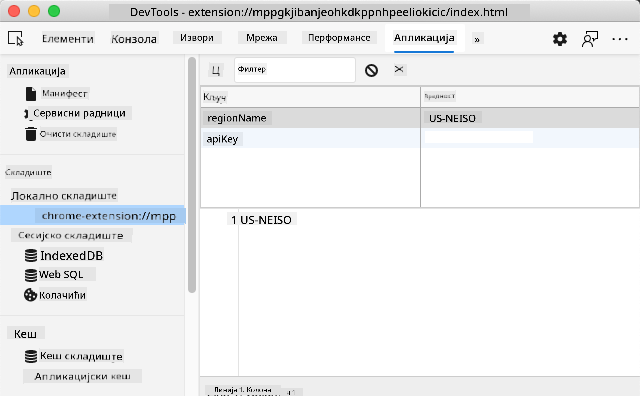

<!--
CO_OP_TRANSLATOR_METADATA:
{
  "original_hash": "e10f168beac4e7b05e30e0eb5c92bf11",
  "translation_date": "2025-08-28T10:13:48+00:00",
  "source_file": "5-browser-extension/2-forms-browsers-local-storage/README.md",
  "language_code": "sr"
}
-->
# Пројекат за проширење прегледача, део 2: Позив API-ја, коришћење локалног складишта

## Квиз пре предавања

[Квиз пре предавања](https://ff-quizzes.netlify.app/web/quiz/25)

### Увод

У овој лекцији, позваћете API тако што ћете послати форму вашег проширења за прегледач и приказати резултате у самом проширењу. Поред тога, научићете како можете чувати податке у локалном складишту вашег прегледача за будућу употребу.

✅ Пратите нумерисане сегменте у одговарајућим датотекама како бисте знали где да поставите свој код.

### Постављање елемената за манипулацију у проширењу:

До сада сте направили HTML за форму и `<div>` за резултате вашег проширења за прегледач. Од сада ћете радити у датотеци `/src/index.js` и градити своје проширење корак по корак. Погледајте [претходну лекцију](../1-about-browsers/README.md) за подешавање пројекта и процес изградње.

Радећи у вашој датотеци `index.js`, почните тако што ћете креирати неке `const` променљиве које ће држати вредности повезане са различитим пољима:

```JavaScript
// form fields
const form = document.querySelector('.form-data');
const region = document.querySelector('.region-name');
const apiKey = document.querySelector('.api-key');

// results
const errors = document.querySelector('.errors');
const loading = document.querySelector('.loading');
const results = document.querySelector('.result-container');
const usage = document.querySelector('.carbon-usage');
const fossilfuel = document.querySelector('.fossil-fuel');
const myregion = document.querySelector('.my-region');
const clearBtn = document.querySelector('.clear-btn');
```

Сва ова поља се референцирају преко њихових CSS класа, како сте их поставили у HTML-у у претходној лекцији.

### Додавање слушача догађаја

Затим, додајте слушаче догађаја за форму и дугме за ресетовање које ресетује форму, тако да се нешто деси када корисник пошаље форму или кликне на дугме за ресетовање. На крају додајте позив за иницијализацију апликације на дну датотеке:

```JavaScript
form.addEventListener('submit', (e) => handleSubmit(e));
clearBtn.addEventListener('click', (e) => reset(e));
init();
```

✅ Обратите пажњу на скраћеницу која се користи за слушање догађаја `submit` или `click`, и како се догађај прослеђује функцијама `handleSubmit` или `reset`. Можете ли написати еквивалент ове скраћенице у дужем формату? Који формат вам више одговара?

### Изградња функција `init()` и `reset()`:

Сада ћете изградити функцију која иницијализује проширење, а која се зове `init()`:

```JavaScript
function init() {
	//if anything is in localStorage, pick it up
	const storedApiKey = localStorage.getItem('apiKey');
	const storedRegion = localStorage.getItem('regionName');

	//set icon to be generic green
	//todo

	if (storedApiKey === null || storedRegion === null) {
		//if we don't have the keys, show the form
		form.style.display = 'block';
		results.style.display = 'none';
		loading.style.display = 'none';
		clearBtn.style.display = 'none';
		errors.textContent = '';
	} else {
        //if we have saved keys/regions in localStorage, show results when they load
        displayCarbonUsage(storedApiKey, storedRegion);
		results.style.display = 'none';
		form.style.display = 'none';
		clearBtn.style.display = 'block';
	}
};

function reset(e) {
	e.preventDefault();
	//clear local storage for region only
	localStorage.removeItem('regionName');
	init();
}

```

У овој функцији постоји занимљива логика. Читајући је, можете ли видети шта се дешава?

- Постављају се два `const` да провере да ли је корисник сачувао APIKey и регионални код у локалном складишту.
- Ако је било који од њих `null`, приказује се форма тако што се њен стил мења на 'block'.
- Сакривају се резултати, учитавање и дугме `clearBtn`, а текст грешке се поставља на празан стринг.
- Ако постоје кључ и регион, покреће се рутина за:
  - позивање API-ја за добијање података о емисији угљеника,
  - сакривање области резултата,
  - сакривање форме,
  - приказивање дугмета за ресетовање.

Пре него што наставите, корисно је научити о веома важном концепту доступном у прегледачима: [LocalStorage](https://developer.mozilla.org/docs/Web/API/Window/localStorage). LocalStorage је користан начин за чување стрингова у прегледачу као `key-value` парова. Овај тип веб складишта може се манипулисати JavaScript-ом за управљање подацима у прегледачу. LocalStorage не истиче, док се SessionStorage, друга врста веб складишта, брише када се прегледач затвори. Различите врсте складишта имају своје предности и мане.

> Напомена - ваше проширење за прегледач има своје локално складиште; главни прозор прегледача је другачија инстанца и понаша се одвојено.

Ваш APIKey постављате да има стринг вредност, на пример, и можете видети да је постављен у Edge-у тако што "инспектирате" веб страницу (можете десним кликом на прегледач да инспектирате) и одете на картицу Applications да видите складиште.



✅ Размислите о ситуацијама у којима НЕ бисте желели да чувате неке податке у LocalStorage. Уопштено, постављање API кључева у LocalStorage је лоша идеја! Можете ли видети зашто? У нашем случају, пошто је наша апликација искључиво за учење и неће бити објављена у продавници апликација, користићемо овај метод.

Приметите да користите Web API за манипулацију LocalStorage-ом, било коришћењем `getItem()`, `setItem()`, или `removeItem()`. Широко је подржан у прегледачима.

Пре него што изградите функцију `displayCarbonUsage()` која се позива у `init()`, направимо функционалност за обраду почетног слања форме.

### Обрада слања форме

Креирајте функцију названу `handleSubmit` која прихвата аргумент догађаја `(e)`. Зауставите догађај да се не шири (у овом случају, желимо да спречимо прегледач да се освежи) и позовите нову функцију, `setUpUser`, прослеђујући аргументе `apiKey.value` и `region.value`. На овај начин користите две вредности које се уносе преко почетне форме када се одговарајућа поља попуне.

```JavaScript
function handleSubmit(e) {
	e.preventDefault();
	setUpUser(apiKey.value, region.value);
}
```

✅ Освежите своје памћење - HTML који сте поставили у претходној лекцији има два улазна поља чије се `вредности` хватају преко `const` које сте поставили на врху датотеке, и оба су `required`, тако да прегледач спречава кориснике да унесу празне вредности.

### Постављање корисника

Прелазимо на функцију `setUpUser`, овде постављате вредности локалног складишта за `apiKey` и `regionName`. Додајте нову функцију:

```JavaScript
function setUpUser(apiKey, regionName) {
	localStorage.setItem('apiKey', apiKey);
	localStorage.setItem('regionName', regionName);
	loading.style.display = 'block';
	errors.textContent = '';
	clearBtn.style.display = 'block';
	//make initial call
	displayCarbonUsage(apiKey, regionName);
}
```

Ова функција поставља поруку о учитавању која се приказује док се API позива. У овом тренутку, стигли сте до креирања најважније функције овог проширења за прегледач!

### Приказивање емисије угљеника

Коначно, време је да упитате API!

Пре него што наставимо, требало би да разговарамо о API-јевима. API-ји, или [Интерфејси за програмирање апликација](https://www.webopedia.com/TERM/A/API.html), су критичан елемент у алатима веб програмера. Они пружају стандардне начине за програме да међусобно комуницирају. На пример, ако градите веб сајт који треба да упита базу података, неко је можда креирао API који можете користити. Иако постоји много врста API-ја, један од најпопуларнијих је [REST API](https://www.smashingmagazine.com/2018/01/understanding-using-rest-api/).

✅ Термин 'REST' означава 'Пренос репрезентативног стања' и подразумева коришћење различито конфигурисаних URL-ова за преузимање података. Истражите мало различите врсте API-ја доступних програмерима. Који формат вам се највише допада?

Постоје важне ствари које треба приметити у овој функцији. Прво, приметите [`async` кључну реч](https://developer.mozilla.org/docs/Web/JavaScript/Reference/Statements/async_function). Писање ваших функција тако да раде асинхроно значи да чекају да се нека акција, као што је враћање података, заврши пре него што наставе.

Ево кратког видеа о `async`:

[](https://youtube.com/watch?v=YwmlRkrxvkk "Async и Await за управљање обећањима")

> 🎥 Кликните на слику изнад за видео о async/await.

Креирајте нову функцију за упитивање C02Signal API-ја:

```JavaScript
import axios from '../node_modules/axios';

async function displayCarbonUsage(apiKey, region) {
	try {
		await axios
			.get('https://api.co2signal.com/v1/latest', {
				params: {
					countryCode: region,
				},
				headers: {
					'auth-token': apiKey,
				},
			})
			.then((response) => {
				let CO2 = Math.floor(response.data.data.carbonIntensity);

				//calculateColor(CO2);

				loading.style.display = 'none';
				form.style.display = 'none';
				myregion.textContent = region;
				usage.textContent =
					Math.round(response.data.data.carbonIntensity) + ' grams (grams C02 emitted per kilowatt hour)';
				fossilfuel.textContent =
					response.data.data.fossilFuelPercentage.toFixed(2) +
					'% (percentage of fossil fuels used to generate electricity)';
				results.style.display = 'block';
			});
	} catch (error) {
		console.log(error);
		loading.style.display = 'none';
		results.style.display = 'none';
		errors.textContent = 'Sorry, we have no data for the region you have requested.';
	}
}
```

Ово је велика функција. Шта се овде дешава?

- Пратећи најбоље праксе, користите `async` кључну реч да би ова функција радила асинхроно. Функција садржи `try/catch` блок јер ће вратити обећање када API врати податке. Пошто немате контролу над брзином којом ће API одговорити (можда уопште неће одговорити!), морате управљати овом неизвесношћу тако што ћете је позвати асинхроно.
- Упитујете co2signal API да бисте добили податке о вашем региону, користећи ваш API кључ. Да бисте користили тај кључ, морате користити врсту аутентификације у параметрима заглавља.
- Када API одговори, додељујете различите елементе његовог одговора деловима вашег екрана које сте поставили за приказивање ових података.
- Ако постоји грешка или нема резултата, приказујете поруку о грешци.

✅ Коришћење асинхроних програмских образаца је још један веома користан алат у вашем алатнику. Прочитајте [о различитим начинима](https://developer.mozilla.org/docs/Web/JavaScript/Reference/Statements/async_function) на које можете конфигурисати ову врсту кода.

Честитамо! Ако изградите своје проширење (`npm run build`) и освежите га у панелу за проширења, имате функционално проширење! Једина ствар која не ради је икона, а то ћете поправити у следећој лекцији.

---

## 🚀 Изазов

Разговарали смо о неколико врста API-ја до сада у овим лекцијама. Изаберите веб API и истражите детаљно шта нуди. На пример, погледајте API-је доступне у прегледачима као што је [HTML Drag and Drop API](https://developer.mozilla.org/docs/Web/API/HTML_Drag_and_Drop_API). Шта по вашем мишљењу чини добар API?

## Квиз после предавања

[Квиз после предавања](https://ff-quizzes.netlify.app/web/quiz/26)

## Преглед и самостално учење

У овој лекцији сте научили о LocalStorage-у и API-јевима, оба веома корисна за професионалног веб програмера. Можете ли размислити о томе како ова два концепта раде заједно? Размислите о томе како бисте дизајнирали веб сајт који би чувао ставке које ће користити API.

## Задатак

[Усвојите API](assignment.md)

---

**Одрицање од одговорности**:  
Овај документ је преведен коришћењем услуге за превођење помоћу вештачке интелигенције [Co-op Translator](https://github.com/Azure/co-op-translator). Иако се трудимо да превод буде тачан, молимо вас да имате у виду да аутоматизовани преводи могу садржати грешке или нетачности. Оригинални документ на његовом изворном језику треба сматрати меродавним извором. За критичне информације препоручује се професионални превод од стране људи. Не преузимамо одговорност за било каква погрешна тумачења или неспоразуме који могу настати услед коришћења овог превода.